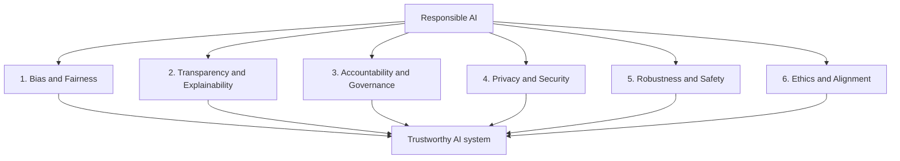
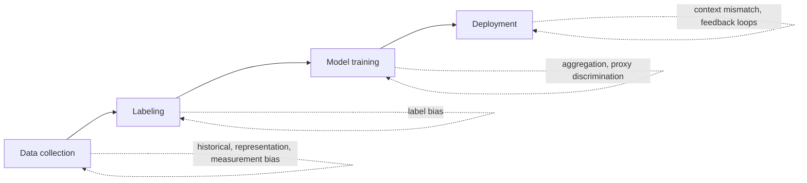
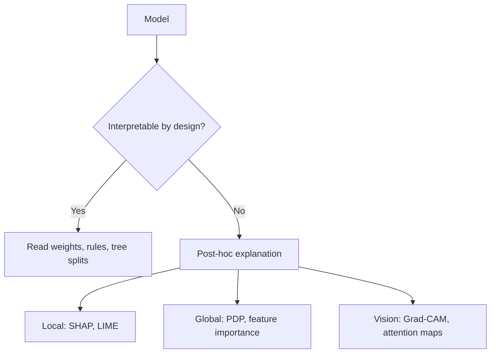
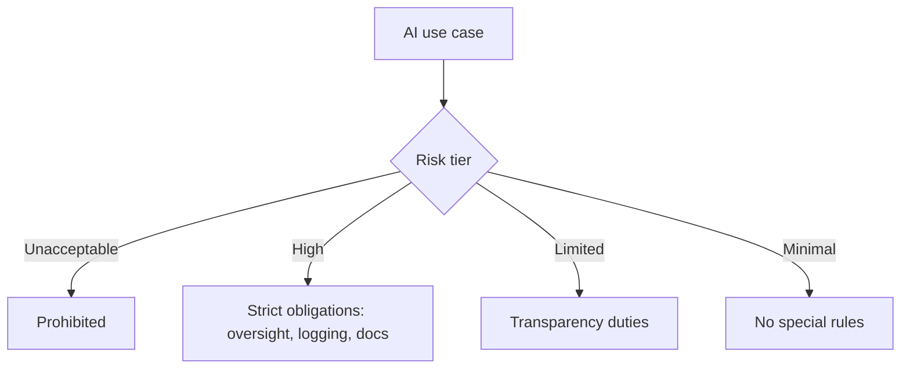
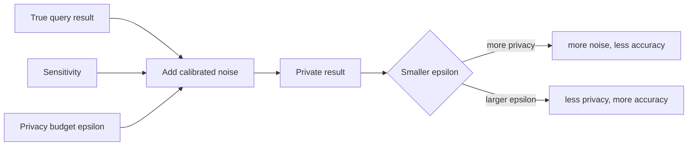
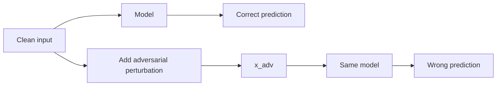
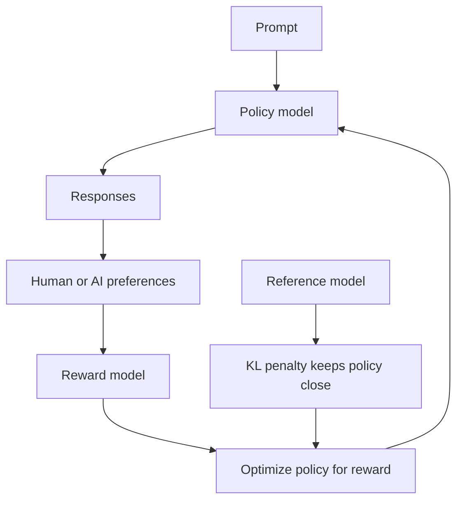

# AI Fundamentals: Ethics, Fairness, and Safety

Before you train a single model, it helps to understand what can go wrong with one. A machine learning system is a powerful pattern finder with no sense of right or wrong. Left unchecked it can quietly discriminate against people, leak the private data it was trained on, be fooled by a crafted input, or make life changing decisions that no one can explain or appeal. This guide builds the field of responsible AI up from first principles, defining every term as it appears, and organizes it around six pillars that every AI engineer needs as core competencies: bias and fairness, transparency and explainability, accountability and governance, privacy and security, robustness and safety, and responsible AI and ethics.

These are not optional extras. Under the EU AI Act and the NIST AI Risk Management Framework, many of them are becoming legal requirements. The notebooks in this section put each pillar into code; this guide gives you the intuition first.

The six pillars and how they relate:

---

## 1. Bias and Fairness

A model is **biased** when it systematically produces worse or unfair outcomes for one group of people than for another. Because models learn from data, and data reflects the world including its history of discrimination, bias is the *default* outcome unless you actively measure and correct for it. The `01_bias_and_fairness.ipynb` notebook grounds this in concrete metrics and a worked hiring example.

### 1.1 Where bias comes from

Bias is not one phenomenon. It enters at several stages:

- **Historical bias**: the data faithfully records a discriminatory past, so a model trained on it reproduces that past.
- **Representation bias**: some groups are underrepresented, so the model sees too few examples to learn them well.
- **Measurement bias**: a variable is measured with different accuracy across groups.
- **Aggregation bias**: one model is forced onto genuinely different subpopulations that each need different handling.
- **Evaluation bias**: the benchmark or test set does not represent the population the model serves.
- **Deployment bias**: the model is used in a context different from the one it was trained for.

A subtle trap is **proxy discrimination**: even after you remove a protected attribute like race, a seemingly neutral variable like ZIP code can reconstruct it. Fairness has to be measured, never assumed.

### 1.2 Fairness definitions

There is no single mathematical definition of fair. Writing `Y` for the true outcome, `Yhat` for the prediction, and `A` for a protected group:

- **Demographic (statistical) parity**: every group receives positive predictions at the same rate. The common legal yardstick is the **disparate impact ratio** (minority positive rate divided by majority positive rate), which should be at least 0.8 under the US "80 percent rule".
- **Equal opportunity**: among people who truly qualify, each group is approved at the same rate (equal **true positive rates**).
- **Equalized odds**: a stricter version requiring both true positive rate and **false positive rate** to match across groups.
- **Predictive parity (calibration)**: a given predicted probability means the same thing for every group.
- **Individual fairness**: similar individuals receive similar predictions.

### 1.3 The impossibility theorem

These definitions cannot all hold at once. The **Chouldechova (2017) impossibility result** proves that when groups have different base rates, you cannot simultaneously achieve predictive parity, equal false positive rates, and equal false negative rates. The practical consequence is that choosing a fairness criterion is a value judgment, not a technical optimization. Engineers and stakeholders must decide which notion matters for their context.

### 1.4 Mitigation

Fixes land at three stages: **pre-processing** (reweight or relabel the data before training), **in-processing** (add a fairness constraint to the training objective, as Fairlearn's reductions do), and **post-processing** (adjust decision thresholds per group, as in equalized-odds post-processing). Tools: **Fairlearn**, **AIF360**, and the **What-If Tool**.

---

## 2. Transparency and Explainability

A model is **transparent** when a human can inspect how it works, and **explainable** when, even if the internals are opaque, we can produce a faithful account of why it made a given prediction. The `02_transparency_and_explainability.ipynb` notebook implements the core methods from scratch.

### 2.1 Interpretable versus explainable

An **interpretable** model is simple enough to understand directly, such as a short decision tree or a linear model where each weight reads as a contribution. A complex model like a deep network is not interpretable, so we attach **post-hoc explanations** after the fact. Explanations are also either **global** (how the model behaves overall) or **local** (why this one prediction).

### 2.2 The main methods

- **SHAP** assigns each feature a **Shapley value**, a concept borrowed from cooperative game theory: it fairly splits a prediction among the features by averaging each feature's marginal contribution over all orderings.
- **LIME** explains one prediction by fitting a simple linear model to the complex model's behavior in a small neighborhood around that point.
- **Partial Dependence Plots (PDP)** show the average effect of one feature across the dataset, while **Individual Conditional Expectation (ICE)** curves show that effect for each individual row.
- **Grad-CAM** highlights the image regions a convolutional network relied on, and **attention visualization** does the analogous job for transformers.

### 2.3 Documentation as transparency

Transparency is also a paperwork discipline. **Model cards** document a model's intended use, training data, metrics broken down by subgroup, and known limitations. **Datasheets for datasets** do the same for the data. These artifacts make a model auditable by people who will never read its code. Tools: **SHAP**, **LIME**, **InterpretML**, **Alibi**.

---

## 3. Accountability and Governance

Accountability answers a simple question: when an AI system causes harm, who is responsible, and how is it put right? **Governance** is the set of policies, roles, and records that make accountability real. The `03_accountability_and_governance.ipynb` notebook turns these frameworks into runnable checklists.

### 3.1 The EU AI Act

The EU AI Act classifies systems by risk and regulates them accordingly:

- **Unacceptable risk**: prohibited outright (for example social scoring by governments).
- **High risk**: allowed but heavily regulated (for example AI in hiring, credit, or medical devices), with obligations for risk management, data quality, logging, human oversight, and documentation.
- **Limited risk**: transparency duties, such as telling users they are talking to a chatbot.
- **Minimal risk**: largely unregulated (for example a spam filter).

### 3.2 The NIST AI Risk Management Framework

The **NIST AI RMF** is a voluntary US framework built on four functions that run continuously:

- **Govern**: build a culture and policies for managing AI risk.
- **Map**: understand the context and identify risks.
- **Measure**: analyze and track those risks with metrics.
- **Manage**: act on the risks by priority.

Complementary standards include **ISO/IEC 42001** (an AI management system standard), the **OECD AI Principles**, and the **UNESCO Recommendation on the Ethics of AI**. In practice, governance also requires a **model registry** with versioning, **audit trails** that log decisions, and **redress mechanisms** so people affected by a decision can contest it.

---

## 4. Privacy and Security

A model can memorize and leak the data it was trained on, so protecting people's data is part of building the model, not an afterthought. The `04_privacy_and_security.ipynb` notebook implements the core privacy mechanisms in NumPy.

### 4.1 Differential privacy

**Differential privacy (DP)** is a mathematical guarantee that the output of an analysis barely changes whether or not any single person's record is included. Formally, a mechanism M is epsilon-differentially private if for any two datasets D and D' differing in one record, and any set of outcomes S:

$$\Pr[M(D) \in S] \le e^{\epsilon}\, \Pr[M(D') \in S]$$

The parameter **epsilon** is the privacy budget: smaller means more privacy and more noise. You achieve DP by adding calibrated noise scaled to the query's **sensitivity** (how much one record can change the answer): the **Laplace mechanism** adds Laplace noise with scale sensitivity/epsilon, and the **Gaussian mechanism** adds Gaussian noise for the relaxed (epsilon, delta) form.

### 4.2 Private training and decentralization

**DP-SGD** makes model *training* private: it clips each example's gradient to a bounded norm and adds Gaussian noise before the update, so no single example can swing the model much. **Federated learning** trains across many devices without centralizing raw data: each client trains locally and only model updates are averaged (**FedAvg**), often combined with **secure aggregation** so the server never sees an individual update. Related techniques include **homomorphic encryption** (compute on encrypted data) and **synthetic data** generation. Tools: **Opacus**, **TensorFlow Privacy**, **Diffprivlib**, **PySyft**.

---

## 5. Robustness and Safety

A model is **robust** when small, deliberately crafted changes to its input do not flip its output. Attacks that exploit the lack of robustness are **adversarial examples**, and they matter wherever a model faces an adversary: spam, fraud, malware, content moderation, autonomous driving. The `05_robustness_and_safety.ipynb` notebook builds the canonical attacks from scratch.

### 5.1 Attacks

- **FGSM** (Fast Gradient Sign Method) perturbs the input one step in the direction that most increases the loss: $x_{adv} = x + \epsilon \cdot \mathrm{sign}(\nabla_x J(\theta, x, y))$.
- **PGD** (Projected Gradient Descent) iterates FGSM in small steps, projecting back into an epsilon-sized ball each time, and is a much stronger attack.
- **Carlini-Wagner (CW)** and **DeepFool** find minimal perturbations by optimization, and **AutoAttack** bundles several attacks into a reliable benchmark.

### 5.2 Defenses and broader safety

The strongest practical defense is **adversarial training**: generate adversarial examples during training and learn on them. **Randomized smoothing** and other **certified defenses** give provable robustness guarantees within a radius. Beyond crafted inputs, robustness also covers **distribution shift** and **out-of-distribution detection** (knowing when an input is unlike anything seen in training), and security threats like **data poisoning** and **backdoor attacks** that corrupt the model through its training data. Tools: **Adversarial Robustness Toolbox (ART)**, **Foolbox**, **CleverHans**.

---

## 6. Responsible AI and Ethics

The final pillar ties the others to human values and asks how we keep increasingly capable systems aligned with what people actually want. The `06_responsible_ai_and_ethics.ipynb` notebook makes the safety mechanisms concrete.

### 6.1 Principles

Most ethics frameworks converge on five principles: **beneficence** (do good), **non-maleficence** (do no harm), **autonomy** (respect human choice and consent), **justice** (distribute benefits and harms fairly), and **explicability** (be transparent and accountable). These connect the abstract idea of ethics back to pillars one through five.

### 6.2 Alignment in practice

Modern language models are aligned mainly through **RLHF** (reinforcement learning from human feedback). Humans rank model outputs, a **reward model** learns those preferences (often via the **Bradley-Terry** model, where the chance that response a is preferred to b is a sigmoid of their score difference), and the policy is then optimized to score well while a **KL penalty** keeps it close to the original model so it does not drift into degenerate behavior. **Constitutional AI** replaces much of the human labeling with a written set of principles the model uses to critique and revise its own answers.

### 6.3 Guardrails and oversight

Around the model sit operational safeguards: **red teaming** (deliberately trying to make the model misbehave to find weaknesses before attackers do), **content moderation and guardrails** that filter unsafe inputs and outputs (for example **Llama Guard** or **Guardrails AI**), attention to the **environmental impact** of large-scale training, and **human-in-the-loop** oversight so a person stays accountable for high-stakes decisions.

---

## Putting it together

The pillars are not a checklist you complete once. They run through the whole lifecycle: you assess fairness and privacy when you collect data, build in explainability when you design the model, test robustness before you ship, and keep governance, monitoring, and human oversight running in production. The healthy habit is ethics first: start every project with an impact assessment rather than bolting these concerns on at the end. Skim this guide for intuition, then open each notebook to see the mechanism in code.
