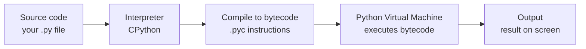
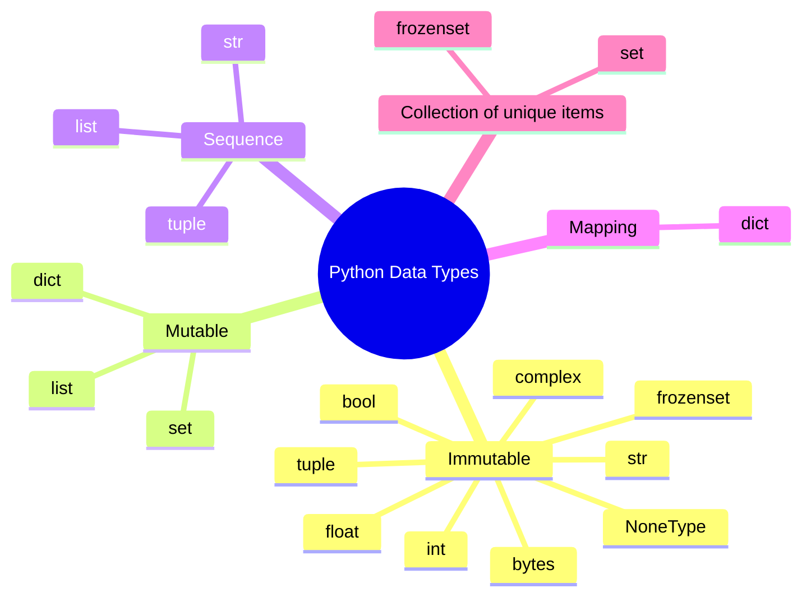
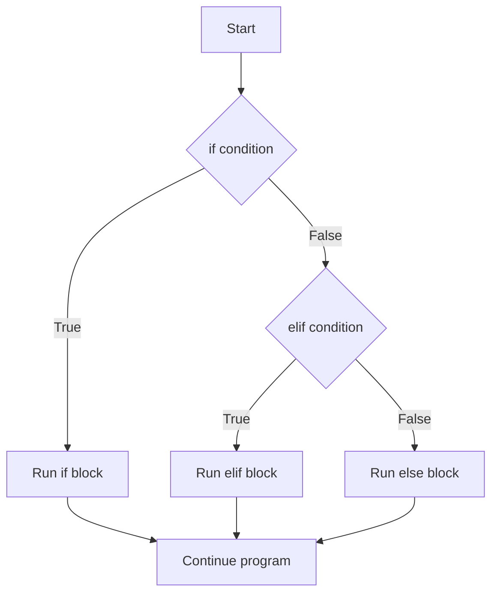
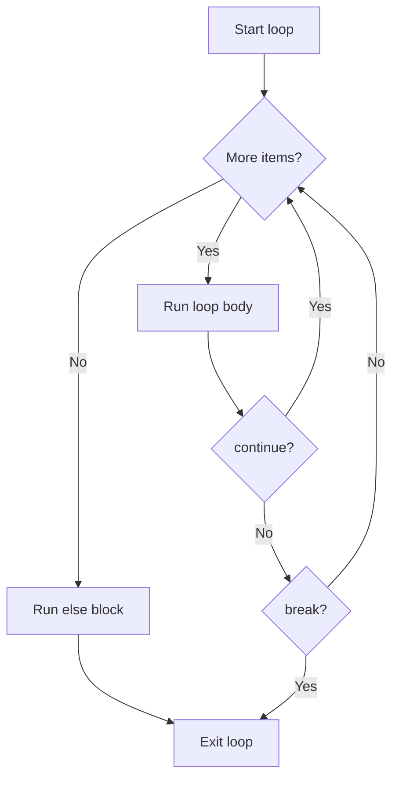
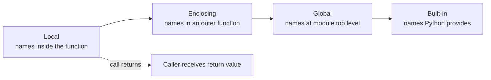
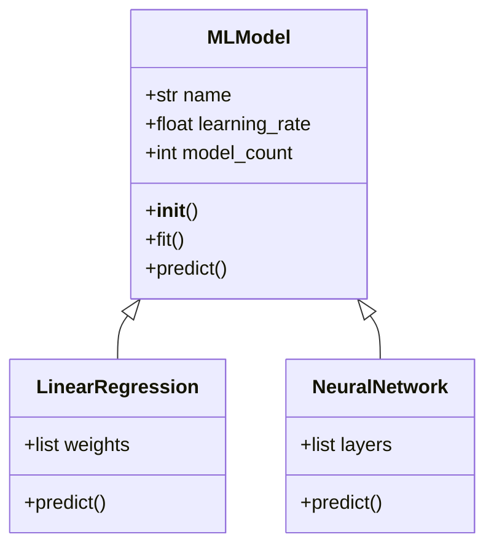
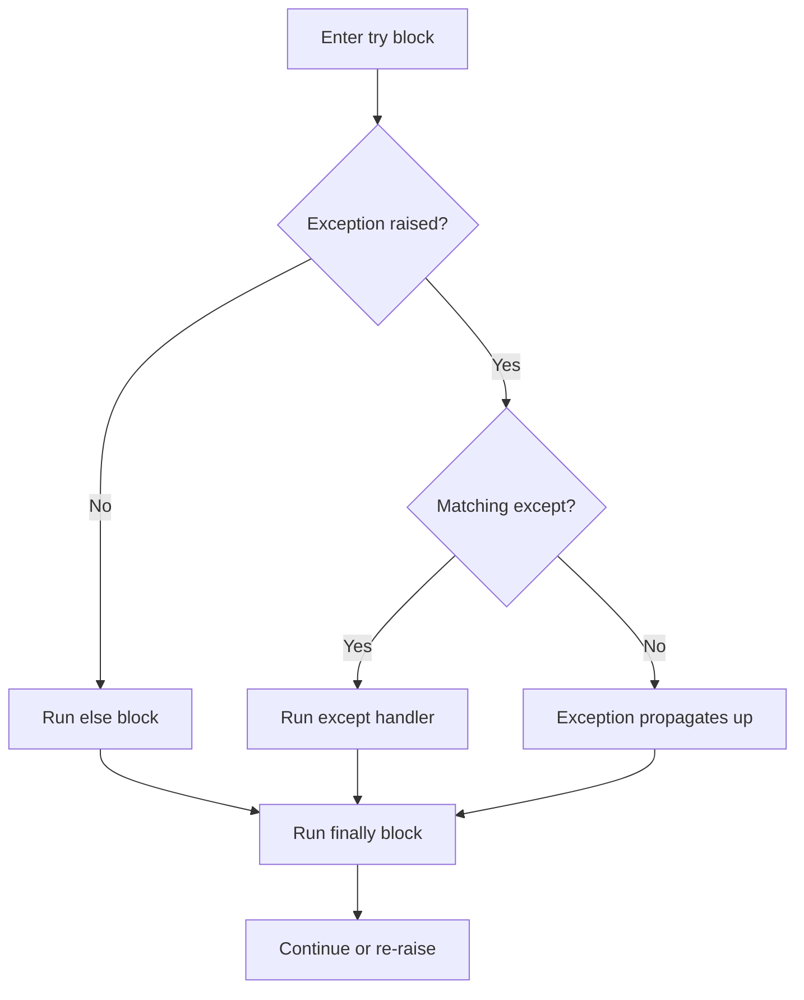

# Python: A Complete Conceptual Guide

Python is one of the most widely used programming languages in the world, and the single most important language for artificial intelligence and machine learning. This guide teaches Python from the very beginning assuming you have never written a line of code and carries you all the way through the advanced internals that power libraries like NumPy, PyTorch, and Hugging Face Transformers. Every term is defined the first time it appears, and every concept is explained in plain language before any jargon is used.

The material is organized to match three notebooks that accompany it:

- `01_basic.ipynb` the fundamentals: variables, data types, collections, control flow, functions, classes, files, errors, modules, comprehensions.
- `02_industrial.ipynb` the patterns used in real production codebases: type hints, decorators, context managers, logging, testing, design patterns, concurrency, async, dataclasses, packaging, configuration, and profiling.
- `03_advanced.ipynb` the rarely-used-but-powerful machinery: metaclasses, descriptors, protocols, deep generators and coroutines, memory management, operator overloading, bytecode, and functional programming tools.

Read top to bottom and you will understand all of it.

---

## What Is Python and How Does It Run?

A **programming language** is a structured way of writing instructions that a computer can carry out. **Python** is a particular language, created by Guido van Rossum and first released in 1991, designed above all to be readable Python code tends to look almost like plain English, which is a large part of why it became so popular.

A few words describe Python's character, and each one matters:

- **High-level** means Python hides the messy details of how the computer's hardware actually works (memory addresses, processor registers) so you can focus on the problem you are solving rather than on the machine.
- **Interpreted** means Python code is run by another program called the **interpreter**, which reads your instructions and executes them one at a time. This is different from a **compiled** language (like C), where the whole program is translated into raw machine instructions ahead of time before it ever runs. Because Python is interpreted, you can run code immediately and experiment quickly you type a line, and it happens.
- **Dynamically typed** means you do not have to announce in advance what kind of data each variable holds; Python figures it out as the program runs. (We will unpack "type" in a moment.)
- **General-purpose** means Python is not limited to one domain. People use it for websites, automation scripts, data analysis, scientific computing, and crucially for us artificial intelligence.

### Why Python Dominates AI/ML

- It has an enormous **ecosystem** of ready-made tools (called **libraries** or **packages**): NumPy for numerical math, Pandas for tables of data, and PyTorch, TensorFlow, and Scikit-learn for machine learning.
- Its simple syntax lets researchers experiment fast the time from idea to working prototype is short.
- It acts as a **glue language**: the heavy numerical work inside NumPy and PyTorch is actually written in fast lower-level languages like C and C++, while Python provides the friendly interface on top. You get the convenience of Python and the speed of C at the same time.

When you run a Python program, the interpreter first quietly translates your source code into an intermediate form called **bytecode** (a compact set of simple instructions), then executes that bytecode step by step. You normally never see this happening but it is real, and the advanced notebook even inspects it, which we will cover near the end.

How Python runs your code, from source text to visible output:

---

## Variables and Data Types

### Variables

A **variable** is a name that refers to a piece of data. You create one by writing a name, an equals sign, and a value for example, giving the name `age` the value `25`. From then on, wherever you write `age`, Python substitutes the value it refers to.

In Python, a variable is best thought of not as a box that *contains* a value, but as a **label** that *points at* a value living somewhere in the computer's memory. This distinction becomes important later when we discuss mutability and copying.

Because Python is dynamically typed, a single variable can point at different kinds of values over its lifetime. The same name `x` can refer to a number, then later to text, then later to a list Python allows all of this, reassigning the label freely. In `01_basic.ipynb`, the cell on variables demonstrates exactly this by pointing `x` at an integer, then a string, then a list in succession.

### Data Types

A **type** is the category a piece of data belongs to, which determines what you can do with it. You would not divide a word by two, but you would divide a number. Python's core built-in types are:

| Type | What it is | Example |
|------|-----------|---------|
| `int` | An integer (whole number), with no upper limit on size | `42`, `-7`, `0` |
| `float` | A number with a decimal point (a "floating-point" number) | `3.14`, `-0.001` |
| `complex` | A number with a real and an imaginary part | `3 + 4j` |
| `bool` | A truth value, either `True` or `False` | `True` |
| `str` | A **string** a sequence of text characters | `'hello'` |
| `bytes` | A sequence of raw bytes (8-bit values), used for binary data | `b'hello'` |
| `list` | An ordered, changeable collection | `[1, 2, 3]` |
| `tuple` | An ordered, unchangeable collection | `(1, 2, 3)` |
| `set` | An unordered collection of unique items | `{1, 2, 3}` |
| `dict` | A collection of key-to-value pairs | `{'a': 1}` |
| `NoneType` | The type of `None`, representing "no value" | `None` |

A few notes that beginners trip over:

- **Integers in Python have unlimited precision.** Many languages cap how large an integer can be; Python does not. You can compute astronomically large numbers without overflow.
- A `float` is stored in 64 bits and is only an *approximation* of a real number, which is why floating-point arithmetic sometimes produces tiny rounding errors.
- `None` is a special object meaning "nothing here yet." It is commonly used as a placeholder for instance, setting `model = None` before a model has been created.
- You can make long numbers readable by inserting underscores, like `1_000_000`, which Python simply ignores. You can write very large or small floats in **scientific notation**, like `1.5e-3`, which means 1.5 times ten to the power of minus three (that is, 0.0015).

### Checking and Converting Types

To ask "what type is this value?", Python provides the `type()` function, and to ask "is this value of a particular type?", it provides `isinstance()`. The latter is generally preferred for checks because it also understands inheritance (a concept covered under classes).

**Type conversion**, also called **casting**, means turning a value of one type into another. The string `'42'` is text, not a number but `int('42')` produces the actual integer `42`, `float('42')` produces `42.0`, and `str(42)` turns a number back into text. Converting to `bool` follows a simple rule: zero, empty collections, empty strings, and `None` become `False`; almost everything else becomes `True`. The basic notebook's type-conversion cell walks through each of these.

### Identity, Memory, and the `id()` Function

Every object in Python lives at a location in memory, and `id()` returns a number identifying that location. This is the tool that reveals the "label, not box" nature of variables. If you write `b = a`, then `b` and `a` are two labels pointing at the *same* object their `id()` values match. If instead you make a *copy*, you get a brand-new object at a different location with a different `id()`. The basic notebook demonstrates this directly: assigning one list to another shares the object, while calling `.copy()` produces an independent one.

### Mutable vs Immutable

This is one of the most important ideas in Python.

- An **immutable** object cannot be changed after it is created. Numbers, strings, tuples, and frozensets are immutable. If you "change" a string, Python actually builds a new string.
- A **mutable** object can be changed in place. Lists, dictionaries, and sets are mutable.

The consequence: if two labels point at the same *mutable* object, changing it through one label changes what the other sees too, because there is only one underlying object. This is why understanding `id()` and copying matters in real code, especially when passing data around.

A taxonomy of Python's built-in data types, grouped by whether they can be changed in place:

---

## Operators

An **operator** is a symbol that performs an operation on one or more values (the values it acts on are called **operands**).

### Arithmetic Operators

These do math:

| Operator | Meaning | Example | Result |
|----------|---------|---------|--------|
| `+` | Addition | `5 + 3` | `8` |
| `-` | Subtraction | `5 - 3` | `2` |
| `*` | Multiplication | `5 * 3` | `15` |
| `/` | True division (always gives a float) | `17 / 5` | `3.4` |
| `//` | Floor division (drops the fractional part) | `17 // 5` | `3` |
| `%` | Modulo (the remainder after division) | `17 % 5` | `2` |
| `**` | Exponentiation (power) | `2 ** 8` | `256` |

The distinction between `/` and `//` catches beginners: `/` keeps the decimal part, while `//` rounds down to a whole number. The modulo operator `%` is unexpectedly useful it tells you the remainder, which is how you check whether a number is even (`x % 2 == 0`) or iterate in cycles.

### Comparison Operators

These compare two values and produce a `bool`: `==` (equal), `!=` (not equal), `<`, `>`, `<=`, and `>=`. Note the double equals for comparison a single `=` is assignment, not comparison, and confusing the two is a classic mistake.

A subtlety: `5 == 5.0` is `True` because the **values** are equal, even though one is an int and one is a float.

### Logical Operators

These combine truth values: `and` is `True` only when both sides are true; `or` is `True` when at least one side is true; `not` flips a truth value.

Python uses **short-circuit evaluation**: it stops as soon as the answer is determined. In `x != 0 and 10 / x > 1`, if `x` is zero the first part is already `False`, so Python never evaluates `10 / x` and thus never divides by zero. This is not just an optimization it is a safety pattern you will rely on.

### Identity and Membership Operators

- `is` and `is not` check whether two names point at the *same object in memory* the same question `id()` answers. This is different from `==`, which checks whether two values are *equal*. Two separate lists with identical contents are `==` but not `is`. (Python will even warn you if you use `is` to compare against a literal number, because you almost always meant `==`.)
- `in` and `not in` check **membership** whether a value appears inside a collection, such as `'banana' in fruits`.

### Bitwise Operators

These operate on the individual binary bits of integers: `&` (AND), `|` (OR), `^` (XOR), `~` (NOT), `<<` (left shift), and `>>` (right shift). Shifting left by one multiplies by two; shifting right divides by two. These appear in systems programming and in machine learning when working with masks. The basic notebook shows each one operating on binary literals like `0b1010`.

### The Walrus Operator

Introduced in Python 3.8, the **walrus operator** `:=` both assigns a value to a variable and returns that value, all in one expression. This lets you, for example, compute a length, store it in `n`, and test it in a single `if` line: `if (n := len(data)) > 3`. It saves a line and avoids computing the same thing twice.

---

## Strings

A **string** (`str`) is a sequence of text characters. Strings are central to AI work natural language processing, reading configuration, and interacting with language models all revolve around text.

You can write a string with single quotes, double quotes, or for text spanning several lines triple quotes. Two special forms exist:

- A **raw string**, written with an `r` prefix like `r'raw\nstring'`, treats backslashes literally instead of interpreting them as escape codes. This is invaluable for file paths and regular expressions.
- A **bytes literal**, written with a `b` prefix, is not really a string but a sequence of raw bytes.

### Immutability, Indexing, and Slicing

Strings are **immutable** once created they cannot be altered in place. Any operation that seems to modify a string actually returns a new one.

Characters in a string are numbered by **index**, starting at `0` for the first character. Negative indices count from the end, so `-1` is the last character. **Slicing** extracts a range using the form `s[start:stop:step]`: `s[1:4]` takes characters 1 through 3 (the `stop` index is excluded), and the elegant `s[::-1]` reverses a string by stepping backward.

### f-strings

An **f-string** (formatted string literal, available since Python 3.6) is the modern, preferred way to build strings that include variable values. You prefix the string with `f` and place expressions inside curly braces: `f'Hello {name}'` inserts the value of `name`. You can format numbers inside the braces too `f'{score:.2f}'` shows the number with exactly two decimal places. A convenient debugging trick, `f'{2**10 = }'`, prints both the expression and its result.

### String Methods

A **method** is a function that belongs to an object and is called with a dot, like `text.strip()`. Strings come with a rich set of methods, all of which return new strings (because strings are immutable):

- **Cleaning and case:** `.strip()` removes surrounding whitespace; `.lower()` and `.upper()` change case; `.title()` capitalizes each word.
- **Searching and editing:** `.replace(old, new)` substitutes text; `.find(sub)` returns the index of a substring (or `-1` if absent); `.count(sub)` counts occurrences; `.startswith()` and `.endswith()` test the ends.
- **Splitting and joining:** `.split()` breaks a string into a list of pieces (splitting on whitespace by default), which is the foundation of **tokenization** breaking text into words. The reverse, `','.join(list)`, glues a list of strings together with a separator.
- **Content tests:** `.isdigit()`, `.isalpha()`, `.isalnum()`, and `.isspace()` report whether a string consists entirely of digits, letters, letters-and-digits, or whitespace.

The basic notebook's strings cell runs through indexing, slicing, f-string formatting, and all of these methods on example sentences.

---

## Lists

A **list** is a **mutable, ordered sequence** the most flexible and most used collection in Python. "Ordered" means the items keep their position; "mutable" means you can change, add, and remove items after creation.

You write a list with square brackets: `[1, 2, 3]`. A list can hold values of any types mixed together, and it can even contain other lists a **nested list** like `[[1, 2], [3, 4]]` behaves like a grid or matrix, which is how raw tabular data is often represented.

Lists are indexed and sliced exactly like strings, but because they are mutable you can also assign to a position to replace an element: `nums[0] = 100`.

### List Methods

- **Adding:** `.append(x)` adds one item to the end; `.insert(i, x)` inserts at a position; `.extend(other)` tacks on every item from another list.
- **Removing:** `.remove(value)` deletes the first matching value; `.pop()` removes and *returns* the last item (or the item at a given index), which is useful when you want the value back.
- **Ordering:** `.sort()` sorts the list **in place** (changing the original), optionally in reverse; `.reverse()` reverses it in place. The separate built-in `sorted()` returns a *new* sorted list and leaves the original untouched an important difference.
- **Inspecting:** `.count(value)` counts occurrences; `.index(value)` finds the first position of a value.

### Copying: Shallow vs Deep

`.copy()` makes a **shallow copy** a new outer list, but the inner objects are still shared. For a flat list of numbers that is fine. But for a nested list, a shallow copy shares the inner lists, so editing them affects both copies. To duplicate everything all the way down, use `copy.deepcopy()` from the `copy` module, which builds a completely independent clone. The basic notebook imports `copy` precisely for this on its nested example.

### Unpacking

**Unpacking** assigns the elements of a collection to several variables at once: `a, b, c = [1, 2, 3]`. With a starred name, you can capture "the rest": `first, *rest = [1, 2, 3, 4, 5]` puts `1` into `first` and the remaining items into `rest` as a list.

---

## Tuples

A **tuple** is an **immutable, ordered sequence** like a list that can never be changed. You write one with parentheses, `(1, 2, 3)`, though the parentheses are often optional. One quirk to memorize: a single-element tuple needs a trailing comma, `(42,)`, because `(42)` is just the number 42 in parentheses.

Because tuples cannot change, they offer real advantages:

- They are slightly **faster** and lighter than lists.
- They are **hashable**, which (as the dictionaries section explains) means they can serve as dictionary keys or set members lists cannot.
- They naturally express fixed groupings, like the dimensions of data: `(batch_size, seq_len, hidden_dim)`.

Tuples are indexed like lists and support unpacking, which enables the elegant variable swap `a, b = b, a` the right side is packed into a tuple and then unpacked into the left side, exchanging the values with no temporary variable.

### Named Tuples

A plain tuple's elements are accessed by number, which can be cryptic. A **named tuple**, created with `namedtuple` from the `collections` module, gives each position a name while remaining a tuple. After defining `Point = namedtuple('Point', ['x', 'y'])`, you can write `p.x` and `p.y` *and* still use `p[0]` and `p[1]`. This makes data self-documenting. The basic notebook's tuples cell demonstrates both named tuples and the use of plain tuples as dictionary keys.

---

## Sets

A **set** is an **unordered collection of unique elements**. Two properties define it: it never holds duplicates, and it does not preserve insertion order. You write one with curly braces, `{1, 2, 3}` but be careful, because empty curly braces `{}` create a *dictionary*, not a set; for an empty set you must write `set()`.

Sets shine for two tasks:

- **Deduplication:** wrapping a list in `set()` instantly removes repeats, which is how you find the unique labels in a dataset or build a vocabulary.
- **Fast membership testing:** checking whether an item is in a set takes roughly **constant time** regardless of size (written **O(1)** in "big-O" notation, the standard way of describing how an operation's cost grows). Checking membership in a list, by contrast, takes time proportional to the list's length (**O(n)**) because Python may have to scan every element. For large collections this difference is enormous.

### Set Operations

Sets support the operations of mathematical set theory, which makes them powerful:

- **Union** (`a | b`): everything in either set.
- **Intersection** (`a & b`): only items in both.
- **Difference** (`a - b`): items in the first but not the second.
- **Symmetric difference** (`a ^ b`): items in exactly one of the two.

They also offer `.issubset()`, `.issuperset()`, and `.isdisjoint()` to test relationships between sets, and `.add()`, `.discard()` (remove if present, no error otherwise), and `.pop()` (remove an arbitrary element). The basic notebook's sets cell demonstrates all of these.

---

## Dictionaries

A **dictionary** (`dict`) is a collection of **key-value pairs** it maps each unique **key** to an associated **value**, like a real dictionary maps words to definitions. As of Python 3.7 dictionaries preserve insertion order, and they are mutable. You write one with curly braces and colons: `{'name': 'Alice', 'age': 30}`.

Keys must be **hashable** meaning Python can compute a stable identifying number (a **hash**) for them which is why immutable values like strings, numbers, and tuples can be keys, but mutable lists cannot. This hashing is what lets dictionaries look up values almost instantly.

Dictionaries are everywhere in machine learning: storing hyperparameter configurations, mapping labels to numbers, building word-to-index vocabularies, and holding model settings.

### Working With Dictionaries

- **Accessing:** `config['batch_size']` retrieves a value but raises an error (a `KeyError`) if the key is missing. The safer `.get(key, default)` returns a fallback value instead of crashing when the key is absent.
- **Modifying:** assign to a key to update it or create it; `del` removes a key; `.pop(key)` removes a key and returns its value; `.setdefault(key, value)` inserts a key only if it is not already present.
- **Iterating:** looping over a dictionary gives its keys; `.items()` gives key-value pairs together; `.keys()` and `.values()` give each separately.
- **Merging:** the spread syntax `{**a, **b}` combines two dictionaries (with the second winning on conflicts), and Python 3.9 added the cleaner `a | b` for the same purpose.
- **Nesting:** dictionaries can contain dictionaries, so `model_config['encoder']['heads']` drills into a structured configuration.

The basic notebook's dictionaries cell builds an ML hyperparameter config and exercises every one of these operations.

### Comparing the Four Collections

| | List | Tuple | Set | Dict |
|--|------|-------|-----|------|
| **Syntax** | `[1, 2]` | `(1, 2)` | `{1, 2}` | `{'a': 1}` |
| **Ordered?** | Yes | Yes | No | Yes (3.7+) |
| **Mutable?** | Yes | No | Yes | Yes |
| **Duplicates?** | Yes | Yes | No | Keys: no |
| **Indexed by** | Position | Position | (not indexed) | Key |
| **Typical use** | General sequences | Fixed records | Uniqueness, fast lookup | Mappings, configs |

### Arrays vs Lists

Beginners often wonder how a Python list relates to an **array**. An array is a collection of elements that, in most languages, must all be the same type and are stored compactly in memory. Python's built-in `list` is more flexible it can mix types but that flexibility costs memory and speed. For serious numerical work, ML uses **NumPy arrays**, which are true arrays: every element is the same numeric type, stored in a tightly packed block, allowing extremely fast mathematical operations implemented in C. So a list is the convenient general-purpose container, while a NumPy array is the high-performance numeric workhorse you graduate to for actual computation.

---

## Control Flow

**Control flow** is how a program decides *which* instructions to run and *how many times*. Crucially, Python marks blocks of code by **indentation** the spaces at the start of a line rather than by braces or keywords. Lines indented to the same level belong to the same block, and the convention is four spaces per level. Getting indentation wrong is a syntax error, so it is not optional styling; it is the structure itself.

### Conditional Statements: if / elif / else

An **`if` statement** runs a block only when a condition is true. **`elif`** ("else if") chains additional conditions, each tested only if the previous ones failed. **`else`** provides a fallback that runs when nothing above matched. The basic notebook uses this to assign a letter grade based on a numeric score.

For simple either/or choices there is the **ternary expression**, which fits a decision on one line: `'pass' if score >= 60 else 'fail'`.

How control flows through an if / elif / else chain, testing each condition until one matches:

### The for Loop

A **`for` loop** repeats a block once for each item in an **iterable** (anything you can step through, such as a list, string, or range). Several helpers make loops expressive:

- **`range(start, stop, step)`** generates a sequence of numbers to loop over `range(0, 10, 2)` yields 0, 2, 4, 6, 8.
- **`enumerate()`** pairs each item with its position number, so you get both the index and the value at once.
- **`zip()`** walks several iterables in parallel, pairing up their items ideal for iterating over features and their labels together.

### The while Loop

A **`while` loop** repeats as long as a condition stays true. It suits situations where you do not know in advance how many iterations you need the basic notebook uses one to keep halving a loss value until it drops below a threshold, mimicking a training loop.

### Loop Control: break, continue, pass, and else

- **`break`** exits a loop immediately.
- **`continue`** skips the rest of the current iteration and jumps to the next.
- **`pass`** does nothing at all; it is a placeholder where the syntax requires a statement but you have nothing to do yet.
- Uniquely, a loop can have its own **`else`** clause, which runs only if the loop finished normally without hitting a `break`. The basic notebook uses this to print "Training converged!" when a loop completes without early exit.

How a loop iterates, with continue skipping ahead, break exiting early, and else running only on a clean finish:

### match / case

Added in Python 3.10, the **`match` statement** compares a value against several patterns (`case` blocks) and runs the first one that fits, with `case _` acting as a catch-all default. It is a cleaner alternative to a long chain of `elif`s when dispatching on a value, such as choosing an action based on a command string.

---

## Functions

A **function** is a named, reusable block of code that performs a task. You **define** it once and **call** it many times, optionally passing in data and getting a result back. Functions are the primary way to organize and avoid repeating code. You define one with the `def` keyword, and `return` sends a value back to whoever called it.

In Python, functions are **first-class objects**: a function is itself a value that can be stored in a variable, passed as an argument to another function, and returned from a function. This is a deep idea that unlocks much of what follows.

### Arguments and Parameters

A **parameter** is a name in a function's definition; an **argument** is the actual value you supply when calling it. Python offers several kinds:

| Kind | Syntax | Meaning |
|------|--------|---------|
| Positional | `f(a, b)` | Matched by their order |
| Default | `f(a, b=10)` | Uses a fallback value if you omit it |
| Variadic positional | `f(*args)` | Collects any number of extra positional arguments into a tuple |
| Variadic keyword | `f(**kwargs)` | Collects any number of named arguments into a dictionary |
| Keyword-only | `f(*, key)` | Must be passed by name |
| Positional-only | `f(x, /)` | Cannot be passed by name |

**`*args`** lets a function accept an arbitrary number of positional arguments, gathered into a tuple for instance a `total(*args)` that sums however many numbers you give it. **`**kwargs`** does the same for named arguments, gathering them into a dictionary perfect for building flexible configuration. A single function can combine ordinary parameters, `*args`, and `**kwargs`, as the basic notebook's `train_model` function shows by accepting a name, any number of layer sizes, an optimizer, and arbitrary extra hyperparameters.

A function may also carry a **docstring** a string written as the first line of its body, in triple quotes that documents what it does. Tools and the built-in `help()` read these.

### Lambda Functions

A **lambda** is a small, anonymous (unnamed) function written inline in a single expression, such as `lambda x: x ** 2`. Lambdas are handy when you need a quick throwaway function, most often as the `key` argument to `sorted()` to control sort order for instance sorting numbers in descending order with `key=lambda x: -x`.

### First-Class Functions and Closures

Because functions are values, you can write functions that take other functions as input for example an `apply(func, values)` that applies any given function to every item in a list.

A **closure** is a function that "remembers" variables from the scope in which it was created, even after that outer scope has finished. The basic notebook's `make_multiplier(factor)` returns an inner function that multiplies by `factor`; the returned function carries `factor` with it, so `make_multiplier(2)` and `make_multiplier(3)` produce a doubler and a tripler that each remember their own factor. Closures are the conceptual foundation of decorators.

How a function call resolves names through the LEGB scope chain, from innermost local out to built-ins:

### Generators

A **generator** is a special function that produces a series of values one at a time, on demand, instead of computing them all up front and returning a list. You create one by using the **`yield`** keyword instead of `return`. Each time the generator is asked for the next value, it runs until the next `yield`, hands back that value, and pauses preserving all its state until asked again.

The payoff is **memory efficiency**: a generator never holds the whole sequence in memory at once, so it can stream through enormous datasets, or even infinite ones. The basic notebook's `batch_generator` yields slices of a dataset one batch at a time, which is exactly how training data is fed to a model. (Generators get a much deeper treatment in the advanced section.)

### Decorators

A **decorator** is a function that takes another function, wraps it in extra behavior, and returns the wrapped version letting you add functionality without editing the original function. You apply one by writing `@decorator_name` on the line above a function definition.

The classic example is a `@timer` decorator that records how long a function takes to run, prints it, and returns the function's result unchanged. The basic notebook defines exactly this and applies it to a slow summation. Decorators are everywhere in ML frameworks `@property`, `@staticmethod`, `@torch.no_grad()`, and web routes like `@app.route` are all decorators. (The industrial section explores far more sophisticated decorators.)

### Type Hints

A **type hint** is an optional annotation that states what type a parameter or return value is expected to be, written with a colon for parameters and an arrow for the return: `def greet(name: str) -> str`. Type hints do **not** change how the program runs Python ignores them at runtime but they make code self-documenting and let separate tools catch type mistakes. The `typing` module provides hints for complex types like `List[float]`, `Dict[str, int]`, `Optional` (a value that may be `None`), and `Union` (one of several types). The industrial notebook expands on these considerably.

---

## Object-Oriented Programming

**Object-oriented programming (OOP)** is a way of organizing code around **objects** self-contained bundles that combine data (called **attributes**) with the behavior that acts on that data (called **methods**). Instead of having data in one place and functions in another, OOP keeps them together, which models real-world things naturally and scales well to large programs.

### Classes and Objects

A **class** is a blueprint that describes what attributes and methods a kind of object will have. An **object** (also called an **instance**) is a concrete thing built from that blueprint. If `MLModel` is a class, then a specific model you create from it is an instance. The basic notebook's `MLModel` class is the running example throughout this topic.

You define a class with the `class` keyword. The special method **`__init__`** is the **constructor** Python calls it automatically whenever you create a new instance, and its job is to set up the object's initial attributes. The first parameter of every method, conventionally named **`self`**, refers to the particular instance the method is operating on; through `self` you read and set that instance's attributes.

### Instance vs Class Attributes

- An **instance attribute** belongs to one specific object and is set on `self` (for example each model's own `name` and `learning_rate`).
- A **class attribute** is shared by every instance of the class (for example a `model_count` that tallies how many models have been created). Changing it affects all instances.

### Encapsulation and Access Conventions

**Encapsulation** is the principle of bundling data with the methods that use it and controlling access to an object's internal state. Python has no strict private/public keywords; instead it relies on naming conventions:

- A single leading underscore, like `_weights`, signals "this is internal please do not touch it from outside," though nothing enforces it.
- A double leading underscore, like `__bias`, triggers **name mangling**, where Python internally renames the attribute to make accidental access from outside harder. This is the closest Python gets to a truly private attribute.

### Dunder (Magic) Methods

**Dunder methods** (short for "double underscore," also called **magic methods**) are special methods with names wrapped in double underscores that Python calls automatically in particular situations. They let your objects integrate with Python's built-in syntax:

- **`__init__`** runs at construction (covered above).
- **`__repr__`** returns an unambiguous developer-facing string for the object, used in debugging and shown in interactive sessions.
- **`__str__`** returns a friendly, human-readable string, used by `print()`.
- **`__len__`**, **`__getitem__`**, **`__add__`**, and many more let `len(obj)`, `obj[i]`, and `obj + other` work on your own classes.

The basic notebook's `Vector` class implements `__add__`, `__len__`, and `__getitem__` so that two vectors can be added with `+`, measured with `len()`, and indexed with `[]` exactly as built-in types behave. (The advanced section gives operator overloading a full treatment.)

### Methods, Class Methods, and Static Methods

Within a class there are three flavors of method, distinguished by decorators:

- An **instance method** (the default) receives `self` and works with a particular object's data.
- A **`@classmethod`** receives the class itself (conventionally named `cls`) instead of an instance, and is used for operations that concern the class as a whole such as a method that reports `model_count` across all instances.
- A **`@staticmethod`** receives neither `self` nor `cls`; it is just a plain function grouped inside the class for organizational tidiness such as a `normalize(x, mean, std)` utility that does not depend on any particular object.

### Properties

A **`@property`** lets a method be accessed as if it were a plain attribute, with no parentheses. This is the Pythonic way to add controlled access: a property's **getter** runs when you read the value, and a matching **setter** (defined with `@<name>.setter`) runs when you assign to it, allowing validation. The basic notebook's `MLModel` exposes its private `__bias` through a `bias` property whose setter rejects non-numeric values so `m.bias = 0.5` looks like a simple assignment but quietly enforces a rule.

### Inheritance

**Inheritance** lets a new class (the **child** or **subclass**) reuse and extend an existing class (the **parent** or **superclass**). The child automatically gains the parent's attributes and methods and can add its own or replace existing ones. The built-in function **`super()`** lets a child call the parent's version of a method most commonly `super().__init__(...)` so the child runs the parent's constructor before adding its own setup. In the basic notebook, `LinearRegression` and `NeuralNetwork` both inherit from `MLModel`, reusing its machinery while supplying their own behavior.

The base class MLModel and its subclasses, each inheriting shared machinery while overriding predict:

### Polymorphism

**Polymorphism** ("many forms") means different classes can offer the same method name, each with its own implementation, so that code calling that method works regardless of the specific object's type. The basic notebook builds a list containing a `LinearRegression` and a `NeuralNetwork` and calls `.predict()` on each in a single loop; each object responds with its own version, and the loop neither knows nor cares which is which. **Overriding** a subclass redefining a method it inherited is the mechanism behind this.

### Abstraction and Abstract Base Classes

**Abstraction** means exposing only the essential interface while hiding complex internals. Python supports this through **abstract base classes (ABCs)**, provided by the `abc` module. An ABC defines methods marked with the **`@abstractmethod`** decorator methods that have no implementation in the base class and *must* be implemented by any concrete subclass. Python refuses to let you create an instance of a class that still has unimplemented abstract methods. This guarantees that every subclass provides the required interface. The basic notebook's `BaseClassifier` declares abstract `fit` and `predict` methods plus a concrete `score` method that subclasses inherit for free; `MyClassifier` then supplies the required implementations. (The advanced section explores ABCs further.)

OOP is not academic here PyTorch's `nn.Module`, Scikit-learn's `BaseEstimator`, and Hugging Face's `PreTrainedModel` are all built on exactly these ideas.

---

## Built-in Functions

Python ships with roughly seventy **built-in functions** always available, no import required. The most important for everyday and ML work fall into a few groups:

- **Numeric:** `abs()` (absolute value), `round()`, `pow()`, `divmod()` (quotient and remainder together), `max()`, `min()`, and `sum()`.
- **Iteration helpers:** `map(func, iterable)` applies a function to every element; `filter(func, iterable)` keeps only elements for which the function returns true; `zip()` pairs up multiple iterables; `enumerate()` adds indices; `sorted()` returns a sorted copy (with an optional `key` to control ordering); `reversed()` reverses; and `any()` and `all()` collapse a collection of truth values into a single answer ("is at least one true?" and "are they all true?").
- **Introspection:** `dir()` lists an object's attributes and methods; `type()` reveals its type; `id()` gives its memory identity; `len()` counts its elements; `hasattr()` checks whether an attribute exists.
- **Conversion constructors:** `list()`, `tuple()`, `set()`, and `dict()` build those collections from other data; `range()` produces number sequences.
- **Other:** `repr()` produces the unambiguous string form; `hash()` computes the hash that makes an object usable as a dictionary key; `input()` reads text typed by the user; and `eval()`/`exec()` execute strings as code (powerful but to be used with great caution, since running arbitrary text as code is a security risk).

The basic notebook's built-ins cell demonstrates the whole set, including printing a list's full method directory with `dir()`.

---

## File I/O

**File I/O** ("input/output") means reading data from and writing data to files on disk essential for loading datasets, saving models, reading configuration, and logging results.

### The `with` Statement and Opening Files

You access a file with `open(path, mode)`, where the **mode** says what you intend to do: `'r'` to read, `'w'` to write (replacing any existing contents), `'a'` to append to the end, and a trailing `'b'` (as in `'rb'`) for binary data rather than text.

You should almost always open files inside a **`with` statement**, like `with open(path) as f:`. This is a **context manager** (explained fully in the industrial section): it guarantees the file is properly closed when the block ends, even if an error occurs in the middle. Forgetting to close files leads to resource leaks and corrupted data, and `with` removes that risk entirely.

To read, `.read()` returns the whole file as one string, `.readline()` returns one line, and `.readlines()` returns a list of lines. The most memory-friendly approach is to loop directly over the file object, which yields one line at a time without loading the whole file important for large datasets. To write, `.write()` writes a string and `.writelines()` writes a list of strings.

### Common Data Formats

The standard library includes modules for the data formats you will meet constantly in ML:

- **JSON** (`json` module) a universal text format for structured data, used for configuration files, model outputs, and web APIs. `json.dump()` writes a Python object to a file and `json.load()` reads it back; the string versions are `json.dumps()` and `json.loads()`.
- **CSV** (`csv` module) comma-separated values, the classic format for tabular data. `csv.writer` writes rows, and `csv.DictReader` reads each row as a dictionary keyed by column name.
- **Pickle** (`pickle` module) Python's own format for **serializing** (converting to a storable byte stream) almost any Python object, including trained models and arrays. `pickle.dump()` saves and `pickle.load()` restores. (Note that pickle files should only ever be loaded from sources you trust, since unpickling can execute code.)

### pathlib

The modern way to handle file paths is the **`pathlib`** module, whose `Path` object represents a filesystem path in an object-oriented way. You can join paths with the `/` operator (`data_dir / 'model.pkl'`), create directories with `.mkdir()`, list a directory with `.iterdir()`, get the absolute form with `.resolve()`, and read parts of a path with `.suffix` (the extension) and `.stem` (the filename without extension). The basic notebook's file-I/O cell writes and reads text, JSON, CSV, and pickle files, then uses `pathlib` to manage and clean them up.

---

## Error Handling

When something goes wrong while a program runs, Python raises an **exception** a special signal describing the problem (dividing by zero, a missing dictionary key, a file that does not exist). If nothing catches an exception, the program stops and prints an error. **Error handling** is the practice of anticipating and responding to these situations gracefully, which is vital in ML pipelines where one bad data point should not crash a long training run.

### The Exception Hierarchy

Exceptions are organized into a family tree, all descending from `BaseException`, with most ordinary errors under `Exception`. Common ones include `ValueError` (a value of the right type but wrong content), `TypeError` (a value of the wrong type), `KeyError` (a missing dictionary key), `IndexError` (a list position out of range), `FileNotFoundError`, `ZeroDivisionError`, and `ImportError`. Because they form a hierarchy, catching a broad category also catches its more specific members.

### try / except / else / finally

You handle exceptions with a **`try`** block:

- The **`try`** block contains code that might fail.
- One or more **`except`** blocks catch specific exception types and decide how to respond. You can name the exception (`except ValueError as e`) to inspect it, and you can group several types in one `except`.
- The optional **`else`** block runs only if the `try` block finished with no exception.
- The optional **`finally`** block *always* runs, whether or not an error occurred making it the right place for cleanup that must happen no matter what.

The basic notebook's `safe_divide` function illustrates all four parts, catching division-by-zero and type errors separately while always reporting that a division was attempted.

How execution moves through try / except / else / finally depending on whether an exception is raised:

### Raising and Defining Exceptions

You can deliberately signal an error with **`raise`**, for instance to reject invalid input: `raise ValueError('batch_size must be positive')`. You can also define your own **custom exception** by creating a class that inherits from `Exception` (or a more specific built-in). This gives errors meaningful names the basic notebook defines `ModelNotTrainedError` to clearly express that prediction was attempted before training. Custom exceptions make error handling in large systems far more readable.

### assert

The **`assert`** statement checks that a condition you believe must be true actually is, and raises an `AssertionError` with a message if not. It is a sanity check for catching programmer mistakes early for example asserting that a dataset is not empty before computing its mean.

---

## Modules and Packages

As programs grow, you split them across files. A **module** is simply a `.py` file containing Python code, and a **package** is a directory of related modules. The **`import`** statement brings a module's contents into your current file so you can use them `import math` then lets you call `math.sqrt()`. You can import specific names with `from module import name`, which is how you pull just `Counter` out of `collections`.

### The Standard Library

Python comes with a large **standard library** a vast collection of modules included with every installation. The basic notebook tours the most useful for ML:

- **`os`** and **`sys`** interact with the operating system and interpreter: the current directory, file listings, and environment variables.
- **`math`** mathematical functions and constants like `sqrt`, `log`, `pi`, `e`, `ceil`, and `floor`.
- **`random`** random numbers, vital for shuffling data and initializing model weights. Calling `random.seed()` with a fixed number makes the randomness **reproducible**, so an experiment yields the same results every run essential for scientific rigor.
- **`collections`** specialized containers: `Counter` tallies occurrences (with `.most_common()` for the top entries), `defaultdict` supplies a default value for missing keys so you can append without checking, `deque` is an efficient double-ended queue, and `namedtuple` (seen earlier) makes self-documenting tuples.
- **`functools`** tools for working with functions: `reduce` folds a sequence into a single value, `partial` creates a new function with some arguments pre-filled, and `lru_cache` **memoizes** a function (caches its results) so repeated calls with the same arguments return instantly a dramatic speedup for expensive recursive functions like Fibonacci.
- **`itertools`** building blocks for iteration (covered in depth in the advanced section).

### Installing Packages and Virtual Environments

Beyond the standard library, the wider community publishes packages you install with **`pip`**, Python's package installer (`pip install numpy`). To keep each project's dependencies separate and avoid conflicts, you create a **virtual environment** an isolated Python setup just for one project with `python -m venv`. You record a project's exact dependencies with `pip freeze > requirements.txt` and reinstall them elsewhere with `pip install -r requirements.txt`, which is how projects become reproducible across machines. The basic notebook's modules cell notes these commands as comments.

You can also create **your own modules** simply by writing functions in a `.py` file and importing them the foundation of organizing a real project into reusable pieces.

---

## Comprehensions

A **comprehension** is a concise, readable way to build a collection from an existing iterable in a single expression. Comprehensions are not merely shorter than the equivalent loop they are generally **faster**, because their iteration is handled by optimized internal machinery written in C.

### List Comprehensions

The basic form is `[expression for item in iterable]`, which builds a list by evaluating the expression for each item `[x**2 for x in range(10)]` produces the first ten squares. You can add a filter with `if`: `[x for x in range(20) if x % 2 == 0]` keeps only even numbers. You can even nest loops to flatten a matrix: `[x for row in matrix for x in row]` walks each row and then each element within it.

### Dict and Set Comprehensions

The same idea extends to other collections. A **dict comprehension**, `{key: value for item in iterable}`, builds a dictionary for example mapping each word to its length, or inverting a dictionary by swapping keys and values, or building the word-to-index vocabulary that NLP relies on. A **set comprehension**, with curly braces and a single expression, builds a set of unique results.

### Generator Expressions

A **generator expression** looks like a list comprehension but uses parentheses, `(x**2 for x in range(1_000_000))`, and is **lazy** it computes values one at a time on demand rather than building the whole collection at once. This makes it extremely memory-efficient for large data, and it pairs naturally with functions like `sum()` and `max()` that consume values as they go without ever needing the full list in memory. The `next()` function pulls one value at a time from such an expression.

### Conditional Expressions Inside Comprehensions

There are two distinct uses of `if`. An `if` at the *end* filters items out. An `if`/`else` placed *before* the `for` is a ternary expression that transforms each item `['positive' if l == 1 else 'negative' for l in labels]` maps every label to a word rather than dropping any. The basic notebook's comprehensions cell demonstrates list, dict, set, and generator forms, plus both uses of `if`.

---

# Industrial / Production Patterns

Everything above is the foundation. The patterns in this part are what distinguish quick scripts from production codebases the techniques you find in PyTorch, Hugging Face Transformers, and FastAPI. They are drawn from `02_industrial.ipynb`.

## Type Hints and Pydantic

Type hints (introduced earlier) become genuinely powerful at scale. They make code self-documenting and enable **static analysis** tools programs like **mypy** and **pyright** that read your code *without running it* and flag places where the types do not line up, catching bugs before they ever execute. It bears repeating: standard type hints are not enforced while the program runs; they are guidance for tools and humans.

The `typing` module supplies hints for rich structures: `List`, `Dict`, `Tuple`, `Optional` (may be `None`), `Union` (one of several types, which Python 3.10 lets you write with the `|` operator), `Callable` (a function), and more. A **`TypeVar`** creates a **generic** function one that works uniformly across types while preserving the relationship between input and output. The industrial notebook's `first(items: List[T]) -> T` returns an element of the same type the list contains, so the tools know that `first` of a list of strings is a string.

**Pydantic** is a popular third-party library that adds what type hints lack: **runtime validation**. You declare a class inheriting from Pydantic's `BaseModel` with typed fields, and Pydantic checks incoming data against those types and constraints *when an object is created*, raising a clear error on bad data. `Field(gt=0, lt=1)` constrains a number to lie strictly between 0 and 1; a `@validator` runs custom checks (such as restricting an optimizer name to a known list). This is the standard way to validate API requests and ML configurations invalid data is rejected at the boundary rather than corrupting computation deep inside. The industrial notebook's `TrainingConfig` shows the whole pattern.

## Decorators Advanced

Decorators were introduced earlier as functions that wrap other functions. In production they grow more sophisticated:

- **Decorators with arguments** require an extra layer: a **decorator factory** is a function that takes configuration and *returns* a decorator. The industrial notebook's `retry(max_attempts, delay)` returns a decorator that re-runs a failing function several times before giving up exactly what you want around flaky network calls.
- **`functools.wraps`** is itself a decorator you apply to your wrapper function. Without it, wrapping a function hides the original's name and docstring behind the wrapper's; `@functools.wraps(func)` copies that metadata across so the decorated function still looks like itself to debuggers and documentation tools. Well-behaved decorators always use it.
- A **memoization decorator** caches results, returning a stored answer for arguments it has already seen.
- A **class-based decorator** uses a class instead of a function: by defining the **`__call__`** method (which makes an instance callable like a function), the class can hold state between calls. The industrial notebook's `RateLimit` class throttles how often a function may run by remembering the time of the last call.
- **Stacking decorators** applies several at once. They wrap from the inside out: the decorator nearest the function is applied first. The notebook stacks `@log_call` over `@validate_input` to both check arguments and log every call.

## Context Managers

A **context manager** is an object that defines setup-and-teardown logic to wrap a block of code, used with the `with` statement. It guarantees that cleanup happens no matter how the block exits even on an error. You already met this with files; here is how it works and how to build your own.

A class becomes a context manager by defining two dunder methods: **`__enter__`**, run when the `with` block begins (its return value is bound by `as`), and **`__exit__`**, run when the block ends receiving information about any exception that occurred and deciding whether to suppress it. The industrial notebook's `Timer` class uses this to measure how long a block of code takes, starting the clock in `__enter__` and reporting elapsed time in `__exit__`.

A lighter alternative uses the **`@contextmanager`** decorator from `contextlib` on a generator function: everything before the `yield` acts as setup, the yielded value is what `as` binds, and everything after (ideally in a `finally`) acts as teardown. The notebook's `managed_experiment` uses this pattern to print start and finish messages around an experiment and guarantee the finish message even if the work fails.

`contextlib` also provides **`suppress`**, a ready-made context manager that quietly ignores specified exceptions inside its block for instance attempting to delete a file without caring whether it exists. And because multiple context managers can be combined on one `with` line, you can nest resource management cleanly, as the notebook does with mock GPU memory and gradient-recording managers.

## Logging

In production code you should **never use `print` for diagnostics**. The standard **`logging`** module is the proper tool, and it offers what `print` cannot:

- **Log levels** in increasing severity `DEBUG`, `INFO`, `WARNING`, `ERROR`, `CRITICAL` so you can emit detailed messages while running but show only warnings and above in production, all without changing the code.
- **Handlers** that route messages to destinations: the console, a file, or both at once.
- **Formatters** that control each line's layout timestamp, level, logger name, message.
- **Named loggers**, typically one per module, so you can see where each message came from and tune verbosity per component.

A particularly useful method, `logger.exception()`, called inside an `except` block, logs an error *together with its full traceback* automatically invaluable for diagnosing failures after the fact. The industrial notebook configures logging, emits a message at each level, and demonstrates exception logging.

## Testing with pytest

A **test** is code that automatically verifies other code behaves correctly. Tests are not optional in serious systems they catch **regressions** (new changes breaking old behavior), validate data pipelines, and confirm model logic stays correct. **pytest** is the most popular Python testing framework.

The core idea is delightfully simple: write a function whose name starts with `test_`, and inside it use the **`assert`** statement to state what must be true. If an assertion fails, pytest reports it. The industrial notebook writes tests for a `sigmoid` function checking its output stays between 0 and 1, and that it satisfies a known symmetry property and a test that normalized data has mean zero and standard deviation one.

The notebook also describes (as conceptual templates) pytest's signature features:

- **Fixtures** reusable setup functions, marked `@pytest.fixture`, that supply test data or objects so many tests can share the same prepared state (such as a sample dataset).
- **Parametrized tests** `@pytest.mark.parametrize` runs the same test repeatedly with different inputs and expected outputs, covering many cases with one function.
- **Exception testing** `pytest.raises` asserts that a piece of code *does* raise the error it should, verifying that error handling itself works.

## Design Patterns in ML

A **design pattern** is a reusable, named solution to a recurring software-design problem. Several appear constantly in ML frameworks, and the industrial notebook implements each:

- **Strategy** define a family of interchangeable algorithms behind a common interface so you can swap one for another at runtime. The notebook defines an `Optimizer` interface with `SGD` and `Adam` implementations; training code uses whichever it is handed without knowing the details. This is how frameworks let you switch optimizers or loss functions freely.
- **Factory** a function that creates objects by name, hiding the construction details. The notebook's `create_optimizer('adam')` looks the requested class up in a dictionary and builds it, which is exactly how libraries turn a config string into a live object.
- **Registry** a closely related pattern where classes *register themselves* into a central catalog, typically via a decorator. The notebook's `@register('bert')` adds each model class to a `MODEL_REGISTRY` as it is defined, so new architectures become available just by writing them. This underpins plugin systems.
- **Observer** objects (observers) subscribe to an event and are all notified when it fires. The notebook builds a `TrainingEvent` that lets multiple **callbacks** subscribe and then `emit`s to all of them the precise mechanism behind training hooks like `on_epoch_end` that log metrics and save checkpoints.

## Concurrency Threading and Multiprocessing

**Concurrency** means structuring a program so multiple tasks make progress in overlapping time, rather than strictly one after another. Python offers three approaches, each suited to a different kind of work.

To choose between them you must understand the **GIL (Global Interpreter Lock)** a mechanism inside standard Python that allows only one thread to execute Python instructions at a time. This means threads cannot truly run Python code in parallel on multiple processor cores. (Importantly, heavy numerical operations in NumPy and PyTorch *release* the GIL while they run, so those genuinely parallelize.)

| Approach | Best for | Limited by the GIL? |
|----------|----------|---------------------|
| **Threading** | I/O-bound work (network calls, file reads) | Yes |
| **Multiprocessing** | CPU-bound work (heavy computation) | No |
| **async/await** | Many simultaneous I/O operations | (single-threaded, so unaffected) |

The distinction hinges on whether a task is **I/O-bound** (mostly *waiting* for a network response, a disk, a database) or **CPU-bound** (mostly *computing*).

- **Threading** runs multiple **threads** within one process. While one thread waits on I/O, others can proceed, so threading excels at I/O-bound work despite the GIL the GIL is released during the wait. The industrial notebook uses a `ThreadPoolExecutor` to download many URLs concurrently, finishing far faster than doing them one by one.
- **Multiprocessing** runs separate **processes**, each with its own interpreter and its own GIL, achieving true parallelism across CPU cores the right choice for CPU-bound work like data preprocessing. The notebook contrasts a `ProcessPoolExecutor` against sequential processing (noting that for tiny tasks the overhead of spawning processes can actually make it slower, an honest and instructive result).

When threads share data, they can corrupt it by interleaving operations a **race condition**. A **`Lock`** prevents this by ensuring only one thread enters a protected section at a time. The notebook's `AtomicCounter` guards its counter with a lock so that a hundred threads incrementing it all arrive at the correct total.

## Async / Await

**`asyncio`** is Python's framework for **cooperative multitasking** within a single thread: tasks voluntarily yield control whenever they would otherwise sit waiting for I/O, letting other tasks run in the meantime. It is the foundation of modern web frameworks like FastAPI and of LLM API clients.

You define an asynchronous function with **`async def`**, making it a **coroutine** a function that can pause and resume. Inside it, **`await`** pauses the coroutine at a point that would block (an API call, a timer) and hands control back to the event loop so other coroutines can run, resuming once the awaited operation completes. By itself, awaiting things one after another is still sequential; the speedup comes from **`asyncio.gather`**, which launches several coroutines *concurrently* and waits for them all. The industrial notebook shows three mock embedding calls taking 0.3 seconds in sequence but only about 0.1 seconds when gathered they overlap their waiting.

Two further async constructs appear:

- An **async generator** combines `async`/`await` with `yield` to stream values that arrive over time the exact pattern behind streaming an LLM's response token by token, consumed with `async for`.
- An **async context manager**, defining `__aenter__` and `__aexit__` and used with `async with`, manages resources whose setup or teardown is itself asynchronous, such as opening and closing a database connection.

## Dataclasses

A **dataclass** is a class focused on holding data, created with the **`@dataclass`** decorator from the `dataclasses` module. From the typed fields you declare, it automatically generates the boilerplate methods you would otherwise write by hand `__init__`, `__repr__`, and `__eq__` eliminating tedious, error-prone code. The industrial notebook's `ModelConfig` declares its fields and gets a working constructor and readable representation for free.

Key features the notebook demonstrates:

- **Default values** give fields fallbacks. But mutable defaults like lists are dangerous to share across instances, so you use **`field(default_factory=...)`** to give each instance its own fresh copy.
- **`asdict`** and **`astuple`** convert an instance into a plain dictionary or tuple.
- **`@dataclass(frozen=True)`** makes instances immutable, which (being hashable) lets them serve as dictionary keys or set members.
- **`@dataclass(order=True)`** generates comparison methods so instances can be sorted, and the **`__post_init__`** hook runs extra setup after the auto-generated constructor the notebook uses it to set a sort key so metrics sort by value.

Compared with Pydantic, dataclasses are lighter and built in, but they perform **no runtime validation** they trust the data you give them. You reach for Pydantic when you need validation and for dataclasses when you just need a clean data container.

## Packaging and Project Structure

A real ML project is organized as a **package** a directory tree of modules grouped by responsibility (models, data, training, utilities), with tests in their own folder, configuration files, and notebooks kept separate. A directory becomes an importable package by containing an **`__init__.py`** file, which also lets you control exactly what the package exposes when imported: the special list **`__all__`** names the public symbols, so users get a clean, curated interface rather than every internal detail.

Modern Python projects are described by a single configuration file, **`pyproject.toml`**, which declares the project's name, version, required Python version, and dependencies (including optional development-only ones like testing and formatting tools). This is the current standard, replacing the older `setup.py` approach. The industrial notebook lays out a representative directory tree and shows example contents for both `pyproject.toml` and `__init__.py`.

## Environment and Config Management

Production code must be configurable without editing source, and must never **hardcode secrets** (passwords, API keys) directly in files that might be shared or committed to version control.

- **Environment variables** are settings stored in the operating system's environment, read with `os.environ.get(name, default)`. Secrets and deployment-specific values live here rather than in code. A common helper, the **python-dotenv** library, loads a local `.env` file into the environment so each developer can keep their own settings outside the codebase.
- **YAML** is a human-friendly configuration format, easier to read and edit than JSON for nested settings, parsed with `yaml.safe_load()` (the *safe* variant, which refuses to execute arbitrary content). The industrial notebook reads environment variables for debug flags and batch sizes, and parses a nested YAML config describing model, training, and data settings.

## Profiling and Performance

**Profiling** means measuring where a program spends its time and memory, so you optimize what actually matters rather than guessing. The standard library offers the right tool for each question:

- **`timeit`** benchmarks small snippets by running them many times and reporting the total, ideal for comparing two ways of doing the same thing.
- **`cProfile`** profiles a whole program, reporting how much time is spent in each function so you can find the real **bottleneck** the slow part worth optimizing.
- **`sys.getsizeof`** reports how many bytes an object occupies. The industrial notebook uses it to show that a generator expression takes a trivial, fixed amount of memory while the equivalent list takes tens of thousands of bytes the concrete payoff of laziness.
- **`__slots__`** is a class-level declaration listing exactly which attributes instances may have. By default each instance stores its attributes in a flexible internal dictionary; declaring `__slots__` replaces that with a fixed, compact layout, saving memory across many instances and slightly speeding attribute access at the cost of no longer being able to add arbitrary new attributes.

---

# Advanced Rarely Used but Powerful

This final part covers Python's deepest machinery, drawn from `03_advanced.ipynb`. You will not write much of this day to day, but understanding it is what lets you read the source code of NumPy, PyTorch, and Hugging Face, and reason about framework internals.

## Metaclasses

You learned that a class is a blueprint for objects. The next turn of the screw: **a class is itself an object**, and therefore it too has a type. A **metaclass** is the class of a class the blueprint that creates class objects. The default metaclass for everything in Python is **`type`**.

This is why `type` has a second life: besides reporting an object's type, `type(name, bases, namespace)` can *create a class dynamically* at runtime, given a name, its parent classes, and a dictionary of its attributes. The advanced notebook builds a `Dog` class this way, entirely from data.

By writing a **custom metaclass** (a class inheriting from `type`) you can intercept and customize how classes are built. The notebook shows two classic uses:

- A **singleton** metaclass overrides `__call__` so that a class returns the same single instance every time it is "constructed" useful for a shared cache that must exist only once.
- An **auto-registration** metaclass overrides `__new__` so that every subclass adds itself to a registry the moment it is defined the mechanism behind plugin systems and ORMs like Django, and conceptually related to `abc.ABCMeta` and PyTorch's module registration.

Metaclasses are powerful and correspondingly easy to misuse; most problems are better solved with simpler tools, which is exactly why they are "advanced."

## Descriptors

A **descriptor** is an object that controls what happens when an attribute is accessed, by defining any of `__get__`, `__set__`, or `__delete__`. Descriptors are the hidden machinery beneath features you have already used: `@property`, `@classmethod`, and `@staticmethod` are all implemented as descriptors. When you access `obj.attr`, Python checks whether `attr` on the object's *class* is a descriptor and, if so, routes the access through it.

A **data descriptor** (one defining `__set__`) can validate every assignment to an attribute. The advanced notebook's `Validator` descriptor enforces type and range constraints on whatever attribute it is attached to so a neural-network class can declare that `learning_rate` must be a float within bounds, and any out-of-range assignment is rejected automatically, with no per-attribute boilerplate. The companion hook **`__set_name__`** tells the descriptor which attribute name it was assigned to, so its error messages and storage can use the right name.

A **non-data descriptor** (defining only `__get__`) implements lazy, cached computation. The notebook's `CachedProperty` computes an expensive value the first time it is read and then stores the result directly on the instance, so subsequent reads skip the descriptor entirely and return the cached value the idea behind `functools.cached_property`.

## Abstract Base Classes Deep Dive

Abstract base classes were introduced under OOP as a way to force subclasses to implement a required interface, using the `abc` module and `@abstractmethod`. Their deeper role is enabling **structured polymorphism**: an ABC can provide both abstract methods (which subclasses *must* implement) and concrete methods built on top of them (which subclasses inherit for free), guaranteeing a consistent interface across an entire family of related classes. This is the design behind base classes like Scikit-learn's estimators, where every model is promised to have `fit` and `predict`.

## Protocols (Structural Subtyping)

**Duck typing** is Python's longstanding philosophy: "if it walks like a duck and quacks like a duck, it's a duck" an object is acceptable if it has the right methods, regardless of what class it came from. **Protocols** (from the `typing` module, since Python 3.8) bring this idea into the type-checking world as **structural subtyping**: a class satisfies a protocol simply by *having* the required methods, with **no inheritance needed**. This is like interfaces in Go or TypeScript.

The advanced notebook defines a `Predictor` protocol requiring `fit` and `predict`; two unrelated classes that happen to implement both methods automatically count as `Predictor`s, and a function annotated to accept a `Predictor` works with either. Marking the protocol **`@runtime_checkable`** even lets `isinstance()` verify at runtime that an object has the required methods. Protocols give you the flexibility of duck typing with the safety of static checking.

## Generators and Coroutines Deep Dive

Generators were introduced as functions that `yield` values lazily. Their full power runs deeper:

- A generator can be **infinite**, like a counter that yields ever-increasing numbers forever; because values are produced on demand, this never exhausts memory, and you simply take as many as you need.
- A generator can also *receive* values through its **`.send()`** method, turning it into a lightweight **coroutine** a function that both produces and consumes values as it runs. The notebook's running-average generator yields the current average and receives the next number on each `send`. (You must "prime" such a generator with one `next()` call before sending.) This send-and-receive capability is the historical foundation on which `asyncio` was built.
- **`yield from`** delegates to another generator, transparently re-yielding all of its values the clean way to chain or compose generators.
- Generators compose into a **pipeline**: each stage is a generator that consumes the previous stage's output and yields transformed values, so data flows through the whole chain with only one item in memory at a time. The notebook sketches a read-then-parse-then-clamp pipeline processing a file lazily.

The **`itertools`** module supplies battle-tested iteration tools that work lazily on any iterable: `chain` concatenates iterables, `islice` slices a generator without materializing it, `groupby` groups consecutive equal elements, `product` yields the Cartesian product of several iterables (exactly the combinations a hyperparameter grid search must try), and `combinations`/`permutations` generate the ways of selecting or arranging items. The notebook demonstrates each.

## Memory Management and Garbage Collection

Python manages memory for you automatically, so you rarely think about it but understanding how clarifies subtle behaviors and leaks.

Python's primary mechanism is **reference counting**: every object tracks how many references (labels) point at it, and the instant that count drops to zero, the object is freed. `sys.getrefcount()` reveals the count (reporting one extra, since the call itself briefly holds a reference). Reference counting handles the vast majority of cleanup immediately.

Reference counting alone cannot reclaim a **reference cycle** objects that refer to one another, keeping each other's counts above zero even when nothing else uses them. For these, Python runs a separate **cyclic garbage collector** (the `gc` module), which detects and collects unreachable cycles. The notebook creates two nodes that point at each other, deletes the external references, and shows the cyclic collector reclaiming them.

A **weak reference** (`weakref`) points at an object *without* incrementing its reference count, so it never keeps the object alive on its own. When the object is freed, the weak reference simply reports `None`. This prevents memory leaks in caches and back-references you can refer to an object without forcing it to stay in memory. The notebook also shows the **`__del__`** finalizer method, which Python calls when an object is about to be destroyed; it can release external resources, but it is used sparingly because its timing is not guaranteed.

## Slots and Memory Optimization

As introduced under profiling, **`__slots__`** lets a class declare a fixed set of attributes, replacing each instance's flexible internal dictionary with a compact fixed layout. The advanced material reinforces this as a real optimization: across millions of small objects the per-instance savings add up substantially, and attribute access becomes marginally faster. The trade-off is rigidity instances can no longer gain arbitrary new attributes which is acceptable precisely for the high-volume, fixed-shape objects where the savings matter, such as the nodes of a large data structure.

## C Extensions and the Cython Interface

Python's biggest weakness is raw execution speed, because interpreting bytecode is slower than running compiled machine code. The escape hatch is to write the performance-critical parts in C (or **Cython**, a Python-like language that compiles to C) and call them from Python. This is exactly what NumPy and PyTorch do: their friendly Python interfaces sit atop fast compiled cores, which is why numerical operations on their arrays run at near-C speed despite being driven from Python. Understanding that this boundary exists explains both why those libraries are fast and why they "release the GIL" during heavy computation.

## Operator Overloading Full Guide

**Operator overloading** means defining how Python's built-in operators and syntax behave on your own objects, by implementing the corresponding dunder methods. This is what makes NumPy arrays and PyTorch tensors feel like native numbers `a + b` and `a @ b` work because those types overload the relevant operators.

The catalog of dunder methods is extensive:

| Method | Enables |
|--------|---------|
| `__add__`, `__sub__`, `__mul__` | `+`, `-`, `*` |
| `__matmul__` | `@` (matrix multiplication / dot product) |
| `__neg__`, `__abs__` | unary `-x` and `abs(x)` |
| `__getitem__`, `__setitem__` | `obj[i]` reading and assignment |
| `__len__` | `len(obj)` |
| `__iter__`, `__contains__` | `for x in obj` and `x in obj` |
| `__eq__`, `__lt__`, `__gt__` | comparisons |
| `__call__` | calling the object like a function, `obj(x)` |
| `__bool__` | truth-value testing in `if obj` |

The "reflected" variants like **`__radd__`** and **`__rmul__`** handle the case where your object is on the *right* of the operator and the left operand does not know how to combine with it so `3 * tensor` works even though the integer `3` has no idea what a tensor is. The advanced notebook builds a miniature `Tensor` class implementing this entire set, so its objects support addition, scalar broadcasting, dot products with `@`, negation, indexing, membership tests, iteration, length, callability, and truthiness a hands-on look at how real tensor libraries get their natural syntax.

## Python Internals Bytecode

As noted at the very beginning, Python compiles your source into **bytecode** a sequence of low-level instructions for the Python **virtual machine** before executing it. The **`dis`** module (for "disassemble") reveals this hidden layer, printing the bytecode instructions a function compiles to. Inspecting it explains performance differences concretely: disassembling a list comprehension versus an equivalent loop shows the comprehension using more specialized, efficient instructions, which is *why* it runs faster. Every function also carries a **code object** (`__code__`) exposing details like its argument names, local variables, and required stack size. This is the deepest layer most engineers ever need, and it demystifies how Python actually runs.

## Functional Programming Tools

**Functional programming** is a style that treats computation as the application and combination of functions, favoring small, composable, reusable pieces. Python is not a purely functional language, but it provides excellent tools for the style, several from `functools`:

- **`partial`** fixes some of a function's arguments in advance, producing a new specialized function. The advanced notebook derives `cold_softmax` and `hot_softmax` from a general softmax by pre-setting the temperature, turning one general function into several tailored ones.
- **`reduce`** folds an entire sequence into a single value by repeatedly applying a two-argument function for example multiplying a range together to compute a factorial.
- **`singledispatch`** provides **function overloading by type**: you write a base function and register specialized versions for specific argument types, and Python dispatches to the right one based on what you pass. The notebook's `process` function handles strings, lists, and dictionaries each in its own way through a single name.
- **Function composition** chains several functions so the output of one feeds the next. The notebook's `compose` helper builds a single pipeline function out of normalize, filter, and scale steps the functional counterpart to the generator pipelines seen earlier.

These tools, together with `map`, `filter`, lambdas, and comprehensions, let you express data transformations as clean chains of small functions a style that reads well and is easy to test.

---

## Closing Thought

Python's design lets you start with a single readable line and grow, without ever switching languages, all the way to metaclasses and bytecode. The fundamentals variables, collections, control flow, functions, and classes carry you through everyday work. The industrial patterns type hints, decorators, context managers, logging, testing, concurrency, and configuration are what make code trustworthy at scale. And the advanced machinery descriptors, protocols, generators, and operator overloading is what powers the very libraries that make Python the language of AI. Understanding all three layers is what turns someone who *uses* Python into someone who truly *understands* it.
