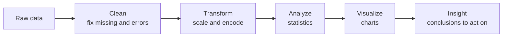
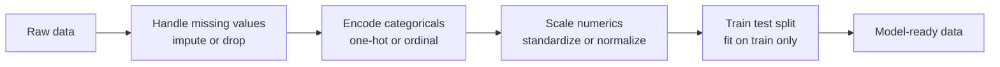
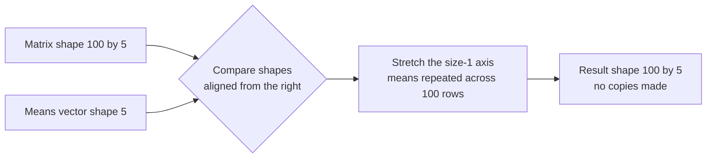
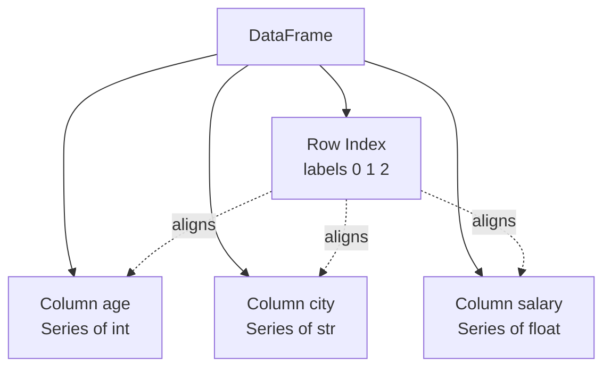
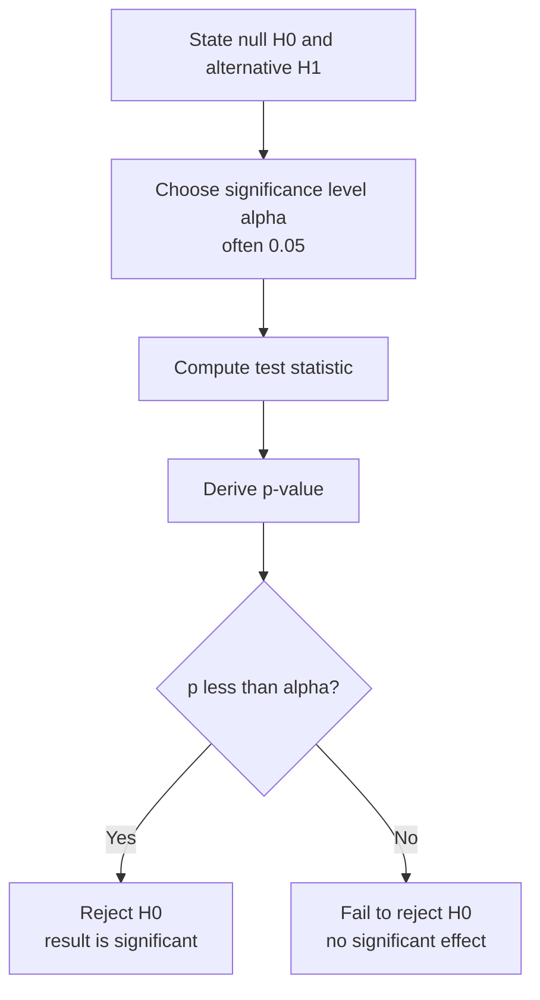

# Data Analysis: A Complete Conceptual Guide

Data analysis is the craft of turning raw, messy, often confusing data into understanding. Before any machine learning model is trained, before any prediction is made, someone has to look at the data, clean it, reshape it, visualize it, and reason about it. That work is data analysis, and it is the foundation on which everything else in this field rests. A model is only ever as good as the data fed into it, and the data is only ever as good as the care taken in preparing and understanding it.

This guide teaches data analysis from absolute scratch. It assumes you know nothing beyond basic arithmetic and a little programming intuition. Every term is defined the first time it appears. We will move from the big picture (what data analysis even is) down through the practical tools (NumPy, pandas, and three visualization libraries) and back up to the reasoning techniques (exploratory data analysis and statistics) that let you draw trustworthy conclusions. The companion notebooks in this folder demonstrate every idea in runnable code; this guide explains the *why* and *what* so that the code makes sense.

---

## 1. What Is Data Analysis?

Imagine you are handed a giant spreadsheet of every passenger who boarded the Titanic: their ages, ticket prices, cabins, whether they survived. Buried inside those numbers are real patterns: women survived more often than men, wealthier passengers in first class fared better than those in third. **Data analysis** is the systematic process of extracting such patterns, checking whether they are real or just noise, and communicating them clearly.

A few key terms before we go further:

- A **dataset** is a structured collection of data, almost always arranged as a table.
- A **row** (also called a **record**, **sample**, or **observation**) is one individual thing you measured: one passenger, one customer, one day of sales.
- A **column** (also called a **feature**, **variable**, or **attribute**) is one property measured across all rows: age, price, city.
- A **value** is a single cell: the age of one specific passenger.

### The Typical Workflow

Data analysis is not a single step but a pipeline. Almost every real project flows through these stages:

1. **Collect / load the data** read it from a file (a CSV, an Excel sheet, a database) into memory.
2. **Inspect it** look at its shape (how many rows and columns), its data types, and a few example rows.
3. **Clean it (preprocessing)** fix missing values, remove duplicates, deal with errors and outliers.
4. **Transform it** scale numbers, encode categories, engineer new features.
5. **Explore it (EDA)** visualize distributions and relationships to build intuition.
6. **Apply statistics** quantify patterns and test whether they are statistically meaningful.
7. **Communicate** produce charts and conclusions a human can act on.

The end-to-end arc of a data-analysis project, from raw data to actionable insight:



The notebooks in this folder follow exactly this arc: `01_data_preprocessing` covers cleaning and transforming, `02_numpy` and `03_pandas` give you the tools, `04`–`06` cover visualization, `07_eda` covers exploration, and `08_statistics` covers rigorous reasoning. The rest of this guide walks through each in turn.

---

## 2. Data Preprocessing: Cleaning and Preparing Raw Data

Real-world data is **dirty**. It has gaps where values were never recorded, duplicate rows, typos, impossible values (an age of 150), and inconsistent formats. **Preprocessing** is the work of turning this raw mess into clean, model-ready numbers. The notebook `01_data_preprocessing.ipynb` builds a deliberately messy synthetic dataset (people with `age`, `income`, `education`, `experience`, `city`, `score`, and whether they were `hired`) so that every cleaning technique has something realistic to fix.

### 2.1 Missing Values

A **missing value** is a cell where no data was recorded. It is often shown as `NaN`, which stands for "Not a Number" a special placeholder meaning "nothing here." Missing values are dangerous because most mathematical operations and machine learning algorithms cannot handle them; they either crash or silently produce garbage.

The first job is **detection**: counting how many values are missing in each column, and what percentage of the column that represents. A column missing 5% of its values is a minor problem; one missing 70% (like the Titanic's cabin column) may be unusable.

Once detected, you have two broad choices:

- **Deletion** remove the offending rows or columns entirely. Simple, but throws away potentially useful data. You delete rows when only a few are affected, or delete a column when almost all of it is missing.
- **Imputation** fill the gaps with reasonable substitute values. This keeps your data intact. "Impute" simply means "to fill in an estimated value."

**Imputation strategies**, in order of sophistication:

- **Mean imputation** replace missing numbers with the column's average. Good for roughly symmetric data (like age). The mean is the sum of all values divided by how many there are.
- **Median imputation** replace with the column's middle value (the **median** is the value that sits exactly in the middle when all values are sorted). Preferred for **skewed** data like income, where a few very large values would drag the mean upward and make it unrepresentative.
- **Mode imputation** replace with the most frequent value. This is the only sensible option for **categorical** data (categories like a city name), where averaging makes no sense.
- **KNN imputation** a smarter method that looks at the *k* most similar rows ("nearest neighbors") and fills the gap based on their values. If two people have similar income and experience, KNN guesses a missing age from people who resemble them.

A subtle but powerful technique is the **missingness indicator**: before filling a gap, add a new column that simply records "this value *was* missing" (1 or 0). Sometimes the very fact that data was missing carries information a customer who declined to give their income may behave differently and this flag preserves that signal even after imputation. The notebook demonstrates this with `age_was_missing` and `income_was_missing` columns.

### 2.2 Outliers

An **outlier** is a value far outside the normal range an age of 150, an income of 100 million. Outliers can be genuine rare events or data-entry errors, and they can severely distort averages and models. Two standard detection methods:

- **The IQR method.** First find the **quartiles**: sort the data and split it into four equal parts. **Q1** (the first quartile) is the value below which 25% of the data falls; **Q3** is the value below which 75% falls. The **interquartile range (IQR)** is `Q3 − Q1`, the spread of the middle half of the data. Any value below `Q1 − 1.5×IQR` or above `Q3 + 1.5×IQR` is flagged as an outlier. This is also called **Tukey's method**.
- **The Z-score method.** A **z-score** measures how many **standard deviations** a value lies from the mean. (The **standard deviation** is the typical distance of values from their average a measure of spread.) A common rule flags any value with a z-score beyond ±3, meaning it sits more than three standard deviations from the center.

The notebook also shows two machine-learning-based detectors, **Isolation Forest** and **Local Outlier Factor (LOF)**, which learn what "normal" looks like and flag points that don't fit, even across multiple columns at once.

Once detected, outliers can be:
- **Removed** dropped if they are clearly errors (negative ages, ages over 120).
- **Capped (winsorized)** clamped to the IQR boundaries so extreme values are pulled to a reasonable maximum rather than deleted.
- **Transformed** a **log transformation** (replacing each value `x` with `log(1+x)`) compresses a long right tail, taming skewed columns like income without discarding any rows.

### 2.3 Scaling and Normalization

Different columns live on wildly different scales: age ranges 0–100, income ranges 0–1,000,000. Many algorithms are confused by this, treating the large-magnitude column as more important purely because its numbers are bigger. **Scaling** (also called **normalization**) rescales every column to a comparable range so each feature gets a fair vote.

The main scalers, all demonstrated in the notebook:

| Scaler | What it does | Resulting range | Best for |
|---|---|---|---|
| **StandardScaler** | Subtracts the mean, divides by the standard deviation | Mean 0, std 1 | Roughly normal data; linear models, neural networks |
| **MinMaxScaler** | Squeezes values into a fixed window | Usually 0 to 1 | Image data; bounded inputs (sensitive to outliers) |
| **RobustScaler** | Centers on the median, scales by the IQR | Centered, robust | Data with outliers (ignores extreme values) |
| **PowerTransformer** | Applies a mathematical transform (Yeo–Johnson) | Approximately normal | Skewed data you want to make bell-shaped |
| **QuantileTransformer** | Maps values by their rank | Uniform or normal | Strongly non-normal distributions |

There is one rule about scaling that, if violated, quietly ruins everything: **fit on the training data only.** "Fitting" a scaler means computing the mean and standard deviation it will use. You must compute those from the training data alone, then apply (transform) the same numbers to the test data. If you compute them from the whole dataset, information about the test set leaks into training a mistake called **data leakage** that makes your model look better in testing than it ever will in reality.

### 2.4 Encoding Categorical Variables

A **categorical variable** holds labels rather than numbers a city ("Chicago", "Houston"), an education level ("Bachelor", "PhD"). Algorithms do arithmetic, so these text labels must be converted into numbers. This conversion is called **encoding**, and the choice of method matters because a careless one invents false relationships.

- **Label encoding** assigns each category an integer (Chicago=0, Houston=1, …). It is compact but implies an ordering and a magnitude: it suggests Houston is "more than" Chicago and that the gap between categories is meaningful. Use it only when such an order genuinely exists, or for the target you are predicting.
- **Ordinal encoding** is label encoding done deliberately, where you *specify* the order because one truly exists: High School=0, Bachelor=1, Master=2, PhD=3. Here the numeric order is correct and useful.
- **One-hot encoding** sidesteps false ordering entirely. It creates one new column per category, each holding a 1 or 0 ("is this row Chicago? yes/no"). No category is numerically greater than another. The cost is more columns. In pandas this is also available as `get_dummies`, often with `drop_first=True` to drop one redundant column and avoid **multicollinearity** (a situation where columns are perfectly predictable from each other, which destabilizes some models).
- **Target (mean) encoding** replaces each category with the average value of the target for that category for instance, replacing each city with the historical hiring rate in that city. It is compact and powerful for categories with very many distinct values (**high cardinality**), but risks leakage if done carelessly.
- **Frequency encoding** replaces each category with how often it appears. Simple, and sometimes the frequency itself is informative.

### 2.5 Feature Engineering

**Feature engineering** is the creative act of constructing new, more informative columns from existing ones. A model can only learn from the features you give it, so a well-engineered feature can matter more than a fancier algorithm. The notebook builds several:

- **Ratios** income per year of experience, age-to-experience ratio.
- **Binary flags** `is_senior` (1 if experience exceeds 10 years).
- **Binning / discretization** using `pd.cut` to bucket a continuous score into bands ("Early Career", "Mid Career", "Senior"), turning a number into a category.
- **Polynomial and interaction features** multiplying or squaring features (age × experience) so a model can capture combined effects.
- **Variance-threshold selection** automatically removing near-constant columns that carry almost no information.

### 2.6 Imbalanced Data

A dataset is **imbalanced** when one outcome vastly outnumbers another say 95% "not hired" and only 5% "hired." A naive model can score 95% accuracy by always guessing the majority and learning nothing about the rare class. Remedies:

- **SMOTE** (Synthetic Minority Over-sampling Technique) manufactures new, synthetic examples of the rare class by interpolating between real ones, balancing the counts.
- **SMOTETomek** combines SMOTE with a cleanup step that removes ambiguous borderline points.
- **Class weights** leave the data untouched but tell the algorithm to penalize mistakes on the rare class more heavily, forcing it to pay attention.

### 2.7 Train/Test Split

To know whether a model genuinely learned or merely memorized, you must test it on data it never saw during training. So you **split** the dataset:

- A basic split carves out a **training set** (to learn from), often a **validation set** (to tune choices), and a **test set** (a final, untouched exam) commonly 60/20/20.
- A **stratified split** ensures each split has the same proportion of each class as the original essential for imbalanced data so the rare class isn't accidentally absent from the test set.
- **K-fold cross-validation** rotates the test portion: the data is divided into *k* parts, and the model is trained and tested *k* times, each time holding out a different part. This gives a more reliable performance estimate than a single split.
- A **time-series split** respects time order you only ever train on the past and test on the future preventing the leakage of using tomorrow's data to predict today.

### 2.8 Pipelines

A **pipeline** chains all these steps impute, scale, encode, then train into a single object. The benefit is more than tidiness: a pipeline guarantees every transformation is fit on training data only and applied identically to new data, structurally preventing leakage. The notebook's final pipeline combines a `ColumnTransformer` (which routes numeric and categorical columns to different treatments) with a model, then saves the whole thing to disk for reuse.

The preprocessing pipeline, where each cleaning step feeds the next before the data is split for training:



---

## 3. NumPy: The Foundation of Numerical Computing

Every tool above ultimately rests on **NumPy** (Numerical Python). NumPy provides the fast, memory-efficient array that all of data science is built upon. The notebook `02_numpy.ipynb` covers it thoroughly. Understanding NumPy is understanding the engine under pandas, scikit-learn, and every deep-learning framework.

### 3.1 The ndarray

NumPy's central object is the **ndarray** (n-dimensional array): a grid of numbers, all of the same type, stored compactly in memory. Plain Python lists can hold mixed types and are scattered across memory, which makes them slow; an ndarray's uniformity lets the computer process it in bulk at hardware speed.

Arrays have a number of dimensions, described by these attributes:
- **`ndim`** the number of dimensions: 1 for a vector (a list of numbers), 2 for a matrix (a table), 3 or more for a **tensor** (a stack of tables, e.g., a color image or a batch of data).
- **`shape`** a tuple giving the size along each dimension, e.g., `(3, 4)` for 3 rows by 4 columns.
- **`size`** the total number of elements.

You can create arrays from Python lists, or generate them: `zeros` (all zeros), `ones`, `full` (a constant), `eye` (an identity matrix with 1s on the diagonal), `arange` (a range with a step), and `linspace` (a fixed count of evenly spaced values between two endpoints).

### 3.2 Data Types (dtypes)

Each array has a **dtype** declaring what kind of number it holds: `int32`, `int64` (integers of different sizes), `float32`, `float64` (decimals of different precision), `bool` (true/false). Smaller types use less memory but hold less precision; `float16` uses half the memory of `float64`, which matters enormously when training large models on a GPU. You convert between types with `.astype()`.

### 3.3 Vectorization

**Vectorization** is the single most important idea in NumPy. Instead of writing a loop to add two lists element by element, you write `a + b` and NumPy performs the entire operation at once in fast, compiled code. The notebook measures this directly and finds vectorized operations running roughly **20 times faster** than equivalent Python loops. The lesson: in NumPy, never loop when an array operation will do.

### 3.4 Broadcasting

**Broadcasting** is the set of rules that lets NumPy combine arrays of different shapes without manually copying data. When you add a single number to an array, that number is "broadcast" to every element. More generally, a smaller array is stretched across a larger one when their shapes are compatible. The rules: line the shapes up from the right; dimensions match if they are equal or if one of them is 1 (the size-1 dimension is stretched). This is what lets you normalize a `(100, 5)` data matrix by subtracting a `(5,)` vector of means the means are broadcast across all 100 rows. Broadcasting makes code both shorter and faster, since no actual copies are made.

How a small array is stretched to match a larger one so the two combine element by element:



### 3.5 Indexing and Slicing

**Indexing** is selecting elements by position; **slicing** is selecting ranges. Beyond the basics (`arr[0]`, `arr[1, 2]`, `arr[:, 1]` for a whole column):
- **Boolean indexing** selects elements that satisfy a condition: `arr[arr > 12]` returns every element greater than 12. This is the workhorse of filtering.
- **Fancy indexing** selects elements at a list of positions: `arr[[0, 2, 4]]` grabs rows 0, 2, and 4.
- **`np.where(condition, a, b)`** chooses element-wise between two options based on a condition.

A crucial subtlety: a slice is a **view**, not a copy it shares memory with the original, so changing the slice changes the original. Use `.copy()` when you need an independent duplicate. This design saves memory but surprises beginners.

### 3.6 Reshaping and Manipulation

Arrays can be reshaped without changing their data: `reshape` rearranges the same values into a new shape, `flatten`/`ravel` collapse to one dimension, `expand_dims` and `squeeze` add or remove size-1 dimensions, and `.T` (transpose) flips rows and columns. Arrays can also be **stacked** together (`vstack`, `hstack`, `concatenate`), split apart, sorted (`sort`, `argsort`), and combined with set operations (`unique`, `intersect1d`).

### 3.7 Linear Algebra

**Linear algebra** the mathematics of vectors and matrices is the language of machine learning, and NumPy implements it. The notebook covers:
- **Matrix multiplication** (`A @ B`), the core operation behind nearly every model.
- **Inverse** (`inv`), **determinant** (`det`), and **solving** linear systems (`solve`, the stable way to solve `Ax = b`).
- **Eigendecomposition** (`eig`) and **Singular Value Decomposition (SVD)**, which break a matrix into simpler pieces and underlie dimensionality-reduction techniques and data compression.
- **Norms** (`norm`), which measure the length or magnitude of a vector the L1 norm sums absolute values, the L2 norm gives ordinary Euclidean distance.

The notebook also implements neural-network **activation functions** (sigmoid, ReLU, softmax, tanh) purely with NumPy operations, showing that these famous building blocks are just array math.

### 3.8 The Random Module

Randomness drives simulation, sampling, shuffling, and the initialization of model weights. NumPy's modern generator (`np.random.default_rng(seed)`) produces random numbers from many **distributions** uniform, normal, integer, binomial, Poisson. Setting a **seed** makes the randomness reproducible: the same seed yields the same "random" numbers every run, which is essential for repeatable experiments.

---

## 4. pandas: Working with Tabular Data

NumPy arrays are powerful but anonymous pure grids of numbers with no labels. **pandas** adds labels, mixed types, and a vast toolkit for real-world tables, making it the workhorse of practical data analysis. The notebook `03_pandas.ipynb` is a tour of it.

### 4.1 Series and DataFrame

pandas has two core objects:

- A **Series** is a one-dimensional labeled array: values paired with an **index** (the labels). Think of a single column with row names.
- A **DataFrame** is a two-dimensional labeled table rows and columns, like a spreadsheet or a database table. Each column is a Series. This is the object you will spend almost all your time with.

DataFrames can be built from dictionaries, lists, or NumPy arrays, and read directly from CSV, Excel, JSON, Parquet, or SQL files. Their `.shape`, `.columns`, and `.dtypes` attributes summarize their structure.

The anatomy of a DataFrame a row index plus named columns, where each column is a Series:



### 4.2 Indexing and Selection

Selecting data is fundamental, and pandas offers several mechanisms:
- `df['column']` selects a column; `df[['a', 'b']]` selects several.
- **`.loc`** selects by **label** `df.loc['row2', 'salary']`. Label-based slices are *inclusive* of the endpoint.
- **`.iloc`** selects by **integer position** `df.iloc[0, 2]`, exactly like NumPy.
- **Boolean filtering** selects rows meeting a condition: `df[df['age'] > 27]`. Conditions combine with `&` (and) and `|` (or), each wrapped in parentheses.

### 4.3 Cleaning Data in pandas

pandas has its own cleaning tools, mirroring the preprocessing concepts: `.isnull().sum()` counts missing values, `.dropna()` removes them, `.fillna()` fills them (with a constant, a column mean, or via **forward fill** `.ffill()` which carries the last valid value forward and **backward fill** `.bfill()` which pulls the next valid value backward). `.duplicated()` and `.drop_duplicates()` handle repeats, `.astype()` converts types, and `.rename()` relabels columns.

### 4.4 GroupBy: Split-Apply-Combine

**GroupBy** is one of pandas' most powerful ideas, following the **split-apply-combine** pattern: *split* the data into groups by some column, *apply* a calculation to each group, and *combine* the results. To find the average salary per department, you group by department and average the salary. The cell on groupby in `03_pandas.ipynb` shows aggregation with `.mean()`, `.count()`, `.std()`, and `.agg()` for several statistics at once.

The split-apply-combine pattern break into groups, compute on each, then reassemble one result:

```mermaid
flowchart TD
    A[Full table] --> B[Split by department]
    B --> C[Group Sales]
    B --> D[Group Engineering]
    B --> E[Group Marketing]
    C --> F[Apply mean salary]
    D --> G[Apply mean salary]
    E --> H[Apply mean salary]
    F --> I[Combine into result table]
    G --> I
    H --> I
``` Two relatives: `.transform()` computes a per-group value but broadcasts it back to every original row (handy for "how does this row compare to its group?"), and `.filter()` keeps only groups meeting a condition.

### 4.5 Combining DataFrames: Merge, Join, Concat

Real analysis often spans multiple tables that must be combined:
- **`merge`** joins two DataFrames on a shared key column, exactly like SQL joins. The `how` parameter controls which rows survive: `inner` keeps only matches, `left` keeps all left rows, `right` keeps all right rows, and `outer` keeps everything from both.
- **`concat`** stacks DataFrames vertically (`axis=0`) to add more rows, or horizontally (`axis=1`) to add more columns.

| Operation | Purpose | Analogy |
|---|---|---|
| `merge` (inner) | Combine tables on matching keys | Intersection of two guest lists |
| `merge` (outer) | Combine keeping all rows | Union of two guest lists |
| `concat` (axis=0) | Stack rows | Taping two pages end to end |
| `concat` (axis=1) | Stack columns | Placing two pages side by side |

### 4.6 Reshaping: Pivot, Melt, Stack

Data comes in **long** form (many rows, few columns) or **wide** form (few rows, many columns), and you often need to switch. A **pivot table** (`pivot_table`) turns long data into a wide summary grid, aggregating as it goes the same idea as a spreadsheet pivot table. **`melt`** does the reverse, collapsing wide columns into long key-value rows. `stack` and `unstack` move data between the column labels and a hierarchical row index.

### 4.7 apply, map, and Vectorized Transformations

To run a custom function over your data: **`map`** applies a function to each element of a Series; **`apply`** applies a function across a Series or along the rows/columns of a DataFrame (`axis=1` for row-wise). These offer flexibility but are slower than built-in vectorized operations, which should be preferred when available.

### 4.8 Time Series

**Time-series data** is data indexed by time daily sales, hourly temperatures. pandas excels here. `pd.date_range` generates sequences of dates. **Resampling** (`.resample('W').mean()`) changes the time granularity, aggregating daily data into weekly or monthly summaries. A **rolling window** (`.rolling(window=7).mean()`) computes a moving average over a sliding window, smoothing short-term noise to reveal trends. `.shift()` lags data to compare each point with an earlier one, and `.pct_change()` computes period-over-period percentage change. A `DatetimeIndex` even lets you extract the year, month, or day of week directly, and slice by date string (`df.loc['2023-01']`).

### 4.9 Other Essentials

The notebook also covers **categorical dtype** (storing repeated labels far more compactly a 50× memory saving in one example), **MultiIndex** (hierarchical row labels for multi-level data like quarters within years), **method chaining** (linking operations into one readable pipeline with `.assign()`, `.query()`, and `.sort_values()`), and **chunked reading** (`chunksize`) for datasets too large to fit in memory at once.

---

## 5. Visualization I: matplotlib

Numbers in a table hide their secrets; a chart reveals them instantly. **Visualization** is the art of encoding data as visual shapes positions, lengths, colors that the human eye reads effortlessly. The foundational Python plotting library is **matplotlib**, covered in `04_matplotlib.ipynb`. Nearly every other plotting tool is built on top of it.

### 5.1 The Anatomy: Figure and Axes

matplotlib's mental model has two key objects:
- A **Figure** is the entire window or page the whole canvas.
- An **Axes** is a single plot *within* that figure, with its own x-axis, y-axis, title, and data. (Confusingly named: "an Axes" is one plot, not one axis line.) A figure can hold many Axes arranged in a grid of **subplots**.

There are two ways to drive matplotlib. The **pyplot interface** (`plt.plot(...)`) is quick and MATLAB-like, keeping track of the "current" plot for you great for fast exploration. The **object-oriented interface** explicitly creates figure and axes objects (`fig, ax = plt.subplots()`) and calls methods on them more verbose but far clearer for complex, multi-panel figures and production code.

### 5.2 Plot Types

The notebook demonstrates a wide catalog, each suited to a different question:

| Plot type | What it shows | When to use it |
|---|---|---|
| **Line plot** | A value changing along a continuous axis | Trends over time |
| **Scatter plot** | Each point as (x, y) | Relationship between two numeric variables |
| **Bar chart** | A quantity per category (as bar length) | Comparing categories (grouped, stacked, horizontal) |
| **Histogram** | How a single numeric variable is distributed | Seeing the shape and spread of values |
| **Box plot** | Median, quartiles, and outliers | Comparing distributions across groups |
| **Violin plot** | Full distribution shape per group | Richer alternative to the box plot |
| **Pie chart** | Parts of a whole | Proportions (use sparingly) |
| **Heatmap** | A grid of values shown as color | Correlation matrices, 2-D patterns |
| **3-D surface/scatter** | Three variables at once | Surfaces and spatial relationships |

### 5.3 Customization and Output

A chart communicates only if it is labeled and legible. matplotlib lets you set the **title**, the **x- and y-axis labels**, a **legend** (the key explaining what each color or line means), and **annotations** (text and arrows pointing at notable points). You control **colors**, line styles, and marker shapes; apply built-in **styles** and **colormaps** (named color gradients sequential like `viridis` for ordered data, diverging like `RdBu` for data with a meaningful center such as correlations); arrange **subplots** in grids; and place **twin axes** when two series share an x-axis but need different y-scales. Finished figures **save** to PNG (for screens), or SVG and PDF (vector formats that stay crisp at any size), at a chosen **DPI** (dots per inch higher for print).

---

## 6. Visualization II: seaborn

matplotlib is powerful but low-level: a polished statistical chart can take many lines. **seaborn**, covered in `05_seaborn.ipynb`, is built *on top of* matplotlib and specializes in **statistical visualization**. It produces attractive charts in a single line, understands pandas DataFrames natively, and computes statistics for you automatically.

### 6.1 Why seaborn

Seaborn's superpower is that it speaks the language of data. You hand it a DataFrame and the names of columns to put on each axis, and it handles the rest including coloring by a category (**`hue`**), sizing points by a value (**`size`**), and computing **confidence intervals** without being asked. It also ships with built-in practice datasets (`tips`, `iris`, `flights`, `penguins`, `titanic`) used throughout the notebook.

### 6.2 The seaborn Plot Families

- **Relational plots** show relationships between variables: `scatterplot` and `lineplot`, with `relplot` adding **faceting** (splitting one chart into a grid of small multiples, one panel per category).
- **Distribution plots** show how values are spread: `histplot` (histogram, optionally with a smooth **KDE** curve overlaid), `kdeplot` (a **Kernel Density Estimate** a smooth estimate of the distribution's shape), `ecdfplot` (cumulative distribution), and `rugplot` (tick marks for individual points).
- **Categorical plots** compare a numeric value across categories: `boxplot`, `violinplot`, `stripplot` and `swarmplot` (individual points, jittered to avoid overlap), `barplot` (category means with error bars), and `countplot` (frequency of each category).
- **Regression plots** fit and draw a trend line through data: `regplot` and `lmplot`, complete with a shaded confidence band, plus `residplot` for diagnosing model fit.
- **Matrix plots** visualize tables of numbers as color: `heatmap` (ideal for correlation matrices, with `annot=True` printing the numbers in each cell) and `clustermap` (a heatmap reordered by similarity).
- **Multi-variable overviews**: `pairplot` draws a grid of scatter plots for every pair of numeric columns at once a fast way to spot relationships across an entire dataset and `jointplot` shows two variables' relationship in the center with each one's individual distribution along the margins.

Seaborn also offers **themes** (`set_theme`) and **color palettes** that restyle every chart consistently, and **contexts** (`paper`, `notebook`, `talk`, `poster`) that scale fonts for different presentation settings.

### 6.3 matplotlib vs seaborn vs plotly

| Aspect | matplotlib | seaborn | plotly |
|---|---|---|---|
| **Level** | Low-level, manual | High-level, statistical | High-level, interactive |
| **Best at** | Total control, any chart | Beautiful statistical plots fast | Interactive, web-ready charts |
| **DataFrame-aware** | Not really | Yes | Yes |
| **Computes statistics** | No | Yes (CIs, KDEs, regressions) | Some |
| **Output** | Static images | Static images | Interactive (zoom, hover, pan) |
| **Verbosity** | High | Low | Low |

The three are complementary, not competing: seaborn for quick statistical exploration, matplotlib underneath for fine-tuning, plotly when interactivity matters.

---

## 7. Visualization III: plotly

Static charts are images; **plotly**, covered in `06_plotly.ipynb`, makes **interactive** charts. **Interactivity** means the viewer can engage with the chart in the browser hovering over a point to read its exact values, zooming into a region, panning across it, clicking the legend to hide or show series, and even playing animations. This turns a chart from a finished statement into an explorable tool.

### 7.1 Two APIs

Plotly offers two ways to build charts, paralleling matplotlib's two interfaces:
- **Plotly Express** (`px`) is the high-level, one-line approach: `px.scatter(df, x=..., y=..., color=...)` produces a complete interactive chart, with hover tooltips populated automatically from the DataFrame.
- **Graph Objects** (`go`) is the low-level approach giving full control over every visual property, used when Express isn't flexible enough (such as custom 3-D surfaces).

### 7.2 What plotly Adds

Beyond the standard chart types (scatter, line, bar, histogram, box, violin, pie), the notebook highlights capabilities unique to interactive plotting:
- **3-D charts** (`scatter_3d`, surfaces) you can rotate with the mouse.
- **Animated charts** via `animation_frame` the famous Gapminder example animates global GDP versus life expectancy year by year, each country a moving bubble.
- **Choropleth maps** that shade countries or regions by value, with hover and zoom.
- **Subplots** combining multiple interactive panels, and rich **layout customization** of titles, axes, legends, backgrounds, and annotations.

It also touches on **Dash**, plotly's framework for assembling these charts into full interactive web dashboards with dropdowns and filters wired together by callbacks.

---

## 8. Exploratory Data Analysis (EDA)

With the tools in hand, we reach the heart of analysis: **Exploratory Data Analysis (EDA)**. EDA is the open-ended investigation of a fresh dataset looking, questioning, and visualizing to build intuition *before* committing to any model. The goal is to understand what the data contains, how clean it is, how variables are distributed, and how they relate. The notebook `07_eda.ipynb` walks through a complete EDA of the **Titanic** dataset, following a clear workflow.

### 8.1 The EDA Workflow

1. **Load and inspect** view the first and last rows, the shape, the data types, and summary statistics from `.describe()` and `.info()`.
2. **Assess data quality** count missing values per column (Age, Cabin, and Embarked all have gaps), check for duplicates, measure **cardinality** (the number of distinct values per column), and separate numeric from categorical columns.
3. **Univariate analysis** examine one variable at a time.
4. **Bivariate analysis** examine two variables together.
5. **Multivariate analysis** examine many variables at once.
6. **Correlation analysis** quantify linear relationships across all numeric columns.
7. **Synthesize insights** translate the patterns into conclusions.

The EDA process, moving from a first look at the data outward to one, two, and many variables at a time:

```mermaid
flowchart TD
    A[Load and inspect] --> B[Assess data quality<br/>missing and duplicates]
    B --> C[Univariate analysis<br/>one variable]
    C --> D[Bivariate analysis<br/>two variables]
    D --> E[Multivariate analysis<br/>many variables]
    E --> F[Correlation analysis]
    F --> G[Synthesize insights]
```

### 8.2 Univariate Analysis

**Univariate** means "one variable." Here you ask: what does each column look like on its own?
- For **numeric** variables (Age, Fare), you plot **histograms** (often with a KDE overlay) to see the distribution's shape, **box plots** to spot outliers and quartiles, and **Q-Q plots** to check whether the data is bell-shaped. You compute descriptive statistics including **skewness** (a measure of asymmetry Fare is strongly right-skewed, with a long tail of expensive tickets) and **kurtosis** (a measure of how heavy the tails are).
- For **categorical** variables (Sex, Embarked, Pclass), you compute **value counts** (how many of each category) and draw **bar charts**, revealing imbalances such as far more men than women aboard.

### 8.3 Bivariate Analysis

**Bivariate** means "two variables." Here you ask: how does one variable relate to another? The pairing of types dictates the technique:
- **Numeric vs numeric** a **scatter plot** plus a **correlation coefficient** (see below) measures whether they move together.
- **Numeric vs categorical** overlaid or grouped distributions, e.g., the age distribution of survivors versus non-survivors.
- **Categorical vs categorical** a **cross-tabulation** (`crosstab`), a table counting every combination, often normalized into proportions. The Titanic crosstab of Sex against Survived reveals starkly higher female survival a **conditional probability**, the probability of surviving *given* one's sex.

### 8.4 Multivariate Analysis and Correlation

**Multivariate** analysis considers many variables simultaneously. The **pairplot** draws every pairwise scatter at once, colored by the target (survival), exposing combined patterns. The **correlation matrix** is the centerpiece: **correlation** measures how strongly two numeric variables move together, on a scale from −1 (perfect opposite) through 0 (no linear relationship) to +1 (perfect agreement). Displayed as a **heatmap**, a correlation matrix lets you spot at a glance which features are related. The notebook computes both **Pearson** correlation (which captures straight-line relationships) and **Spearman** correlation (which captures any consistently increasing or decreasing relationship, even if curved); comparing them reveals whether a relationship is linear or merely monotonic.

From all of this, the analyst extracts **insights**: on the Titanic, sex and passenger class were the strongest predictors of survival, fare was right-skewed and tied to class, and the cabin column was too sparse to trust. These insights then guide the modeling that follows. The notebook also mentions **automated profiling** tools (ydata-profiling, Sweetviz) that generate a full EDA report in one command.

---

## 9. Statistics: Reasoning Rigorously About Data

EDA shows you patterns; **statistics** tells you whether to *believe* them. Statistics is the mathematics of learning from data under uncertainty distinguishing real effects from random noise, and quantifying how confident you can be. The notebook `08_statistics.ipynb` builds this up from descriptive measures to formal inference, and ties each idea back to machine learning.

### 9.1 Descriptive Statistics

**Descriptive statistics** summarize data with a few representative numbers. They split into two families.

**Measures of central tendency** answer "where is the center?":
- The **mean** (arithmetic average) is the sum divided by the count. It is intuitive but sensitive to outliers a single billionaire skews the average income upward.
- The **median** is the middle value when sorted; it is **robust**, shrugging off outliers.
- The **mode** is the most frequent value.
- The notebook also covers specialized means: the **weighted mean** (some values count more), the **geometric mean** (for growth rates and ratios), the **harmonic mean** (for rates and speeds), and the **trimmed mean** (the mean after discarding extreme top and bottom percentages, blending robustness with the mean's familiarity).

**Measures of dispersion** answer "how spread out is the data?":
- The **variance** is the average squared distance of values from the mean. Squaring keeps the measure positive and punishes large deviations. (The **sample variance** divides by `n−1` rather than `n` **Bessel's correction** which corrects a bias when estimating from a sample.)
- The **standard deviation** is the square root of the variance, returning the measure to the original units and giving the "typical distance from the mean."
- The **coefficient of variation** is the standard deviation divided by the mean, a unitless measure for comparing spread across datasets on different scales.
- The **range** is max minus min; the **IQR** is the spread of the middle half (defined in §2.2).
- **Skewness** and **kurtosis** (introduced in §8.2) describe the distribution's asymmetry and tail heaviness.

### 9.2 Probability Distributions

A **probability distribution** describes how likely each possible value is. Recognizing the distribution behind your data lets you reason about it precisely. The notebook covers the essentials:

- The **normal (Gaussian) distribution** the famous symmetric bell curve, described by its mean and standard deviation. It is everywhere because of the Central Limit Theorem (below). Its **68–95–99.7 rule** states that about 68% of values fall within one standard deviation of the mean, 95% within two, and 99.7% within three. The **standard normal** is the normal distribution centered at 0 with standard deviation 1, obtained by computing the **z-score** of each value.
- The **binomial distribution** the number of successes in a fixed number of independent yes/no trials (e.g., heads in 10 coin flips).
- The **Poisson distribution** the number of events in a fixed interval of time or space (e.g., arrivals per hour).
- The **exponential distribution** the waiting time between such events.
- The **uniform**, **beta**, and **gamma** distributions additional flexible shapes for modeling.

### 9.3 The Central Limit Theorem and Sampling

A **population** is the entire group you care about; a **sample** is the subset you actually measure. **Inference** is the act of drawing conclusions about the population from the sample. The bridge between them is the **Central Limit Theorem (CLT)**, one of the most remarkable results in all of statistics: *the average of a large enough sample is approximately normally distributed, no matter what shape the original population has.* Take many samples, compute each one's mean, and those means form a bell curve. The notebook demonstrates this by sampling from a lopsided exponential population and watching the sample means converge to a normal shape as the sample size grows.

The spread of those sample means is the **standard error**, equal to the population standard deviation divided by the square root of the sample size. It shrinks as samples grow larger samples give more precise estimates. The CLT is what justifies using the normal distribution for inference even when the underlying data is not normal.

### 9.4 Hypothesis Testing

**Hypothesis testing** is the formal procedure for deciding whether an observed effect is real or could plausibly be random chance. Its logic is that of a courtroom presumption of innocence:

- The **null hypothesis (H₀)** is the skeptical default: "there is no effect, no difference." This is presumed true unless the data overwhelmingly contradicts it.
- The **alternative hypothesis (H₁)** is the claim you are testing for: "there *is* an effect."
- You compute a **test statistic** summarizing how far your data departs from what H₀ predicts, and from it a **p-value**: the probability of seeing data at least this extreme *if the null hypothesis were true*. A small p-value means the data would be very surprising under H₀, casting doubt on it.
- You compare the p-value to a pre-chosen **significance level (α)**, usually 0.05. If `p < α`, you **reject H₀** and call the result **statistically significant**; otherwise you **fail to reject** it. (Note the careful language: failing to reject is not the same as proving H₀ true.)

Two ways to be wrong: a **Type I error** is a false alarm rejecting a true null (its rate is α). A **Type II error** is a missed detection failing to reject a false null. The **power** of a test is its ability to detect a real effect (one minus the Type II error rate).

The notebook applies several standard tests, each suited to a situation:

| Test | Question it answers |
|---|---|
| **One-sample t-test** | Does this sample's mean differ from a specific value? |
| **Two-sample t-test** | Do two independent groups have different means? |
| **Paired t-test** | Did a before/after change within the same subjects matter? |
| **Chi-square test** | Are two categorical variables related (independence)? or do counts match an expected distribution (goodness of fit)? |
| **One-way ANOVA** | Do three or more groups have different means? |

A **t-test** compares means using the **t-distribution** (a bell curve with heavier tails, used when the population standard deviation is unknown and estimated from the sample). **ANOVA** (Analysis of Variance) extends this to many groups by comparing the variation *between* groups to the variation *within* them; when ANOVA finds a difference, a **post-hoc test** (like Tukey's HSD) identifies *which* specific groups differ.

The decision logic of a hypothesis test, from stating H0 to comparing the p-value against alpha:



### 9.5 Confidence Intervals

A single estimated number (a **point estimate**) gives no sense of its own uncertainty. A **confidence interval** does: it is a range of plausible values for the true quantity, with an attached confidence level. A 95% confidence interval is built by a procedure such that, if you repeated the whole experiment many times, about 95% of the intervals produced would contain the true value. (The precise interpretation is subtle: the 95% describes the long-run reliability of the *method*, not the probability that one particular interval is correct.) The notebook constructs intervals using the t-distribution when the standard deviation is unknown, and visually demonstrates the coverage by generating 100 intervals and confirming that roughly 95 of them capture the true mean.

### 9.6 Why This Matters for Machine Learning

The notebook closes the loop by connecting statistics to the models that follow: linear regression is built on the statistical method of least squares, logistic regression and Naive Bayes rest on probability and Bayes' theorem, **correlation** and **covariance** quantify how features relate, and concepts like **Maximum Likelihood Estimation** (finding the parameters that make the observed data most probable) underpin how models are fit. Statistics is not a detour from machine learning it is its mathematical bedrock.

---

## 10. Putting It All Together

Data analysis is a single connected craft, and these eight notebooks trace its full arc. You **load and inspect** data, **preprocess** it into a clean and consistent form (`01`), wielding **NumPy** for fast numerical computation (`02`) and **pandas** for labeled tabular manipulation (`03`). You make it visible with **matplotlib** for precise static charts (`04`), **seaborn** for fast statistical graphics (`05`), and **plotly** for interactive exploration (`06`). You investigate it through **exploratory data analysis** to surface its patterns (`07`), and you validate those patterns with **statistics** to know which ones to trust (`08`).

Master this pipeline and you can take any raw, messy dataset and turn it into reliable understanding which is precisely the skill every later stage of machine learning and AI engineering depends upon.
