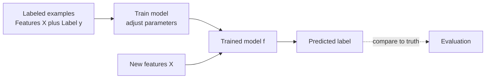
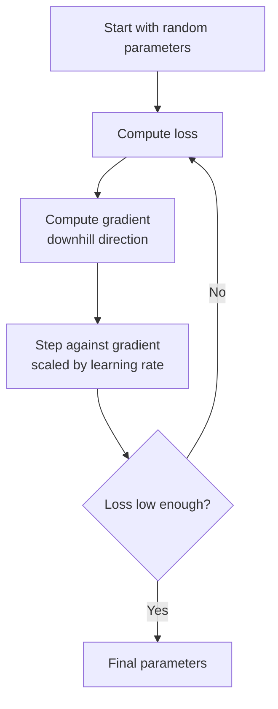
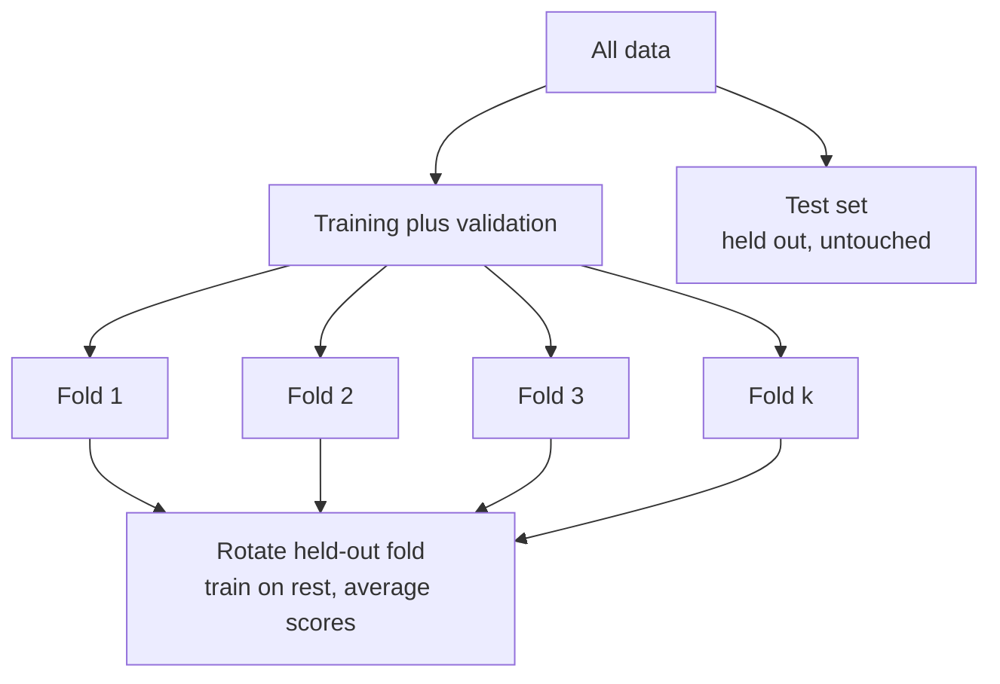
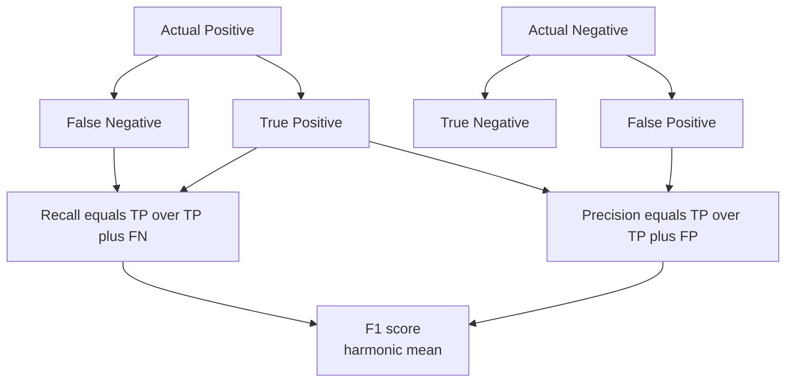
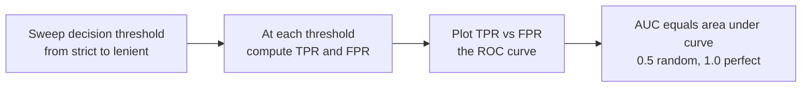
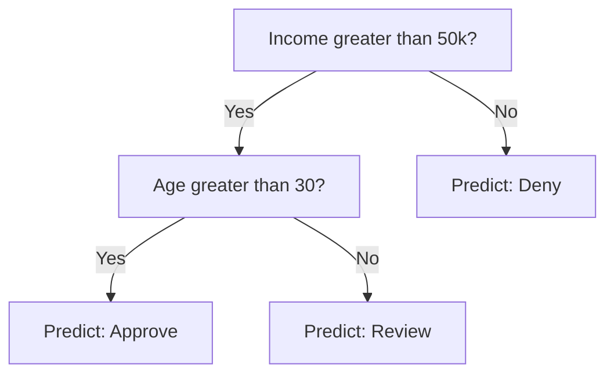
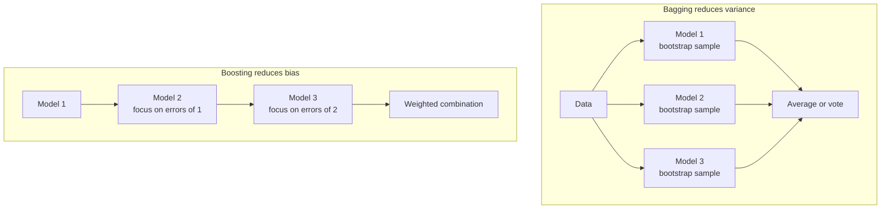
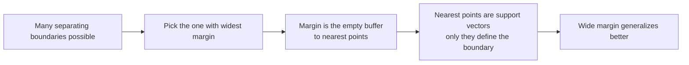

# Supervised Learning

Supervised learning is the most widely used branch of machine learning. The core idea is simple: we show a computer many examples where we already know the right answer, and the computer learns to produce that answer on its own for new examples it has never seen. This guide builds the whole topic from the ground up and then walks through every major supervised algorithm covered in this folder.

## The Vocabulary You Need First

Before any algorithm makes sense, a handful of words must be crystal clear.

- **Features** (also called *inputs*, *predictors*, or *independent variables*): the pieces of information you feed the model. For a house, features might be its size in square feet, the number of bedrooms, and its age. Features are usually written as `X`.
- **Label** (also called the *target*, *output*, or *dependent variable*): the answer you want the model to predict. For the house, the label might be its sale price. Labels are usually written as `y`.
- **Training**: the process of letting the algorithm look at many (features, label) pairs and adjust itself so its predictions get closer to the true labels.
- **Model**: the trained object that takes features and produces a prediction. Think of it as a learned function `f` where `prediction = f(features)`.

The defining property of *supervised* learning is that **every training example comes with its correct label**. The "supervision" is exactly those labels guiding the learning, like an answer key.

**Figure: The supervised learning workflow**



### Two Flavors of Supervised Problems

Supervised problems split into two types based on what kind of answer we want:

- **Regression**: predicting a continuous number. Examples: house price, tomorrow's temperature, a person's height. The answer can be any value on a scale.
- **Classification**: predicting a category from a fixed set. Examples: is this email spam or not (two categories, called *binary classification*), or which of ten digits a handwritten image shows (*multi-class classification*). When each example can belong to several categories at once, it is *multi-label classification*.

Many algorithms below come in both a regression and a classification version.

## The Concepts Every Algorithm Shares

These ideas reappear in nearly every notebook, so understanding them once unlocks everything.

### Loss Function (Cost Function)

A **loss function** measures how wrong the model's predictions are. Training means searching for the model settings that make this number as small as possible. For regression, a common loss is **Mean Squared Error (MSE)** the average of the squared differences between predictions and true values; squaring punishes large mistakes heavily. For classification, a common loss is **cross-entropy** (also called *log loss*), which punishes a model for being confidently wrong.

### Parameters, Weights, and Bias

Most models have internal numbers, called **parameters** or **weights**, that get tuned during training. A linear model multiplies each feature by a weight; a larger weight means that feature matters more. The **bias** (or *intercept*) is an extra constant that shifts predictions up or down independent of any feature.

### Gradient Descent

**Figure: The gradient descent loop**



**Gradient descent** is the workhorse optimization method for finding good parameters. Imagine standing on a foggy hillside (the loss surface) wanting to reach the lowest valley. You feel which direction slopes downward most steeply and take a small step that way, then repeat. The **gradient** is the mathematical "downhill direction," and the **learning rate** controls step size. Too large a learning rate overshoots the valley; too small makes learning painfully slow. The `LinearRegressionScratch` cell in `01_linear_regression.ipynb` implements exactly this loop, iterating to shrink the error.

### Overfitting, Underfitting, and the Bias-Variance Tradeoff

- **Overfitting**: the model memorizes the training data including its random noise instead of learning the general pattern. It scores beautifully on data it has seen and poorly on new data.
- **Underfitting**: the model is too simple to capture the real pattern, so it does badly everywhere.
- **Bias** is error from wrong assumptions (an underfit, oversimplified model has high bias). **Variance** is error from being too sensitive to the particular training set (an overfit model has high variance). Improving one often worsens the other; the art is balancing them. In `03_decision_trees.ipynb`, the cell varying `max_depth` shows this directly: shallow trees underfit, very deep trees overfit.

### Regularization

**Regularization** is any technique that discourages the model from becoming too complex, thereby fighting overfitting. The most common form adds a penalty to the loss based on the size of the weights:

- **L2 regularization (Ridge)** penalizes the sum of squared weights, gently shrinking all weights toward zero.
- **L1 regularization (Lasso)** penalizes the sum of absolute weights and can push some weights *exactly* to zero, effectively removing those features a built-in form of feature selection.
- **Elastic Net** blends L1 and L2 to get benefits of both.

### Handling Class Imbalance

Class imbalance occurs when one class has far more examples than another. A model trained on 99% negative examples will often predict negative for everything, achieving 99% accuracy while being completely useless.

Three main strategies:

1. **Algorithm-level**: pass `class_weight='balanced'` to `LogisticRegression`, `DecisionTreeClassifier`, `RandomForestClassifier`, `SVC`. The algorithm penalizes mistakes on the minority class more heavily by weighting each class inversely proportional to its frequency.

2. **Threshold tuning**: the default threshold of 0.5 is not always optimal. Lowering the threshold increases recall (catches more positives) at the cost of precision (more false alarms). Plot precision, recall, and F1 vs threshold to find the best operating point.

3. **Resampling**: oversample the minority class with SMOTE (Synthetic Minority Oversampling Technique) or undersample the majority class with NearMiss. These live in the imbalanced-learn library. Always apply resampling inside the cross-validation loop, never before splitting.

Always evaluate imbalanced classifiers with F1, PR-AUC, or ROC-AUC rather than accuracy.

### Train/Test Split and Cross-Validation

**Figure: Train/validation/test split and k-fold cross-validation**



To know if a model truly generalizes, we hold back data it never trains on. A **train/test split** sets aside (say) 20% of data purely for final evaluation. **Cross-validation** goes further: it splits the data into *k* equal folds, trains on *k*−1 of them and tests on the held-out fold, then rotates which fold is held out, and averages the scores. This gives a more reliable estimate of real-world performance than a single split.

### Learning Curves

A learning curve plots training score and validation score against training set size. It diagnoses whether a model has a bias problem or a variance problem.

Reading a learning curve:
- If both training and validation scores are low and converge: high bias (underfitting). The model is too simple. Fix: use a more complex model, add features, or reduce regularization.
- If training score is high but validation score is much lower: high variance (overfitting). The model memorizes training data. Fix: get more data, add regularization, or use a simpler model.
- If both scores converge and are high: good fit. Adding more data will not help much; focus on features or model choice instead.

### Feature Scaling

Many algorithms assume features live on comparable scales. If "income" ranges in the tens of thousands and "age" in the tens, distance- and gradient-based methods get distorted. **Standardization** rescales each feature to have an average of zero and a typical spread of one, putting all features on equal footing. Linear models, SVMs, and KNN all benefit from this.

### Feature Scaling: Choosing the Right Scaler

Three scalers cover most situations:

- **StandardScaler**: subtracts the mean and divides by the standard deviation. Mean becomes 0, standard deviation becomes 1. Best default choice for most algorithms. Sensitive to outliers because outliers inflate the standard deviation.
- **MinMaxScaler**: maps every value to a range between 0 and 1. Formula: `(x - min) / (max - min)`. Useful when you need bounded output (like feeding into a sigmoid). Extremely sensitive to outliers because a single outlier shifts the min or max.
- **RobustScaler**: uses the median and the interquartile range (IQR) instead of mean and std. Robust to outliers because outliers do not affect the median. Best choice when your data contains outliers that you cannot remove.

Rule of thumb: start with StandardScaler. If your data has significant outliers, switch to RobustScaler. Use MinMaxScaler only when the algorithm specifically requires inputs in a bounded range.

### Stratified K-Fold Cross-Validation

Plain k-fold splits data randomly into k folds. On an imbalanced dataset (say 95% negative, 5% positive), some folds may contain very few or even zero positive examples, making the evaluation unreliable.

Stratified k-fold ensures each fold has the same proportion of each class as the full dataset. For a 95/5 split, every fold will have roughly 95% negative and 5% positive examples.

Always use `StratifiedKFold` for classification tasks. Use plain `KFold` only for regression. The scikit-learn shortcut is: `cross_val_score(..., cv=StratifiedKFold(n_splits=5, shuffle=True, random_state=42))`.

### Data Leakage

Data leakage occurs when information from outside the training set contaminates the model during training or evaluation. It causes the model to appear more accurate than it really is in production.

The most common form is preprocessing leakage: fitting a scaler or imputer on the full dataset before splitting. Because the scaler saw the test data's statistics during fitting, the model indirectly knows something about the test set. The fix is always to fit preprocessing steps only on training data.

The sklearn Pipeline prevents leakage automatically: during cross-validation, the Pipeline fits all preprocessing steps only on the training fold and applies the fitted transformers to the validation fold, never the reverse.

### sklearn Pipeline and ColumnTransformer

A Pipeline chains preprocessing steps and a final estimator into one object. Calling `pipe.fit(X_train, y_train)` fits every step in sequence. Calling `pipe.predict(X_test)` applies each fitted step in sequence to new data.

Pipeline structure:
```python
Pipeline([
    ('imputer', SimpleImputer(strategy='median')),
    ('scaler', StandardScaler()),
    ('classifier', LogisticRegression())
])
```

ColumnTransformer applies different transformations to different columns in one step:
```python
ColumnTransformer([
    ('num', StandardScaler(), numeric_columns),
    ('cat', OneHotEncoder(handle_unknown='ignore'), categorical_columns)
])
```

Wrap ColumnTransformer inside a Pipeline to get a fully leakage-proof workflow that can be passed directly to GridSearchCV or cross_val_score.

## Evaluation Metrics

A model is only as good as the way we measure it.

### Regression Metrics

- **MSE / RMSE**: average squared error, and its square root (which is back in the original units). Sensitive to large errors.
- **MAE (Mean Absolute Error)**: average absolute error; treats all errors proportionally and is less swayed by outliers.
- **R² (coefficient of determination)**: the fraction of the variation in the target the model explains, where 1.0 is perfect and 0 means no better than always guessing the average. **Adjusted R²** corrects R² for the number of features so adding useless features can't inflate the score.

### Prediction Intervals for Regression

A regression model predicts a single number (the point estimate), but that prediction has uncertainty. A prediction interval provides a range within which the true value is expected to fall with a given probability (typically 95%).

Two common approaches: quantile regression (train separate models for the 2.5th and 97.5th percentiles using `QuantileRegressor`), and conformal prediction (wraps any sklearn model to produce distribution-free intervals). Prediction intervals are important in production when decisions depend on knowing the range of possible outcomes, not just the average.

### Classification Metrics

**Figure: Confusion matrix and the metrics built on it**



Start with the **confusion matrix**, a small table counting four outcomes: *true positives* (TP, correctly predicted positive), *true negatives* (TN), *false positives* (FP, predicted positive but actually negative), and *false negatives* (FN). Everything else builds on these:

- **Accuracy**: fraction of all predictions that are correct. Misleading when classes are imbalanced (predicting "not fraud" for everything can be 99% accurate yet useless).
- **Precision** = TP / (TP + FP): of everything flagged positive, how much really was? High precision means few false alarms.
- **Recall (Sensitivity)** = TP / (TP + FN): of all the real positives, how many did we catch? High recall means we miss few cases.
- **F1 score**: the harmonic mean of precision and recall, rewarding a balance of both. The **F-beta score** lets you weight recall more or less heavily than precision.

### Multi-class Evaluation Metrics

When there are more than two classes, precision, recall, and F1 must be averaged across classes. Three averaging strategies exist:

- **Macro averaging**: compute the metric for each class independently, then take the simple average. Every class counts equally regardless of how many examples it has. Use when all classes are equally important.
- **Weighted averaging**: compute the metric for each class, then take the average weighted by the number of examples in that class (its support). Appropriate when class sizes differ and you care more about performance on common classes.
- **Micro averaging**: aggregate TP, FP, and FN counts across all classes, then compute the metric from those totals. For F1, micro averaging equals accuracy when every example has exactly one label.

A multi-class confusion matrix is an NxN table. Each row represents the true class and each column represents the predicted class. The diagonal shows correct predictions. Off-diagonal entries show which classes are confused with which others.

**Figure: The ROC curve concept**



- **ROC curve and ROC-AUC**: the ROC curve plots the true-positive rate against the false-positive rate as you sweep the decision threshold. The **AUC** (area under that curve) summarizes it in one number: 0.5 is random guessing, 1.0 is perfect. It captures how well the model *ranks* positives above negatives regardless of threshold. The evaluation cell in `02_logistic_regression.ipynb` plots the ROC curve and prints a full classification report.

### Precision-Recall Curve and PR-AUC

The precision-recall curve plots precision on the y-axis against recall on the x-axis as the classification threshold is swept from 0 to 1. Unlike the ROC curve, it does not involve true negatives, which makes it more informative when the negative class dominates.

Average Precision (AP) is the area under the PR curve, a single number summarizing model quality on the positive class. A random classifier on a dataset where 10% of examples are positive gets an AP of 0.10. A perfect classifier gets AP of 1.0.

When to prefer PR over ROC: use the PR curve when the positive class is rare and the cost of missing it is high (fraud detection, cancer screening, rare equipment failure).

### Model Calibration

A model is calibrated if its predicted probability of 0.7 means the event actually occurs 70% of the time. Many classifiers are not calibrated by default. SVMs output scores rather than probabilities. Random forests tend to push probabilities toward 0 and 1. Poorly calibrated probabilities mislead any downstream system that uses them for risk assessment.

Platt scaling fits a logistic regression on top of the model's outputs. Isotonic regression fits a non-parametric monotone function. Both are available through sklearn's `CalibratedClassifierCV` wrapper. Check calibration visually with a reliability diagram: plot mean predicted probability vs fraction of positives in each probability bin.

## The Algorithms

### Linear Regression `01_linear_regression.ipynb`

**What it is:** the simplest regression model. It assumes the target is a weighted sum of the features plus a bias a straight line (or flat plane in higher dimensions).

**Intuition:** find the line that sits as close as possible to all the data points, where "close" means smallest total squared vertical distance. There are two ways to find that best line: **gradient descent** (iteratively step downhill on the MSE) or the **normal equation** (a one-shot formula that solves for the optimal weights directly). The scratch implementation shows both.

**Variants covered:**
- **Multiple linear regression** uses many features at once.
- **Polynomial regression** adds powers of features (x², x³…) so the model can bend to fit curves while still being "linear" in its weights.
- **Ridge, Lasso, and Elastic Net** add L1/L2 regularization to prevent overfitting, especially when features are numerous or correlated.

**Assumptions (remembered as LINE):** **L**inearity (the relationship really is roughly linear), **I**ndependence of observations, **N**ormality of the leftover errors (*residuals*), and **E**qual variance of errors (*homoscedasticity*). It also assumes no severe **multicollinearity** features that are near-duplicates of each other, which makes weights unstable. The **Variance Inflation Factor (VIF)** is a diagnostic that flags this; the multicollinearity cell computes it.

**Strengths:** fast, simple, and highly interpretable each weight tells you a feature's effect. **Weaknesses:** can only capture linear patterns unless extended, and is sensitive to outliers.

### Logistic Regression `02_logistic_regression.ipynb`

**What it is:** despite "regression" in its name, this is a **classification** algorithm. It predicts the *probability* that an example belongs to the positive class.

**Intuition:** it computes a weighted sum of features just like linear regression, then squashes that number through the **sigmoid function**, an S-shaped curve that maps any value to a probability between 0 and 1. If the probability exceeds a threshold (usually 0.5), predict the positive class. The cutoff in feature space where probability equals 0.5 is the **decision boundary**. The underlying weighted sum is the **log-odds** (or *logit*) the logarithm of the odds of the positive class.

**Loss:** **binary cross-entropy (log loss)**, which heavily penalizes confident wrong predictions, trained with gradient descent. The hyperparameter `C` controls regularization strength (smaller `C` means stronger regularization).

**Multi-class extension:** for more than two classes it uses either **One-vs-Rest** (train one binary classifier per class, each saying "this class vs everything else") or **Softmax (multinomial) regression** (predict a probability for every class at once that all sum to one). The iris cell compares both.

**Strengths:** outputs calibrated probabilities, interpretable, fast, a strong baseline. **Weaknesses:** assumes a linear decision boundary, so it struggles with complex nonlinear class separations.

### Decision Trees `03_decision_trees.ipynb`

**What it is:** a model that asks a sequence of yes/no questions about the features, like a flowchart, eventually arriving at a prediction at a leaf.

**Figure: How a decision tree splits the data**



**Intuition:** at each step the tree picks the feature-and-threshold split that best separates the data into purer groups. "Purity" for classification is measured by **Gini impurity** or **entropy** (both quantify how mixed the classes are; a pure node holds one class only). The reduction in impurity from a split is the **information gain**. For regression, splits minimize variance/MSE within the resulting groups. Classic algorithms include **ID3**, **C4.5**, and **CART** (the variant scikit-learn uses, which builds binary trees and handles both classification and regression).

**Controlling complexity:** an unrestricted tree keeps splitting until it perfectly fits (memorizes) the training data severe overfitting. We restrain it by **pre-pruning** (stopping early with limits like `max_depth`, `min_samples_split`, `min_samples_leaf`) or **post-pruning** (growing fully then trimming back weak branches via cost-complexity pruning). The `max_depth` experiment cell visualizes the overfitting tradeoff.

**Feature importance:** trees naturally rank features by how much each one reduced impurity across all its splits.

**Strengths:** intuitive, handle nonlinear relationships and feature interactions automatically, need little preprocessing, and are easy to visualize. **Weaknesses:** a single tree is unstable (small data changes can reshape it) and prone to overfitting which is exactly what ensembles fix.

### Ensemble Methods `04_ensemble_methods.ipynb`

**What it is:** combining many models into one stronger model. A crowd of diverse, decent predictors usually beats any single one. There are three main strategies.

**Figure: Bagging trains in parallel; boosting trains sequentially**



There are three main strategies.

**Bagging (Bootstrap Aggregating):** train many models in parallel, each on a different random sample (drawn *with replacement*, called a **bootstrap sample**) of the data, then average their predictions (or vote). Because each model sees slightly different data, their errors partly cancel out, **reducing variance**. Samples left out of a given bootstrap form the **out-of-bag (OOB)** set, which provides a free validation estimate. The scratch bagging cell builds this with majority voting.

- **Random Forest** is bagging applied to decision trees, with an extra twist: at each split, only a *random subset of features* is considered. This **decorrelates** the trees so they don't all latch onto the same dominant feature, making the ensemble even stronger.

**Boosting:** train models *sequentially*, where each new model focuses on the examples the previous ones got wrong, **reducing bias**.
- **AdaBoost** re-weights misclassified examples upward each round so the next learner pays them more attention, then combines learners weighted by their accuracy.
- **Gradient Boosting** fits each new tree to the *residuals* (the leftover errors) of the running ensemble, effectively taking gradient-descent steps in function space. A **learning rate** (shrinkage) keeps each step small for better generalization.
- **XGBoost** is a highly optimized gradient boosting library that adds built-in regularization and uses second-order (curvature) information for smarter splits a frequent competition winner.
- **LightGBM** is another fast gradient-boosting library using clever tricks (gradient-based sampling, feature bundling, leaf-wise growth) to train quickly on large datasets.

### CatBoost

CatBoost is a gradient boosting library developed by Yandex that handles categorical features natively without one-hot encoding. It uses ordered boosting to prevent prediction shift (a form of leakage that affects other boosting implementations on training data). CatBoost often achieves competitive accuracy with less hyperparameter tuning than XGBoost or LightGBM, making it a good default when data has many categorical columns.

**Stacking:** train several different base models (**level-0**), then train a final **meta-learner** (**level-1**) that learns how best to combine their predictions. To avoid the meta-learner cheating, base predictions are generated via cross-validation (out-of-fold). The stacking cell combines a random forest, gradient boosting, and SVM under a logistic-regression meta-learner.

### VotingClassifier

A VotingClassifier combines multiple different estimators by having them vote on the final prediction.

**Hard voting**: each classifier predicts a class label. The class with the most votes wins. Simple but ignores confidence levels.

**Soft voting**: each classifier predicts class probabilities. Probabilities are averaged across classifiers. The class with the highest average probability wins. Soft voting is almost always better when classifiers output calibrated probabilities.

VotingClassifier is best when the base classifiers are diverse (different algorithm families) and each is already well tuned. Adding weak or similar classifiers does not help.

**Strengths:** typically the best accuracy on tabular data; boosting especially dominates structured-data problems. **Weaknesses:** less interpretable than a single model, more compute, and boosting can overfit if not tuned.

### Support Vector Machines (SVM) `05_svm.ipynb`

**What it is:** a classifier that finds the boundary which separates classes with the widest possible gap.

**Figure: The SVM maximum-margin concept**



**Intuition:** among all lines (or hyperplanes) that separate two classes, SVM picks the one with the largest **margin** the biggest empty buffer between the boundary and the nearest points of each class. Those nearest, boundary-defining points are the **support vectors**; only they matter. A wide margin tends to generalize better. A **hard-margin** SVM demands perfect separation; a **soft-margin** SVM (controlled by the hyperparameter `C`) allows some misclassifications via **slack** so it can cope with noisy, overlapping data. Larger `C` means less tolerance for errors (risking overfitting).

**The kernel trick:** real data is often not linearly separable. Rather than manually adding nonlinear features, SVMs use **kernels** functions that compute similarities *as if* the data were lifted into a much higher-dimensional space, without ever doing that expensive transformation. Common kernels:
- **Linear**: a plain straight boundary.
- **Polynomial**: curved boundaries of a chosen degree.
- **RBF (Gaussian)**: extremely flexible, can wrap around complex shapes; its `gamma` controls how tightly it hugs the data.
- **Sigmoid**.

The kernel-visualization cell shows linear, polynomial, and RBF boundaries on a circular dataset with support vectors highlighted. **Support Vector Regression (SVR)** adapts the idea to regression, fitting a tube of width `epsilon` and only penalizing points outside it.

**Strengths:** effective in high-dimensional spaces, powerful with the right kernel, robust when classes have a clear margin. **Weaknesses:** slow on very large datasets, sensitive to hyperparameter and kernel choice, and outputs aren't naturally probabilities.

### Naive Bayes `06_naive_bayes.ipynb`

**What it is:** a probabilistic classifier built on **Bayes' theorem**, which relates the probability of a class given the features to the probability of the features given the class.

**Intuition:** for a new example, compute how probable each class is and pick the most probable (the **Maximum A Posteriori** choice). The "**naive**" part is a simplifying assumption that all features are **independent** of each other given the class. This is almost never literally true, yet it works remarkably well and makes the math trivially fast. To avoid the trap of a never-before-seen feature value forcing a probability to zero, **Laplace (additive) smoothing** nudges every count up slightly.

**Variants:**
- **Gaussian NB** for continuous features (assumes each follows a bell curve per class).
- **Multinomial NB** for count data like word frequencies the classic for text classification.
- **Bernoulli NB** for binary (present/absent) features.
- **Complement NB**, a tweak that handles imbalanced text better.
- **Categorical NB** for discrete categorical features.

The text-classification cell compares the multinomial, complement, and Bernoulli variants on newsgroup data.

**Strengths:** extremely fast to train and predict, works well with little data and with very high-dimensional text, naturally handles many classes. **Weaknesses:** the independence assumption hurts when features are strongly correlated, and its probability estimates can be poorly calibrated.

### K-Nearest Neighbors (KNN) `07_knn.ipynb`

**What it is:** a "lazy," instance-based method that makes no model at training time at all it just stores the data.

**Intuition:** to predict for a new point, find the *k* training examples nearest to it and let them vote (for classification) or average their values (for regression). "Nearest" requires a **distance metric**: **Euclidean** (straight-line) is most common, **Manhattan** (city-block) sums coordinate differences, **Minkowski** generalizes both, and **cosine distance** compares direction rather than magnitude (useful for text). **Distance-weighted** voting lets closer neighbors count more.

**Choosing k** is the central tradeoff: a small *k* makes the model sensitive to noise (high variance, overfitting); a large *k* smooths predictions but blurs real boundaries (high bias, underfitting). The k-vs-accuracy cell illustrates this directly.

**The curse of dimensionality:** in many dimensions, all points become roughly equidistant, so "nearest" loses meaning and KNN degrades. Reducing dimensions first (e.g., with PCA) helps. To find neighbors quickly, structures like **KD-trees** and **ball trees** beat brute-force search on lower-dimensional data; for huge modern datasets, approximate methods (FAISS, ANNOY, HNSW) are used.

**Strengths:** dead simple, no training phase, naturally handles multi-class and complex boundaries. **Weaknesses:** slow and memory-hungry at prediction time, sensitive to feature scaling and irrelevant features, and weak in high dimensions.

### Generalized Linear Models (GLMs) `08_generalized_linear_models.ipynb`

**What it is:** a unifying framework that shows linear and logistic regression are special cases of one bigger idea, extending it to many more target types.

**Intuition:** a GLM has three pieces. (1) A **linear predictor** the familiar weighted sum of features. (2) A **link function** that connects that linear sum to the *average* of the target, allowing the target to be something other than an unbounded number. (3) A choice of **probability distribution** for the target from the *exponential family*. Picking the distribution and link tailors the model to your data:

- **Gaussian** distribution with an **identity** link gives ordinary **linear regression** (continuous targets).
- **Binomial** distribution with a **logit** link gives **logistic regression** (binary/proportion targets).
- **Poisson** distribution with a **log** link models **count data** (number of events, e.g., website visits per hour).
- **Gamma** distribution for positive, skewed continuous data like insurance claim sizes.

GLMs are fit with an iterative method (**IRLS**, iteratively reweighted least squares). The intro cell demonstrates how different distributions suit different ranges of target values.

**Strengths:** principled, interpretable, and flexible across target types; the right tool when your target is counts, rates, or bounded values. **Weaknesses:** still assumes a *linear* relationship on the link scale, so it can't capture complex nonlinear patterns on its own.

### Online Learning and Incremental Training

Some classifiers support incremental learning through the `partial_fit` method. Instead of loading the entire dataset into memory, `partial_fit` processes one batch at a time and updates the model. This is essential for datasets too large to fit in RAM or for streaming data where new examples arrive continuously.

Scikit-learn estimators that support `partial_fit`: `SGDClassifier`, `SGDRegressor`, `MultinomialNB`, `BernoulliNB`, `Perceptron`, `PassiveAggressiveClassifier`. Call `partial_fit` once per batch, passing all classes on the first call.

### Multi-output Prediction

Multi-output regression predicts multiple continuous targets simultaneously. Multi-output classification predicts multiple binary or categorical targets at once. Examples: predicting temperature, humidity, and wind speed together (regression), or predicting which of several diseases a patient has (classification, since a patient can have more than one).

Scikit-learn wrappers: `MultiOutputRegressor` and `MultiOutputClassifier` train one estimator per target. Some estimators like `RandomForestClassifier` and `DecisionTreeClassifier` support multi-output natively without a wrapper.

## Model Persistence

Saving a trained model allows it to be reused without retraining. The standard approach in Python is joblib:

```python
import joblib
joblib.dump(pipeline, 'model.pkl')
loaded_pipeline = joblib.load('model.pkl')
predictions = loaded_pipeline.predict(X_new)
```

joblib is preferred over pickle for scikit-learn models because it handles large numpy arrays more efficiently. Always save the entire Pipeline, not just the final estimator, so preprocessing is automatically applied when loading.

## Choosing an Algorithm: A Comparison

| Algorithm | Problem type | Captures nonlinearity? | Interpretability | Speed (train) | Notes |
|---|---|---|---|---|---|
| Linear Regression | Regression | No (unless polynomial) | High | Fast | Best linear baseline |
| Logistic Regression | Classification | No | High | Fast | Strong classification baseline; gives probabilities |
| Decision Tree | Both | Yes | High | Fast | Interpretable but overfits alone |
| Random Forest | Both | Yes | Medium | Medium | Robust, low-tuning, strong default |
| Gradient Boosting / XGBoost | Both | Yes | Low-Medium | Medium-Slow | Usually top accuracy on tabular data |
| SVM | Both | Yes (kernels) | Low | Slow on big data | Great with clear margins, high dimensions |
| Naive Bayes | Classification | Limited | Medium | Very fast | Excellent for text |
| KNN | Both | Yes | Medium | None (lazy) | Simple; struggles in high dimensions |
| GLM | Both | No (linear on link scale) | High | Fast | Right tool for counts/rates/special targets |

## How to Approach a Supervised Problem

1. **Frame it**: regression or classification? What is the label?
2. **Prepare the data**: clean it, handle missing values, scale features when the algorithm needs it, encode categories.
3. **Split**: hold out test data; use cross-validation on the rest.
4. **Start simple**: a linear/logistic regression or a single tree gives a baseline and a sanity check.
5. **Go stronger**: try random forests and gradient boosting, which usually win on tabular data.
6. **Tune**: search hyperparameters (depth, learning rate, `C`, `k`…) using cross-validation.
7. **Evaluate honestly** on the held-out test set with metrics appropriate to the problem (and the class balance).
8. **Interpret and iterate**: inspect feature importance, find errors, engineer better features, repeat.

With these foundations, the rest of the machine-learning section unsupervised learning, feature engineering, evaluation, explainability, and beyond becomes far easier to absorb.

## Survival Analysis

Survival analysis models the time until an event occurs, accounting for censored observations (cases where the event has not yet happened when data is collected). Unlike regression, it handles the fact that "time until event" is only partially observed for many subjects.

The Kaplan-Meier estimator gives a non-parametric survival curve S(t) = P(T > t). The Cox Proportional Hazards model fits hazard ratios for each feature while leaving the baseline hazard unspecified. The concordance index (C-index) measures how well the model ranks subjects by risk (0.5 = random, 1.0 = perfect).

Use survival analysis when: customer churn modeling (when will they leave, not just will they), medical time-to-event, equipment predictive maintenance, credit default (time to default).

## Learning to Rank

Learning to Rank (LTR) trains a model to produce a ranked ordering of items for a query, rather than a classification or regression score. It is used in search engines and recommendation systems where the relative order of results matters more than their absolute scores.

Three paradigms: pointwise (treat each item independently), pairwise (model prefers item A over B), listwise (optimize the entire ranked list directly). LambdaMART (implemented in LightGBM and XGBoost) is the dominant algorithm, optimizing NDCG directly.

Key metrics: NDCG (Normalized Discounted Cumulative Gain, penalizes relevant items ranked lower), MAP (Mean Average Precision), MRR (Mean Reciprocal Rank).
