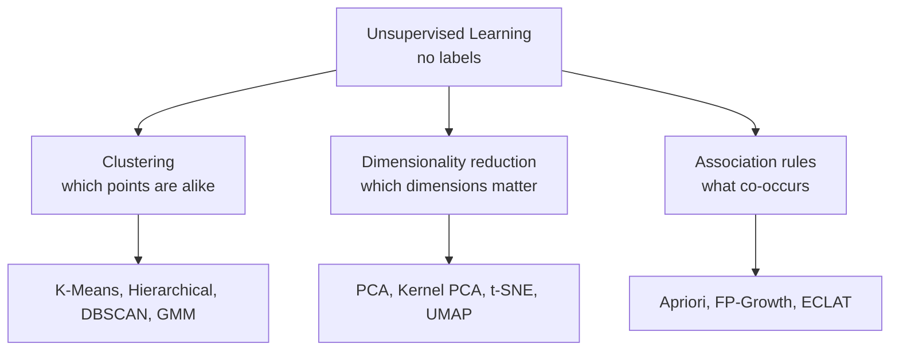
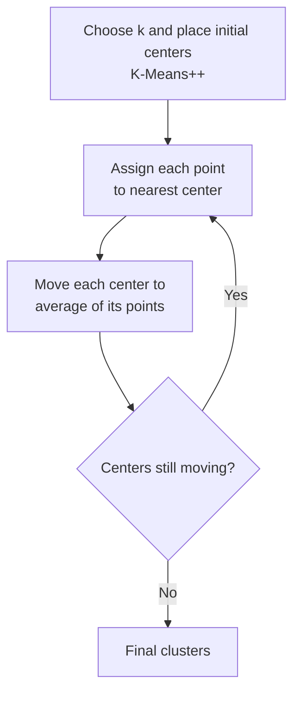
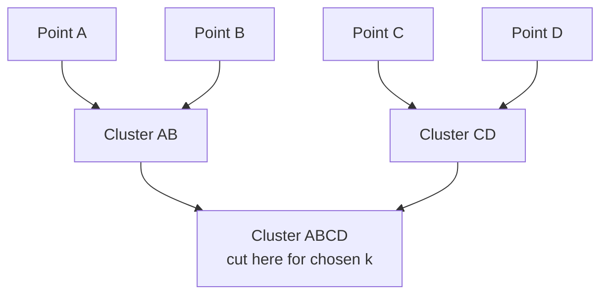
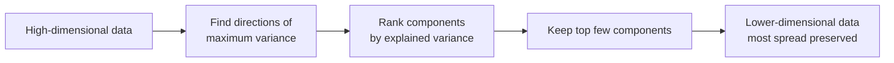
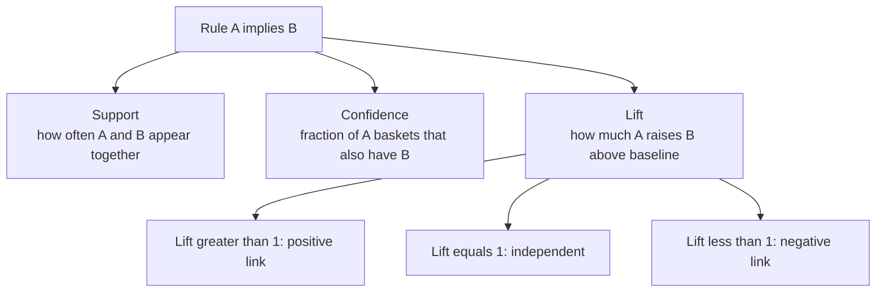

# Unsupervised Learning

Unsupervised learning is the branch of machine learning where the data has **no labels** no answer key. We hand the algorithm a pile of examples described only by their **features** (their measurable properties) and ask it to discover structure on its own: which examples are similar, what hidden dimensions explain the data, or what items tend to occur together. Because there is no "correct answer" to compare against, unsupervised learning is more open-ended than supervised learning, and judging success is subtler.

This folder covers three pillars of unsupervised learning: **clustering** (grouping similar things), **dimensionality reduction** (simplifying data while keeping its essence), and **association rule mining** (finding co-occurrence patterns).

**Figure: The three pillars of unsupervised learning**

## Why Learn Without Labels?

Labels are expensive. Labeling a million images or transactions by hand is slow and costly, while raw unlabeled data is abundant. Unsupervised methods let us:

- **Explore** data we don't yet understand (e.g., segment customers into natural groups).
- **Compress** high-dimensional data so it's faster to store, easier to visualize, and less prone to the "curse of dimensionality."
- **Find patterns** like "people who buy X also buy Y."
- **Preprocess** for supervised models (clean features, reduce noise, surface structure).

## Clustering `01_clustering.ipynb`

**Clustering** means partitioning data into groups (**clusters**) so that points in the same cluster are similar and points in different clusters are different. The challenge is that "similar" must be defined (usually by a distance), and we usually don't even know how many clusters exist.

### K-Means

**What it is:** the most popular clustering algorithm. You tell it how many clusters *k* you want, and it finds *k* cluster centers.

**Figure: The k-means clustering loop**

**Intuition:** it alternates two steps until things settle. (1) **Assign** each point to its nearest center. (2) **Move** each center to the average of the points assigned to it. Repeat. This drives down the **WCSS** (Within-Cluster Sum of Squares, also called **inertia**) the total squared distance from points to their cluster centers. Because random starting centers can land badly, **K-Means++** chooses initial centers spread apart for more reliable results. The from-scratch cell implements this loop and tracks inertia as it converges.

**Strengths:** fast, scalable, simple. **Weaknesses:** you must pick *k* in advance; it assumes clusters are round and similarly sized; and it's sensitive to outliers and initialization. **Mini-Batch K-Means** is a faster variant for huge datasets.

### Choosing the Number of Clusters

Two classic tools help pick *k*:
- **The elbow method**: plot WCSS against *k*. It always drops as *k* grows, but at some point the improvement flattens the "elbow" suggesting a natural *k*.
- **Silhouette score**: for each point, compares how close it is to its own cluster versus the nearest other cluster, giving a score from −1 (wrong cluster) to +1 (well-clustered). Averaging over all points scores a clustering; higher is better. The elbow-and-silhouette cell plots both across a range of *k*.

### Hierarchical (Agglomerative) Clustering

**What it is:** builds a tree of clusters instead of a flat partition.

**Figure: Agglomerative merging builds a dendrogram**

**Intuition:** start with every point as its own cluster, then repeatedly merge the two closest clusters until everything is one big cluster. The full merge history is a **dendrogram** (a tree diagram); cutting it at a chosen height yields any number of clusters. How "closeness" between clusters is measured is the **linkage**: **single** (nearest pair), **complete** (farthest pair), **average**, or **Ward** (merge the pair that least increases within-cluster variance usually the best default).

**Strengths:** no need to pre-specify *k*; the dendrogram is informative. **Weaknesses:** slow on large datasets; merges can't be undone.

### DBSCAN (Density-Based Clustering)

**What it is:** clusters by **density** dense regions become clusters, sparse points become noise.

**Intuition:** a point is a **core point** if it has at least `min_samples` neighbors within radius `eps`. Clusters grow by chaining together core points and their neighbors; isolated points are labeled **noise/outliers**. Crucially, you don't specify the number of clusters, and clusters can be any shape. The algorithm-comparison cell shows DBSCAN cleanly separating crescent-moon and ring shapes that K-Means mangles.

**Strengths:** finds arbitrarily shaped clusters, detects outliers, no *k* needed. **Weaknesses:** struggles when clusters have very different densities; sensitive to `eps` and `min_samples`. **HDBSCAN** and **OPTICS** are extensions that handle varying densities more gracefully.

### Gaussian Mixture Models (GMM)

**What it is:** a probabilistic, "soft" clustering. Instead of assigning each point firmly to one cluster, it gives the *probability* of belonging to each cluster.

**Intuition:** it assumes the data was generated by mixing several bell-shaped (Gaussian) blobs and tries to recover each blob's center, shape, and weight using the **EM (Expectation-Maximization)** algorithm alternating between guessing membership probabilities and updating the blobs. Because the blobs can be stretched and tilted (not just round), GMM handles elongated clusters K-Means can't.

**Strengths:** flexible cluster shapes, soft assignments, principled. **Weaknesses:** must choose the number of components; can be slow; sensitive to initialization.

### Other Clustering Methods

- **Mean-Shift**: slides points uphill toward dense regions; finds clusters and their count automatically.
- **Spectral Clustering**: uses graph/eigenvalue math to handle non-convex, intertwined clusters.
- **Affinity Propagation**: passes "messages" between points to elect representative exemplars; no *k* needed.
- **BIRCH**: builds a compact tree summary for clustering very large or streaming datasets efficiently.

### Evaluating Clusters

When we have no labels (**internal validation**): **silhouette score** (higher better), **Davies-Bouldin index** (lower better), and **Calinski-Harabasz index** (higher better) judge how tight and well-separated clusters are. When we *do* have ground-truth labels for comparison (**external validation**): the **Adjusted Rand Index (ARI)**, **Normalized Mutual Information (NMI)**, and **Fowlkes-Mallows score** measure agreement with the true grouping.

## Dimensionality Reduction `02_dimensionality_reduction.ipynb`

**Dimensionality reduction** compresses data with many features into fewer features while keeping as much meaningful information as possible. This combats the **curse of dimensionality** (data becomes sparse and distances meaningless in high dimensions), speeds up models, removes noise, and when reduced to 2 or 3 dimensions lets us *visualize* otherwise unviewable data.

### Principal Component Analysis (PCA)

**What it is:** the foundational linear technique. It finds new axes, called **principal components**, that capture the most **variance** (spread) in the data.

**Figure: The PCA dimensionality-reduction flow**

**Intuition:** imagine a stretched, tilted cloud of points. PCA rotates the coordinate system so the first new axis points along the cloud's longest stretch, the second along the next-longest (at a right angle), and so on. Keeping only the first few axes preserves most of the spread while dropping the rest. Each component's **explained variance ratio** says what fraction of total variance it captures; the **cumulative** version tells you how many components you need to retain, say, 95% of the information. The scratch cell computes this via the covariance matrix's eigenvectors; a **scree plot** cell visualizes variance per component.

**Strengths:** fast, removes correlated/redundant features, denoises, great for preprocessing. **Weaknesses:** only captures *linear* structure, and the new components are combinations of original features so they lose direct interpretability.

### Kernel PCA

A nonlinear extension of PCA. Using the **kernel trick** (the same idea as in SVMs), it performs PCA in an implicit higher-dimensional space, letting it untangle curved structures like two concentric rings that plain PCA cannot separate. The comparison cell shows linear PCA failing on concentric circles where RBF-kernel PCA succeeds.

### t-SNE and UMAP

These are **visualization-focused** nonlinear methods that map high-dimensional data down to 2D for plotting.

- **t-SNE** preserves *local* neighborhoods: points close in high dimensions stay close in the plot, revealing clusters beautifully. Its key knob is **perplexity** (roughly, how many neighbors each point considers). Caveat: distances *between* clusters and cluster sizes in a t-SNE plot are not meaningful, and it's slow on large data.
- **UMAP** does something similar but is faster, scales better, and preserves more of the *global* structure, making it a popular modern default for visualization and even as a preprocessing step.

### Linear Discriminant Analysis (LDA)

Unlike PCA, LDA is **supervised** it uses class labels. It finds the axes that best *separate the classes* (maximizing the spread between classes relative to the spread within each class). It's both a dimensionality-reduction tool and a classifier, useful when you want a low-dimensional space optimized for distinguishing known groups.

### Independent Component Analysis (ICA)

ICA separates a signal into **statistically independent** sources the classic example is the "cocktail party problem" of isolating individual voices from a mixed recording. Where PCA finds uncorrelated directions of maximum variance, ICA finds maximally independent, non-Gaussian sources.

### Autoencoders

An **autoencoder** is a neural network that learns to compress data through a narrow middle layer (the **encoder**) and reconstruct it (the **decoder**). The narrow layer becomes a learned low-dimensional code. A linear autoencoder recovers PCA, but with nonlinear layers it can capture far richer structure a bridge into deep learning.

## Association Rule Mining `03_association_rules.ipynb`

**Association rule mining** discovers rules of the form "if a customer buys A, they tend to also buy B." Its classic application is **market basket analysis** on retail transactions, but the same ideas apply to web clickstreams, medical event sequences, and more.

### The Core Metrics

**Figure: The three core association-rule metrics**

A rule is written **A ⇒ B** (buying A implies buying B). Three numbers judge it:
- **Support**: how frequently A and B appear together across all transactions the rule's overall prevalence. Low support means the rule is rare and possibly coincidental.
- **Confidence**: of the transactions containing A, what fraction also contain B the rule's reliability (the conditional probability of B given A).
- **Lift**: how much more likely B is when A is present, compared to B's baseline rate. **Lift > 1** means a genuine positive association, **= 1** means independence (no real link), **< 1** means buying A actually makes B *less* likely.

Two refinements add nuance: **leverage** (the difference between observed and expected co-occurrence) and **conviction** (a direction-sensitive measure of how much the rule beats random chance).

### Frequent Itemset Algorithms

The hard part is finding which item combinations are frequent without testing the astronomically many possible combinations.

- **Apriori**: relies on a clever pruning principle if an itemset is rare, every larger set containing it must also be rare, so we can skip them. It builds up frequent sets level by level (singles, then pairs, then triples), scanning the database repeatedly. Simple and intuitive but can be slow due to candidate generation. The Apriori cell demonstrates frequent-itemset discovery on a small transaction set.
- **FP-Growth**: compresses all transactions into a compact tree (the **FP-tree**) and mines patterns directly from it, needing only two passes over the data and no candidate generation usually much faster than Apriori on large datasets. The FP-Growth cell builds the tree and mines it recursively.
- **ECLAT**: stores, for each item, the list of transaction IDs that contain it, then finds frequent sets by intersecting those lists a memory-efficient vertical approach.

### Sequential Pattern Mining

When *order* matters (e.g., the sequence of pages a user visits, or symptoms over time), specialized algorithms extend the above ideas to **sequential patterns**: **SPADE** and **PrefixSpan** discover frequent ordered subsequences, while **CHARM** mines *closed* itemsets (a lossless, compact summary of all frequent itemsets).

**Strengths of association mining:** highly interpretable, great for recommendations and cross-selling, no labels required. **Weaknesses:** can produce a flood of trivial or spurious rules, so thresholds on support/confidence/lift must be chosen carefully.

## Putting It Together

| Task | Question it answers | Key methods |
|---|---|---|
| Clustering | "Which examples are naturally alike?" | K-Means, Hierarchical, DBSCAN, GMM |
| Dimensionality reduction | "What are the few dimensions that really matter?" | PCA, Kernel PCA, t-SNE, UMAP, LDA, ICA, Autoencoders |
| Association rules | "What items/events co-occur?" | Apriori, FP-Growth, ECLAT, PrefixSpan |

A typical unsupervised workflow: **scale** the features (distance-based methods demand it), optionally **reduce dimensions** to denoise and speed things up, then **cluster** or **mine patterns**, and finally **validate** with internal metrics and human judgment. Because there's no ground truth, interpretation and domain knowledge are essential the algorithm finds structure, but *you* decide whether that structure is meaningful.
