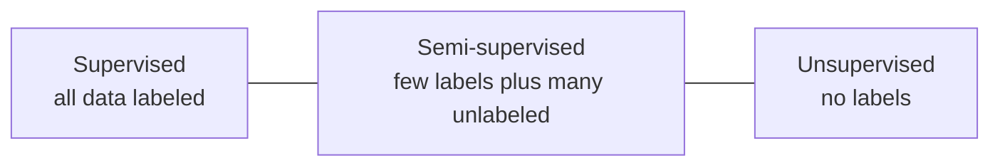
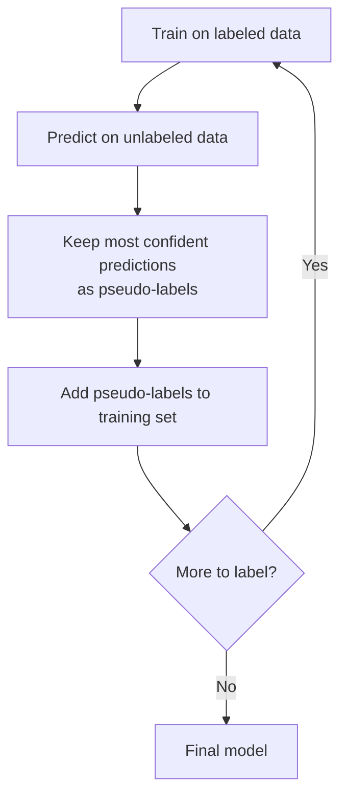
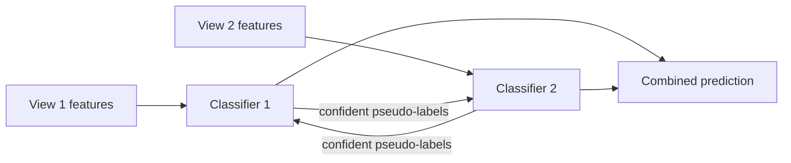

# Semi-Supervised Learning

Semi-supervised learning sits between the two worlds you already know. **Supervised learning** needs every training example to come with a correct **label** (the answer we want to predict). **Unsupervised learning** uses data with no labels at all. **Semi-supervised learning** uses a *small* amount of labeled data together with a *large* amount of unlabeled data and tries to get the best of both.

**Figure: Where semi-supervised learning sits**

This matters because of a simple economic fact: collecting raw data is cheap, but labeling it is expensive and slow. A hospital may have millions of medical images but only a few thousand reviewed by an expert. A company may log billions of web pages but have only a handful categorized by hand. Semi-supervised learning asks: *can the unlabeled mountain make the labeled molehill more useful?* Often the answer is yes.

## Why Unlabeled Data Can Help

It is not obvious that data without answers should help at all. The trick is that unlabeled data reveals the *shape* of the data where points cluster, which regions are dense, what manifold the data lies on. Three assumptions justify exploiting that shape:

- **The smoothness assumption:** points that are close together probably share the same label. If two emails are nearly identical, they are likely both spam or both not.
- **The cluster assumption:** points in the same natural cluster tend to share a label, which means the boundary between classes should fall in *low-density* regions the empty gaps between clusters, not through their dense middles.
- **The manifold assumption:** high-dimensional data often lies on a much lower-dimensional surface (a "manifold"), and labels vary smoothly along that surface.

When these hold, the unlabeled points act like guideposts that pin down where decision boundaries should and shouldn't go. When they *don't* hold, semi-supervised methods can actually hurt so they are not magic.

## The Core Methods

### Self-Training

**What it is:** the simplest approach, also called self-labeling. Train a normal supervised model on the few labeled examples, use it to predict labels for the unlabeled ones, then take only the predictions it is most *confident* about and add them to the training set as if they were true labels (these are called **pseudo-labels**). Retrain and repeat.

**Figure: The self-training loop**

**Intuition:** the model bootstraps itself, gradually expanding its trustworthy training set outward from the labeled core. A **confidence threshold** (e.g., only accept predictions above 95% certainty) controls how cautious it is. The self-training cell implements this iterative loop with a logistic-regression classifier.

**Weakness:** **error accumulation** if the model confidently mislabels something early, that mistake poisons all future training and compounds.

### Label Propagation and Label Spreading

**What it is:** graph-based methods. Build a graph where every data point (labeled and unlabeled) is a node, and edges connect similar points with weights based on closeness (often via an **RBF/Gaussian kernel**, where nearer points connect more strongly).

**Intuition:** the few known labels "spread" across the graph along strong edges, like dye diffusing through connected water. A labeled point pushes its label onto its neighbors, who push it onto theirs, until the whole graph is consistently labeled. **Label Propagation** clamps the original labels firmly; **Label Spreading** is a softer variant that allows even the original labels to be revised slightly (controlled by a parameter α), making it more robust to noisy labels. The graph-methods cell compares both, including a from-scratch implementation.

**Strength:** elegant and effective on small datasets with clear cluster structure. **Weakness:** building and processing the full similarity graph scales poorly to very large datasets.

### Co-Training

**What it is:** uses *two different views* of the data two separate, ideally independent, subsets of features. For example, a web page could be described by (view 1) the words on the page and (view 2) the words in links pointing to it.

**Figure: Co-training with two feature views**

**Intuition:** train one classifier on each view. Each classifier labels the unlabeled examples it is most confident about and hands those new pseudo-labeled examples to the *other* classifier to learn from. Because the two views make different mistakes, they correct each other rather than reinforcing one model's blind spots. The co-training cell splits the features into two views and retrains iteratively.

**Strength:** the mutual-correction reduces the error-accumulation problem of self-training. **Weakness:** it requires two genuinely informative, fairly independent feature views, which not every dataset offers.

### Pseudo-Labeling (Deep Learning)

**What it is:** the deep-learning cousin of self-training. A neural network trains on the labeled data, generates pseudo-labels for confident unlabeled examples, and learns from both. The refinement is a **ramp-up weight**: early in training the network's pseudo-labels are unreliable, so they're given little influence; as training progresses and the network improves, the pseudo-labeled loss is gradually weighted up. The pseudo-labeling cell does this with a multi-layer perceptron.

### Consistency Regularization and Modern Methods

A powerful family of deep semi-supervised methods rests on a single insight: **a good model should give the same prediction for an example even if that example is slightly perturbed** (rotated, cropped, noised). Enforcing this "consistency" on unlabeled data is enormously informative.

- **Mean Teacher:** maintains two copies of the network a **student** trained normally, and a **teacher** whose weights are a slow running average of the student's. The teacher produces stable targets, and the student is trained to agree with the teacher on perturbed unlabeled inputs. The averaging smooths out noise and yields better pseudo-labels.
- **FixMatch:** a state-of-the-art method that combines pseudo-labeling with consistency. For each unlabeled image it creates a *weakly* augmented version and a *strongly* augmented version. If the model is confident on the weak version, that prediction becomes the pseudo-label, and the model is trained to produce the same label on the strong version. Simple, but extremely effective on image tasks.
- **MixMatch:** blends several tricks multiple augmentations, "sharpening" the predicted label distribution to be more decisive, and **MixUp** (training on blended combinations of examples and their labels) into one unified semi-supervised objective.

### Semi-Supervised SVMs (S3VM / TSVM)

These extend the support vector machine idea. A standard SVM places the decision boundary in the widest gap between labeled classes. An S3VM additionally pushes that boundary *away from the unlabeled points too*, honoring the cluster assumption that boundaries belong in low-density regions. This makes the unlabeled data actively shape where the boundary sits.

## Choosing a Method

| Method | Best for | Main limitation |
|---|---|---|
| Self-Training | Quick baseline, tabular data | Error accumulation |
| Label Propagation / Spreading | Small datasets with clear clusters | Poor scalability |
| Co-Training | Data with two independent feature views | Needs separable views |
| Pseudo-Labeling | Deep learning, images | Sensitive to the confidence threshold |
| FixMatch | Image classification | Needs strong data augmentations |
| Mean Teacher | Any deep learning task | Extra compute for two networks |

## Practical Guidance

Semi-supervised learning shines when you have **a lot more unlabeled than labeled data** *and* the data genuinely satisfies the smoothness/cluster/manifold assumptions. Start with the cheapest option self-training to get a baseline, and watch carefully for the model drifting as it absorbs its own mistakes. Always keep a clean, *truly labeled* validation set to measure real progress, because pseudo-labels can make a model look like it's improving on paper while it quietly memorizes its own errors. When the assumptions don't hold, a plain supervised model on just the labeled data may be the safer choice. Used wisely, though, semi-supervised learning lets a handful of labels go a remarkably long way.
