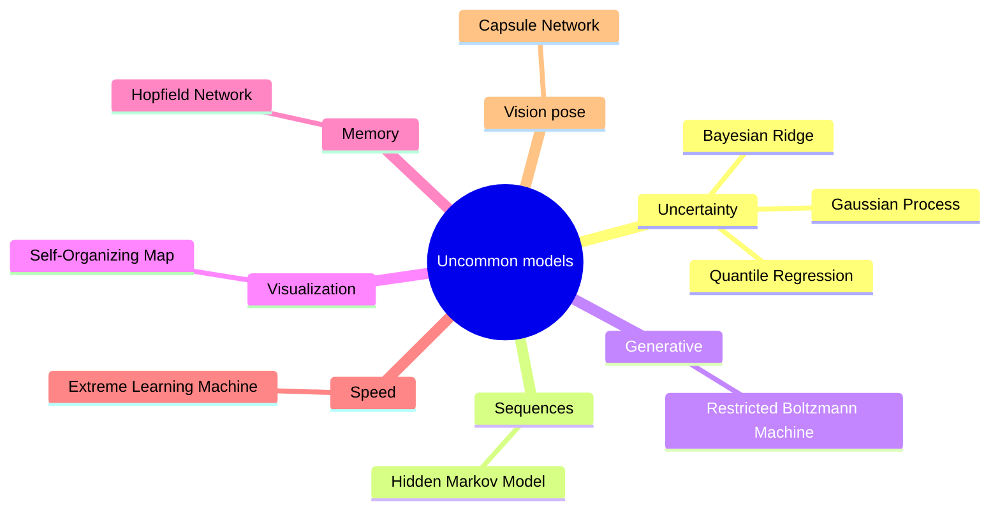
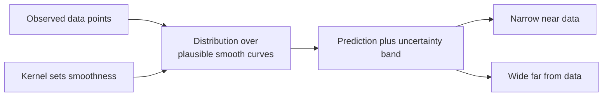
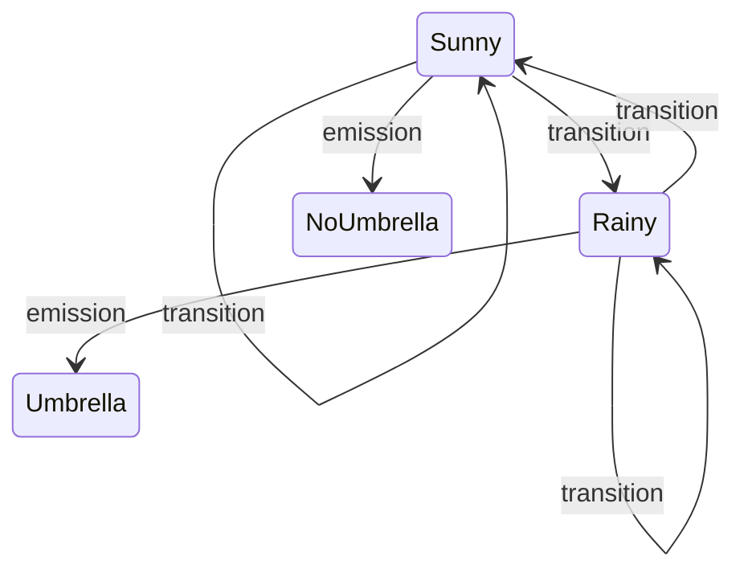

# Uncommon Machine Learning Models

Most machine-learning courses circle the same dozen workhorses: linear regression, decision trees, random forests, SVMs, neural networks. But the field is far wider. This guide tours a collection of **lesser-known models** methods that don't appear in every tutorial yet are genuinely powerful, each shining in a specific situation that the mainstream tools handle poorly. Knowing they exist means that when you hit an unusual problem needing honest uncertainty estimates, modeling sequences, learning from tiny data, or building associative memory you'll reach for the right tool instead of forcing a familiar one.

A few terms used throughout: a **feature** is an input variable describing an example; a **label** or **target** is the value we want to predict; **training** is fitting the model to data; and **uncertainty quantification** means a model telling you not just its answer but *how sure it is* a property several of these models provide and most common ones don't.

**Figure: Picking an uncommon model by the problem it solves**

## Gaussian Processes (GP)

**What it is:** instead of fitting a single best curve through your data, a Gaussian Process represents a whole *distribution over possible curves* that are consistent with what you've seen. You get a prediction *and* a principled error bar around it.

**Figure: A Gaussian Process gives predictions with honest error bars**

**Intuition:** picture all the smooth functions that could plausibly pass through your data points. Near observed points, those functions agree closely, so the GP is confident (narrow error bars). Far from any data, the functions fan out, so uncertainty grows (wide error bars). A **kernel** function defines how "similar" two inputs are and thus how smooth the curves should be common choices include the **RBF (squared-exponential)** kernel for very smooth functions, the **Matérn** kernel for rougher ones, and **periodic** kernels for repeating patterns. The GP cell fits a noisy sine wave and draws the shaded uncertainty band that widens away from the data.

**Strengths:** excellent, honest uncertainty estimates; works well with very little data; flexible through kernel choice. This makes GPs the engine behind **Bayesian optimization** (intelligently searching for the best settings of an expensive experiment) and **active learning** (choosing which examples to label next). **Weaknesses:** computationally expensive it scales badly to large datasets and sensitive to kernel choice.

## Hidden Markov Models (HMM)

**What it is:** a model for *sequences* where the thing you care about is hidden and you only see indirect clues. The system moves through unseen **states** over time, and each state emits an **observation** you can measure.

**Figure: Hidden states emit observations in an HMM**

**Intuition:** imagine guessing the weather (hidden states: sunny/rainy) by only seeing whether a friend carries an umbrella (observation). An HMM captures two things: how likely you are to move from one hidden state to another (**transition probabilities**) and how likely each state is to produce each observation (**emission probabilities**). With these it answers three questions: how probable is an observed sequence, what's the single most likely sequence of hidden states (solved by the **Viterbi algorithm**), and how to learn the probabilities from data (the **Baum-Welch** algorithm). The HMM cell decodes a weather example with Viterbi.

**Strengths:** principled for sequential/temporal data; interpretable. **Use cases:** speech recognition, part-of-speech tagging, bioinformatics (gene sequences). **Weaknesses:** the assumption that the next state depends only on the current one is often too simple; largely superseded by neural sequence models for big tasks but still valuable for small, structured ones.

## Restricted Boltzmann Machines (RBM)

**What it is:** an early generative neural network with a layer of **visible** units (the data) and a layer of **hidden** units (learned features), with no connections within a layer.

**Intuition:** the RBM learns a probability distribution over the data by balancing an "energy" function so that real data patterns become low-energy (likely) and others high-energy (unlikely). It's trained with **Contrastive Divergence**, an approximation that compares the data to the model's own "dreams." Historically, stacks of RBMs pre-trained deep networks before modern techniques made that unnecessary, but they remain a clear illustration of generative, energy-based learning. **Use cases:** feature learning, collaborative filtering, dimensionality reduction.

## Self-Organizing Maps (SOM)

**What it is:** an unsupervised neural network that projects high-dimensional data onto a 2D grid while preserving its **topology** points that are near in the original space land near each other on the map.

**Intuition:** each grid cell holds a prototype vector. For each data point, the closest prototype (the **Best Matching Unit**) and its grid neighbors are nudged toward that point. Over time, the grid organizes itself into a tidy 2D summary of the data's structure, like flattening a complex shape onto a sheet without tearing nearby regions apart. The SOM cell trains on the iris dataset. **Strengths:** great for visualization and clustering high-dimensional data. **Weaknesses:** results depend on grid size and training schedule; less precise than modern reduction methods.

## Hopfield Networks

**What it is:** a form of **associative memory** a network that stores patterns and can recall a complete one from a partial or corrupted version.

**Intuition:** the network is trained (via **Hebbian learning**, "neurons that fire together wire together") so each stored pattern becomes a stable low-energy state. Show it a noisy or incomplete pattern, and it iteratively flips its units to roll "downhill" into the nearest stored pattern reconstructing the original. It's **content-addressable memory**: you retrieve a memory by its content, not an address. The Hopfield cell stores patterns and recalls them from noisy inputs. **Limitation:** capacity is small (roughly 0.14 patterns per neuron); overload it and memories blur together.

## Extreme Learning Machine (ELM)

**What it is:** a single-hidden-layer neural network with a shortcut the input-to-hidden weights are set *randomly and never trained*, and only the hidden-to-output weights are solved for.

**Intuition:** because only the output layer needs learning, and that's a simple linear least-squares problem (solved in one shot via the pseudoinverse), training is astonishingly fast compared to gradient descent. The random hidden layer acts as a fixed nonlinear feature transformer. The ELM cell demonstrates this with a tanh hidden layer. **Strengths:** extremely fast training, good for real-time settings. **Weaknesses:** the randomness can make results variable and sometimes less accurate than fully trained networks.

## Specialized Regression Models

The folder also surveys several regression methods for situations ordinary linear regression handles badly:

- **Quantile Regression:** instead of predicting the *average* outcome, it predicts a chosen **quantile** (e.g., the 10th or 90th percentile), giving prediction *intervals* and a view of the whole distribution rather than just its center. Invaluable for risk and uncertainty (e.g., worst-case demand).
- **Isotonic Regression:** fits a non-decreasing step function useful when you know the relationship can only go up (or only down), such as "more advertising never decreases sales," and especially for **calibrating** classifier probabilities.
- **Bayesian Ridge Regression:** a probabilistic take on regularized linear regression that returns uncertainty estimates alongside predictions and auto-tunes its own regularization strength from the data. The cell reports its estimated noise and weight-precision parameters.
- **Kernel Ridge Regression (KRR):** combines ridge regression with the kernel trick to fit smooth nonlinear curves; closely related to support vector regression but trained differently.
- **Relevance Vector Machine (RVM):** a Bayesian sibling of the SVM that yields probabilistic outputs and an even sparser model, automatically keeping only the few training points that truly matter.
- **MARS (Multivariate Adaptive Regression Splines):** automatically builds a flexible model from piecewise-linear "hinge" functions, discovering where to bend and which feature interactions matter bridging interpretable linear models and flexible nonlinear ones for tabular data.

## Prototype and Basis-Function Models

- **Learning Vector Quantization (LVQ):** a classifier that keeps a few **prototype** points per class and, during training, pulls a prototype toward correctly classified examples and pushes it away from mistakes. Prediction is just nearest-prototype lookup fast and interpretable.
- **Radial Basis Function Networks (RBFN):** a two-layer network whose hidden units respond to how close an input is to learned **centers** (often found by k-means), then linearly combine those responses. Good for smooth function approximation.

## Capsule Networks (CapsNet)

A deep-learning architecture designed to fix a weakness of ordinary convolutional networks: losing track of the *spatial relationships and poses* of parts. A **capsule** is a small group of neurons that outputs a *vector* its length encodes the probability a feature is present, and its direction encodes that feature's properties (orientation, size). A **dynamic routing** mechanism lets lower-level capsules "vote" for higher-level ones they agree with. The aim is recognizing objects robustly even when rotated or viewed from new angles. **Use case:** vision tasks where part-whole geometry matters.

## When to Reach for Each

| Model | Special power | Typical use |
|---|---|---|
| Gaussian Process | Calibrated uncertainty, tiny data | Bayesian optimization, active learning |
| HMM | Sequential hidden states | Speech, NLP, bioinformatics |
| RBM | Generative feature learning | Pre-training, collaborative filtering |
| SOM | Topology-preserving 2D map | Visualization, clustering |
| Hopfield Network | Associative recall | Pattern completion, denoising |
| ELM | Ultra-fast training | Real-time, large-batch settings |
| Quantile Regression | Prediction intervals | Risk, uncertainty estimation |
| Isotonic Regression | Monotonic fits | Probability calibration |
| Bayesian / Kernel Ridge | Uncertainty / smooth nonlinear | Small-data regression |
| MARS | Automatic interactions | Interpretable tabular regression |
| CapsNet | Pose-aware recognition | Rotated/3D vision objects |

The lesson is not that you'll use these every day, but that the machine-learning toolbox is deep. When a standard model fails in a specific way no uncertainty, no sequence handling, too little data, no associative recall one of these specialized tools is often the elegant answer.
