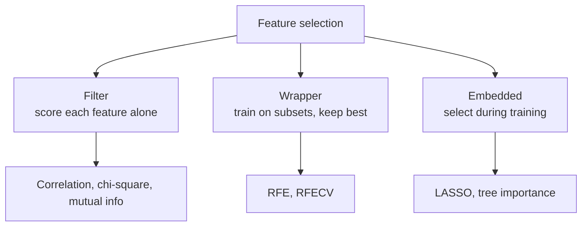
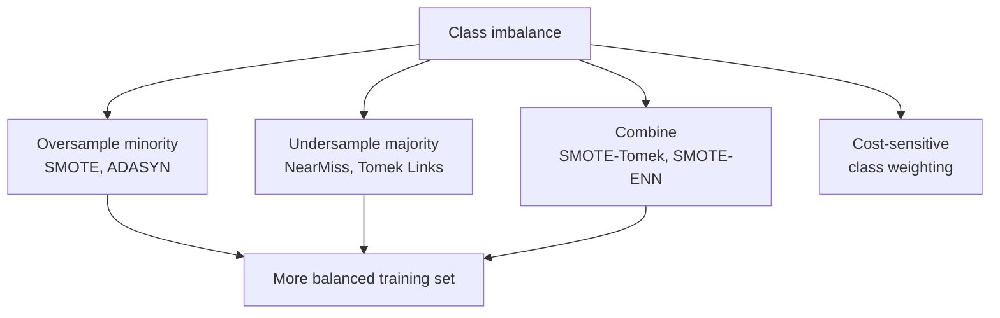

# Feature Engineering and Imbalanced Data

There is a well-worn saying in machine learning: *"better data beats a fancier algorithm."* The raw numbers and categories you collect are rarely in the form a model learns from best. **Feature engineering** is the craft of reshaping that raw data into informative inputs, and it routinely produces bigger accuracy gains than swapping models. This folder covers two deeply practical topics: **feature engineering** (preparing and creating good features) and **imbalanced data** (coping when one class vastly outnumbers another).

**Figure: The feature engineering pipeline before the model**

First, the vocabulary. A **feature** is a single measurable property of an example a column in your table. A **label** (or **target**) is the value you want to predict. A **model** learns the relationship from features to label. Feature engineering is everything you do to the features *before* the model sees them.

## Part 1 Feature Engineering (`01_feature_engineering.ipynb`)

### Feature Scaling and Transformation

Many algorithms are sensitive to the *scale* of features. If "annual income" is in the tens of thousands and "age" is in the tens, a distance- or gradient-based model will wrongly treat income as far more important simply because its numbers are bigger. **Scaling** puts features on comparable footing.

- **Standardization (Z-score):** shifts and stretches a feature so it has an average of zero and a typical spread of one. The default choice for most algorithms.
- **Min-Max normalization:** squeezes a feature into a fixed range, usually 0 to 1. Useful when you need bounded inputs (e.g., for neural networks or image pixels).
- **Robust scaling:** scales using the median and the interquartile range (the middle 50% of the data) instead of the mean and standard deviation, so a few extreme **outliers** don't distort it.
- **MaxAbs scaling:** divides by the largest absolute value, mapping to the −1 to 1 range while preserving sparsity (zeros stay zero).

Beyond rescaling, some features are badly *shaped* heavily skewed, with a long tail. **Power transforms** fix this: the **Box-Cox** and **Yeo-Johnson** transformations bend a skewed feature toward a symmetric, bell-like shape (Yeo-Johnson also handles zero and negative values). The **quantile transform** forcibly remaps any feature to a uniform or normal distribution. Symmetric, well-behaved features help models that assume normality. The scaler-comparison cell visualizes how each method reshapes the same data.

### Encoding Categorical Variables

Models do arithmetic, so text categories ("red," "blue," "green") must become numbers but *how* you convert them matters enormously.

- **Ordinal encoding:** maps categories to integers (small → 0, medium → 1, large → 2). Correct only when the categories have a real *order*; using it on unordered categories falsely tells the model that "green" is greater than "red."
- **One-hot encoding:** creates a separate yes/no column for each category. Safe for unordered categories but can explode the number of columns when a category has many values.
- **Target (mean) encoding:** replaces each category with the average target value for that category compact and powerful, but it risks **leakage** (peeking at the answer), so it needs **smoothing** and careful cross-validation. The target-encode cell applies smoothing to temper rare categories.
- **Frequency/count encoding:** replaces a category with how often it appears.
- **Binary and hashing encoding:** compress high-cardinality categories into fewer columns when one-hot would be too wide.

### Handling Missing Values

Real data has gaps. Why a value is missing matters: it can be **MCAR** (missing completely at random), **MAR** (missingness depends on other observed features), or **MNAR** (missingness depends on the missing value itself, the trickiest case). Strategies:

- **Simple imputation:** fill gaps with the column's mean, median, or most frequent value. Fast but crude.
- **KNN imputation:** fill a gap using the values of the most similar rows.
- **Iterative imputation (MICE):** model each feature-with-gaps from the others, looping until estimates stabilize the most sophisticated option.
- **Missingness indicators:** add a flag column marking where a value was missing, so the model can learn that the *absence itself* is informative.

### Feature Selection

More features is not always better irrelevant or redundant ones add noise, slow training, and invite overfitting. **Feature selection** keeps only the useful ones. Three families:

**Figure: Three families of feature selection**

- **Filter methods** score each feature independently of any model: **Pearson correlation** (linear relationship with the target), the **chi-square test** (for categorical features), the **ANOVA F-test**, and **mutual information** (which captures *nonlinear* dependence too). Fast and model-agnostic.
- **Wrapper methods** repeatedly train a model on different feature subsets and keep what works best. **Recursive Feature Elimination (RFE)** trains a model, drops the weakest feature, and repeats; **RFECV** adds cross-validation to decide how many to keep. Accurate but computationally heavier.
- **Embedded methods** select features as a side effect of training. **LASSO** (L1 regularization) drives useless features' weights to exactly zero, and **tree-based importance** ranks features by how much they reduced impurity. Efficient and effective.

### Creating New Features

The most creative part inventing features that expose patterns the model couldn't otherwise see:

- **Polynomial and interaction features:** products and powers of existing features (e.g., `length × width = area`) let linear models capture curves and combined effects.
- **Datetime extraction:** from a timestamp, pull out year, month, day, hour, weekday, quarter, and "is it a weekend" each can carry real signal.
- **Cyclical encoding:** time features wrap around (hour 23 is next to hour 0; December is next to January). Encoding them with sine and cosine pairs preserves that circular closeness, which plain integers destroy.
- **Ratios:** dividing one feature by another (e.g., debt-to-income) often captures meaning better than either alone.

### Pipelines

Doing all this by hand invites mistakes and, worse, **data leakage** accidentally letting information from the test set influence training (for example, computing a scaling mean over the whole dataset before splitting). A **Pipeline** chains preprocessing and modeling into one object that applies each step in the right order and recomputes statistics correctly within each cross-validation fold. **ColumnTransformer** lets you apply different transformations to different column types (scale the numbers, one-hot the categories) in one tidy package. The pipeline cell assembles imputation, scaling, selection, and a classifier together.

## Part 2 Imbalanced Data (`02_imbalanced_data.ipynb`)

### The Problem

In many important problems, one class is rare: fraud is a tiny fraction of transactions, disease a small fraction of patients, defects a small fraction of products. This is **class imbalance**, and it breaks naive modeling. A model can score 99% **accuracy** on a fraud dataset by simply predicting "not fraud" for everyone while catching zero fraud. Accuracy is the wrong yardstick here.

### Measuring Performance Honestly

For imbalanced data, look past accuracy to metrics that respect the rare class:
- **Precision:** of the cases flagged positive, how many really were measures false-alarm rate.
- **Recall:** of the actual positives, how many were caught measures how many we missed.
- **F1 score:** the balance of precision and recall.
- **PR-AUC (area under the precision-recall curve):** far more informative than ROC-AUC when positives are rare, because it focuses on performance on the minority class.
- **G-Mean** and **Matthews Correlation Coefficient (MCC):** single numbers that stay meaningful even under heavy imbalance.

### Resampling: Oversampling the Minority

**Figure: Strategies for handling class imbalance**

One fix is to rebalance the training data by adding minority examples.
- **Random oversampling:** simply duplicate minority examples easy, but duplicates can cause overfitting.
- **SMOTE (Synthetic Minority Over-sampling Technique):** instead of copying, it *creates new synthetic* minority examples by interpolating between a real minority point and its nearby minority neighbors filling in the region rather than stacking copies.
- **ADASYN:** like SMOTE but generates more synthetic points in the *harder* regions near the decision boundary, where the model struggles most.
- **Borderline-SMOTE** focuses synthesis on the borderline cases; **SMOTE-NC** handles mixed numeric-and-categorical data; **SMOTE-SVM** uses support vectors to guide where to generate.

### Resampling: Undersampling the Majority

The complementary fix is to shrink the dominant class.
- **Random undersampling:** drop majority examples at random fast, but throws away potentially useful data.
- **NearMiss:** keeps majority examples chosen by their distance to the minority (several variants exist).
- **Tomek Links:** removes majority points that sit right against a minority point of the other class, cleaning up the boundary.
- **Edited Nearest Neighbors (ENN)** and its relatives (**Repeated ENN**, **All-KNN**, **Neighbourhood Cleaning Rule**, **One-Sided Selection**): remove majority points that disagree with their neighbors, sharpening class regions.
- **Cluster Centroids** replaces clusters of majority points with their centers; **Instance Hardness Threshold** drops easy, redundant majority points.

### Combined and Ensemble Approaches

- **SMOTE-Tomek** and **SMOTE-ENN** first synthesize minority points, then clean up noisy boundaries getting the benefits of both directions.
- Specialized ensembles bake balancing into the model: **BalancedRandomForest** and **BalancedBaggingClassifier** undersample within each tree; **EasyEnsemble** and **RUSBoost** train many balanced sub-models and combine them.

### Cost-Sensitive Learning

Rather than changing the data, you can change the *penalty*. **Class weighting** tells the model that misclassifying the rare class costs more, so it pays the minority more attention. Setting `class_weight='balanced'` automatically weights classes inversely to their frequency; you can also set custom costs (e.g., a missed fraud costs ten times a false alarm) to match the real-world stakes.

### Choosing a Strategy

| Situation | Good first choice |
|---|---|
| Mild imbalance | Class weighting / cost-sensitive learning |
| Moderate imbalance, enough data | SMOTE or SMOTE-ENN |
| Severe imbalance, huge majority | Undersampling or balanced ensembles |
| Need calibrated probabilities | Cost-sensitive over resampling |

A crucial rule: **resample only the training data, never the test data.** The test set must reflect the real, imbalanced world, or your evaluation will lie to you. As with feature engineering, doing the resampling *inside* a pipeline keeps the test data untouched and your results trustworthy.

## The Takeaway

Feature engineering and imbalance handling are where domain knowledge meets machine learning. A thoughtfully scaled, encoded, and enriched feature set combined with honest metrics and the right rebalancing frequently outperforms a more complex model fed raw, lopsided data. This is often the highest-leverage work in the entire pipeline.
