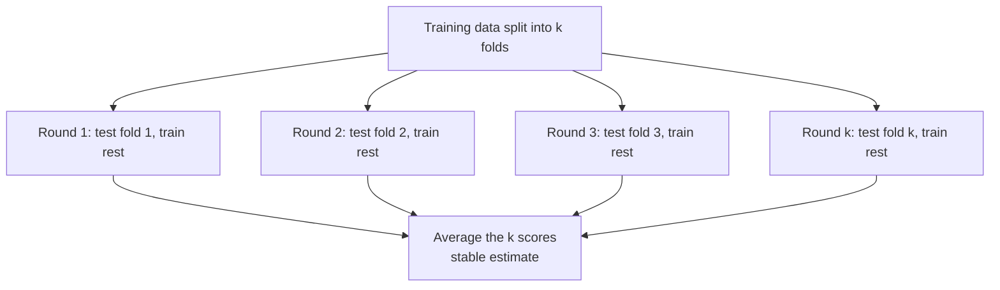
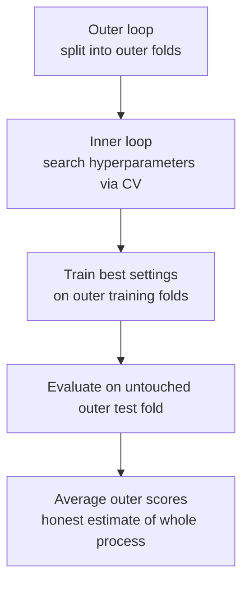
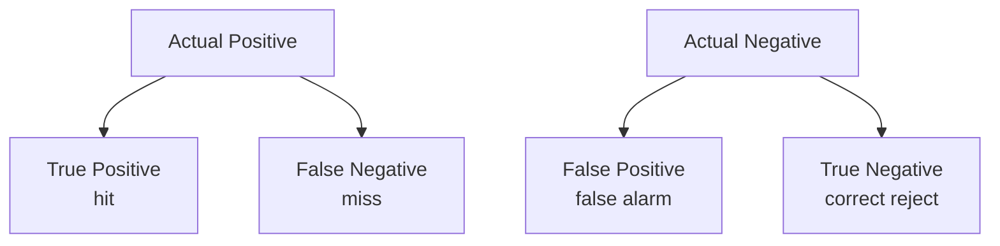
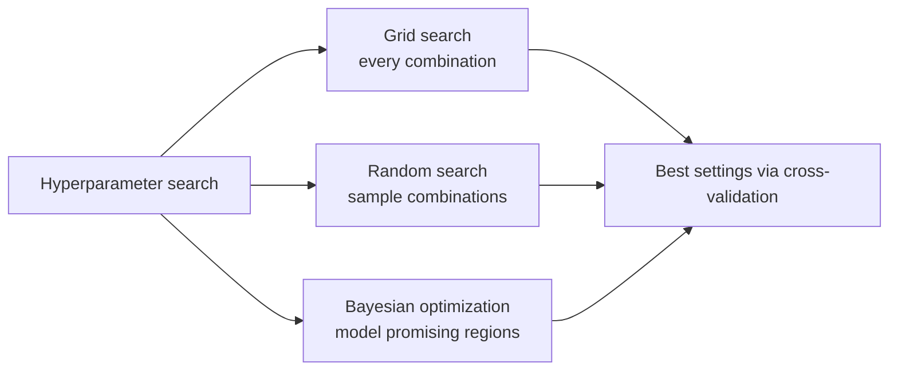

# Model Evaluation

Building a model is only half the job; the other half is knowing whether it actually works and *will keep working on data it has never seen*. This is the discipline of **model evaluation**: measuring performance honestly, choosing the right yardstick for the task, validating in a way that predicts real-world behavior, and tuning a model's settings without fooling yourself. Skipping or sloppily doing this step is the single most common reason machine-learning projects fail in production.

Some grounding terms: a **model** maps **features** (inputs) to a prediction; the **label** (or **target**) is the true answer; **training** is fitting the model to data; **generalization** is how well it performs on *new* data. The whole point of evaluation is to estimate generalization before you commit.

## The Fundamental Risk: Overfitting

A model can score perfectly on the data it trained on and still be worthless, because it **overfit** it memorized the training examples (including their random noise) rather than learning the underlying pattern. The opposite failure is **underfitting**, where the model is too simple to capture the real signal. Evaluation exists to detect overfitting, and it does so by one ironclad principle: **always judge a model on data it did not train on.**

## Validation Strategies (`01_model_evaluation.ipynb`)

### Hold-Out Split

The simplest approach: randomly set aside a portion of the data (say 20%) as a **test set** the model never sees during training, and evaluate on it. Often a third slice, the **validation set**, is also held out for tuning. The weakness: with a single split, your performance estimate depends on the luck of which examples happened to land in the test set it can be noisy.

### k-Fold Cross-Validation

**Figure: k-fold cross-validation rotates the held-out fold**

A more reliable method. Split the data into *k* equal **folds**. Train on *k*−1 of them and test on the held-out fold; rotate so every fold serves as the test set exactly once; average the *k* scores. Now every example is used for both training and testing (at different times), and the averaged score is far more stable than a single split's. The cross-validation comparison cell evaluates several such strategies on the same data, reporting each one's mean and spread.

### Stratified k-Fold

When classes are **imbalanced** (one much rarer than another), an ordinary random split might leave almost no rare examples in some folds. **Stratified k-fold** preserves the original class proportions in every fold, which is essential for fair evaluation of classification problems.

### Leave-One-Out (LOO)

The extreme case where *k* equals the number of examples: train on all but one point, test on that single point, repeat for every point. It uses data maximally and is nearly unbiased, but it's computationally expensive and only practical for small datasets.

### Nested Cross-Validation

A subtle trap: if you use the same cross-validation both to *tune* hyperparameters and to *report* final performance, the reported number is optimistically biased you've effectively peeked at the test data while choosing settings. **Figure: Nested cross-validation separates tuning from evaluation**

**Nested cross-validation** fixes this with two loops. The **inner loop** searches for the best hyperparameters; the **outer loop** evaluates the whole tuning-plus-training procedure on truly untouched folds. The result is an honest estimate of how the *entire process* will perform on new data.

## Choosing the Right Metric

A metric is the lens through which you judge a model, and the wrong lens hides real problems.

### Classification Metrics

**Figure: The confusion matrix layout**

These build on the **confusion matrix**, which tallies four outcomes: **true positives** (TP), **true negatives** (TN), **false positives** (FP, a false alarm), and **false negatives** (FN, a miss).

- **Accuracy:** fraction of all predictions correct. Intuitive but dangerously misleading under imbalance predicting the majority class always can look "accurate" yet be useless.
- **Precision** (TP / (TP + FP)): of everything predicted positive, how much really was. High precision = few false alarms.
- **Recall / Sensitivity** (TP / (TP + FN)): of all real positives, how many were caught. High recall = few misses.
- **Specificity:** recall for the negative class.
- **F1 score:** the harmonic mean of precision and recall, rewarding balance; **F-beta** lets you favor one over the other.
- **Balanced accuracy** and **G-Mean:** average performance across classes, fair under imbalance.
- **ROC-AUC:** the area under the curve of true-positive rate versus false-positive rate as the decision threshold varies. It measures how well the model *ranks* positives above negatives, independent of any single threshold; 0.5 is random, 1.0 is perfect.
- **PR-AUC:** area under the precision-recall curve more informative than ROC-AUC when positives are rare.
- **Log loss:** penalizes confident wrong probability predictions, rewarding well-calibrated confidence.
- **Cohen's Kappa:** agreement corrected for what chance alone would produce.
- **Matthews Correlation Coefficient (MCC):** a single balanced score widely regarded as the best summary for imbalanced classification.

The classification cell evaluates a gradient-boosting model across this full set, plotting the confusion matrix, ROC curve, and precision-recall curve.

### Regression Metrics

- **MAE (Mean Absolute Error):** average size of errors, in the target's own units; treats all errors proportionally.
- **MSE / RMSE:** average squared error and its square root; punish large errors more heavily.
- **MAPE / sMAPE:** errors as percentages (handy for interpretability, but MAPE breaks down when true values are near zero).
- **R²:** the fraction of the target's variation the model explains (1.0 perfect, 0 no better than guessing the mean). **Adjusted R²** corrects for the number of features so adding junk features can't inflate the score.

The regression cell computes these for a gradient-boosting regressor.

## Hyperparameter Tuning

Most models have **hyperparameters** settings chosen *before* training that aren't learned from data (tree depth, learning rate, regularization strength). Finding good ones is a search problem.

**Figure: Three hyperparameter search strategies**

- **Grid search:** try every combination in a predefined grid. Thorough but explodes combinatorially as you add parameters.
- **Random search:** sample combinations at random. Surprisingly, this often finds good settings faster than grid search because it explores more values of the parameters that actually matter.
- **Bayesian optimization (e.g., Optuna):** the smart approach it builds a model of which settings tend to work well and focuses its trials on promising regions, reaching good results in far fewer evaluations. The Optuna cell runs a guided search and reports the best parameters and score.

Crucially, all tuning must be done using cross-validation on training data, with the final test set reserved untouched for the last, honest measurement.

## Calibration

Beyond *whether* a model is right, sometimes you need its confidence to be *trustworthy*. A model is **well-calibrated** if, among all the times it predicts "70% probability," about 70% really turn out positive. Many models (boosted trees, SVMs) produce uncalibrated scores. The **Expected Calibration Error (ECE)** measures the gap between predicted confidence and actual correctness. Calibration methods fix it: **Platt scaling** fits a sigmoid to the model's outputs, **isotonic regression** fits a flexible non-decreasing mapping, and **temperature scaling** softens or sharpens neural-network probabilities. Calibration matters whenever decisions depend on the *probability* itself medical risk, pricing, thresholding.

## A Sound Evaluation Workflow

1. **Hold out a test set first** and don't touch it until the very end.
2. **Pick metrics that fit the task** never rely on accuracy alone, especially under imbalance.
3. **Use (stratified) cross-validation** on the remaining data for stable estimates.
4. **Tune hyperparameters** with grid/random/Bayesian search *inside* cross-validation.
5. **Use nested CV** when you need an unbiased estimate of the full pipeline.
6. **Check calibration** if probabilities drive decisions.
7. **Report on the untouched test set** once that number is your honest forecast.

Get this right and you can trust your model in the wild. Get it wrong, and a model that dazzles in the notebook will quietly fail the moment it meets real data.
