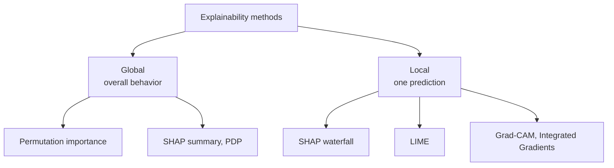
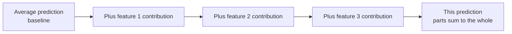
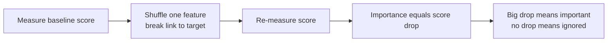

# Explainability and Interpretability

A machine-learning model can be highly accurate and still be a **black box** it gives answers, but no one, not even its creators, can say *why*. As models grow more complex (deep neural networks, large gradient-boosted ensembles), this opacity becomes a serious problem. **Explainability** (also called **interpretability**) is the set of techniques for opening that black box: understanding what a model learned, why it made a particular prediction, and which features drove it.

This isn't just academic curiosity. Explanations are needed to **trust** a model before deploying it, to **debug** it when it misbehaves, to **detect bias** and unfair treatment, to **comply** with regulations (laws increasingly grant people a "right to an explanation" for automated decisions), and to **improve** models by revealing what they rely on.

Two quick definitions before we start: a **feature** is an input variable; a **prediction** is the model's output. Explainability methods split into **global** (explaining the model's overall behavior) and **local** (explaining one individual prediction). They also split into **model-specific** (work only for certain model types) and **model-agnostic** (work for any model, treating it as a black box).

**Figure: Mapping explainability methods by scope**

## SHAP The Theory of Fair Attribution

**SHAP (SHapley Additive exPlanations)** is the most principled and popular explainability method, and it answers a deceptively simple question: *for this one prediction, how much did each feature contribute?*

**Figure: SHAP splits a prediction into additive feature contributions**

**Intuition:** imagine the features are teammates who together produced a prediction, and you want to fairly split the "credit" among them. SHAP borrows a concept from cooperative game theory called the **Shapley value**, which is the mathematically fair way to divide a payout among players based on what each contributes across all possible orderings of joining the team. Applied here: SHAP measures how much adding a given feature changes the prediction, averaged over every possible combination of the other features. The result is a contribution value for each feature positive if it pushed the prediction up, negative if down and these contributions *add up* exactly to the difference between this prediction and the average prediction. That additivity is what makes SHAP both interpretable and trustworthy.

SHAP satisfies appealing fairness properties: features contributing equally get equal credit (**symmetry**), irrelevant features get zero (**dummy**), and the parts sum to the whole (**efficiency/completeness**).

Computing exact Shapley values is expensive, so SHAP has fast variants for different model types: **TreeSHAP** (exact and fast for tree-based models like random forests and gradient boosting), **DeepSHAP** (for neural networks), **LinearSHAP** (for linear models), and **KernelSHAP** (a slower, fully model-agnostic fallback that works on anything). The explainability notebook uses TreeSHAP, drawing **summary plots** that rank feature importance globally and **waterfall/force plots** that break down a single prediction feature by feature.

**Strengths:** theoretically grounded, gives both global and local views, consistent. **Weaknesses:** computationally heavy for the model-agnostic version; assumes features can be reasoned about somewhat independently.

## LIME Local Surrogate Explanations

**LIME (Local Interpretable Model-agnostic Explanations)** takes a different, more intuitive approach to explaining a single prediction.

**Intuition:** any complicated model, if you zoom in close enough around one specific data point, looks roughly simple like how the curved Earth looks flat in your backyard. LIME exploits this. To explain one prediction, it generates many slightly perturbed versions of that example, asks the black-box model what it predicts for each, weights them by how close they are to the original, and then fits a *simple, interpretable* model (usually plain linear regression) to that local neighborhood. The simple model's weights become the explanation: which features mattered, and in which direction, right here.

**Strengths:** completely model-agnostic, intuitive, works for tabular data, text, and images. **Weaknesses:** explanations can be unstable (rerunning may give different results because the perturbations are random), and the "local neighborhood" definition is somewhat arbitrary.

## Permutation Feature Importance

A simple, robust, model-agnostic way to ask *which features matter to the model overall.*

**Figure: Permutation feature importance flow**

**Intuition:** if a feature is important, scrambling it should hurt performance. So **permutation importance** randomly shuffles one feature's values (breaking its link to the target), measures how much the model's accuracy drops, and ranks features by that drop. A big drop means the model relied heavily on that feature; no drop means it was ignored. It's computed on held-out data and repeated several times for stability. Its one caveat: when two features are strongly correlated, importance can be misleadingly split or hidden between them.

## Partial Dependence and ICE Plots

These reveal the *shape* of a feature's effect not just whether it matters, but *how*.

- **Partial Dependence Plots (PDP):** show the average predicted outcome as you vary one feature across its range, holding everything else as it is. A PDP answers "as income rises, how does the predicted approval probability change *on average*?" revealing whether the relationship is increasing, flat, U-shaped, and so on.
- **Individual Conditional Expectation (ICE):** the same idea but plotted as one line *per example* instead of a single average. ICE plots expose **heterogeneous effects** cases where a feature pushes some individuals up and others down, a nuance the averaged PDP would hide.

## Explaining Deep Vision Models

Neural networks for images need their own tools, since "feature contribution" means highlighting *pixels and regions*.

- **Grad-CAM (Gradient-weighted Class Activation Mapping):** produces a heatmap over the input image showing which regions most influenced the network's decision. If a model labels a photo "dog," Grad-CAM reveals whether it focused on the dog or on some irrelevant background cue a powerful way to catch a model "cheating."
- **Integrated Gradients:** attributes the prediction to individual input pixels by accumulating gradients along a path from a blank **baseline** image to the actual image. It satisfies a completeness property (the attributions sum to the prediction's change) and gives cleaner pixel-level explanations than raw gradients.

## Documentation: Model Cards

Explainability isn't only algorithms it's also **communication**. **Model Cards** are a structured documentation format (introduced by Google) that accompanies a model with its intended uses, the data it was trained on, performance across different groups, known limitations, and ethical considerations. They make a model's strengths and blind spots transparent to anyone who might use it, supporting responsible deployment.

## Choosing an Explainability Method

| Method | Scope | Model types | Best for |
|---|---|---|---|
| SHAP | Local + Global | Any (fast for trees) | Trustworthy, additive attributions |
| LIME | Local | Any | Quick intuitive single-prediction explanations |
| Permutation Importance | Global | Any | Ranking overall feature importance |
| PDP / ICE | Global / Local | Any | Understanding a feature's effect shape |
| Grad-CAM | Local | CNNs (images) | Seeing where a vision model looks |
| Integrated Gradients | Local | Differentiable models | Pixel-level attributions |
| Model Cards | Documentation | Any | Responsible communication |

## A Practical Mindset

Use **global** methods (permutation importance, SHAP summary plots, PDPs) to understand what your model relies on as a whole, and **local** methods (SHAP waterfall, LIME, Grad-CAM) to investigate specific predictions especially surprising or high-stakes ones. Cross-check methods against each other; if SHAP and permutation importance disagree wildly, dig in. And remember the goal isn't a pretty chart but genuine understanding: explainability turns a model from an oracle you must blindly trust into a tool you can question, debug, and improve.
