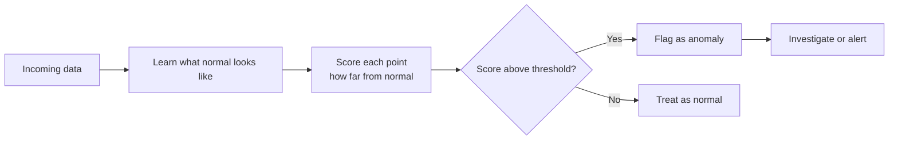
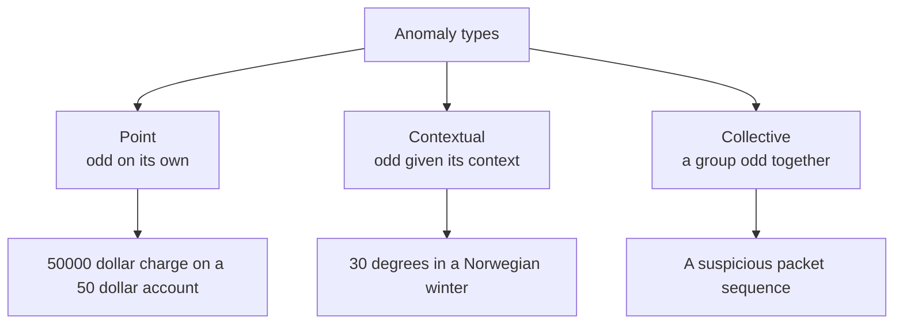
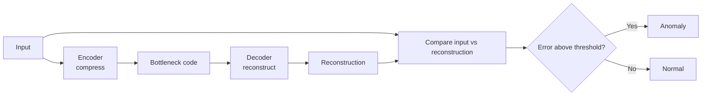

# Anomaly Detection

**Anomaly detection** (also called outlier or novelty detection) is the task of finding the data points that don't fit the rare, the unexpected, the suspicious. A fraudulent credit-card charge among millions of normal ones, a failing sensor in a factory, an intruder in network traffic, a tumor in a scan: these are anomalies, and spotting them automatically is one of the most valuable things machine learning does.

What makes anomaly detection special and hard is that anomalies are, by definition, **rare** and often **unknown in advance**. You usually can't simply train a normal classifier, because you have very few (or zero) examples of the "bad" class, and tomorrow's anomaly may look nothing like yesterday's. So instead of learning "what fraud looks like," most anomaly detection learns "what *normal* looks like" and flags anything that deviates.

A few terms: a **feature** is a measured property of a data point; an **outlier** is a point far from the bulk of the data; **contamination** is the (often estimated) fraction of the data expected to be anomalous.

**Figure: The anomaly detection pipeline**

## Types of Anomalies (`01_anomaly_detection.ipynb`)

Not all anomalies are alike, and the type shapes which method you need:

**Figure: Three types of anomalies**

- **Point anomaly:** a single data point that is odd on its own a $50,000 purchase on an account that usually spends $50. The simplest and most common type.
- **Contextual anomaly:** a point that is normal in general but abnormal *in its context*. A temperature of 30°C is fine in summer but anomalous in a Norwegian winter. The same value, different meaning depending on context (often time or location).
- **Collective anomaly:** a *group* of points that is anomalous together even though each point alone looks fine. A particular sequence of network packets might individually be ordinary but collectively signal an attack.

## Statistical Methods

The oldest and simplest approaches assume normal data follows a known distribution and flag points that are statistically extreme.

- **Z-score method:** measures how many standard deviations a point is from the mean. If it's more than a chosen threshold (commonly 3) away, flag it. Simple and effective for roughly bell-shaped, single-feature data.
- **IQR (Interquartile Range) method:** uses the middle 50% of the data; anything far below the lower quartile or above the upper quartile (the classic "1.5 × IQR" rule behind box-plot whiskers) is an outlier. Robust because it ignores the extremes when defining "normal."
- **Mahalanobis distance:** the multi-feature generalization. Plain distance from the center treats all directions equally, but real features are correlated and have different spreads; Mahalanobis distance accounts for that correlation and scale, correctly identifying points that are unusual *given how the features normally move together*.
- **Grubbs test:** a formal statistical test for whether the single most extreme value in a dataset is a genuine outlier.

**Strengths:** simple, fast, interpretable. **Weaknesses:** assume a known distribution and struggle with complex, high-dimensional, or non-Gaussian data.

## Isolation Forest

**What it is:** a clever, modern, tree-based method built specifically for anomalies.

**Intuition:** flip the usual logic around. Anomalies are *few and different*, which means they're **easy to isolate**. Imagine repeatedly slicing the data with random splits: a point buried in a dense normal cluster takes many cuts to isolate, but an outlier sitting alone in empty space gets separated after just a few. Isolation Forest builds many random trees and measures how few splits, on average, it takes to isolate each point. Short average path = anomaly. It never needs to model "normal" explicitly it directly exploits that anomalies are easy to cut off. The `contamination` parameter tells it roughly what fraction to flag.

**Strengths:** fast, scales to large and high-dimensional data, no distributional assumptions, works well out of the box. A strong default choice. **Weaknesses:** less effective for local anomalies hidden within varying-density data.

## Local Outlier Factor (LOF)

**What it is:** a **density-based** method that finds points which are in sparser regions than their neighbors.

**Intuition:** rather than asking "is this point far from the center?" LOF asks "is this point isolated *relative to its local neighborhood*?" It compares the local density around a point to the density around that point's neighbors. A point sitting in a much sparser region than the points surrounding it gets a high LOF score (an anomaly); a point as dense as its neighbors scores near 1 (normal). This local view lets LOF catch outliers that global methods miss for instance, a point that's an outlier within its own cluster even though other, denser clusters exist far away.

**Strengths:** detects *local* anomalies in data with regions of different density. **Weaknesses:** sensitive to the neighborhood-size parameter; slower on large datasets.

## One-Class SVM

**What it is:** an adaptation of the support vector machine for situations where you have almost only normal data.

**Intuition:** train the model on normal examples alone, and it learns a tight boundary that wraps around the normal region. Anything that later falls *outside* that boundary is flagged as anomalous. The `nu` parameter controls how tightly the boundary hugs the data (and thus the expected outlier fraction). It's a form of **novelty detection** learning normality and catching deviations.

**Strengths:** flexible boundaries via kernels, principled. **Weaknesses:** sensitive to parameters, can be slow, struggles with large or very high-dimensional data.

## Elliptic Envelope (Robust Covariance)

**What it is:** assumes the normal data forms a single elliptical (Gaussian) blob, robustly fits an ellipse around the bulk of it (ignoring outliers during fitting), and flags points outside that ellipse. Best when normal data really is roughly one well-behaved cluster.

## Autoencoder-Based Detection

**What it is:** a deep-learning approach using a neural network that learns to compress data and reconstruct it.

**Figure: Autoencoder reconstruction error flags anomalies**

**Intuition:** train an **autoencoder** only on normal data. It becomes very good at reconstructing normal patterns but poor at reconstructing things it never saw. So when an anomaly comes in, the network's **reconstruction error** (how badly it failed to rebuild the input) is high. Set a threshold on that error points above it are anomalies. This handles complex, high-dimensional data (images, signals) that simpler methods can't.

**Strengths:** captures intricate normal patterns, scales to rich data. **Weaknesses:** needs enough clean normal data and tuning; less interpretable.

## Time-Series Anomaly Detection

When data arrives as a sequence over time, anomalies are deviations from expected temporal behavior. Simple approaches use **rolling statistics** compute a moving mean and standard deviation over a window and flag points that stray too far. More advanced methods use **LSTM** neural networks (which learn temporal patterns and flag prediction errors) or specialized libraries like **Prophet** and **ADTK**. Time-series anomaly detection must respect context: a value is anomalous relative to its recent history and seasonal patterns, not just the global average.

## Evaluating Anomaly Detectors

When you *do* have some labeled anomalies, evaluate with **precision** (of flagged points, how many were truly anomalous controls false alarms), **recall** (of true anomalies, how many were caught controls misses), **F1 score** (their balance), and **ROC-AUC**. Because anomalies are rare, accuracy is meaningless here, and there's usually a tradeoff: flag aggressively and you catch more anomalies but raise false alarms; flag conservatively and you reduce false alarms but miss real ones. Where you set that balance depends on the cost of each error in your domain.

## Choosing a Method

| Scenario | Recommended method |
|---|---|
| Simple, low-dimensional, roughly normal data | Z-score, IQR, Mahalanobis |
| General-purpose, high-dimensional, large data | Isolation Forest |
| Local anomalies in varying-density data | Local Outlier Factor |
| Only normal data available (novelty detection) | One-Class SVM, Autoencoder |
| Single elliptical normal cluster | Elliptic Envelope |
| Complex data: images, signals | Autoencoder |
| Time series | Rolling statistics, LSTM, Prophet |

## The Practical Reality

Anomaly detection is rarely "set and forget." Because what counts as normal drifts over time (customer behavior changes, sensors age, attackers adapt), models need monitoring and periodic retraining. And because the cost of a missed anomaly (undetected fraud) versus a false alarm (a frustrated legitimate customer) is so domain-specific, the threshold is a business decision as much as a technical one. The art lies in matching the method to the type of anomaly, the shape of your data, and the real-world cost of being wrong.
