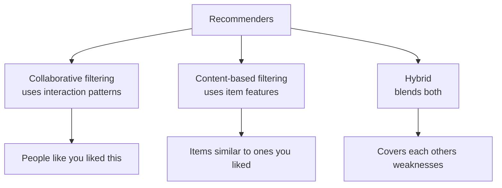
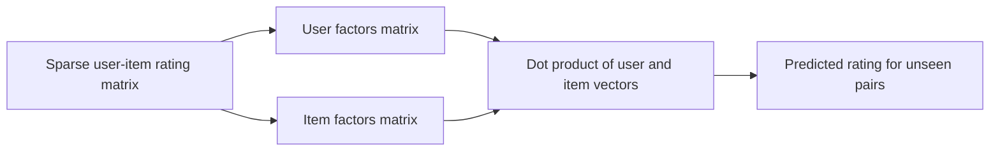

# Recommendation Systems

Every time Netflix suggests a show, Amazon proposes "customers who bought this also bought…", Spotify builds a playlist, or YouTube queues the next video, a **recommendation system** is at work. These systems predict what a user will like and surface it from a catalog far too large to browse. They are among the most commercially important applications of machine learning recommendations drive a large share of engagement and revenue at the biggest tech companies.

The core problem is this: we have **users**, **items**, and a record of **interactions** between them (ratings, purchases, clicks, watch time). Most user-item pairs have *no* interaction the data is extremely **sparse**. The system's job is to fill in the blanks: predict how much a user would like an item they haven't touched yet, then recommend the top predictions.

## The Main Families of Recommenders

Three broad strategies exist, plus combinations:

**Figure: Collaborative versus content-based filtering**

- **Collaborative filtering:** recommends based only on the pattern of interactions "people who behaved like you liked this." It needs no information about the items themselves, just the interaction matrix.
- **Content-based filtering:** recommends items *similar to ones the user already liked*, using item features (genre, keywords, price). "You liked sci-fi thrillers, here's another."
- **Hybrid:** combines both to cover each other's weaknesses the dominant approach in real systems.
- **Knowledge-based:** uses explicit rules or user-stated requirements, useful for rare, expensive purchases (cars, houses) where there's little interaction history.

This notebook focuses mainly on **collaborative filtering** and its modern extensions.

## Neighborhood-Based Collaborative Filtering

The most intuitive starting point. It comes in two flavors.

### User-Based Collaborative Filtering

**Intuition:** find users similar to you (your "neighbors"), then recommend what they liked that you haven't seen. To predict your rating for a movie, it looks at how users with taste like yours rated that movie and blends those ratings, weighted by how similar each neighbor is to you.

Measuring similarity needs a metric. **Cosine similarity** treats each user's ratings as a direction in space and measures the angle between two users close direction means similar taste. **Pearson correlation** is similar but first subtracts each user's average rating, correcting for the fact that some people rate generously and others harshly. The user-based cell finds each user's *k* nearest neighbors and predicts from them.

### Item-Based Collaborative Filtering

**Intuition:** instead of finding similar *users*, find similar *items*. Two items are "similar" if the same users tend to rate them alike. To recommend, look at items the user already rated highly and suggest items similar to those. Item-based filtering is usually more stable and scalable than user-based, because item-to-item relationships change more slowly than user tastes and there are often fewer items than users which is why it powers many large production systems.

**Strengths of neighborhood methods:** simple, interpretable ("recommended because you liked X"). **Weaknesses:** they struggle with sparsity and don't scale gracefully to millions of users and items.

## Matrix Factorization

**What it is:** the breakthrough idea (popularized by the Netflix Prize) that turns recommendation into discovering hidden patterns.

**Figure: Matrix factorization splits the rating matrix into latent factors**

**Intuition:** imagine that every user and every item can be described by a small set of hidden traits, called **latent factors** for movies these might loosely correspond to "amount of action," "romance," "artsiness," though the model discovers them automatically and doesn't label them. Each user gets a vector saying how much they like each trait; each item gets a vector saying how much it embodies each trait. The predicted rating is simply how well a user's preferences line up with an item's traits (their dot product). Mathematically, the huge sparse user-item rating matrix is approximated as the product of two much smaller matrices one for users, one for items.

The model learns these factor vectors by minimizing the error on the *known* ratings, typically with gradient descent, plus **regularization** (a penalty on large factor values) to prevent overfitting. A refinement adds **bias terms** a global average, a per-user bias (some users rate high), and a per-item bias (some items are universally loved) which captures a lot of signal cheaply. The matrix-factorization cell trains these factors over many epochs while tracking error.

**Strengths:** handles sparsity well, scales far better than neighborhood methods, often much more accurate, and uncovers latent structure. It's the workhorse of classic recommenders. The **Surprise** library cell demonstrates this via its **SVD** algorithm with cross-validation.

## Neural and Deep Recommenders

Matrix factorization combines user and item factors with a simple dot product. Neural methods replace that with a learned, more flexible function.

- **Neural Collaborative Filtering (NCF):** learns user and item **embeddings** (the neural equivalent of latent factors) and feeds them through neural network layers to predict interaction, capturing nonlinear patterns a dot product can't. Its variants include **GMF** (a neural generalization of matrix factorization), an **MLP** branch (a multi-layer network over concatenated embeddings), and **NeuMF**, which fuses both for the best of each.

- **Wide & Deep (Google):** combines a "wide" linear part that **memorizes** specific feature combinations ("users who did X and Y") with a "deep" neural part that **generalizes** to new combinations via embeddings. Together they balance precise recall and broad discovery.

- **DeepFM:** replaces the hand-engineered wide part with a **Factorization Machine** that automatically learns feature interactions, joined with a deep network powerful for recommendations with many side features.

- **Two-Tower model:** uses two separate networks one encoding users, one encoding items into a shared space where similarity is just a quick comparison. This design enables **fast retrieval** from millions of items using approximate nearest-neighbor search (e.g., FAISS), which is why it underpins large-scale industrial systems.

- **LightGCN:** treats users and items as nodes in a **graph** (connected by interactions) and propagates information across that graph so a user's representation absorbs signal from the items they touched, those items' other users, and so on capturing higher-order relationships.

## Evaluating Recommendations

Recommenders are judged differently from ordinary models, because what matters is the *quality of the top few suggestions*, not predicting every rating exactly.

- **Precision@K:** of the top *K* recommended items, what fraction were actually relevant measures how clean the top list is.
- **Recall@K:** of all items the user would have liked, how many appeared in the top *K* measures coverage.
- **NDCG@K (Normalized Discounted Cumulative Gain):** rewards putting the *most* relevant items *highest* in the list, discounting relevance the further down it appears because users look at the top first. The gold-standard ranking metric.
- **MRR (Mean Reciprocal Rank):** focuses on how high up the *first* relevant item appears.
- **Hit Rate@K:** the fraction of users who got at least one relevant item in their top *K*.
- **RMSE / MAE:** for systems that predict explicit numeric ratings, these measure raw prediction error (used by the Surprise cell).

The evaluation cells compute precision@K, recall@K, NDCG@K, and MRR on held-out interactions.

## The Cold-Start Problem

The Achilles' heel of recommenders: a brand-new user or item has *no interaction history*, so collaborative filtering which lives entirely on history has nothing to work with. The notebook discusses standard remedies:

- **New users:** recommend popular items by default, ask a few onboarding questions, or use demographics.
- **New items:** fall back to **content-based** features (the item's genre, description, attributes) until interactions accumulate.
- **Hybrid systems** blend collaborative and content signals specifically so that one can cover for the other when data is missing.

Related is **data sparsity** even established users have rated only a tiny fraction of the catalog (the notebook notes typical matrices are well over 60% empty), which is precisely why latent-factor and neural methods, good at generalizing from sparse signals, win over simple neighborhood lookups at scale.

## Choosing an Approach

| Method | Needs | Strength | Limitation |
|---|---|---|---|
| User/Item-based CF | Interaction history | Simple, interpretable | Poor with sparsity/scale |
| Matrix Factorization | Interaction history | Handles sparsity, scalable, accurate | Linear; cold-start |
| Content-based | Item features | Works for new items | No serendipity, needs good features |
| Neural CF / Wide & Deep / DeepFM | Lots of data | Captures nonlinear patterns | Heavy, data-hungry |
| Two-Tower | Lots of data | Massive-scale fast retrieval | Complex infrastructure |
| LightGCN | Interaction graph | Higher-order relationships | Compute cost |

## The Bigger Picture

**Figure: The two-stage retrieval and ranking pipeline**

A production recommender is rarely a single algorithm. Real systems typically run a **two-stage pipeline**: a fast, scalable **retrieval** step (e.g., a two-tower model) narrows millions of items down to a few hundred candidates, then a richer **ranking** model (often deep, using many features) orders that shortlist precisely. They blend collaborative and content signals to survive cold starts, optimize ranking metrics like NDCG rather than raw rating error, and are continuously retrained as tastes shift. The enduring intuition, though, remains the simple one this notebook builds from: **people who behaved alike in the past will behave alike in the future, and items liked together belong together.**
