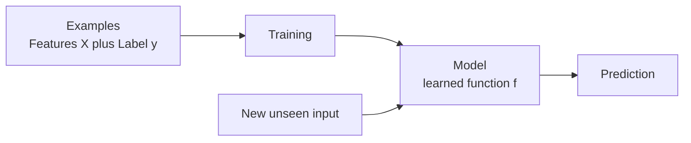
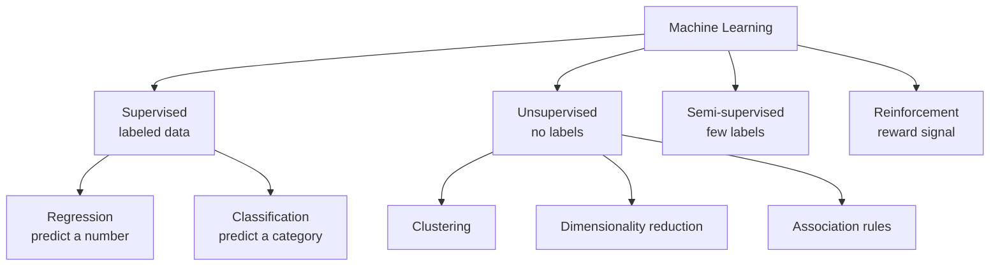
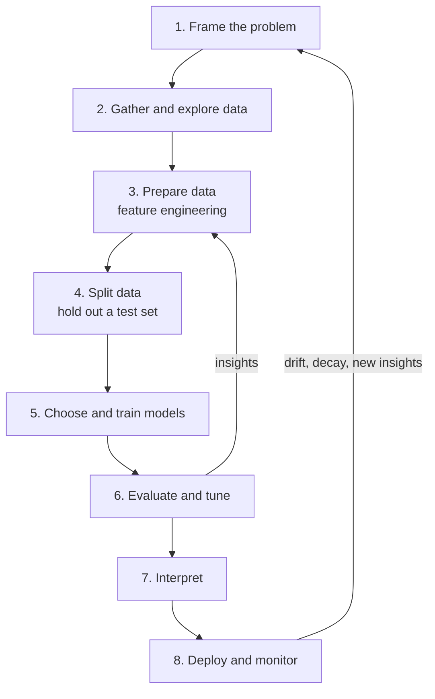
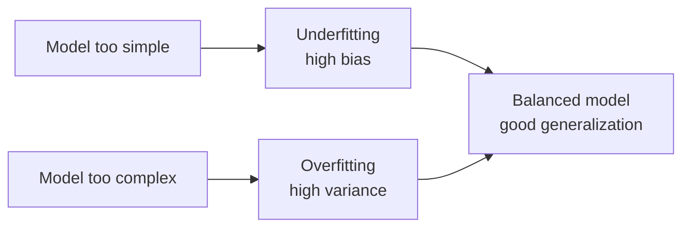
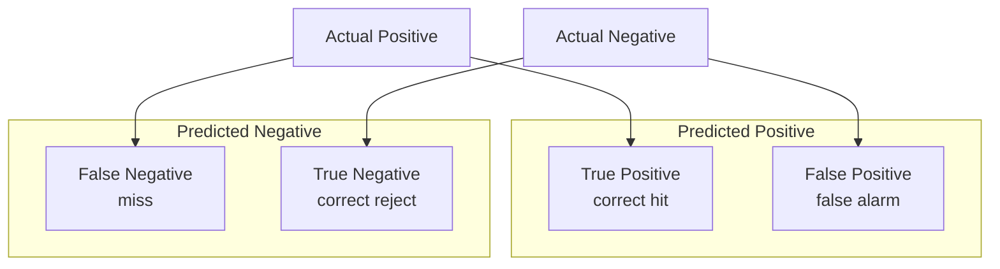

# Machine Learning: The Complete Overview

Machine learning is the science of getting computers to learn patterns from data instead of being explicitly programmed with rules. This section is the heart of the journey from beginner to AI engineer, and this overview ties all of its pieces together: what machine learning fundamentally is, the major learning paradigms, the end-to-end workflow that every project follows, how to measure success, and how each sub-topic in this folder fits into the bigger picture. Read this first, then dive into the individual folders for depth.

## What Machine Learning Actually Is

Traditional software works by a human writing precise instructions: *if this, then that.* That works wonderfully for problems we can fully describe but it breaks down for problems we *can't* spell out in rules. No one can write rules that reliably tell a cat from a dog in a photo, or that catch every fraudulent transaction. The patterns are too subtle, too numerous, too fuzzy.

Machine learning flips the approach. Instead of writing the rules, we show the computer **many examples** and let it *infer* the rules itself. We hand it data, it finds the underlying patterns, and it produces a **model** a learned function that turns inputs into outputs. Then we use that model on new, unseen inputs.

The essential vocabulary, defined once and used everywhere:

- **Features** (inputs `X`): the measurable properties describing each example a house's size, an email's words, a patient's test results.
- **Label** (target `y`): the answer we want to predict a price, "spam or not," a diagnosis.
- **Training**: the process of fitting a model to example data by adjusting its internal **parameters** to minimize its mistakes.
- **Model**: the trained function that maps features to predictions.
- **Generalization**: the real goal performing well not on the training data, but on *new* data the model has never seen.

**Figure: From data to predictions on new inputs**

## The Learning Paradigms

Machine learning splits into a few fundamental paradigms based on *what kind of data and feedback* the model learns from.

**Figure: Taxonomy of machine learning paradigms**

### Supervised Learning

Every training example comes with its correct label like learning with an answer key. The model learns the mapping from features to labels so it can predict labels for new examples. This is the most common and mature paradigm, split into:
- **Regression**: predicting a continuous number (house price, temperature).
- **Classification**: predicting a category (spam/not-spam, which digit).

Covered in the **`01_supervised`** folder: linear and logistic regression, decision trees, ensemble methods (random forests, gradient boosting), support vector machines, naive Bayes, k-nearest neighbors, and generalized linear models.

### Unsupervised Learning

The data has *no labels*. The model must discover structure on its own which examples group together, what hidden dimensions explain the data, what items co-occur. There's no answer key, so success is judged more subjectively. Covered in **`02_unsupervised`**: clustering (grouping similar points), dimensionality reduction (compressing data while keeping its essence), and association rule mining (finding co-occurrence patterns).

### Semi-Supervised Learning

A blend: a *small* amount of labeled data plus a *large* amount of unlabeled data. Because labeling is expensive but raw data is cheap, this paradigm squeezes extra value out of the unlabeled mountain to improve on what the few labels alone could achieve. Covered in **`03_semi_supervised`**.

### Where Reinforcement Learning Fits

A fourth major paradigm, **reinforcement learning**, has an agent learn by trial and error through rewards and penalties (think game-playing or robotics). It has its own dedicated section elsewhere in this curriculum; this folder focuses on the supervised/unsupervised/semi-supervised family that covers the vast majority of practical machine-learning work.

### Comparing the Paradigms

| Paradigm | Data has labels? | Goal | Example |
|---|---|---|---|
| Supervised | Yes, all of it | Predict labels | Spam detection, price prediction |
| Unsupervised | No | Discover structure | Customer segmentation |
| Semi-supervised | A few labels | Improve with unlabeled data | Classifying mostly-unlabeled images |
| Reinforcement | Reward signal | Learn by acting | Game-playing, robotics |

## The Machine Learning Lifecycle

Real machine-learning work is a loop, not a single step. Here is the end-to-end workflow that every project follows.

**Figure: The end-to-end machine learning lifecycle**

### 1. Frame the Problem

Decide what you're predicting and how you'll measure success *before* touching data. Is it regression or classification? What does a good outcome look like in business terms? Choosing the wrong objective here dooms everything downstream.

### 2. Gather and Explore Data

Collect the data and *look at it*. Understand its size, its features, its quirks, its missing values, its class balance. This exploratory step prevents nasty surprises later.

### 3. Prepare the Data (Feature Engineering)

Usually the highest-leverage step. Raw data is rarely model-ready. You clean it, fill missing values, **scale** features to comparable ranges, **encode** categories into numbers, and *create* new informative features. You also handle **imbalanced data** when one class is rare. The saying holds: better data beats a fancier algorithm. This is the **`05_feature_engineering`** folder.

### 4. Split the Data

Set aside a **test set** the model never trains on, so you can later measure honest generalization. The cardinal rule of all machine learning: *never let the model peek at the data you'll judge it on.*

### 5. Choose and Train Models

Pick candidate algorithms suited to the problem and train them. Start simple (a baseline like linear/logistic regression) for a sanity check, then try stronger models. Each model adjusts its parameters during training to minimize a **loss function** a measure of how wrong it currently is typically via **gradient descent**, which iteratively steps "downhill" toward lower error.

### 6. Evaluate and Tune

Measure performance with **cross-validation** (rotating which slice of data is held out, for a stable estimate) and the right **metrics**. Tune **hyperparameters** the settings chosen before training, like tree depth or regularization strength using grid search, random search, or smarter Bayesian optimization. This is the **`06_model_evaluation`** folder.

### 7. Interpret

Understand *why* the model predicts what it does which features drive it, whether it's biased, whether it can be trusted. This is the **`07_explainability`** folder, and it's increasingly essential for trust, debugging, and regulatory compliance.

### 8. Deploy and Monitor

Put the model into production and watch it. Data drifts over time, performance decays, and models need retraining. Deployment is the beginning of the model's life, not the end.

This whole cycle repeats: insights from evaluation and monitoring feed back into better features, better models, better framing.

## The Two Failures Every Project Fights

Two opposite mistakes haunt every model:

- **Overfitting**: the model memorizes the training data including its random noise and fails on new data. It's like a student who memorized the practice exam answers but learned nothing.
- **Underfitting**: the model is too simple to capture the real pattern and does poorly everywhere.

**Figure: Underfitting versus overfitting and the bias-variance balance**

These connect to the **bias-variance tradeoff**. **Bias** is error from oversimplified assumptions (underfitting). **Variance** is error from being too sensitive to the specific training data (overfitting). Reducing one often raises the other; good modeling balances them. The tools for this balance **regularization** (penalizing complexity), cross-validation, and proper evaluation recur throughout every folder.

## Measuring Success: Evaluation Metrics

A model is only as trustworthy as the way you measure it, and the right yardstick depends entirely on the task. The **`10_evaluation_metrics_comprehensive.ipynb`** notebook is a reference spanning metrics across every domain of machine learning. The essentials:

### Classification Metrics

**Figure: The confusion matrix layout**

Built on the **confusion matrix** (counts of true/false positives and negatives):
- **Accuracy**: fraction correct but dangerously misleading on **imbalanced** data, where predicting the majority class always can look great yet be useless.
- **Precision**: of items flagged positive, how many really were (controls false alarms).
- **Recall**: of real positives, how many were caught (controls misses).
- **F1 score**: the balance of precision and recall.
- **ROC-AUC**: how well the model ranks positives above negatives across all thresholds (0.5 = random, 1.0 = perfect).
- **PR-AUC**: more informative than ROC-AUC when positives are rare.
- **Matthews Correlation Coefficient (MCC)** and **Cohen's Kappa**: robust single-number summaries, especially under imbalance.
- **Log loss**: rewards well-calibrated confidence and punishes confident errors.

### Regression Metrics

- **MAE**: average error size, in the target's own units.
- **MSE / RMSE**: average squared error and its root; punish large errors heavily.
- **R²**: fraction of variation explained (1.0 perfect); **Adjusted R²** corrects for the number of features.

### Beyond Tabular Data

The comprehensive notebook also covers metrics for the specialized domains you'll meet later: **ranking** (NDCG, MAP, MRR for search and recommenders), **clustering** (silhouette, Davies-Bouldin, adjusted Rand index), **NLP** (BLEU, ROUGE, BERTScore, perplexity for text generation), **computer vision** (IoU, mAP, FID for detection and image generation), **time series** (MASE, sMAPE), and **LLM/RAG evaluation** (faithfulness, answer relevancy, LLM-as-judge). It also covers **calibration** (making predicted probabilities trustworthy) and **statistical significance testing** (confirming that one model genuinely beats another rather than winning by chance). The key habit to internalize: *choose your metric to match the task, and never rely on accuracy alone.*

## How the Sub-Topics Fit Together

Here's the map of this entire section and how the folders relate:

| Folder | Role in the journey |
|---|---|
| **`01_supervised`** | The core algorithms for learning from labeled data the bread and butter of ML. |
| **`02_unsupervised`** | Finding structure when there are no labels: clustering, dimensionality reduction, association rules. |
| **`03_semi_supervised`** | Squeezing value from abundant unlabeled data when labels are scarce. |
| **`04_uncommon_models`** | Specialized tools (Gaussian processes, HMMs, and more) for problems the mainstream models handle poorly. |
| **`05_feature_engineering`** | Preparing, transforming, and balancing data often the highest-impact work. |
| **`06_model_evaluation`** | Validating models honestly and tuning them without fooling yourself. |
| **`07_explainability`** | Opening the black box: understanding *why* a model predicts what it does. |
| **`08_anomaly_detection`** | Finding the rare, suspicious, unexpected points fraud, faults, intrusions. |
| **`09_recommendation_systems`** | Predicting what users will like one of ML's biggest commercial applications. |
| **`10_evaluation_metrics_comprehensive`** | The reference for measuring success across every ML domain. |

These aren't isolated islands. A real project weaves them together: you **engineer features** (05), train **supervised** models (01) perhaps using **unsupervised** methods (02) for preprocessing, **evaluate** them rigorously (06) with the right **metrics** (10), **explain** their decisions (07), and depending on the goal apply them to **anomaly detection** (08) or **recommendations** (09).

## The Mindset of an AI Engineer

A few principles thread through everything in this section:

- **Generalization is the only thing that matters.** A model that aces training data but fails in the real world is worthless. Always evaluate on data the model hasn't seen.
- **Data quality beats model complexity.** Time spent on features and clean data usually pays off more than chasing a fancier algorithm.
- **Start simple.** A baseline model tells you whether the problem is even tractable and gives you something to beat.
- **Measure the right thing.** The metric you optimize *is* the objective the model pursues; choose it deliberately.
- **Understand, don't just predict.** Explainability turns a model from an unaccountable oracle into a tool you can trust, debug, and improve.

With this map in hand, every folder that follows becomes a deep dive into one part of a coherent whole. Master the workflow and the mindset here, and the specific algorithms become tools you can pick up, combine, and wield with judgment which is exactly what being an AI engineer is about.
