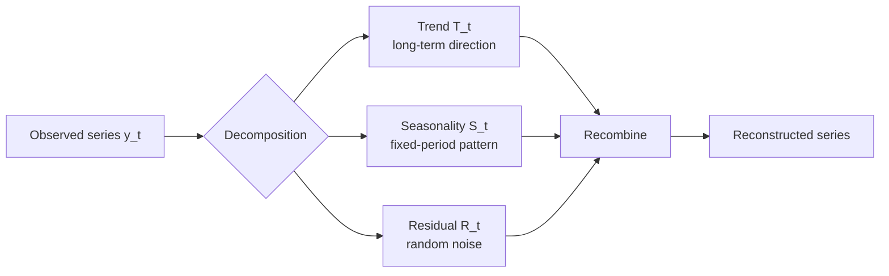
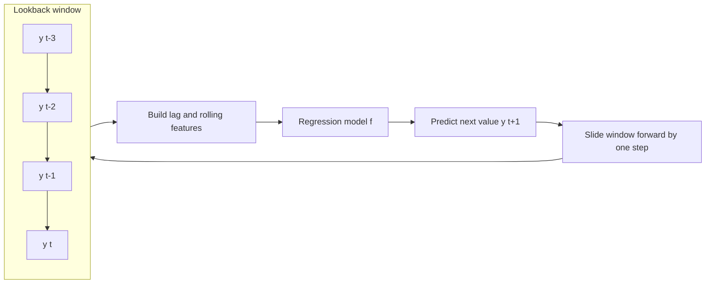
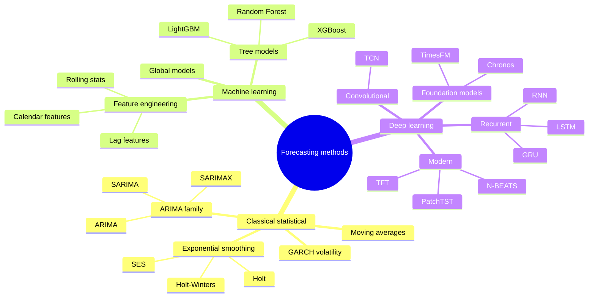
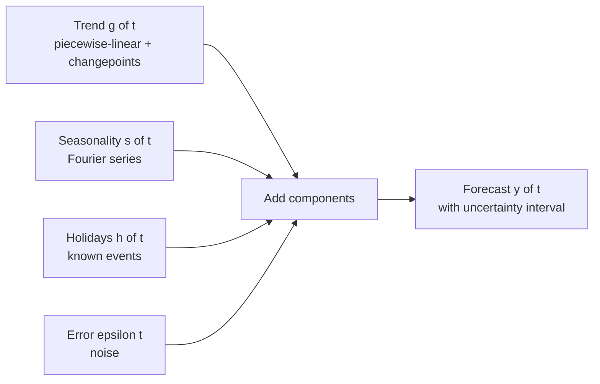
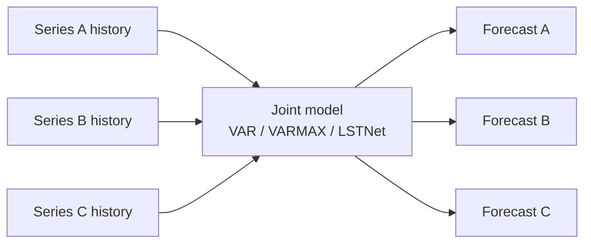
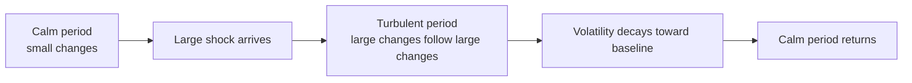
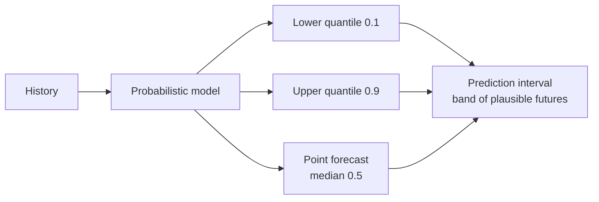

# Time-Series Forecasting: A Complete Conceptual Guide

Forecasting is the art and science of using the past to make disciplined statements about the future. Almost every organization runs on forecasts: a retailer orders inventory based on next month's expected sales, a power company schedules generators against tomorrow's predicted demand, a bank sets aside capital based on how volatile a portfolio might become, and a hospital staffs its emergency room against the patient load it expects on a holiday weekend. In every one of these cases the raw material is a **time series** a sequence of measurements recorded in time order and the goal is the same: estimate values that have not happened yet, and honestly express how uncertain those estimates are.

This guide builds the entire subject from the ground up. It starts with what a time series even *is* and the vocabulary used to describe one, then walks through the major families of forecasting methods in the order they historically and pedagogically appear: classical statistical models, machine-learning models, deep-learning models, the Prophet tool, advanced and frontier methods, multivariate models, volatility (GARCH) models, and finally probabilistic forecasting. Every term is defined the first time it appears, and nothing here assumes you have seen forecasting before. The nine notebooks in this folder (`01_time_series_basics.ipynb` through `09_probabilistic_forecasting.ipynb`) implement everything discussed, and the text points to specific cells when seeing the concrete code would help but the teaching below stands entirely on its own.

---

## 1. What a Time Series Is and Why It Is Special

A **time series** is a collection of observations of one (or several) quantities, recorded at successive points in time and kept in chronological order. Formally we write it as a sequence of values indexed by time, $\{y_t\}$ for $t = 1, 2, 3, \dots$, where $t$ is the time index (a month, a day, a second, a quarter) and $y_t$ is the value measured at that time. The spacing between observations is the **frequency** of the series: monthly, daily, hourly, and so on.

What makes time-series data fundamentally different from ordinary tabular data is that **the observations are not independent of one another**. In a standard machine-learning dataset say, predicting house prices from square footage the rows can be shuffled without losing any information; each house is its own self-contained example. In a time series, order is everything. Today's temperature is strongly related to yesterday's; this month's sales depend on last month's. Past values carry information about future values, and that dependence is precisely the structure forecasting tries to exploit. Shuffling a time series destroys it.

This distinction is called **cross-sectional data** (many independent units observed at one instant) versus **time-series data** (one unit observed repeatedly over time). The notebook `01_time_series_basics.ipynb` opens with exactly this contrast and gives the canonical examples: stock prices, daily temperatures, monthly sales, electrocardiogram (EEG/ECG) traces, and quarterly GDP.

Where is forecasting used? Essentially everywhere a future number drives a decision:

- **Retail and supply chain** demand forecasting for inventory and staffing.
- **Energy** load forecasting for the electrical grid.
- **Finance** predicting prices, returns, and especially *volatility* (risk).
- **Economics** GDP, inflation, unemployment projections.
- **Operations** call-center volume, website traffic, server load.
- **Healthcare and epidemiology** patient counts, disease spread.

---

## 2. The Anatomy of a Time Series: Its Components

Before forecasting a series you must understand what it is made of. The classical view holds that any time series can be thought of as a combination of a small number of underlying **components**. The notebook `01_time_series_basics.ipynb` constructs a synthetic 20-year monthly series by literally adding these pieces together a linear trend, a yearly sine wave, and random noise which is the clearest possible way to *see* what each component contributes.

### 2.1 The four components

- **Trend** ($T_t$): the long-term direction of the series a sustained drift upward or downward over many periods. A company whose sales grow year after year has an upward trend.
- **Seasonality** ($S_t$): a regular, *fixed-period* pattern that repeats higher retail sales every December, higher electricity use every summer afternoon. The defining feature is that the cycle length is known and constant (e.g., exactly 12 months).
- **Cyclical** ($C_t$): longer, *irregular* fluctuations not tied to a fixed calendar period most famously the multi-year boom-and-bust of the business cycle. Unlike seasonality, the period of a cycle varies and is not known in advance.
- **Irregular / Residual** ($R_t$): whatever is left after the structured components are removed the random, unpredictable noise.

**Figure: Decomposing a time series into trend, seasonality, and residual**



### 2.2 Additive vs. multiplicative structure

These components can combine in two ways:

- **Additive:** $y_t = T_t + S_t + C_t + R_t$. Use this when the size of the seasonal swings stays roughly constant regardless of the level of the series.
- **Multiplicative:** $y_t = T_t \times S_t \times C_t \times R_t$. Use this when the seasonal swings *grow* as the series grows the December spike is bigger when annual sales are bigger.

A key practical trick: taking the **logarithm** of a multiplicative series turns it into an additive one ($\log(T \times S \times R) = \log T + \log S + \log R$), because logs convert multiplication into addition. This is why so many forecasting workflows begin by log-transforming the data, as we will see repeatedly.

### 2.3 Decomposition

**Decomposition** is the act of pulling a series apart into estimates of its trend, seasonal, and residual components so you can study each in isolation. The notebook demonstrates two tools from the `statsmodels` library:

- **`seasonal_decompose`** the classic moving-average-based method, run in both additive and multiplicative modes. (Multiplicative mode needs strictly positive values, so the notebook shifts the series upward first.)
- **STL** (**Seasonal-Trend decomposition using LOESS**) a more modern and robust method. "LOESS" (Locally Estimated Scatterplot Smoothing) fits many small local regressions to smooth the data. STL handles seasonality that *changes over time* and resists outliers far better than the classic method, and the notebook uses it with `robust=True`. It even computes **trend strength** and **seasonal strength** scores (each measured as $1 - \text{Var(residual)}/\text{Var(residual + component)}$) to quantify how dominant each component is.

---

**Figure: The end-to-end forecasting workflow**

```mermaid
flowchart LR
    A[Collect data] --> B{Stationary?}
    B, No --> C[Difference / transform]
    C --> B
    B, Yes --> D[Fit model]
    D --> E[Forecast future]
    E --> F[Evaluate on holdout]
    F --> G{Residuals white noise?}
    G, No --> D
    G, Yes --> H[Deploy forecast]
```

## 3. Stationarity: The Central Assumption

Most classical forecasting models and a good chunk of the intuition behind every other method rest on the idea of **stationarity**. A series is **stationary** if its statistical properties do not change over time. There are two flavors:

- **Strict stationarity:** the entire joint probability distribution of the series is invariant to shifts in time. This is a very strong, rarely-needed condition.
- **Weak (covariance) stationarity:** the practical version, requiring just three things:
  1. **Constant mean** the series does not trend up or down.
  2. **Constant, finite variance** the size of the fluctuations does not grow or shrink over time (this property is called **homoskedasticity**; its violation, changing variance, is **heteroskedasticity** the entire subject of Section 11).
  3. **Autocovariance that depends only on the lag**, not on absolute time the relationship between observations $k$ steps apart is the same whether you look at the start or the end of the series.

Why does stationarity matter? Because a model can only learn a *stable* pattern. If the mean keeps drifting and the variance keeps growing, there is no fixed structure to estimate, and forecasts become unreliable. Models like ARIMA are *built* on the assumption of stationarity.

### 3.1 Making a series stationary

A series with a trend or seasonality is non-stationary, but it can usually be *transformed* into a stationary one:

- **Differencing:** replace each value with the change from the previous value, $\nabla y_t = y_t - y_{t-1}$. This removes a linear trend. Differencing twice removes a quadratic trend. The compact notation uses the **backshift operator** $B$, where $B y_t = y_{t-1}$, so first differencing is $(1-B)y_t$.
- **Seasonal differencing:** subtract the value from one full season ago, $y_t - y_{t-m}$ (e.g., $m=12$ for monthly data), which removes seasonality.
- **Log transformation:** stabilizes a variance that grows with the level.
- **Detrending:** explicitly fit and subtract a trend line.

### 3.2 Testing for stationarity

You do not have to eyeball it. Two formal **hypothesis tests** (used together) decide the question. Both shown in `01_time_series_basics.ipynb`:

- **Augmented Dickey-Fuller (ADF) test** tests for a "unit root," a specific mathematical signature of non-stationarity. Its **null hypothesis** ($H_0$, the default assumption you try to disprove) is that the series *is* non-stationary. So a **small p-value (below 0.05) means you reject non-stationarity and conclude the series is stationary.**
- **KPSS test** has the *opposite* null hypothesis: it assumes the series *is* stationary. Here a small p-value means you reject stationarity.

Running both gives a robust verdict. The cleanest case is ADF saying "stationary" and KPSS saying "stationary" simultaneously; if they disagree, the series may be trend-stationary or need more differencing. (The notebook wraps both in a single `test_stationarity()` helper, and notes a harmless `InterpolationWarning` that appears when the KPSS statistic falls outside its lookup table.)

---

## 4. Autocorrelation: How a Series Relates to Its Own Past

The single most important structural property of a time series is its **autocorrelation** the correlation of the series *with itself* at earlier times. A **lag** is simply a shift back in time: the lag-1 version of a series is yesterday's values lined up against today's. The lag-$k$ value of $y_t$ is $y_{t-k}$.

- **Autocorrelation Function (ACF):** $\rho(k)$ measures the correlation between the series and its lag-$k$ copy, for each lag $k$. Plotting $\rho(k)$ against $k$ produces the **correlogram**, with confidence bands at roughly $\pm 1.96/\sqrt{n}$; bars poking outside the bands are statistically significant.
- **Partial Autocorrelation Function (PACF):** measures the correlation between $y_t$ and $y_{t-k}$ *after removing the influence of all the intermediate lags* in between. This isolates the "direct" relationship at lag $k$.

These two functions are the diagnostic fingerprints used to choose model orders (Section 5). The notebook summarizes the reading rules in a table:

| Pattern | ACF behavior | PACF behavior |
|---|---|---|
| **AR(p)** (autoregressive) | tails off gradually | **cuts off** sharply after lag $p$ |
| **MA(q)** (moving average) | **cuts off** sharply after lag $q$ | tails off gradually |
| **ARMA(p,q)** | tails off | tails off |

Supporting visual diagnostics in the notebook include **rolling statistics** (a moving mean and standard deviation a flat rolling standard deviation signals constant variance) and **lag plots** (scatter plots of $y_t$ against $y_{t-k}$, where a visible diagonal structure reveals autocorrelation).

### 4.1 White noise the goal for residuals

**White noise** is a series with zero mean, constant variance, and *zero* autocorrelation at every lag pure structureless randomness. It is the benchmark for a *good* model: once you have extracted all the predictable structure, what remains (the residuals) should look like white noise, because any leftover pattern is signal you failed to capture. The **Ljung-Box test** formally checks this; its null hypothesis is "the residuals are white noise," so a p-value *above* 0.05 is the *good* outcome here. The notebook uses Ljung-Box both to validate STL residuals and, later, to check ARIMA model quality.

---

## 5. Classical Forecasting Methods

With the vocabulary in place, `02_classical_methods.ipynb` turns to actually producing forecasts using the classical statistical toolkit. It uses the famous **AirPassengers** dataset monthly international airline passenger counts from 1949 to 1960 which has a clear upward trend and strong, *growing* yearly seasonality, making it the perfect teaching example. (This same dataset recurs through several later notebooks, giving the whole guide a consistent running example.)

A crucial discipline introduced here and obeyed everywhere afterward: **the training data must come before the test data in time.** You cannot randomly shuffle a time series into train/test folds, because that would let the model "see the future." The notebook trains on data through 1958 and tests on 1959-1960 a **chronological holdout split**.

### 5.1 Moving averages

The simplest forecasts are local averages:

- **Simple Moving Average (SMA):** the unweighted average of the last $k$ observations. It smooths noise but lags behind trends.
- **Weighted Moving Average (WMA):** a moving average where recent points get more weight.
- **Exponentially Weighted Moving Average (EWMA):** weights decay geometrically into the past, controlled by a smoothing parameter $\alpha$ between 0 and 1. The recursion $\hat{y}_{t+1} = \alpha y_t + (1-\alpha) \hat{y}_t$ means a larger $\alpha$ reacts faster to recent changes.

### 5.2 The exponential smoothing family

**Exponential smoothing** generalizes EWMA into a full forecasting family by maintaining and updating internal "state" components. The notebook walks through all three levels:

- **Simple Exponential Smoothing (SES):** tracks only the **level** (the current baseline). It assumes no trend and no seasonality, so its forecast is a flat line. Good for series that wander around a slowly-changing mean.
- **Holt's Linear Method (Double Exponential Smoothing):** adds a **trend** component, updated by its own smoothing parameter $\beta$. Its forecast is a sloped line, projecting the current level forward along the current trend.
- **Holt-Winters (Triple Exponential Smoothing):** adds a **seasonal** component (smoothing parameter $\gamma$, with a specified seasonal period $m$). It comes in **additive** and **multiplicative** seasonal variants. For AirPassengers, the *multiplicative* version fits better because the seasonal swings grow with the trend a concrete illustration of the additive-vs-multiplicative distinction from Section 2.

The notebook fits all four (SES, Holt, Holt-Winters additive, Holt-Winters multiplicative) and compares them using three error metrics that recur throughout the guide:

- **MAE (Mean Absolute Error):** the average absolute difference between forecast and actual in the original units, easy to interpret.
- **RMSE (Root Mean Squared Error):** the square root of the average squared error penalizes large misses more heavily.
- **MAPE (Mean Absolute Percentage Error):** the average absolute error expressed as a percentage of the actual scale-free, but it breaks down when actual values are near zero.

### 5.3 ARIMA and its relatives

**ARIMA** is the workhorse of classical forecasting. Its name encodes its three pieces:

- **AR (AutoRegressive), order $p$:** the value is a linear combination of its own $p$ past values. "The future looks like a weighted blend of the recent past."
- **I (Integrated), order $d$:** the number of times the series is **differenced** to make it stationary (recall Section 3.1). The "I" is what lets ARIMA handle trending, non-stationary data.
- **MA (Moving Average), order $q$:** the value depends on the past $q$ forecast *errors* (not past values past *shocks*). This lets the model react to recent surprises.

Put together, **ARIMA(p, d, q)** can model a wide range of behaviors. The orders $p$ and $q$ are read off the PACF and ACF plots respectively (Section 4), and $d$ is determined by how much differencing the stationarity tests demand. In `02_classical_methods.ipynb`, the ARIMA cell shows how the $(p,d,q)$ parameters are chosen and prints a full model summary.

- **SARIMA (Seasonal ARIMA), written $(p,d,q)(P,D,Q)_s$:** extends ARIMA with a *second* set of seasonal AR, differencing, and MA terms operating at the seasonal lag $s$. This is the standard model for data with both trend and seasonality, and the notebook uses $(1,1,1)(1,1,1)_{12}$ on the log-transformed AirPassengers log first (to linearize the multiplicative seasonality), forecast in log space, then exponentiate back to the original scale.
- **SARIMAX:** SARIMA plus e**X**ogenous variables external predictors that influence the series. The "X" lets you feed in known drivers like a promotion flag, price, or weather. The notebook demonstrates this by adding a synthetic promotion indicator as an `exog` input.

**Model selection** among candidate orders uses **information criteria** **AIC (Akaike Information Criterion)** and **BIC (Bayesian Information Criterion)** which score a model by its fit *penalized* for complexity. Lower is better; they keep you from overfitting by adding pointless terms. Rather than choosing $p,d,q$ by hand, the notebook also shows **auto-ARIMA** (`pmdarima.auto_arima`), which automatically searches over orders and picks the best by AIC. (In the saved run `pmdarima` was not installed, so that cell prints an install hint a reminder that some of these libraries are optional.)

**Residual diagnostics** close the loop: a good ARIMA leaves white-noise residuals. The notebook uses `plot_diagnostics()` to view the standardized residuals, their histogram, a Q-Q plot (checking normality), and their correlogram all of which should look featureless if the model captured the structure.

**Figure: Selecting ARIMA orders from ACF and PACF**

```mermaid
flowchart TD
    Start[Stationary series after d differences] --> Plot[Plot ACF and PACF]
    Plot --> Q1{PACF cuts off after lag p<br/>and ACF tails off}
    Q1, Yes --> AR[Choose AR order p<br/>set q = 0]
    Plot --> Q2{ACF cuts off after lag q<br/>and PACF tails off}
    Q2, Yes --> MA[Choose MA order q<br/>set p = 0]
    Plot --> Q3{Both tail off}
    Q3, Yes --> ARMA[Mixed model<br/>pick p and q together]
    AR --> Out[ARIMA p d q]
    MA --> Out
    ARMA --> Out
```

### 5.4 The Box-Jenkins methodology

All of this is unified by the **Box-Jenkins methodology**, the classic four-step recipe for ARIMA modeling: **(1) Identification** plot the data, run stationarity tests to fix $d$, read ACF/PACF to propose $p$ and $q$; **(2) Estimation** fit the parameters by maximum likelihood; **(3) Diagnostic checking** verify residuals are white noise; **(4) Forecasting** produce point forecasts plus confidence intervals and evaluate on a holdout. If diagnostics fail, you loop back to step 1.

---

## 6. Machine Learning for Forecasting

The classical models above were *designed* for time series. Machine-learning forecasting takes a different route: it **reframes forecasting as ordinary supervised learning**. This is the central idea of `03_ml_for_forecasting.ipynb`. Instead of a special time-series model, you build a feature table each row describing the "context" at one time step and train any regression model (random forest, gradient boosting) to predict the next value. The forecast becomes $\hat{y}_{t+h} = f(\text{features built from the past})$, where $f$ is any ML model.

### 6.1 Feature engineering: turning time into columns

Because a plain regressor has no notion of time, *you* must encode the temporal structure as features. This **feature engineering** step is the most important part of ML forecasting. The notebook's `create_features()` function builds several families:

- **Lag features:** the value $k$ steps ago ($y_{t-1}, y_{t-2}, \dots$). These directly hand the model the recent past, recreating the autoregressive idea as columns.
- **Rolling-window statistics:** the mean, standard deviation, min, and max over a trailing window (e.g., last 3, 6, 12 months) capturing local trend and volatility.
- **Expanding-window statistics:** the same idea but over *all* history up to now (e.g., the running mean).
- **Date / calendar features:** month, quarter, year, day-of-week, week-of-year, is-weekend, is-holiday explicit handles on seasonality.
- **Cyclical (sine/cosine) encoding:** because month 12 and month 1 are adjacent in the calendar but far apart as numbers, calendar features are encoded as $\sin$ and $\cos$ pairs so the model sees December and January as neighbors.
- **Difference features:** the change over $k$ steps ($y_t - y_{t-k}$).

A subtle but critical rule pervades all of this: **avoid data leakage.** Every rolling/expanding/difference feature must be computed using only information available *before* the target time the notebook does this by calling `.shift(1)` first, so a feature never accidentally includes the value it is trying to predict. Leakage produces gorgeous validation scores and useless real forecasts.

**Figure: Sliding-window approach for ML forecasting**



### 6.2 Time-aware cross-validation

Standard k-fold cross-validation randomly partitions rows and is *wrong* for time series it trains on the future to predict the past. The correct schemes keep time intact:

- **Expanding-window validation (`TimeSeriesSplit`):** the training window grows fold by fold; the test fold always comes immediately *after* it.
- **Walk-forward (sliding-window) validation:** a fixed-size training window slides forward through time.

The unbreakable rule, stated in the notebook and visualized as colored train/test folds: **the test set always lies after the training set in time.**

### 6.3 Tree and gradient-boosting models

With features in hand, the notebook fits:

- **Random Forest** an ensemble of decision trees averaged together; robust and a good baseline. The notebook plots its **feature importances**, revealing which lags and rolling stats matter most.
- **Gradient-boosted trees XGBoost and LightGBM** which build trees sequentially, each correcting the previous one's errors. These are the state of the art for tabular/feature-based forecasting and dominate competitions like the M5. (Both are optional installs, wrapped in `try/except`.)

### 6.4 Multi-step forecasting strategies

Predicting just the next step is one thing; forecasting many steps ahead (a **horizon** $h$) requires a strategy:

- **Recursive:** train one one-step model, then feed each prediction back in as the input for the next step. Simple, but **errors accumulate** as the model increasingly forecasts off its own (imperfect) predictions.
- **Direct:** train a *separate* model for each horizon ($f_1$ for one step ahead, $f_2$ for two, …). No error accumulation, but you must train $H$ models.
- **MIMO (Multi-Input Multi-Output):** a single model outputs the whole horizon vector at once.

### 6.5 Global vs. local models

A final conceptual axis the notebook raises:

- **Local models:** one model fitted per series (classic ARIMA/ETS). Best when you have a few long, important series.
- **Global models:** *one* model trained across *many* series at once (a single LightGBM or neural net learning shared patterns). Best for thousands of related series say, every product in a store and they can transfer patterns to new series with little history (the **cold-start** problem).
- **Hybrid:** a global model plus per-series residual correction.

| | Classical statistical | Machine learning (trees) | Deep learning |
|---|---|---|---|
| **Core idea** | Explicitly model autocorrelation | Supervised regression on engineered features | Learn temporal patterns with neural nets |
| **Linearity** | Mostly linear (ARIMA) | Captures nonlinearity | Captures complex nonlinearity |
| **Feature engineering** | Built-in (lags/differencing) | Manual and central | Largely automatic |
| **Series per model** | One (local) | Many (global-capable) | Many (global-capable) |
| **Data appetite** | Works on short series | Moderate | Hungry needs lots of data |
| **Interpretability** | High | Medium (feature importances) | Low |
| **Best when** | Short/medium single series, strong theory | Many series, rich features, tabular signals | Massive data, long-range/complex patterns |

**Figure: A taxonomy of forecasting methods**



---

## 7. Deep Learning for Forecasting

When series are long, numerous, and governed by complex nonlinear dynamics, **deep learning** neural networks with many layers can capture patterns the previous methods miss. `04_deep_learning_forecasting.ipynb` is a hands-on tour built in **PyTorch**, again on the AirPassengers data (z-score **normalized** first neural nets need inputs on a comparable scale).

### 7.1 Framing data as windows

Neural sequence models consume **windows**. The notebook's `TimeSeriesDataset` slides a window of length `SEQ_LEN` (the **lookback**, here 24 months) across the series; each window is an input and the value(s) right after it are the target. This sliding-window construction is the deep-learning analog of lag features.

### 7.2 Recurrent Neural Networks (RNN, LSTM, GRU)

A **Recurrent Neural Network (RNN)** processes a sequence one step at a time while maintaining a **hidden state** a running summary of everything seen so far that it updates at each step. In principle this lets it remember the past. In practice, plain RNNs suffer the **vanishing gradient problem**: when trained over long sequences via **backpropagation through time**, the learning signal shrinks exponentially as it propagates backward, so the network forgets the distant past.

- **LSTM (Long Short-Term Memory):** solves this with a **cell state** a protected "memory highway" and three **gates** (forget, input, output) that learn what to erase, what to store, and what to read out. Because the cell state flows forward with minimal interference, gradients survive across long spans, letting LSTMs learn long-range dependencies.
- **GRU (Gated Recurrent Unit):** a streamlined LSTM with just two gates (reset and update) and no separate cell state fewer parameters, faster, and often just as accurate.

The notebook builds an `LSTMForecaster` and a `GRUForecaster` (each a stacked recurrent layer plus a linear output head reading the final timestep), and trains them with the **Adam** optimizer, **mean-squared-error** loss, and **gradient clipping** (capping gradient size to keep training stable). For multi-step forecasts it uses **recursive** prediction (Section 6.4): predict one step, append it to the window, slide, repeat then inverse-transform back to passenger counts.

**Figure: An RNN/LSTM unrolled over time steps to produce a forecast**

```mermaid
flowchart LR
    X1[y t-2] --> C1[Cell]
    X2[y t-1] --> C2[Cell]
    X3[y t] --> C3[Cell]
    C1, hidden state h1 --> C2
    C2, hidden state h2 --> C3
    C3 --> Head[Linear output head]
    Head --> F[Forecast y t+1]
```

### 7.3 Convolutional and modern architectures

Recurrence is not the only option. The notebook also implements and describes a family of non-recurrent models:

- **Temporal Convolutional Network (TCN):** uses **dilated causal convolutions**. "Causal" means each output depends only on present and past inputs (never the future). "Dilated" means the convolution skips over inputs with exponentially growing gaps ($1, 2, 4, 8, \dots$), so a few stacked layers see a very long history. TCNs are fully parallelizable (unlike step-by-step RNNs) and have stable gradients. The notebook builds one from residual `TemporalBlock`s and even computes its **receptive field** (how far back it can see).
- **N-BEATS:** a pure feed-forward architecture using **doubly-residual stacking** each block produces a *backcast* (reconstructing its input) and a *forecast*, and subtracts its backcast so the next block works on the leftover residual. An interpretable variant forces blocks to model **polynomial trend** and **Fourier seasonality** explicitly.
- **N-HiTS:** an N-BEATS descendant adding hierarchical, multi-rate sampling for efficient long-horizon forecasts.
- **Temporal Fusion Transformer (TFT):** a powerful multivariate, multi-horizon model combining an LSTM encoder, **variable-selection networks** (learning which inputs matter), **gated residual networks**, **attention** (letting the model focus on the most relevant past time steps), and **quantile outputs** for built-in uncertainty.
- **PatchTST:** applies the Transformer to forecasting by **patching** chopping the series into segments treated like words/tokens and **channel independence** (modeling each variable separately), which shortens the effective sequence and scales to long inputs.

(N-BEATS, N-HiTS, TFT, and PatchTST are presented conceptually with library import stubs; the runnable, trained models in this notebook are the LSTM, GRU, and TCN.) The notebook closes with practical training advice: normalize inputs, clip gradients, schedule the learning rate, use early stopping, and lean on normalization, residual connections, and dropout.

---

## 8. Prophet

`05_prophet.ipynb` covers **Prophet**, an open-source forecasting tool from Meta (Facebook) designed for **business time series** sales, traffic, signups that a non-specialist can use productively. Its philosophy is to make forecasting a *configurable curve-fitting* problem rather than a stochastic-process-identification problem, and it is robust to missing data and outliers.

### 8.1 The additive model

Prophet models a series as a sum of interpretable pieces:

$$y(t) = g(t) + s(t) + h(t) + \varepsilon_t$$

- **$g(t)$ trend:** the non-periodic long-term growth. Prophet uses a **piecewise-linear** trend with automatically detected **changepoints** moments where the growth rate shifts. A "flexibility" parameter (`changepoint_prior_scale`) controls how readily the trend can bend: too high overfits wiggles, too low underfits real shifts. A **logistic (saturating) growth** option with a **carrying capacity** is available for series that plateau.
- **$s(t)$ seasonality:** modeled with **Fourier series** (sums of sines and cosines), letting Prophet fit yearly, weekly, and daily cycles smoothly. As with the classical models, seasonality can be **additive** or **multiplicative** for AirPassengers the multiplicative mode is chosen because the swings grow.
- **$h(t)$ holidays/events:** irregular but known dates (and windows around them) whose effects are estimated. The notebook builds a custom holiday table (a recurring summer peak) and feeds it in.
- **$\varepsilon_t$ error:** the unmodeled noise.

**Figure: Prophet's additive components combine into a forecast**



### 8.2 The Prophet workflow

Prophet expects a two-column dataframe with `ds` (the datestamp) and `y` (the value). You then `fit` the model, `make_future_dataframe` to create the dates to predict, and `predict` to get the forecast. The output carries not just `yhat` (the point forecast) but `yhat_lower` and `yhat_upper` an **uncertainty interval** around it. Two built-in plots are central: the forecast plot (with its uncertainty band) and the **components plot**, which draws the estimated trend and each seasonality separately Prophet's signature interpretability feature. `add_changepoints_to_plot` overlays the detected trend changepoints.

### 8.3 Validation and tuning

Prophet ships its own **time-series cross-validation** (`cross_validation`) based on simulated historical forecasts, parameterized by `initial` (initial training length), `period` (spacing between cutoffs), and `horizon` (how far ahead to evaluate). `performance_metrics` then summarizes MAE, MAPE, and RMSE by horizon. The notebook performs a **grid search** over `changepoint_prior_scale` and `seasonality_prior_scale`, picking the combination with the lowest cross-validated RMSE.

### 8.4 NeuralProphet

The notebook ends with **NeuralProphet**, a PyTorch-based successor that keeps Prophet's interpretable decomposition but adds neural components notably **auto-regression** (via "AR-Net") to model the residual autocorrelation Prophet ignores, plus lagged regressors and native multi-step forecasting. Prophet is ideal for business metrics with clear seasonality and known events and for non-technical users; it is *not* the right tool for high-frequency data, strongly autocorrelated series, or many interrelated series where SARIMA or LightGBM already shine.

---

## 9. Advanced and Frontier Forecasting

`06_advanced_forecasting.ipynb` surveys the 2021-2025 research frontier: Transformer-based specialists, pre-trained **foundation models**, probabilistic methods, hierarchical reconciliation, and modern evaluation. Most of it is conceptual, with one fully-runnable demo (quantile regression).

### 9.1 Transformer-based forecasters

The **Transformer** the attention-based architecture behind modern language models has been adapted to forecasting, with successive papers attacking its cost and inductive biases:

- **Informer** **ProbSparse attention** selects only the most informative queries, cutting attention's $O(L^2)$ cost to $O(L \log L)$ and enabling long sequences.
- **Autoformer** builds **series decomposition** into the architecture and replaces dot-product attention with an **auto-correlation mechanism** computed via the FFT.
- **FEDformer** frequency-enhanced attention operating in the spectral domain.
- **PatchTST** patching + channel independence (also seen in Section 7).
- **iTransformer** "inverts" attention so each *variable* (not each timestep) is a token.
- **TimeMixer** mixes information across multiple resolutions.

### 9.2 Foundation models for forecasting

A **foundation model** is a large network **pre-trained on a massive, diverse corpus** so that it can forecast a *brand-new* series **zero-shot** with no training on your data at all, just by feeding in the history. This mirrors how large language models answer questions they were never explicitly trained on. The notebook catalogs the leading examples:

- **TimesFM** (Google) a decoder-only Transformer trained on 100 billion time points, emitting point and quantile forecasts.
- **Chronos** (Amazon) reframes forecasting as **language modeling** by **quantizing** numeric values into a vocabulary of tokens and training a T5/GPT-style model to predict the next token; sampling many futures yields a forecast distribution.
- **Moirai** (Salesforce), **MOMENT** (CMU), **Lag-Llama** (LLaMA-based), and **UniTS** round out the field.

The notebook shows how to call TimesFM and Chronos for zero-shot forecasting (via import stubs that print install hints if the libraries are absent).

### 9.3 Hierarchical forecasting

Many real forecasting problems are **hierarchical**: total sales = sum of regional sales = sum of store sales. A forecast set is **coherent** when the parts add up to the whole. **Reconciliation** methods enforce this:

- **Bottom-Up** forecast the lowest level and sum upward.
- **Top-Down** forecast the top and split downward by proportions.
- **Middle-Out** forecast a middle level and go both ways.
- **MinT (Minimum Trace)** an optimal method that statistically combines forecasts from *all* levels to minimize total error while guaranteeing coherence.

### 9.4 Modern evaluation metrics

Beyond MAE/RMSE/MAPE, the notebook tabulates:

- **SMAPE (Symmetric MAPE)** a symmetric percentage error that behaves better than MAPE.
- **MASE (Mean Absolute Scaled Error)** scales the error against a naive seasonal forecast; it is scale-free, handles zeros, and is the preferred metric for comparing across many different series.
- **CRPS (Continuous Ranked Probability Score)** a *probabilistic* score evaluating a whole forecast *distribution* against the realized value (more in Section 12).

---

## 10. Multivariate Forecasting

Everything so far (except the brief VAR mention) has forecast a **single** series **univariate** forecasting. **Multivariate forecasting**, the subject of `07_multivariate_forecasting.ipynb`, models **several interrelated series jointly**, so the model can exploit the way they move together. It uses the `statsmodels` **macrodata** dataset (US quarterly GDP, consumption, and investment), converted to stationary **log-growth rates**.

**Figure: Multivariate forecasting models several series jointly**



### 10.1 Measuring cross-series relationships

- **Cross-Correlation Function (CCF):** the correlation between *two different* series at various lags. If series $X$ correlates with a *future* value of $Y$, then $X$ **leads** $Y$ a potential predictor.
- **Granger causality:** a formal test of whether the past of $X$ improves forecasts of $Y$ beyond $Y$'s own past. Its null hypothesis is "$X$ does not Granger-cause $Y$"; a small p-value says $X$ carries predictive information about $Y$. A vital caveat: **Granger causality is predictive, not true causality** it detects useful lead-lag structure, not mechanism.

### 10.2 VAR, VARMA, VARMAX

- **VAR (Vector AutoRegression):** the multivariate generalization of AR. Each series is regressed on the past values of *every* series in the system (itself included), so the model captures feedback among them. Lag order is chosen by AIC/BIC/HQIC/FPE; the system must be **stable** (a condition on its coefficient matrices) to be usable. The notebook fits a VAR, forecasts all series jointly, and checks stability.
- **VARMA / VARMAX:** add multivariate moving-average terms (VARMA) and **exogenous** regressors (VARMAX) the multivariate cousins of ARMA and ARIMAX.

### 10.3 Understanding a fitted VAR

Two interpretive tools matter:

- **Impulse Response Function (IRF):** traces how a one-time **shock** to one variable ripples through *all* the variables over the following periods the dynamic "what if" of the system.
- **Forecast Error Variance Decomposition (FEVD):** attributes each variable's forecast uncertainty to shocks from each source variable "how much of GDP's unpredictability comes from investment shocks?"

### 10.4 Deep and modern multivariate models

The notebook also implements **LSTNet** (Long- and Short-term Time-series Network), which fuses a **CNN** for short-term local patterns, a **GRU** for long-term dependence, a **skip-GRU** for very-long periodic patterns, and a linear **autoregressive** component for scale. It then frames the modern design choice between **channel independence** (model each series separately with shared weights robust, avoids spurious links, used by PatchTST/DLinear) and **channel mixing** (explicitly model cross-series interactions more expressive but overfit-prone, used by iTransformer/Crossformer). Finally it lays out the **covariate taxonomy** every modern multivariate model must handle: **static** (time-invariant attributes like product category), **past-observed** (known only up to now, like realized weather), and **future-known** (known ahead, like holidays and promotions).

---

## 11. GARCH and Volatility Modeling

So far the focus has been forecasting the *level* of a series. `08_garch_volatility_models.ipynb` forecasts something different and central to finance: **volatility** how much a series *fluctuates*, i.e., its time-varying variance. For an investor, the size of the swings *is* the risk.

### 11.1 Why a new tool is needed

Financial **returns** (period-to-period percentage changes in price) exhibit **stylized facts** that ARIMA cannot capture:

- **Volatility clustering** calm periods and turbulent periods come in bunches ("large changes follow large changes"). The variance is itself serially correlated, even when the returns are not.
- **Fat tails (leptokurtosis)** extreme moves happen far more often than a normal distribution predicts.
- **Leverage effect** volatility tends to rise more after price *drops* than after equivalent rises.

These are all symptoms of **heteroskedasticity** non-constant, time-varying variance (the opposite of the homoskedasticity stationarity assumed in Section 3). The variance at time $t$ is conditional on recent history: $\text{Var}(\varepsilon_t \mid \text{past}) = \sigma_t^2$ changes over time. The **ARCH-LM test** (Engle) detects whether such effects are present, which the notebook checks before modeling.

**Figure: Volatility clustering calm and turbulent periods bunch together**



### 11.2 ARCH and GARCH

- **ARCH (AutoRegressive Conditional Heteroskedasticity):** models today's variance as a function of recent squared shocks big surprises yesterday mean high variance today. This directly produces volatility clustering.
- **GARCH (Generalized ARCH):** the workhorse. **GARCH(p,q)** makes today's variance depend on both recent squared shocks ($\alpha$ terms the *reaction* to news) *and* recent past variances ($\beta$ terms the *persistence* of volatility), plus a long-run baseline ($\omega$). In symbols, $\sigma_t^2 = \omega + \sum \alpha_i \varepsilon_{t-i}^2 + \sum \beta_j \sigma_{t-j}^2$. For stability the persistence $\sum\alpha + \sum\beta$ must be below 1; the closer to 1, the longer shocks linger. **GARCH(1,1) is usually sufficient** in practice. The notebook implements GARCH from scratch (maximizing the likelihood with `scipy.optimize`) *and* via the dedicated **`arch`** library.

### 11.3 Asymmetric and extended variants

Plain GARCH treats up-moves and down-moves symmetrically, contradicting the leverage effect. Several extensions fix this and more:

- **EGARCH (Exponential GARCH):** models the *log* of variance (so no positivity constraints are needed) and captures asymmetry bad news and good news can have different volatility impact, visualized by the **News Impact Curve**.
- **GJR-GARCH / TARCH:** adds an indicator term that activates only after negative shocks, directly encoding the leverage effect.
- **IGARCH** (persistence pinned at exactly 1, as in RiskMetrics' EWMA), **GARCH-M** (volatility enters the return equation itself as a **risk premium**), and the long-memory **FIGARCH** and **APARCH** round out the univariate family. Choosing among them uses AIC/BIC and residual diagnostics.

### 11.4 Distributions, multivariate GARCH, and applications

Because returns have fat tails, the **innovations** are often modeled with a **Student-t** or **skewed-t** distribution rather than the normal, fitted by **maximum likelihood** (with QMLE robustness). For portfolios, **multivariate GARCH** (CCC, BEKK, and especially **DCC Dynamic Conditional Correlation**) models how the *correlations* between assets change over time crucial because correlations tend to spike in crises.

The payoff is **risk forecasting**. Multi-step variance forecasts mean-revert toward the long-run level, and from the forecast volatility the notebook computes **Value at Risk (VaR)** the loss threshold exceeded only with small probability and **Expected Shortfall (ES / CVaR)** the average loss *given* that the VaR threshold is breached. These are **backtested** (Kupiec and Christoffersen tests) to confirm the model's risk estimates hold up. The notebook also explores **neural GARCH** hybrids (LSTM-, N-BEATS-, and DeepAR-based volatility models). (All data here is synthetic, simulated from known GARCH processes so the recovered parameters can be checked.)

---

## 12. Probabilistic Forecasting

Every method discussed so far returns a single number per future time step a **point forecast**, the model's best guess. But a single number hides the most important thing a decision-maker needs: *how uncertain is it?* Ordering inventory for an expected demand of 100 is very different if the plausible range is 95-105 versus 20-180. **Probabilistic forecasting**, the subject of `09_probabilistic_forecasting.ipynb`, replaces the single guess with a statement about the *distribution* of possible futures a range, a set of quantiles, or a full probability curve so uncertainty becomes a first-class output rather than an afterthought.

**Figure: Probabilistic forecasting adds a prediction interval around the point forecast**



### 12.1 Prediction intervals

A **prediction interval** is a range expected to contain the actual future value with a stated probability. A 90% prediction interval, for example, should enclose the realized value about 90% of the time. (This differs from a *confidence interval*, which is about uncertainty in an estimated parameter; a prediction interval is about uncertainty in a future *observation*, and is therefore wider.) The width of the interval communicates risk directly: narrow when the model is confident, wide when it is not. Several earlier tools already emit intervals Prophet's `yhat_lower`/`yhat_upper` (Section 8), GARCH-based VaR bands (Section 11), and the TFT's quantile outputs (Section 7) and this notebook treats interval construction as the central task.

### 12.2 Quantile regression and pinball loss

The most direct way to produce intervals is to forecast **quantiles** directly. A **quantile** $q$ is the value below which a fraction $q$ of outcomes fall: the 0.5 quantile is the median, the 0.1 quantile is the value exceeded 90% of the time, and the 0.9 quantile is exceeded only 10% of the time. Forecasting the 0.1 and 0.9 quantiles gives you an 80% prediction interval directly (the band between them), with the 0.5 quantile as the central forecast.

**Quantile regression** trains a model to predict a chosen quantile rather than the mean. The trick is the loss function. Ordinary regression minimizes squared error, which targets the mean. To target a quantile $q$ you instead minimize the **pinball loss** (also called **quantile loss**): it penalizes under-prediction and over-prediction *asymmetrically*, with the asymmetry tuned by $q$. For the 0.9 quantile, falling short is penalized much more than overshooting, which pushes the prediction up to the right level; for the 0.1 quantile the asymmetry is reversed. Minimizing pinball loss at quantile $q$ provably yields the $q$-th quantile. Practically, many models support this directly gradient-boosted trees with a "quantile" objective, neural nets with a pinball-loss head and fitting the model separately at several quantile levels (e.g., 0.1, 0.5, 0.9) traces out the predictive distribution. (The closely related demo in `06_advanced_forecasting.ipynb` fits a `GradientBoostingRegressor` with `loss='quantile'` at exactly these levels to draw an 80% interval, illustrating the same mechanism.)

### 12.3 Conformal prediction

Quantile regression gives intervals, but nothing *guarantees* that a claimed 90% interval actually contains the value 90% of the time the model could be miscalibrated. **Conformal prediction** is a **distribution-free** framework that wraps around *any* point-forecasting model and produces intervals with a mathematically guaranteed coverage rate, under very mild assumptions and regardless of whether the underlying model is well-specified.

The idea (in its **split-conformal** form) is simple and elegant: hold out a **calibration set** the model did not train on; on it, measure the **residuals** (the actual prediction errors, $r_i = |y_i - \hat{y}_i|$); then, to build a 90% interval for a new forecast, look up the 90th percentile of those calibration residuals and pad the point forecast by that amount. Because the new point is exchangeable with the calibration points, the interval inherits the desired coverage. This turns *any* forecaster random forest, LSTM, even a foundation model into a probabilistic one with honest intervals, which is why conformal methods have become a popular, model-agnostic answer to uncertainty quantification.

### 12.4 Distributional and simulation-based forecasts

Beyond intervals lie **full distributional forecasts** predicting an entire probability distribution at each horizon:

- **Parametric (distributional) forecasts:** assume the future follows a known distribution and have the model output its *parameters*. This is exactly the **DeepAR** approach (introduced in Section 9): an autoregressive neural network emits, at each step, the mean and spread of a distribution Gaussian for continuous data, **Negative Binomial** for counts, Student-t for fat-tailed data from which any quantile or interval can be read off.
- **Monte Carlo / simulation-based forecasts:** rather than a formula, generate *many* possible future trajectories by repeatedly sampling the model's randomness and rolling the forecast forward. The cloud of simulated paths *is* the predictive distribution: take percentiles across the simulations at each horizon to get intervals, or average them for a point forecast. Chronos (Section 9) works this way sampling many token sequences and aggregating them into a histogram. Simulation naturally propagates uncertainty across a multi-step horizon, with the spread of paths fanning out the further ahead you forecast.
- **Bootstrap / ensemble intervals:** resample the data or the residuals (or combine many models) and read the spread of the resulting forecasts as the uncertainty.

### 12.5 Evaluating probabilistic forecasts: coverage and calibration

A probabilistic forecast needs probabilistic scoring. The two core ideas:

- **Coverage:** the empirical fraction of times the actual value falls inside the stated interval. A *valid* 90% interval should achieve roughly 90% coverage on held-out data no more (intervals needlessly wide) and no less (intervals overconfident).
- **Calibration:** the broader property that the forecast probabilities match observed frequencies across *all* levels when the model says "90% chance below this value," it should be right 90% of the time. A **reliability/calibration plot** (predicted vs. observed frequency) visualizes this; a perfectly calibrated model lies on the diagonal.

For scoring a full distributional forecast with a single number, the standard tool is the **CRPS (Continuous Ranked Probability Score)** (introduced in Section 9). CRPS measures the distance between the *entire predicted distribution* and the single realized value; it rewards forecasts that are both sharp (concentrated) and well-calibrated, and it gracefully reduces to MAE when the forecast is a single point making it the natural generalization of point-forecast error to the probabilistic setting. The aim throughout is the dual objective of **sharpness subject to calibration**: intervals as *narrow* as possible while still achieving their claimed coverage.

---

## 13. Putting It All Together: Choosing a Method

There is no single best forecasting method the right choice depends on the data and the decision it serves. A practical way to navigate the families in this guide:

- **Start by understanding the series** (Sections 2-4): plot it, decompose it, test stationarity, inspect ACF/PACF. This analysis often points to the right model class before you fit anything.
- **For a few, short-to-medium single series with clear structure**, reach for **classical methods** (Section 5): exponential smoothing for quick baselines, SARIMA when you need a principled model with interpretable orders and confidence intervals.
- **For business series with strong seasonality and known events**, and a need for fast, interpretable results, use **Prophet** (Section 8).
- **For many related series, rich external features, or nonlinear effects**, use **machine-learning** models with careful feature engineering and time-aware validation (Section 6), or **global deep-learning** models when you have abundant data (Section 7).
- **For massive datasets, long horizons, or complex multivariate dynamics**, consider the **deep-learning and frontier** architectures (Sections 7 and 9), including zero-shot **foundation models** when you have little history.
- **When several series move together**, model them **jointly** with VAR-family or modern multivariate models (Section 10).
- **When the size of the fluctuations is what matters** (financial risk), model **volatility** with GARCH (Section 11).
- **Whatever the level model, quantify uncertainty** with **probabilistic forecasting** (Section 12) prediction intervals via quantile regression or conformal prediction, and distributional/simulation forecasts where the full shape of the future matters.

Three disciplines run through every method and are worth restating as the guide's enduring lessons. First, **respect time order** never let the future leak into training; validate chronologically. Second, **diagnose your residuals** a good model leaves behind white noise; leftover structure is signal you missed. Third, **forecast uncertainty, not just the mean** a number without a range is only half a forecast. Master those three habits and the specific model becomes a tool you can pick with confidence rather than a black box you hope works.

