# Deep Learning: A Conceptual Guide from First Principles

Deep learning is the branch of machine learning that builds models out of many layers of simple, adjustable mathematical units, stacked so that each layer transforms the output of the one before it. The word "deep" refers to that depth the number of layers. These models are called **neural networks** because their basic unit, loosely inspired by the brain, is the **artificial neuron**. From this one humble building block, the whole field unfolds: networks that recognize images, translate languages, generate art, fold proteins, and converse in natural language.

This guide builds the entire subject from scratch. It assumes you know nothing about neural networks and defines every term the first time it appears. It follows the path laid out by the notebooks in this directory, from the single neuron all the way to the techniques used to train and shrink the largest models in production. There is no code here only the ideas but it points to the notebooks where each idea is implemented so you can connect concept to practice.

---

## 1. What Deep Learning Is, and How It Differs from Classical Machine Learning

### 1.1 Learning from data

**Machine learning** is the practice of writing programs that improve at a task by being shown examples, rather than by being given explicit step-by-step instructions. Instead of a programmer encoding the rule "an email with these exact words is spam," the program is shown thousands of emails labeled "spam" or "not spam" and discovers the pattern itself. The discovered pattern lives in a set of internal numbers called **parameters**, and the process of adjusting those numbers to fit the examples is called **training**.

**Classical machine learning** methods like logistic regression, decision trees, support vector machines, and random forests relies heavily on **feature engineering**: a human expert decides in advance which measurable properties of the raw data (the "features") the model should look at. For an image, a human might compute edges, corners, and color histograms by hand and feed those numbers to the model. The model's job is only to combine those pre-chosen features.

**Deep learning** removes that human step. A deep neural network learns the features themselves, automatically, directly from raw data (pixels, audio samples, characters). The early layers learn simple patterns (edges, sounds), and later layers combine them into complex ones (faces, words, melodies). This automatic, layered discovery of features called **representation learning** is the central reason deep learning outperforms classical methods on rich, high-dimensional data like images, audio, and text.

### 1.2 The trade-off

| Aspect | Classical ML | Deep Learning |
|---|---|---|
| Features | Hand-engineered by humans | Learned automatically from raw data |
| Data needed | Works with small datasets | Needs large datasets to shine |
| Compute needed | Modest | Large (often GPUs) |
| Interpretability | Often high (e.g. decision trees) | Often low ("black box") |
| Best at | Tabular/structured data | Images, audio, text, sequences |

Deep learning is not always the right tool. On small tabular datasets, a gradient-boosted tree often beats a neural network. Deep learning earns its keep when data is abundant and the structure is too complex for humans to specify by hand.

---

## 2. Neural Network Fundamentals

This section corresponds to `01_neural_network_fundamentals.ipynb`, which builds a network from the single neuron all the way to a working classifier, implementing backpropagation by hand in NumPy.

### 2.1 The neuron

The artificial **neuron** is the atom of deep learning. It takes several numbers as input, combines them, and produces a single number as output. The combination has three parts:

- **Weights** (`w`): one number per input, expressing how important that input is. A large positive weight means "this input strongly pushes the output up"; a large negative weight pushes it down.
- **Bias** (`b`): a single extra number added in regardless of input. It shifts the neuron's output up or down, letting the neuron activate even when all inputs are zero. Think of it as the neuron's baseline eagerness to fire.
- **Weighted sum** (the **pre-activation**, often called `z`): the neuron multiplies each input by its weight, adds them all up, and adds the bias: `z = w₁x₁ + w₂x₂ + ... + b`.

The biological analogy (drawn out in the notebook's first section) maps dendrites to inputs, synaptic strengths to weights, and the cell firing to the output. It is only a loose metaphor real neurons are far more complex but it gives the vocabulary.

**Figure: A single artificial neuron weighted sum plus bias, then an activation function**

```mermaid
flowchart LR
    x1((x1)), w1 --> S[Weighted sum z = w.x + b]
    x2((x2)), w2 --> S
    x3((x3)), w3 --> S
    b((bias b)) --> S
    S --> A[Activation f]
    A --> y((output))
```

### 2.2 The activation function

If a neuron only computed a weighted sum, stacking many of them would still produce just a weighted sum a straight line, mathematically. To learn curved, complex patterns, each neuron passes its weighted sum `z` through a nonlinear **activation function**. "Nonlinear" simply means "not a straight line." This nonlinearity is what gives deep networks their power; without it, a hundred-layer network would be no more expressive than a single layer.

The notebook catalogs an unusually complete set of activations. The essential ones:

- **Sigmoid**: squashes any number into the range 0 to 1, producing an S-shaped curve. Useful for outputs that represent probabilities, but it suffers from **saturation** for large positive or negative inputs the curve flattens, so its slope (gradient) becomes nearly zero and learning stalls.
- **Tanh**: like sigmoid but squashes into the range −1 to 1, centered at zero. Often trains better than sigmoid because its outputs are balanced around zero.
- **ReLU (Rectified Linear Unit)**: the workhorse of modern deep learning. It outputs the input unchanged if positive, and zero if negative. It is simple, fast, and avoids saturation on the positive side. Its weakness is the **dying ReLU** problem: a neuron stuck in the negative region outputs zero forever and stops learning.
- **Leaky ReLU / PReLU / ELU / SELU**: variations that allow a small nonzero output for negative inputs, fixing the dying-ReLU problem.
- **GELU, Swish, Mish**: smooth, modern activations. **GELU** in particular is standard in Transformers.
- **Softmax**: a special activation used at the very end of a classifier. It takes a vector of scores and turns them into a set of probabilities that sum to 1 the model's confidence across all possible classes. The notebook notes the numerically stable form, which subtracts the maximum score before exponentiating to avoid overflow.

The cell that plots all these activations side by side, and numerically estimates the slopes of sigmoid and ReLU, is the clearest place to see their shapes.

### 2.3 From neuron to network: the perceptron and the MLP

**Figure: A perceptron a single neuron whose weighted sum passes through a step threshold**

```mermaid
flowchart LR
    a((x1)), w1 --> Z[Weighted sum]
    b((x2)), w2 --> Z
    Z --> STEP[Step threshold]
    STEP --> O((0 or 1))
```

The **perceptron** (Rosenblatt, 1958) is a single neuron with a step activation: it fires (outputs 1) if the weighted sum crosses a threshold, otherwise it outputs 0. It can learn any pattern that is **linearly separable** that can be divided by a single straight line. Its famous limitation is the **XOR problem**: the exclusive-or pattern cannot be separated by any single line, so a lone perceptron cannot learn it. This limitation nearly killed the field in the 1960s.

The fix is to stack neurons into layers, forming a **Multi-Layer Perceptron (MLP)**, also called a **fully connected** or **dense** network:

- The **input layer** holds the raw data.
- One or more **hidden layers** sit in the middle, each neuron connected to every neuron in the previous layer. These layers learn the intermediate features.
- The **output layer** produces the final answer.

The **Universal Approximation Theorem** states that an MLP with even a single sufficiently large hidden layer can approximate essentially any continuous function. In practice, depth (more layers) is far more efficient than width (more neurons per layer) for building up complex features, which is why deep networks are deep.

In `01_neural_network_fundamentals.ipynb`, the from-scratch NumPy `MLP` class solves XOR the very problem the single perceptron could not demonstrating concretely why hidden layers matter.

**Figure: A feed-forward neural network input to two hidden layers to output**

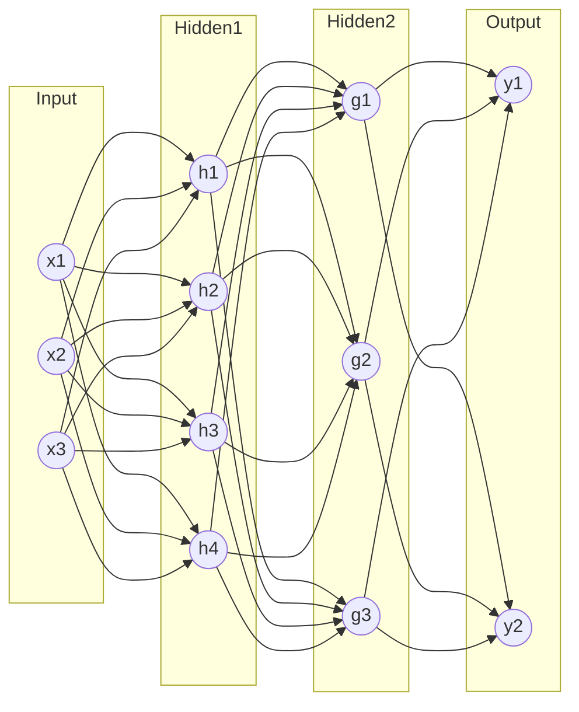

### 2.4 The forward pass

Running data through the network from input to output is the **forward pass** (or **forward propagation**). Each layer computes its weighted sums, applies its activation, and passes the result to the next layer. The final output is the network's prediction. At this stage the network may be badly wrong its weights start out random but the forward pass is how it produces any answer at all.

### 2.5 The loss function

To improve, the network needs a number that measures how wrong it is. That number comes from a **loss function** (or **cost function**), which compares the network's prediction to the correct answer and returns a single value: low when the prediction is good, high when it is bad. Training is the process of making this number as small as possible.

Common losses (all covered in the notebook):

- **Mean Squared Error (MSE)**: the average of the squared differences between prediction and truth. Used for **regression** predicting continuous numbers.
- **Mean Absolute Error (MAE)** and **Huber loss**: more robust to outliers than MSE.
- **Binary Cross-Entropy (BCE)**: the standard loss for two-class problems, measuring the gap between predicted and true probabilities.
- **Categorical Cross-Entropy**: the multi-class version, paired with softmax outputs.
- **Focal loss**: a cross-entropy variant that focuses learning on hard, misclassified examples useful for imbalanced data.
- **KL Divergence**: measures how one probability distribution differs from another; it reappears later in VAEs and knowledge distillation.

### 2.6 Gradient descent: how learning actually happens

Now the central idea. The loss is a function of all the network's weights and biases. Imagine the loss as the height of a vast, hilly landscape, where every possible setting of the parameters is a location, and we want to find the lowest valley. **Gradient descent** is the strategy of always stepping downhill.

The **gradient** is the multi-dimensional slope of the loss: for each parameter, it tells you which direction (increase or decrease) makes the loss go *up* fastest. To go *down*, you step in the opposite direction. The size of that step is controlled by the **learning rate** a small positive number. Too large, and you overshoot the valley, bouncing around chaotically; too small, and training crawls. The learning rate is the single most important knob to tune.

In short, each training step is: compute the prediction (forward pass), compute the loss, compute the gradient of the loss with respect to every parameter, then nudge every parameter a little in the downhill direction.

### 2.7 Backpropagation

The remaining question is how to compute the gradient for *every* weight in a deep network efficiently. The answer is **backpropagation** ("backprop"), the algorithm that made deep learning practical.

Backprop is the **chain rule** of calculus applied systematically, working *backward* from the loss to the inputs. The idea: the loss depends on the output layer, which depends on the layer before it, which depends on the layer before that. The chain rule says you can multiply these local dependencies together to find how the loss depends on any weight deep inside the network. Backprop computes these by sweeping backward once through the network, reusing intermediate results so that the cost is roughly the same as a forward pass.

A beautiful simplification appears when softmax output is paired with cross-entropy loss: the gradient at the output reduces to simply (prediction − truth). The notebook's from-scratch MLP uses exactly this, which is why the cell implementing its backward pass is the canonical place to see backprop demystified.

**Figure: The forward pass and backpropagation loop signals flow forward, gradients flow backward**

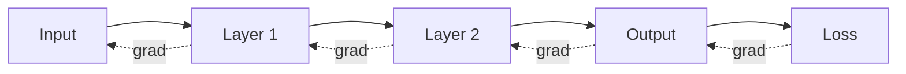

### 2.8 The training loop: epochs and batches

Training repeats the forward-loss-backward-update cycle many times over the dataset. Two terms govern this:

- **Batch**: training rarely uses the whole dataset at once (too memory-hungry) or one example at a time (too noisy). Instead it processes a small group of examples a **mini-batch**, typically 32 to 512 examples computes the average loss and gradient over them, and updates once. This **mini-batch gradient descent** is the standard.
- **Epoch**: one complete pass through the entire training dataset. Training usually runs for many epochs, each time reshuffling the data into fresh batches, until the loss stops improving.

The full loop, then: for each epoch, split the shuffled data into batches; for each batch, do a forward pass, compute the loss, backpropagate to get gradients, and update every parameter by stepping downhill. Repeat.

**Figure: The training loop data, forward, loss, backward, update, repeat**

```mermaid
flowchart LR
    D[Mini-batch of data] --> F[Forward pass]
    F --> P[Prediction]
    P --> L[Compute loss]
    L --> B[Backward pass / gradients]
    B --> U[Optimizer update]
    U, next batch --> D
```

### 2.9 Making deep networks trainable: initialization, normalization, dropout

Deep networks are finicky. Three techniques (each given its own section in the notebook) keep them stable:

- **Weight initialization**: the starting random values matter enormously. If they are too large or too small, signals explode or vanish as they pass through layers. **Xavier/Glorot** initialization (for sigmoid/tanh) and **He** initialization (for ReLU) set the initial variance so that signal strength is preserved layer to layer. The notebook demonstrates this by stacking ten layers and showing that He init keeps the signal alive while naive initialization kills it.
- **Batch Normalization** (Ioffe & Szegedy, 2015): inside the network, the distribution of each layer's inputs keeps shifting during training, which slows learning. BatchNorm re-centers and re-scales each layer's inputs using the statistics of the current batch, then applies two learnable parameters (scale and shift) so the network can undo the normalization if it wants. It speeds training and adds a mild regularizing effect.
- **Layer Normalization**: normalizes across the *features* of a single example rather than across the batch. This makes it independent of batch size and is the form used inside Transformers.
- **Dropout**: during training, randomly "drop" (set to zero) a fraction of neurons each step. This forces the network not to rely on any single neuron, spreading the work across many a powerful defense against **overfitting** (memorizing the training data instead of learning general patterns). At test time dropout is turned off and outputs are rescaled to compensate.

---

## 3. Optimizers

The plain gradient-descent update of Section 2 is the simplest possible **optimizer** the algorithm that decides how to turn gradients into parameter updates. `02_optimizers.ipynb` builds the major optimizers from scratch and races them across a difficult landscape (the **Rosenbrock function**, a curved valley that is notoriously hard to descend).

### 3.1 The gradient-descent family

- **Batch gradient descent**: uses the entire dataset for each update. Accurate but slow and memory-hungry.
- **Stochastic Gradient Descent (SGD)**: uses a single random example per update. Fast and noisy; the noise can actually help escape bad spots.
- **Mini-batch gradient descent**: the practical middle ground from Section 2.8, and what "SGD" usually means in practice.

### 3.2 Momentum and Nesterov

Plain SGD zig-zags down narrow valleys and crawls across flat regions. **Momentum** fixes this by accumulating a running average of past gradients a "velocity" so the optimizer builds up speed in consistent directions and damps out oscillations, like a heavy ball rolling downhill. **Nesterov Accelerated Gradient (NAG)** refines this by computing the gradient at a "look-ahead" position where momentum is about to carry the parameters, giving it a chance to slow down before overshooting.

### 3.3 Adaptive methods

The next leap is giving *each parameter its own learning rate* that adapts as training proceeds:

- **AdaGrad**: scales each parameter's step down in proportion to how much that parameter has been updated. Great for sparse data, but its learning rates shrink monotonically and eventually stall.
- **RMSprop**: fixes AdaGrad by using a *decaying* average of recent squared gradients instead of summing all of history, so learning rates don't die.
- **Adam (Adaptive Moment Estimation)**: combines momentum (a running average of gradients, the "first moment") with RMSprop (a running average of squared gradients, the "second moment"), plus a bias correction for the early steps. Adam is the default optimizer for most deep learning today robust and fast with little tuning.
- **AdamW**: Adam with **decoupled weight decay** it applies regularization (gently shrinking weights toward zero) correctly, separate from the gradient update. This is the standard for training Transformers.
- **RAdam, LAMB, Lion**: further refinements. **LAMB** enables the very large batch sizes used to train models like BERT by scaling updates layer-by-layer; **Lion** (2023) is a memory-efficient, sign-based optimizer.

The notebook's NumPy optimizer race on the Rosenbrock function is the clearest illustration: you can watch Momentum, RMSprop, and Adam each trace a different path toward the valley floor.

**Figure: A gradient-descent optimizer step gradient to update direction to new parameters**

```mermaid
flowchart LR
    G[Gradient of loss] --> M[Momentum: running average of gradients]
    G --> V[Adaptive scale: running average of squared gradients]
    M --> STEP[Update = learning rate times scaled direction]
    V --> STEP
    STEP --> NEW[New parameters]
    NEW, next step --> G
```

### 3.4 Learning-rate schedules and gradient clipping

A fixed learning rate is rarely optimal. A **learning-rate schedule** changes it over time typically starting higher to make fast early progress, then decreasing to settle into a good minimum:

- **Step decay**: drop the rate by a factor every few epochs.
- **Exponential decay**: shrink it smoothly and continuously.
- **Cosine annealing**: follow a cosine curve down to near zero very popular and effective.
- **Warmup + cosine**: start tiny, ramp *up* for the first few hundred steps (warmup, which stabilizes early training of large models), then cosine-decay down.
- **Cyclic / warm restarts**: periodically jump the rate back up to escape local minima.

**Gradient clipping** is a separate safety mechanism: if the gradient's magnitude exceeds a threshold, scale it back down. This prevents the catastrophic "exploding gradient" updates that can blow up training, and it is essential for recurrent networks (Section 5). The notebook visualizes each schedule's curve and demonstrates clipping on deliberately oversized gradients.

---

## 4. Convolutional Neural Networks (CNNs)

`03_cnn.ipynb` covers the architecture built for images and other grid-like data. An MLP treats an image as a flat list of pixels, ignoring the fact that nearby pixels are related and that a cat is a cat wherever it appears in the frame. **Convolutional Neural Networks (CNNs)** are designed around exactly those facts.

### 4.1 The convolution operation

A **convolution** slides a small grid of weights a **kernel** or **filter** (e.g. 3×3) across the image. At each position it multiplies the kernel against the patch of pixels underneath and sums the result, producing one output number. Sweeping the kernel across the whole image produces a **feature map** a new image highlighting wherever that kernel's pattern appears. One kernel might detect vertical edges, another horizontal edges, another a particular texture.

Two ideas make this powerful:

- **Parameter sharing**: the same small kernel is reused at every position, so a CNN has vastly fewer parameters than a fully connected network, and a pattern learned in one corner is automatically detected everywhere.
- **Local connectivity**: each output depends only on a small local patch, matching the local structure of images.

(Technically CNNs compute *cross-correlation* but call it convolution; the notebook notes this and demonstrates it by hand with Sobel edge-detection, blur, and sharpen kernels applied to a digit image.)

Key mechanics:

- **Stride**: how many pixels the kernel jumps each step. A larger stride shrinks the output.
- **Padding**: adding a border of zeros around the image so the kernel can reach the edges; "same" padding keeps the output the same size, "valid" padding adds none.
- **Output size** follows the formula `(W − F + 2P)/S + 1` for input width `W`, filter size `F`, padding `P`, stride `S`.
- **Receptive field**: the region of the original image that influences a given deep-layer neuron. It grows layer by layer, so deep neurons "see" large parts of the image.

### 4.2 Pooling

**Pooling** downsamples a feature map to make the representation smaller and more robust to small shifts. **Max pooling** keeps the largest value in each small region (the strongest feature); **average pooling** takes the mean. **Global average pooling** collapses an entire feature map to a single number, commonly used just before the final classification layer in modern architectures.

### 4.3 Specialized convolutions

- **Dilated (atrous) convolution**: spreads the kernel out with gaps, enlarging the receptive field without adding parameters used in audio (WaveNet) and segmentation (DeepLab).
- **Depthwise separable convolution**: splits a convolution into a cheap per-channel step followed by a 1×1 mixing step, cutting computation dramatically. This is the trick behind **MobileNet** and on-device vision. The notebook shows roughly a 7× parameter reduction versus standard convolution.
- **Transposed convolution**: runs convolution "in reverse" to *upsample* grow an image larger used in generators and segmentation decoders.

### 4.4 CNN architectures

The notebook surveys the historical progression, each model a landmark:

- **LeNet-5** (1998): the original digit-recognizer.
- **AlexNet** (2012): the network that ignited the deep learning revolution by winning ImageNet.
- **VGG** (2014): deep stacks of small 3×3 convolutions.
- **GoogLeNet/Inception**: parallel filters and 1×1 "bottleneck" convolutions for efficiency.
- **ResNet** (2015): the key breakthrough. Very deep networks become *harder* to train because gradients degrade. ResNet adds **skip (residual) connections** that let a layer learn only a small adjustment `F(x)` and add it to its input: `output = F(x) + x`. This shortcut lets gradients flow freely backward, enabling networks hundreds of layers deep. The `ResidualBlock` and `MiniResNet` cell implements exactly this.
- **DenseNet, MobileNet, EfficientNet** (compound scaling), **ConvNeXt** (a modernized CNN): later refinements balancing accuracy and efficiency.

**Figure: A CNN pipeline image through convolution, activation, and pooling stages to a classifier**

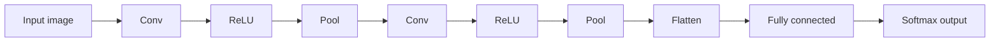

**Figure: A ResNet residual block the skip connection adds the input back to the learned adjustment**

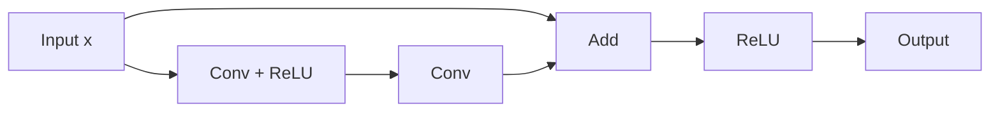

The notebook also demonstrates **transfer learning**: take a network (ResNet-18) already trained on millions of images, freeze its learned feature extractors, and retrain only the final classification layer for a new task with little data. This is how most practical image models are built.

---

## 5. Recurrent Networks: RNN, LSTM, GRU

CNNs handle grids; **sequences** text, speech, time series need a different design where order and memory matter. `04_rnn_lstm_gru.ipynb` covers the recurrent family.

### 5.1 Recurrent Neural Networks (RNNs)

A **Recurrent Neural Network (RNN)** processes a sequence one element at a time, maintaining a **hidden state** a vector that acts as its memory. At each step it combines the current input with the previous hidden state to produce a new hidden state, then moves on. The same weights are reused at every step (parameter sharing across time), so an RNN can handle sequences of any length.

Training uses **Backpropagation Through Time (BPTT)**: the network is conceptually "unrolled" across all time steps and backprop is applied to the unrolled chain.

**Figure: An RNN unrolled over time the same cell reused at each step, passing a hidden state forward**

```mermaid
flowchart LR
    x1((x_t1)) --> c1[RNN cell]
    x2((x_t2)) --> c2[RNN cell]
    x3((x_t3)) --> c3[RNN cell]
    c1, h1 --> c2
    c2, h2 --> c3
    c1 --> y1((y_t1))
    c2 --> y2((y_t2))
    c3 --> y3((y_t3))
```

The fatal flaw is the **vanishing (and exploding) gradient** problem. As gradients propagate back through many time steps, they are multiplied together repeatedly; if the relevant factors are smaller than one they shrink toward zero (vanishing), and the network forgets information from many steps ago it cannot learn long-range dependencies. If larger than one they blow up (exploding), which gradient clipping addresses.

### 5.2 Long Short-Term Memory (LSTM)

The **LSTM** (Hochreiter & Schmidhuber, 1997) solves vanishing gradients with a cleverly gated memory. Alongside the hidden state it carries a **cell state** a protected memory conveyor belt that information can travel along almost unchanged. Three **gates**, each a small neural layer with a sigmoid that outputs values between 0 and 1, control the flow:

- The **forget gate** decides what to erase from the cell state.
- The **input gate** decides what new information to write in.
- The **output gate** decides what to read out of the cell state into the hidden state.

Because the cell state is updated mostly by addition (gated) rather than repeated multiplication, gradients flow through it without vanishing, letting LSTMs remember across hundreds of steps. The notebook's from-scratch `LSTMCell` computes all four gate components in one matrix multiply, then verifies it matches PyTorch's built-in LSTM.

**Figure: An LSTM cell forget, input, and output gates regulate a protected cell-state conveyor belt**

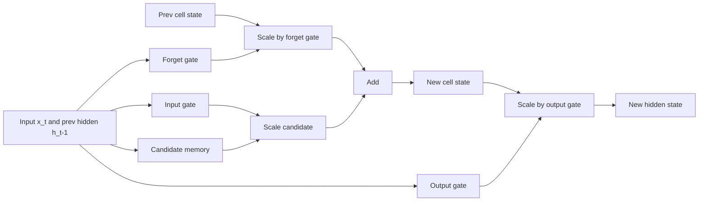

### 5.3 Gated Recurrent Unit (GRU)

The **GRU** (Cho, 2014) is a streamlined LSTM with only two gates an **update gate** (how much of the past to keep) and a **reset gate** (how much past to ignore when forming new candidate memory) and no separate cell state. It has fewer parameters than an LSTM, trains faster, and often performs comparably, making it a popular alternative.

### 5.4 Bidirectional RNNs, Seq2Seq, and attention

- **Bidirectional RNN**: runs two RNNs, one forward and one backward through the sequence, and concatenates their hidden states so each position has context from both directions. Excellent for tasks where the whole sequence is available, like classification.
- **Sequence-to-Sequence (Seq2Seq)**: an *encoder* RNN reads an input sequence into a single fixed-size vector, and a *decoder* RNN generates an output sequence from it (e.g. for translation). The weakness is the **bottleneck**: cramming an entire sentence into one vector loses information.
- **Attention** (Bahdanau, 2015): the fix that changed everything. Instead of relying on one fixed vector, the decoder, at each output step, looks back over *all* the encoder's hidden states and computes a weighted blend paying more "attention" to the relevant input words. These attention weights are learned. Attention removed the bottleneck and directly led to the Transformer.

**Figure: A Seq2Seq model with attention the decoder attends over all encoder states at each step**

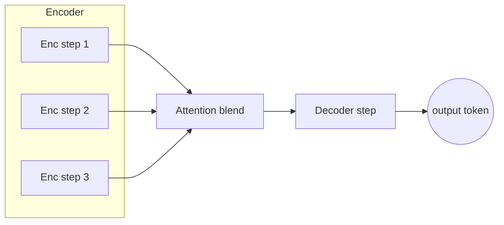

### 5.5 Word embeddings

To feed words into a network, they must become numbers. A **word embedding** is a learned dense vector for each word, positioned so that words with similar meanings sit near each other in the vector space. The notebook covers **Word2Vec** (learns embeddings by predicting context words, in CBOW or Skip-gram form, often with negative sampling for efficiency), **GloVe** (factorizes word co-occurrence statistics), and **FastText** (builds word vectors from character n-grams, so it handles misspellings and unseen words). The applied sentiment models in the notebook use a learnable embedding layer feeding a bidirectional LSTM/GRU.

### Comparison: CNN vs RNN vs Transformer

| | CNN | RNN / LSTM / GRU | Transformer |
|---|---|---|---|
| Built for | Grids (images) | Sequences (text, time) | Sequences (text, and more) |
| Processes | Local patches in parallel | One step at a time, sequentially | Whole sequence in parallel |
| Memory of distant elements | Limited by receptive field | Limited (RNN) to good (LSTM) | Excellent (direct attention) |
| Speed on long sequences | Fast | Slow (sequential) | Fast (parallel), but costly per length |
| Long-range dependencies | Weak | Moderate | Strong |
| Key mechanism | Convolution | Recurrence + gating | Self-attention |

---

## 6. Transformers

`05_transformers_architecture.ipynb` builds the architecture (Vaswani et al., "Attention Is All You Need," 2017) that underlies essentially every modern large language model. The Transformer threw away recurrence entirely and processes whole sequences in parallel using attention alone solving the RNN's slowness and its struggle with long-range dependencies.

### 6.1 Self-attention

The core operation is **self-attention**, which lets every word in a sequence directly look at every other word and decide how relevant each is. For each word, the model produces three vectors via learned projections:

- A **Query (Q)**: "what am I looking for?"
- A **Key (K)**: "what do I contain?"
- A **Value (V)**: "what information do I carry?"

To compute attention for a word, its query is compared (by dot product) against every word's key, producing relevance scores. These scores are scaled (divided by the square root of the key dimension, to keep them stable), passed through softmax to become weights summing to 1, and used to take a weighted average of all the values. The result for each word is a new representation enriched with information from the words it found most relevant. This is **scaled dot-product attention**, implemented in the notebook's `ScaledDotProductAttention` class.

**Figure: Scaled dot-product attention queries match keys to weight a sum of values**

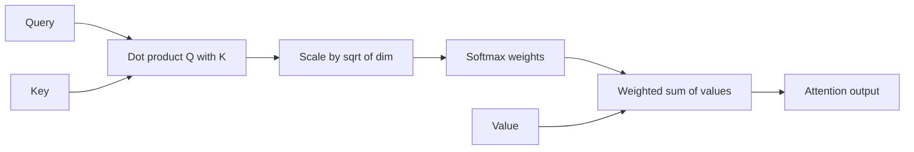

### 6.2 Multi-head attention

Rather than one attention computation, the Transformer runs several in parallel **multi-head attention**. Each "head" learns its own Q/K/V projections and can focus on a different kind of relationship (one head might track grammatical subjects, another nearby words, another long-range references). Their outputs are concatenated and projected back together. The original paper used 8 heads with a model dimension of 512.

### 6.3 Positional encoding

Because self-attention processes all words simultaneously, it has no inherent sense of word *order* "dog bites man" and "man bites dog" would look identical. **Positional encoding** injects order by adding a position-dependent pattern to each word's embedding. The original design uses fixed sinusoidal waves of varying frequencies; later models use learned position embeddings or relative schemes like **RoPE** (rotary) and **ALiBi**. The notebook's `PositionalEncoding` builds the sinusoidal table and visualizes it as a heatmap.

### 6.4 The full architecture

A Transformer block wraps attention with two more pieces:

- A **feed-forward network (FFN)**: a small MLP applied to each position independently, expanding to roughly 4× the model dimension and back. It holds the majority of the model's parameters and does much of the "thinking."
- **Residual connections and layer normalization** around each sub-layer (the same skip-connection idea from ResNet), which keep gradients healthy in deep stacks.

The full model has two halves:

- The **encoder**: a stack of blocks (self-attention + FFN) that reads the input and builds rich representations of it.
- The **decoder**: a stack that generates output one token at a time. It uses **masked self-attention** (a causal mask hides future positions with negative infinity so a word can only attend to earlier words essential for generation) and **cross-attention** (queries from the decoder attend to keys/values from the encoder, linking output to input).

**Figure: A Transformer block multi-head self-attention and feed-forward, each wrapped by add and norm**

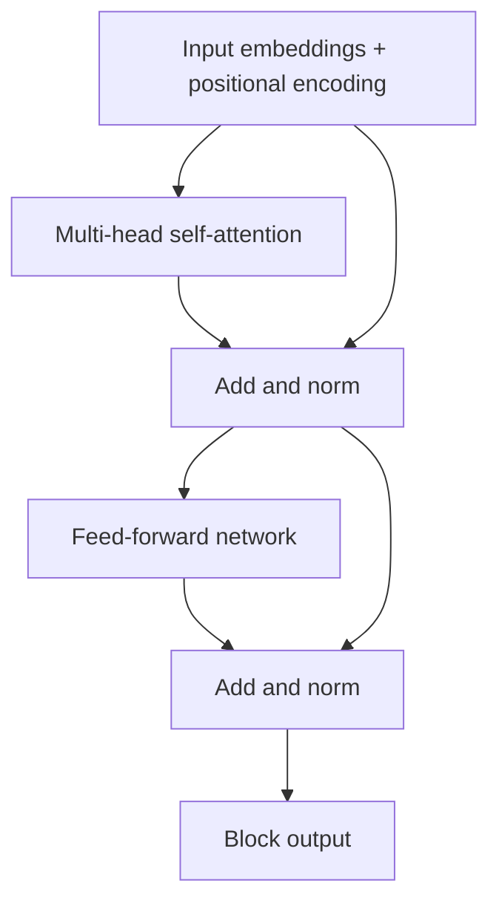

**Figure: The overall encoder-decoder Transformer cross-attention links decoder to encoder**

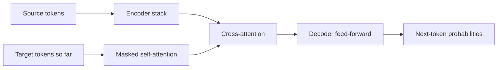

The notebook's `Transformer` class ties encoder and decoder together with embeddings, positional encoding, and the causal mask.

### 6.5 Architecture families and efficiency

- **Encoder-only** (BERT): great at understanding classification, search.
- **Decoder-only** (GPT): great at generation the basis of modern LLMs.
- **Encoder-decoder** (T5, BART): great at transformation translation, summarization.
- **Vision Transformer (ViT)**: applies the Transformer to images by chopping them into patches.

Self-attention's cost grows with the *square* of sequence length, which is expensive for long inputs. Efficient variants **sparse attention** (Longformer, BigBird), **linear attention** (Performer), and the IO-aware **FlashAttention** reduce this cost and appear again in the distributed-training notebook.

---

## 7. Generative Models

`06_generative_models.ipynb` shifts from models that *classify* to models that *create*. A **generative model** learns the underlying distribution of the data `p(x)` so it can produce new samples that look like the training data: new faces, new music, new text.

### 7.1 Autoencoders and Variational Autoencoders (VAEs)

An **autoencoder** is a network shaped like an hourglass: an **encoder** compresses the input into a small **latent** vector (a bottleneck), and a **decoder** reconstructs the original from it. By forcing data through the narrow middle, it learns a compact representation. A plain autoencoder can compress and denoise but cannot generate new samples well, because its latent space has gaps.

**Figure: An autoencoder encoder compresses to a latent bottleneck, decoder reconstructs**

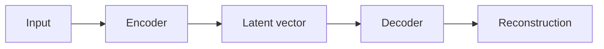

A **Variational Autoencoder (VAE)** (Kingma & Welling) fixes this by making the latent space smooth and continuous. Instead of encoding to a single point, the encoder outputs a *probability distribution* (a mean and a variance) for each latent dimension, and the model is trained to keep that distribution close to a standard bell curve. Its loss has two parts: a **reconstruction term** (the output should match the input) and a **KL-divergence term** (the latent distribution should match a standard normal). Because sampling is not differentiable, VAEs use the **reparameterization trick** sampling noise separately and combining it with the predicted mean and variance so gradients can still flow. **β-VAE** weights the KL term up to encourage **disentanglement**, where each latent dimension controls one interpretable factor. The notebook trains a VAE on a 2D mixture of Gaussians and visualizes its latent space.

### 7.2 Generative Adversarial Networks (GANs)

A **GAN** (Goodfellow, 2014) pits two networks against each other in a game:

- The **generator** tries to create fake data realistic enough to fool the other network.
- The **discriminator** tries to tell real data from the generator's fakes.

**Figure: A GAN generator and discriminator locked in an adversarial loop**

```mermaid
flowchart LR
    NOISE[Random noise] --> GEN[Generator]
    GEN --> FAKE[Fake sample]
    REAL[Real sample] --> DISC[Discriminator]
    FAKE --> DISC
    DISC --> JUDGE[Real or fake decision]
    JUDGE, train discriminator --> DISC
    JUDGE, train generator to fool --> GEN
```

They train together: as the discriminator gets better at spotting fakes, the generator is forced to make better fakes, and vice versa, until the fakes are indistinguishable from real data. GANs produce strikingly sharp images but are notoriously unstable to train and prone to **mode collapse** (the generator producing only a few varieties). **WGAN** and **WGAN-GP** stabilize training by replacing the loss with the Wasserstein (Earth-Mover) distance and enforcing a smoothness constraint. The notebook trains a small GAN on a bimodal distribution.

### 7.3 Diffusion models

**Diffusion models** (the technology behind DALL·E, Stable Diffusion, Midjourney) generate by learning to *reverse* a noising process:

- The **forward process** gradually adds random noise to a real image over many small steps until it becomes pure static. This is fixed and requires no learning; thanks to a closed-form shortcut, any noise level can be reached in one step.
- The **reverse process** trains a network (typically a U-Net) to predict and remove the noise at each step. To generate, you start from pure noise and run the learned denoiser repeatedly until a clean image emerges.

**Figure: The diffusion process a fixed forward path adds noise, a learned reverse path removes it**

```mermaid
flowchart LR
    IMG[Clean image], add noise --> N1[Noisy]
    N1, add noise --> N2[More noisy]
    N2, add noise --> PURE[Pure noise]
    PURE, denoise --> R2[Less noisy]
    R2, denoise --> R1[Cleaner]
    R1, denoise --> GEN[Generated image]
```

The notebook illustrates the *forward* process numerically watching a point degrade into noise but does not train a full reverse denoiser; it is meant to convey the intuition. **DDIM** is a technique for sampling faster with fewer steps.

### 7.4 Normalizing flows and energy-based models

The notebook also introduces, as theory, **normalizing flows** (which transform a simple distribution into a complex one through a chain of invertible functions, allowing exact likelihoods RealNVP, Glow) and **energy-based models** (which assign an "energy" to each configuration and sample from low-energy regions). These reappear in the neural-ODE notebook.

| Generative family | How it generates | Strengths | Weaknesses |
|---|---|---|---|
| VAE | Decode a sampled latent | Stable, smooth latent space | Blurrier samples |
| GAN | Generator fools discriminator | Sharp, realistic samples | Unstable, mode collapse |
| Diffusion | Iteratively denoise from static | State-of-the-art quality, stable | Slow (many steps) |
| Normalizing flow | Invertible transform | Exact likelihood | Architecturally constrained |

---

## 8. Graph Neural Networks (GNNs)

`07_gnn.ipynb` handles data shaped as **graphs** collections of **nodes** (entities) connected by **edges** (relationships): social networks, molecules, road maps, knowledge bases. Such data has no fixed grid or sequence, so CNNs and RNNs don't apply directly.

### 8.1 Message passing

The unifying idea of GNNs is **message passing**. Each node has a feature vector, and in each layer every node:

1. **Aggregates** messages (feature vectors) from its neighboring nodes by summing, averaging, or max-pooling them.
2. **Updates** its own representation by combining the aggregate with its current state through a small neural transform.

**Figure: A GNN message-passing step a node aggregates neighbor features then updates itself**

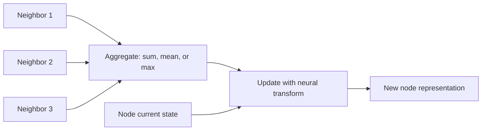

Stacking `L` such layers lets each node gather information from neighbors up to `L` hops away. The result can be used for **node classification** (label each node), **link prediction** (will two nodes connect?), or **graph classification** (label the whole graph, e.g. is this molecule toxic?).

### 8.2 Major GNN variants

- **GCN (Graph Convolutional Network)** (Kipf & Welling): aggregates neighbors with a symmetric normalization that accounts for node degree, then applies a linear transform essentially a smoothed average of neighbors. The notebook implements its `GCNLayer` from scratch.
- **GraphSAGE**: learns to aggregate from a *sample* of neighbors, making it **inductive** able to generalize to nodes never seen during training.
- **GAT (Graph Attention Network)** (Veličković): applies the attention idea to graphs, learning how much weight to give each neighbor rather than treating them equally. The notebook defines a from-scratch `GATLayer`.
- **GIN (Graph Isomorphism Network)**: the most expressive standard GNN, designed to distinguish graph structures as well as the classical Weisfeiler-Leman test.

The notebook trains a GCN on **Zachary's Karate Club** a classic 34-member social network split into two factions to classify each member's allegiance, then visualizes the learned node embeddings with t-SNE, showing the two communities cleanly separated.

---

## 9. Model Compression

`08_model_compression.ipynb` (with the deeper `13_quantization_and_compression_advanced.ipynb`) addresses a practical problem: state-of-the-art models are enormous and slow. **Model compression** shrinks them so they run on phones, in browsers, and cheaply at scale, with minimal accuracy loss. There are four main families.

### 9.1 Knowledge distillation

**Knowledge distillation** (Hinton, 2015) trains a small **student** network to mimic a large **teacher** network. Crucially, the student learns not just the teacher's final answers but its **soft targets** the full probability distribution over classes, softened with a **temperature** parameter. These soft targets carry rich information ("this 7 looks a bit like a 1"), letting the small student reach accuracy it could not achieve training on hard labels alone. **Figure: Knowledge distillation a small student learns from a large teacher's soft targets and the true labels**

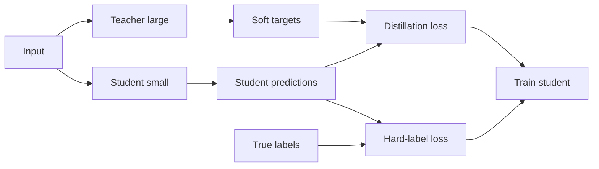

The student's loss blends matching the teacher's soft outputs with matching the true labels. **DistilBERT** and **TinyBERT** are famous results. The notebook defines a teacher and a much smaller student and reports a roughly 22× compression.

### 9.2 Pruning

**Pruning** removes unimportant parts of a trained network. **Magnitude pruning** deletes the weights closest to zero, on the theory that they contribute least. **Unstructured pruning** removes individual weights (yielding a sparse network); **structured pruning** removes whole neurons, channels, or layers (yielding a smaller dense network that runs faster on ordinary hardware). The **Lottery Ticket Hypothesis** observes that a large network contains a small sub-network ("winning ticket") that, trained alone, matches the full network found via **iterative magnitude pruning**. (The notebook's pruning demo has a minor bug: it measures sparsity before finalizing the mask, so the printed reduction looks like zero the concept is sound even though the readout is misleading.)

### 9.3 Quantization

**Quantization** stores and computes with lower-precision numbers. Neural networks normally use 32-bit floating point (FP32); quantization converts weights (and sometimes activations) to 16-bit (FP16/BF16), 8-bit integers (INT8), or even 4-bit (INT4/NF4), cutting memory and speeding up arithmetic. The conversion uses an **affine mapping** defined by a **scale** and a **zero-point** that map the float range onto the integer range.

**Figure: A quantization flow high-precision weights mapped to low-precision integers via scale and zero-point**

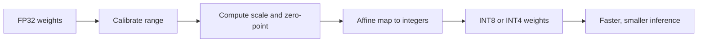

Two approaches: **Post-Training Quantization (PTQ)** quantizes an already-trained model (fast, but can lose accuracy at low bit-widths), and **Quantization-Aware Training (QAT)** simulates quantization *during* training so the model adapts to it. QAT uses the **straight-through estimator (STE)** to pass gradients through the non-differentiable rounding step. The notebook demonstrates INT8 dynamic quantization and its size/speed benefits.

### 9.4 Low-rank adaptation (LoRA)

**LoRA (Low-Rank Adaptation)** appears here in brief and is the centerpiece of Section 11. The notebook defines a from-scratch `LoRALayer` and sweeps its rank, previewing the idea that fine-tuning can be done by training tiny add-on matrices instead of the full model.

---

## 10. Self-Supervised Learning

`09_self_supervised_learning.ipynb` tackles the data-labeling bottleneck. Supervised learning needs millions of human-labeled examples, which are expensive. **Self-supervised learning (SSL)** creates its own labels from the structure of unlabeled data, learning powerful general-purpose representations that can then be fine-tuned for specific tasks with very little labeled data. It is how modern foundation models (BERT, GPT, DINO) are pretrained.

### 10.1 Contrastive learning

The dominant SSL idea: teach the model that two different augmented views of the *same* image should have similar representations (a "positive pair"), while views of *different* images should be far apart (negatives). Pulling positives together and pushing negatives apart forces the model to capture semantic content.

- **SimCLR**: creates two augmented views of each image and uses the **NT-Xent / InfoNCE** contrastive loss to attract the pair and repel all others in the batch. The notebook implements the augmentation pipeline, projection head, and the NT-Xent loss from scratch.
- **MoCo (Momentum Contrast)**: maintains a large queue of negative examples and a slowly-updated "momentum" encoder, decoupling the number of negatives from the batch size.
- **BYOL / SimSiam**: remarkably, learn good representations *without negatives* at all, using a **stop-gradient** trick to prevent the trivial collapse where the network outputs the same thing for everything.

### 10.2 Beyond contrastive

- **Barlow Twins / VICReg**: avoid collapse by making the representation's dimensions non-redundant (decorrelated) rather than by contrasting pairs.
- **SwAV / DeepCluster**: combine clustering with SSL, assigning views to learned cluster prototypes (using the **Sinkhorn-Knopp** algorithm for balanced assignment).
- **Masked modeling**: hide part of the input and train the model to reconstruct it. **BERT** masks words in text; the **Masked Autoencoder (MAE)** masks ~75% of image patches and reconstructs the missing pixels with an asymmetric encoder-decoder. The notebook implements patch embedding, the MAE encoder/decoder, and the masking visualization.
- **DINO / DINOv2**: self-distillation without labels, where a student matches a teacher's output on different views, with centering and sharpening to prevent collapse.

To use an SSL-pretrained model, you evaluate it by **linear probing** (freeze the features, train only a small classifier on top) or **fine-tuning** (adjust the whole network). The notebook includes tools to monitor for representation **collapse** the failure mode where all outputs become identical.

---

## 11. Neural Ordinary Differential Equations (Neural ODEs)

`10_neural_ode.ipynb` presents an elegant reframing of deep networks. Recall ResNet's residual update `output = x + F(x)`: a small change added to the input. If you imagine taking infinitely many such layers with infinitely small steps, the discrete stack becomes a *continuous* transformation a differential equation.

A **Neural ODE** (Chen et al., 2018) defines the network's behavior as `dh/dt = f(h, t)`, where `f` is a neural network giving the *rate of change* of the hidden state `h`, and "depth" becomes continuous time. To get the output, you hand `f` to an **ODE solver** (like Runge-Kutta) that numerically integrates from the input to the output. The number of solver steps adapts automatically to the difficulty of the input.

Key advantages and ideas:

- **Constant memory**: training uses the **adjoint sensitivity method**, which computes gradients by solving a second ODE *backward* in time rather than storing every intermediate activation so memory does not grow with depth.
- **Continuous normalizing flows (FFJORD)**: combine Neural ODEs with normalizing flows for flexible generative modeling, using the **Hutchinson trace estimator** to make the math tractable.
- **Latent ODEs**: ideal for **irregularly-sampled time series** (medical records, sensors with gaps), because a continuous model can be evaluated at any time point.
- **Hamiltonian and Lagrangian Neural Networks**: bake the laws of physics (energy conservation) into the model so it learns physically valid dynamics demonstrated on a pendulum.
- **Kolmogorov-Arnold Networks (KAN)**: a recent alternative that puts *learnable functions on the edges* (using B-splines) instead of fixed activations on the nodes.

The notebook's capstone trains a Neural ODE to classify two interleaved spirals, with from-scratch RK4 solvers and the `torchdiffeq` library for the memory-efficient adjoint.

---

## 12. Distributed Training

`11_distributed_training.ipynb` addresses how the largest models are trained when they no longer fit on a single GPU, or would take years on one device. **Distributed training** spreads the work across many GPUs and machines.

### 12.1 Forms of parallelism

- **Data parallelism**: the most common form. Replicate the full model on every GPU, give each a different slice of the batch, then average all their gradients (via an **all-reduce** collective) so every replica stays in sync. PyTorch's **DistributedDataParallel (DDP)** implements this.
- **Model parallelism**: when the model itself is too large for one GPU, split it across devices. **Pipeline parallelism** puts different *layers* on different GPUs and streams micro-batches through like an assembly line the challenge is the idle "bubble" while the pipeline fills and drains (GPipe, PipeDream/1F1B reduce it). **Tensor parallelism** (Megatron) splits *individual layers* the matrices themselves across GPUs.
- **Sequence / context parallelism**: splits a long input sequence across devices (ring attention), for very long contexts.

### 12.2 Memory-saving techniques

- **ZeRO and FSDP (Fully Sharded Data Parallel)**: data parallelism wastes memory by replicating the optimizer state, gradients, and parameters on every GPU. ZeRO/FSDP *shard* these across GPUs (in stages 1, 2, 3) so each holds only a fraction, gathering pieces on demand. This is what makes training models with tens of billions of parameters feasible.
- **Gradient (activation) checkpointing**: instead of storing every intermediate activation for the backward pass, store a few and recompute the rest trading compute for memory.
- **Mixed precision (AMP)**: do most computation in fast 16-bit (FP16 or BF16) while keeping a 32-bit master copy of the weights, with **dynamic loss scaling** to prevent tiny gradients from vanishing in FP16. This roughly halves memory and speeds training.
- **FlashAttention**: an IO-aware reimplementation of attention that avoids materializing the huge attention matrix in slow memory, computing softmax in an online streaming fashion. It makes attention dramatically faster and lighter on long sequences.

### 12.3 Collective communication

GPUs coordinate through **collective operations**: **all-reduce** (sum-and-share gradients), **broadcast**, **all-gather**, and **reduce-scatter**, implemented efficiently by libraries like NCCL over high-speed interconnects (NVLink). The notebook includes runnable AMP, checkpointing, and FlashAttention demos plus a memory calculator, while the multi-GPU code (DDP, FSDP) is shown as illustrative.

---

## 13. Parameter-Efficient Fine-Tuning (PEFT)

`12_advanced_peft.ipynb` is the dedicated deep-dive on a problem central to the LLM era: fully fine-tuning a 7-billion-parameter model requires enormous memory (the notebook estimates ~56 GB) and produces a full copy of the model per task. **Parameter-Efficient Fine-Tuning (PEFT)** adapts a large pretrained model to a new task by training only a tiny fraction of its parameters often well under 1% while freezing the rest.

The justification is the **low intrinsic dimension** insight: the *change* needed to adapt a model to a task is much simpler than the model itself, so it can be captured by a small number of new parameters.

### 13.1 LoRA and its relatives

**Figure: LoRA / PEFT the frozen base weights stay fixed while a small trainable low-rank adapter is added**

```mermaid
flowchart LR
    X[Input] --> W[Frozen weight W]
    X --> A[Adapter down-projection A]
    A --> B[Adapter up-projection B]
    W --> ADD[Add]
    B --> ADD
    ADD --> OUT[Output]
```

- **LoRA (Low-Rank Adaptation)**: the dominant method. It freezes the original weight matrix `W` and learns a small update expressed as the product of two thin matrices, `B·A`, where the inner dimension (the **rank**) is tiny. Only `A` and `B` are trained a few thousand or million parameters instead of billions. At inference the update can be merged back into `W`, adding zero latency. The notebook implements `LoRALayer` from scratch (initializing `B` to zero so adaptation starts as a no-op) and also via the HuggingFace PEFT library, reporting ~0.27% trainable parameters on BERT.
- **QLoRA**: combines LoRA with 4-bit quantization (NF4 format) of the frozen base model, so a 7B model that needs ~14 GB fits in ~3.5 GB letting huge models be fine-tuned on a single consumer GPU.
- **DoRA**: decomposes the weight update into separate magnitude and direction components for better quality.

### 13.2 Other PEFT families

- **Prefix tuning / prompt tuning / P-Tuning**: instead of touching the model's weights, prepend a small set of trainable "virtual tokens" or key/value vectors that steer the frozen model's behavior.
- **Adapter layers**: insert small trainable bottleneck modules between the frozen Transformer layers.
- **IA³**: learns a handful of scaling vectors that rescale the model's internal activations extraordinarily few parameters (~0.065%).
- **BitFit**: trains *only the bias terms*, leaving all weights frozen (~0.094% of parameters).

The notebook implements each method from scratch and via the library, ends with a comparison table, and runs a real LoRA fine-tune of BERT on the **SST-2** sentiment dataset.

| PEFT method | What it trains | Typical trainable % |
|---|---|---|
| LoRA | Low-rank update matrices | ~0.1-1% |
| QLoRA | LoRA on a 4-bit frozen base | ~0.1-1% (4× less memory) |
| Prefix / prompt tuning | Virtual input tokens | <0.1% |
| Adapters | Inserted bottleneck modules | ~1-3% |
| IA³ | Activation scaling vectors | ~0.065% |
| BitFit | Bias terms only | ~0.094% |

---

## 14. Advanced Quantization and Compression

`13_quantization_and_compression_advanced.ipynb` is the capstone, going deeper than Section 9 especially for compressing large language models for cheap, fast inference.

### 14.1 Quantization fundamentals revisited

It surveys the precision formats FP32, FP16, BF16, the 8-bit float **FP8** (E4M3/E5M2), INT8, INT4, and the **NF4** (4-bit "normal float") used by QLoRA and the affine vs symmetric mappings between them. A useful rule: signal quality improves by about 6 dB per added bit. Quantizing **per-channel** (a separate scale for each output channel) preserves far more accuracy than a single scale for the whole tensor.

### 14.2 Advanced PTQ methods for LLMs

- **GPTQ**: quantizes weights one group at a time while using second-order (Hessian) information to compensate for the error introduced, preserving accuracy down to 3-4 bits.
- **AWQ (Activation-aware Weight Quantization)**: protects the small fraction of weights connected to the most important ("salient") activations by scaling them, since damaging those hurts accuracy most.
- **SmoothQuant**: migrates the difficulty of quantizing outlier activations into the weights, enabling efficient 8-bit weight-and-activation (W8A8) inference.
- **GGUF/Q4_K_M, SpQR, HQQ, AQLM, QuIP#**: the formats and methods behind running LLMs locally (e.g. in llama.cpp).

### 14.3 Advanced pruning, distillation, and NAS

- **Pruning for LLMs**: **SparseGPT** and **Wanda** prune large models in one shot using weight magnitude weighted by activation size, without retraining.
- **Distillation**: **TinyBERT** uses a multi-component loss matching the teacher's predictions, hidden states, attention, and embeddings. **Speculative decoding** uses a small model to draft tokens that a large model verifies, speeding generation.
- **Neural Architecture Search (NAS)**: automatically *designs* efficient architectures. **DARTS** makes the search differentiable by relaxing discrete choices into continuous weights; **Once-for-All** trains one super-network from which many efficient sub-networks can be extracted.

### 14.4 Inference frameworks

Finally, the deployment layer: **torch.compile** (fuses and optimizes operations), **TorchScript** and **ONNX** (portable model formats), and **TensorRT** (NVIDIA's optimized inference engine). The notebook benchmarks eager execution against these, alongside FlashAttention versions, and closes with a decision tree and a perplexity-vs-memory table for a quantized LLaMA-2-7B.

---

## 15. The Through-Line

**Figure: The through-line every architecture shares the same learning loop**

```mermaid
stateDiagram-v2
    [*] --> Forward
    Forward --> Loss
    Loss --> Backward
    Backward --> Update
    Update --> Forward
    Update --> [*]
```

Step back and the whole field rhymes. Everything is built from the same loop: a **forward pass** produces a prediction, a **loss** measures the error, **backpropagation** computes gradients, and an **optimizer** nudges parameters downhill repeated over **batches** and **epochs**. The differences between a CNN, an LSTM, a Transformer, a GAN, and a Neural ODE lie entirely in the *architecture* of the forward pass, not in how learning happens.

A second through-line is the recurring engineering pattern, visible across all thirteen notebooks: build the idea from scratch to understand it, then reach for the optimized library version to use it at scale. The same handful of tricks residual connections to keep gradients flowing, attention to relate distant elements, normalization to stabilize, low-rank and low-precision to compress recur again and again, recombined into ever more capable systems.

Master the single neuron and the training loop, and the rest of deep learning is variations on a theme.
