# Computer Vision: A Conceptual Guide from Scratch

Computer vision is the field of getting computers to **understand the visual world** to take in an image or a video and produce useful conclusions about what it contains: *Is there a cat? Where exactly is it? Which pixels belong to it? What text is written here? Where are this person's joints? How far away is that wall?* Humans do this effortlessly and unconsciously; for a machine, every one of those questions is a distinct, hard problem with its own techniques.

This guide builds the entire subject up from the most fundamental unit the pixel and walks all the way to generating new images and reconstructing 3D scenes. Each idea is defined the first time it appears, and the path mirrors the nine notebooks in this folder, which move from classical image processing through deep-learning recognition tasks and into generative and 3D vision.

---

## 1. What an Image Actually Is

Before any "vision" can happen, we must agree on what an image *is* to a computer.

A **pixel** (short for "picture element") is a single tiny dot of an image the smallest addressable piece. A digital image is simply a grid of these dots. If you zoom in far enough on any photo, it dissolves into a mosaic of solid-colored squares; each square is one pixel.

Each pixel holds a number (or several numbers) describing its brightness or color:

- A **grayscale** image is a 2D grid of single numbers. The computer stores it as an array of shape `(H, W)` height by width. Each value is the brightness, usually an integer from **0 (black) to 255 (white)**. That 0-255 range comes from storing each value in 8 bits (one byte), called the **uint8** format. Sometimes values are instead scaled to floating-point numbers between 0.0 and 1.0 (**float32**) because neural networks prefer small decimal inputs.
- A **color** image is a 3D grid of shape `(H, W, C)`, where `C` is the number of **channels**. A channel is one "layer" of the image holding one component of color. A normal color photo has 3 channels red, green, and blue and every pixel's final color is a mixture of those three. So a 224×224 color image is a stack of three 224×224 grids.

**Figure: How a color image is represented as a stack of channel grids**

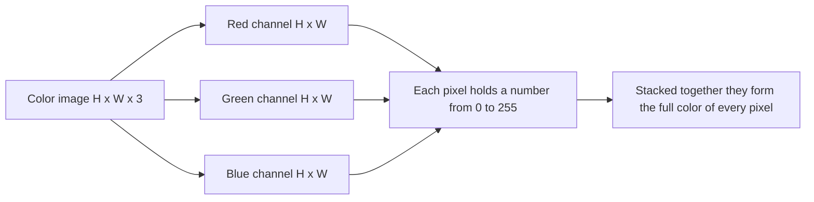

**A crucial practical gotcha:** the OpenCV library (the workhorse of classical image processing, imported as `cv2`) loads color channels in the order **Blue, Green, Red (BGR)**, not the more common Red, Green, Blue (RGB). Forgetting this is the single most common beginner bug red objects appear blue. The `01_image_basics_opencv.ipynb` notebook flags this immediately, because every downstream operation depends on knowing which channel is which.

### Color Spaces

A **color space** is a convention for *how* the numbers in the channels encode color. The same physical color can be described in different coordinate systems, and some are far more convenient for certain tasks:

- **RGB / BGR** color as amounts of red, green, blue light. Natural for displays, awkward for "find everything that is roughly this hue."
- **HSV (Hue, Saturation, Value)** separates *which* color (Hue, an angle on the color wheel), *how vivid* it is (Saturation), and *how bright* it is (Value). This is the go-to space for **color-based filtering**: "select all the orange pixels" is a clean range in Hue, but a messy 3D blob in RGB.
- **LAB (Lightness, A, B)** designed so that equal numeric distances correspond to roughly equal *perceived* color differences ("perceptually uniform"). Useful when you want operations to look natural to the human eye.
- **Grayscale** discards color entirely. The standard conversion weights the channels by human sensitivity: `Y = 0.299·R + 0.587·G + 0.114·B` (we perceive green as brightest, blue as dimmest).

---

## 2. Classical Image Processing with OpenCV

Before deep learning, vision was done with hand-designed mathematical operations. These remain essential: they are fast, need no training data, and underpin the preprocessing steps of modern systems. This is the substance of `01_image_basics_opencv.ipynb`.

### Geometric Transformations

These change *where* pixels are, not their color. Examples: **translation** (sliding the image), **rotation** (spinning it about a center point by some angle), **scaling** (resizing), and **flipping** (mirroring). They are expressed as small matrices applied to pixel coordinates an **affine transformation** is any such operation that keeps straight lines straight and parallel lines parallel, encoded in a 2×3 matrix. The notebook's transformation cell demonstrates rotating a simple shape 45°, translating it, and flipping it horizontally.

### Filtering and Convolution

A **filter** (also called a **kernel**) is a small grid of numbers say 3×3 that is slid across the image. At each position, you multiply the kernel's numbers by the pixel values underneath, sum the result, and write that sum into the output. This sliding-multiply-and-sum operation is called **convolution**, and it is the single most important operation in all of computer vision (deep learning included). The kernel's numbers determine *what* the filter does:

**Figure: The convolution operation sliding a kernel across an image**

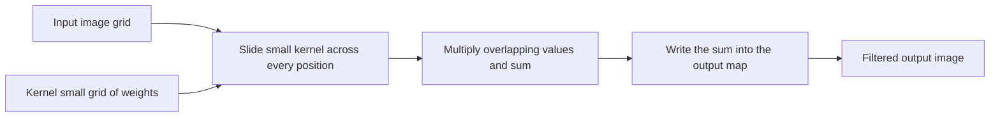


- **Gaussian Blur** a kernel whose weights follow a bell curve; it averages each pixel with its neighbors, smoothing away noise and detail. The closer a neighbor, the more it counts.
- **Median Filter** instead of averaging, it replaces each pixel with the *median* of its neighborhood. This is "non-linear" and excellent at removing speckle noise (random isolated bad pixels) while keeping edges sharp.
- **Bilateral Filter** smooths while *preserving edges*. It blurs only among pixels that are both nearby *and* similar in color, so it cleans flat regions without melting boundaries.

### Edge Detection

An **edge** is a location where brightness changes sharply typically the boundary of an object. Detecting edges means finding where the image's **gradient** (its rate of change) is large.

- **Sobel operator** a pair of kernels that estimate the horizontal and vertical gradient. Combining them gives the **gradient magnitude** (edge strength at each pixel).
- **Canny edge detector** the gold-standard classical edge finder, a five-step pipeline: blur with Gaussian → compute gradients → **non-maximum suppression** (thin thick edges down to one-pixel lines by keeping only local peaks) → double-threshold → **hysteresis** (link weak edges only if connected to strong ones). The result is clean, thin, connected edge lines.

**Figure: The five-step Canny edge detection pipeline**

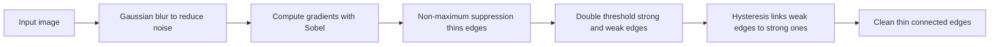

### Feature Detection and Description

A **feature** is a distinctive, repeatable location in an image a point you could reliably find again in another photo of the same scene. **Corners** are the classic example, because unlike a flat region or a straight edge, a corner is unambiguous in every direction.

- **Harris corner detection** measures, for each pixel, how much the image changes if you shift a small window in any direction. A corner changes a lot in all directions; the math classifies each pixel as flat, edge, or corner via a "corner response" score.
- **ORB (Oriented FAST and Rotated BRIEF)** finds keypoints *and* computes a **descriptor** for each: a compact numeric fingerprint of the local patch that stays stable even if the image is rotated or rescaled. Descriptors let you *match* the same point across two images (the basis of panorama stitching, tracking, and 3D reconstruction). ORB is patent-free, which is why it replaced the older SIFT/SURF in many pipelines.
- **HOG (Histogram of Oriented Gradients)** describes a whole image region by the *distribution of edge directions* within it. It chops the image into small cells, builds a histogram of gradient orientations per cell, normalizes across blocks of cells, and stacks everything into one long **feature vector**. Before deep learning, HOG was the standard input for pedestrian and object detectors.

### Other Foundational Operations

- **Histogram equalization / CLAHE** contrast enhancement. A **histogram** here is a count of how many pixels have each brightness. Global equalization stretches the brightness range to use the full scale; **CLAHE (Contrast Limited Adaptive Histogram Equalization)** does this locally, region by region, with a cap to avoid over-amplifying noise.
- **Contour detection** after **thresholding** an image to pure black-and-white (a **binary image**), a contour is the connected outline of a white blob. From a contour you can measure shape properties like **area** and **perimeter**.
- **Morphological operations** shape transformations on binary images: **erosion** shrinks white regions, **dilation** grows them, **opening** (erode then dilate) removes small specks, and **closing** (dilate then erode) fills small holes.

---

## 3. From Pixels to Meaning: The Three Core Recognition Tasks

Most of modern vision revolves around three closely related tasks. Understanding how they differ is the backbone of the whole field.

| Task | Question it answers | Output | Granularity |
|---|---|---|---|
| **Classification** | *What is in this image?* | One (or a few) class label(s) for the whole image | Whole image |
| **Object Detection** | *What objects are here, and where?* | A list of class labels, each with a **bounding box** | Per-object |
| **Segmentation** | *Which pixels belong to what?* | A class (and possibly instance) label for **every pixel** | Per-pixel |

A useful analogy: classification says "this is a photo of a street." Detection says "there's a car *here*, a person *there*, a dog *over there*," drawing a box around each. Segmentation traces the exact silhouette of every car, person, and dog, coloring in every pixel. Each step demands more precise spatial understanding than the last.

**Figure: The three core recognition tasks compared by output granularity**

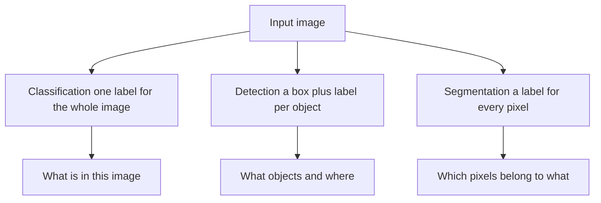

---

## 4. Image Classification with Deep Learning

Image classification assigning a whole image one label from a fixed set of classes is the task that launched the deep-learning revolution in vision, and it is the focus of `02_image_classification.ipynb`.

### The Convolutional Neural Network (CNN)

A **CNN** is a neural network built around the convolution operation from Section 2 but here the kernels are **learned**, not hand-designed. The network discovers, through training, which filters are useful. A convolution layer applies many learned kernels to its input and produces a stack of outputs called **feature maps** each feature map highlights where one learned pattern (an edge, a texture, later an eye or a wheel) appears in the image.

**Figure: A convolutional neural network for image classification end to end**

```mermaid
flowchart LR
    IMG[Input image H x W x 3] --> C1[Conv layer learned kernels produce feature maps]
    C1 --> P1[Pooling downsamples and keeps strongest signals]
    P1 --> C2[Conv layer detects textures and parts]
    C2 --> P2[Pooling]
    P2 --> C3[Conv layer detects whole objects]
    C3 --> FLAT[Flatten deep feature maps]
    FLAT --> FC[Fully connected layers produce class scores]
    FC --> SM[Softmax turns scores into probabilities]
    SM --> OUT[Predicted class]
```

**Figure: A single convolution plus pooling stage**

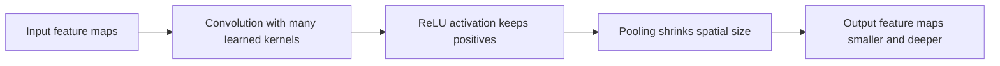

Stacking many such layers builds a hierarchy: early layers detect edges and colors, middle layers detect textures and parts, deep layers detect whole objects. Each layer's pixel "sees" a larger region of the original image than the last that region is its **receptive field**. The final layers convert the deepest feature maps into class scores, passed through a **softmax** function (which turns raw scores into probabilities that sum to 1) to give the predicted class.

### The Architecture Lineage

The notebook walks through the famous milestone architectures, each solving a problem in the last:

- **LeNet-5 (1998)** the first practical CNN, for handwritten digits.
- **AlexNet (2012)** the breakthrough that won ImageNet and ignited deep learning; introduced **ReLU** activations (a simple "keep positives, zero negatives" function that trains fast) and **dropout** (randomly switching off neurons during training to prevent over-memorizing).
- **VGG-16 (2014)** showed that simply stacking many small 3×3 convolutions deep works well.
- **GoogLeNet / Inception (2014)** ran multiple filter sizes in parallel; used 1×1 convolutions to cut computation.
**Figure: A residual skip connection in ResNet**

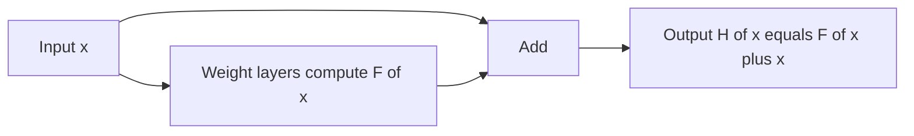

- **ResNet-50 (2015)** the pivotal idea of the **residual (skip) connection**: a shortcut that adds a layer's input directly to its output, `H(x) = F(x) + x`. This lets gradients flow backward through very deep networks without vanishing, enabling networks hundreds of layers deep.
- **DenseNet, MobileNetV2, EfficientNet** refinements for connectivity, mobile efficiency, and principled scaling. EfficientNet's **compound scaling** grows depth, width, and input resolution together in balanced proportion.
- **ViT-B/16 (2020)** and **ConvNeXt (2022)** the transformer era (Section 7) and a modernized CNN designed to match it.

### Making Training Work

- **Data augmentation** artificially expanding the training set by randomly transforming images so the model learns to be robust: random crops, flips, rotations, color jitter (random brightness/contrast/hue shifts), and grayscale conversion. Inputs are also **normalized** (rescaled to standard mean/standard-deviation statistics) so all features sit on comparable scales.
- **MixUp and CutMix** advanced augmentation that *blends* two training images and their labels: MixUp overlays two whole images with a random transparency; CutMix pastes a rectangular patch of one image onto another, mixing the labels in proportion to the patch area. Both force the model to generalize rather than memorize.
- **Label smoothing** instead of training toward an absolutely certain target (100% one class, 0% all others), softens the target slightly. This prevents the model from becoming overconfident.
- **Transfer learning** rather than training from scratch, start from a model **pretrained** on a huge dataset (like ImageNet) and adapt it to your task. The notebook lays out three strategies: **feature extraction** (freeze the whole pretrained "backbone," train only a new final classification "head"), **partial fine-tuning** (unfreeze the later layers too), and **full fine-tuning** (retrain everything with a small learning rate). The earlier the layer, the more general its features, so you typically keep early layers frozen.
- **Mixed-precision training** using half-precision (16-bit) arithmetic where safe to make training faster and lighter on GPU memory, with safeguards to keep it numerically stable.

### Seeing Why the Model Decided

**Grad-CAM (Gradient-weighted Class Activation Mapping)** is an interpretability tool: it produces a heatmap over the image showing *which regions most influenced* the predicted class. It works by checking how strongly each deep feature map affects the output score and overlaying the weighted result. If a "dog" prediction lights up the dog's face, you trust it; if it lights up the background, you've found a bug.

---

## 5. Object Detection: Finding *Where* Things Are

Detection (`03_object_detection.ipynb`) extends classification: now the model must output, for *each* object, both a class label *and* a **bounding box** a rectangle, given as four numbers (the corner coordinates `x1, y1, x2, y2`), that tightly encloses the object plus a **confidence** score (how sure the model is).

**Figure: The general object detection flow from image to clean boxes**

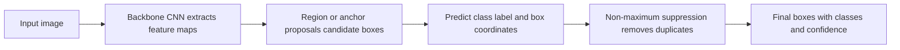

### Measuring a Detection: IoU and mAP

To judge whether a predicted box is "correct," we need to compare it to the true box. The standard measure is **IoU (Intersection over Union)**: the area where the two boxes *overlap*, divided by the total area they *jointly cover*. IoU = 1 means a perfect match; IoU = 0 means no overlap; a prediction usually counts as correct if IoU exceeds a threshold (e.g., 0.5).

From IoU we build the headline metrics:

- **Precision** = of the boxes the model predicted, what fraction were correct.
- **Recall** = of the true objects, what fraction the model found.
- **Average Precision (AP)** = the area under the precision-recall curve for one class (summarizing the precision/recall trade-off in a single number).
- **mAP (mean Average Precision)** = AP averaged over all classes. The COCO benchmark averages mAP across many IoU thresholds (0.50 to 0.95) for a stringent overall score.

The notebook's IoU cell draws two overlapping boxes and computes their IoU directly, and a later cell builds the full AP calculation from a precision-recall curve.

### Two Families of Detectors

**Two-stage detectors (the R-CNN family)** work in two passes: first *propose* regions that might contain objects, then *classify and refine* each proposal.

- **R-CNN → Fast R-CNN → Faster R-CNN** a progression toward speed. The key innovation is the **Region Proposal Network (RPN)** in Faster R-CNN: a small network that scans the feature map and, at each location, evaluates a set of pre-defined candidate boxes called **anchors**. An **anchor** is a reference box of a fixed size and aspect ratio; the network predicts, for each anchor, whether an object is present and how to nudge the box to fit better. **RoI Align** then crops each proposal's features cleanly (using interpolation) so a classifier can label it.

**Figure: Two-stage versus one-stage detector pipelines**

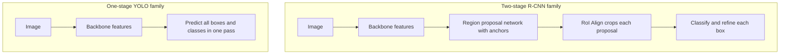

**One-stage detectors (the YOLO family)** skip the proposal step and predict all boxes and classes in a *single* forward pass much faster, ideal for real-time use.

- **YOLO ("You Only Look Once")** divides the image into a grid and has each grid cell predict boxes and classes directly. The notebook traces the entire evolution from **YOLOv1 (2016)** through **YOLOv11 (2024)**, charting steady gains in both accuracy and speed: anchor boxes (v2), multi-scale prediction (v3), and eventually **anchor-free** designs (v8 onward) that drop the predefined anchors, and even **NMS-free** designs (v10). The notebook includes a complete Ultralytics YOLOv8/v11 usage pattern for inference, training, evaluation, and export.

Other important detectors covered: **SSD**, which detects at multiple feature-map scales for different object sizes; **RetinaNet**, which introduced **Focal Loss** to fix a problem unique to one-stage detectors the overwhelming number of "easy background" boxes drowning out the rare real objects; focal loss down-weights easy examples so the model focuses on hard ones. And **DETR**, which reframes detection as a transformer-based *set prediction* problem, using "Hungarian matching" to assign predictions to ground-truth objects and eliminating the need for NMS entirely.

### Cleaning Up: Non-Maximum Suppression

A detector typically fires *several* overlapping boxes for the same object. **Non-Maximum Suppression (NMS)** is the post-processing step that keeps only the best one: sort all boxes by confidence, take the highest, discard every other box that overlaps it too much (IoU above a threshold), and repeat. **Soft-NMS** is a gentler variant that *lowers* the confidence of overlapping boxes rather than deleting them outright, which helps when real objects genuinely overlap. The notebook's NMS cell implements this from scratch it's exactly the cell to study to understand how raw detections become a clean final list.

**Figure: Non-maximum suppression as a state loop**

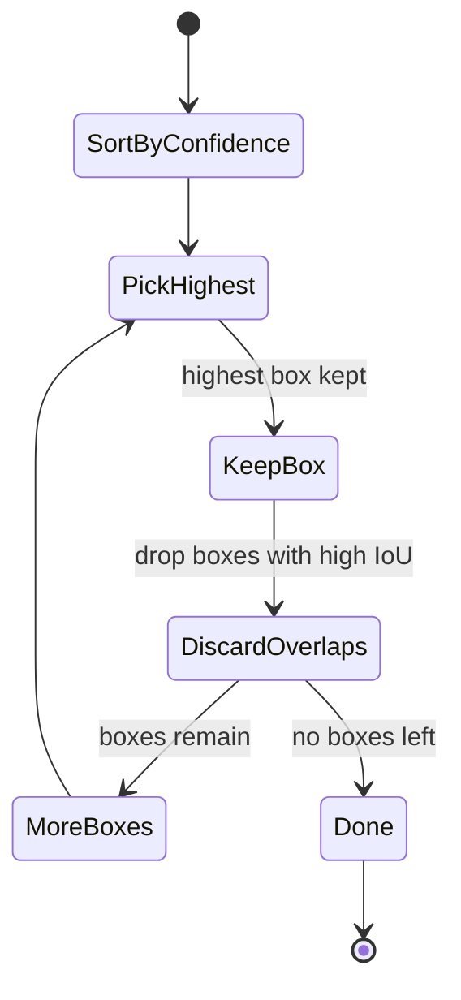

---

## 6. Image Segmentation: Labeling Every Pixel

Segmentation (`04_image_segmentation.ipynb`) is the most spatially precise recognition task: assign a label to *every single pixel*. The output is a **mask** an image-sized map where each pixel's value is its class.

### Three Flavors of Segmentation

- **Semantic segmentation** labels each pixel with its class, but does *not* distinguish individual objects. Three cars side by side become one solid "car" region.
- **Instance segmentation** produces a separate mask for *each* object instance. Those three cars get three distinct masks. (This is detection + per-object mask.)
- **Panoptic segmentation** the unified view: every pixel gets both a semantic class *and*, for countable "thing" objects, an instance identity. "Stuff" like sky or road is labeled semantically; "things" like cars and people are labeled per-instance.

**Figure: Semantic versus instance segmentation outputs**

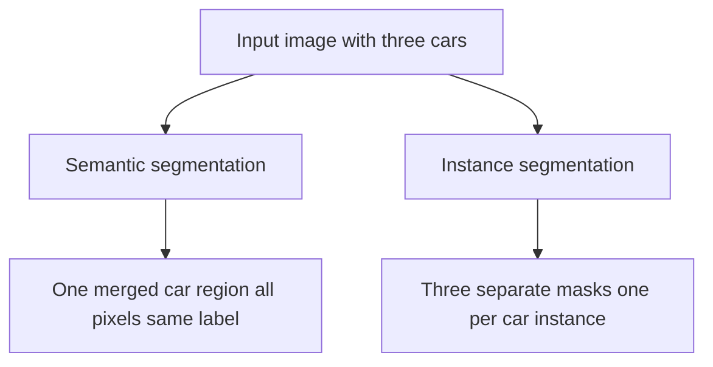

### Measuring Segmentation Quality

- **Pixel accuracy** the fraction of pixels labeled correctly (simple but misleading when one class dominates).
- **mIoU (mean Intersection over Union)** IoU computed per class between predicted and true masks, then averaged. This is the standard benchmark metric.
- **Dice coefficient** closely related; especially favored in medical imaging where the object of interest is small. Its trainable form is **Dice Loss**, and **Tversky Loss** generalizes it to let you weight false positives versus false negatives differently.

### Segmentation Architectures

- **FCN (Fully Convolutional Network, 2015)** the first end-to-end pixel-labeling network; replaced a classifier's final dense layers with convolutions so the output is a full map, and added **skip connections** to recover fine detail.
**Figure: The U-Net encoder-decoder shape with skip connections**

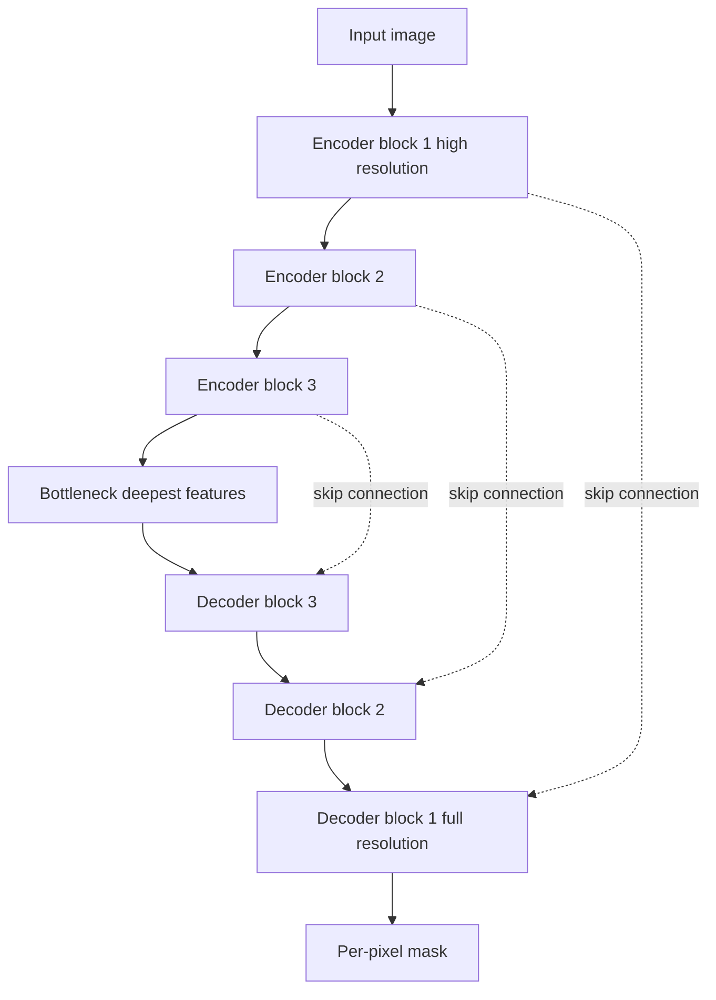

- **U-Net (2015)** the iconic **encoder-decoder** design. The **encoder** progressively shrinks the image while extracting features (the "what"); the **decoder** progressively expands back to full resolution (the "where"); **skip connections** at each level pass fine spatial detail from encoder to decoder so boundaries stay crisp. Originally built for biomedical images, it remains a default everywhere. The notebook builds a full U-Net from scratch.
- **DeepLab family** introduced **atrous (dilated) convolution**: a convolution with gaps in its kernel, so it covers a larger area (a bigger receptive field) without losing resolution or adding parameters. Its **ASPP** module probes multiple scales at once.
- **Mask R-CNN (2017)** the standard for instance segmentation; it extends Faster R-CNN by adding a third output branch that predicts a binary mask for each detected box, using **RoI Align** for pixel-accurate alignment.
- **SegFormer (2021)** a transformer-based segmenter with a lightweight decoder.
- **SAM (Segment Anything Model, 2023) / SAM 2 (2024)** a **foundation model** for segmentation trained on a billion masks. It is **promptable**: you click a point, draw a box, or give a text hint, and it produces the corresponding mask for objects it was never explicitly trained on. SAM 2 extends this to video with a memory mechanism.

---

## 7. Vision Transformers: Attention Instead of Convolution

For two decades, convolution dominated vision. The **transformer** an architecture born in language processing broke that monopoly. `05_vision_transformers.ipynb` covers this shift.

### Why Transformers, and How Patches Work

A CNN has a built-in assumption ("**inductive bias**") that nearby pixels matter most, building understanding up locally. A transformer instead lets *every* part of the image directly interact with *every other* part from the very first layer a **global receptive field**. The cost is that it needs more data to learn the spatial structure a CNN gets for free.

The **Vision Transformer (ViT, 2020)** made this work with one key idea: chop the image into a grid of fixed-size square **patches** (e.g., 16×16 pixels), flatten each patch, and treat the sequence of patches like a sequence of words. A 224×224 image at 16-pixel patches becomes 196 "visual words." Each patch is projected into a vector (a **patch embedding**). Because a transformer has no inherent sense of order, **positional embeddings** learned vectors encoding each patch's location are added so the model knows where each patch sat in the image. A special learnable **CLS token** ("classification token") is prepended to the sequence; after processing, *its* final vector is read out as the whole-image representation for classification.

**Figure: A Vision Transformer from image to class**

```mermaid
flowchart LR
    IMG[Input image 224 x 224] --> PATCH[Split into 16 x 16 patches]
    PATCH --> EMB[Project each patch into a patch embedding]
    EMB --> POS[Add positional embeddings]
    POS --> CLS[Prepend learnable CLS token]
    CLS --> TR[Transformer encoder with self-attention]
    TR --> READ[Read out final CLS token vector]
    READ --> HEAD[Classification head]
    HEAD --> OUT[Predicted class]
```

### Self-Attention: The Engine

**Self-attention** is the mechanism that lets patches communicate. For every patch, the model computes how relevant every *other* patch is to it (the "attention weights"), then builds an updated representation as a relevance-weighted blend of all patches. Concretely, each patch produces a Query, Key, and Value vector; the Query of one patch is compared against the Keys of all patches to get attention weights, which then mix the Values. Doing this with several independent "heads" in parallel (**multi-head attention**) lets the model attend to different kinds of relationships at once. The notebook visualizes a CLS token's attention as a heatmap, revealing which patches the model "looks at" to make its decision.

**Figure: Self-attention with queries keys and values**

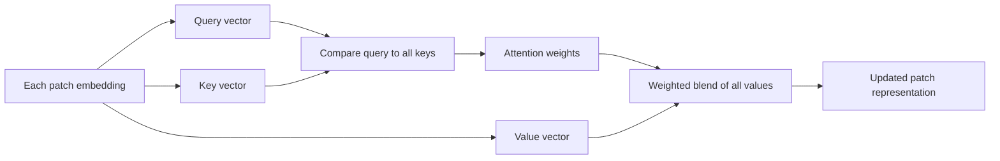

### The Transformer Zoo

- **Swin Transformer (2021)** computes attention within local *windows* that *shift* between layers, regaining CNN-like efficiency and a multi-scale hierarchy ideal for detection and segmentation.
- **DeiT (2021)** trains ViTs data-efficiently using **distillation** (learning from a CNN "teacher") so they no longer need enormous datasets.
- **MAE (Masked Autoencoder, 2021)** **self-supervised** pretraining: hide 75% of the patches and train the model to reconstruct them. Learning to fill in the blanks teaches rich features *with no labels at all*.
- **CLIP (2021)** jointly trains an image encoder and a text encoder on 400 million image-caption pairs using a **contrastive** objective: pull matching image-text pairs together in a shared embedding space, push mismatches apart. The payoff is **zero-shot classification**: to classify an image into novel categories, just compare its embedding to the embeddings of the category *names* no retraining required. The notebook demonstrates exactly this.
- **DINO / DINOv2, BEiT, SigLIP, EVA** further self-supervised and contrastive variants producing universal, general-purpose visual features.

---

## 8. Image Generation: Creating New Images

So far every task *analyzed* an existing image. Generative vision (`06_image_generation.ipynb`) does the opposite: it *creates* new images. Three paradigms dominate.

### GANs: The Adversarial Game

A **Generative Adversarial Network (GAN, 2014)** pits two networks against each other:

- The **Generator** takes random noise and tries to produce a realistic image.
- The **Discriminator** tries to tell real images from the Generator's fakes.

**Figure: The GAN generator and discriminator adversarial game**

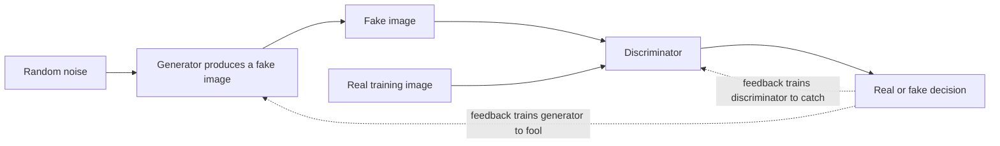

They train in a **minimax game**: the Generator improves at fooling the Discriminator, the Discriminator improves at catching it, and through this arms race the Generator learns to produce convincing images. At equilibrium the fakes are indistinguishable from real. The catch is **training instability** the balance is delicate and easily collapses.

The notebook covers the lineage: **DCGAN** (the standard convolutional recipe, built from scratch here), **WGAN / WGAN-GP** (which replace the loss with the **Wasserstein distance** an "earth-mover's" measure of how far apart two distributions are for far more stable training), **Pix2Pix** and **CycleGAN** (image-to-image translation, with paired and unpaired data respectively, CycleGAN using a "cycle-consistency" trick to translate without matched examples), and the high-fidelity **StyleGAN2** and large-scale **BigGAN / GigaGAN**.

### Diffusion Models: Denoising Step by Step

**Diffusion models** are the technology behind today's best image generators. The idea is beautifully simple:

- **Forward process** take a real image and add a tiny bit of random **noise** repeatedly, over many steps, until it becomes pure static. This is fixed, not learned.
- **Reverse process** train a network to undo *one* step of that noising: given a noisy image, predict the noise that was added. To generate a brand-new image, start from pure random static and apply this learned denoiser step by step until a clean, coherent image emerges.

**Figure: Diffusion forward noising and reverse denoising**

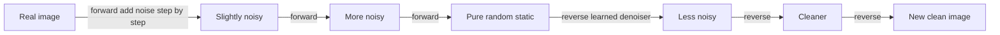

This is **DDPM (Denoising Diffusion Probabilistic Models)**. The notebook builds the forward process and visualizes an image dissolving into noise across timesteps. A **noise schedule** controls how fast noise is added (linear vs. the smoother cosine schedule). **DDIM** is a faster sampling variant that produces good images in ~50 steps instead of 1000.

### Stable Diffusion and Text-to-Image

Running diffusion directly on full-resolution pixels is slow. **Stable Diffusion (Latent Diffusion)** solves this by doing the diffusion in a compressed **latent space**:

1. A **VAE encoder** compresses the image into a small latent code (e.g., 64×64 instead of 512×512).
2. A **text encoder** (from CLIP) turns the user's prompt into embeddings.
3. A **U-Net denoiser** runs the diffusion in latent space, using **cross-attention** to condition every denoising step on the text.
4. A **VAE decoder** expands the final latent back into a full image.

**Figure: Stable Diffusion latent text-to-image pipeline**

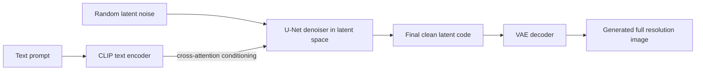

**Classifier-Free Guidance (CFG)** is the dial that controls how strongly the output obeys the prompt: the model predicts denoising both *with* and *without* the text, and amplifies the difference. Higher guidance means more literal adherence to the prompt. The notebook shows usage patterns for Stable Diffusion, the higher-quality **SDXL**, the state-of-the-art **FLUX**, and **ControlNet** (which adds precise spatial control, e.g., generate an image matching a given edge map or human pose).

### Judging Generated Images

- **FID (Fréchet Inception Distance)** compares the statistical distribution of generated images to real ones in a deep feature space; **lower is better**.
- **IS (Inception Score)** rewards images that are both confidently classifiable and diverse; higher is better.
- **CLIP Score** measures how well a generated image matches its text prompt.

---

## 9. OCR, Faces, Pose, and Depth

`07_ocr_and_pose.ipynb` collects several specialized but widely used vision applications.

### OCR (Optical Character Recognition)

**OCR** reads text from images. It is typically a **two-stage pipeline**:

1. **Text detection** find *where* the text is (bounding boxes or polygons around words/lines). Models include EAST, DBNet (using "differentiable binarization" to produce clean character masks), and CRAFT (handles curved text).
**Figure: The two-stage OCR pipeline**

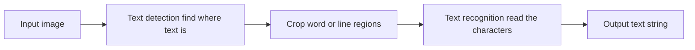

2. **Text recognition** read *what* the located text says. The classic architecture is **CRNN**: a CNN extracts visual features, a bidirectional LSTM (a sequence model) reads them left-to-right and right-to-left, and a **CTC (Connectionist Temporal Classification) decoder** converts the output into characters. CTC's trick is handling *variable-length* text without needing to know in advance where each character sits it sums over all valid alignments. Modern transformer-based approaches like **TrOCR** are also covered. The notebook demonstrates ready-to-use engines **PaddleOCR** and **EasyOCR**.

### Face Detection and Recognition

- **Face detection** finds faces (and often facial landmarks) e.g., **MTCNN** (a cascade of three networks) and **RetinaFace**.
- **Face recognition** decides *who* a face belongs to by mapping it to an **embedding** (a numeric vector) such that the same person's faces land close together and different people land far apart. The key is the loss function: **ArcFace** adds an angular margin that pushes different identities apart in the embedding space; **CosFace** and **Triplet Loss** are alternatives. Verification is then just measuring the distance between two embeddings. The notebook uses the production **InsightFace** library, which outputs 512-dimensional embeddings plus age/gender/landmark predictions.

### Human Pose Estimation

**Pose estimation** locates a person's body **keypoints** the joints (nose, shoulders, elbows, wrists, hips, knees, ankles). The dominant approach is **heatmap-based**: the network outputs one confidence map per keypoint, with a bright Gaussian blob where that joint is most likely. Models include HRNet, ViTPose, RTMPose, and **OpenPose** (which uses "Part Affinity Fields" to connect joints into skeletons for multiple people). The notebook demonstrates **MediaPipe**, which provides real-time pose (33 landmarks), hands (21 landmarks per hand), and face detection. Quality is measured with **OKS (Object Keypoint Similarity)**, the pose analogue of IoU.

**Figure: Pose estimation from image to keypoints to skeleton**

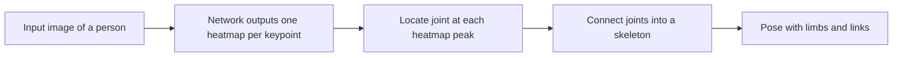

### Monocular Depth Estimation

**Depth estimation** predicts how far each pixel is from the camera. **Monocular** means doing it from a *single* image an inherently ambiguous problem solved by learning from data. Foundation models like **MiDaS**, **DPT**, and **Depth Anything V2** generalize "zero-shot" to images they were never trained on, producing a depth map where brightness encodes distance.

---

## 10. Video Analysis: Adding the Dimension of Time

A video is a sequence of images (**frames**) over time. Video analysis (`08_video_analysis.ipynb`) is about understanding *motion* and *temporal* patterns, not just static appearance.

### Representing Motion

- **Temporal difference** subtracting consecutive frames to highlight what changed (a crude motion detector).
- **Optical flow** a dense map estimating how each pixel *moved* between two frames (its direction and speed). **Lucas-Kanade** gives sparse flow at chosen points; **Farneback** gives dense flow everywhere.

### Spatio-Temporal Models

**Figure: Video analysis frames over time into a temporal model**

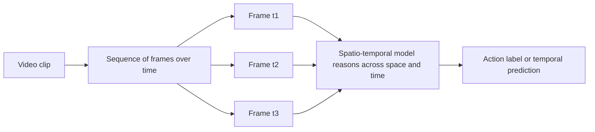

To classify *actions* (running, waving, opening a door) the model must reason across frames:

- **3D CNNs (C3D, I3D)** extend convolution from 2D (height, width) to 3D (height, width, *time*), so a single kernel sweeps across space *and* time. **I3D** cleverly "inflates" a pretrained 2D image network into 3D to reuse its learned features.
- **R(2+1)D** factorizes the expensive 3D convolution into a spatial part plus a temporal part for efficiency.
- **SlowFast (2019)** runs two pathways: a *slow* one at low frame rate to capture *what* is happening (semantics) and a *fast* one at high frame rate to capture *how it moves* (fine motion), fused by lateral connections.
- **TSN, TSM** efficient alternatives. The **Temporal Shift Module (TSM)** is especially elegant: it shifts a fraction of feature channels forward and backward in time before an ordinary 2D convolution, gaining temporal awareness with *zero* extra parameters.
- **Video transformers (TimeSformer, VideoMAE, MViTv2)** apply attention across both space and time, dividing video into 3D "tubelet" patches.

### Object Tracking

**Tracking** maintains a consistent identity for each object *across frames* not just "there's a car" but "this is *the same* car as last frame."

- **SORT (Simple Online Realtime Tracking)** predicts each object's next position with a **Kalman filter** (a classic motion predictor) and matches predictions to new detections with the **Hungarian algorithm** (optimal assignment).
- **DeepSORT** adds an **appearance embedding** so that even if objects cross or briefly vanish, they're re-matched by how they *look*, not just where they are.

**Figure: Object tracking maintaining identity across frames**

```mermaid
flowchart LR
    DET[Detections in new frame] --> PRED[Kalman filter predicts each track next position]
    PRED --> MATCH[Hungarian algorithm matches predictions to detections]
    APP[Appearance embedding] --> MATCH
    MATCH --> UPD[Update tracks with consistent IDs]
    UPD --> OUT[Same object keeps the same ID over time]
```

### Other Video Topics

The notebook also surveys **Video Object Segmentation** (tracking masks through a clip, e.g., SAM 2), **video generation** (Sora, CogVideoX), **video large language models** that answer questions about clips (Qwen2-VL, LLaVA-NeXT-Video), and **anomaly detection** (flagging unusual events by training on normal footage and watching for high reconstruction or prediction error the notebook builds a convolutional autoencoder for this).

---

## 11. 3D Vision: Understanding Space

The world is three-dimensional; images are flat projections of it. 3D vision (`09_3d_vision.ipynb`) recovers and reasons about spatial structure.

### Classical 3D and Point Clouds

**Figure: From images and point clouds to 3D structure and depth**

```mermaid
flowchart LR
    L[Left camera image] --> STEREO[Stereo matching computes disparity]
    R[Right camera image] --> STEREO
    STEREO --> DEPTH[Depth map distance per pixel]
    PC[Point cloud from LiDAR or depth camera] --> PROC[Sampling and voxelization]
    PROC --> NET[Point cloud network]
    NET --> SHAPE[3D shape or per-point labels]
    DEPTH --> SCENE[Reconstructed 3D scene]
    SHAPE --> SCENE
```

- **Stereo matching** uses two cameras a known distance (**baseline**) apart. An object appears shifted between the two views; that shift (**disparity**) is inversely related to depth (`depth = focal × baseline / disparity`), exactly how human binocular vision works.
- **Structure from Motion (SfM)** and **SLAM** reconstruct 3D scenes and camera positions from sequences of images, the latter in real time (used in robotics and AR).
- A **point cloud** is the most direct 3D representation: a set of points, each with an `(x, y, z)` position (and sometimes color), like a sculpture made of dots. They come from LiDAR sensors or depth cameras and are stored in formats like PLY and PCD. Because point clouds are *unordered* and irregular, they need special processing: **Farthest Point Sampling** (pick a spread-out subset), **ball query** (find neighbors within a radius), and **voxelization** (snap points into a regular 3D grid of cubes called **voxels**).

### Deep Learning on Point Clouds

- **PointNet** the breakthrough that processes raw point clouds directly. Its key insight: since points have no inherent order, use a *symmetric* operation (max-pooling) that gives the same answer regardless of point ordering ("permutation invariance"). It learns a global shape descriptor for classification and per-point features for segmentation.
- **PointNet++** and **DGCNN** add *hierarchy* and *local neighborhood* reasoning. DGCNN builds a graph connecting each point to its neighbors and learns from the *relationships* between them.

### Neural Scene Representations

These are the frontier of 3D reconstruction learning to represent a whole 3D scene inside a neural network:

- **NeRF (Neural Radiance Fields)** represents a scene as a continuous function: feed in a 3D location and viewing direction, and a small network outputs the color and density at that point. To render a new viewpoint, the model shoots virtual rays through the scene and integrates color and density along each ray (**volume rendering**). A **positional encoding** (expressing coordinates as sums of sine/cosine waves at many frequencies) lets the network capture fine detail.

**Figure: NeRF mapping location and view direction to color and density**

```mermaid
flowchart LR
    IN[3D location plus viewing direction] --> PE[Positional encoding]
    PE --> NET[Small neural network]
    NET --> COL[Color at that point]
    NET --> DEN[Density at that point]
    COL --> VR[Volume rendering integrates along each ray]
    DEN --> VR
    VR --> VIEW[Rendered novel viewpoint]
``` NeRF produces stunning photo-realistic novel views but is slow; **Instant-NGP** speeds it up roughly 100× with a clever hash encoding.
- **3D Gaussian Splatting (3DGS)** represents a scene *explicitly* as millions of tiny, semi-transparent, colored 3D blobs (Gaussians), each with a position, shape, opacity, and view-dependent color. A fast "splatting" rasterizer projects them onto the screen. 3DGS renders in *real time* hundreds of times faster than NeRF at comparable quality, which is why it has rapidly taken over.
- **Implicit surfaces (SDF, DeepSDF, NeuS)** represent a shape by a **Signed Distance Function**: a function returning the distance to the nearest surface (negative inside the object, positive outside, zero exactly on the surface). The actual surface (a mesh) is extracted afterward with the **Marching Cubes** algorithm.

### 3D Perception for Autonomous Driving

- **BEV (Bird's-Eye-View) perception** transforms images from multiple cameras into a single top-down map of the world around a vehicle, the natural coordinate system for driving. **BEVFormer** uses attention to fuse multiple camera views and time.
- **3D object detection** like 2D detection but with 3D boxes (adding height, depth, and orientation), usually from LiDAR point clouds. **PointPillars** organizes points into vertical columns ("pillars") and runs an efficient 2D network on them; **CenterPoint**, **VoxelNet**, and **DETR3D** are other leading approaches, evaluated on benchmarks like nuScenes and KITTI.

---

## 12. The Big Picture

Computer vision is a tower built from a single brick the pixel and a single core operation convolution (later joined by attention). Everything stacks on what came before:

- **Pixels and color spaces** give us the raw data and ways to represent it.
- **Classical processing** (filters, edges, features) extracts structure without learning, and still powers preprocessing everywhere.
- **CNNs** learn the filters themselves, enabling **classification**.
- **Detection** adds *where* (boxes, anchors, IoU, NMS); **segmentation** adds *exactly which pixels* (masks, encoder-decoders).
- **Transformers** replace local convolution with global attention and unlock vision-language models like CLIP.
- **Generative models** (GANs, diffusion) run the process in reverse to *create* images.
- **OCR, face, pose, and depth** specialize these tools for concrete applications.
- **Video** adds time; **3D vision** adds space.

**Figure: How the whole field stacks from pixels to higher tasks**

```mermaid
flowchart TD
    PX[Pixels and color spaces raw data] --> CP[Classical processing filters edges features]
    CP --> CNN[CNNs learn the filters]
    CNN --> CLS[Classification what is in the image]
    CLS --> DET[Detection where things are]
    CLS --> SEG[Segmentation which pixels]
    CNN --> TR[Transformers global attention and vision language]
    TR --> GEN[Generative models create images]
    DET --> APP[OCR face pose depth applications]
    SEG --> APP
    APP --> VID[Video adds time]
    APP --> D3[3D vision adds space]
```

The unifying thread is representation: each task is really about transforming raw pixels into the *right* internal representation for the question at hand a class score, a box, a mask, an embedding, a denoised latent, or a 3D field. Master that idea, and the whole field becomes one coherent story rather than a list of disconnected techniques.

---

## 10. Medical Image Analysis

Medical imaging presents unique challenges compared to natural image analysis. Images are typically in DICOM format (Digital Imaging and Communications in Medicine), which combines pixel data with rich patient and acquisition metadata. Many tasks involve 3D volumetric data (CT scans, MRI) rather than 2D images, and class imbalance is extreme (a tumor occupies a small fraction of voxels).

MONAI (Medical Open Network for AI) is the standard library for medical imaging AI. It extends PyTorch with medical-specific transforms (elastic deformation, intensity normalization), datasets, and pre-trained models. Key differences: DiceLoss replaces cross-entropy for segmentation (handles class imbalance better), Hausdorff distance supplements pixel accuracy as a spatial metric, and models must meet regulatory standards before clinical deployment (FDA 510(k) pathway in the US).
