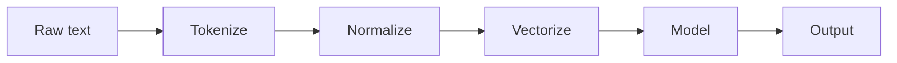
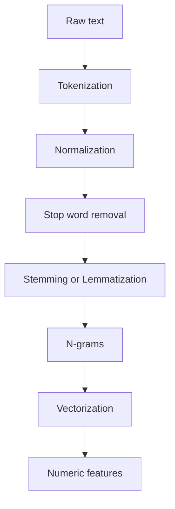
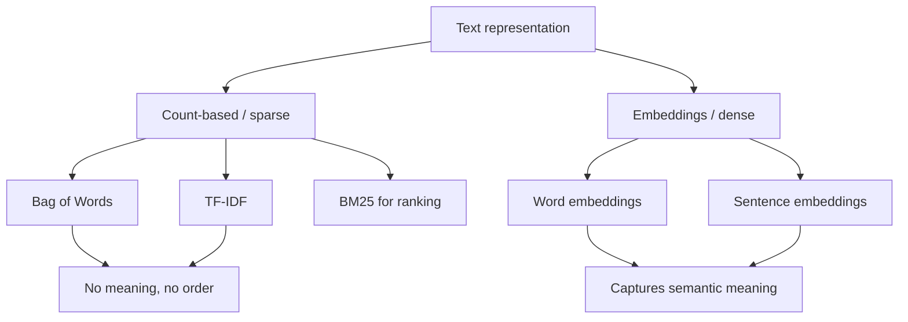
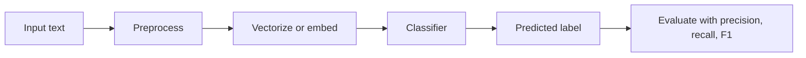
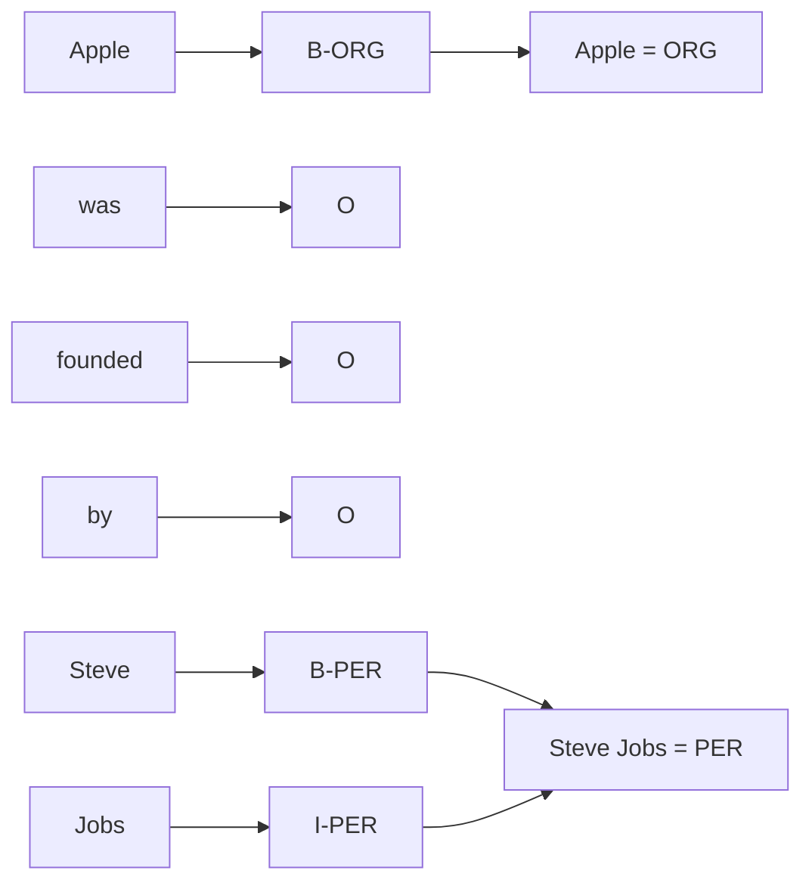
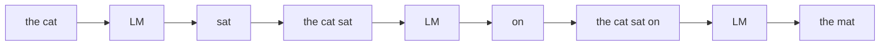
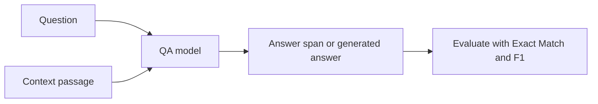
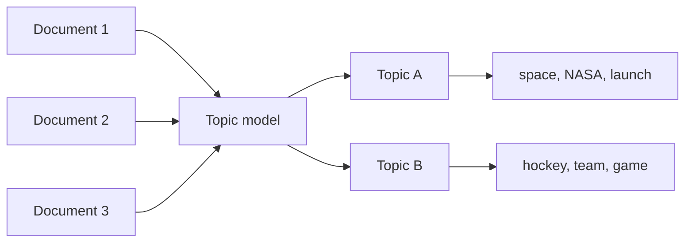
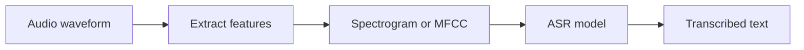
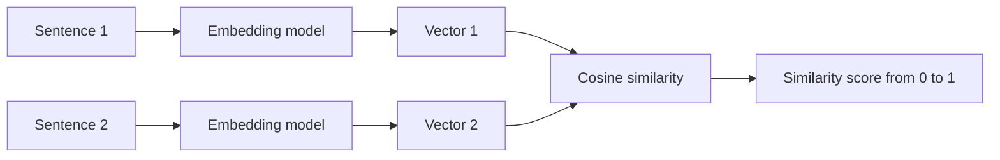

# Natural Language Processing: A Complete Conceptual Guide

Human language is messy. It is ambiguous, irregular, full of idioms, sarcasm, and context that lives outside the words themselves. Yet most of the world's knowledge books, emails, web pages, conversations, legal contracts, medical notes is stored as text and speech. **Natural Language Processing (NLP)** is the field of building computer systems that can read, understand, generate, and act on human language.

This guide builds NLP from absolute scratch. We start with the most basic question how do you even turn a sentence into something a computer can do arithmetic on? and end with systems that answer questions, transcribe speech, extract structured facts from documents, and measure the meaning of a sentence as a point in space. Every term is defined the first time it appears. The ten notebooks in this folder each take one slice of the field; this document ties them into a single story.

---

## 1. What NLP Is, and Why It Is Hard

A computer natively understands numbers, not words. The central challenge of NLP is **representation**: how do you convert language which is symbolic, sequential, and context-dependent into numbers that preserve its meaning, so that a machine learning model can operate on it?

Some vocabulary we will use constantly:

- **Token**: the smallest unit of text a system processes. Usually a word, but it can be a punctuation mark, a part of a word ("un", "##ing"), or even a single character. Splitting text into tokens is called **tokenization**.
- **Corpus** (plural *corpora*): a collection of text documents used as data. "The corpus of movie reviews" simply means "the dataset of movie reviews."
- **Document**: one unit of text in a corpus a single review, email, sentence, or article, depending on the task.
- **Vocabulary**: the set of all distinct tokens a system knows about.
- **Vector / embedding**: a list of numbers representing a piece of text. Turning text into vectors is the bridge that lets math operate on language.

Why is language hard? A few reasons recur throughout this guide: words have multiple meanings (*bank* of a river vs. a *bank* that holds money **polysemy**); meaning depends on order (*"dog bites man"* vs *"man bites dog"*); the same idea can be phrased countless ways (**paraphrase**); and meaning often depends on context far away in the text or on world knowledge not stated at all.

The field has evolved through three broad eras, and this guide follows that arc: **classical / statistical** methods (counting words), **neural embeddings** (learning dense numeric meaning), and **transformer-based** models (deep networks that read context). Each notebook deliberately shows the same progression classical, then neural, then transformer so you can see what each era buys you.

*Diagram: the end-to-end NLP pipeline that turns raw text into a usable output.*



---

## 2. Text Preprocessing: Turning Raw Text into Clean Units

*(Notebook: `01_text_preprocessing.ipynb`)*

Before any model sees text, the text must be cleaned and chopped into units. This is **preprocessing**, and it is the unglamorous but essential foundation of everything else.

*Diagram: the preprocessing steps that transform raw text into clean numeric features.*



### 2.1 Tokenization

**Tokenization** is splitting a stream of characters into tokens. There are three granularities:

- **Word tokenization**: split on words. "I love NLP!" becomes `["I", "love", "NLP", "!"]`. Simple splitting on spaces fails on punctuation and contractions, so dedicated tokenizers are used. In `01_text_preprocessing.ipynb`, the NLTK functions `word_tokenize` and `sent_tokenize` (for splitting into *sentences*) are demonstrated, along with a `RegexpTokenizer` that keeps only word characters and a `TweetTokenizer` built for social-media text.
- **Sentence tokenization**: split a document into sentences. Harder than it sounds a period also ends abbreviations ("Dr.", "U.K.").
- **Subword tokenization**: split words into smaller reusable pieces. This is what modern transformer models use, because it solves the **out-of-vocabulary (OOV)** problem the situation where a model meets a word it never saw in training. If "playing" is unknown but "play" and "##ing" are known, a subword tokenizer can still represent it. The notebook introduces the main algorithms:
  - **Byte Pair Encoding (BPE)**: starts from characters and repeatedly merges the most frequent adjacent pair into a new token. Used by GPT-2 (vocabulary ~50,257).
  - **WordPiece**: similar to BPE but merges based on which pair most increases the likelihood of the training data. Used by BERT (vocabulary ~30,522); continuation pieces are marked with `##`.
  - **SentencePiece** and **Unigram**: treat the input as a raw character stream (no pre-splitting on spaces) and learn a vocabulary that can tokenize any language.

The notebook shows this concretely by loading Hugging Face's `AutoTokenizer` for `bert-base-uncased` and `gpt2` and comparing how each carves up the same sentence.

### 2.2 Text Normalization

**Normalization** reduces meaningless variation so that words that should be treated the same actually are. Techniques shown in the notebook's `clean_text()` function:

- **Lowercasing**: "Apple" and "apple" become the same token (though this can erase the company-vs-fruit distinction a tradeoff).
- **Punctuation removal**: strip commas, periods, etc.
- **Stop word removal**: **stop words** are extremely common words ("the", "is", "and") that carry little topical meaning. Removing them shrinks the data and focuses on content words. The notebook uses NLTK's `stopwords` list.
- **Contraction expansion**: "don't" → "do not".
- **Unicode and HTML cleaning**: removing tags like `<p>`, URLs, and odd characters, typically with regular expressions.

### 2.3 Stemming vs. Lemmatization

Both reduce a word to a base form so that "running", "ran", and "runs" can be grouped. They differ in how:

- **Stemming** chops off endings using crude rules, producing a **stem** that may not be a real word. "Studies" → "studi". The notebook compares three stemmers: **Porter** (a classic 5-phase algorithm), **Snowball** (also called Porter2, an improved Porter), and **Lancaster** (the most aggressive). It tabulates how each one mangles the same test words.
- **Lemmatization** uses a dictionary and grammar to find the **lemma** the proper dictionary base form. "Studies" → "study", "better" → "good". This is slower but linguistically correct. The notebook uses NLTK's `WordNetLemmatizer` together with **part-of-speech (POS) tagging** labeling each word as noun, verb, adjective, etc. because the correct lemma of "saw" depends on whether it is a verb (lemma "see") or a noun (lemma "saw").

| | Stemming | Lemmatization |
|---|---|---|
| Method | Rule-based chopping | Dictionary + grammar lookup |
| Output | A stem (may not be a real word) | A valid dictionary word |
| Speed | Fast | Slower |
| Accuracy | Cruder | Precise |
| Needs POS? | No | Yes, for best results |

### 2.4 N-grams

An **n-gram** is a contiguous sequence of *n* tokens. A **unigram** is one token, a **bigram** two ("machine learning"), a **trigram** three. N-grams capture local word order and common phrases that single words miss. The notebook generates n-grams with `nltk.util.ngrams` and finds statistically meaningful word pairs (**collocations**) using **Pointwise Mutual Information (PMI)** a measure of how much more often two words appear together than chance would predict.

### 2.5 Vectorization: From Tokens to Numbers

Now the payoff converting cleaned tokens into vectors. Three classical schemes:

- **Bag of Words (BoW)**: represent a document as a vector of word counts, ignoring order entirely (hence "bag"). Each position in the vector corresponds to a vocabulary word; the value is how many times it appears. Demonstrated with scikit-learn's `CountVectorizer`.
- **TF-IDF (Term Frequency-Inverse Document Frequency)**: an improvement on raw counts. **Term Frequency (TF)** is how often a word appears in a document. **Inverse Document Frequency (IDF)** down-weights words that appear in *many* documents (like "the"), because ubiquitous words are not distinctive. Multiplying TF × IDF gives each word a score that is high when it is frequent *in this document but rare across the corpus*. Demonstrated with scikit-learn's `TfidfVectorizer`, and also implemented from scratch (`compute_tf`, `compute_idf`, `compute_tfidf`) so the formula is transparent.
- **BM25 (Best Matching 25)**: the refined gold standard for keyword search and **information retrieval (IR)** finding relevant documents for a query. It extends TF-IDF with two tunable knobs: `k1` (controls how quickly extra occurrences of a word stop adding value) and `b` (controls how much to penalize long documents). The notebook uses the `rank_bm25` library to rank documents against a query.

| Method | What it captures | Captures word order? | Captures meaning? | Vector type |
|---|---|---|---|---|
| Bag of Words | Word presence/counts | No | No | Sparse, high-dimensional |
| TF-IDF | Distinctive words | No | No | Sparse, high-dimensional |
| BM25 | Distinctive words + length normalization | No | No | Used for ranking, not as features |
| Word embeddings (Section 3) | Semantic meaning | Limited | **Yes** | Dense, low-dimensional |

*Diagram: a taxonomy of text representation methods, from sparse counts to dense embeddings.*



The key limitation of all count-based methods: "happy" and "joyful" are completely unrelated vectors, because they are different words. Capturing that they *mean* similar things requires embeddings.

### 2.6 Industrial Pipelines: spaCy

The notebook closes by introducing **spaCy**, a production NLP library that runs many of these steps as one **pipeline**: tokenizer → tagger (POS) → parser (grammatical structure) → lemmatizer → NER (Section 5). Loading `en_core_web_sm` and processing text yields, for each token, its lemma, POS tag, syntactic role, and stop-word flag, plus detected entities and **noun chunks** (base noun phrases).

---

## 3. Word Embeddings: Giving Words Meaning as Geometry

*(Notebook: `02_word_embeddings.ipynb`)*

Count-based vectors are **sparse** (mostly zeros) and treat each word as an isolated symbol. **Word embeddings** replace this with **dense vectors** short lists of real numbers (e.g. 50 or 300 values) where each word is a *point in space*, and words with similar meanings sit close together.

The idea rests on the **distributional hypothesis** (Firth, 1957): *"You shall know a word by the company it keeps."* Words that appear in similar contexts ("coffee" and "tea" both follow "drink a cup of") have similar meanings. Embeddings learn this automatically. The famous demonstration, shown in the notebook, is **vector arithmetic**: `king − man + woman ≈ queen`. The geometry of the space encodes relationships like gender and royalty.

*Diagram: words become points in a vector space where similar meanings cluster and relationships become directions.*

```mermaid
flowchart LR
    subgraph Space[Vector space]
        K[king]
        Q[queen]
        M[man]
        W[woman]
        C[coffee]
        T[tea]
    end
    K, king minus man plus woman --> Q
    M -. gender direction .-> W
    C, close, similar meaning --> T
```

### 3.1 Word2Vec

**Word2Vec** (Mikolov, 2013) learns embeddings by training a small neural network on a prediction task. It comes in two flavors:

- **CBOW (Continuous Bag of Words)**: predict a target word from its surrounding context words. Fast, good for frequent words.
- **Skip-gram**: predict the surrounding context words from a target word. Slower, better for rare words.

A trick called **negative sampling** makes training efficient: instead of updating the entire vocabulary for every example, the model only contrasts the true context word against a few randomly drawn "negative" words. The notebook trains both CBOW and Skip-gram models on a toy corpus using gensim's `Word2Vec`, then uses `.wv.most_similar` and a from-scratch **cosine similarity** function to inspect the result.

> **Cosine similarity** measures the angle between two vectors, ignoring their length. A value near 1 means "very similar direction" (similar meaning); near 0 means "unrelated." It is the workhorse metric for comparing embeddings. In `02_word_embeddings.ipynb`, the cell computing cosine similarity between word pairs shows how the geometry captures meaning.

### 3.2 GloVe

**GloVe (Global Vectors)** (Pennington, 2014) takes a different route. Instead of sliding a window and predicting, it builds a global **co-occurrence matrix** counting how often every pair of words appears together across the whole corpus and factorizes it so that the dot product of two word vectors approximates the (log) number of times they co-occur. Word2Vec is "predictive"; GloVe is "count-based" but produces similarly powerful embeddings.

### 3.3 FastText

**FastText** (Bojanowski, 2017) fixes a weakness of both: they can only embed words they saw in training. FastText represents each word as a **bag of character n-grams** (e.g. "where" → "wh", "whe", "her", "ere", "re"). Because it learns embeddings for subword pieces, it can build a vector for an *unseen* word by summing its pieces solving the OOV problem for word embeddings. The notebook demonstrates this by generating vectors for invented words like "kingdoms" and "queenly".

### 3.4 The Limitation: Static vs. Contextual

Word2Vec, GloVe, and FastText are **static embeddings**: each word gets exactly one vector, no matter the sentence. So "bank" has a single vector that blends the river and money senses it cannot tell them apart.

**Contextual embeddings** fix this by computing a *different* vector for a word depending on its sentence. **ELMo** (Peters, 2018) pioneered this using a bidirectional LSTM language model; BERT (Section 4) took it mainstream with transformers. The notebook also previews **sentence embeddings** (covered fully in Section 11) using a `SentenceTransformer` model to embed and compare whole sentences.

### 3.5 Evaluating and Visualizing Embeddings

How do you know embeddings are good? Two intrinsic tests: **word analogy** (does `king − man + woman` land near `queen`?) and **word similarity** (do model scores match human judgments on benchmark datasets like WordSim-353 and SimLex-999?). To *see* the space, the notebook uses **t-SNE** a technique that projects high-dimensional vectors down to 2D for plotting revealing clusters of related words (royals together, animals together, capitals together).

---

## 4. Text Classification: Assigning Labels to Text

*(Notebook: `03_text_classification.ipynb`)*

**Text classification** assigns a predefined label to a piece of text: spam vs. not-spam, positive vs. negative sentiment, news topic. It is the most common NLP task in industry, and the notebook walks the full ladder from classical to transformer.

*Diagram: the text-classification flow from input text to a predicted label.*



### 4.1 Classical Methods

Combine a vectorizer (Section 2.5) with a classical machine-learning classifier. The notebook builds scikit-learn `Pipeline`s pairing `TfidfVectorizer` with:

- **Logistic Regression**: a linear model that outputs a probability for each class.
- **Linear SVM (Support Vector Machine)**: finds the boundary that best separates classes.
- **Naive Bayes** (`MultinomialNB`): applies Bayes' theorem assuming words are independent crude but surprisingly effective and very fast.

These are strong, cheap baselines. (On the notebook's deliberately tiny toy dataset they score poorly, illustrating that classical methods need adequate data.)

### 4.2 Deep Learning Methods

Two neural architectures predate transformers but still appear:

- **TextCNN** (Kim, 2014): applies **convolutional filters** small sliding windows over the sequence of word embeddings to detect informative phrase patterns, then uses **max-over-time pooling** to keep the strongest signal. The notebook implements a `TextCNN` in PyTorch with multiple filter sizes (2, 3, 4, 5 words wide).
- **BiLSTM with Attention**: a **bidirectional LSTM** reads the sentence forward and backward to build context-aware representations; an **attention** mechanism then learns which words matter most for the decision.

### 4.3 Transformer Classification: BERT

**BERT (Bidirectional Encoder Representations from Transformers)** is a deep network pre-trained on huge text, then fine-tuned for a specific task. For classification, the input gets a special `[CLS]` token at the front; BERT's output vector for that token summarizes the whole sentence and is fed to a small classifier. The notebook loads `distilbert-base-uncased` (a smaller, faster BERT) via `AutoModelForSequenceClassification` and shows the fine-tuning setup with the Hugging Face `Trainer`.

### 4.4 Learning Without Much Labeled Data

Labeling data is expensive. Two modern shortcuts:

- **Zero-shot classification**: classify into labels the model was *never trained on*, by reframing classification as **Natural Language Inference (NLI)** does the text *entail* the hypothesis "This text is about sports"? The notebook uses `facebook/bart-large-mnli` to sort sentences into politics/sports/technology with no task-specific training.
- **Few-shot learning with SetFit**: fine-tune a sentence-embedding model on just a handful of labeled examples using **contrastive learning** (teaching the model to pull same-class examples together and push different ones apart).
- **Data augmentation**: synthetically grow a small dataset. The notebook implements **EDA (Easy Data Augmentation)** synonym replacement, random insertion, swap, and deletion plus mentions **back-translation** (translate to another language and back to get a paraphrase).

### 4.5 Evaluation Metrics

A classifier's accuracy can mislead on imbalanced data. The standard metrics:

- **Precision**: of the items the model labeled positive, what fraction truly were? (Penalizes false alarms.)
- **Recall**: of the items that truly were positive, what fraction did the model catch? (Penalizes misses.)
- **F1 score**: the harmonic mean of precision and recall a single balanced number.

For multiple classes these are averaged as **macro** (treat every class equally), **micro** (treat every example equally), or **weighted** (weight by class size). The notebook prints a `classification_report` and visualizes a **confusion matrix** (a grid showing which classes get mistaken for which).

---

## 5. Named Entity Recognition: Finding the Things in Text

*(Notebook: `04_named_entity_recognition.ipynb`)*

**Named Entity Recognition (NER)** locates and classifies real-world **entities** mentioned in text people, organizations, locations, dates, amounts of money. In "Apple was founded by Steve Jobs in California," NER tags *Apple* as an organization (**ORG**), *Steve Jobs* as a person (**PER**), and *California* as a location (**LOC**). The notebook defines the standard types: PER, ORG, LOC, DATE, MONEY, MISC.

*Diagram: NER labels each token, then groups tagged tokens into entity spans.*



### 5.1 Tagging Schemes

NER is framed as labeling every token. To mark multi-word entities, special schemes are used:

- **IOB (Inside-Outside-Beginning)**: `B-PER` marks the first token of a person, `I-PER` a continuation, `O` a non-entity. "Barack/B-PER Obama/I-PER visited/O" captures the two-word name.
- **BIOES**: adds `E` (end) and `S` (single-token entity) for finer boundaries.

The notebook includes an `iob_to_entities()` function that converts these tag sequences back into entity spans.

### 5.2 From Classical to Neural to Transformer

- **CRF (Conditional Random Field)**: a classical model that labels the whole sequence at once, learning that certain tag transitions are likely (an `I-PER` should follow a `B-PER`, not appear out of nowhere). This dependency-aware labeling is why CRFs beat labeling each word independently.
- **BiLSTM-CRF**: feeds word embeddings through a bidirectional LSTM (for context) and a CRF layer on top (for valid tag sequences) the dominant neural NER architecture before transformers.
- **BERT-based NER**: fine-tune BERT to classify each token. A subtlety is **subword alignment**: BERT splits words into subwords, so the entity label must be mapped back to whole words. The notebook runs a Hugging Face pipeline with `dbmdz/bert-large-cased-finetuned-conll03-english` (trained on the **CoNLL-2003** benchmark).

The notebook also shows spaCy's built-in NER and how to **train a custom spaCy NER model** from your own annotated examples (using character-offset annotations and `DocBin`) and candidly illustrates a common pitfall where mis-computed character offsets corrupt the labels.

### 5.3 Relation Extraction

NER finds entities; **relation extraction** finds how they relate. From "Elon Musk founded Tesla" we want the structured triple `(Elon Musk, FOUNDED, Tesla)`. The notebook does this with a rule-based method that walks spaCy's **dependency parse** (Section 12) to find subject-verb-object patterns. Approaches range from rule-based to supervised to LLM-based.

---

## 6. Language Models and Text Generation

*(Notebook: `05_language_models_and_generation.ipynb`)*

A **language model (LM)** assigns probabilities to sequences of words it knows that "the cat sat on the mat" is more likely than "mat the on sat cat the." This single capability underlies text generation, translation, summarization, and modern chatbots.

*Diagram: an autoregressive language model generating one token at a time, feeding each output back as input.*



### 6.1 N-gram Language Models

The classical LM. It makes the **Markov assumption**: the probability of the next word depends only on the previous *n−1* words, not the entire history. A **bigram model** predicts each word from just the one before it. The notebook implements an `NgramLM` class from scratch.

Two key concepts:

- **Perplexity**: the standard metric for an LM. Intuitively, it is how "surprised" the model is by real text *lower is better*. A perplexity of 10 means the model is, on average, as uncertain as if choosing among 10 equally likely words.
- **Smoothing**: an n-gram model assigns probability zero to any word combination it never saw, which is fatal. Smoothing reserves a little probability for unseen combinations. The notebook covers **Laplace (Add-1)**, **Add-k**, and the more sophisticated **Kneser-Ney** smoothing.

### 6.2 Decoding Strategies: How Text Gets Generated

Given an LM's probability for the next word, *how do you choose* the actual word? This choice **decoding** shapes whether output is boring or creative. The notebook implements each from scratch and also demonstrates them on GPT-2:

- **Greedy decoding**: always pick the single most probable word. Safe but repetitive.
- **Beam search**: keep the *k* most probable partial sequences at each step rather than committing to one. Better for translation; can still be bland.
- **Temperature sampling**: sample randomly from the distribution, with a **temperature** knob low temperature makes the model conservative, high temperature makes it wild and creative.
- **Top-k sampling**: sample only from the *k* most likely words, discarding the long tail of nonsense.
- **Top-p (nucleus) sampling**: sample from the smallest set of words whose probabilities sum to *p* (e.g. 0.9) adapting the candidate pool to how confident the model is.

### 6.3 Evaluating Generated Text

Comparing generated text to a reference is hard because many phrasings are valid. Common metrics:

- **BLEU**: measures n-gram overlap with reference text, with a **brevity penalty** for too-short output. Standard for machine translation.
- **ROUGE**: overlap-based, recall-oriented; standard for summarization. The notebook uses the `rouge_score` library for ROUGE-1, ROUGE-2, and ROUGE-L.
- **BERTScore**: compares the *embeddings* of words rather than exact matches, so it credits synonyms a more semantic metric. (METEOR, CIDEr, SPICE are also mentioned.)

### 6.4 Summarization and Translation

- **Summarization** comes in two kinds: **extractive** (select the most important existing sentences, e.g. via the TextRank graph algorithm) and **abstractive** (generate new sentences, as humans do, using models like **BART**, **T5**, or **Pegasus**). The notebook demonstrates `facebook/bart-large-cnn`.
- **Machine translation** evolved from **sequence-to-sequence (seq2seq)** models an encoder reads the source sentence into a vector, a decoder writes the target augmented with **attention** (letting the decoder look back at relevant source words), and finally the **Transformer**, which is built entirely on attention. A training trick called **teacher forcing** feeds the correct previous word during training to stabilize learning.

---

## 7. Question Answering

*(Notebook: `06_question_answering.ipynb`)*

**Question Answering (QA)** systems take a question (and sometimes a context passage) and return an answer. The notebook taxonomizes five types: **extractive**, **generative**, **open-domain**, **visual**, and **knowledge-intensive** QA.

*Diagram: a question plus a context passage flow through a QA model to produce an answer.*



### 7.1 Extractive QA

The answer is a **span** a contiguous slice copied directly from a provided context. This is the **SQuAD** format (named after the Stanford Question Answering Dataset). A BERT-style model reads `[CLS] Question [SEP] Context [SEP]` and uses two output heads to predict the **start position** and **end position** of the answer span within the context. The notebook demonstrates a pipeline with `deepset/roberta-base-squad2` and shows the SQuAD fine-tuning setup, including how long contexts are split into overlapping windows (a `stride`) so the answer is never cut off.

### 7.2 Generative and Open-Domain QA

- **Generative QA** *writes* an answer rather than copying one, using a text-to-text model like **Flan-T5** (the notebook uses `google/flan-t5-small`). This handles questions whose answers are not literally present in any passage.
- **Open-domain QA** has no provided context the system must first *find* relevant passages from a large corpus, then answer. This is **retrieval-augmented** QA. The notebook explains **DPR (Dense Passage Retrieval)**: a dual-encoder that embeds the question and every passage into the same space, retrieving passages by embedding similarity, then a **reader** model extracts the answer. This retrieve-then-read pattern is the foundation of **RAG (Retrieval-Augmented Generation)**, the dominant architecture for grounding LLMs in external knowledge.

### 7.3 Evaluating QA

Two metrics, both implemented from scratch in the notebook after **normalizing** answers (lowercasing, removing articles and punctuation so "the Eiffel Tower" matches "Eiffel tower"):

- **Exact Match (EM)**: did the predicted answer exactly equal the reference? Strict all or nothing.
- **F1 score**: token-level overlap between prediction and reference, giving partial credit for partially-correct answers.

---

## 8. Topic Modeling: Discovering Themes Without Labels

*(Notebook: `07_topic_modeling.ipynb`)*

**Topic modeling** is **unsupervised** it finds hidden thematic structure in a corpus *without any labels*. Given thousands of news articles, it discovers that some cluster around "space/NASA/launch" and others around "hockey/team/game," and assigns each document a mixture of these topics. The notebook works on a subset of the **20 Newsgroups** dataset.

*Diagram: topic modeling maps a corpus of documents to latent topics, each described by characteristic words.*



- **LDA (Latent Dirichlet Allocation)** (Blei, 2003): the classic method. It models each document as a *mixture of topics*, and each topic as a *distribution over words*. "Latent" means hidden; the **Dirichlet** is a probability distribution used as a prior over these mixtures. LDA reverse-engineers, from the observed words, what topics most likely generated them. The notebook fits scikit-learn's `LatentDirichletAllocation` and reports **perplexity**.
- **NMF (Non-negative Matrix Factorization)**: factorizes the document-term matrix into two non-negative matrices whose product approximates the original. The non-negativity constraint makes the resulting topics interpretable. Uses scikit-learn's `NMF` on TF-IDF features.
- **LSA / LSI (Latent Semantic Analysis/Indexing)**: applies **SVD (Singular Value Decomposition)** a matrix-factorization technique to the TF-IDF matrix and keeps the top components, capturing the main axes of meaning. Uses `TruncatedSVD`.
- **BERTopic** (Grootendorst, 2022): the modern approach. It **embeds** documents with sentence transformers, **reduces** dimensions with UMAP, **clusters** with HDBSCAN, and labels each cluster using **c-TF-IDF** (a class-based TF-IDF that finds the words distinctive to each cluster). Far better at coherent, readable topics than classical LDA.

**Evaluation** uses **topic coherence** (do a topic's top words actually go together the notebook computes the CV coherence score via gensim's `CoherenceModel`), **perplexity**, and **topic diversity** (are the topics distinct from each other?).

---

## 9. Speech and Audio Processing

*(Notebook: `08_speech_and_audio.ipynb`)*

Language is not only written. **Speech processing** handles the audio side: transcribing speech to text, synthesizing speech from text, and analyzing sound. Audio is fundamentally a **1D time-series** air-pressure values sampled many thousands of times per second. Key terms: **sample rate** (samples per second, e.g. 22,050 Hz), **bit depth** (precision per sample), and **channels** (mono vs stereo).

### 9.1 From Waveform to Features

*Diagram: the speech pipeline turning an audio waveform into text.*



Raw waveforms are unwieldy; models work on **frequency representations**:

- **Spectrogram**: shows how the energy at each frequency changes over time, computed via the **STFT (Short-Time Fourier Transform)** sliding a window across the signal and doing a Fourier transform in each. The notebook generates a synthetic chord and visualizes its spectrogram with `librosa`.
- **Mel spectrogram**: a spectrogram warped onto the **Mel scale**, which spaces frequencies the way human hearing does (we discriminate low frequencies far more finely than high ones).
- **MFCC (Mel-Frequency Cepstral Coefficients)**: a compact set of features derived from the Mel spectrogram (log, then a **DCT** to decorrelate). For decades MFCCs were *the* feature for speech recognition. The notebook computes 13 MFCCs plus their **deltas** (rates of change) for a 39-dimensional feature vector.

### 9.2 Automatic Speech Recognition (ASR)

**ASR** converts speech to text. Two ideas dominate:

- **CTC (Connectionist Temporal Classification)**: solves the alignment problem speech and text are different lengths and you do not know which audio frame maps to which letter. CTC lets the model output a character (or a special "blank") at every frame and then collapses repeats and blanks to get the final text, with no manual alignment needed.
- **Whisper** (OpenAI, 2022): an encoder-decoder Transformer trained on 680,000 hours of audio. The encoder reads a log-Mel spectrogram; the decoder generates text, with special tokens controlling language, transcription-vs-translation, and timestamps. The notebook shows using `openai/whisper-base` for transcription and fine-tuning `openai/whisper-small` on a low-resource language via Common Voice.

### 9.3 Text-to-Speech and Classification

- **Text-to-Speech (TTS)** generates audio from text. The notebook surveys **Tacotron 2** (text → mel spectrogram → a **vocoder** like WaveNet converts the spectrogram to a waveform), **VITS** (an end-to-end model combining a VAE and a GAN), and **XTTS** (zero-shot **voice cloning** from a few seconds of reference audio). It demonstrates `microsoft/speecht5_tts` and `edge-tts`.
- **Audio classification** (e.g. detecting sounds or emotions) turns audio into Mel/MFCC features and feeds them to a CNN or to the **Audio Spectrogram Transformer** (`MIT/ast-finetuned-audioset...`), or fine-tunes self-supervised models like **Wav2Vec 2.0** and **HuBERT**.
- **Speaker diarization** answers "who spoke when" segmenting audio by speaker using voice-print embeddings (x-vectors, ECAPA-TDNN) and clustering.

---

## 10. Sentence Embeddings and Semantic Similarity

*(Notebook: `09_sentence_embeddings_advanced.ipynb`)*

Word embeddings (Section 3) give meaning to words. **Sentence embeddings** give a single vector to an *entire sentence or paragraph*, so you can measure how similar two pieces of text are *in meaning* even if they share no words. This powers **semantic search**, **deduplication**, **clustering**, and **RAG** retrieval.

A naive approach averaging the word vectors loses word order and context. Dedicated sentence-embedding models do far better.

*Diagram: two sentences are each embedded into a vector, then compared by cosine similarity.*



### 10.1 Sentence-BERT (SBERT)

**SBERT** (Reimers & Gurevych, 2019) is the breakthrough. Comparing all pairs of sentences with a full BERT model is computationally explosive (comparing 10,000 sentences means ~50 million BERT runs). SBERT uses a **Siamese architecture** two copies of BERT with *shared weights* to encode each sentence *once* into a fixed vector, after which comparison is a cheap cosine similarity. A **pooling** step (averaging BERT's token outputs "mean pooling" works best) collapses the sentence to one vector. The notebook builds a `SiameseBERT` from scratch and implements its training objectives:

- **Triplet loss**: pull an anchor and a similar sentence together while pushing a dissimilar one away.
- **Contrastive loss** (SimCSE-style): in a batch, treat each sentence's match as positive and all others as negatives.

### 10.2 The Modern Embedding Landscape

The notebook catalogs the rapidly-evolving field of embedding models, comparing dimensions, parameters, and context length:

- **Early models**: **InferSent** (BiLSTM on NLI), **Universal Sentence Encoder**, **LASER** and **LaBSE** (multilingual, 90+ languages).
- **Modern models**: the **E5** family (which uses `query:` / `passage:` prefixes), **BGE** (including `bge-m3` with combined dense + sparse + multi-vector retrieval), **GTE**, and **Jina v3** (8,192-token context). The recurring workhorse across this folder is `all-MiniLM-L6-v2` small, fast, 384-dimensional.
- **Instruction-tuned models** like **Instructor** ("one embedder, any task") take a natural-language instruction describing the task, producing task-specialized embeddings.

### 10.3 Efficiency: Matryoshka and Quantization

Storing and searching millions of embeddings is expensive. Two techniques shrink them:

- **Matryoshka Representation Learning (MRL)**: trains embeddings so that the *first* N dimensions are themselves a usable shorter embedding (like nested Russian dolls). You can truncate a 768-dim vector to 64 dims and still search well trading a little accuracy for big storage and speed savings.
- **Quantization**: store each number with fewer bits. **Scalar quantization** to int8 gives 4× compression; **binary quantization** (keep only the sign of each value, compared with fast **Hamming distance**) gives 32× compression. The notebook implements both and measures the accuracy tradeoff.

### 10.4 Benchmarking and Applications

**MTEB (Massive Text Embedding Benchmark)** is the standard scorecard 8 task categories (retrieval, semantic textual similarity, clustering, classification, reranking, and more) across 56 datasets used to rank models on a public leaderboard. The notebook closes with the three flagship applications, all executed end-to-end:

- **Semantic search**: embed a query and a document corpus, rank documents by cosine similarity.
- **Duplicate / paraphrase detection**: find near-identical text via `paraphrase_mining`.
- **Clustering**: group sentences by meaning with KMeans on their embeddings, visualized in 2D with PCA.

For production-scale search over millions of vectors, the notebook points to **FAISS** and vector databases (Qdrant, Weaviate) that index embeddings for fast nearest-neighbor lookup.

---

## 11. Advanced NLP Tasks: Structure, Extraction, and Documents

*(Notebook: `10_advanced_nlp_tasks.ipynb`)*

The final notebook covers a broad set of tasks that extract *structure* and *meaning* from text and documents. It organizes them into syntactic analysis, semantic extraction, text manipulation, and document understanding.

### 11.1 Syntactic Analysis

- **POS Tagging**: labels each word's part of speech (noun, verb, adjective...). The notebook implements a classical **HMM (Hidden Markov Model)** tagger with the **Viterbi algorithm** a dynamic-programming method that finds the most probable tag sequence and compares it to spaCy and a BERT-based tagger.
- **Dependency parsing**: builds a tree of *grammatical relationships* which word is the subject, which is the object, which modifies which. The notebook visualizes spaCy's dependency parse with `displacy` and extracts subject-verb-object triples from it.
- **Constituency parsing**: builds a *phrase-structure* tree (noun phrases nested in verb phrases, etc.). The notebook implements the **CKY algorithm** a dynamic-programming parser from scratch on a toy grammar, and mentions the neural **Berkeley Neural Parser**.

### 11.2 Semantic Extraction

- **Coreference resolution**: determines which words refer to the same entity that "she" later in a paragraph means "Mary" mentioned earlier. The notebook uses `fastcoref` and explains **SpanBERT**-based approaches.
- **Relation extraction**: as in Section 5.3, but here with the modern **REBEL** model (`Babelscape/rebel-large`), a seq2seq model that *generates* relation triplets directly from text.
- **Event extraction**: identifies events a **trigger** word (e.g. "acquired") and its **arguments** (who acquired whom, when) following schemas like ACE 2005. The notebook builds a simple trigger-based detector.

### 11.3 Text Manipulation

- **Text style transfer**: rewrite text changing its style but keeping its content (informal → formal, toxic → neutral). The notebook uses models like `prithivida/informal_to_formal_styletransfer` and `s-nlp/t5-paranmt-detox`.
- **Text simplification**: rewrite complex text to be easier to read (the basis of tools for accessibility and education). The notebook uses a T5 model with a "simplify:" prefix and implements the **Flesch Reading Ease** score from scratch to measure readability.
- **Keyword extraction**: pull the most important terms from a document. Methods covered: TF-IDF, the unsupervised **RAKE** and **YAKE**, and **KeyBERT**, which ranks candidate phrases by the embedding similarity of each phrase to the whole document (with **MMR** to keep the keywords diverse rather than redundant).

### 11.4 Retrieval, Paraphrase, and Document Understanding

- **Text similarity / retrieval**: the notebook directly contrasts **BM25** (keyword-based, from Section 2.5, implemented from scratch) with **dense retrieval** (embedding-based, Section 10), and notes that **hybrid** retrieval combining both is often best.
- **Paraphrase detection**: deciding whether two sentences mean the same thing, using a **cross-encoder** (`cross-encoder/stsb-roberta-large`) which, unlike the Siamese bi-encoder of SBERT, feeds *both* sentences into the model together for a more accurate (but slower) comparison.
- **Document understanding**: extracting information from documents where *layout matters* forms, invoices, receipts. **LayoutLM** combines text with its 2D position on the page (from OCR). **Donut** is **OCR-free** it reads the document image directly with a vision encoder and answers questions about it. **Nougat** converts scientific PDFs to Markdown. The notebook demonstrates `microsoft/layoutlmv3-base` and `naver-clova-ix/donut-base-finetuned-docvqa`.

The notebook concludes with a **full information-extraction pipeline** (`IEPipeline`) that combines NER, relation extraction, and event detection to turn raw text like "Microsoft acquired Activision" into structured facts the culmination of the entire NLP stack.

---

## 12. The Big Picture: How It All Fits Together

NLP is a layered discipline, and these ten notebooks trace a coherent path through it:

1. **Preprocessing** (Notebook 1) turns raw text into clean tokens and basic count-vectors.
2. **Embeddings** (Notebook 2) replace counts with dense vectors that encode meaning.
3. **Classification** (Notebook 3) and **NER** (Notebook 4) are the workhorse *understanding* tasks labeling whole texts and the entities within them.
4. **Language models** (Notebook 5) and **QA** (Notebook 6) handle *generation* and *answering*.
5. **Topic modeling** (Notebook 7) finds structure *without labels*.
6. **Speech** (Notebook 8) extends NLP to audio.
7. **Sentence embeddings** (Notebook 9) measure meaning at the sentence level, powering search and RAG.
8. **Advanced tasks** (Notebook 10) extract deep structure and understand documents.

A few unifying threads run through all of it:

- **The classical → neural → transformer progression** repeats in nearly every notebook. Classical methods (TF-IDF, n-grams, HMMs, CRFs) are interpretable, fast, and strong baselines. Neural methods (Word2Vec, LSTMs, CNNs) learn meaning. Transformers (BERT, GPT, T5, Whisper) read deep context and now dominate.
- **Embeddings are the connective tissue.** Words, sentences, documents, and even audio frames all become vectors, and **cosine similarity** measures their closeness. This single idea underlies search, classification, clustering, QA retrieval, and more.
- **The Transformer architecture** built on attention is the common engine behind nearly every modern model named in these notebooks, from BERT to Whisper to the latest embedding models.
- **Pre-train then fine-tune** is the dominant recipe: take a model trained on massive general text, then adapt it to your specific task with comparatively little data or skip fine-tuning entirely with zero-shot and few-shot methods.

With these foundations representation, modeling, generation, and extraction you have the conceptual map of the entire field, from splitting a sentence into tokens to building a system that reads a document, understands it, and answers questions about it.

---

## 11. Multilingual and Cross-Lingual NLP

Multilingual models are trained on text from many languages simultaneously, learning a shared representation space where semantically similar text across languages maps to nearby vectors. This enables zero-shot cross-lingual transfer: train on English data, deploy on Spanish or Arabic with no additional training.

Key models: mBERT (104 languages, Wikipedia), XLM-RoBERTa (100 languages, CommonCrawl, stronger than mBERT), paraphrase-multilingual-MiniLM-L12-v2 (multilingual sentence embeddings). For generation: mT5 (multilingual T5).

Trade-off: the curse of multilinguality. Adding more languages to a fixed-capacity model dilutes the representation for each language. High-resource languages (English, French) perform better than low-resource languages (Swahili, Welsh). Language-specific models outperform multilingual models when you serve only one language at scale.

Practical rule: use multilingual models when you need to handle multiple languages with one model (search across languages, cross-lingual retrieval, global products). Use language-specific models when you need maximum performance in one language.
