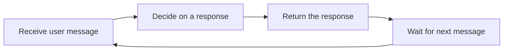
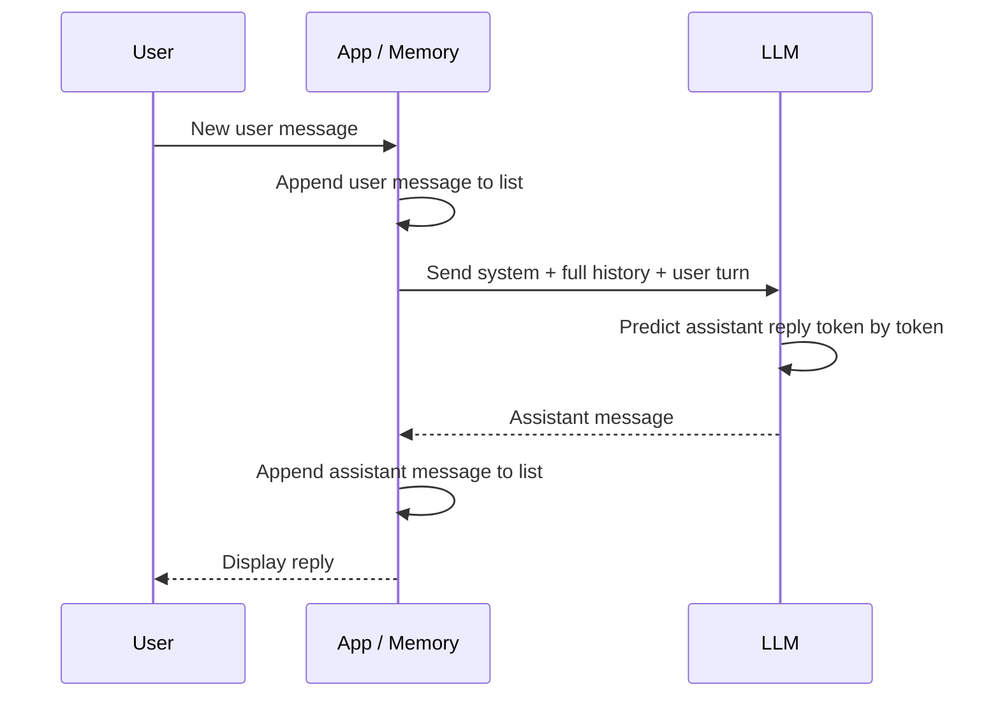
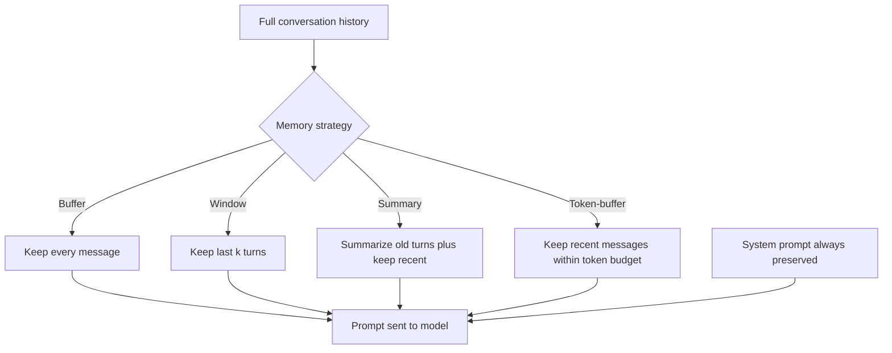
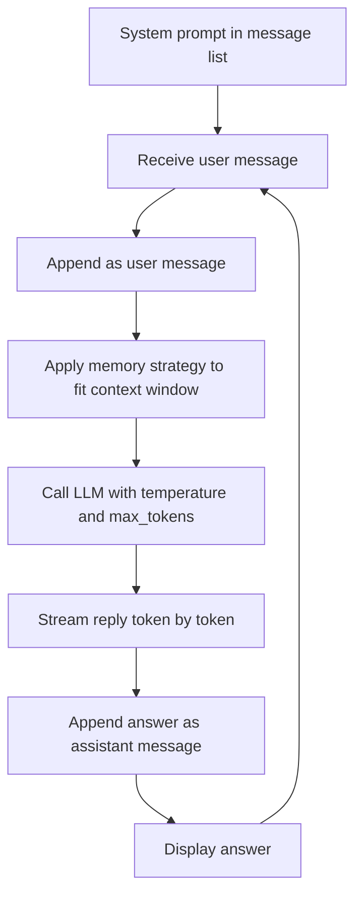

# Chatbots: From Rule-Based Scripts to LLM-Powered Assistants

A **chatbot** is a software application that simulates a conversation with a human. You type something in natural language, and the program replies in natural language. That is the whole idea but *how* the program decides what to say can range from a handful of hand-written rules to a massive neural network that generates language one word at a time. This guide builds the concept from the ground up: what a chatbot is, the major families of chatbots, how modern chatbots talk to **Large Language Models (LLMs)**, how they remember a conversation, and how the moving parts (roles, streaming, sampling, context windows) fit together.

No prior knowledge is assumed. Every term is defined the first time it appears.

---

## What a Chatbot Actually Is

At its core, a chatbot is a loop:

1. It **receives** a message from a user.
2. It **decides** on a response.
3. It **returns** that response.
4. It waits for the next message and repeats.

The intelligence or lack of it lives entirely in step 2. Everything else is plumbing. The history of chatbots is essentially the history of making step 2 smarter, moving from rigid pattern matching toward genuine language understanding and generation.

Diagram: the basic chatbot loop where all the intelligence lives in the decide step.



---

## The Three Families of Chatbots

### 1. Rule-Based Chatbots

A **rule-based** chatbot follows a fixed set of predefined rules. The classic technique is **pattern matching**: the bot scans the user's text for keywords or patterns (often using **regular expressions**, abbreviated **regex** a notation for describing text patterns, e.g. "any message containing the word *hello* or *hi*"). When a pattern matches, the bot returns a canned response tied to that pattern. If nothing matches, it falls back to a default reply such as "I'm sorry, I don't understand."

- It follows **decision trees** predetermined branches of "if the user says X, reply Y."
- There is **no understanding**, only recognition of surface patterns.
- Examples: early customer-service bots, FAQ bots.

In `01_chatbots.ipynb`, the `RuleBasedChatbot` class illustrates this perfectly: it holds a list of `(pattern, response)` pairs, lowercases the user's input, and returns the first matching response. Ask it something outside its rules ("random stuff") and it returns the default. This is fast, predictable, and completely transparent but brittle. It cannot handle phrasing it was not explicitly programmed for.

### 2. Retrieval-Based Chatbots

A **retrieval-based** chatbot does not invent text. Instead it **selects** a response from a predefined set of candidate responses. It uses machine learning to **rank** the candidates and pick the best fit for the user's message. A common design is **intent classification** (figuring out *what the user wants*, e.g. "track an order" vs. "request a refund") followed by filling in a **response template**.

- More flexible than rule-based, because it can generalize across phrasings that map to the same intent.
- Still limited to responses that already exist in its library it can rephrase but not truly create.

### 3. Generative Chatbots

A **generative** chatbot creates its response from scratch, **token by token**. A **token** is the basic unit of text an LLM works with roughly a word or a fragment of a word (for example, "chatbot" might be one or two tokens). The model predicts the next token, then the next, building up a reply.

- Built on **LLMs** Large Language Models such as OpenAI's GPT, Anthropic's Claude, Google's Gemini, and Meta's Llama. An LLM is a neural network trained on enormous amounts of text to predict the next token, which gives it a broad ability to understand and produce language.
- The most flexible and the most human-like of the three families.
- They can **hallucinate** confidently produce statements that are plausible-sounding but false so production systems wrap them in **guardrails** (validation, restrictions, and grounding techniques) to keep them safe and accurate.

The rest of this guide is about generative chatbots, because that is what "chatbot" almost always means today.

| Family | How it picks a response | Flexibility | Risk |
|--------|------------------------|-------------|------|
| Rule-based | Pattern/keyword match → canned reply | Low | Can't handle anything unscripted |
| Retrieval-based | Rank predefined candidates | Medium | Limited to existing responses |
| Generative (LLM) | Generates new text token by token | High | Can hallucinate |

---

## The LLM Chat Format: Roles and Messages

Modern LLM APIs do not take a single block of text. They take a **list of messages**, where each message has a **role** and **content**. This **message-based format** is the foundation of every LLM chatbot.

There are three core roles:

- **system** Sets the persona, behavior, and constraints of the assistant. This is where you say things like "You are a helpful Python expert. Answer concisely." It is the bot's standing instructions, established once and applied to the whole conversation. The user typically never sees it.
- **user** A turn typed by the human.
- **assistant** A turn produced by the model. (The assistant role is also used to insert *example* answers when you want to show the model how to behave a technique called **few-shot prompting**, where you provide a few example exchanges before the real question.)

A conversation is therefore an ordered list, for example:

```
system:    You are a helpful assistant.
user:      Hello!
assistant: Hi! How can I help you?
user:      What is RAG?
```

Every time you want a new reply, you send the **entire list so far** to the model and it appends one more `assistant` message. The ordering and labeling of roles is what lets the model tell who said what and respond appropriately. The arrangement of the system prompt, any examples, and the user's question is called the **prompt structure** and getting it right is much of the art of building a good chatbot.

Sequence diagram: a conversation turn resends the whole growing message list to a stateless model.



### A Note on Provider Differences

Different providers format this list slightly differently, though the concept is identical:

- **OpenAI** puts the system instruction as the first message in the `messages` list (a message with `role: "system"`).
- **Anthropic Claude** takes the system prompt as a *separate* `system` parameter, alongside a `messages` list that contains only `user` and `assistant` turns.
- **Google Gemini** uses a `system_instruction` setting and manages the back-and-forth through a chat session object.
- **Ollama** (for running models locally) mirrors OpenAI's style with a `system` message inside the list.

`01_chatbots.ipynb` defines one chatbot class per provider (`OpenAIChatbot`, `ClaudeChatbot`, `GeminiChatbot`, `OllamaChatbot`), and the only meaningful differences between them are these formatting conventions the underlying conversational logic is the same everywhere. For Anthropic specifically, the current generation is the **Claude 4.x family** (e.g. Claude Opus 4.x and Claude Sonnet 4.x); you select a model by its identifier and pass your system prompt, message list, and a `max_tokens` cap for the reply length.

---

## Conversation State and Memory

An LLM is **stateless**: each API call is independent, and the model remembers nothing from one call to the next. If you want a chatbot that remembers what was said three turns ago, *you* the application must store the conversation and resend it every time. This stored history is the chatbot's **memory**, and managing it well is one of the central challenges of chatbot design.

The simplest approach: keep a running list of every message and resend the whole thing on each turn. This is what the basic chatbot classes in the notebook do they append the new `user` message, call the model, then append the returned `assistant` message, so the list grows with every exchange.

### Why You Cannot Just Keep Everything

Every message you resend costs **tokens**, and tokens cost money and time. More importantly, every model has a hard limit (see *context window* below). A conversation that runs long enough will eventually overflow that limit. So chatbots use **memory strategies** to decide *which* parts of the history to keep.

| Memory Strategy | What it keeps | Token cost |
|-----------------|---------------|------------|
| **Buffer memory** | Every message, forever | High |
| **Window memory** | Only the last *k* turns | Medium |
| **Summary memory** | A running summary of old turns + recent messages | Low |
| **Token-buffer memory** | As many recent messages as fit in a token budget | Controlled |

These names mirror the memory classes popularized by frameworks like LangChain, but the ideas are framework-independent.

Diagram: memory strategies decide which history survives into the next prompt.



#### Window Memory

**Conversation window memory** keeps only the most recent *k* turns (a *turn* being one user message plus one assistant reply) and drops everything older. The system prompt is always preserved, because it defines the bot's identity. The notebook's `ConversationWindowMemory` class does exactly this: with `k=2`, after five exchanges it returns the system prompt plus only the last two user/assistant pairs. Older messages simply vanish from the model's view the bot "forgets" them.

- **Strength:** simple, predictable cost.
- **Weakness:** the bot genuinely loses anything beyond the window. Ask it about something said ten turns ago and it has no record of it.

#### Token-Buffer Memory

**Conversation token-buffer memory** is more precise: instead of counting turns, it counts **tokens** and keeps as many of the most recent messages as fit inside a fixed token budget. The notebook's `ConversationTokenBufferMemory` walks the history backwards from the newest message, estimating each message's token count (a rough estimate is *number of words × 1.3*, since a word averages a bit more than one token), and stops adding once the budget would be exceeded. This guarantees the conversation always fits, regardless of whether messages are short or long.

#### Summary Memory

**Conversation summary memory** (described conceptually in the notebook) compresses old turns into a short summary using the LLM itself, then keeps that summary plus the recent verbatim messages. This preserves the *gist* of a long conversation at a fraction of the token cost at the price of losing exact wording.

---

## The Context Window

The **context window** is the maximum amount of text measured in tokens that a model can consider at once. It must hold *everything*: the system prompt, the entire conversation history you resend, and the model's reply, all together. Think of it as the model's short-term working memory; nothing outside it exists as far as the model is concerned.

Approximate context windows (these grow over time as models improve):

| Model | Context window |
|-------|----------------|
| GPT-4o | ~128K tokens |
| Claude (Sonnet/Opus family) | ~200K tokens (some configurations far larger) |
| Gemini 1.5 Pro | ~1M tokens |
| Llama 3.1 70B | ~128K tokens |

### What to Do When the Context Fills Up

Once a conversation approaches the window limit, you need a strategy:

1. **Sliding window** drop the oldest messages (this is window memory).
2. **Summarize** old turns into a compact summary (summary memory).
3. **Compress** the history using a cheaper/smaller model to condense it.
4. **RAG (Retrieval-Augmented Generation)** move knowledge *out* of the conversation entirely and into an external store, fetching only the relevant pieces when needed. Instead of cramming an entire knowledge base into the prompt, you retrieve just the few relevant snippets per question. (RAG is a large topic covered in its own guide.)

---

## Sampling Parameters: Controlling How the Model Generates

When the model produces text token by token, it does not pick a single "correct" next token. It computes a **probability distribution** over all possible next tokens essentially a ranked list of how likely each candidate is. **Sampling** is the act of choosing the next token from that distribution. Several parameters control this choice and therefore the character of the output.

### Temperature

**Temperature** controls randomness. It rescales the probability distribution before sampling:

- **Low temperature** (near 0) makes the model nearly deterministic it almost always picks the single most likely token. Output is focused, consistent, and repeatable. Good for factual answers, code, and tasks where you want reliability.
- **High temperature** (e.g. 0.8-1.0+) flattens the distribution, giving lower-probability tokens a real chance. Output becomes more varied, creative, and surprising but also more prone to going off the rails.

The chatbot classes in the notebook use a temperature around 0.7 for a balanced, conversational feel, and 0 for the deterministic tasks in later RAG examples. (Other related "sampling" controls you'll encounter include **top-p / nucleus sampling**, which restricts choices to the smallest set of tokens whose probabilities sum to *p*, and **top-k**, which restricts to the *k* most likely tokens. The notebook focuses on temperature as the primary dial.)

### max_tokens

**max_tokens** caps how many tokens the model is allowed to generate in its reply. It does not make the model write that much it is a ceiling that prevents runaway-length responses and bounds cost. The notebook sets `max_tokens=1024` in its examples.

---

## Streaming Responses

Without streaming, you call the model and wait until the *entire* reply is finished, then receive it all at once. For a long answer, the user stares at a blank screen for several seconds.

**Streaming** instead delivers the reply incrementally token by token (or in small chunks) as the model produces them. This is the "typing" effect you see in modern chat interfaces: words appear progressively. The total time is the same, but the *perceived* responsiveness is far better because the user sees output almost immediately.

Mechanically, when streaming is enabled, the API returns a stream of small pieces. The chatbot reads each chunk as it arrives, prints/displays it right away, and simultaneously accumulates the pieces into the full response so it can be stored in memory once complete. Every chatbot class in the notebook offers both a plain `chat` method (wait for the whole reply) and a `stream_chat` method (print tokens as they arrive, then save the assembled message to history).

---

## Building a Conversational Loop

Putting it together, a generative chatbot is this cycle, repeated:

1. Start with the **system prompt** in the message list (sets persona and rules).
2. **Receive** the user's message; append it to the list as a `user` message.
3. Optionally apply a **memory strategy** so the list fits the context window.
4. **Call the LLM** with the message list and your chosen **temperature** and **max_tokens**, optionally **streaming** the reply.
5. **Append** the model's answer to the list as an `assistant` message (so the next turn has full context).
6. Display the answer; return to step 2.

A **reset** simply clears the history back to just the system prompt starting a fresh conversation while keeping the bot's identity. The notebook's classes include exactly such a `reset` that preserves the system message and discards the rest.

Diagram: the full generative chatbot loop with memory, sampling, and streaming.



---

## Where Chatbots Run: User Interfaces

The logic above is provider- and interface-agnostic. To put a chatbot in front of real users, you wrap it in a **user interface (UI)**. The notebook shows two popular Python options conceptually:

- **Gradio** provides a ready-made `ChatInterface` that turns a single "given a message and the history, produce a reply" function into a full web chat widget, complete with example prompts and built-in streaming support.
- **Streamlit** a general web-app framework where you manage the message history yourself in **session state** (per-user storage that persists across interactions), render each past message in a chat bubble, capture new input, and stream the model's reply into the page.

Both follow the same underlying pattern: maintain the message list, send it to the model, stream back the answer, and store both sides of the exchange. The UI is just the presentation layer on top of the conversational loop.

---

## Local LLMs

Not every chatbot needs a cloud API. **Ollama** lets you download and run open-weight models (such as Llama) directly on your own machine. The conversational logic is identical same roles, same message list, same streaming but the model runs locally. This trades away the convenience and raw power of the largest hosted models in exchange for privacy (your data never leaves your machine), no per-token cost, and offline operation. The notebook's `OllamaChatbot` looks almost identical to the cloud versions, underscoring that once you understand the message-based chat format, switching providers is mostly a matter of swapping the API call.

---

## Summary

- A **chatbot** simulates conversation; the intelligence lives in how it chooses a reply.
- Three families: **rule-based** (pattern matching, no understanding), **retrieval-based** (select and rank predefined responses), and **generative** (LLMs producing new text token by token flexible but able to hallucinate).
- Modern LLM chatbots use a **message list** with **system**, **user**, and **assistant** roles. The system role sets persona and rules; you resend the whole list each turn because the model is **stateless**.
- **Memory strategies** (buffer, window, summary, token-buffer) decide which history to keep so the conversation stays affordable and fits the **context window** the token-limited working memory that must hold the prompt, history, and reply together.
- **Temperature** controls randomness (low = focused, high = creative), and **max_tokens** caps reply length.
- **Streaming** delivers the reply progressively for a responsive feel.
- The same conversational loop powers every provider (OpenAI, Anthropic Claude 4.x, Gemini, local Ollama) and every UI (Gradio, Streamlit) only the formatting details differ.
