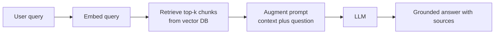
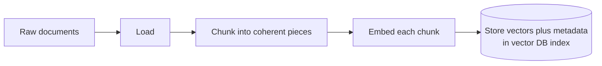
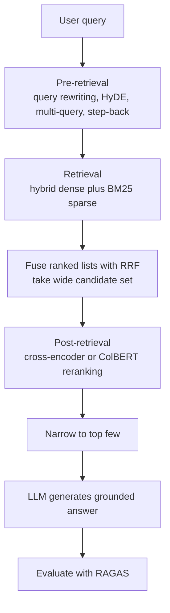
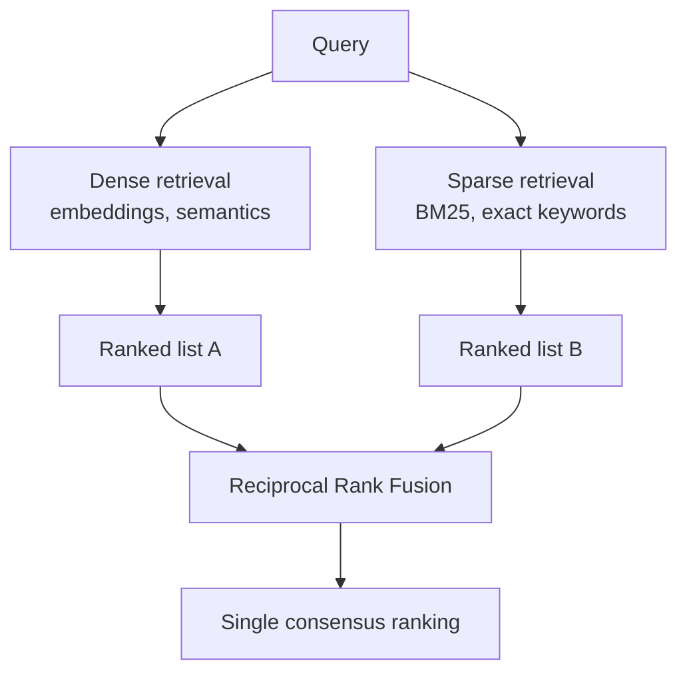
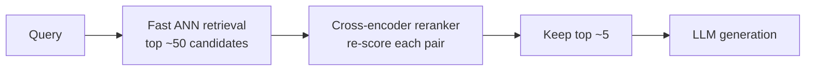

# Retrieval-Augmented Generation (RAG)

A **Large Language Model (LLM)** a neural network trained on enormous amounts of text to predict the next word is remarkably knowledgeable, but its knowledge is *frozen* inside its weights at training time and cannot be inspected, updated cheaply, or pointed at your private documents. **Retrieval-Augmented Generation (RAG)** fixes this. RAG is a technique that, *before* the model answers, **retrieves** relevant pieces of text from an external collection of documents and inserts them into the prompt, so the model **generates** its answer while looking at those retrieved facts.

The name says it exactly: *retrieval* (fetch the right documents) *augments* (adds to the prompt) *generation* (the LLM's answer). The result is an answer that is **grounded** in real, current, source-able information rather than the model's fuzzy internal memory.

Diagram: the core RAG pipeline from a user query to a grounded answer.



This guide builds RAG from absolute scratch every term defined on first use covering why RAG exists, the building blocks (embeddings, chunking, vector stores, similarity search), the core retrieve-then-generate pipeline, advanced techniques that make RAG actually work in practice, the framework ecosystem, and the state of the art in retrieval and reranking. The four notebooks in `02_rag/` map onto these sections: `01_rag_fundamentals.ipynb` (the basics), `02_advanced_rag.ipynb` (query and fusion techniques), `03_rag_frameworks.ipynb` (the tooling landscape), and `04_advanced_retrieval_and_reranking.ipynb` (the deep retrieval stack).

---

## Why RAG? The Three Problems It Solves

An LLM on its own has three structural limitations that RAG directly addresses.

### 1. Knowledge Cutoff

An LLM only knows what was in its training data, which stops at a fixed **knowledge cutoff date**. Anything that happened after that date a new product, a recent event, last week's policy change simply does not exist for the model. RAG sidesteps this by fetching current documents at query time; the model reads them fresh, so the "knowledge" can be as up-to-date as your document store.

### 2. Private and Proprietary Data

The model was never trained on your company's internal wiki, your customer's contracts, or your personal notes. It cannot answer questions about data it has never seen. RAG lets you point the system at *your* documents private, proprietary, confidential without ever sending them through training. The data stays in your store and is retrieved only when relevant.

### 3. Hallucination

When an LLM is uncertain, it does not say "I don't know." It often **hallucinates** confidently generating plausible-sounding but false statements. By placing actual source text in front of the model and instructing it to answer *only* from that text, RAG dramatically reduces hallucination and makes answers verifiable: you can show *which* retrieved passage an answer came from.

### Why Not Just Fine-Tune the Model?

**Fine-tuning** means continuing to train the model on new data so the knowledge becomes baked into its weights. It works, but it is expensive, slow, must be redone whenever the data changes, and is hard to audit. RAG is the cheaper, more flexible alternative: to update what the system knows, you just add or edit documents in the store no retraining. Fine-tuning teaches the model new *behavior or style*; RAG gives it new *facts on demand*.

---

## The Building Blocks

To understand how retrieval works, we need four foundational concepts: tokens, embeddings, chunking, and vector stores. They build on each other.

### Tokens

A **token** is the basic unit of text an LLM processes roughly a word or a fragment of a word. "Retrieval" might be one token; "myocardial" might be split into several. Everything in this guide that is "measured" context windows, chunk sizes, costs is measured in tokens.

### Embeddings: Turning Meaning Into Numbers

An **embedding** is a list of numbers a **vector** that represents the *meaning* of a piece of text. A separate model called an **embedding model** reads text and outputs a fixed-length vector (for example, 384 numbers, or 768, or 1536, depending on the model). The crucial property: **texts with similar meaning produce vectors that are close together in space**, and texts with different meanings produce vectors that are far apart.

- The number of values in the vector is its **dimension** (e.g. a "1536-dim vector"). More dimensions can capture more nuance but cost more to store and compare.
- These are **dense** vectors: every value is a meaningful number (as opposed to *sparse* vectors, introduced later, which are mostly zeros).
- Example models from the notebooks: `all-MiniLM-L6-v2` (384-dim, fast, runs locally), OpenAI's `text-embedding-3-small` (1536-dim), `bge-large-en-v1.5` / `BAAI/bge-m3` (strong, multilingual), `e5-large-v2`, and `nomic-embed-text` (good for RAG). The **MTEB leaderboard** (Massive Text Embedding Benchmark) is the standard ranking of embedding models.

The whole magic of semantic retrieval rests on embeddings: if we can turn both a question and a document into vectors, we can find documents whose meaning is close to the question's meaning even if they share no words.

### Chunking: Breaking Documents Into Pieces

You cannot embed an entire 200-page manual as one vector it would blur every topic together, and you could never retrieve just the relevant paragraph. So before embedding, documents are split into smaller pieces called **chunks**. **Chunking** is this splitting process, and choosing chunk size and boundaries well is one of the highest-leverage decisions in RAG.

The tension:

- **Chunks too large** → noisy, waste tokens, mix multiple topics so retrieval is imprecise.
- **Chunks too small** → lose surrounding context, so a retrieved snippet may be unintelligible on its own.
- **Bad boundaries** → splits happen mid-sentence, mangling meaning.

A common refinement is **chunk overlap**: adjacent chunks share a few sentences at their edges so that an idea straddling a boundary isn't cut in half. Typical settings in the notebooks are a chunk size of a few hundred tokens with an overlap of a few dozen.

| Chunking strategy | How it splits | Best for |
|-------------------|---------------|----------|
| **Fixed-size** | Every N characters/tokens | Simple, uniform text |
| **Recursive character** | Tries paragraph (`\n\n`) → line (`\n`) → sentence → word → character, in priority order | General-purpose default |
| **Semantic** | Splits where meaning shifts (detects topic change) | Dense technical docs |
| **Sentence-based** | One sentence per chunk | Q&A systems |
| **Markdown header** | Splits at `#`, `##`, `###` headings | Structured documentation |
| **Hierarchical (parent-child)** | Small "child" chunks for searching, larger "parent" chunks for context | Best of both: precise search, rich context |
| **Proposition / agentic** | An LLM extracts atomic facts or proposes natural boundaries | Maximum precision, higher cost |
| **Late chunking** | Embed the whole document first (using a long-context embedder), then split the token embeddings | Preserves global context in each chunk |

The **recursive character splitter** is the workhorse default: it prefers to break at the largest natural boundary (paragraph) and only descends to smaller boundaries (sentence, word) when necessary, keeping chunks coherent. The **semantic** approach embeds consecutive sentences and starts a new chunk wherever the similarity between neighbors drops below a threshold i.e. where the topic shifts. The **hierarchical parent-child** idea (small child chunks, e.g. ~128 tokens, are indexed and searched, but when one matches, the larger ~512-token parent is returned to the model) elegantly resolves the size tension and is a recurring theme in the advanced notebook.

### Vector Stores and Indexes

Once every chunk is an embedding, we need somewhere to keep millions of these vectors and search them fast. A **vector store** (or **vector database**) is a specialized database that stores embeddings and finds the ones most similar to a query vector. Popular examples from the notebooks: **FAISS** (a fast in-memory library from Meta), **Chroma** (a simple persistent local store), **Pinecone**, **Weaviate**, **Qdrant**, **Milvus**, **pgvector** (a PostgreSQL extension), **LanceDB**, **Redis Vector**, and **Elasticsearch/OpenSearch**.

Searching every vector one by one (an **exact** or **flat** search) is perfectly accurate but slow at scale its cost grows linearly with the number of vectors (written **O(n)**). So vector stores use an **index**: a clever data structure that finds the *approximately* nearest vectors far faster, trading a tiny bit of accuracy for enormous speed. This is called **Approximate Nearest Neighbor (ANN)** search.

| Index algorithm | Speed | Recall (accuracy) | Memory | Notes |
|-----------------|-------|-------------------|--------|-------|
| **Flat / Exact** | Slow, O(n) | Perfect | High | Fine under ~100K vectors |
| **HNSW** (Hierarchical Navigable Small World) | Fast, ~O(log n) | High | High | The common default; navigates a layered graph of vectors |
| **IVF** (Inverted File) | Medium, ~O(√n) | Medium | Medium | Groups vectors into clusters (cells), searches nearest cells; needs training |
| **PQ / IVFPQ** (Product Quantization) | Fast | Lower | Low | Compresses vectors to save memory |
| **DiskANN** | Fast | High | Low RAM | Keeps the graph on SSD for billion-scale data |
| **ScaNN** (Google) | Very fast | High | Medium | Anisotropic quantization, 10-100× speedups |

Two **HNSW** tuning knobs appear repeatedly: `M` (how many connections each vector keeps in the graph) and `ef` (how widely the search explores). A small `ef` (e.g. 64) gives fast ~95% recall; a large `ef` (e.g. 512) gives slower ~99.9% recall. **Recall@k** here means: of the truly-closest k vectors, what fraction did the approximate search actually find.

---

## Similarity Search: How "Closeness" Is Measured

Retrieval boils down to: given the query's vector, find the document vectors closest to it. "Closest" needs a precise definition. Three measures appear in the fundamentals notebook.

- **Cosine similarity** measures the *angle* between two vectors, ignoring their length. It ranges from −1 (opposite) through 0 (unrelated) to 1 (identical direction). This is the most common choice for text because it captures "pointing the same way in meaning-space" regardless of magnitude. The cell that computes similarity from scratch in `01_rag_fundamentals.ipynb` implements exactly this: dot product divided by the product of the vectors' lengths.
- **Dot product** multiply matching components and sum. When vectors are first **normalized** (scaled to length 1), the dot product *equals* cosine similarity, but it is faster to compute which is why vector indexes often normalize and then use dot product internally.
- **Euclidean distance (L2)** the straight-line distance between the two points. Here *smaller* means *more similar*, the opposite of the two measures above.

The practical takeaway: embed the chunks, embed the query, compute similarity between the query vector and every chunk vector (the index does this efficiently), and keep the **top-k** the k highest-scoring chunks. In the fundamentals notebook, a query like "What is a vector database?" correctly surfaces the chunk about vector databases as the top hit even though the wording differs that is semantic search working.

---

## The Core RAG Pipeline: Retrieve, Then Generate

RAG has two phases. The first happens **offline** (once, ahead of time); the second happens **online** (every time a user asks something).

### Indexing (Offline)

```
Documents → Load → Chunk → Embed → Store in Vector DB
```

1. **Load** the raw documents. Loaders exist for PDFs, web pages, CSVs, JSON, directories of text, and more. (Frameworks ship dozens of these.)
2. **Chunk** each document into coherent pieces (see chunking above).
3. **Embed** every chunk with the embedding model, turning it into a vector.
4. **Store** the vectors (with their original text and **metadata** extra fields like source filename, date, category) in the vector store's index.

Diagram: the offline indexing stage that prepares documents for retrieval.



### Querying (Online)

```
Query → Embed → Retrieve (top-k similar chunks) → Augment prompt → LLM → Answer
```

1. **Embed** the user's question with the *same* embedding model.
2. **Retrieve** the top-k most similar chunks from the vector store.
3. **Augment** the prompt: build a prompt that contains both the retrieved chunks (as "context") and the question, typically with an instruction like *"Answer using only the following context; if the answer isn't there, say you don't know."*
4. **Generate**: send that prompt to the LLM, which produces a grounded answer.

The "answer only from the context, otherwise say I don't know" instruction is what converts a hallucination-prone model into a disciplined, source-grounded one. Whichever LLM does the generation for instance Anthropic's current **Claude Opus 4.x** or **Claude Sonnet 4.x**, or an OpenAI model the RAG structure is identical; the model just reads the retrieved context and writes the answer.

A **retriever** is the component that wraps the vector store and returns relevant chunks for a query. Its main setting is `k` (how many chunks to fetch). It also offers different **search types**, most importantly plain similarity and **MMR** (below).

### MMR: Avoiding Redundant Results

Plain top-k retrieval has a flaw: the top results are often near-duplicates of each other, so you get the same fact five times and miss other relevant angles. **Maximal Marginal Relevance (MMR)** fixes this by balancing two goals relevance to the query *and* diversity among the chosen chunks. It picks the most relevant chunk first, then for each subsequent pick prefers chunks that are relevant but *different* from what's already selected. A parameter (often called `lambda`) controls the balance: near 1 means pure relevance, near 0 means pure diversity. The MMR cell in `01_rag_fundamentals.ipynb` shows it selecting a relevant-but-varied set instead of three redundant hits.

---

## Advanced RAG: Making It Actually Work

Basic RAG breaks down in real use. The advanced notebooks catalog *why* and *how to fix it*. Common failure modes:

- **Vocabulary mismatch** the question says "heart attack," the document says "myocardial infarction"; embeddings help but don't fully bridge this.
- **Short query vs. long document** a terse question may not embed close to the verbose passage that answers it.
- **Retrieval ≠ relevance** fast ANN search optimizes for *vector closeness*, not for *actually answering the question*.
- **"Lost in the middle"** LLMs attend best to the start and end of a long context and can overlook facts buried in the middle.
- **Single-query brittleness** one phrasing of a question may simply miss the right chunk.

The fixes slot into a stack: improve the **query** before retrieval, improve the **retrieval** itself, and improve the **post-retrieval** filtering before generation.

Diagram: advanced RAG inserts fixes at three stages around the basic pipeline.



### Query Transformation (Pre-Retrieval)

These techniques rewrite or expand the question so retrieval has a better chance.

- **Query rewriting** an LLM rephrases a vague or messy query into a cleaner, more retrievable form.
- **HyDE (Hypothetical Document Embeddings)** instead of embedding the *question*, ask an LLM to write a *hypothetical answer* to the question (even if it's a guess), then embed and retrieve with *that*. The insight: a hypothetical answer "looks like" the real documents far more than a terse question does, so it lands closer to them in embedding space. This directly attacks the vocabulary-mismatch and short-query problems.
- **Multi-query** generate several paraphrases of the question, retrieve for each, and pool the results (deduplicated). Different phrasings catch different relevant chunks, improving **recall** (the fraction of all relevant chunks you actually find).
- **Step-back prompting** abstract the specific question into a more general one (e.g. "What pressure makes ethanol boil at X?" → "How does pressure relate to boiling point?"), retrieve the broader background, then answer the specific question with that context.

### RAG-Fusion and Reciprocal Rank Fusion (RRF)

**RAG-Fusion** combines multi-query with a smart way of merging the multiple result lists. When you retrieve several ranked lists (one per query variant), you need to fuse them into one ranking. **Reciprocal Rank Fusion (RRF)** does this without any score calibration: each document's fused score is the sum, over all the lists it appears in, of `1 / (k + rank)`, where `rank` is its position in that list and `k` is a constant (conventionally 60). A document that ranks high in *several* lists rises to the top. RRF is robust and tuning-free, which is why it's the go-to fusion method. The RRF cell in `02_advanced_rag.ipynb` demonstrates merging three ranked lists into a single consensus ranking.

### Hybrid Search: Dense + Sparse

So far we've used **dense** retrieval (embeddings great at meaning and synonyms, weak at exact rare terms like product codes or names). The classic alternative is **sparse** retrieval, of which **BM25** is the canonical algorithm.

- **BM25** is a keyword-based scoring function: it rewards documents that contain the query's words, weighting rarer words more heavily and dampening the effect of very common ones. The vector it conceptually produces is **sparse** mostly zeros, with non-zero weights only for the words actually present. BM25 excels at exact matches and rare terms but has *zero* understanding of meaning: it can't connect "car" to "automobile." The BM25 cell in `02_advanced_rag.ipynb` (using `rank-bm25`) shows it nailing keyword overlap.

| | **Dense (embeddings)** | **Sparse (BM25)** |
|---|---|---|
| Strength | Synonyms, paraphrase, semantics | Exact keywords, rare terms, codes |
| Weakness | Misses rare/exact tokens | No semantic understanding |
| Representation | Dense vector (all values meaningful) | Sparse vector (mostly zeros) |

**Hybrid search** runs both and combines them, getting the best of each. Two combination methods appear: a weighted linear blend (`α · dense_score + (1−α) · sparse_score`, where `α` tunes the mix but it's fragile because the two score scales differ), and **RRF**, which merges the two ranked lists by rank rather than raw score and so needs no calibration the preferred approach. A learned middle ground, **SPLADE**, uses a BERT model to produce *learned sparse* vectors over the vocabulary, getting keyword-style exactness with some semantic awareness.

Diagram: hybrid search runs dense and sparse retrieval in parallel and fuses them with RRF.



### Reranking (Post-Retrieval)

First-stage retrieval (ANN) is built for *speed*, so it casts a wide, slightly noisy net. **Reranking** is a second, slower-but-sharper pass: retrieve a large candidate set (say top-50) cheaply, then use a more accurate model to re-score those candidates and keep only the best few (say top-5) for the LLM. This two-stage "retrieve wide, rerank narrow" pattern is one of the biggest practical wins in RAG.

Diagram: the retrieve-wide then rerank-narrow two-stage pattern.



The key distinction is *how* a model scores a (query, document) pair:

- **Bi-encoder** encodes the query and the document *separately* into vectors, then compares them with cosine similarity. Fast (you can pre-compute all document vectors), but the query and document never "see" each other during encoding. This is what ordinary embedding retrieval uses.
- **Cross-encoder** feeds the query and document *together* into one model (`[query] [SEP] [document]`) so every query token can interact with every document token. Far more accurate at judging relevance, but slow you must run the model fresh for *every* candidate pair, so it's only practical on a small reranked set, not the whole corpus. This is the standard reranker.
- **ColBERT (late interaction)** a middle ground: it keeps a vector *per token* and scores via "MaxSim" (for each query token, take its best match among document tokens, then sum). More expressive than a single-vector bi-encoder, cheaper than a full cross-encoder.

Reranker types form their own taxonomy: **pointwise** (score each document independently cross-encoders, BGE, Cohere), **pairwise** (compare documents two at a time), and **listwise** (rank the whole list at once e.g. an LLM like "RankGPT" acting as judge).

Popular rerankers named in `04_advanced_retrieval_and_reranking.ipynb`: `cross-encoder/ms-marco-MiniLM-L-6-v2` (fast, open-source), `BAAI/bge-reranker-large` (multilingual, via FlagEmbedding), **Cohere** `rerank-english-v3.0` (an API service), **ColBERT/ColBERTv2** (via the RAGatouille library), **FlashRank** (CPU-friendly), Jina's reranker, and MonoT5. The reranking cells show the same flow each time: form (query, doc) pairs, score them with the cross-encoder, sort, keep the top-n.

### Self-Correcting and Architectural RAG

The most advanced patterns let the system *decide* and *check* rather than blindly retrieve-then-generate:

- **Self-RAG** the model uses reflection signals to decide *whether* to retrieve at all (`[Retrieve]`), judge whether a retrieved chunk is relevant (`[IsRel]`), whether the answer is supported by it (`[IsSup]`), and whether the answer is useful (`[IsUse]`). If retrieval isn't needed or isn't relevant, it falls back to its own internal knowledge. The Self-RAG cell implements this with prompting and a confidence threshold.
- **CRAG (Corrective RAG)** adds a retrieval *evaluator* that grades the retrieved context as CORRECT, AMBIGUOUS, or INCORRECT. If it's poor, the system falls back to **web search** (e.g. via a tool like Tavily) rather than answering from bad context.
- **FLARE (Forward-Looking Active RAG)** retrieves *during* generation, only when the model's next-token confidence drops below a threshold, fetching more context exactly when it's unsure.
- **RAPTOR** builds a *tree* index: cluster the leaf chunks, summarize each cluster with an LLM, then recursively cluster and summarize the summaries up to a root, indexing nodes at every level. Queries can then retrieve either fine detail (leaves) or high-level overview (summaries).
- **GraphRAG / LightRAG / HippoRAG** overlay a **knowledge graph** (entities and the relationships between them) on the corpus so the system can answer relationship and multi-hop questions, sometimes using graph algorithms like Personalized PageRank to rank relevant nodes.
- **Speculative RAG** a small fast model drafts answers that a larger model verifies.

### RAG Evaluation

You can't improve what you can't measure. **RAGAS** is the standard RAG evaluation framework; it uses an LLM as a judge to score four complementary dimensions (each from 0 to 1):

| Metric | Question it answers | Catches |
|--------|---------------------|---------|
| **Faithfulness** | Is the answer grounded in the retrieved context? | Hallucination |
| **Answer relevancy** | Does the answer actually address the question? | Off-topic answers |
| **Context precision** | Are the retrieved chunks relevant (not noise)? | Retrieving junk |
| **Context recall** | Were *all* the needed chunks retrieved? | Missing evidence |

An evaluation example needs a `question`, the system's `answer`, the retrieved `contexts`, and a `ground_truth` reference answer. Other tools mentioned: **TruLens** (feedback functions and a dashboard), **DeepEval** (hallucination, toxicity, relevancy checks), and the retrieval benchmarks **BEIR** and **MTEB**.

---

## RAG Frameworks: The Tooling Landscape

You *can* build every piece above by hand (the fundamentals notebook does, with NumPy and FAISS), but in practice you use a framework. `03_rag_frameworks.ipynb` surveys the ecosystem. The core trade-off is **abstraction level**: high-level frameworks get you running in minutes but hide details; low-level ones give full control but more work. They also differ on local-vs-cloud, code-vs-visual, and RAG-only-vs-full-platform.

### Code-First Frameworks

- **LangChain** the broad, general-purpose "Swiss Army knife" of LLM apps. Its strength is *breadth*: 100+ document loaders and integrations with nearly every vector store and model. You compose pipelines with **LCEL (LangChain Expression Language)**, chaining components with a `|` pipe operator (`prompt | llm | output_parser`), where every component is a uniform `Runnable` you can `.invoke()`, `.stream()`, or `.batch()`. Building blocks: `DocumentLoader`, `TextSplitter`, `Embeddings`, `VectorStore`, `Retriever`, plus helpers like `RunnablePassthrough` (pass input through unchanged) and `RunnableParallel` (run branches at once). Downsides: leaky abstractions on edge cases and frequent breaking changes across versions. Best for general LLM apps, agents, and prototyping.

- **LlamaIndex** *data-centric*, laser-focused on indexing your documents for retrieval. Its signature idea is **multiple index types** for different query patterns: `VectorStoreIndex` (semantic search), `KnowledgeGraphIndex` (relationships), `TreeIndex` (hierarchical summarization), `ListIndex` (exhaustive small-corpus search), `KeywordTableIndex` (keyword lookup). It offers powerful **query engines** (e.g. `SubQuestionQueryEngine`, which breaks a complex question into sub-questions; `RouterQueryEngine`, which routes a query to the right index) and excellent **metadata filtering** (restrict retrieval to chunks matching, say, a date or category useful for multi-tenant systems). A global `Settings` object holds the LLM, embedding model, and chunk sizes. Best for pure document Q&A.

- **Haystack** (by deepset) the most *production-oriented*, enterprise-NLP framework. Everything is an explicit, typed **Component**, and a **Pipeline** is a directed graph where you wire each output to each input by hand. Verbose, but transparent and debuggable. It has first-class **hybrid search** (combine a BM25 retriever and an embedding retriever, merge with a `DocumentJoiner` using reciprocal rank fusion, then rerank with a cross-encoder) and built-in evaluation metrics. Strong Elasticsearch/OpenSearch integration. Best for production NLP and hybrid search.

- **Other notable code libraries:** **txtai** (lightweight all-in-one embeddings + NLP, good for edge/embedded use), **Semantic Kernel** (Microsoft's enterprise SDK for .NET and Python, organized around "Skills" and a Planner), and **Vercel AI SDK** (TypeScript, focused on streaming AI UIs in React/Next.js).

### Document-Understanding and Preprocessing Tools

Real documents (PDFs with tables, scans, multi-column layouts) are hard to parse cleanly, and garbage-in means garbage-out for RAG.

- **RAGFlow** does **deep, layout-aware document parsing** (preserving table structure, figure captions, document hierarchy, reading order) before chunking; self-hosted with a UI and cited answers.
- **Unstructured** the most comprehensive open-source parsing library, one interface for 30+ file types, returning typed elements (`Title`, `NarrativeText`, `Table`, `ListItem`, `Image`).
- **LlamaParse** (cloud, by LlamaIndex), **Marker** (fast local PDF→Markdown), and **Docling** (IBM) are alternatives for complex documents, tables, and equations.

### No-Code and Platform Frameworks

- **Dify** an **LLMOps platform**: a visual workflow builder plus knowledge-base management, model management, prompt engineering, and built-in observability (logs, traces, token usage). Good for teams and internal tools where non-developers iterate.
- **Flowise** and **Langflow** drag-and-drop visual builders (both built on LangChain) for assembling RAG pipelines without code; great for prototypes and demos, less so for complex custom logic, testing, and version control.
- **AnythingLLM**, **PrivateGPT**, **LocalGPT**, **GPT4All** desktop/local-first tools emphasizing privacy and offline operation (often pairing with **Ollama** to run models locally), ranging from full UIs to simple CLIs.

### Choosing One

The decision matrix in the notebook boils down to: starting out or building general agentic apps → **LangChain**; pure document Q&A with rich metadata → **LlamaIndex**; production hybrid-search NLP → **Haystack**; messy PDFs → **RAGFlow** or **Unstructured** + any framework; no-code for a team → **Dify**; strict privacy/air-gapped → **PrivateGPT**/local stack; React/Next.js → **Vercel AI SDK**; .NET shops → **Semantic Kernel**. As the notebook closes: the best framework is the one your team will actually use start simple, measure, then optimize.

---

## Putting It All Together: A Production-Grade Pipeline

The end-to-end design from the advanced retrieval notebook stitches every concept into one flow:

```
Documents
  → Hierarchical chunking (small child chunks indexed, larger parents returned)
  → Index in BOTH an HNSW vector index (dense) AND a BM25 index (sparse)
  → Query transformation (HyDE / multi-query to widen recall)
  → Hybrid retrieval (dense + BM25, merged via RRF, take top ~50 candidates)
  → Rerank with a cross-encoder / ColBERT (narrow to top ~5)
  → Generate the grounded answer with the LLM
  → Evaluate continuously with RAGAS (faithfulness, relevancy, precision, recall)
```

The recurring lessons:

1. **Chunk hierarchically**, not with blind fixed sizes search small, return large.
2. **Always go hybrid** combine BM25 (exact) and dense (semantic) and fuse with RRF; it needs no tuning and reliably beats either alone.
3. **Rerank before generating** retrieve a wide candidate set, then let a cross-encoder pick the true best few.
4. **Transform the query** multi-query and HyDE rescue questions that plain embedding would miss.
5. **Evaluate on all four RAGAS dimensions** measure faithfulness *and* relevancy *and* context precision *and* recall, not just a vibe.
6. **Quality-gate with self-correcting patterns** (Self-RAG, CRAG, FLARE) when correctness matters enough to justify the extra steps.

---

## Summary

- **RAG** = retrieve relevant documents, insert them into the prompt, then let the LLM generate a grounded answer. It exists to defeat **knowledge cutoff**, unlock **private data**, and curb **hallucination** at a fraction of fine-tuning's cost.
- The building blocks: **tokens** (text units), **embeddings** (meaning-as-vectors), **chunking** (splitting docs into searchable pieces), and **vector stores/indexes** (fast approximate-nearest-neighbor search via HNSW, IVF, and friends).
- **Similarity search** (usually cosine similarity) finds the top-k chunks closest in meaning to the query.
- The **core pipeline** is offline indexing (load → chunk → embed → store) plus online querying (embed → retrieve → augment → generate), with **MMR** to keep results diverse.
- **Advanced RAG** improves the query (rewriting, **HyDE**, **multi-query**, step-back, **RAG-Fusion** with **RRF**), the retrieval (**hybrid** dense + **BM25** sparse search), and the post-retrieval step (**cross-encoder reranking**, ColBERT), and adds self-correcting architectures (Self-RAG, CRAG, FLARE, RAPTOR, GraphRAG). **RAGAS** measures it all.
- A rich **framework ecosystem** (LangChain, LlamaIndex, Haystack, RAGFlow, Dify, and many more) implements these ideas at every level of abstraction but the concepts above are what make any RAG system actually work.
