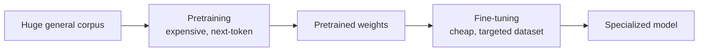
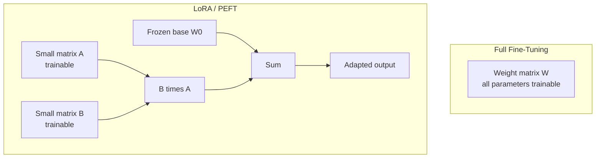
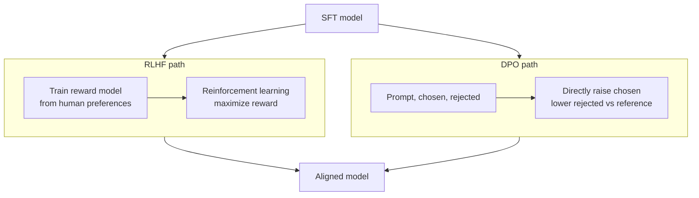

# Fine-Tuning Large Language Models

Fine-tuning is the process of taking a language model that has already learned general language ability and continuing to train it on a focused set of examples so that it behaves the way you want in a particular style, format, domain, or with particular knowledge baked in. This guide builds the idea up from absolute scratch, defines every term as it appears, and covers each technique discussed in `01_fine_tuning.ipynb`: full fine-tuning, parameter-efficient fine-tuning (LoRA, QLoRA, and friends), supervised fine-tuning, and preference-based alignment (DPO and RLHF).

---

## Foundations: What a Language Model Already Knows

Before you can fine-tune a model, you need a model. A **large language model (LLM)** is a neural network trained to predict the next **token** in a sequence. A token is a small chunk of text roughly a word or a piece of a word (for example, "running" might be split into "run" + "ning"). The model reads a stream of tokens and, for each position, outputs a probability distribution over what the next token should be. By sampling from those probabilities repeatedly, it generates text.

Internally, the model represents each token as an **embedding** a long list of numbers (a vector) that captures the token's meaning in a way the network can do math on. Words with similar meanings end up with similar vectors. All of the model's "knowledge" lives in its **parameters** (also called **weights**): the millions or billions of numbers that get multiplied with these vectors as information flows through the network.

A model is created in two broad stages:

- **Pretraining** the model is trained on an enormous, general corpus of text (much of the public internet, books, code) by next-token prediction. This is where it learns grammar, facts, reasoning patterns, and how language works. Pretraining is extremely expensive (millions of dollars, thousands of GPUs).
- **Fine-tuning** starting from those pretrained weights, the model is trained further on a much smaller, targeted dataset to specialize its behavior. This is cheap by comparison.

Fine-tuning works precisely *because* pretraining already happened. You are not teaching the model English from nothing; you are nudging a model that already speaks fluently to speak the way *you* need.

Diagram: pretraining builds general ability, fine-tuning cheaply specializes it.



---

## Four Ways to Make a Model Do What You Want

There is more than one way to get desired behavior out of an LLM, and fine-tuning is only one of them. The notebook opens with this exact comparison:

| Approach | What it is | When to use |
|----------|-----------|-------------|
| **Prompting** | Writing clever instructions/examples in the input, no training at all | Quick experiments, limited control, behavior can drift |
| **RAG** (Retrieval-Augmented Generation) | Fetching relevant documents at query time and pasting them into the prompt | When you need external or up-to-date factual knowledge |
| **Fine-tuning** | Actually updating the model's weights on your examples | When you need a consistent style, format, or domain behavior |
| **Pretraining** | Training a model from scratch | A genuinely new domain with its own vocabulary |

Key intuitions:

- **Prompting** changes nothing about the model it only changes the input. It is the fastest and cheapest thing to try, and you should almost always try it first. Its weakness is that it gives limited, sometimes inconsistent control: the model may ignore parts of long instructions.
- **RAG** is about *knowledge*, not *behavior*. If your problem is "the model doesn't know our internal documents" or "it gives outdated facts," RAG solves that by injecting the right text into the prompt at runtime. It does not change how the model writes or reasons.
- **Fine-tuning** is about *behavior*. If your problem is "I want every answer in this exact JSON format," or "I want the brand's tone of voice," or "I want it to reliably handle this niche task," fine-tuning bakes that pattern into the weights so you no longer have to spell it out in every prompt.
- **Pretraining from scratch** is almost never the right answer for a normal project it is the multi-million-dollar option, reserved for entirely new domains or languages.

A practical rule of thumb: **try prompting first, add RAG if the problem is missing knowledge, and reach for fine-tuning when you need consistent behavior that prompting can't reliably deliver.** Fine-tuning and RAG are complementary, not competing many production systems fine-tune for behavior *and* use RAG for fresh knowledge.

---

## The Types of Fine-Tuning

The notebook lays out a taxonomy. These categories answer two different questions: *which parameters do we update* (full vs. parameter-efficient), and *what kind of training signal do we use* (supervised vs. preference-based).

1. **Full fine-tuning** update *all* of the model's parameters.
2. **PEFT (Parameter-Efficient Fine-Tuning)** update only a small fraction of parameters. Includes LoRA, QLoRA, prefix tuning, prompt tuning, and IA3.
3. **SFT (Supervised Fine-Tuning)** standard next-token prediction on instruction/response data. This is the "what signal" you use, and it can be combined with either full or PEFT.
4. **DPO (Direct Preference Optimization)** align the model to human preferences without reinforcement learning.
5. **RLHF (Reinforcement Learning from Human Feedback)** align the model to preferences using a reward model and reinforcement learning.

The rest of this guide walks through each.

---

## Full Fine-Tuning

**Full fine-tuning** means you take every one of the model's parameters and allow training to adjust them. Conceptually it is the most straightforward: it is just "more training," continuing the same next-token-prediction process on your dataset.

How training works, intuitively:

- You feed the model an example and let it predict.
- A **loss function** measures how wrong the prediction was (a single number lower is better).
- **Backpropagation** computes, for every parameter, the direction it should move to reduce the loss (this direction is called the **gradient**).
- An **optimizer** nudges each parameter a small step in that direction. The step size is set by the **learning rate**.
- Repeat over many examples and many passes.

The problem is cost. For a model with billions of parameters, full fine-tuning requires holding in GPU memory not just the weights, but also the gradients and the optimizer's bookkeeping (optimizers like Adam keep two extra numbers per parameter). The rule of thumb is that full fine-tuning needs *several times* the memory of the model itself. A 65-billion-parameter model can require multiple high-end 80 GB GPUs just to fine-tune. This expense is exactly what the next family of methods exists to avoid.

---

## PEFT: Parameter-Efficient Fine-Tuning

**PEFT** is the insight that you don't need to move *every* weight to specialize a model. You can freeze the giant pretrained model entirely and train only a tiny number of *new* parameters bolted onto it. Because the frozen base provides all the heavy lifting, the small set of trainable parameters is enough to steer behavior at a fraction of the memory and compute.

The notebook lists several PEFT methods. The umbrella idea behind all of them is "freeze most, train little":

- **LoRA** inject small trainable low-rank matrices into the weight layers (covered in depth below).
- **QLoRA** LoRA on top of a heavily compressed (quantized) base model (also below).
- **Prefix tuning / Prompt tuning** instead of touching the weights, learn a small set of "virtual tokens" (trainable vectors prepended to the input) that steer the model. The model itself stays frozen; only these soft prompts are trained.
- **IA3** learn tiny per-feature scaling factors that rescale the model's internal activations, an even more minimal intervention.

LoRA is by far the most widely used, so the notebook focuses there.

### LoRA: Low-Rank Adaptation

LoRA (Low-Rank Adaptation) is the centerpiece technique. To understand it, picture a single layer of the network as a big grid of numbers a **weight matrix** called *W*. When data flows through the layer, the input vector gets multiplied by *W*. Fine-tuning normally means changing every number in *W*.

LoRA's idea: instead of changing *W* directly, **leave *W* frozen and learn a small "correction" to add on top of it.** Write the new weights as:

> *W = W₀ + ΔW*

where *W₀* is the original frozen matrix and *ΔW* is the learned change. The trick is in how *ΔW* is represented. Rather than storing *ΔW* as a full-sized matrix (which would be just as big as *W*), LoRA factors it into the product of two much skinnier matrices:

> *ΔW = B · A*

Here *A* and *B* are small. If *W* is a *d × k* grid, then *A* is *r × k* and *B* is *d × r*, where **r** (the **rank**) is a tiny number like 8 or 16 far smaller than *d* or *k*. This is called a **low-rank** decomposition: a big matrix approximated by the product of two thin ones.

**Why this saves so much.** A full *d × k* matrix has *d·k* numbers. The two LoRA matrices together have only *r·(d + k)* numbers. The notebook's worked example makes this vivid:

- With *d = k = 4096* and *r = 16*, the trainable count drops from **16.7 million** parameters per layer to about **131 thousand** roughly a **128×** reduction.
- The notebook's hands-on `LoRALinear` class (a 768×768 layer with *r = 16*) shows the same effect at smaller scale: **589,824** full parameters versus **24,576** LoRA parameters a **24×** reduction.

During training, the layer computes its output as the frozen base path *plus* the scaled LoRA path:

> *h = W₀·x + (α / r) · B·A·x*

A few details that the `LoRALinear` cell makes concrete:

- **Initialization matters.** *A* is initialized to small random values and *B* is initialized to **zeros**. Because *B* starts at zero, the entire LoRA correction *B·A* is zero at the start of training so the fine-tuned model begins behaving *exactly* like the original, and training gently moves it away from there. This prevents a destabilizing jolt at step one.
- **α (alpha) is a scaling factor.** The term *α/r* controls how strongly the LoRA correction is applied. The notebook notes the common choices *α = r* or *α = 2r*. It is essentially a knob on how much influence the adapter has.
- **The base weights are frozen** (`requires_grad = False` in the code). Only *A* and *B* receive gradients, which is the whole source of the savings.
- **`target_modules`** LoRA is applied to chosen layers. In the Unsloth example, the targets are the attention projections (`q_proj`, `k_proj`, `v_proj`, `o_proj`) and the feed-forward projections (`gate_proj`, `up_proj`, `down_proj`). These are the layers where adaptation is most effective.

Diagram: full fine-tuning updates every weight, while LoRA freezes the base and trains a tiny low-rank correction.



A lovely practical bonus of LoRA: because the base model is untouched, you can train many small adapters (one per task) and **swap them in and out** of the same base model like interchangeable lenses on one camera body. The adapters are tiny files (megabytes), easy to store and share.

### QLoRA: Quantized LoRA

QLoRA pushes memory savings even further by attacking the *base model's* footprint, not just the trainable parameters.

First, the key term. **Quantization** means storing numbers with fewer bits of precision. A normal weight is a 16- or 32-bit floating-point number; quantization rounds it to, say, a 4-bit value. This shrinks the model dramatically (roughly 4× smaller going from 16-bit to 4-bit) at the cost of a little precision. The base model becomes much cheaper to hold in memory but slightly less exact.

QLoRA combines three ingredients (all named in the notebook):

- **4-bit NormalFloat (NF4)** a special 4-bit number format designed for weights that are distributed in a bell-curve (normal) shape, which neural network weights tend to be. NF4 places its limited set of representable values where the weights actually cluster, so it loses less information than naive 4-bit rounding.
- **Double quantization** even the small constants used to scale the quantized weights are themselves quantized, squeezing out a bit more memory.
- **Paged optimizers** when the GPU runs out of memory during a spike, the optimizer's data is temporarily shuffled to CPU memory (like an operating system paging to disk) so training doesn't crash with an out-of-memory error.

The base model is loaded in 4-bit and kept **frozen**; the LoRA adapters are trained in higher precision (BF16, a 16-bit float). The payoff the notebook cites: a **65B-parameter model fits on a single 48 GB GPU**, versus needing four 80 GB GPUs for full fine-tuning. QLoRA is what makes fine-tuning large models possible on modest hardware.

---

## Supervised Fine-Tuning (SFT) and Data Formatting

**Supervised fine-tuning (SFT)** is the most common form of fine-tuning. "Supervised" means each training example comes with the *correct answer*, and the model is trained via ordinary next-token prediction to reproduce that answer given the prompt. This is also called **instruction tuning** when the data consists of instructions paired with good responses: it teaches a raw, pretrained model to *follow instructions and behave like an assistant* rather than just autocompleting text.

### Data is everything

The model learns the patterns in your data, so the dataset *is* the product. The notebook uses a classic instruction dataset, `yahma/alpaca-cleaned`, and a standard structure called the **Alpaca format**. Each example is rendered into a single block of text using a fixed template:

```
Below is an instruction that describes a task.

### Instruction:
{instruction}

### Input:
{input}

### Response:
{output}
```

Why a consistent template matters:

- **Structure teaches the model where its job begins.** The model learns that text following `### Response:` is what it should generate. At inference time you give it everything up to `### Response:` and let it complete.
- **Consistency is critical.** Every example must use the same template; the model is pattern-matching on these markers. The same template must be used at inference time too, or the model will be confused.
- The three fields capture a general task: an **instruction** (what to do), an optional **input** (data to do it on), and the **output** (the desired response).

In the notebook, a small `format_sample` function maps each raw dataset row into this single `text` field, and the trainer then trains on that text.

### The training loop, conceptually

The notebook uses high-level libraries (Unsloth and TRL's `SFTTrainer`) so you don't hand-write the loop, but the concepts underneath are worth knowing:

- **Epoch** one full pass over the entire dataset. Training for `num_train_epochs` epochs means seeing all data that many times. The example uses **1 epoch**, which is typical for instruction tuning more epochs risk memorization.
- **Batch size** how many examples are processed together before updating the weights. The example uses `per_device_train_batch_size=2` (small, because LLMs are memory-hungry).
- **Gradient accumulation** a trick to *simulate* a larger batch without the memory cost: accumulate the gradients from several small batches and only update once. With batch size 2 and `gradient_accumulation_steps=4`, the *effective* batch size is 8. This gives the stability of large batches on small hardware.
- **Learning rate** the step size for each weight update. The example uses `2e-4` (0.0002). LoRA/QLoRA typically tolerate higher learning rates than full fine-tuning. Too high and training diverges; too low and it barely learns.
- **Mixed precision (`fp16`)** doing the math in 16-bit floats to save memory and run faster.
- **Gradient checkpointing** trading compute for memory by recomputing some intermediate values during backpropagation instead of storing them all. The example uses Unsloth's optimized version. This lets you fit longer sequences and bigger models.
- **`max_seq_length`** the maximum number of tokens in a training example (2048 here). This is tied to the **context window**: the span of tokens the model can attend to at once.
- **Logging and saving** `logging_steps` controls how often progress is printed; `save_strategy="epoch"` saves a checkpoint after each epoch.

After training, the notebook saves only the small LoRA adapter (`save_pretrained("lora_model")`) and optionally pushes it to the Hugging Face Hub for sharing again highlighting that what you produce is a tiny adapter, not a whole new model.

### Overfitting

**Overfitting** is the central danger of fine-tuning, especially on small datasets. It means the model **memorizes the training examples instead of learning the general pattern** it performs beautifully on data it has seen and poorly on anything new. Signs and defenses:

- Training too many epochs is the most common cause the model keeps seeing the same examples until it memorizes them. This is why instruction tuning often uses just 1-3 epochs.
- **LoRA dropout** (set to 0 in the example, but available) randomly ignores some adapter connections during training to discourage memorization.
- Keeping the dataset diverse and using a **held-out evaluation set** (data the model never trains on) lets you detect overfitting: if training loss keeps dropping while evaluation performance stalls or worsens, you are overfitting.

---

## Aligning to Preferences: RLHF and DPO

SFT teaches a model to imitate good answers. But "good" is subtle among many fluent responses, which one do humans actually *prefer*? **Alignment** techniques tune the model toward human preferences. The notebook covers the two main approaches.

### RLHF: Reinforcement Learning from Human Feedback

**RLHF** is the technique that famously turned raw GPT-style models into helpful chat assistants. Conceptually, it has three stages:

1. **Start with an SFT model** a model already instruction-tuned to behave reasonably.
2. **Train a reward model** collect data where humans compare pairs of responses and pick the better one. Train a separate neural network (the **reward model**) to predict that human preference as a score.
3. **Optimize with reinforcement learning** let the LLM generate responses, score them with the reward model, and use **reinforcement learning** (an algorithm that adjusts behavior to maximize a reward signal) to push the model toward higher-scoring outputs.

RLHF works but is complicated and finicky: you must train and maintain a *separate* reward model, and the reinforcement learning step is unstable and hard to tune. The notebook references the InstructGPT paper (Ouyang et al., 2022), the work that established this recipe.

### DPO: Direct Preference Optimization

**DPO** (Direct Preference Optimization) achieves the same goal aligning to human preferences but **skips the separate reward model and the reinforcement learning entirely.** This is its whole selling point.

The setup: each training example is a triple a **prompt**, a **chosen** (preferred) response, and a **rejected** response. The notebook's example contrasts a vivid poem about stars (chosen) with a flat, lazy one (rejected). DPO directly adjusts the model so that it assigns *higher probability to the chosen response and lower probability to the rejected one*, relative to a frozen **reference model** (a copy of the model before alignment, used to keep the tuned model from drifting too far).

Two intuitions from the notebook's formulation:

- The loss rewards the model for *increasing the gap* between how likely it finds the chosen response versus the rejected one.
- **β (beta)** is a knob (`beta=0.1` in the example) controlling how far the model is allowed to stray from the reference model. Small β keeps it close to the original (safe, conservative); larger β allows bigger changes (more aggressive alignment). It acts as a leash preventing the model from over-optimizing into degenerate behavior.

The practical advantage: DPO is a single, stable, supervised-style training run on preference pairs far simpler and more reliable than RLHF, while reaching comparable quality. In the notebook, the `DPOTrainer` even sets `ref_model=None`, meaning it automatically uses a frozen copy of the model as the reference.

### SFT vs. DPO vs. RLHF at a glance

| Method | Training signal | Needs a reward model? | Complexity |
|--------|-----------------|-----------------------|------------|
| **SFT** | Imitate correct responses | No | Low |
| **RLHF** | Human preference via RL | Yes (separate model) | High, unstable |
| **DPO** | Human preference, directly | No | Moderate, stable |

A common full pipeline is **SFT first, then DPO**: teach the model to follow instructions, then refine *which* good answers it prefers.

Diagram: RLHF routes preferences through a reward model and RL, while DPO optimizes preference pairs directly.



---

## Evaluating a Fine-Tuned Model

Training loss going down does not prove your model is good it might just be memorizing. Real evaluation, conceptually, means:

- **Hold out data.** Always reserve examples the model never trains on, and judge performance there. A growing gap between training and held-out performance signals overfitting.
- **Check the target behavior directly.** If you fine-tuned for a JSON format, measure how often the output is valid JSON. If for a tone, read samples. Evaluation should match *why* you fine-tuned.
- **Compare against baselines.** Always compare the fine-tuned model to the original base model (and to a good prompt) fine-tuning is only worth it if it clearly beats the simpler options.
- **Watch for regressions.** Fine-tuning hard on a narrow task can degrade the model's general abilities (sometimes called **catastrophic forgetting**). Spot-check that it still handles general queries.

---

## When to Fine-Tune and When Not To

Pulling the notebook's framing together into practical guidance:

**Fine-tune when:**

- You need a **consistent output format or structure** that prompting can't reliably enforce.
- You need a **specific style, tone, or persona** every single time.
- You have a **narrow, repetitive task** where a smaller fine-tuned model can match a big general model at lower cost and latency.
- You have a **domain with specialized patterns** the base model handles awkwardly.
- You have **enough quality examples** (typically hundreds to thousands of clean, well-formatted samples).

**Don't fine-tune (yet) when:**

- **Prompting hasn't been exhausted.** It's faster and free try it first.
- **The real problem is missing knowledge or freshness** use RAG instead; fine-tuning is poor at injecting facts and terrible at keeping them up to date.
- **Your data is small, messy, or inconsistent** you'll teach the model your mistakes and risk overfitting.
- **Requirements change often** every change means re-training, whereas a prompt edit is instant.

The modern toolchain makes the *mechanics* easy. The notebook points to **Unsloth** (≈2× faster fine-tuning), Hugging Face **PEFT** (LoRA/QLoRA implementations), **TRL** (the `SFTTrainer` and `DPOTrainer` used above), and **Axolotl** (a configuration-driven fine-tuning framework). With QLoRA and these libraries, the hard part is no longer the compute it is **assembling a clean, well-formatted dataset and evaluating honestly.**

---

## Summary

- **Fine-tuning** continues training a pretrained model on focused data to change its *behavior*; it sits alongside **prompting** (cheapest, no training), **RAG** (for *knowledge*), and full **pretraining** (the extreme option).
- **Full fine-tuning** updates every parameter and is memory-hungry; **PEFT** freezes the base and trains a tiny add-on instead.
- **LoRA** learns a low-rank correction (*B·A*) to frozen weights, cutting trainable parameters by orders of magnitude; **QLoRA** adds 4-bit (NF4) quantization of the base so even huge models fine-tune on a single GPU.
- **SFT / instruction tuning** trains the model to reproduce correct responses; consistent **data formatting** (e.g., the Alpaca template) is essential, and **overfitting** is the main risk controlled with few epochs, dropout, and held-out evaluation.
- **RLHF** aligns to human preferences via a reward model and reinforcement learning; **DPO** reaches the same goal far more simply by optimizing directly on chosen-vs-rejected pairs, with **β** controlling how far the model drifts from a reference.
- Fine-tune for consistent behavior, style, or narrow tasks not to inject knowledge (use RAG) and not before exhausting prompting.
