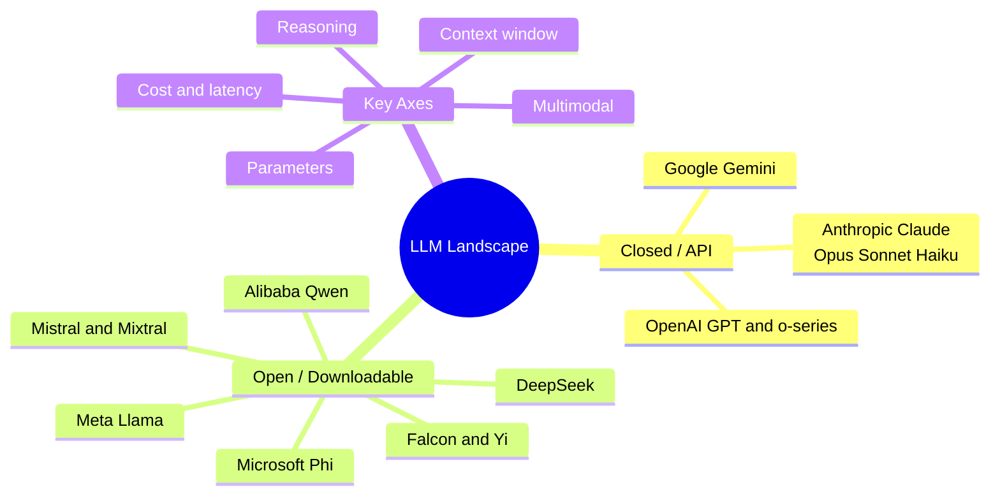
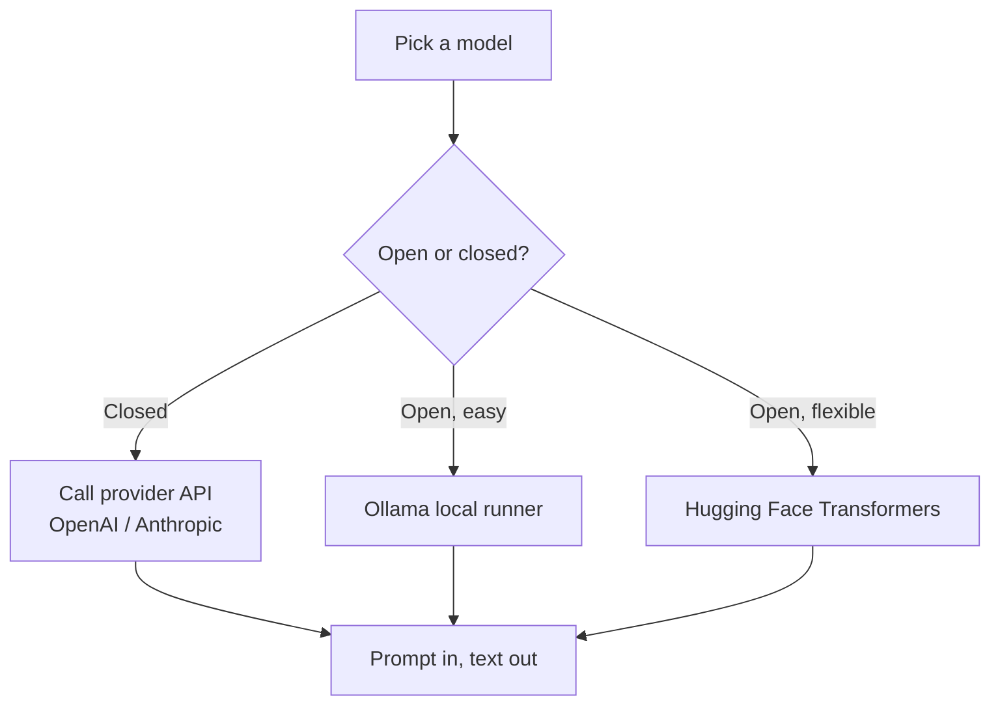

# The LLM Landscape: Model Families, Providers, and How to Choose

There are now dozens of large language models from many organizations, some you call over the internet and some you run on your own machine. They differ in capability, cost, speed, openness, and how much text they can read at once. This guide explains the landscape from the ground up defining each term as it appears and gives a practical framework for choosing the right model, mirroring everything covered in `01_llm_landscape.ipynb`.

---

## First, the Vocabulary

A **large language model (LLM)** is a neural network trained to predict the next **token** (a small chunk of text, roughly a word or word-piece) in a sequence. By predicting tokens one after another, it generates text. A few terms recur throughout this guide:

- **Parameters (weights)** the numbers inside the model that encode everything it has learned. Counts are given in billions (B). More parameters generally means more capability but also more cost and slower responses. Some models keep their parameter count secret.
- **Context window** the maximum number of tokens the model can consider at once, counting both your input and its output. A 128K context window holds roughly 100,000 words enough for a long report; a 1M window can hold an entire book or codebase. This is the model's working memory; anything beyond it is invisible to the model.
- **Multimodal** able to handle more than just text, typically images (and sometimes audio or video) as input.
- **Open vs. closed** whether the model's weights are publicly downloadable (open) or only accessible through a company's API (closed). More on this below.
- **API (Application Programming Interface)** a way for your code to send a request to a provider's servers and get a response back. Closed models are used this way.

---

## How We Got Here: A Brief Evolution

The notebook traces the lineage from a single 2017 idea to today's crowded field:

- **2017 the Transformer.** The "Attention Is All You Need" paper introduced the **Transformer** architecture, the design underneath essentially every modern LLM. Its core mechanism, **attention**, lets the model weigh how much each token should pay attention to every other token, capturing long-range relationships in text.
- **2018-2020 scaling up.** GPT-1, BERT, GPT-2, then GPT-3 (175 billion parameters) showed that making Transformers bigger and feeding them more data produced steadily more capable models.
- **2022 the chat era.** InstructGPT and ChatGPT demonstrated that instruction tuning and human-feedback alignment turn a raw text predictor into a useful assistant. Meta's first LLaMA brought strong open models.
- **2023 the explosion.** GPT-4, LLaMA-2, Mistral, Claude-2, Gemini, Falcon, and Mixtral arrived, splitting the field into competing open and closed families.
- **2024-2025 maturity and reasoning.** Multimodal models (GPT-4o, Claude 3, Gemini 1.5), much longer context windows, dedicated **reasoning models** that "think" before answering, and the current generation the Claude 4.x family, GPT-5, Llama 4, Gemini 2, and DeepSeek's reasoning models.

The throughline: bigger models trained on more data kept getting better, until the frontier broadened from raw capability into efficiency, long context, multimodality, and explicit reasoning.

---

## Open vs. Closed Models

This is the most important fork in the landscape.

**Closed (proprietary, API-only) models** the weights are private; you access the model by sending requests to the provider's servers. Examples: OpenAI's GPT, Anthropic's Claude, Google's Gemini.

- **Pros:** typically the most capable; no infrastructure to manage; the provider handles scaling, updates, and safety.
- **Cons:** you pay per use; your data leaves your machine; you depend on the vendor; you can't inspect or deeply customize the model.

**Open (open-weight) models** the weights are downloadable, so you can run them on your own hardware. Examples: Meta's Llama, Mistral, DeepSeek, Alibaba's Qwen.

- **Pros:** full control and privacy (data never leaves your environment); no per-token fee once you have hardware; you can fine-tune and inspect them; no vendor lock-in.
- **Cons:** you need the hardware and expertise to run them; the largest ones demand serious GPUs; the very top of the capability frontier is usually held by closed models.

A useful mental model: **closed models are like electricity from the grid** (convenient, metered, someone else runs the plant), while **open models are like solar panels on your roof** (upfront effort and equipment, but then it's yours and private).

Mindmap: the LLM landscape by provider and openness.

---

## The Major Model Families

### Anthropic Claude

Claude is Anthropic's family, known for strong coding, careful reasoning, and following nuanced instructions. The current generation is the **Claude 4.x family**, organized into three tiers by the capability/speed/cost trade-off (as shown in the notebook's `claude_models` listing):

- **Claude Opus 4.x** (`claude-opus-4-8`) the **most capable** tier, with the strongest reasoning. Best for the hardest problems where quality matters most.
- **Claude Sonnet 4.x** (`claude-sonnet-4-6`) the **best balance** of intelligence and speed. The workhorse for most production use, especially coding and general reasoning.
- **Claude Haiku 4.x** (`claude-haiku-4-5`) the **fastest and cheapest** tier, for high-volume, latency-sensitive tasks.

This Opus / Sonnet / Haiku naming repeats across generations: Opus = most powerful, Sonnet = balanced, Haiku = fastest. Claude offers a large context window (on the order of 200K tokens, with extended options) and is multimodal (handles images). You call it through the Anthropic API: your code sends a `system` instruction plus a list of `messages` and gets back the model's text reply.

### OpenAI GPT and the "o" reasoning models

OpenAI offers two related lines (from the notebook's `openai_models`):

- **GPT-4o** the flagship general-purpose, multimodal model (text + images), with a 128K context window. Versatile and widely used.
- **GPT-4o-mini** a cheaper, faster version that is good enough for most everyday tasks.
- **The "o" series (o1, o3-mini)** **reasoning models** that internally "think" step by step before producing an answer, trading extra time and cost for much better performance on math, logic, and hard problems.
- **GPT-3.5-turbo** an older, cheapest, fastest option.

You call these through the OpenAI API with a similar `messages` structure (a `system` message setting behavior, then `user` messages). The notebook's later cells reference **GPT-5** as the current frontier generation.

### Google Gemini

Gemini is Google's multimodal family. Its standout feature is **enormous context windows** Gemini 1.5 Pro offered up to **1 million tokens**, making it the go-to for very long documents, large codebases, or even video. Google offers a fast/cheap tier (**Gemini Flash**) and more capable tiers, accessed via Google AI Studio / the Gemini API. The current generation referenced is **Gemini 2**.

### Meta Llama

Llama is the most influential **open** family. Meta releases the weights, which made it the foundation for a huge ecosystem of fine-tuned and community models. Key variants from the notebook:

- **Llama 3.1 405B** a 405-billion-parameter open model with a 128K context window; among the strongest open models, competitive with closed frontier models.
- **Llama 3.1 8B / 3.2 3B / 3.2 1B** smaller members you can actually run on modest hardware (8B for a good local model, 3B and 1B for laptops and mobile).
- **Llama 4** is the current generation.

Because they are open, Llama models are the default choice for **local, private deployment** and for **fine-tuning** your own variant.

### Mistral

Mistral is a European company offering both open and closed models, with a reputation for strong multilingual ability and efficiency:

- **Mistral 7B** a small, open, production-quality model that punches above its weight.
- **Mistral Large** their closed flagship (128K context).
- **Mixtral 8x7B / 8x22B** open **Mixture-of-Experts** models (explained below) that deliver large-model quality at lower active cost.

### DeepSeek

DeepSeek produces powerful **open** models with a focus on math, coding, and reasoning:

- **DeepSeek-V3** a 671-billion-parameter Mixture-of-Experts model.
- **DeepSeek-R1** a dedicated reasoning model, with smaller **distilled** versions (e.g., a 7B variant) that pack much of the reasoning ability into a runnable size.

### Alibaba Qwen

**Qwen2.5** is a strong open family (sizes from 0.5B up to 72B) noted for **multilingual** strength and broad availability, making it popular for non-English and on-device use.

### Microsoft Phi

The **Phi** family (e.g., **Phi-4**, 14B) consists of small models trained on carefully curated, high-quality data proving that smart data can let a small model rival much larger ones, especially on STEM and reasoning. (Covered in depth in the Small Language Models material.)

### Others

The notebook also touches **Falcon** (open, from TII) and **Yi** (from 01.AI) as additional open options, plus **BLOOM** and **Galactica** from the historical timeline.

### Snapshot comparison

This consolidates the notebook's comparison table (parameter counts for closed models are estimates or undisclosed):

| Model | Params | Context | Open? | Notable strength |
|-------|--------|---------|-------|------------------|
| GPT-4o | ~200B (est.) | 128K | No | Multimodal, versatile |
| Claude (Sonnet/Opus 4.x) | Undisclosed | ~200K | No | Coding, reasoning |
| Gemini 1.5 Pro | Undisclosed | 1M | No | Long context |
| Llama 3.1 405B | 405B | 128K | Yes | Strong open model |
| Mistral Large | Undisclosed | 128K | No | European, multilingual |
| Mixtral 8x22B | 141B total | 64K | Yes | MoE, efficient |
| DeepSeek-V3 | 671B total | 128K | Yes | Math, code |
| Qwen2.5 72B | 72B | 128K | Yes | Multilingual |

---

## Two Architectural Ideas Behind the Landscape

### Mixture of Experts (MoE)

A normal ("dense") model runs *every* parameter for *every* token expensive. A **Mixture-of-Experts (MoE)** model instead contains many specialized sub-networks called **experts**, and a small **gating** network routes each token to only a few of them.

- **Mixtral 8x7B** has 8 experts but activates only 2 per token. Its **total** parameter count is ~47B, but only ~13B are **active** on any given forward pass.
- The benefit: you get the knowledge capacity of a large model while paying the compute cost of a much smaller one. This is why MoE models (Mixtral, DeepSeek-V3) are described as "efficient." The distinction between **total parameters** (the model's full size on disk/in memory) and **active parameters** (what actually runs per token) is the key thing to understand about MoE.

### Scaling Laws

**Scaling laws** are empirical formulas describing how model quality improves as you add parameters and training data. The famous **Chinchilla** result found that for a given compute budget, models had been made too big and undertrained and that the **compute-optimal** recipe is to train a model with *N* parameters on roughly **20·N tokens** of data. The practical lesson the notebook draws: *data quantity (and quality) matters as much as parameter count.* This insight directly enabled the small-but-strong models discussed elsewhere.

---

## How You Actually Use These Models

The notebook walks through four access paths:

1. **OpenAI API** for GPT and the "o" models. Send a list of `messages` (a `system` instruction plus `user` turns); receive the reply.
2. **Anthropic API** for Claude. Send a `system` prompt, a `max_tokens` limit, and `messages`; receive the reply. The model is selected by id (e.g., `claude-sonnet-4-6`).
3. **Ollama** a tool for running **open models locally** with one command. You `pull` a model (e.g., `llama3.2`, `mistral`, `phi4`, `gemma2`, `qwen2.5`, `deepseek-r1`) and chat with it entirely on your own machine no internet, no per-token cost, full privacy.
4. **Hugging Face Transformers** a Python library to load essentially **any open model** from the Hugging Face Hub directly into your code, giving maximum flexibility (and requiring the hardware to run it). The notebook lists loadable instruct models from Llama, Mistral, Mixtral, Phi, Gemma, Qwen, DeepSeek, Falcon, and Yi.

The pattern to notice: **closed models → call an API; open models → run locally via Ollama (easy) or Transformers (flexible).** All of them ultimately take a prompt and return generated text; the differences are where the model lives and who pays for the compute.

Diagram: how access path follows from whether a model is closed or open.

---

## Choosing a Model: The Trade-Offs

No single model is best at everything. Selection is about balancing capability, cost, latency, context length, privacy, and modality.

### Cost and latency

- **Latency** is how long you wait for a response. Bigger models and reasoning models are slower. Speed-tier models (Haiku, GPT-4o-mini, Gemini Flash) answer fastest.
- **Cost** for API models is charged **per token**, usually split into a (cheaper) input-token price and a (pricier) output-token price, quoted per 1,000 or per million tokens. Smaller/cheaper tiers can be many times less expensive than flagships for the same task so don't pay for a flagship when a mini model suffices.
- **Local/open models** have near-zero marginal cost after you own the hardware, but you pay upfront in equipment and setup.
- **Reasoning models** cost and wait more because they generate hidden "thinking" tokens worth it for hard problems, wasteful for simple ones.

### Context window

Pick a context window large enough for your longest input. For analyzing book-length documents or whole codebases, the very-long-context models (Gemini's 1M, Claude's ~200K) matter; for short chats, even a small window is fine. Bigger context also costs more (more input tokens) and can slow responses.

### Capability vs. task fit

Match the model to the job rather than always grabbing the most powerful one. The notebook's selection guide, generalized:

| Task | Good fit |
|------|----------|
| General chat / reasoning | Claude Sonnet, GPT-4o |
| Coding | Claude Sonnet, GPT-4o, DeepSeek-Coder |
| Math / hard reasoning | Reasoning models (o-series, DeepSeek-R1), Claude |
| Very long documents (>100K tokens) | Gemini Pro, Claude Opus |
| Cost-efficient / high-volume | GPT-4o-mini, Claude Haiku, Gemini Flash |
| Local / private | Llama 8B, Mistral 7B (via Ollama) |
| Local but powerful | Llama 70B+, Mixtral |
| Multilingual | Qwen2.5, Gemini, Claude |
| Image understanding | GPT-4o, Claude, Gemini |
| Embeddings | dedicated embedding models (e.g., text-embedding-3, bge, e5) |
| Base model for fine-tuning | Llama 8B, Mistral 7B, Phi-4 (open, runnable, customizable) |

(Note: an **embedding model** is a specialized model that converts text into a vector of numbers capturing its meaning used for search and RAG rather than for generating text. It's a different tool from the chat models above.)

### How to compare models objectively

Because every provider claims to be best, the notebook points to neutral, public comparisons:

- **LMSYS Chatbot Arena** ranks models by blind head-to-head human votes.
- **Open LLM Leaderboard** benchmark scores for open models.
- **Artificial Analysis** compares quality alongside real-world **speed and price**, which is exactly the trade-off space you're choosing within.

---

## Summary

- The field splits into **closed/API models** (most capable, metered, your data leaves your machine GPT, Claude, Gemini) and **open/downloadable models** (private, controllable, run-it-yourself Llama, Mistral, DeepSeek, Qwen).
- **Anthropic's Claude 4.x** family tiers as **Opus** (most capable) / **Sonnet** (balanced) / **Haiku** (fastest); **OpenAI** offers GPT plus dedicated **reasoning** "o" models; **Google's Gemini** leads on **context length** (up to 1M tokens); **Meta's Llama** anchors the open ecosystem.
- **Mixture-of-Experts** models (Mixtral, DeepSeek-V3) get big-model quality at small-model compute by activating only a few experts per token; **scaling laws** (Chinchilla) showed data matters as much as size.
- Access closed models via **APIs** and open models via **Ollama** (easy local) or **Hugging Face Transformers** (flexible).
- Choosing a model means balancing **capability, cost (per-token), latency, context window, privacy, and modality** match the model to the task, use neutral leaderboards to compare, and don't pay flagship prices when a cheaper tier or a local model will do.
