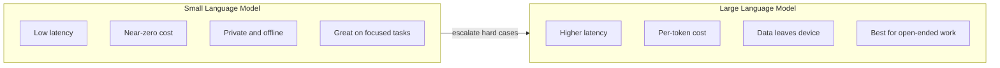
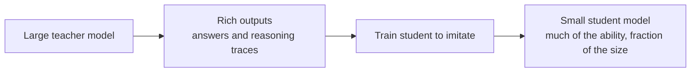

# Small Language Models (SLMs)

Not every job needs a giant model. A growing class of **Small Language Models (SLMs)** delivers strong results while being cheap enough to run on a laptop, a phone, or an embedded device no internet, no per-token fee, and no data leaving the machine. This guide builds the idea from scratch, defines each term as it appears, and covers everything in `01_small_language_models.ipynb`: what SLMs are, why they matter, the techniques that make them practical (quantization, distillation, speculative decoding), the main model families, and where to use them.

---

## What Is a Small Language Model?

A **language model** predicts the next **token** a small chunk of text, roughly a word or word-piece and by doing so repeatedly, generates text. The model's "size" is measured by its **parameter count**: the number of internal numbers (**weights**) it learned during training, given in billions (B) or millions (M).

A **Small Language Model (SLM)** is, per the notebook's definition, simply a language model **under roughly 10 billion parameters**, designed to run efficiently on consumer hardware, mobile devices, and **edge** environments. ("Edge" means running computation on the local device your laptop, phone, or a sensor rather than on a remote server in the cloud.)

The contrast with a **Large Language Model (LLM)** tens to hundreds of billions of parameters, usually accessed over the internet via an API is not about a hard line in the sand but about a set of trade-offs.

---

## Why Small Models Matter

The notebook frames SLMs against large LLMs across five factors:

| Factor | SLMs | Large LLMs |
|--------|------|------------|
| **Latency** (response delay) | Under ~100 ms, running locally | 200-2000 ms over an API |
| **Cost** | Near-zero after setup | ~$0.001-$0.06 per 1,000 tokens |
| **Privacy** | Fully local data never leaves the device | Data is sent to the provider |
| **Offline** | Works with no internet | Requires a connection |
| **Quality** | Excellent on focused tasks | Better for open-ended, general work |

Unpacking why each matters:

- **Latency** because the model runs on your own device, there's no network round-trip. A local SLM can start responding in well under a tenth of a second, which feels instant. This is essential for interactive features (autocomplete, on-device assistants).
- **Cost** an API charges **per token** of input and output. At scale, that adds up. A local SLM costs essentially nothing per query once you have the hardware; the only cost is the upfront setup.
- **Privacy** with a cloud LLM, your prompt (and any sensitive data in it) travels to a third party. With a local SLM, the data **never leaves the device**, which is decisive for healthcare, legal, financial, or personal data.
- **Offline** a local model keeps working on a plane, in a remote location, or in a secure facility with no internet.
- **Quality** this is the honest trade-off. A big general model is better at open-ended, do-anything tasks. But for a **specific, well-defined task**, a small model especially a fine-tuned one can be excellent and entirely good enough.

The strategic takeaway: SLMs trade a bit of general capability for huge wins in speed, cost, privacy, and independence. For many real applications classification, extraction, summarization of short text, on-device assistants that trade is well worth it.

Diagram: the small-versus-large trade-off across the factors that matter.

---

## The Techniques That Make SLMs Practical

Three ideas let small models exist and run efficiently. The first two shrink a model; the third uses a small model to speed up a large one.

### Distillation

**Knowledge distillation** is how you create a capable small model. The idea: train a small model (the **student**) to imitate a large, capable model (the **teacher**). Rather than learning only from raw data, the student learns from the teacher's richer outputs effectively compressing the teacher's "knowledge" into a fraction of the size.

The notebook's example is **DeepSeek-R1 distilled**: a small (e.g., 7B) model trained to mimic a much larger reasoning model, capturing a large share of its reasoning ability at a runnable size. Distillation is the bridge between "a giant model is smart" and "a small model can be smart too." Microsoft's **Phi** family takes a related path training small models on extremely high-quality, carefully curated data so a 3.8B or 14B model rivals far larger ones on STEM and reasoning.

Diagram: distillation compresses a large teacher's knowledge into a small student.

### Quantization

**Quantization** means storing the model's numbers with **fewer bits of precision** to make it smaller and faster. A weight is normally a 16- or 32-bit floating-point number; quantization rounds each weight down to, say, a **4-bit** value. This shrinks the model roughly 4× (going from 16-bit to 4-bit) and speeds it up, at the cost of a small amount of precision.

This is the single most important technique for running models on modest hardware it's often what lets a model fit in your RAM at all. The notebook covers the practical formats:

- **GGUF** the dominant file format for running quantized models on a **CPU** (via the popular `llama.cpp` engine). It comes in graded quality levels, which directly trade size against accuracy:

  | Level | Meaning |
  |-------|---------|
  | **Q2_K** | Smallest, lowest quality |
  | **Q4_K_M** | Recommended good balance of quality and size (4-bit) |
  | **Q5_K_M** | Better quality, larger |
  | **Q8_0** | Near full precision, largest quantized option (8-bit) |
  | **F16** | Full 16-bit float (not quantized) |

  The practical advice from the notebook: **Q4_K_M** is the recommended default small enough to run comfortably, accurate enough for real use.

- The notebook references the **LLM.int8()** paper, foundational work showing how to quantize to 8-bit with little quality loss the research that made aggressive quantization mainstream.

A note on the GGUF loading example: parameters like `n_ctx` set the **context window** (how many tokens the model can hold at once, e.g., 4096), `n_threads` sets how many CPU cores to use, and `n_gpu_layers` controls how much of the model runs on a GPU (`0` = CPU only, `-1` = put all layers on the GPU). This is the knob that lets the same model run on hardware ranging from a pure-CPU server to a GPU laptop.

### Speculative Decoding

**Speculative decoding** is a clever way to make a **large** model run faster *using* a small one. Normally a large model generates one token at a time, each requiring a full, slow pass through the network. Speculative decoding splits the work:

1. A small, fast **draft model** cheaply proposes the next *K* tokens.
2. The large **target model** checks all *K* proposed tokens **in a single pass** (verifying is much cheaper than generating one-by-one).
3. The system **accepts** the proposed tokens up to the first place the target disagrees, then continues from there.

Because the small model does the cheap guessing and the big model only verifies, you get the **large model's quality at higher speed** the notebook cites a typical **2-3× speedup with minimal quality loss**. The speedup depends on the **acceptance rate** (how often the draft model's guesses are correct): the better the small model predicts what the big one would say, the bigger the win. This is a neat illustration that small models are useful not only on their own but as accelerators for large ones.

---

## The Small-Model Landscape

The notebook surveys the main families. Notice the spread from a 360-million-parameter model that fits on a phone up to a 14B model for serious STEM work:

| Model | Params | Creator | Key strength |
|-------|--------|---------|--------------|
| **Phi-4** | 14B | Microsoft | STEM, reasoning |
| **Phi-3.5-mini** | 3.8B | Microsoft | Tiny but powerful |
| **Gemma 2 9B** | 9B | Google | Quality-to-size ratio |
| **Gemma 2 2B** | 2B | Google | Edge deployment |
| **Llama 3.2 3B** | 3B | Meta | Strong baseline |
| **Llama 3.2 1B** | 1B | Meta | Mobile-ready |
| **SmolLM2 1.7B** | 1.7B | Hugging Face | Smallest *useful* model |
| **SmolLM2 360M** | 360M | Hugging Face | On-device |
| **Qwen2.5 3B** | 3B | Alibaba | Multilingual |
| **Qwen2.5 0.5B** | 0.5B | Alibaba | Embedded systems |
| **TinyLlama 1.1B** | 1.1B | TinyLlama | Research |
| **Mistral 7B** | 7B | Mistral | Production-quality |

A few themes:

- **Microsoft Phi** punches far above its weight thanks to curated training data Phi-4 (14B) targets reasoning and STEM, Phi-3.5-mini (3.8B) is remarkably capable for its size.
- **Google Gemma 2** comes in a 9B "best quality per parameter" version and a 2B version aimed squarely at edge devices.
- **Meta Llama 3.2** offers a 3B "strong baseline" and a 1B "mobile-ready" model small enough to run on a phone.
- **Hugging Face SmolLM2** explores the extreme small end: 1.7B (about the smallest size that's still genuinely useful) and 360M (truly on-device).
- **Alibaba Qwen2.5** scales down to 0.5B for embedded use and is noted for multilingual strength.
- **Mistral 7B** sits at the top of the "small" range and is regarded as production-quality.

---

## Running SLMs: The Tooling

Because SLMs are meant to run *on your own hardware*, the notebook walks through several runtimes, each suited to a different platform:

- **Hugging Face Transformers** the general-purpose Python library to load any of these models directly (e.g., in 16-bit) for generation. Maximum flexibility; needs a decent GPU for the larger SLMs.
- **llama.cpp / GGUF** the most common way to run an SLM on a **CPU**. You download a quantized GGUF file and run it with `llama-cpp-python`. This is what lets a model run on a machine with no GPU at all.
- **ONNX Runtime GenAI** an inference engine optimized for **edge and mobile** deployment, using the cross-platform ONNX model format (the notebook's example runs Phi-3.5-mini in ONNX form). Good for shipping a model inside an app on varied hardware.
- **MLX** Apple's framework for running models efficiently on **Apple Silicon** (M-series Macs), using the Mac's GPU at full speed. The notebook notes a 4-bit Llama 3.2 3B reaching ~100 tokens/second on an M2.

The notebook also points to friendly end-user tools: **Ollama** (the easiest one-command local runner) and **LM Studio** (a graphical app for running local models without code).

The pattern: pick the runtime that matches your hardware Transformers for a GPU workstation, GGUF/llama.cpp for CPU-only, ONNX for mobile/edge apps, and MLX for Apple machines.

---

## When to Use an SLM (and When Not To)

Pulling the trade-offs into practical guidance.

**Reach for an SLM when:**

- The task is **specific and well-defined** (classification, extraction, formatting, short summarization) a small or fine-tuned model handles it excellently.
- **Privacy is non-negotiable** keep all data on-device.
- You need **low latency** for interactive, real-time features.
- You operate at **high volume** where per-token API costs would dominate.
- You need to work **offline** or on **edge/mobile** hardware.

**Prefer a large model when:**

- The task is **open-ended and varied**, demanding broad world knowledge or complex multi-step reasoning.
- Top-tier quality matters more than cost, speed, or privacy.
- You don't have (or don't want to manage) local hardware.

A common, powerful pattern is to **combine** them: use a small local model for the bulk of simple, frequent, or privacy-sensitive work, and **escalate** only the genuinely hard cases to a large model or use a small model as a **draft model** to speed up a large one via speculative decoding. SLMs aren't a downgrade; they're the right tool whenever speed, cost, privacy, or offline operation matter more than raw open-ended capability.

---

## Summary

- **SLMs** are language models under ~10B parameters built to run efficiently on consumer, mobile, and edge hardware trading some general capability for major gains in **latency, cost, privacy, and offline operation**.
- **Distillation** trains a small *student* to imitate a large *teacher*, packing big-model knowledge into a small model (e.g., DeepSeek-R1 distilled; Phi's curated-data approach).
- **Quantization** stores weights in fewer bits (e.g., 4-bit) to shrink and speed up models the **GGUF** format's levels (Q4_K_M is the recommended balance) let the same model run on CPU-only or GPU hardware.
- **Speculative decoding** uses a fast small *draft* model to propose tokens and a large *target* model to verify them, yielding a 2-3× speedup at the large model's quality.
- Strong small families span 360M to 14B parameters **Phi**, **Gemma 2**, **Llama 3.2**, **SmolLM2**, **Qwen2.5**, **Mistral 7B** run via **Transformers**, **llama.cpp/GGUF**, **ONNX Runtime**, **MLX**, or friendly tools like **Ollama** and **LM Studio**.
- Use an SLM for specific, private, low-latency, high-volume, or offline tasks; use (or escalate to) a large model for open-ended, knowledge-heavy work and combine both for the best of each.
