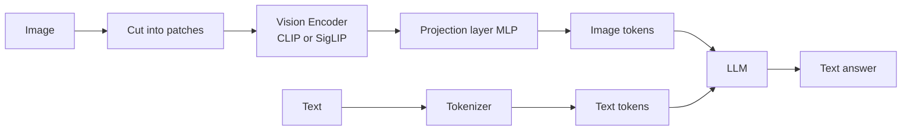
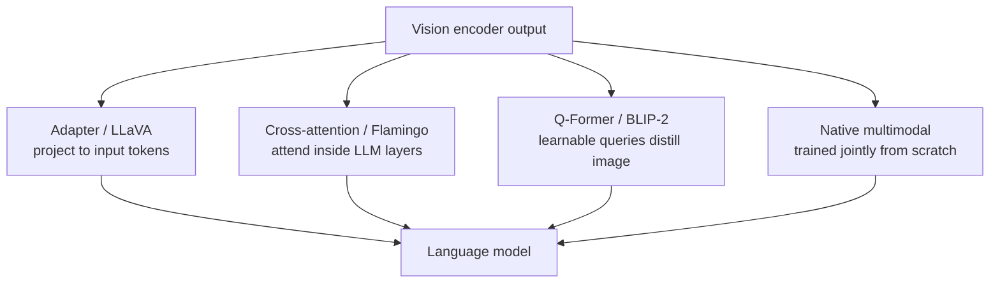

# Vision Language Models (VLMs)

A **Vision Language Model (VLM)** is an AI system that can look at images *and* read text at the same time, then reason and respond in natural language about both. If a plain large language model (LLM) is a system that only consumes and produces text, a VLM extends that ability to a second sense: sight. You can show it a photo, a screenshot, a scanned invoice, or a diagram, ask a question in words, and get a worded answer that takes the picture into account.

This guide builds the idea from the ground up: what an image even *is* to a model, how a picture gets turned into the same kind of internal representation that words use, the main ways vision and language are stitched together, what VLMs can do, and the landscape of real models you will encounter.

---

## 1. The Core Problem: Images and Text Speak Different Languages

To understand VLMs, you first need two foundational terms.

- A **token** is a small chunk of text roughly a word or part of a word ("cat", "ing", "the"). LLMs do not read raw letters; they read sequences of tokens, each identified by a number.
- An **embedding** is a list of numbers (a *vector*) that represents the *meaning* of something in a way math can work with. Two things with similar meaning get similar vectors. A language model converts each token into an embedding, then does all its "thinking" by manipulating these vectors.

The challenge: a language model only knows how to process embeddings that came from text. An image is not text it is a grid of pixels, each pixel just a few numbers describing color. The entire job of a VLM is to **turn an image into embeddings that live in the same space as text embeddings**, so the language model can treat the picture as if it were just more "words" in the conversation.

> Analogy: imagine a brilliant translator who only speaks French (the LLM, which only "speaks" text embeddings). You want them to discuss a painting. You can't hand them the painting directly they can't read it. So you hire an art expert (the vision encoder) who studies the painting and writes a rich French description in the exact vocabulary the translator understands. Now the translator can reason about the art fluently. The VLM's "image-to-embedding" machinery is that art expert.

---

## 2. How an Image Becomes Tokens / Embeddings

### Step 1 Patches

A model cannot digest a whole high-resolution image at once, so the image is sliced into a grid of small squares called **patches** (for example, 16×16 pixels each). Each patch is treated like a "visual word." An image is therefore turned into a *sequence of patches*, much like a sentence is a sequence of words.

### Step 2 The Vision Encoder

The **vision encoder** is a neural network whose job is to look at each patch (and how patches relate to each other) and produce an embedding vector for each one. These vectors capture visual meaning: "this patch is part of a furry ear," "this region looks like printed text," "this is sky." The most common vision encoders in modern VLMs are:

- **CLIP** (Contrastive Language-Image Pre-training, OpenAI, 2021): trained on hundreds of millions of image-caption pairs so that an image's embedding lands close to the embedding of its text description. This is crucial CLIP was *deliberately* trained to align images with language, which makes its image embeddings already "text-flavored" and easy to fuse with an LLM.
- **SigLIP**: a refined successor to CLIP using a different training objective (a sigmoid loss) that often gives cleaner, more stable image embeddings.

The key idea behind CLIP-style training is **contrastive learning**: show the model many (image, caption) pairs and push matching pairs together in embedding space while pushing mismatched pairs apart. The result is a vision encoder whose outputs already partly "understand" language.

### Step 3 Projection Into the Language Model's Space

Even after the vision encoder, the image embeddings may not be in *exactly* the format the LLM expects (wrong size, wrong "dialect" of vectors). A small adapter network typically a **projection layer**, often just a multi-layer perceptron (MLP, a simple stack of neural-network layers) reshapes the vision embeddings so they slot perfectly into the LLM's token stream.

After projection, those image vectors are effectively **image tokens**: they sit in the sequence right alongside the text tokens, and the LLM processes the whole mixed sequence as one. This is why, in many open-source VLMs, prompts contain a literal placeholder like `<image>` it marks the spot in the text where the image tokens are spliced in.

So the full pipeline for the most common VLM style is:

```
Image → cut into patches → Vision Encoder (CLIP/SigLIP) → Projection Layer (MLP) → image tokens
Text  → tokenizer → text tokens
                         ↓
        [image tokens + text tokens] → LLM → text answer
```

Diagram: an image and text are converted into a shared token stream the LLM reads together.



---

## 3. How Vision and Text Are Fused: The Four Architecture Patterns

There is more than one way to connect "seeing" to "language." The notebook lays out four families. They differ mainly in *where* and *how* the image information meets the language model.

### Pattern 1 Adapter-based (LLaVA style)

This is the simplest and most popular approach, described above.

```
Image → Vision Encoder → Projection (MLP) → LLM
Text  ──────────────────────────────────→ LLM
```

The image embeddings are projected into the LLM's input and simply prepended/inserted as tokens. The LLM and vision encoder are often pre-existing, and only the lightweight projection adapter (and sometimes the LLM) needs training. **LLaVA** (Liu et al., 2023) popularized this recipe and showed you can get a strong VLM cheaply by gluing a frozen vision encoder to an existing LLM with a small adapter.

- **Strength:** cheap, modular, easy to build on top of any LLM.
- **Trade-off:** the LLM only sees the image as a fixed batch of tokens up front; it cannot "look again" at specific layers.

### Pattern 2 Cross-Attention (Flamingo style)

```
Image → Vision Encoder → Cross-Attention Layers → LLM
Text  ───────────────────────────────────────→ LLM
```

Instead of inserting image tokens at the input, special **cross-attention** layers are added *inside* the LLM. **Attention** is the mechanism by which a model decides which other tokens to "pay attention to" when processing a given token. **Cross-attention** lets each text position reach over and attend to the image features at multiple depths of the network. **Flamingo** (Alayrac et al., 2022, DeepMind) pioneered this, and it is especially good at handling several images interleaved with text.

- **Strength:** the language layers can repeatedly consult the image at many depths; handles multiple/interleaved images well.
- **Trade-off:** more complex, requires modifying the LLM's internals.

### Pattern 3 Q-Former (BLIP-2 style)

```
Image → Frozen Vision Encoder → Q-Former (learnable queries) → Frozen LLM
```

**BLIP-2** (Li et al., 2023, Salesforce) keeps *both* the vision encoder and the LLM frozen (untrained) to save cost, and trains only a small bridge called the **Q-Former** (Querying Transformer). The Q-Former holds a fixed set of **learnable query vectors** think of them as a handful of smart "questions" that probe the image and distill it down to a compact set of the most useful embeddings. Those distilled vectors are then fed to the LLM.

- **Strength:** very efficient only the tiny Q-Former is trained; compresses an image into just a few highly informative tokens.
- **Trade-off:** the bottleneck of "a few queries" can lose fine detail.

### Pattern 4 Native Multimodal (Gemini, GPT-4o style)

```
All modalities processed jointly from pretraining
```

The most powerful modern approach. Rather than bolting vision onto a finished text model, the model is trained **from the very beginning** on a mixture of text, images (and sometimes audio and video) together. There is no separate "glue stage" vision and language understanding grow up entangled. **GPT-4o** (OpenAI) and **Gemini** (Google) are built this way.

- **Strength:** deepest, most seamless multimodal understanding; can also handle video and audio.
- **Trade-off:** enormously expensive to train; only feasible for large labs.

| Pattern | Example | What is trained | Key trait |
|---|---|---|---|
| Adapter | LLaVA | small projection (+ maybe LLM) | simple, modular, cheap |
| Cross-attention | Flamingo | cross-attn layers | multi-image, attends at depth |
| Q-Former | BLIP-2 | small Q-Former only | very efficient, compresses image |
| Native multimodal | GPT-4o, Gemini | the whole model, jointly | deepest fusion, also video/audio |

Diagram: the four ways vision is connected to a language model.



---

## 4. What VLMs Can Do (Capabilities)

Because a VLM merges sight with a language model's reasoning, it inherits a wide range of abilities:

- **Image description / captioning** Look at a picture and produce a sentence or paragraph describing it ("A golden retriever catching a frisbee in a park"). A *detailed caption* goes further, describing background, mood, and relationships between objects.
- **Visual Question Answering (VQA)** Answer free-form questions *about* an image: "How many people are wearing hats?", "What color is the car on the left?", "Is the traffic light red?" This is the flagship VLM skill because it requires both perception and reasoning.
- **OCR (Optical Character Recognition)** Read text that appears *inside* an image: signs, labels, handwriting, screenshots. Modern VLMs do this without a separate OCR engine, reading the text as part of understanding the picture.
- **Document understanding** Go beyond reading raw text to interpreting the *structure* of a document: tables, forms, invoices, receipts, charts. The model can extract specific fields ("What is the total amount on this invoice?") or summarize a scanned report. This is where Claude and Qwen2-VL particularly shine.
- **Object detection & grounding** Identify *where* objects are, often returning bounding-box coordinates ("the dog is at this region"). Models like Florence-2 specialize here.
- **Image-based reasoning** Chains of logic grounded in visual evidence: reading a chart and computing a trend, solving a geometry problem from a diagram, or debugging a UI from a screenshot.

In the notebook's example code, the same simple pattern recurs across providers: send an image plus a question, get text back. For example, a `query_..._vision(image, question)` function passes both the image and a worded question ("What do you see in this image?") and receives a natural-language answer that single interface covers captioning, VQA, OCR, and document tasks depending only on what you ask.

### How images are passed to a VLM in practice

Two delivery methods appear in the notebook:

1. **Base64 encoding** the image file's raw bytes are converted into a long text string (base64 is a way of writing binary data using only ordinary characters) and embedded directly in the request. Used when the image lives on your machine.
2. **URL** you give the model a web link to the image and it fetches it.

Either way, the request bundles the image content together with a text question, and the model returns a worded response.

---

## 5. The VLM Landscape: Example Models

The notebook surveys the major VLMs in use today. They span closed commercial APIs and open-source models you can download and run yourself.

| Model | Size | Creator | Specialty |
|---|---|---|---|
| **GPT-4o** | ~200B (est.) | OpenAI | Strong all-around, native multimodal |
| **Claude (Opus / Sonnet 4.x family)** | undisclosed | Anthropic | Excellent document & chart understanding |
| **Gemini 1.5 Pro** | undisclosed | Google | Long context, video understanding |
| **LLaVA-NeXT** | 7-72B | community (Haotian Liu et al.) | Open-source pioneer of the adapter recipe |
| **InternVL2** | 2-108B | Shanghai AI Lab | State-of-the-art open model |
| **Qwen2-VL** | 2-72B | Alibaba | Strong document OCR |
| **PaliGemma 2** | 3-28B | Google | Open, versatile, easy to fine-tune |
| **Phi-3.5-Vision** | 4.2B | Microsoft | Small "edge" VLM for low-resource devices |
| **BLIP-2** | ~7B | Salesforce | The Q-Former architecture |
| **Florence-2** | 0.2-0.8B | Microsoft | Tiny; detection + captioning + OCR in one |

A few notes on the commercial vs. open split:

- **Commercial APIs (GPT-4o, Claude, Gemini)** are accessed over the internet. You send your image and prompt; the provider runs the model. The Claude family today is the **Claude Opus / Sonnet 4.x** generation Opus being the most capable and Sonnet the balanced workhorse and is especially regarded for reading documents, tables, and charts accurately. (The notebook's older code references an earlier model id; the current, recommended choices are the Opus and Sonnet 4.x models.)
- **Open-source models (LLaVA, InternVL2, Qwen2-VL, PaliGemma, Phi-3.5-Vision, Florence-2)** can be downloaded and run locally. In the notebook, these are loaded through the **Hugging Face Transformers** library, which provides a standard way to fetch a model and its **processor** (the helper that turns an image + prompt into the exact tensors the model expects). The pattern is always: load model + processor, open the image, give a text instruction, generate text.

### Florence-2's task tokens

Florence-2 deserves a special mention because it shows how *one* model can do many vision jobs by changing only a special instruction token at the start of the prompt:

- `<CAPTION>` → a short caption
- `<DETAILED_CAPTION>` → a rich description
- `<OD>` → object detection (boxes + labels)
- `<DENSE_REGION_CAPTION>` → describe many regions
- `<OPEN_VOCABULARY_DETECTION>` → find arbitrary named objects
- `<SEGMENTATION>` → outline object shapes precisely
- `<OCR>` → read text in the image

The same image fed with different task tokens yields captioning, detection, or OCR a compact illustration that "what you ask" steers a VLM as much as the image itself.

---

## 6. Putting It All Together

A VLM is, at heart, a language model that has been given eyes. The eyes are a **vision encoder** (often CLIP or SigLIP) that turns an image into patch embeddings; a **projection/adapter** (or cross-attention, or a Q-Former, or joint native training) then aligns those embeddings with the model's text space so the picture becomes a stretch of **image tokens** flowing through the LLM alongside words. Once unified, the model's ordinary language reasoning can describe scenes, answer questions about them, read text off them, and interpret documents all driven by a plain-language prompt.

The four architectures (adapter, cross-attention, Q-Former, native) are different engineering answers to the same single question: *how do we let a text model see?* And the model zoo from the giant native-multimodal GPT-4o, Gemini, and Claude Opus/Sonnet 4.x down to the 0.2B Florence-2 shows that this capability now exists at every scale, from massive cloud APIs to models small enough to run on a laptop or phone.

### Further reading (from the notebook)

- **LLaVA** (Liu et al., 2023) the adapter recipe
- **BLIP-2** (Li et al., 2023) the Q-Former
- **Flamingo** (Alayrac et al., 2022) cross-attention
- **CLIP** (Radford et al., 2021) image-text alignment by contrastive learning
- **PaliGemma 2**, **Florence-2**, **Qwen2-VL** recent open VLM papers
