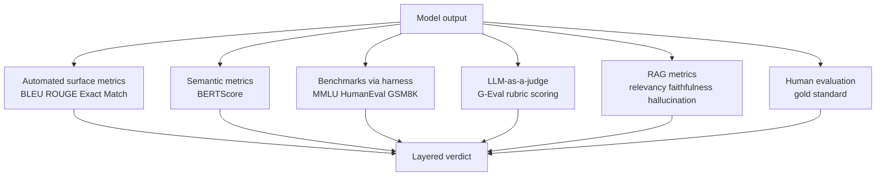
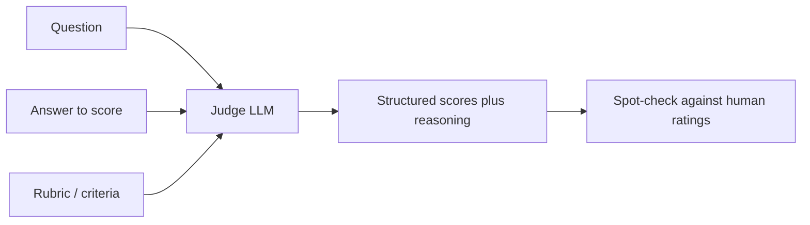

# LLM Evaluation: Metrics, Benchmarks & Frameworks

**Evaluation** means measuring how good a model's outputs are. For most software this is easy: a function either returns the right number or it doesn't. For a **large language model (LLM)** an AI system that generates free-form text it is surprisingly hard, because there is rarely one single "correct" answer. This guide builds up, from scratch, the main ways people measure LLM quality: automated text metrics, standardized benchmarks, using one LLM to judge another, human evaluation, and special metrics for retrieval-augmented and hallucination-prone systems.

---

## 1. Why Evaluation Is Hard

The notebook opens with the core difficulties, and they motivate everything that follows:

- **Outputs are open-ended.** Ask "Summarize this article" and there are countless equally-good summaries. There is no single reference to check against, unlike "What is 2+2?"
- **Human evaluation is the gold standard but slow and expensive.** Asking people to rate outputs gives the most trustworthy judgment, but it doesn't scale to thousands of test cases or every code change.
- **Automated metrics correlate imperfectly with quality.** The fast, cheap numeric scores we *can* compute often disagree with what humans actually think is good.
- **Models can overfit to benchmarks ("benchmark contamination").** If a test's questions and answers leaked into a model's training data, the model can score high by *memorization* rather than ability making the benchmark a misleading measure. This is also called *benchmark/data contamination*.
- **Different tasks need different metrics.** A good metric for translation is wrong for code generation, which is wrong for open-ended chat. No single number captures "quality."

These tensions open-endedness, cost, weak correlation, contamination, and task-dependence are why LLM evaluation is a whole discipline rather than a single score.

Diagram: the layered LLM evaluation pipeline, cheap-and-fast at the top, slow-and-trusted at the bottom.

---

## 2. Automated Text Metrics

These metrics compare a model's generated text (the **hypothesis** or *candidate*) against one or more known-good **reference** answers, and produce a number automatically. First, two building-block terms:

- An **n-gram** is a sequence of *n* consecutive words. A 1-gram (unigram) is one word; a 2-gram (bigram) is a word pair like "the cat"; and so on. Many text metrics work by counting how many n-grams the candidate and reference share.
- **Precision** vs. **recall**: precision asks "of the things I produced, how many were correct?"; recall asks "of the correct things that existed, how many did I produce?"

### BLEU (Bilingual Evaluation Understudy)

**BLEU** measures **n-gram precision** of the n-grams in the generated text, how many also appear in the reference. It was designed for machine translation. It combines precision across several n-gram sizes (1- through 4-grams) and multiplies in a **brevity penalty** a factor that punishes outputs that are too short (otherwise a model could game precision by emitting one or two safe words). A higher BLEU (closer to 1) means closer surface match to the reference.

- **Weakness:** BLEU only rewards *exact word matches*. A perfectly good paraphrase that uses synonyms scores poorly. In the notebook, "The cat sat on the mat near the window" vs. "A cat was sitting on a mat by the window" clearly the same meaning earns a tiny BLEU of about **0.056**, because few exact n-grams line up.
- A practical note: because raw BLEU can collapse to zero when some n-gram size has no matches, a **smoothing function** is applied to avoid harsh zeros.

### ROUGE (Recall-Oriented Understudy for Gisting Evaluation)

**ROUGE** is BLEU's mirror image, built for summarization: it measures **recall** of the n-grams in the *reference*, how many appear in the generated text. The notebook computes three common variants:

- **ROUGE-1**: overlap of single words (unigrams).
- **ROUGE-2**: overlap of word pairs (bigrams).
- **ROUGE-L**: based on the **longest common subsequence** the longest run of words appearing in the same order in both texts (not necessarily contiguous), which rewards preserving word order.

ROUGE reports precision, recall, and **F1** (the harmonic mean balancing precision and recall). On the same cat/window example, ROUGE-1 F1 is about **0.53** much more forgiving than BLEU's 0.056, because it counts shared words regardless of exact positioning.

### BERTScore

Both BLEU and ROUGE share a fatal flaw: they only see *surface* word overlap, blind to meaning. **BERTScore** fixes this by using **embeddings** vector representations of meaning produced by a language model (here, BERT) where similar meanings yield similar vectors. Instead of matching exact words, BERTScore matches each word in the candidate to the *most similar* word in the reference *by embedding similarity*, then aggregates. Two sentences that share *meaning* but no words can still score high.

The notebook's illustrative example: "The weather is nice today" vs. "It's a beautiful sunny day" share almost no words (BLEU ≈ 0.1) yet BERTScore F1 is about **0.87**, correctly recognizing they mean the same thing.

| Metric | What it measures | Sees meaning? | Best for |
|---|---|---|---|
| BLEU | n-gram **precision** + brevity penalty | No (surface) | Translation |
| ROUGE | n-gram **recall** (incl. longest common subsequence) | No (surface) | Summarization |
| BERTScore | **embedding** similarity of words | Yes (semantic) | Paraphrase-tolerant comparison |
| Exact match | Is the output identical to the answer? | No | Short factual / structured answers |

### Exact Match and Perplexity (related concepts)

Two more metrics worth naming:

- **Exact Match (EM)**: the strictest metric the output is scored 1 only if it *exactly* equals the reference answer, else 0. Useful for tasks with a single short correct answer (a fill-in-the-blank fact, a multiple-choice letter), useless for open-ended generation.
- **Perplexity**: a measure of how "surprised" a language model is by a piece of text roughly, how uncertain it was when predicting each next word. Lower perplexity means the model found the text more predictable/fluent. It's an intrinsic measure of a model's fluency on data, computed without any reference answer, but it captures *fluency*, not *correctness or helpfulness*, so it's a poor proxy for task quality.

---

## 3. Key Benchmarks

A **benchmark** is a standardized, shared test set a fixed collection of questions with known answers that everyone uses to compare models on equal footing. Reporting a model's score on a famous benchmark is how the field tracks progress. The notebook catalogs the major ones:

| Benchmark | What it tests | Size |
|---|---|---|
| **MMLU** | Broad knowledge across 57 subjects (history, law, medicine, math…) | ~15K questions |
| **HumanEval** | Generating correct Python code from a description | 164 problems |
| **GSM8K** | Grade-school math word problems | 8.5K problems |
| **MATH** | Hard competition-level math | 12.5K problems |
| **HellaSwag** | Commonsense picking the sensible sentence ending | 70K examples |
| **ARC-Challenge** | Grade-school science questions (the hard subset) | 1.17K questions |
| **TruthfulQA** | Resisting common misconceptions / not stating falsehoods | 817 questions |
| **GPQA** | PhD-level "Google-proof" science questions | 448 questions |
| **SWE-bench** | Resolving *real* GitHub software issues | 2294 issues |

Note the spread: knowledge (MMLU, GPQA), reasoning (GSM8K, MATH), commonsense (HellaSwag, ARC), truthfulness (TruthfulQA), and *agentic* real-world tasks (SWE-bench, where the model must actually fix a real codebase). Different abilities demand different benchmarks and this is also exactly where **contamination** bites: because these test sets are public, a model may have seen them during training, so high scores must be read with caution.

### Running benchmarks: the LM Evaluation Harness

Re-implementing every benchmark by hand is error-prone, so the community standardized on **EleutherAI's lm-evaluation-harness** a tool that runs a model against dozens of benchmarks (MMLU, HellaSwag, ARC, etc.) with one consistent command, then prints a comparison table. The notebook shows invoking it both from the command line and programmatically (`simple_evaluate(...)` with a model and a list of tasks). The point: standardized harnesses make benchmark scores **reproducible and comparable** across models.

### Leaderboards

Benchmarks feed public **leaderboards** that rank models:

- The **Open LLM Leaderboard** (Hugging Face) ranks open models on a battery of automated benchmarks.
- The **LMSYS Chatbot Arena** ranks models by *human* head-to-head votes (people chat with two anonymous models and pick the better answer), producing an Elo-style rating a way to capture real human preference that automated benchmarks miss.

---

## 4. LLM-as-a-Judge

Since automated metrics miss meaning and human eval is expensive, a powerful middle path has emerged: **LLM-as-a-judge** using a capable LLM to *evaluate* another LLM's output. You give the judge model the question, the answer to score, and a rubric, and ask it to return scores (often as JSON).

The notebook implements the **G-Eval** pattern: prompt a strong model to score an answer from 1-10 on named criteria (coherence, accuracy, helpfulness), and to return structured JSON with each sub-score, an overall score, and a written `reasoning` explaining the verdict. Asking for the reasoning is itself a form of chain-of-thought that makes the judgment more reliable.

Diagram: the LLM-as-a-judge flow scoring another model's answer against a rubric.

- **Why it works:** a strong LLM can recognize nuance, paraphrase, and partial correctness that BLEU/ROUGE cannot, while running automatically and cheaply enough to score thousands of cases.
- **Cautions:** judge models have biases they can favor longer answers, favor outputs from the same model family, or be inconsistent. Best practice is to use a strong, well-calibrated judge (e.g. a top-tier model such as the current **Claude Opus / Sonnet 4.x** or a comparable GPT-class model), provide a clear rubric, and spot-check judgments against human ratings. The notebook's example uses an OpenAI model as the judge, but the pattern is provider-agnostic.

---

## 5. Human Evaluation

**Human evaluation** having people directly rate or compare model outputs remains the **gold standard** because humans capture qualities (tone, helpfulness, subtle correctness, safety) that no automated metric fully measures. Common forms:

- **Direct rating:** a person scores each output on a scale (e.g. 1-5 for helpfulness).
- **Pairwise comparison:** show two models' answers to the same prompt and ask which is better the basis of the Chatbot Arena Elo ranking mentioned above.

Its drawbacks, restated from the difficulties section, are cost, slowness, and rater disagreement. In practice teams use automated metrics and LLM-as-a-judge for fast, broad coverage during development, and reserve human evaluation for periodic, high-stakes validation and for calibrating their automated judges.

---

## 6. Evaluating RAG Systems

**RAG (Retrieval-Augmented Generation)** is a setup where, before answering, the system *retrieves* relevant documents and gives them to the LLM as context, so the answer is grounded in real sources rather than the model's memory. Evaluating RAG requires checking the *retrieval* and the *grounding*, not just the final wording so a RAG test case has extra parts: the **input** question, the **actual output**, the **expected output**, and crucially the **retrieval context** (the documents that were fetched).

The notebook demonstrates **DeepEval**, a modern evaluation framework purpose-built for this, with several metrics (each given a pass/fail `threshold`):

- **Answer Relevancy** does the answer actually address the question that was asked? (Penalizes off-topic or padded replies.)
- **Faithfulness** is every claim in the answer *supported by the retrieved context*? A high faithfulness score means the model stuck to its sources and didn't make things up. This is the central RAG metric.
- **Hallucination** does the answer contain information *contradicted by or absent from* the provided context? Here a *lower* score is better (less hallucination), so its threshold is set low.

In the example, the question "What is the capital of France?", the answer "Paris is the capital of France," and a retrieval context stating France's capital is Paris are bundled into a test case and scored on all three metrics at once.

The notebook also points to **RAGAS**, another well-known framework dedicated to RAG evaluation (and the RAGAS paper). The shared insight: for RAG you must separately verify that retrieval found the right context *and* that the generator faithfully used it.

---

## 7. Hallucination and Faithfulness Metrics

A **hallucination** is when an LLM states something false or unsupported with confidence inventing a fact, a citation, or a detail. Because hallucination is one of the biggest risks in deploying LLMs, two complementary metrics target it directly:

- **Faithfulness** (also called *groundedness*): measures the fraction of the answer's claims that are *backed by the provided source context*. High faithfulness = the model only said what its sources support. This is the positive framing.
- **Hallucination rate**: measures how much of the answer is *unsupported or contradicts* the context. This is the negative framing; you want it near zero.

Both are typically computed by breaking the answer into individual claims and checking each claim against the source context a check often performed by an LLM-as-a-judge, tying this section back to Section 4. The benchmark **TruthfulQA** (from Section 3) attacks the same problem from the training/test side, measuring whether a model avoids stating popular falsehoods even without provided context.

The overarching point: for any system that must be *trustworthy* answering from documents, giving medical or legal information surface metrics like BLEU are irrelevant; what matters is whether every claim is **grounded**, and faithfulness/hallucination metrics are how you measure that.

---

## 8. Putting It All Together

No single number captures LLM quality, so real evaluation **layers** complementary methods:

1. **Automated surface metrics (BLEU, ROUGE, Exact Match)** fast and cheap, good for translation, summarization, and short factual answers, but blind to meaning.
2. **Semantic metrics (BERTScore)** tolerate paraphrase by comparing embeddings.
3. **Benchmarks + harnesses (MMLU, HumanEval, GSM8K, SWE-bench via lm-eval-harness)** standardized, comparable ability scores, watched for contamination.
4. **LLM-as-a-judge (G-Eval pattern)** scalable nuanced scoring with rubrics and reasoning, calibrated against humans.
5. **RAG-specific metrics (Answer Relevancy, Faithfulness, Hallucination via DeepEval / RAGAS)** verify retrieval and grounding, not just fluency.
6. **Human evaluation** the slow, expensive gold standard, reserved for final validation and for calibrating the cheaper methods.

The right mix depends on the task: a translation system leans on BLEU/BERTScore; a code model on HumanEval/SWE-bench pass rates; a chatbot on LLM-as-judge plus human/Arena preference; a RAG assistant on faithfulness and hallucination metrics. Evaluation is hard precisely because "good" is multi-dimensional so the practical answer is to measure several dimensions at once and never trust a single score in isolation.

### Further reading (from the notebook)

- **Papers:** MMLU, HumanEval, the original BLEU paper, BERTScore, RAGAS, and G-Eval.
- **Tools:** EleutherAI lm-evaluation-harness, RAGAS, DeepEval, promptfoo, TruLens.
- **Leaderboards:** Open LLM Leaderboard, LMSYS Chatbot Arena, BIG-bench.
