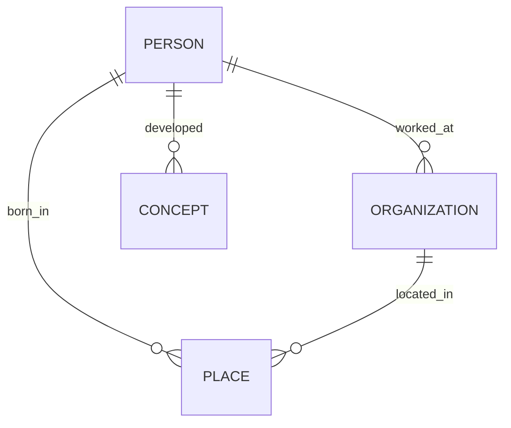
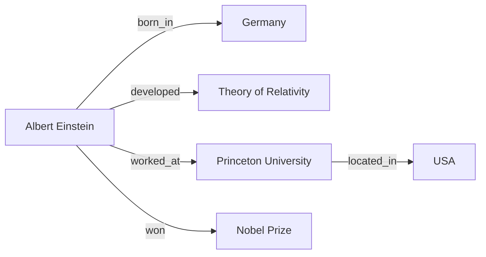
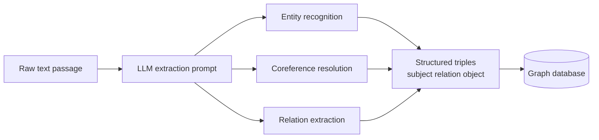

# Knowledge Graphs and Large Language Models

A large language model (LLM) a neural network trained to predict the next piece of text and, as a side effect, capable of answering questions, writing, and reasoning stores what it "knows" implicitly, smeared across billions of numerical weights. You cannot point to where the model keeps the fact "Einstein was born in Germany." A **knowledge graph** takes the opposite approach: it stores facts explicitly, as a structured network you can inspect, query, edit, and trust. This guide explains what knowledge graphs are from the ground up, how LLMs and knowledge graphs help each other, and how systems like GraphRAG combine the two.

---

## What Is a Knowledge Graph?

A **knowledge graph** (KG) is a way of storing information as a network of **things** and the **relationships between them**, rather than as paragraphs of text or rows in a spreadsheet.

Consider three plain English facts:

- Albert Einstein was born in Germany.
- Albert Einstein developed the Theory of Relativity.
- Albert Einstein worked at Princeton University.

A knowledge graph records each fact as a connection:

```
(Albert Einstein) --[born_in]--> (Germany)
(Albert Einstein) --[developed]--> (Theory of Relativity)
(Albert Einstein) --[worked_at]--> (Princeton University)
```

Notice that "Albert Einstein" appears once but participates in many facts. That is the essence of a graph: shared things get linked together into a web of meaning.

### Entities, Relations, and Triples

Three terms define everything in a knowledge graph:

- **Entity** a distinct thing in the world the graph cares about: a person (Einstein), a place (Germany), a concept (the Theory of Relativity), an organization (Princeton). Entities are the "nouns."
- **Relation** (also called a **predicate** or **relationship type**) the kind of connection between two entities: `born_in`, `developed`, `worked_at`. Relations are the "verbs" that link nouns.
- **Triple** a single fact written as three parts: **(Subject, Predicate, Object)**, also called **(head, relation, tail)**. For example, `(Albert Einstein, born_in, Germany)`.

A triple is the atomic unit of a knowledge graph. The entire graph is nothing more than a large pile of triples. Build enough of them and a rich, interconnected picture of a domain emerges.

| Part of triple | Other names | Example |
|----------------|-------------|---------|
| Subject | head, *h* | Albert Einstein |
| Predicate | relation, *r* | born_in |
| Object | tail, *t* | Germany |

Entity-relationship diagram: entities connected by directed, labeled relations form the graph.



### Nodes and Edges

When triples are drawn as a picture, the vocabulary shifts to standard graph-theory terms:

- A **node** (or **vertex**) is an entity a dot in the diagram. "Albert Einstein," "Germany," and "Princeton" are each one node.
- An **edge** is a relation a line connecting two nodes. The edge carries a **label** naming the relationship (`born_in`) and a **direction** (the arrow points from subject to object).

Because direction matters "Einstein born_in Germany" is not the same as "Germany born_in Einstein" knowledge graphs are usually **directed graphs**: graphs whose edges have arrows. In `01_knowledge_graphs.ipynb`, the first code cell builds exactly this kind of structure using the NetworkX library's `DiGraph` (directed graph), adding seven triples about Einstein and then counting them as 8 nodes and 7 edges.

A node can have many edges. Einstein's node connects outward to Germany, Princeton, the Theory of Relativity, and a Nobel Prize so a single node becomes a hub of related facts. This is why graphs are powerful for representing knowledge: the connections themselves carry meaning.

Diagram: a small knowledge graph where one entity becomes a hub of triples.



---

## Graph Databases

A handful of triples fit comfortably in memory. Real knowledge graphs hold millions or billions of them, so they need specialized storage. A **graph database** is a database built specifically to store nodes and edges and to traverse the connections between them quickly.

### Why a Special Database?

A traditional **relational database** stores data in tables (rows and columns) and answers questions by **joining** tables matching values across them. Asking "find friends of friends of friends of Alice" forces the relational database to join a table to itself again and again, which becomes slow as the chain lengthens.

A graph database stores the connections directly: each node holds pointers to its neighboring nodes. Following a relationship is a cheap, direct hop rather than an expensive search. This makes multi-step traversals "what is connected to what, several steps away" fast and natural, which is exactly the kind of question knowledge graphs exist to answer.

### Neo4j and Cypher

The notebook illustrates graph databases with **Neo4j**, the most widely used graph database. Neo4j stores entities as nodes (here labeled `Entity`) and facts as labeled, directed relationships between them.

To talk to it, you use **Cypher**, a query language designed for graphs. Where a relational database uses SQL with `SELECT` and `JOIN`, Cypher lets you draw the pattern you are looking for using ASCII-art arrows. The notebook's `query_entity_neo4j` function uses a pattern that reads almost like the diagram itself: match an entity by name, follow any outgoing relationship to a target, and return the relationship type and the target's name. Cypher also offers `MERGE`, which means "create this node or relationship if it does not already exist" the safe way to insert facts without accidentally duplicating an entity that is mentioned twice.

The key idea: **the query language mirrors the shape of the data.** You describe a graph pattern, and the database finds every place in the graph that matches it.

---

## Querying a Knowledge Graph

Querying means asking the graph a question by following its edges. The simplest query is "tell me everything about entity X," which gathers all edges touching that entity. There are two directions to consider:

- **Outgoing edges** facts where the entity is the subject (`Einstein --[developed]--> Relativity`). These describe what the entity *does* or *has*.
- **Incoming edges** facts where the entity is the object (`Relativity --[field_of]--> Physics` points the other way; or something else pointing *at* Einstein). These describe how other things relate *to* the entity.

In `01_knowledge_graphs.ipynb`, the `query_entity` function collects both directions for "Albert Einstein," returning the full set of facts in which Einstein appears as either subject or object. Combining incoming and outgoing edges gives a complete local picture of an entity.

More elaborate queries traverse multiple hops:

- **Multi-hop queries** "Which country is the university where Einstein worked located in?" This follows two edges: `Einstein --[worked_at]--> Princeton --[located_in]--> USA`. The answer is not stored as a single triple; it is *derived* by walking the path. This ability to chain relationships is what makes a graph more than a lookup table it lets you discover facts that were never stated directly but are implied by the connections.
- **Pattern queries** "Find all people who worked at a university located in the USA," which matches a shape (person → worked_at → university → located_in → USA) across the whole graph at once.

---

## Knowledge Graph Embeddings

So far the graph is purely **symbolic**: entities and relations are just labels. But we often want to do machine-learning-style reasoning over a graph for example, to **predict missing facts** (Einstein surely *won_award* something; can the graph guess what?) or to measure how similar two entities are. For that we need numbers.

An **embedding** is a list of numbers (a **vector**) that represents something in a way a computer can do math on. Items that are similar in meaning get vectors that sit close together in this numerical space. A **knowledge graph embedding** assigns a vector to every entity and every relation so that the geometry of the space reflects the structure of the graph.

The trick is to choose a scoring rule such that **true triples score high and false triples score low**, then nudge all the vectors until that holds across the whole graph. The notebook presents three classic schemes, each with a different geometric idea of what a relation *is*.

### TransE Relations as Translations

**TransE** treats a relation as a **translation** (a shift) in the embedding space. If the head entity's vector is *h*, the relation's vector is *r*, and the tail's vector is *t*, a true triple should satisfy:

$$ h + r \approx t $$

In words: start at the head, move in the direction the relation points, and you should land near the tail. "Einstein" plus the "born_in" arrow should land near "Germany." The model scores a triple by how close `h + r` lands to `t` the smaller the gap, the higher the score:

$$ f(h, r, t) = -\lVert h + r - t \rVert $$

(The `‖ ‖` notation means the length of the leftover gap vector; the minus sign makes "small gap" mean "high score.") TransE is simple and effective, but a pure shift struggles with relations that connect one thing to *many* things (a country has many people born in it), since a single translation cannot point to many different tails at once.

### RotatE Relations as Rotations

**RotatE** treats a relation as a **rotation** instead of a shift, working in **complex-number space** (where each coordinate has an angle). A true triple satisfies:

$$ t = h \circ r \quad \text{where } |r_i| = 1 $$

Here `∘` means applying the rotation, and constraining each part of *r* to length 1 ensures it only rotates without stretching. Because rotations compose and can be reversed, RotatE naturally captures relation patterns that TransE cannot symmetry (if A is married_to B then B is married_to A), inversion (parent_of vs. child_of), and composition (chains of relations).

### TransR Relation-Specific Spaces

**TransR** observes that two entities might be similar in one respect but unrelated in another. So it gives each relation its **own space**: before applying the TransE-style shift, it first projects the head and tail through a relation-specific matrix `M_r` that picks out the aspects relevant to *that* relation:

$$ h_r = M_r h, \qquad t_r = M_r t $$
$$ f(h, r, t) = -\lVert h_r + r - t_r \rVert^2 $$

This added flexibility lets the model handle entities that play very different roles in different relationships.

| Model | Relation modeled as | Strength |
|-------|--------------------|----------|
| TransE | Translation (shift) | Simple, fast, intuitive |
| RotatE | Rotation in complex space | Symmetry, inversion, composition |
| TransR | Projection into relation-specific space | Entities with multiple aspects |

These embeddings power **link prediction** scoring every possible tail for a given (head, relation) pair and proposing the highest-scoring ones as likely-but-missing facts. The notebook points to **PyKEEN**, a Python library that implements these and many other embedding models.

---

## How LLMs Extract Knowledge Graphs from Text

Building a knowledge graph by hand is slow. Most of the world's knowledge lives in unstructured text articles, reports, web pages not in tidy triples. This is where LLMs shine: they can **read natural language and output structured triples**, automating the construction of a graph from raw documents.

The process, called **knowledge extraction** or **information extraction**, works like this:

1. **Give the LLM a passage of text** plus an instruction (a **prompt**) asking it to identify the facts.
2. **Ask for a structured format** the notebook requests JSON (a machine-readable text format of brackets and labels) shaped as a list of `[subject, relation, object]` triples. Forcing a strict format makes the output easy to feed straight into a graph.
3. **Parse the result** and add each triple to the graph database.

In `01_knowledge_graphs.ipynb`, the extraction cell feeds a short biography of Marie Curie ("born in Warsaw, Poland... won two Nobel Prizes... discovered polonium and radium") and asks the model to return triples. The LLM reads the prose and emits facts such as `(Marie Curie, born_in, Warsaw)` and `(Marie Curie, discovered, polonium)`. What took a human careful reading and typing, the model does in one pass.

The LLM is doing several hard subtasks at once that older systems needed separate components for:

- **Entity recognition** spotting that "Marie Curie," "Warsaw," and "polonium" are entities worth nodes.
- **Coreference resolution** understanding that "She" refers back to Marie Curie, so the discoveries attach to the right node rather than to a phantom "She."
- **Relation extraction** naming the connection ("discovered," "born_in") between each pair.

This is the bridge between the messy, human world of text and the clean, queryable world of the graph. (Reliability is not perfect models can misread or invent relations which is why extracted graphs are often reviewed or cross-checked, a theme the next section builds on.)

Diagram: an LLM reads raw text and emits entities and relations that become graph triples.



---

## GraphRAG: Combining Knowledge Graphs with LLMs

The most important practical pattern in this notebook is **GraphRAG**, an approach from Microsoft that fuses knowledge graphs with LLMs to answer questions over a large body of documents.

### The Problem It Solves

**RAG** stands for **Retrieval-Augmented Generation**. Ordinary RAG works like this: when you ask a question, the system *retrieves* the few passages of your documents most relevant to the question and pastes them into the LLM's prompt so the model can answer using your actual data instead of its general memory. This grounds answers in real sources and reduces **hallucination** (confident but false output).

Ordinary RAG retrieves by **similarity** it finds chunks of text that *sound* like the question. That works for narrow, local questions ("What was Einstein's birthplace?") where the answer sits in one passage. It fails for **global** questions ("What are the main themes across all these documents?") because no single passage contains the answer it must be *synthesized* from many. Similarity search has no way to see the big picture or to connect facts scattered across different documents.

### How GraphRAG Works

GraphRAG fixes this by building a knowledge graph first, then organizing it into a hierarchy of summaries. Its pipeline, as outlined in the notebook:

1. **Chunk** the documents split them into manageable passages.
2. **Extract** entities and relationships from each chunk using an LLM exactly the text-to-triples extraction described above. This produces the knowledge graph.
3. **Build a community hierarchy** using the **Leiden algorithm**. A **community** is a cluster of entities that are densely connected to each other a natural "topic" or "neighborhood" in the graph (for example, all the entities surrounding a particular project, person, or event). The Leiden algorithm is a method for automatically detecting these clusters, and it does so at multiple levels, so small communities nest inside larger ones to form a hierarchy from fine-grained to broad.
4. **Generate community summaries** have the LLM write a plain-language summary of each community: what these connected entities are and how they relate. The graph is thus pre-digested into descriptions at every level of zoom.
5. **Query** in one of two modes, matched to the question type.

### Global vs. Local Search

GraphRAG offers two complementary ways to query, which the notebook contrasts directly:

- **Global search** for broad, sense-making questions ("What are the main themes?"). It draws on the **community summaries**, letting the model reason over the high-level structure of the entire corpus rather than a handful of passages. This is what ordinary RAG cannot do.
- **Local search** for specific, entity-centered questions ("Who is Einstein?"). It uses **entity embeddings** to find the relevant entity in the graph, then gathers that entity's neighbors and connected facts, much like the multi-hop graph queries described earlier.

| | Global search | Local search |
|---|---|---|
| Best for | Broad, thematic, "big picture" questions | Specific questions about a particular entity |
| Draws on | Community summaries | An entity and its graph neighborhood |
| Example | "What are the main topics?" | "Tell me about Einstein" |

In `01_knowledge_graphs.ipynb`, the GraphRAG cell sketches the command-line workflow `init` to set up a project, `index` to run the extraction-and-community pipeline over your documents, and `query` with either `--method global` or `--method local` along with the equivalent Python calls.

---

## Why Combine Knowledge Graphs and LLMs?

The two technologies have complementary strengths and weaknesses, which is why pairing them is so effective:

- **LLMs are fluent but forgetful and unreliable.** They write and reason beautifully, but their knowledge is implicit, hard to update, sometimes outdated, and occasionally fabricated.
- **Knowledge graphs are precise but rigid.** Every fact is explicit, traceable to a source, and easy to edit or correct but a graph cannot read a document or phrase an answer in natural language on its own.

Joining them lets each cover the other's gap:

- **The LLM builds and reads the graph.** It turns unstructured text into structured triples (extraction) and turns retrieved triples back into fluent answers (generation).
- **The graph grounds the LLM.** By retrieving explicit, connected facts, the graph reduces hallucination, supplies up-to-date or private knowledge the model never trained on, and provides an **auditable trail** you can see exactly which entities and relations supported an answer.
- **The graph enables reasoning the LLM struggles with alone.** Multi-hop traversals and global, structure-aware questions become tractable because the relationships are laid out explicitly.

---

## Key Terms Recap

- **Knowledge graph** information stored as a network of entities and the relationships among them.
- **Entity / node** a distinct thing (person, place, concept); a dot in the graph.
- **Relation / edge** a directed, labeled connection between two entities.
- **Triple** one fact as (subject, predicate, object) = (head, relation, tail).
- **Directed graph** a graph whose edges have a direction (an arrow).
- **Graph database (e.g., Neo4j)** storage built for fast traversal of nodes and edges; queried with a graph language like **Cypher**.
- **Knowledge graph embedding** vectors for entities and relations (TransE, RotatE, TransR) enabling link prediction.
- **Knowledge extraction** using an LLM to turn text into triples.
- **RAG** Retrieval-Augmented Generation: grounding an LLM's answers in retrieved data.
- **GraphRAG** building a knowledge graph and community summaries from documents, then querying it globally (themes) or locally (entities).
- **Community / Leiden algorithm** clusters of densely connected entities, detected automatically at multiple levels of granularity.
