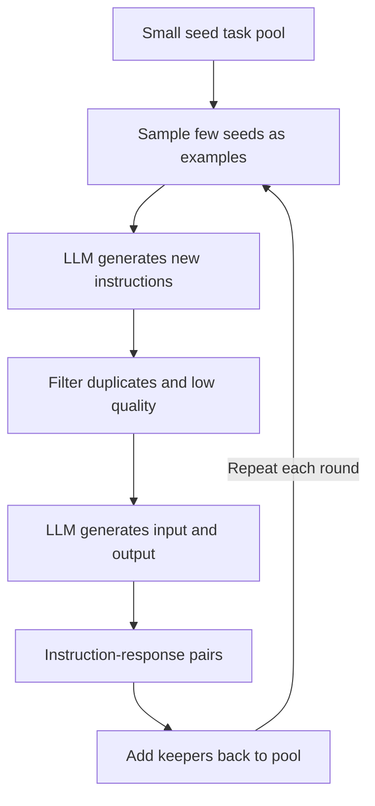
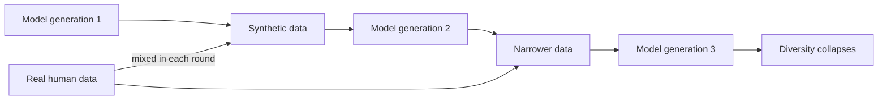

# Synthetic Data Generation with Large Language Models

To train or fine-tune a machine learning model, you need data and lots of it. Traditionally that data comes from the real world: photographs taken by people, sentences written by humans, records collected from real events. But real data is expensive to gather, often legally restricted, and frequently missing exactly the examples you need. **Synthetic data** offers a different path: instead of collecting data from reality, you *manufacture* it. With modern large language models (LLMs) neural networks trained to produce fluent, human-like text generating high-quality synthetic data has become fast, cheap, and astonishingly flexible. This guide explains what synthetic data is, why it matters, the main techniques for generating it with LLMs, how to keep its quality high, and the serious risks involved.

---

## What Is Synthetic Data?

**Synthetic data** is data that is **artificially generated by a model or algorithm rather than collected from real-world events or measurements.** A photograph of a real cat is real data; an image of a cat painted by an image generator is synthetic. A customer review actually written by a customer is real data; a review written by an LLM imitating a customer is synthetic.

Crucially, good synthetic data is meant to *resemble* real data to share its statistical patterns, structure, and usefulness without *being* real data. In the LLM world, synthetic data is most often **text**: example questions, instructions, conversations, answers, summaries, or labeled examples that look like things a person might have written, but were produced by a model.

A few terms used throughout this guide:

- **Training data** the examples a model learns from. More and better training data generally means a better model.
- **Fine-tuning** taking a model that is already generally capable and giving it additional, focused training on a specialized dataset so it gets better at a particular task or style. Fine-tuning needs a dataset of example inputs and the desired outputs.
- **Instruction** a task phrased as a request ("Summarize this article," "Translate this sentence"). Datasets of instructions paired with good responses are what teach a model to *follow* instructions.

---

## Why Generate Synthetic Data?

The notebook opens by listing the motivations, each of which addresses a real bottleneck in building AI systems.

### Data Scarcity and Cost

Real labeled data is **expensive and scarce.** A **label** is the correct answer attached to an example the "summary" for an article, the "sentiment" for a review. Producing labels usually means paying humans to read and annotate, which is slow and costly. For many specialized tasks, the examples you need simply do not exist in any dataset you can buy or download. An LLM, by contrast, can generate thousands of labeled examples in minutes at a tiny fraction of the cost.

### Feeding Fine-Tuning

**Fine-tuning requires thousands of examples** to meaningfully shift a model's behavior. Hand-writing thousands of instruction-and-response pairs is impractical. LLMs can produce these pairs at scale, which is why nearly every modern instruction-following dataset is at least partly synthetic.

### Scale and Diversity

LLMs can **generate diverse, high-quality data at scale.** Beyond raw volume, they can deliberately cover edge cases, rare scenarios, and a wide spread of topics and phrasings diversity that random real-world collection often misses. You can ask for examples in twenty styles, ten difficulty levels, or a hundred subject areas on demand.

### Privacy

In **privacy-sensitive domains medical, legal, financial real data often cannot be used** at all. Patient records and legal case files are protected by law and ethics. Synthetic data offers a way to create realistic-looking medical questions or legal scenarios that contain **no real person's information**, letting teams build and test systems without exposing anyone's private data.

### Augmentation

**Data augmentation** means expanding an existing dataset by creating variations of what you already have rephrasing a sentence, generating new questions in the same style, or producing harder versions of existing problems. This stretches a small real dataset into a much larger and more varied one.

---

## Techniques for Generating Synthetic Data

The notebook surveys a family of well-known methods. They build on one another, so it helps to see them as a progression from "generate from seeds" to "evolve into complexity" to "distill from a stronger model."

| Method | Core idea | Source |
|--------|-----------|--------|
| Self-Instruct | LLM generates new instructions from a small set of seed examples | Wang et al. 2022 |
| Alpaca | Used GPT-3.5 to generate 52,000 instruction pairs cheaply | Taori et al. 2023 |
| Evol-Instruct | Evolves simple instructions into more complex ones | Xu et al. 2023 |
| Orca | Learns from a stronger model's step-by-step reasoning traces | Mukherjee et al. 2023 |
| Magpie | Extracts instructions by prompting a model with only its template prefix | Xu et al. 2024 |
| Persona-driven | Generates data from many different imagined user personas | Chan et al. 2024 |

### Self-Instruct: Bootstrapping from Seeds

**Self-Instruct** is the foundational technique. The idea is to **bootstrap** a large dataset from a tiny one to pull a big dataset up "by its own bootstraps" using the LLM itself. The pipeline in `01_synthetic_data.ipynb`:

1. **Start with a small set of seed tasks** the original paper used 175 hand-written example instructions; the notebook uses 5 (summarization, translation, coding, explanation, opinion).
2. **Sample a few seeds** at random to show the model as examples (this is **few-shot prompting** giving the model a handful of examples so it understands the pattern you want).
3. **Ask the LLM to generate new, different instructions** in the same spirit.
4. **Filter out low-quality or duplicate instructions** (covered below).
5. **Generate an input and output** for each surviving instruction i.e., have the model actually answer its own invented task, producing a complete (instruction, response) training pair.
6. **Add the keepers back into the pool and repeat**, so each round's new instructions can themselves seed the next round.

The result is a self-reinforcing loop that grows a rich, varied dataset from a handful of starting examples. In the notebook, `generate_new_instructions` performs steps 2-3 and `generate_response` performs step 5.

Diagram: the Self-Instruct generation loop that bootstraps a large dataset from a few seeds.

### Alpaca: Self-Instruct in Practice

**Alpaca** was a famous demonstration that this works cheaply. Researchers at Stanford used Self-Instruct with GPT-3.5 to generate **52,000 instruction pairs**, then fine-tuned a base model on them producing a capable instruction-follower for a few hundred dollars. Alpaca proved that you can teach a model to follow instructions largely from *another model's* output rather than from human labor.

### Evol-Instruct: Growing Complexity

A weakness of basic generation is that the examples tend to stay simple. **Evol-Instruct** ("evolve instruction") fixes this by repeatedly taking an instruction and asking the LLM to *evolve* it into something harder. The notebook's `evol_instruct` function implements three evolution directions:

- **Depth** make the instruction more complex by adding constraints, requirements, or deeper reasoning ("reverse a string" becomes "reverse a string while preserving the position of all whitespace").
- **Breadth** create a brand-new instruction inspired by the original but in a different domain, expanding topical coverage.
- **Reasoning** rewrite the instruction so it demands multi-step reasoning or planning rather than a one-shot answer.

By evolving a seed pool many times, you generate a curriculum that ranges from easy to genuinely difficult valuable because models learn more from challenging examples.

### Orca: Learning from Reasoning Traces

**Orca** focuses on *how* the answer is reached, not just the final answer. Instead of capturing only a stronger model's conclusion, Orca captures its **reasoning traces** the full step-by-step explanation of how it worked through the problem. Training a smaller model on these traces teaches it to *imitate the reasoning process*, not just to memorize answers, which transfers far more capability.

### Magpie: Decoding the Template

**Magpie** is a clever trick. Aligned chat models are wrapped in a hidden **system prompt** and a fixed conversation template special markers that signal "the user's turn begins here." Magpie prompts the model with *only that template prefix* and nothing else, then lets the model **decode** (continue generating) what a user *would* have said. Because the model was trained on countless real instructions, it spontaneously produces plausible instruction templates effectively reading instructions back out of itself with no seed examples at all.

### Persona-Driven Generation

**Persona-driven** generation boosts diversity by inventing many different **personas** imagined users with distinct backgrounds, professions, and interests (a nurse, a game developer, a historian) and generating data *as if* each one were asking. Because different people ask very different questions, conditioning on a wide gallery of personas yields a dataset that covers far more of the space of real human queries than a single neutral voice would.

---

## Distillation

Several of the techniques above are instances of a broader, important idea: **distillation.**

**Knowledge distillation** is the process of using a **larger, more capable "teacher" model to train a smaller, cheaper "student" model.** The teacher generates data answers, reasoning traces, instructions and the student learns to reproduce the teacher's behavior. The student ends up far more capable than it could become from raw data alone, while being cheaper to run.

Synthetic data generation *is* the engine of distillation: the teacher's outputs *are* the synthetic dataset. Alpaca (a smaller model learning from GPT-3.5's generations) and Orca (a student learning from a teacher's reasoning) are both distillation. This is one of the most powerful uses of synthetic data: capturing the abilities of an expensive frontier model in a compact, affordable one.

A practical and ethical note: distilling from a commercial model may be restricted by that provider's terms of service, so teams must check licensing before training on another model's outputs.

---

## Quality and Validation

Synthetic data is only useful if it is **good**. Carelessly generated data can be repetitive, wrong, or biased, and training on it can actively *harm* a model. So a serious synthetic-data pipeline always includes **validation** checks that filter out bad examples before they reach the training set.

### Deduplication

The biggest quality problem in self-generated data is **repetition**: ask a model for new instructions and it keeps producing near-copies of ones it already made. To catch this, the notebook uses **ROUGE-based deduplication.**

**ROUGE** is a metric originally built to score summaries; **ROUGE-L** measures the overlap between two pieces of text based on the longest sequence of words they share, producing a similarity score from 0 (nothing in common) to 1 (identical). The notebook's `is_too_similar` function compares each new instruction against everything already accepted and **rejects it if its ROUGE-L score exceeds a threshold of 0.7** meaning it overlaps too heavily with an existing example.

In the notebook's test, "Write a Python function that reverses a string" is flagged as too similar to an existing "reverse a string in Python" instruction, while "Implement a binary search algorithm in JavaScript" passes as genuinely different. Filtering this way keeps the dataset **diverse**, which is one of the main reasons synthetic data is valuable in the first place.

### Other Quality Practices

Beyond deduplication, real pipelines apply further checks: removing malformed or empty outputs, verifying that generated answers are actually correct (sometimes by having an LLM or a second model **judge** the quality), and having humans review samples. The notebook references **Argilla** and **Label Studio** annotation platforms where humans inspect and curate machine-generated data underscoring that human oversight remains part of a trustworthy pipeline.

### Industrial Tooling: Distilabel

Doing all of this by hand is tedious, so the notebook introduces **distilabel**, a library that turns synthetic data generation into a configurable **pipeline**: load some seed data, pass it through generation steps (text generation, Self-Instruct, and so on) powered by an LLM, apply filtering, and publish the resulting dataset. It packages the patterns above into reusable, production-grade building blocks.

---

## Risks of Synthetic Data

Synthetic data is powerful but comes with two serious dangers that the notebook highlights and that anyone using it must understand.

### Model Collapse

**Model collapse** is what happens when models are trained on the output of other models, generation after generation, with too little real data mixed in. Each model imitates the previous one's output, and that output is always a slightly narrowed, smoothed version of reality rare cases and unusual phrasings get dropped because they were uncommon in the training signal. Repeat this across several generations and the data **collapses** toward a bland, low-diversity average: the tails of the distribution vanish, errors compound, and quality degrades.

The analogy is making a photocopy of a photocopy of a photocopy each copy is a little blurrier, and eventually the image is lost. The defense is to **keep real, human-generated data in the mix** and to enforce diversity (exactly what deduplication is for), so the synthetic data never fully detaches from reality.

Diagram: model collapse as a degrading loop, broken by mixing in real data.

### Bias Amplification

Synthetic data inherits and can **amplify** the **biases** of the model that produced it. A **bias** is a systematic skew: if a model tends to associate certain professions with certain genders, or underrepresents certain dialects or viewpoints, then every example it generates carries that same skew. Train a new model on that data and you bake the bias in, potentially *strengthening* it because the new model sees the bias even more consistently than the original did. Synthetic data does not launder bias out of a model; it can concentrate it. Careful validation, diverse personas, and human review are partial defenses, but bias must be actively watched for.

---

## Key Terms Recap

- **Synthetic data** data manufactured by a model rather than collected from the real world.
- **Fine-tuning** extra, focused training on a specialized dataset to specialize a model.
- **Self-Instruct** bootstrapping a large instruction dataset from a few seed tasks.
- **Few-shot prompting** giving a model a handful of examples so it follows the pattern.
- **Evol-Instruct** evolving instructions to be deeper, broader, or more reasoning-heavy.
- **Distillation** training a small "student" model on a large "teacher" model's outputs.
- **Reasoning traces** a model's step-by-step working, used to teach reasoning (Orca).
- **Persona-driven generation** generating data through many imagined user identities to boost diversity.
- **ROUGE / ROUGE-L** a text-overlap similarity metric, used here to filter near-duplicate examples.
- **Model collapse** quality and diversity degrading when models are trained repeatedly on model output.
- **Bias amplification** synthetic data inheriting and intensifying a generating model's skews.
