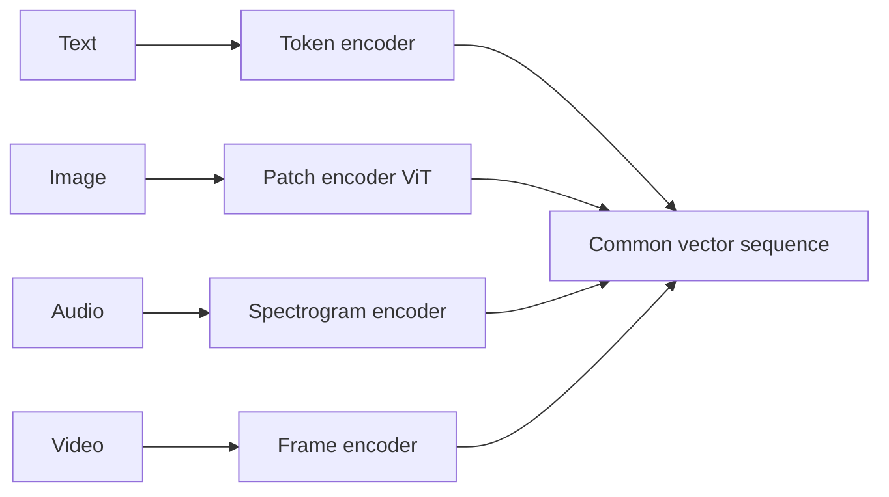
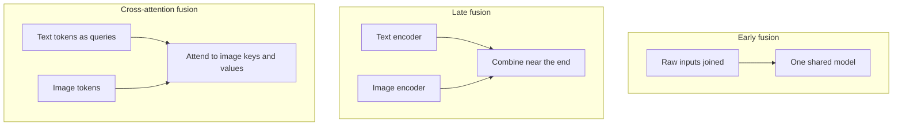
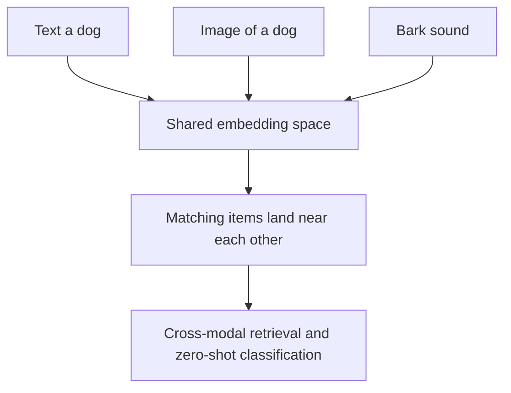

# Multimodal AI

Most early AI systems lived in a single sensory world: a language model read and wrote text, an image classifier looked at pictures, a speech recognizer listened to audio and none of them could cross over. Humans are not like this. We see, hear, read, and speak all at once, and we effortlessly connect what we see to what we hear and to the words we use. **Multimodal AI** is the effort to give machines that same ability: to take in and produce information across many different kinds of data at the same time. This guide builds the idea from scratch what a modality is, how different modalities are turned into numbers, how those numbers are fused together, what cross-modal capabilities emerge, and which real systems do this today.

---

## What Is a Modality?

A **modality** is a *type* or *channel* of data a distinct form in which information can arrive. The notebook lists the main ones:

- **Text** written language: words and sentences.
- **Image** a still picture: a grid of colored pixels.
- **Audio** sound: a waveform that varies over time (speech, music, noise).
- **Video** moving pictures: a sequence of image frames, usually with audio.
- **3D** three-dimensional shape data, such as a **point cloud** (a set of points in space describing an object's surface).
- **Tabular** structured data in rows and columns, like a spreadsheet.

Each modality represents the world in a fundamentally different format. Text is a discrete sequence of symbols; an image is a continuous grid of color values; audio is a one-dimensional signal over time. A system that handles only one of these is **unimodal**.

### What Makes a Model "Multimodal"

**Multimodal AI processes and generates content across multiple modalities at once.** A multimodal model can take in more than one type of data for example, an image *and* a text question about it and reason over them jointly, or generate one modality from another (text describing an image, an image generated from text). The defining feature is not just handling several modalities but *connecting* them: relating what is in a picture to the words that describe it.

### Relationship to Vision-Language Models

A **vision-language model** (a model that handles images and text together, such as one that answers questions about a photo) is one specific, very common kind of multimodal model. Multimodal AI is the **broader umbrella**: vision-and-text is just the most developed corner of it. The full field also embraces audio, video, 3D, and tabular data, and any combination of them text-to-speech, audio captioning, video understanding, point-cloud reasoning, and more. So every vision-language model is multimodal, but multimodal AI extends well beyond vision and language.

---

## How Each Modality Is Encoded

A neural network cannot operate on a raw picture or a raw sound directly; everything must first become numbers specifically **vectors**, which are simply lists of numbers. The component that converts a raw input into such a vector is called an **encoder**, and the resulting vector is called an **embedding** a numerical summary of the input's meaning, arranged so that similar inputs get similar vectors.

The challenge of multimodal AI is that each modality needs its *own kind* of encoder, because each has a different structure. The notebook's modality table pairs each type with the models built to encode it:

| Modality | How it is broken into pieces | Example encoder models |
|----------|------------------------------|------------------------|
| Text | **Tokens** (words/word-fragments) | GPT, Claude, Llama |
| Image | **Patches** (small square tiles) or pixels | ViT, CLIP, DINOv2 |
| Audio | **Spectrograms** (time-frequency images of sound) | Whisper, wav2vec |
| Video | **Frame sequences** (images over time) | VideoLLaMA, Sora |
| 3D | **Point clouds** | PointNet, 3D-LLM |
| Tabular | Encoded feature columns | TabPFN, TabTransformer |

A few of these encoding ideas deserve unpacking:

- **Token** for text, the input is split into **tokens**, small chunks roughly the size of a word or word-piece. Each token is mapped to an embedding, so a sentence becomes a sequence of vectors.
- **Patch** for images, a popular approach (used by the **Vision Transformer**, or **ViT**) is to cut the picture into a grid of small square **patches** and treat each patch like a "visual token," giving each its own embedding. This lets image data be processed by the same kind of machinery that handles text tokens.
- **Spectrogram** for audio, the sound wave is converted into a **spectrogram**: a picture showing how much energy is present at each frequency over time. This cleverly turns a sound into something image-like, which an image-style encoder can then process. Models like **Whisper** (speech-to-text) and **wav2vec** work this way.
- **Frame sequence** video is encoded as a series of image frames over time, so a video encoder reuses image encoding and adds an understanding of how things change from frame to frame.
- **Point cloud** 3D objects are encoded from clouds of points in space by models such as **PointNet**.

The unifying insight: **every modality is converted into a sequence of vectors.** Once a picture, a sound, or a sentence has all become lists of numbers, they live in a common mathematical language and can be combined.

Diagram: each modality has its own encoder, but all output a common sequence of vectors.

---

## Fusion: Combining Modalities

**Fusion** is the act of *combining* information from different modalities so the model can reason about them together. The central design question is *when* and *how* to merge the streams. The notebook presents three strategies.

### Early Fusion

**Early fusion** combines the raw inputs *before* much processing you concatenate (stick together) the different inputs and feed the combined blob into a single model:

$$ z = f([x_{text}; x_{image}; x_{audio}]) $$

Here the brackets mean "joined together" and `f` is one shared model. The advantage is that the model can find interactions between modalities from the very start. The drawback is rigidity: it expects all modalities to be present and in a compatible form.

### Late Fusion

**Late fusion** does the opposite it **encodes each modality separately** with its own specialist encoder, then combines the resulting embeddings near the end:

$$ z = g(f_1(x_{text}), f_2(x_{image}), f_3(x_{audio})) $$

Each `f_i` is a dedicated encoder; `g` combines their outputs. This is modular and robust each encoder can be the best available for its modality, and a modality can be dropped if absent but the modalities only "meet" late, so subtle early interactions can be missed.

### Cross-Attention Fusion

**Cross-attention fusion** is a more sophisticated middle path, used by the **Flamingo** model. To understand it, you first need **attention**: a mechanism by which one piece of data "looks at" other pieces and decides how much to draw from each, based on relevance. **Cross-attention** is attention *across* modalities letting the tokens of one modality attend to the tokens of another.

In Flamingo, **text tokens attend to visual tokens**: as the model processes the words, each word can reach over and pull in information from the relevant parts of the image. The notebook writes this as:

$$ \text{CrossAttn}(Q_{text}, K_{image}, V_{image}) = \text{softmax}\!\left(\frac{Q_{text} K_{image}^{T}}{\sqrt{d_k}}\right) V_{image} $$

Intuitively: the text forms **queries** (`Q`, "what am I looking for?"), the image provides **keys** (`K`, "what do I contain?") and **values** (`V`, "here is my content"); the formula scores how well each text query matches each image region and uses those scores to blend in the relevant visual content. The `softmax` turns raw match scores into weights that sum to one, and the `√d_k` keeps the numbers in a stable range. The effect is that the language model can *ground* its words in the picture, attending to whichever visual details each word needs.

| Strategy | When modalities merge | Trade-off |
|----------|----------------------|-----------|
| Early fusion | At the raw input | Rich cross-modal interaction, but rigid |
| Late fusion | After separate encoding | Modular and robust, but interactions are shallow |
| Cross-attention | Throughout, via attention | Flexible grounding of one modality in another |

Diagram: three fusion strategies differing in where the modalities meet.

---

## Shared Embedding Spaces and Contrastive Learning

A powerful idea in multimodal AI is the **shared embedding space**: a single numerical space in which embeddings from *different* modalities can be compared directly. If a photo of a dog and the words "a dog" both land at nearby points in the same space, the system can match images to text just by checking which vectors are close together.

### CLIP

**CLIP** (Contrastive Language-Image Pre-training) is the landmark model that achieves this for images and text. It trains an image encoder and a text encoder *together* so that a picture and its true caption end up close, while a picture and an unrelated caption end up far apart. The notebook's loss function expresses this:

$$ L = -\frac{1}{N}\sum_i \log \frac{e^{s(I_i, T_i)/\tau}}{\sum_j e^{s(I_i, T_j)/\tau}} $$

Decoding the symbols: `s(I, T)` is the **cosine similarity** between an image embedding and a text embedding a measure, from -1 to 1, of how aligned two vectors are (1 means pointing the same way). For each image `I_i`, the loss pushes its similarity to its *matching* caption `T_i` up and its similarity to all the *other* captions `T_j` in the batch down. `τ` (tau) is a **temperature**, a knob controlling how sharply the model distinguishes matches from non-matches. This is **contrastive learning**: learning by *contrasting* correct pairs against incorrect ones.

### Zero-Shot Classification

Because CLIP places images and text in one space, it can do **zero-shot classification** classifying images into categories it was never explicitly trained to recognize, simply by describing the categories in words. The notebook's `clip_classify` function takes an image and a list of candidate descriptions ("a photo of a cat," "a photo of a dog," "a landscape photo," "a photo of food"), embeds all of them, and reports how strongly the image matches each phrase. "Zero-shot" means no task-specific training examples were needed you define the classes on the fly with text.

### ImageBind: Binding Six Modalities

**CLIP** binds two modalities. **ImageBind** (from Meta) extends the idea to **six** text, image, audio, depth, thermal, and motion data all in **one shared embedding space**. The remarkable consequence, demonstrated in the notebook's ImageBind cell, is that you can measure similarity between *any* pair of modalities, even ones never directly paired during training: compare text to vision, text to audio, audio to vision, and so on, because everything lives in the same space. A bark sound, a photo of a dog, and the words "a dog playing fetch" all sit near each other. This is the purest expression of the multimodal dream: a single space where all senses meet.

Diagram: a shared embedding space lets any modality be compared by closeness.

---

## Cross-Modal Capabilities and Applications

Once modalities share a representation, a range of **cross-modal** abilities tasks that translate or reason *between* modalities become possible. The notebook illustrates several practical applications.

### Multimodal RAG

**RAG** stands for **Retrieval-Augmented Generation**: answering a question by first retrieving relevant material from your own documents and feeding it to a language model, so answers are grounded in real sources. **Multimodal RAG** extends this to documents that contain more than text **text, tables, and images** all mixed together, as in a real PDF report.

The notebook's pipeline shows the approach: a tool (`unstructured`) splits a PDF into its text, tables, and images; a vision-capable model writes a **text summary of each image** ("describe this image for indexing"); then both the text passages and the image summaries are stored together and made searchable. The trick is to convert every modality into a common searchable form so that a user's question can retrieve the right passage *or* the right figure. This lets a question-answering system draw on charts and diagrams, not just prose.

### Video Understanding

Video is among the hardest modalities because it combines images, motion, time, and often audio, producing an enormous amount of data. The notebook demonstrates **video understanding** with Google's **Gemini**: you upload a video, wait for the model to process it, then ask questions in plain language ("Summarize the key events in this video"). The notebook notes Gemini can handle up to about an hour of video within a very large context window the amount of input a model can consider at once. The model watches the footage and reasons over it, turning raw video into answers.

### A Map of Cross-Modal Tasks

More broadly, multimodal models enable tasks such as:

- **Image captioning** generating text that describes a picture (image → text).
- **Text-to-image generation** creating a picture from a description (text → image).
- **Speech recognition** turning speech into text (audio → text), as Whisper does.
- **Text-to-speech and music generation** producing audio from text (text → audio), as MusicGen does.
- **Visual question answering** answering questions about an image (image + text → text).
- **Cross-modal retrieval** finding an image from a text query, or vice versa, using a shared embedding space.

---

## Example Models

The notebook references a cast of important multimodal systems worth knowing by name:

- **CLIP** (2021) the contrastive image-text model behind shared embedding spaces and zero-shot classification.
- **Flamingo** (2022) pioneered cross-attention fusion so a language model can attend to images.
- **ImageBind** (2023) bound six modalities into a single embedding space.
- **GPT-4V** and **Gemini** large commercial models that natively accept images (and, for Gemini, video and audio) alongside text.
- **VideoLLaMA** and **Sora** models for understanding and generating video, respectively.
- **Whisper** and **wav2vec** speech and audio encoders.
- **MusicGen** generates music audio from text prompts.

It is worth situating today's leading **frontier models** alongside these research milestones. Anthropic's current **Claude** models the **Claude Opus 4.x** and **Claude Sonnet 4.x** family are natively multimodal in the vision-and-text sense: a single Claude model can read text and analyze images together in one conversation, answering questions about charts, diagrams, screenshots, and photographs. Other frontier systems extend even further across audio and video. The trajectory of the whole field is toward general-purpose models that fluidly handle many modalities at once, rather than the narrow, single-sense systems of the past.

---

## Key Terms Recap

- **Modality** a type of data (text, image, audio, video, 3D, tabular).
- **Multimodal AI** systems that take in and/or produce multiple modalities and connect them.
- **Unimodal** handling only one modality.
- **Encoder / embedding** the component that turns raw input into a numeric vector, and that vector itself.
- **Token / patch / spectrogram / point cloud** how text, images, audio, and 3D are broken into pieces for encoding.
- **Fusion** combining modalities; **early** (at the input), **late** (after separate encoding), or **cross-attention** (one modality attending to another, as in Flamingo).
- **Shared embedding space** one space where embeddings from different modalities can be compared.
- **CLIP / contrastive learning** training image and text encoders so matching pairs align and mismatched pairs separate.
- **Cosine similarity / temperature** a measure of vector alignment, and a knob controlling how sharply matches are distinguished.
- **Zero-shot classification** classifying with categories defined by text at run time, no task-specific training.
- **ImageBind** six modalities bound into one shared space.
- **Multimodal RAG** retrieval-augmented generation over documents containing text, tables, and images.
- **Vision-language model** a multimodal model for images and text; one important subset of the broader multimodal field.
