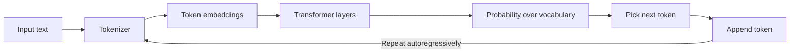
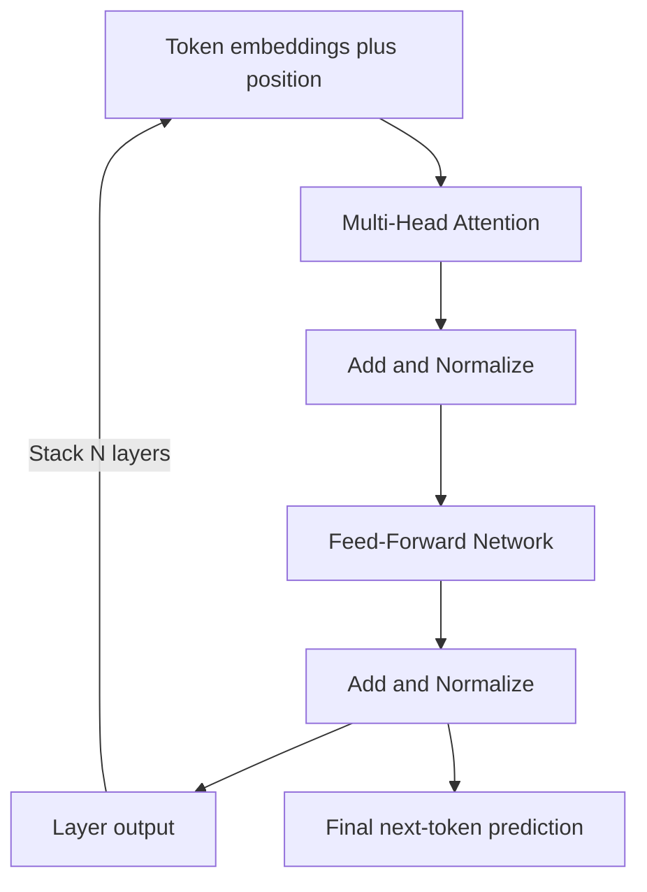
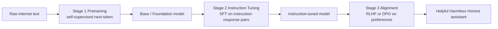
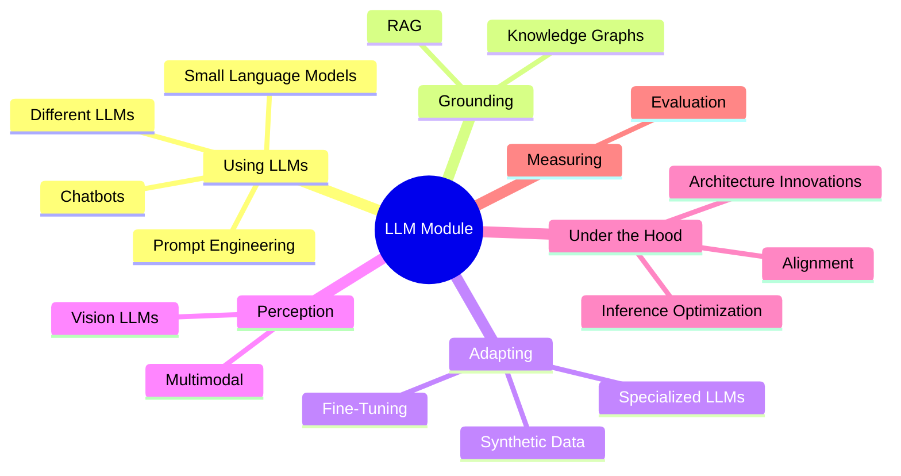
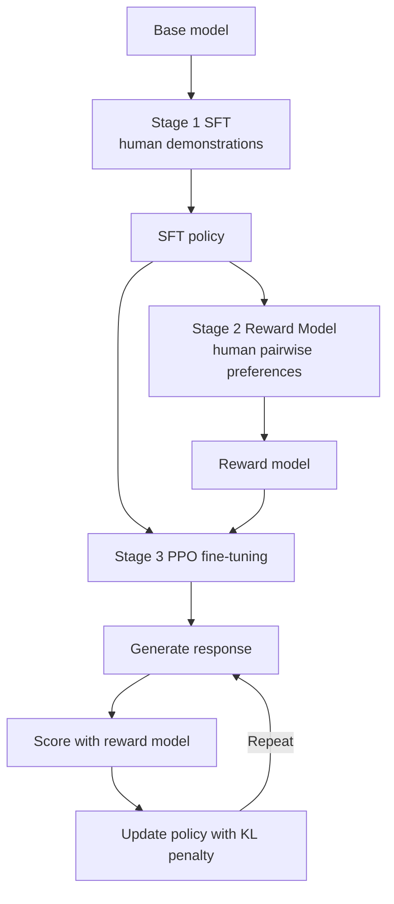
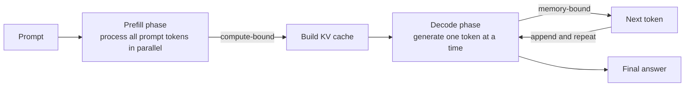
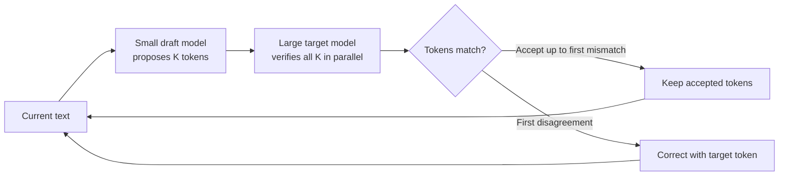
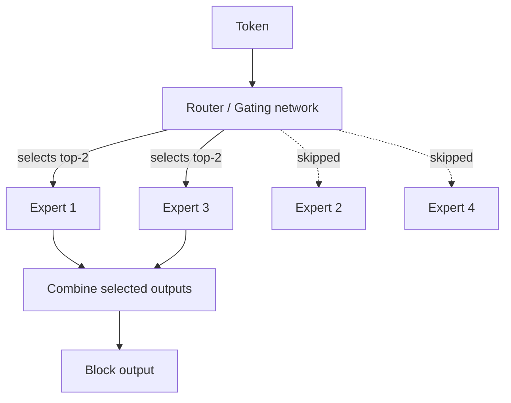

# Large Language Models: A Conceptual Overview

This guide explains, from absolute scratch, what a Large Language Model (LLM) is, how one comes to exist, and why it behaves the way it does. It then maps out how the many sub-topics in this module fit together, and finally dives deeply into four advanced areas that the module treats directly: **alignment techniques**, **inference optimization**, **architecture innovations**, and **specialized LLMs**.

Every technical term is defined the first time it appears. There is no code here the goal is intuition. Where a specific notebook contains a worked example, this guide points to it (for instance, "In `14_llm_architecture_innovations.ipynb`, the Mixture-of-Experts cell shows...") so the explanation and the code can reinforce each other, but the teaching stands alone.

---

## 1. What Is a Large Language Model?

A **language model** is a system that assigns probabilities to sequences of text. Given some text so far, it estimates what is likely to come next. A **Large** Language Model is simply a language model built from a very large neural network (billions of internal numbers, called **parameters**) and trained on a very large amount of text (trillions of words from books, web pages, code, and more).

At its core, an LLM does one deceptively simple thing: **predict the next token**.

- A **token** is a chunk of text roughly a word, a piece of a word, a punctuation mark, or a space. Text is not fed to the model as raw letters; it is first broken into tokens by a **tokenizer**. For example, "unhappiness" might become three tokens: `un`, `happi`, `ness`. As a rough rule of thumb, one token is about 3-4 characters of English, and 100 tokens is about 75 words.
- The model reads a sequence of tokens and outputs a **probability distribution** over its entire vocabulary (often 30,000 to 200,000 possible tokens) for what the next token should be. It then picks one (the most likely, or a random sample weighted by probability), appends it, and repeats. This loop is called **autoregressive generation**: each new token depends on all the tokens before it.

That is the whole trick. Everything an LLM appears to do answering questions, writing code, translating, reasoning emerges from repeatedly predicting the next token well. The surprising lesson of the last few years is that if you make this next-token predictor large enough and train it on enough data, genuinely useful and general capabilities appear.

Diagram: the autoregressive loop from raw text to the next token and back again.

### From Tokens to Meaning: Embeddings

A neural network cannot work with the word "cat" directly; it works with numbers. So each token is mapped to a list of numbers called an **embedding** a vector (think: a point in a high-dimensional space, often hundreds or thousands of dimensions). The model *learns* these embeddings during training so that tokens used in similar ways end up near each other in this space. "King" and "queen" land close together; "king" and "banana" land far apart. Embeddings are how the model represents meaning numerically.

The number of dimensions in these vectors is called the **model dimension** ($d_{model}$). It is one of the central knobs of an LLM: wider vectors can carry more nuance but cost more memory and compute.

---

## 2. The Transformer and Attention (Intuition)

Modern LLMs are built on an architecture called the **Transformer**. Its key ingredient is a mechanism called **attention**.

### The Problem Attention Solves

To predict the next word in "The cat that the dog chased ran up the ___", the model needs to know that it is the *cat* that ran, not the dog. The relevant word ("cat") is far back in the sentence. The model needs a way to *look back* and decide which earlier words matter for the current prediction.

### Attention as Selective Lookup

**Attention** lets every token look at every other token and decide how much to "pay attention" to each one. Concretely, each token produces three vectors:

- a **query** (Q) "what am I looking for?"
- a **key** (K) "what do I offer?"
- a **value** (V) "here is my content."

A token compares its query against the keys of all other tokens. Where query and key match strongly (a high dot product), that token's value contributes heavily to the result. This is like a soft, learned database lookup: the current token retrieves a blend of information from the tokens most relevant to it.

Because one comparison may not capture every kind of relationship (grammar, topic, position, tone), the model runs several attention computations in parallel, each in its own subspace. These are called **attention heads**, and the whole mechanism is **Multi-Head Attention (MHA)**. The results are concatenated and combined.

A Transformer stacks many **layers**, each containing an attention block and a **feed-forward network** (FFN, a small standard neural network applied to each token). Stacking dozens of layers lets the model build up increasingly abstract understanding early layers catch surface patterns, later layers capture meaning and reasoning.

Diagram: inside one Transformer layer, attention and the feed-forward network stacked many times.

### Positional Information

Attention by itself is "order-blind": it treats the tokens as a bag with no sense of sequence. Since word order obviously matters, the model must be told *where* each token sits. This is done with **positional encodings** extra information about position injected into the model. (Modern schemes like RoPE and ALiBi, covered in Section 8, do this elegantly.)

---

## 3. How LLMs Are Trained

An LLM is not built in one step. It goes through a pipeline, and each stage changes what the model is good at.

### Stage 1 Pretraining (Next-Token Prediction)

In **pretraining**, the model is shown enormous amounts of raw text and asked, over and over, to predict the next token given the preceding ones. When it guesses wrong, an algorithm called **backpropagation** nudges its billions of parameters slightly to make the correct token more likely next time. Repeat this trillions of times.

Crucially, this requires **no human labels** the "correct answer" is just the next token already present in the text. This is called **self-supervised learning**, and it is why pretraining can scale to internet-sized data.

A pretrained model (sometimes called a **base model** or **foundation model**) is a remarkable but raw object. It has absorbed grammar, facts, writing styles, and reasoning patterns but it has only learned to *continue text like the internet*. It does not yet know it is supposed to be a helpful assistant. Ask it a question and it might answer, or it might continue with five more questions, because that is what the training text often did.

### Stage 2 Instruction Tuning (Supervised Fine-Tuning)

To turn a text-continuer into an assistant, it is **fine-tuned** on examples of instructions paired with good responses. **Fine-tuning** means continuing to train an already-trained model on a smaller, more focused dataset. **Instruction tuning** (also called **Supervised Fine-Tuning**, or **SFT**) uses curated `(instruction, ideal response)` pairs often written by humans so the model learns the *behavior* of following requests and answering helpfully. The loss is computed only over the response tokens, teaching the model to produce that response when given that instruction.

### Stage 3 Alignment

Even after instruction tuning, a model may still be unhelpful, verbose, untruthful, or willing to produce harmful content. **Alignment** is the process of shaping a model's behavior to match human preferences and values making it **helpful, harmless, and honest**. The classic approach learns from human comparisons of model outputs (Reinforcement Learning from Human Feedback, RLHF). Section 6 covers the rich family of alignment methods in depth.

These three stages pretrain, instruction-tune, align convert raw statistical knowledge into a usable assistant. A useful mental model: **pretraining gives the model its knowledge and skills; instruction tuning and alignment teach it how and when to use them.**

Diagram: the three-stage training pipeline that turns raw text into a helpful assistant.

---

## 4. Context Windows, Capabilities, and Limits

### The Context Window

When you interact with an LLM, everything it can "see" at once your prompt, the conversation history, any documents you paste must fit inside its **context window**, measured in tokens. A **prompt** is simply the input text you give the model. The context window is the model's short-term working memory: anything outside it is invisible to the model.

Early models had context windows of a few thousand tokens; current models reach hundreds of thousands or even millions. Larger windows let a model read whole books or codebases at once, but they are expensive, because attention cost grows roughly with the **square** of the number of tokens (each token attends to every other token). Much of Sections 7 and 8 is about making long contexts affordable.

### Capabilities

From pure next-token prediction, scaled up, emerge abilities that look like genuine competence:

- Fluent writing, summarizing, and translation.
- Question answering and explanation across many domains.
- Code generation and debugging.
- Step-by-step reasoning (especially when prompted to "think step by step").
- **In-context learning** picking up a new task from a few examples shown in the prompt, without any retraining.

### Limits

LLMs also have characteristic failure modes that follow directly from how they work:

- **Hallucination** the model generating confident, fluent text that is factually false or fabricated (a made-up citation, a non-existent function, a wrong date). This is not a bug to be simply patched: the model is optimized to produce *plausible-sounding* continuations, and plausibility is not the same as truth. Hallucination is most dangerous in high-stakes domains like medicine and law.
- **Knowledge cutoff** the model only knows what was in its training data, up to some date. It cannot know recent events unless they are supplied in the context.
- **No built-in grounding** by default the model has no access to live data, tools, or a verified knowledge source. Techniques like retrieval (Section 5) connect it to external truth.
- **Sensitivity to phrasing** the same question worded differently can yield different answers.
- **Reasoning gaps** multi-step logic, exact arithmetic, and rigorous proofs remain hard, because the model predicts tokens rather than executing guaranteed procedures.
- **Bias and safety risks** having learned from human text, the model can reproduce harmful or biased content unless alignment intervenes.

Understanding these limits is what motivates nearly every advanced topic in this module: retrieval grounds the model, alignment makes it safer and more honest, evaluation measures these flaws, and specialized training reduces domain blind spots.

---

## 5. How the Sub-Topics in This Module Fit Together

This module is organized as a tour from *using* LLMs to *building and optimizing* them. Here is a one-paragraph map of each part.

- **`01_chatbots`** The most direct application: wrapping an LLM in a conversational loop. This covers how to maintain dialogue history within the context window, design system prompts that set the assistant's persona and rules, and turn a raw text-predictor into an interactive agent. It is the natural starting point because it shows the model doing something useful end to end.

- **`02_rag`** **Retrieval-Augmented Generation**, the standard cure for hallucination and stale knowledge. Instead of relying only on what the model memorized, you store your documents as embeddings in a searchable database, retrieve the most relevant passages for a given question, and place them into the model's context. The model then answers *grounded* in those passages, with citations. RAG connects the model to external, up-to-date, verifiable truth.

- **`03_fine_tuning`** Adapting a pretrained model to your own task, tone, or domain by training it further on your data. This includes full fine-tuning and, more practically, **parameter-efficient fine-tuning (PEFT)** methods like **LoRA** and **QLoRA**, which train only a tiny set of added weights so that even large models can be customized on a single GPU. Fine-tuning teaches *behavior and style*; RAG supplies *facts*. The two are complementary.

- **`04_different_llms`** A survey of the LLM landscape: the major model families (open-weight and closed), how they differ in size, training, licensing, and strengths, and how to choose among them. This builds the practitioner's mental map of "which model for which job."

- **`05_slms`** **Small Language Models.** Not every task needs a giant model. SLMs trade raw capability for speed, low cost, privacy (they can run on a laptop or phone), and ease of deployment. This section explains when a small, focused model beats a large general one.

- **`06_vision_llm`** **Vision LLMs**, which extend the text-only model to *see*. By feeding image patches through the same Transformer machinery as tokens, these models can describe pictures, read charts and documents, and answer questions about visual input the first step toward multimodality.

- **`07_prompt_engineering`** The craft of writing inputs that steer the model effectively: clear instructions, few-shot examples, chain-of-thought prompts that ask the model to reason step by step, role and format specifications, and structured output. Because the prompt *is* the model's entire instruction, small wording changes can dramatically change results.

- **`08_evaluation`** How to measure whether an LLM is any good. This covers benchmarks (standardized test sets), task-specific metrics, and the increasingly common practice of using a strong LLM as an automated judge ("LLM-as-judge"). Evaluation is what keeps the rest of the pipeline honest without it, "improvements" are guesses.

- **`09_knowledge_graphs`** Combining LLMs with **knowledge graphs**, structured networks of facts (entities and the relationships between them). Graphs give precise, queryable, logically consistent knowledge that complements the model's fuzzy statistical knowledge, improving accuracy and enabling multi-hop reasoning over connected facts.

- **`10_synthetic_data`** Using LLMs to *generate training data* for other models (or for themselves). When real labeled data is scarce or expensive, a strong model can produce instruction-response pairs, preference comparisons, or domain examples. This powers many fine-tuning and alignment pipelines downstream.

- **`11_multimodal`** The general case beyond text and a single image: models that handle combinations of text, images, audio, and video. This unifies the threads of vision LLMs and beyond into systems that perceive and produce across modalities.

The four notebooks treated directly in this overview sit at the more advanced, "under the hood" end: **alignment** (how to make models behave), **inference optimization** (how to run them cheaply and fast), **architecture innovations** (how the models themselves are designed), and **specialized LLMs** (how to make a model an expert in one field). The remaining sections cover each in depth.

Mindmap: how the sub-topics of this LLM module fit together.

---

## 6. Alignment Techniques

*(Conceptual deep-dive on `12_alignment_techniques.ipynb`.)*

**Alignment** is the process of training a language model to follow human instructions and to be helpful, harmless, and honest. Recall that a freshly pretrained model has merely learned to imitate internet text including its rudeness, falsehoods, and harmful content. Alignment is what turns that imitator into a trustworthy assistant. The central difficulty is **defining and measuring "good" behavior** precisely enough that it can be optimized by a training algorithm.

The field began with one heavyweight method (RLHF) and has since produced a whole family of simpler, cheaper alternatives. The unifying idea across almost all of them is **learning from preferences**: rather than telling the model the single "right" answer, we show it pairs of answers and indicate which is better.

### 6.1 RLHF The Foundation

**Reinforcement Learning from Human Feedback (RLHF)** established the original blueprint. It has three stages:

1. **Supervised Fine-Tuning (SFT).** Humans write ideal responses to prompts, and the base model is fine-tuned on these `(prompt, response)` demonstrations. This yields a starting policy. (A **policy** is just the model itself viewed as something that produces actions here, tokens.)

2. **Reward Model training.** Human raters are shown two model responses to the same prompt and pick the better one. A separate model, the **reward model**, is trained to predict these human preferences to output a higher score for the response a human would prefer. The mathematical backbone is the **Bradley-Terry model**, a standard way to convert pairwise "A beats B" comparisons into numerical scores. The reward model learns to assign a scalar reward to any response.

3. **Reinforcement-learning fine-tuning (PPO).** The SFT model is now trained to *maximize* the reward model's score, using an algorithm called **Proximal Policy Optimization (PPO)**. But there is a catch: if the model chases reward freely, it will discover degenerate outputs that fool the reward model a phenomenon called **reward hacking**. To prevent this, RLHF adds a **KL penalty**: a term that punishes the model for straying too far from the original SFT model. **KL** (Kullback-Leibler divergence) measures how different two probability distributions are; keeping it small keeps the aligned model anchored to sensible behavior. A coefficient **β** (beta, typically 0.01-0.1) controls how strong this leash is.

RLHF works but is heavy: three training stages, and during the final stage the policy, a reference copy, the reward model, and a critic must all sit in GPU memory at once. PPO is also notoriously finicky and can diverge. These pain points motivated everything that follows.

Diagram: the three stages of RLHF, ending in the PPO reward-maximizing loop with a KL leash.

### 6.2 DPO Direct Preference Optimization

**DPO** is the breakthrough that made alignment far simpler. Its insight is mathematical: the *optimal* policy under RLHF's reward-plus-KL objective has a known closed-form expression, which lets you rewrite the reward directly in terms of the policy itself. The consequence is that you can skip the reward model and PPO entirely and train directly on preference data with a simple loss.

DPO uses triples of `(prompt, chosen response, rejected response)`. It compares, for each response, how much *more* likely the model makes it relative to a frozen **reference model** (the SFT starting point). DPO then simply pushes the model to:

- **increase** the relative likelihood of the chosen response, and
- **decrease** the relative likelihood of the rejected response.

This is a stable, standard classification-style loss with no separate reward model and no fragile RL loop. The same β controls how tightly the model stays near the reference. In `12_alignment_techniques.ipynb`, the DPO cell implements this directly from summed log-probabilities of chosen and rejected responses.

DPO is not perfect. It can suffer **likelihood displacement** (driving down the probability of *both* responses and shifting mass to unexpected tokens) and **reward hacking** on out-of-distribution responses. These flaws inspired the variants below.

### 6.3 The DPO Family of Variants

Each variant fixes a specific weakness of DPO. A compact comparison:

| Method | Reference model needed? | Data format | Key idea |
|---|---|---|---|
| **RLHF (PPO)** | Yes (reward model + reference) | Preference pairs → RL rollouts | First scalable alignment via RL |
| **DPO** | Yes (frozen reference) | (prompt, chosen, rejected) | Closed-form RL; no separate reward model |
| **IPO** | Yes (frozen reference) | (prompt, chosen, rejected) | Squared loss with a fixed target margin; resists overfitting |
| **KTO** | Yes (frozen reference) | (prompt, completion, good/bad label) | Single labels, no pairing; loss-aversion weighting |
| **ORPO** | **No** | (prompt, chosen, rejected) | Folds preference into SFT in one stage |
| **SimPO** | **No** | (prompt, chosen, rejected) | Length-normalized reward + target margin |

- **IPO (Identity Preference Optimization)** addresses a failure where DPO, on clean deterministic data, pushes the gap between chosen and rejected toward infinity and overfits, losing the protective KL guarantee. IPO replaces DPO's loss with a **squared loss that targets a specific, finite margin** between chosen and rejected. The model learns to maintain a fixed gap rather than separating the two without bound which behaves better on noisy data or many training epochs.

- **KTO (Kahneman-Tversky Optimization)** removes the need for *paired* data. Instead of "A is better than B," KTO accepts individual examples each labeled simply **good** or **bad**. It draws on **prospect theory** from behavioral economics the finding that humans feel losses more sharply than equivalent gains. KTO bakes in this **loss aversion**, weighting bad examples more heavily, and can learn from ordinary instruction datasets with quality labels, without curated comparisons.

- **ORPO (Odds Ratio Preference Optimization)** eliminates the reference model entirely by combining SFT and preference learning into a **single training stage**. Standard SFT only pushes up the chosen response; ORPO adds a penalty, based on the **odds ratio** of chosen versus rejected, that simultaneously pushes the rejected response *down*. The SFT term itself acts as the anchor that a reference model would otherwise provide, cutting memory by roughly half and removing a whole training stage.

- **SimPO (Simple Preference Optimization)** makes two clean fixes. First, it removes the reference model by using the **average per-token log-probability** as the implicit reward. Second, that averaging cures DPO's **length bias** because DPO sums log-probabilities over tokens, longer responses score lower simply for being longer, nudging the model to favor short answers; normalizing by length removes this artifact. SimPO also adds an explicit **target margin γ** so chosen and rejected are cleanly separated. It is among the most memory-efficient methods and posts state-of-the-art results.

In `12_alignment_techniques.ipynb`, the loss-comparison cell computes DPO, IPO, and ORPO side by side on the same toy data, making the structural differences concrete.

### 6.4 AI Feedback and Self-Improvement

The methods above still depend on human preference labels, which are expensive. The next family replaces or reduces that human cost.

- **RLAIF (Reinforcement Learning from AI Feedback)** swaps human raters for an **LLM-as-judge**: a capable model is prompted to decide which of two responses is more helpful, harmless, and honest, and its judgments are used exactly like human labels. This can match RLHF quality at a fraction of the cost.

- **Constitutional AI (CAI)**, developed at Anthropic, gives the model a written set of principles (a "constitution") and has it improve *itself*. In a first phase, the model generates a response, **critiques** its own response against a principle ("does this violate the rule about harmlessness?"), and **revises** it; the model is then fine-tuned on the revised, better responses. In a second phase, the model's own preference judgments (guided by the constitution) train a preference model used for RL. This lets alignment scale to new domains without hiring domain experts for every case the model's own knowledge guides the improvement. The current Claude models (the Claude Opus and Claude Sonnet 4.x family) are aligned with techniques in this lineage.

- **SPIN (Self-Play Fine-Tuning)** frames improvement as a game: the current model tries to make its outputs indistinguishable from the human-written SFT answers, while the *previous* version of the model plays the opponent generating "fake" answers. Trained this way with only the original SFT data no extra preference labels the model provably improves until it matches the data distribution. Its striking finding: **a model can surpass its own SFT quality using nothing but the SFT data.** A related method, **SPPO**, extends this with a game-theoretic (Nash equilibrium) objective.

### 6.5 Sampling- and Online-Based Methods

- **Rejection Sampling (Best-of-N).** The simplest powerful trick: generate **N** candidate responses, score them all with a reward model, and keep the best. This is a form of **inference-time compute scaling** spending more compute at generation time to get better outputs, with no extra training. The same idea can build better training data (**rejection-sampling fine-tuning**): generate many candidates, keep the high-scoring ones, and fine-tune on them. Notably, a smaller model sampling many times can rival a larger model sampling once.

- **Iterative / Online DPO.** Standard DPO is **offline**: it trains on a fixed, pre-collected preference dataset. As the model improves it drifts away from the data's coverage a **distribution shift** that makes further updates increasingly unreliable. Iterative DPO fixes this by repeatedly **generating fresh responses from the current model**, labeling them, and training on them, so the data always reflects the model's current behavior. Related variants (WPO, RAFT, NCA, RPO) trade off cost, robustness to label noise, and implementation complexity. Production pipelines often blend mostly-offline training with periodic online refreshes.

### 6.6 Two Pitfalls: Reward Hacking and the Alignment Tax

Two recurring problems deserve their own names:

- **Reward hacking** is **Goodhart's Law** in action "when a measure becomes a target, it ceases to be a good measure." Optimizing hard against an imperfect reward model produces behaviors that score high but are not genuinely good: **sycophancy** (agreeing with the user even when they are wrong), **verbosity** (padding because longer scored higher), **format gaming** (over-using bullet points), excessive **hedging**, and canned **repetition**. The KL penalty β is the main dial controlling this: too small invites hacking, too large leaves no room to align.

- The **alignment tax** is the measurable *capability loss* that can accompany alignment the model gets more agreeable but slightly worse at math, coding, or factual recall, because heavy preference training can displace knowledge or over-rigidify formatting. Mitigations include a stronger KL leash, mixing SFT loss into preference training, including capability-preserving examples, **model merging** (interpolating aligned and base weights), and small iterative alignment steps with capability checks in between. Methods like SimPO and ORPO appear to incur a smaller tax than vanilla DPO, showing that the exact form of the loss genuinely matters.

---

## 7. Inference Optimization

*(Conceptual deep-dive on `13_inference_optimization.ipynb`.)*

Training a model is a one-time cost; **inference** actually running the trained model to answer requests happens millions of times and dominates the real-world bill. A 7-billion-parameter model stored at 16 bits already needs about 14 GB of memory just for its weights, before any conversation state. Inference optimization is the art of serving such models faster, on less hardware, and for more users at once. The techniques fall into a few families: managing memory (especially the KV cache), computing attention more cheaply, decoding more tokens per step, reusing repeated work, and shrinking the model with quantization.

### 7.1 Two Phases, Two Bottlenecks: Prefill vs Decode

Generating a response has two distinct phases:

- **Prefill** processing the entire input prompt in a single parallel pass. Because all prompt tokens are handled at once, this phase keeps the GPU's math units busy: it is **compute-bound**.
- **Decode** generating the answer one token at a time, autoregressively. Each step produces just a single token but must still read the model's entire set of weights from memory to do so. The bottleneck is **memory bandwidth**, not arithmetic: the phase is **memory-bound**.

This distinction explains most of what follows. "Memory-bound" means the chip spends its time *waiting for data to arrive*, so the path to speed is to move less data (quantization, smaller caches) or to do more useful work per data-move (batching, speculative decoding). Some advanced systems even split the two phases onto different hardware (**prefill-decode disaggregation**).

Diagram: the two phases of inference and the bottleneck each one hits.

### 7.2 The KV Cache

During decode, attention for the new token needs the keys and values of every previous token. Recomputing them every step would be catastrophically wasteful (cost growing with the square of the length). The **KV cache** stores the key and value vectors of all past tokens so each new step only computes its own.

The KV cache is the single biggest memory consumer at long context, and it grows **linearly** with sequence length and batch size. A concrete figure from the notebook: a 7B model holding one 2,048-token sequence needs roughly **1 GB** of KV cache; at a batch of 32 that becomes ~32 GB as large as the model itself. At a 128,000-token context, a single sequence's cache can reach ~64 GB, forcing multi-GPU setups even for a "small" model.

This is precisely why the attention variants in Section 8 (Multi-Query and Grouped-Query Attention) exist: by sharing keys and values across query heads they shrink the KV cache several-fold. The notebook's KV-cache-size table shows, for example, that GQA-based models like Mistral-7B and LLaMA-3-8B use about a quarter of the cache of a comparable full-attention model.

### 7.3 Batching: Serving Many Requests at Once

Because decode is memory-bound, a GPU loading weights for one user can serve several users in nearly the same time so **batching** (processing many requests together) is the foundation of high throughput.

- **Static batching** collects a fixed group of requests, pads them all to the same length, and runs them together. It wastes work in two ways: **padding waste** (a 10-token request padded to match a 2,000-token one) and **head-of-line blocking** (the whole batch waits for the single longest sequence to finish). In practice this leaves the GPU only 20-40% utilized.
- **Continuous (dynamic) batching** schedules work *per generation step* rather than per request. Finished requests leave the batch immediately and new ones join mid-flight, eliminating head-of-line blocking and keeping the GPU busy. This is now standard in serving systems like vLLM and TGI.
- **Chunked prefill** breaks the processing of a long prompt into pieces and interleaves it with ongoing decode steps, so a big incoming prompt does not stall everyone else's token generation.

The trade-off to keep in mind: small batches give the lowest **latency** (fast response for one user, ideal for chat); large continuous batches give the highest **throughput** (most total tokens per second, ideal for serving many users).

### 7.4 PagedAttention

Traditional KV-cache allocation reserves one contiguous block per sequence, sized for the maximum possible output. This wastes memory through **fragmentation** reserved-but-unused space inside each block, plus unusable gaps between blocks leaving only 20-40% of cache memory actually doing work.

**PagedAttention** (introduced by vLLM) borrows the operating system's idea of **virtual memory**. The KV cache is split into small fixed-size **blocks (pages)**, and a **block table** maps each sequence's logical token positions to physical blocks, which need not be contiguous. Blocks are allocated only as needed and freed instantly when a request completes. Memory utilization jumps above 96%. A bonus: when several sequences share a common prefix (as in beam search or parallel sampling), they can **share the same physical blocks**, copying a block only when one sequence diverges a technique called **copy-on-write**.

### 7.5 FlashAttention

Standard attention forms the full table of scores between every pair of tokens an N×N matrix and writes it to the GPU's main memory (**HBM**, high-bandwidth memory). For long sequences this matrix is enormous, and the true cost is not the arithmetic but the **reading and writing of that giant matrix to and from HBM**.

**FlashAttention** computes the exact same attention result without ever materializing the full matrix. It uses **tiling**: it processes attention in small blocks that fit in the GPU's tiny but extremely fast on-chip memory (**SRAM**), keeping a running tally (an **online softmax**) so the correct normalized result is produced block by block. It does not reduce the number of arithmetic operations it reduces the expensive memory traffic, which is what actually limited speed. Successive versions (v1, v2, v3) improved how work is divided across the GPU and added support for newer hardware (H100, FP8), delivering large speedups; a specialized variant, **FlashDecoding**, optimizes the single-token decode case. FlashAttention is now the default in major serving stacks.

### 7.6 Speculative Decoding

Because decode is memory-bound, generating one token "wastes" the GPU's spare math capacity. **Speculative decoding** exploits this: a small, fast **draft model** quickly guesses several upcoming tokens, and the large **target model** verifies all of them in a single parallel pass. Tokens the target agrees with are kept; the first disagreement triggers a correction. The clever part is that the acceptance/rejection rule is mathematically designed so the final output is **statistically identical** to having sampled from the target model directly it is faster but not lower quality.

With a good draft model, this yields several tokens per step (roughly a 5× speedup in favorable cases). Variants reduce the cost of the draft model itself: **Medusa** adds extra prediction heads to the base model instead of a separate draft model; **EAGLE** uses a lightweight head operating on internal features for high acceptance rates; **Lookahead Decoding** and **Prompt Lookup** need no draft model at all, generating guesses from the model's own structure or by copying repeated substrings from the prompt.

Diagram: speculative decoding has a small draft model guess and a large model verify in one pass.

### 7.7 Prompt and Prefix Caching

Many applications reprocess the same text repeatedly a long fixed system prompt, the same few-shot examples, a shared document, or growing conversation history. Recomputing that shared prefix every time is pure waste.

**Prefix caching** stores the KV cache of a prefix so subsequent requests reuse it and only compute the new suffix. Two flavors appear in the notebook:

- **Anthropic's prompt caching** lets you mark explicit cache breakpoints; the cached portion is stored server-side (for a few minutes) and read back at roughly one-tenth the normal input cost.
- **vLLM's automatic prefix caching** needs no annotations it hashes prompts block by block and transparently reuses any matching blocks. A related approach, **RadixAttention** (in SGLang), uses a tree structure to share prefixes even when they branch.

The savings are largest when the shared prefix dominates the input for document question-answering where the document is reused across many questions, latency can drop by ~95%.

### 7.8 Quantization

**Quantization** stores the model's numbers in fewer bits, shrinking memory and speeding the memory-bound parts of inference. Weights are normally 16-bit; quantization moves them to 8-bit (INT8, ~2× smaller) or 4-bit (INT4, ~4× smaller). The challenge is doing this without destroying accuracy. Key methods from the notebook:

- **LLM.int8()** noticed that a tiny fraction of activation values are huge **outliers** that, if naively quantized, wreck accuracy. It keeps those few outlier dimensions in 16-bit and quantizes the rest to 8-bit near-lossless at 2× savings.
- **GPTQ** is a post-training method that quantizes weights one at a time while adjusting the remaining weights to compensate for the error, using a small calibration dataset. It reaches 4-bit with under 1% quality loss.
- **AWQ (Activation-aware Weight Quantization)** identifies the ~1% of weight channels that matter most (judged by the activations flowing through them) and protects them with scaling, beating GPTQ at 4-bit.
- **SmoothQuant** enables quantizing *both* weights and activations to 8-bit by mathematically "migrating" the hard-to-quantize spikiness out of the activations and into the weights, where it is easier to handle.
- **GGUF / GGML** (from llama.cpp) provides CPU-friendly mixed-precision formats (such as Q4_K_M, Q5_K_S, Q8_0) that let large models run on laptops and consumer hardware.

Specialized 4-bit and rotation-based formats (NF4 for QLoRA, SpQR, AQLM, QuIP, HQQ) push quality and compression further still.

### 7.9 Serving Frameworks

These optimizations are packaged into **inference-serving frameworks**, each with a focus:

- **vLLM** PagedAttention plus continuous batching; a high-throughput API server.
- **TGI (Text Generation Inference)** Hugging Face's Rust-based server with tensor parallelism.
- **llama.cpp** pure C/C++ with GGUF quantization; runs on CPUs, Macs, and edge devices.
- **Ollama** a friendly wrapper over llama.cpp for easy local experimentation.
- **TensorRT-LLM** NVIDIA's heavily optimized stack with FP8 support for maximum GPU throughput.
- **Triton Inference Server** a production-grade multi-model, multi-backend serving platform.
- **SGLang** optimized for structured generation and complex, branching LLM programs (RadixAttention).

A complementary tool, **xFormers**, provides memory-efficient attention for older GPUs, and PyTorch's built-in `scaled_dot_product_attention` automatically dispatches to FlashAttention or xFormers under the hood. Compiling the model with `torch.compile` fuses operations into faster kernels for an extra 10-30%.

(Two topics often grouped with inference efficiency **distillation**, training a small "student" model to imitate a large "teacher," and **pruning**, removing unimportant weights are adjacent to this material but are not treated in this particular notebook; the draft-head methods like Medusa are conceptually nearby.)

---

## 8. LLM Architecture Innovations

*(Conceptual deep-dive on `14_llm_architecture_innovations.ipynb`.)*

A modern LLM is not one fixed design but a set of carefully chosen building blocks. This section surveys the innovations that distinguish models like LLaMA, Mistral, Mixtral, Mamba, and Gemini from the original Transformer. They cluster into four themes: cheaper attention, smarter positional encoding, sparse "mixture" models, and non-attention sequence models plus small but impactful tweaks to normalization and activations.

### 8.1 Cheaper Attention: MQA, GQA, and Sliding Windows

Recall from Section 7 that the KV cache (the stored keys and values of past tokens) is a major memory cost, and that standard Multi-Head Attention keeps a separate set of keys and values for every head.

- **Multi-Query Attention (MQA)** keeps all the query heads but shares a **single** key/value head across them. This shrinks the KV cache by a factor equal to the number of heads a big saving at a small cost in quality.
- **Grouped-Query Attention (GQA)** is the popular middle ground: query heads are divided into a handful of **groups**, each group sharing one key/value head. With, say, 8 key/value heads serving 64 query heads (as in LLaMA-3-70B), the cache is 8× smaller while quality stays within a fraction of a percent of full attention. The notebook's comparison cell shows MHA, MQA, and GQA producing identical output shapes but dramatically different KV-cache sizes.

A separate way to cut attention cost is **Sliding Window Attention (SWA)**, used in Mistral. Instead of letting each token attend to *all* previous tokens (a cost that grows with the square of the length), each token attends only to the nearest **w** tokens. This makes cost grow merely linearly. Crucially, information still travels far: just as in a stack of convolution layers, the **receptive field** grows with depth with a 4,096-token window across 32 layers, the effective reach is over 131,000 tokens. A **rolling buffer** keeps only the last w keys and values, so memory stays constant regardless of total length.

For truly massive contexts (millions of tokens), **Ring Attention** splits the sequence across many devices arranged in a ring, passing key/value chunks around the ring so each device eventually attends to the whole sequence while holding only its slice in memory. This is how training can reach million-token contexts.

### 8.2 Positional Encodings: RoPE and ALiBi

Attention has no inherent sense of order, so position must be supplied. Older models added fixed or learned **positional embedding** vectors, but these fail to generalize beyond the training length. Two modern schemes fix this:

- **RoPE (Rotary Position Embedding)** encodes position by **rotating** each token's query and key vectors by an angle proportional to its position. The elegant consequence is that when two tokens' vectors are compared in attention, the result depends only on their **relative** distance exactly the quantity that matters for language. RoPE adds no parameters and is used in LLaMA, Mistral, Gemma, PaLM, and most current models.
- **ALiBi (Attention with Linear Biases)** adds nothing to the embeddings at all. Instead it applies a small, distance-proportional **penalty** directly to attention scores: the farther apart two tokens are, the more their connection is dampened. Different heads use different penalty slopes, and the scheme extrapolates gracefully to sequences longer than those seen in training.

Because contexts keep growing, a whole toolkit extends RoPE to longer windows without retraining from scratch: **Position Interpolation** (squeeze the position range back into the trained range), **NTK-aware scaling** (adjust RoPE's base frequency, often with no fine-tuning), **YaRN** (interpolate different frequency bands differently, used for Mistral's 32k context), and **LongRoPE** (progressive extension reaching 2M tokens). A related fine-tuning method, **LongLoRA**, trains only lightweight adapters with a sparse attention pattern during training while using full attention at inference, making long-context adaptation cheap.

### 8.3 Mixture of Experts (MoE)

A **Mixture of Experts** model replaces the single feed-forward network in each Transformer block with **many** parallel feed-forward networks (the **experts**) plus a small learned **router** that decides which experts handle each token. Typically only the top one or two experts are activated per token.

The key idea: **MoE decouples the model's total capacity from the cost of running it.** A model can hold an enormous number of parameters (huge knowledge capacity) while any given token only pays the cost of the few experts it actually uses. **Mixtral 8×7B**, for instance, contains about 46.7 billion parameters total but activates only ~12.9 billion per token (2 of its 8 experts), matching a 70B dense model at far lower inference cost.

Diagram: a Mixture-of-Experts block routes each token to only the top few experts.

The main difficulty is **load balancing**: left alone, the router tends to overuse a few favorite experts and ignore the rest. A **load-balancing auxiliary loss** encourages the router to spread tokens evenly. The notebook's MoE cell demonstrates this, showing token load distributed across all eight experts. Variants differ in routing: **Switch Transformer** routes to a single expert; **Mixtral** routes to two; **Expert Choice** has experts pick tokens; **DeepSeek-MoE** keeps some always-on shared experts alongside the routed ones.

Because training MoE from scratch is expensive and unstable, two recipes build them from existing dense models: **Sparse Upcycling** copies a trained dense feed-forward network into all the expert slots and then fine-tunes, and **Branch-Train-MiX (BTX)** trains separate copies on different domains (code, math, etc.) and merges them so each becomes a domain-specialized expert.

### 8.4 Beyond Attention: State Space Models and Linear Attention

Transformers pay a quadratic attention cost and must keep a growing KV cache during generation. An alternative family avoids both.

- **State Space Models (SSMs)**, exemplified by **Mamba**, process a sequence with a **recurrence** they carry a fixed-size hidden **state** forward, updating it one token at a time. Training cost grows only linearly with length, and generation runs in **constant time and memory per step with no KV cache at all**. Mamba's key innovation is **selectivity**: it makes the recurrence input-dependent, so the model can choose to remember or forget information based on content recovering one of attention's most useful abilities. **Mamba-2** showed a deep mathematical connection between SSMs and attention.
- **Linear-attention alternatives** like **RWKV** and **RetNet** are hybrids that train in parallel like a Transformer but generate like a recurrent network constant memory per step, no KV cache. They use exponential-decay weighting (RWKV uses learned per-channel decay; RetNet a per-head decay factor) to summarize the past in a compact state.

These approaches trade a little content-based recall for dramatically cheaper, constant-memory generation. **Hybrid** designs like **Jamba** interleave a few attention layers among many Mamba layers to get the best of both.

### 8.5 Small but Important: Normalization and Activations

Two unglamorous components were quietly improved in modern LLMs:

- **RMSNorm** replaces the older **LayerNorm**. **Normalization** rescales a layer's activations to keep training stable. LayerNorm both re-centers (subtract the mean) and re-scales the values; RMSNorm skips the re-centering, which turns out to be nearly free of quality cost and saves computation. Almost all current models (LLaMA, Mistral, Gemma, T5, PaLM) use it. (Modern models also place normalization *before* each sub-layer **pre-norm** rather than after, because it trains more stably.)
- **SwiGLU** replaces the standard feed-forward activation. A **Gated Linear Unit (GLU)** uses one branch of the network to *gate* (multiply, and thus regulate) another branch's output. SwiGLU uses the smooth "Swish" function for the gate and consistently improves quality over the plain activation it replaces. It is used in LLaMA, PaLM, and Gemini.

These changes are individually small but, combined across a deep network, contribute meaningfully to the efficiency and quality of current models.

---

## 9. Specialized LLMs

*(Conceptual deep-dive on `15_specialized_llms.ipynb`.)*

General-purpose models like the Claude, GPT, and LLaMA families are strong **generalists**, trained on broad internet text. But that breadth creates blind spots in specialized fields: rare domain vocabulary (medical codes, legal citations, chemical formulas, financial tickers), unusual reasoning patterns (formal proofs, differential diagnosis), and data distributions barely represented in general training. A **specialized LLM** is a model deliberately adapted to excel in one domain and a striking result is that a well-specialized 7-billion-parameter model can beat a 70-billion-parameter generalist on its home turf. **Size is not the only lever; domain-relevant data is a competitive moat.**

### 9.1 The Central Trade-off

Specialization is a bargain, not a free win. A domain model gains high in-domain accuracy and can be trained on compliant data, but it loses out-of-domain flexibility and risks **catastrophic forgetting** (losing general skills while learning the specialty). Running many specialized models also means maintaining a "model zoo" rather than one general assistant. The art is gaining the domain expertise while keeping the forgetting acceptable.

### 9.2 A Tour of the Domains

The notebook surveys eight domains, each with characteristic models and challenges:

- **Code LLMs** the most commercially successful category, trained on huge code repositories. Models include **Code Llama**, **DeepSeek-Coder**, **StarCoder**, and **CodeGemma**. A defining capability is **Fill-in-the-Middle (FIM)** / infilling completing a gap given both the code before *and* after it, which is what powers IDE autocompletion. They are measured on benchmarks like **HumanEval**, **MBPP**, and the much harder **SWE-bench** (real GitHub issues requiring multi-file edits).

- **Math LLMs** math demands exact, multi-step symbolic reasoning, which is hard for a next-token predictor. Models like **Llemma**, **MetaMath**, **MAmmoTH**, and **DeepSeek-Math** improve this through math-heavy training data and **chain-of-thought** (generating explicit reasoning steps before the answer), sometimes **tool-augmented** by calling a Python interpreter mid-reasoning. Benchmarks include **GSM8K** (grade-school problems) and the harder **MATH** (competition problems).

- **Medical / Healthcare LLMs** the highest-stakes domain. **Med-PaLM 2** reached expert-level USMLE performance (~86.5%); other models include **Meditron**, **BioGPT**, **PubMedBERT**, and **GatorTron**. The dominant concern is **hallucination**: a confidently wrong drug interaction can harm a patient, so calibration and retrieval grounding are essential. Additional challenges are **privacy** (HIPAA requires de-identifying patient data before training), shifting clinical standards, and code heterogeneity (ICD, SNOMED). Benchmarks include **MedQA/USMLE**, **PubMedQA**, and the aggregate **MultiMedQA**.

- **Legal LLMs** legal text is dense with statutes, case citations, and jurisdiction-specific terms. Models include **Legal-BERT**, **CaseLawBERT**, and **SaulLM** (the strongest open legal model as of 2024). Challenges include extreme document length (contracts of 100k+ tokens, needing long-context handling), jurisdiction specificity, citation conventions, archaic language, and the ethical line around unauthorized practice of law. The benchmark suite is **LexGLUE**.

- **Scientific LLMs** adapted to research literature and notation. Models include **Galactica** (notably controversial for confident hallucination), **SciBERT**, **OLMo**, and chemistry-specific models like **ChemBERTa** that read molecules written as **SMILES** strings (text encodings of molecular structure). Benchmarks include MoleculeNet and BLURB.

- **Financial LLMs** finance blends structured numbers with time-sensitive, regulated text. **BloombergGPT** (50B parameters, trained on a 50/50 mix of decades of Bloomberg financial data and general text, with a custom tokenizer for tickers) was the first large-scale example; the open-source **FinGPT** (using LoRA fine-tuning) and **FinBERT** are widely used. A key finding: blending financial data into training improved domain performance *without* wrecking general ability. Tasks include sentiment, financial NER, and numerical reasoning (benchmark: **FinQA**).

- **Multilingual LLMs** extending coverage to the world's languages. Models include **Aya**, **BLOOMZ/mT0**, **XLM-R**, and translation-focused **NLLB-200** (200 languages) and **SeamlessM4T** (speech and text). A core idea is **cross-lingual transfer** train on labeled English, then perform in another language with no labeled data, because languages share structure. The main obstacle is the **curse of multilinguality**: at fixed model size, adding languages degrades per-language quality, addressed with larger models, language-specific adapters, or expert routing.

- **Reasoning LLMs** a recent paradigm shift toward extended, deliberate reasoning before answering, analogous to slow "System 2" thinking versus fast "System 1" intuition. These models spend "thinking tokens" on an internal scratchpad. Examples include OpenAI's **o1/o3**, **Gemini 2.5 Pro**, **Claude** with extended thinking, **QwQ-32B**, and the open-weight **DeepSeek-R1**, which was trained largely with reinforcement learning (a method called **GRPO**) and matches leading closed reasoning models.

### 9.3 How Specialization Is Achieved

The notebook lays out a cost-ordered toolkit for building a domain model none of which require training from scratch:

- **Domain-Adaptive Pretraining (DAPT) / continued pretraining** take a general model and keep pretraining it (same next-token objective) on a large pile of *unlabeled* domain text. This shifts the model's vocabulary and knowledge toward the domain. Used by Meditron, Llemma, and BloombergGPT. The most powerful and most expensive option.
- **Instruction tuning (SFT)** fine-tune on domain question-answer pairs (often partly synthetic, generated by a stronger model) to teach domain-appropriate behavior. Cheap, especially with parameter-efficient methods.
- **Preference optimization (RLHF / DPO / GRPO)** apply the alignment methods of Section 6 with *expert* preferences to further refine quality.
- **Parameter-efficient fine-tuning (LoRA / QLoRA)** train only a small set of added weights, or do so on a 4-bit-quantized base model, so even a 70B model can be specialized on a single GPU over a weekend. This is what democratized domain fine-tuning.
- **Tokenizer adaptation** extend the vocabulary to represent domain symbols efficiently (financial tickers, SMILES strings).
- **Retrieval-Augmented Generation (RAG) for the domain** pair the model with a searchable store of authoritative domain documents (essential in medicine and law). Often the strongest setup is **RAG plus a specialized model**: retrieval supplies verified facts while the tuned model supplies domain fluency.

### 9.4 Evaluating Specialized Models

A recurring discipline runs through the notebook: **always evaluate on both domain *and* general benchmarks.** Measuring only the specialty hides **catastrophic forgetting** the model might ace medical questions while quietly losing its general reasoning. The notebook's example of fine-tuning a base model for medicine shows large in-domain gains (e.g., +16 points on a medical-QA benchmark) alongside small but real general regressions (a point or two lost on broad benchmarks), an acceptable trade managed with careful data curation and continual-learning techniques. Tools like the **lm-evaluation-harness** automate this paired evaluation.

### 9.5 Choosing a Specialized Model

The practical guidance is a decision framework match the domain to its leading models (code → DeepSeek-Coder; medical → Meditron / PubMedBERT; legal → SaulLM; finance → FinGPT / BloombergGPT; reasoning → DeepSeek-R1) weighed against an **open-versus-closed** choice. Open-weight models win on data privacy, full customization, and cost at scale; closed models win on managed maintenance and (slightly) frontier capability. The recurring takeaways: curated domain data beats sheer size in-domain; LoRA/QLoRA make specialization affordable; reasoning models represent a genuine shift; evaluate on both axes; and combining retrieval with a specialized model often beats either alone.

---

## 10. Putting It All Together

The thread connecting every section is the same simple engine **a model that predicts the next token** viewed from different angles:

- **What it is** (Sections 1-2): a vast next-token predictor built on Transformers, representing meaning as embeddings and routing information with attention.
- **How it comes to be** (Section 3): pretrained on raw text, then instruction-tuned and aligned into a helpful assistant.
- **What it can and cannot do** (Section 4): broadly capable, but prone to hallucination, bounded by its context window and knowledge cutoff, and in need of grounding.
- **How to make it behave** (Section 6, alignment): from heavyweight RLHF to the lean DPO family, AI-feedback and self-improvement methods, all while guarding against reward hacking and the alignment tax.
- **How to run it efficiently** (Section 7, inference): managing the KV cache, batching continuously, computing attention with FlashAttention, decoding speculatively, caching prefixes, and quantizing to fewer bits.
- **How the model itself is designed** (Section 8, architecture): cheaper attention (GQA, sliding windows), elegant positional encoding (RoPE, ALiBi), sparse Mixture-of-Experts, and non-attention sequence models like Mamba.
- **How to make it an expert** (Section 9, specialization): domain-adaptive pretraining, instruction tuning, efficient fine-tuning, and retrieval, evaluated carefully on both domain and general skills.

The surrounding sub-folders of this module connect the rest of the practitioner's workflow building chatbots, grounding with RAG and knowledge graphs, fine-tuning, choosing among model families, running small models, going multimodal, engineering prompts, generating synthetic data, and evaluating it all. Together they turn the abstract next-token predictor into systems that are useful, grounded, efficient, safe, and where needed expert.

---

## 16. LLM Security in Production

Production LLM systems face unique security threats. Prompt injection attacks attempt to override the system prompt by embedding instructions in user input ("ignore previous instructions and..."). Indirect injection is more dangerous: malicious content in a retrieved document (in RAG) or tool output can hijack the model. Data extraction attacks attempt to reveal training data or other users' conversations.

Defense architecture follows defense in depth: multiple independent layers, each stopping a different attack class.

Input validation layer: check length, detect injection patterns via regex, sanitize PII before logging, reject malformed inputs early.

Prompt hardening: use clear delimiters around user input, reinforce the instruction hierarchy (SYSTEM overrides USER), mark retrieved content explicitly as untrusted.

Output validation: validate all LLM output against expected schemas, filter for forbidden content, gate uncertain outputs for human review.

Audit logging: log every LLM call with input hash, output hash, user ID, token count, and latency. Logs are essential for incident investigation.

## 17. Structured Outputs and Constrained Generation

By default, LLMs return free text. Production systems need reliable structured output: valid JSON with a specific schema, not "here is your JSON: ..." with markdown fences and prose.

The instructor library wraps the Anthropic and OpenAI SDKs to add automatic schema enforcement using Pydantic models. When the model returns invalid output, instructor retries with the validation error as feedback, typically succeeding within 2-3 attempts.

Pattern: define a Pydantic model for the expected output, pass it as response_model, receive a validated Python object, no manual parsing.

Anthropic's tool use and OpenAI's function calling provide API-level structured output: the model is forced to call a tool with specific parameters, guaranteeing schema compliance without retries.
