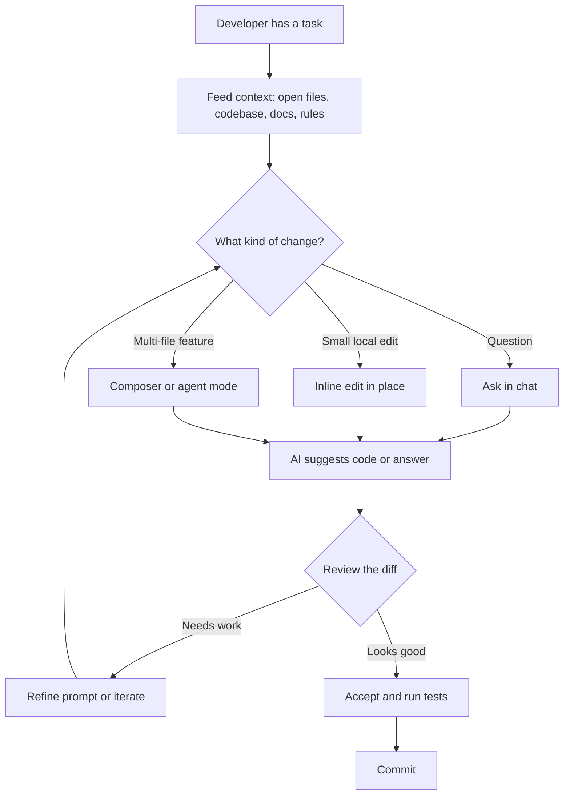

# AI Developer Tools

Knowing how to prompt a model is one skill; knowing which *tool* wraps that model and how to drive it well is another. This guide explains the major AI assistants and coding tools conceptually: what each one is, the ideas behind it, and how to use it effectively. It covers four notebooks:

- `01_claude.ipynb` Claude, the model family from Anthropic, and how to work with it through the API.
- `02_cursor.ipynb` Cursor, an AI-first code editor.
- `03_github_copilot.ipynb` GitHub Copilot, the in-editor AI pair programmer.
- `04_other_tools.ipynb` the broader landscape: ChatGPT, Perplexity, v0, Bolt, Windsurf, Replit, Google AI Studio, NotebookLM.

A few terms recur throughout, so define them once here:

- **LLM (large language model)** the underlying text-prediction engine (Claude, GPT, Gemini, etc.). Tools are interfaces *to* models.
- **API (application programming interface)** a way for your own code to call a model programmatically, as opposed to typing into a chat box.
- **Token** the unit a model reads and bills by (roughly ¾ of a word).
- **Context window** the maximum amount of text (in tokens) a model can consider at once.
- **Agent** a model that can take *actions* (run commands, edit files, search the web), observe the results, and continue, rather than only producing text.

---

## Part 1 Claude (Anthropic)

**Claude** is the family of large language models built by Anthropic. You can use Claude through a chat interface, but its full power shows through its **API**, where your code sends messages and receives structured replies. `01_claude.ipynb` works through that API.

### The Claude model family

Claude is offered in tiers that trade speed for intelligence. The current generation spans, roughly:

| Model | Speed | Intelligence | Best for |
|-------|-------|--------------|----------|
| **Claude Haiku 4.5** | Fastest | Good | High-volume, simple, latency-sensitive tasks |
| **Claude Sonnet 4.x** | Balanced | Great | Most coding, analysis, and general work (the default workhorse) |
| **Claude Opus 4.x** | Slower | Best | The hardest reasoning, research, and complex multi-step problems |

The naming pattern is consistent: **Haiku** = fast and cheap, **Sonnet** = balanced, **Opus** = most capable. The number (4.x) is the generation. Claude models offer large context windows (on the order of 200K tokens), enough to hold whole documents or codebases in a single request. The general rule for picking a tier: start with Sonnet for everyday work, drop to Haiku when you need volume and speed, and reach for Opus only when a task genuinely needs the deepest reasoning.

### Prompting Claude well: XML tags

Claude has a documented preference for **XML-style tags** to structure prompts. Wrapping each part of your request in named tags `<task>`, `<code>`, `<requirements>` makes it unambiguous where one section ends and another begins, which improves accuracy on structured requests. The notebook shows a code-review prompt where the task, the code to review, and the focus areas are each enclosed in their own tags. The model can then reliably tell "the thing to review" from "the instructions about reviewing it."

### Extended thinking

Claude supports **extended thinking** a mode where the model reasons in a hidden scratchpad before producing its visible answer. This is chain-of-thought built into the model: enabling it (with a thinking "budget" of tokens) improves math, coding, and multi-step reasoning. Conceptually it gives the model room to work through a problem privately, the same way a person sketches on scratch paper before writing the final answer.

### Tool use (function calling)

**Tool use**, also called **function calling**, lets Claude reach outside itself. The pattern has four steps:

1. **You define tools** each as a JSON schema describing its name, purpose, and inputs (e.g. a `get_weather` tool that takes a location).
2. **Claude decides when to call one** given a user question, it may respond not with an answer but with a request to call a tool, including the arguments.
3. **You execute the tool** your code runs the real function and gets a result.
4. **You return the result and Claude continues** it incorporates the result into its final answer.

The notebook walks through this full round-trip with a weather example: the first call returns a `tool_use` request, the code runs the function, feeds the result back as a `tool_result`, and a second call produces the natural-language answer. Tool use is the mechanism that turns Claude from a text generator into an **agent** that can act in the world.

### Streaming

**Streaming** delivers the response token by token as it is generated, instead of waiting for the whole answer. This makes interfaces feel responsive the user sees text appear immediately rather than staring at a spinner. The notebook shows a streaming call that prints each chunk as it arrives.

### Prompt caching

**Prompt caching** addresses a common inefficiency: re-sending the same large, unchanging prefix (a big document, a long system prompt) on every request, paying to process it each time. With caching, you mark a static prefix to be cached; subsequent requests that reuse it skip reprocessing, cutting both **latency and cost** substantially (up to roughly 90% off the cached portion). The cache is short-lived (a few minutes, refreshed on use) and has a minimum block size. The notebook marks a large document with `cache_control` and then inspects the usage fields that report how many tokens were written to versus read from the cache. Use it whenever many requests share a big, stable chunk of context.

### Vision and documents

Claude is **multimodal**: it accepts images (JPEG, PNG, GIF, WebP) as input alongside text, and can read PDFs natively. This lets you ask questions about screenshots, charts, diagrams, or scanned documents not just plain text.

### Claude Code

Beyond the API, Anthropic ships **Claude Code**, a command-line tool that turns Claude into a coding agent operating directly in your terminal and repository reading files, editing code, running commands, and iterating. It is the agentic, developer-facing counterpart to the raw API.

---

## Part 2 Cursor

**Cursor** is an **AI-first code editor** built on top of VS Code (so it feels familiar and runs VS Code extensions). Its defining idea is that the AI has **awareness of your entire codebase**, not just the file you happen to be looking at, which makes its suggestions far more relevant. `02_cursor.ipynb` covers its features and how to drive them.

### Core interactions

- **Tab completion (autocomplete)** As you type, Cursor predicts **multi-line edits**, not just the next token, and it learns from your recent edits. Press `Tab` to accept, `Esc` to reject.
- **Cursor Chat** (`Ctrl/Cmd + L`) A chat panel for asking questions *about your code*: "How does authentication work in this project?" or "Find all the places we query the database."
- **Inline Edit** (`Ctrl/Cmd + K`) Select some code, press the shortcut, and type an instruction in place: "Add error handling," "Convert to async," "Write tests for this function." The edit is applied right where you are.
- **Composer** (`Ctrl/Cmd + Shift + I`) Describe a feature and Cursor edits **multiple files at once** to implement it. This is the tool for changes that span the codebase rather than a single function.

A good habit: use **Chat for questions**, **Inline Edit for small local changes**, and **Composer for multi-file features**.

Diagram: how an AI coding assistant fits into the everyday development loop.

### The @-mention context system

The single most important skill in Cursor is **feeding it the right context** via `@`-mentions. Each mention pulls a specific source into the conversation:

| @-mention | What it brings in |
|-----------|-------------------|
| `@file` | A specific file's contents |
| `@folder` | All files in a folder |
| `@codebase` | The entire indexed codebase |
| `@docs` | Documentation you've added |
| `@web` | Live web search results |
| `@git` | Git history and diffs |
| `@terminal` | Recent terminal output |
| `@definitions` | Symbol (function/class) definitions |

More precise context yields better answers. "Refactor `@file` to use dependency injection" or "`@terminal` this error appeared find the root cause in `@codebase`" give the model exactly what it needs. The notebook collects a set of these prompt patterns grouped by goal (understanding, generation, debugging, refactoring).

### Project rules (`.cursorrules`)

A **`.cursorrules`** file at the project root sets **permanent instructions** that apply to every AI interaction, so you stop repeating yourself. It encodes your stack, conventions, and preferences for example: "use type hints, follow PEP 8, prefer async functions, use Pydantic for validation, never use `print()`, use logging instead." The notebook generates an example `.cursorrules` for a PyTorch/ML project and saves it (the resulting file, `.cursorrules_example`, sits in this folder). Setting up project rules early is one of the highest-leverage things you can do in Cursor.

### Agent mode

Cursor's **Agent mode** (toggled in Composer) is its most autonomous: it can run terminal commands, create and delete files, read error output, and **self-correct** completing whole features end to end with minimal hand-holding. As with any agent, you review what it does before trusting it.

### Model selection, privacy, and MCP

- **Model selection** Cursor lets you choose the underlying model per request: a Claude Sonnet 4.x as the recommended default, a more powerful model for hard reasoning, or a small fast model for autocomplete.
- **Privacy mode** When enabled, your code is **not stored on Cursor's servers and not used for training**, which matters for proprietary codebases.
- **MCP (Model Context Protocol)** An open standard for connecting models to external tools and data sources. Cursor supports MCP servers (configured in `.cursor/mcp.json`), so you can extend it with custom integrations a filesystem server, a database connector, and so on.

### Best practices

| Practice | Why it helps |
|----------|--------------|
| Be specific in instructions | "Add input validation" beats "improve this." |
| Use `@`-mentions liberally | More relevant context produces better results. |
| Review diffs before accepting | The AI is fallible; you are responsible for the code. |
| Set up `.cursorrules` | Removes repetitive instructions, enforces conventions. |
| Use Composer for features, Chat for questions | Match the tool to the task. |
| Iterate in small steps | Don't ask for everything at once; build up incrementally. |

---

## Part 3 GitHub Copilot

**GitHub Copilot** is an **AI pair programmer** that lives inside your editor (VS Code, JetBrains, Neovim) and on GitHub itself. It suggests completions, answers questions, and writes whole functions. Where Cursor *is* an editor, Copilot is an *extension* you add to editors you already use. `03_github_copilot.ipynb` covers it.

### Plans

Copilot is a paid product with a free tier: a **Free** plan with limited monthly completions and chats, a **Pro** plan for individuals with unlimited use, and **Business** and **Enterprise** plans that add organization management, audit logs, and (at the Enterprise tier) features like Copilot for pull requests. Pricing and exact limits change over time, so verify current numbers in GitHub's docs.

### Core features

- **Inline completions** As you type, Copilot proposes code in faint **grey "ghost text."** Press `Tab` to accept, `Esc` to dismiss, and cycle through alternatives with `Alt+]` / `Alt+[`. It works across all major languages.
- **Copilot Chat** (`Ctrl+Shift+I`) A context-aware chat panel that knows your open files and keeps a persistent conversation. You can address specialized **agents** within it.

### Slash commands

In Copilot Chat, **slash commands** invoke common actions on your selected code:

| Command | What it does |
|---------|--------------|
| `/explain` | Explain the selected code in plain English |
| `/fix` | Find and fix bugs in the selection |
| `/tests` | Generate unit tests |
| `/doc` | Generate documentation / docstrings |
| `/optimize` | Suggest performance improvements |
| `/simplify` | Simplify complex code |
| `/new` | Scaffold a new file or project |
| `/newNotebook` | Create a Jupyter notebook |

The notebook illustrates `/explain` (describing a quicksort implementation) and `/tests` (generating pytest cases for it).

### Chat agents

Prefixing a message with an **agent** scopes Copilot's attention:

| Agent | Scope |
|-------|-------|
| `@workspace` | The entire project codebase |
| `@vscode` | VS Code settings and commands |
| `@terminal` | Terminal history and commands |
| `@github` | GitHub issues, PRs, and repositories |

### Copilot CLI

Copilot also works in the terminal via a GitHub CLI extension. It can **explain** a shell command you don't understand (`gh copilot explain "git rebase -i HEAD~3"`) or **suggest** a command for a task you describe in English (`gh copilot suggest "compress all jpg files in current directory"`). This is handy for shell incantations you'd otherwise have to look up.

### Copilot for pull requests

At the Enterprise tier, Copilot extends into the review workflow: auto-generating PR descriptions from diffs, answering reviewer questions about changes, suggesting test cases, and via "Copilot Workspace" turning an issue description into a plan and an implementation.

### Custom instructions

Like Cursor's `.cursorrules`, Copilot reads a **`.github/copilot-instructions.md`** file in your repo for standing guidance: your stack, conventions, where models versus schemas live, error-handling style, and so on. It tailors every suggestion to your project.

### Best practices

Copilot predicts from the cues you give it, so the quality of those cues drives the quality of suggestions:

- **Write clear comments** describing intent Copilot reads them to predict what you want.
- **Name things clearly** `calculate_monthly_revenue()` produces better completions than `calc()`.
- **Keep files focused** single-responsibility files yield more relevant suggestions.
- **Use type hints** typed code improves completion accuracy.
- **Always review** Copilot can suggest insecure or subtly wrong code; never accept blindly.
- **Use `/explain` for onboarding** a fast way to understand unfamiliar code.

### Cursor vs. Copilot at a glance

| | Cursor | GitHub Copilot |
|---|--------|----------------|
| Form factor | Standalone editor (VS Code fork) | Extension inside existing editors |
| Context model | Deep, whole-codebase indexing | Strong on open files; `@workspace` for project scope |
| Standing instructions | `.cursorrules` | `.github/copilot-instructions.md` |
| Autonomous edits | Composer + Agent mode (multi-file) | Inline + chat; PR/Workspace features at Enterprise |
| Best when | You want an AI-native editing experience | You want AI inside the editor you already use |

---

## Part 4 The Broader Landscape

`04_other_tools.ipynb` surveys the wider ecosystem. These tools specialize: knowing which to reach for is itself a skill.

### ChatGPT (OpenAI)

The widely known general-purpose assistant, built on the **GPT** model family (with reasoning-focused variants for harder problems). Beyond plain chat it offers a **Code Interpreter** (runs Python in a sandbox to analyze data and make charts), **image generation**, **Custom GPTs** (specialized assistants you configure with instructions and tools), **memory** across conversations, and **Projects** for organizing chats and knowledge bases. Strong default for general tasks, data analysis, image generation, and writing.

### Perplexity AI

An **answer engine** whose defining feature is that **every answer cites real-time web sources**. Because it searches the live web, it is not frozen at a training cutoff, and each claim links back to where it came from. Best for research, fact-checking, current events, and looking up technical documentation. It also exposes an **API** for search-grounded answers programmatically.

### v0 (Vercel)

Generates **front-end UI components** (React with Tailwind/shadcn) from a natural-language description: "a dark-mode dashboard with a sidebar and stats cards" yields a complete component. Best for UI prototyping, landing pages, and dashboards.

### Bolt.new

Generates, **runs, and deploys a full-stack app entirely in the browser** from a prompt. Describe "a todo app with a React frontend, Express backend, and SQLite with authentication" and you get a running application you can deploy immediately. Best for rapid prototyping and hackathons.

### Windsurf (Codeium)

An **agentic IDE** whose **Cascade** agent autonomously plans, writes, runs, and fixes code across multiple steps and files, with whole-codebase awareness similar to Cursor's. Best for complex, multi-file features handled by an autonomous agent.

### Replit AI

A **browser-based IDE** with an **Agent** that can build and **instantly deploy** an app on Replit's hosting, plus inline completion ("Ghostwriter") and real-time collaboration. Best for learning, quick demos, teaching, and zero-setup coding.

### Google AI Studio

A free **playground for Google's Gemini models** where you can experiment and generate an API key. Notable for very large context windows (up to ~1M tokens, enough for whole codebases or books), multimodal input (text, image, audio, video, PDF), code execution, and reusable system instructions. Best for experimenting with Gemini, long-context tasks, and free API access. (The notebook's Gemini example uses the `google.generativeai` package, which is now deprecated in favor of the newer `google-genai` SDK a reminder that SDKs move quickly and you should check current docs.)

### NotebookLM (Google)

A research assistant that answers **only from the sources you upload** (PDFs, Google Docs, YouTube, websites), keeping it grounded and reducing hallucination. It can produce an **Audio Overview** (a podcast-style summary of your documents), study guides, and mind maps. Best for studying papers, course notes, and document Q&A.

### Choosing a tool

The notebook includes a small decision-tree that maps task keywords to recommended tools. Distilled:

| Task | Best tool |
|------|-----------|
| General coding help | Cursor or GitHub Copilot |
| Build a UI prototype | v0.dev |
| Build a full-stack app fast | Bolt.new |
| Research with citations | Perplexity |
| Study from your own documents | NotebookLM |
| Free Gemini access / long context | Google AI Studio |
| Hardest reasoning | Claude Opus or a GPT reasoning model |
| Autonomous multi-file coding | Windsurf (Cascade) or Cursor Agent |
| Browser coding + instant deploy | Replit |
| Image generation | ChatGPT / DALL·E |

Two external resources help keep these comparisons current: the **LMSYS Chatbot Arena** (crowd-voted model rankings) and **Artificial Analysis** (benchmarks and pricing).

---

## Bringing It Together

These tools form a layered toolkit. **Claude** (and the other foundation models) are the raw engines you reach for the API when you build your own software on top of a model, using tool use to give it actions, prompt caching to control cost, and extended thinking for hard reasoning. **Cursor** and **GitHub Copilot** embed those engines into the act of writing code, the difference being editor-native versus extension; both reward you for feeding them good context and standing instructions. The **broader landscape** Perplexity for cited research, v0 and Bolt for generating UIs and apps, Windsurf and Replit for agentic and browser-based coding, Google AI Studio and NotebookLM for experimentation and grounded document work fills the specialized niches.

The constant across all of them: the model is only as good as the context and instructions you give it, and you remain responsible for reviewing what it produces.
