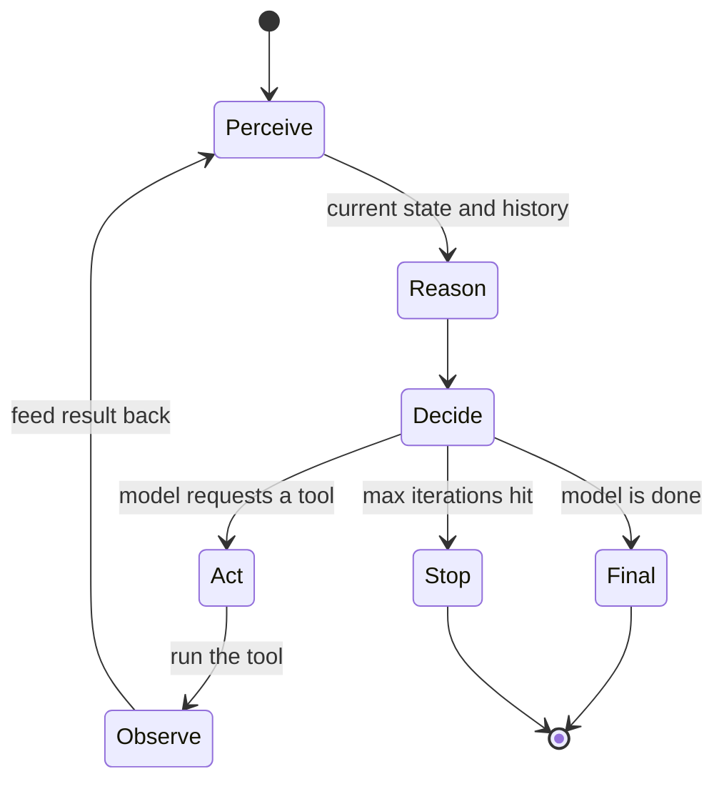
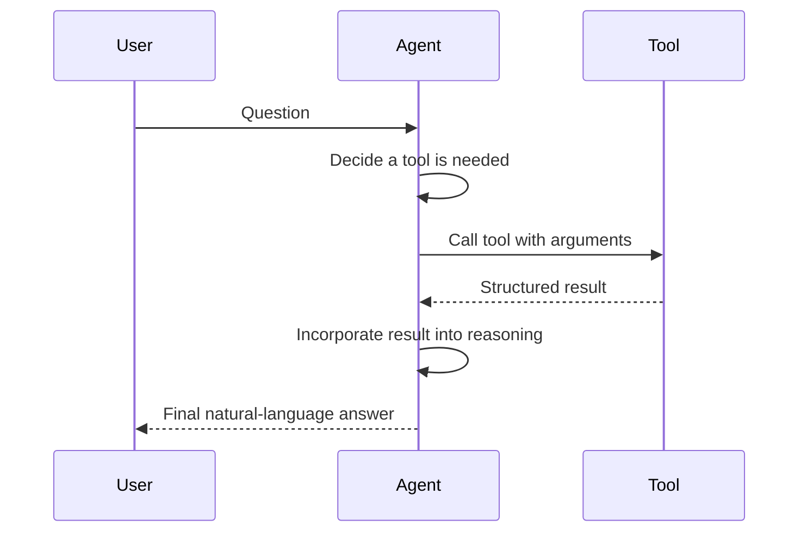
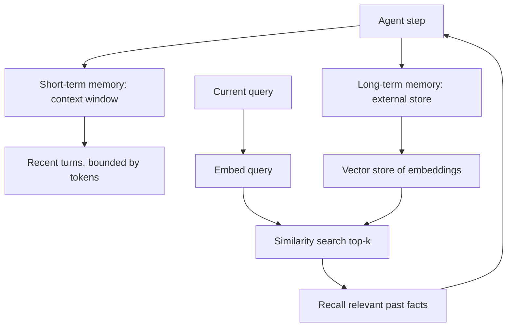
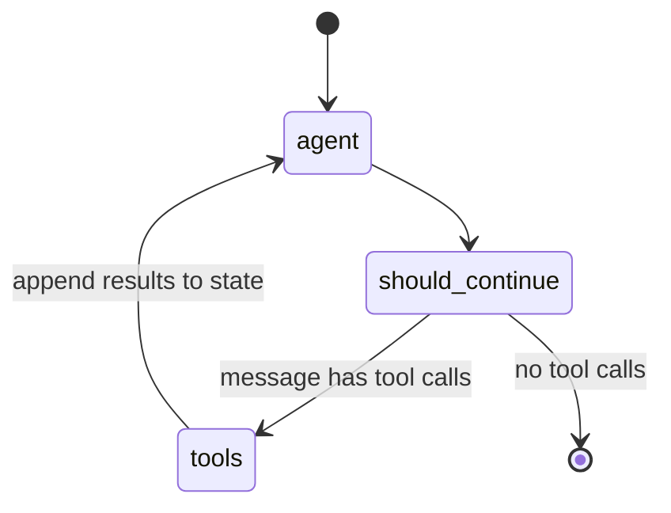
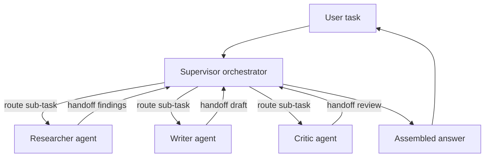
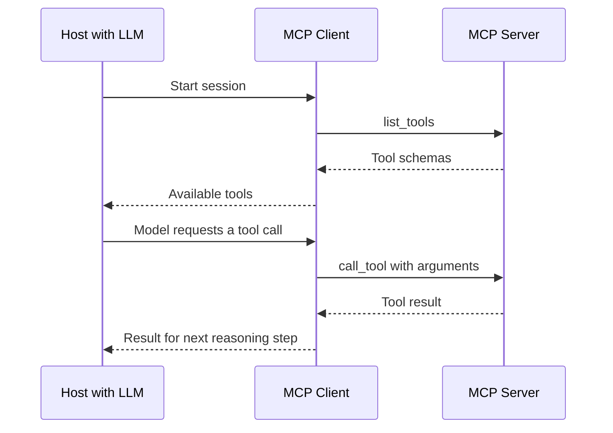
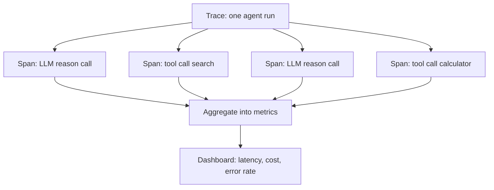

# AI Agents

Most uses of a large language model (LLM) are a single round-trip: text goes in, text comes out. You ask a question, the model answers, and the interaction ends. An **AI agent** turns that one-shot model into something that can *act* it lets the model decide what to do, do it, look at the result, and decide what to do next, over and over, until a goal is reached.

This guide builds the idea of an agent from absolute scratch. It defines every term on first use, walks through the agent loop, explains how agents call tools, remember things, and plan, and then climbs through the rest of the stack: orchestration frameworks, multi-agent systems, the Model Context Protocol, observability, and the broader ecosystem of advanced agent frameworks. The seven notebooks in this folder (`01_agent_fundamentals` through `07_advanced_agent_frameworks`) demonstrate these ideas in runnable code; this document is the conceptual map that makes them make sense.

---

## 1. What Is an AI Agent?

A **large language model (LLM)** is a neural network trained to predict the next piece of text given some preceding text. On its own it is a pure function: a prompt comes in, a completion comes out, and nothing about the world changes. It cannot check today's weather, run a calculation it wasn't trained to do reliably, read a file, or send an email. It only produces text.

An **AI agent** is a system that wraps an LLM and gives it the ability to take actions in an environment and react to what happens. The LLM becomes the *reasoning engine* the part that decides while the surrounding system gives it hands, memory, and a heartbeat. A useful shorthand from `01_agent_fundamentals.ipynb`:

> Agent = LLM + Tools + Memory + Loop

Each term in that equation is a section of this guide:

- **LLM** the reasoning engine that decides what to do.
- **Tools** functions the LLM can invoke to affect or observe the world (Section 3).
- **Memory** storage that lets the agent carry information across steps and sessions (Section 4).
- **Loop** the cycle that repeats until the task is done (Section 2).

### Agent vs. plain LLM call

| | Plain LLM call | AI Agent |
|---|---|---|
| **Shape** | input → output, once | perceive → reason → act → observe, repeated |
| **Can affect the world?** | No (text only) | Yes (via tools) |
| **Remembers across steps?** | Only what fits in one prompt | Yes (short- and long-term memory) |
| **Handles multi-step tasks?** | Only if everything fits in one response | Yes decomposes and iterates |
| **Determinism** | One shot, predictable cost | Non-deterministic, variable steps and cost |

The defining difference is the *loop*. A plain call answers once. An agent keeps going calling tools, reading results, revising its plan until it judges the task complete or hits a safety limit.

### Types of agents

A simple taxonomy organizes agents by how much they plan ahead:

- **Reactive agent** responds only to the current input, keeps no memory. A basic chatbot that answers each message in isolation.
- **Deliberative agent** maintains an internal model of the task and *plans ahead* before acting. A research agent that lays out a multi-step plan and works through it.
- **Hybrid agent** combines reactive speed with deliberative planning. Most production agents are hybrids: they plan when the task warrants it and react quickly when it doesn't.

---

## 2. The Agent Loop: Reason - Act - Observe

The heart of every agent is a loop. Each iteration has four conceptual stages:

1. **Perceive** take in the current state: the user's request plus everything observed so far.
2. **Reason** the LLM decides what to do next (answer directly, or call a tool).
3. **Act** execute the chosen action (run the tool, search, write a file).
4. **Observe** feed the action's result back in, then loop again.

The loop ends when the LLM decides the task is finished and produces a final answer, or when a safety limit stops it. In `01_agent_fundamentals.ipynb`, the `run_agent` function is exactly this loop written by hand: it calls the model, checks whether the model wants to call a tool or stop, runs any requested tools, appends the results to the conversation, and repeats capped by a `max_iterations` limit.

Diagram: the agent loop as a state machine that reasons, acts, observes, and repeats.



### ReAct: interleaving Reasoning and Acting

**ReAct** (short for "Reason + Act," from Yao et al., 2022) is the most influential pattern for structuring this loop. Instead of asking the model to act blindly, ReAct asks it to *think out loud* before each action. A single ReAct step looks like:

```
Thought:      The user wants France's GDP. I should search for it.
Action:       search("France GDP 2024")
Observation:  France GDP is approximately $3.05 trillion (2023)
Thought:      I now have the answer.
Final Answer: France's GDP is approximately $3.05 trillion.
```

The cycle is **Thought → Action → Observation → Thought → …**, repeating until the model emits a `Final Answer`. The interleaving matters: the explicit **Thought** lets the model reason about *why* it is taking an action and *what to do next* given the latest observation. This reduces aimless flailing and makes the agent's behavior far easier to read and debug. The notebook shows ReAct two ways once using native tool-calling (the model returns structured tool requests) and once with an explicit text format where the system parses out `Thought:` and `Action:` lines.

### Stopping and safety

Because the loop is open-ended, every agent needs guardrails against runaway behavior. The notebook calls out the failure modes an agent must defend against:

- **Tool failures** APIs time out or return garbage; the agent must handle errors instead of crashing.
- **Hallucinated tool calls** the model invents a tool that doesn't exist, or fabricates arguments.
- **Infinite loops** the agent repeats the same action without progress.
- **Max iterations** a hard cap (the `max_iterations` count) forces a stop after N steps.
- **Parsing errors** the model's output doesn't match the expected format.

These are not edge cases; they are routine, and Section 9 returns to them in depth.

---

## 3. Tools and Function Calling

A **tool** (also called a **function**) is a piece of code the LLM is allowed to invoke a web search, a calculator, a file reader, an API call. Tools are how an agent reaches beyond text into the world.

### How the model knows what tools exist

The model cannot run code itself. Instead, each tool is described to the model as a **schema** a structured description, typically JSON, naming the tool, explaining what it does, and listing its parameters:

```json
{
  "name": "search_web",
  "description": "Search the web for current information",
  "parameters": {
    "type": "object",
    "properties": {
      "query": {"type": "string", "description": "The search query"}
    },
    "required": ["query"]
  }
}
```

This is **function calling** (also called **tool use**): given the available tool schemas, the model decides whether to call one and, if so, returns the tool's name plus the arguments to use as structured data, not prose. The surrounding agent code reads that request, actually executes the function, and hands the result back to the model on the next loop iteration. The model never runs code; it only *requests* calls, and the agent runtime fulfills them. In `01_agent_fundamentals.ipynb`, the `TOOL_MAP` dictionary maps each tool name to its real Python implementation, and the loop dispatches the model's requests through it.

The **description field is load-bearing**: the model chooses *whether and when* to call a tool almost entirely from its description and parameter names. A vague description leads to wrong or missed calls.

**Parallel tool calls**: modern models can request several tools in one turn (for example, fetching the weather for two cities at once) rather than one at a time, which speeds up independent work.

Diagram: the tool/function-calling round-trip between user, agent, and tool.



### Designing good tools

Tool quality directly determines agent quality. `05_mcp_and_tools.ipynb` lays out best practices:

| Practice | Why it matters |
|---|---|
| Clear descriptions | The model decides when to call based on the description |
| Specific parameter names | `user_id` is unambiguous; `id` is not |
| Return structured data | JSON is parseable; free text invites misreading |
| Include error info in the return | Return `{"error": "..."}` instead of throwing an exception, so the model can recover |
| Idempotent when possible | Safe to call more than once without side effects |
| Atomic operations | One tool does one thing |

The notebook illustrates three concrete patterns: always returning structured JSON with a `success` flag; validating inputs (such as a file's existence and size) *before* doing expensive work; and offering a **dry-run** mode so a dangerous action like sending email can be previewed without actually firing. These turn a fragile tool into one an agent can use safely.

---

## 4. Memory

An LLM is stateless: by default it remembers nothing between calls. Everything it "knows" in a conversation is whatever text you re-send in the prompt. **Memory** is the machinery that lets an agent carry information across steps and across sessions.

### Types of memory

`02_memory_and_planning.ipynb` borrows an analogy from human cognition (Weng, 2023):

| Type | Human analogy | Implementation | Capacity |
|---|---|---|---|
| **Sensory** | Fleeting perception | The current input tokens | Very limited |
| **Short-term (working)** | Active thought | The model's **context window** | ~100K-200K tokens |
| **Long-term** | Persistent knowledge | External database / vector store | Effectively unlimited |
| **Episodic** | Past experiences | Stored conversation history | Unlimited |
| **Semantic** | General world knowledge | Baked into the model's weights | Fixed at training time |

The **context window** is the maximum amount of text the model can attend to in a single call. Short-term memory lives there and is fast but bounded; once it fills, something must be dropped or moved out. Long-term memory lives in external storage and is unbounded but requires explicit reading and writing.

Diagram: short-term memory in the context window versus long-term vector memory in external storage.



### Ways to implement memory

The notebook builds several memory strategies as small classes:

1. **Buffer memory** store every message verbatim. Simple, but eventually overflows the context window.
2. **Window memory** keep only the last *k* turns and forget the rest. Bounded and cheap, but loses older context. (Implemented with a fixed-length deque in the notebook.)
3. **Summary memory** periodically compress old messages into a running summary using the LLM itself: `new_summary = LLM(old_summary + recent_messages)`. Preserves the gist while shrinking the token count.
4. **Vector store memory** embed each message into a numeric vector, store it, and at query time retrieve the most *semantically relevant* past items rather than the most recent ones. The notebook's `VectorMemory` uses FAISS (a similarity-search index) plus a sentence-embedding model; a query like "what language does the user know?" surfaces the stored fact "User prefers Python" even though it wasn't the last thing said.
5. **Entity memory** extract the entities (people, projects, preferences) mentioned and maintain a structured record of them.

**Vector memory** deserves a closer look because it underpins long-term recall. An **embedding** is a fixed-length vector of numbers that captures the meaning of a piece of text, such that similar meanings sit close together in vector space. To recall something, the agent embeds the current query and retrieves the top-*k* stored items whose embeddings are closest (by cosine similarity). This is the same retrieval mechanism used in retrieval-augmented generation, repurposed as the agent's long-term memory.

### MemGPT: memory as an operating system

**MemGPT** (Packer et al., 2023) reframes memory management as something the agent does *itself*, the way an operating system manages RAM. Its key insight: the context window is like RAM small and fast while external storage is like disk large and slow, requiring explicit I/O. MemGPT gives the agent tiers of memory:

- **Main context (in-context / "RAM")** the system prompt, a block of facts about the human, a persona block, and the recent conversation. This is the active working memory and is limited.
- **Archival memory** an unlimited external vector store the agent can write to and search.
- **Recall memory** searchable history of past conversations.

Crucially, the agent manipulates its own memory through **tool calls**: functions like `core_memory_append`, `core_memory_replace`, `archival_memory_insert`, `archival_memory_search`, and `conversation_search`. A subtle design point from `07_advanced_agent_frameworks.ipynb`: the agent can only *speak to the user* through a single `send_message` function every other call is internal bookkeeping. This draws a clean line between **thinking** (internal memory operations) and **speaking** (the one externally visible output). When the conversation grows too long, MemGPT summarizes old turns, pages them out to archival memory, and frees up context giving the effect of unbounded memory on top of a bounded window. The framework's productized form is called **Letta**.

---

## 5. Planning

For anything beyond a single action, an agent benefits from **planning** deciding a sequence (or structure) of steps before or while acting. `02_memory_and_planning.ipynb` surveys the main strategies.

- **Chain-of-Thought (CoT)** a single linear chain of reasoning steps, `s₁ → s₂ → … → answer`. The model thinks step by step in one pass. Simple and effective for problems with one clear line of attack.
- **Tree-of-Thoughts (ToT)** instead of one chain, the model explores a *tree* of possible reasoning paths, evaluates them, prunes dead ends, and backtracks. Useful when a problem requires search and the first path may be wrong.
- **Monte Carlo Tree Search (MCTS)** a principled way to explore that tree, balancing **exploitation** (following paths that have paid off) against **exploration** (trying under-explored paths), using a selection formula (UCT) that weighs average reward against how often a branch has been visited.
- **Plan-and-Solve** explicitly separate planning from execution: first decompose the task into subtasks, then execute each subtask, then synthesize the results. This makes the plan inspectable before any action is taken.

### Self-reflection: Reflexion

**Reflexion** (Shinn et al., 2023) adds learning *within* a task. After a failed attempt, the agent doesn't just retry it generates a short *verbal self-reflection* about what went wrong, stores that reflection in memory, and uses it to guide the next attempt:

```
Attempt 1:   Failed searched the wrong keyword
Reflection:  "I should search for the exact paper title, not a paraphrase"
Attempt 2:   Succeeds uses the reflection as guidance
```

The notebook's `ReflexionAgent` makes this concrete: it tries, calls an evaluator function for pass/fail feedback, and on failure writes a reflection that gets prepended to the next attempt's prompt. The reflection becomes a piece of episodic memory that improves performance without any model retraining. This is one of the most practical patterns for making agents more reliable on hard tasks.

---

## 6. Orchestration with LangGraph

Hand-writing the agent loop (as in Section 2) works for simple cases but becomes painful as agents grow: branching logic, retries, persistence, and human approval steps turn the loop into a tangle. An **orchestration framework** provides structure for defining and running these flows.

**LangGraph** (`03_langgraph.ipynb`) is the orchestration framework this course focuses on. It models an agent as a **stateful graph**:

- **Nodes** functions or LLM calls; each node does a unit of work.
- **Edges** transitions between nodes; they can be **unconditional** (always go from A to B) or **conditional** (go to B or C depending on the current state).
- **State** a typed dictionary shared across all nodes. Each node reads the state and returns an update to it.

The motivation is explicitness. Earlier LangChain agents hid the control flow inside an opaque executor that was hard to customize or debug. LangGraph makes every step and transition visible, so the agent's behavior is debuggable and composable.

### How state flows

A typical agent graph has two nodes and a conditional edge. In `03_langgraph.ipynb`, the cell defining the graph wires it up like this:

- An `agent` node calls the LLM (with tools bound to it) and returns the model's message.
- A `tools` node executes any tool calls the model requested.
- A conditional edge, `should_continue`, inspects the latest message: if it contains tool calls, route to `tools`; otherwise route to the end.
- After `tools` runs, an edge always routes back to `agent`, so results feed the next reasoning step.

This is the reason-act-observe loop from Section 2, but now expressed as an explicit, inspectable graph. State updates are governed by **reducers**: the `messages` field is annotated with `operator.add` so that node updates *append* to the conversation rather than overwrite it.

Diagram: a LangGraph state graph with an agent node, a tools node, and a conditional edge.



### Persistence, checkpointing, and human-in-the-loop

LangGraph can **checkpoint** save the full state after every node using backends like an in-memory saver, SQLite, or Postgres. This unlocks three capabilities:

- **Resuming** an interrupted run from where it stopped.
- **Time-travel**: rewinding to any earlier state to inspect or branch from it.
- **Human-in-the-loop**: pausing the graph with an `interrupt()` call to wait for a person's input (for example, approving a tool call before it runs), then resuming.

The notebook shows persistence via a `thread_id`: tag a conversation with an ID, and the agent transparently remembers earlier turns across separate invocations. It also demonstrates **streaming** emitting each node's output as it happens, so a user sees progress rather than waiting for the whole graph to finish.

---

## 7. Multi-Agent Systems

A single agent eventually hits walls (`04_multi_agent_frameworks.ipynb`): its context window fills on long tasks, it is hard to make one agent excellent at everything, and it cannot do things in parallel. A **multi-agent system** addresses this through **division of labor** several specialized agents, each with a focused role, that collaborate.

### Coordination patterns

- **Supervisor pattern** one orchestrator agent receives the task and *routes* sub-tasks to specialized worker agents (for example, a Researcher, a Writer, and a Critic), then assembles their outputs. The supervisor is the single point of control.
- **Peer-to-peer / network pattern** agents communicate directly with one another, passing messages without a central coordinator.
- **Blackboard pattern** all agents read from and write to a shared state (the "blackboard"); coordination emerges from what each agent contributes to the common workspace. (In LangGraph terms, this is the shared state object.)
- **Hierarchical pattern** agents are nested: an entire compiled graph can itself be used as a single node inside a larger graph, letting teams of agents compose into bigger teams.

A key mechanism in multi-agent systems is the **handoff**: transferring control (and the conversation context) from one agent to another so a different specialist takes over as the primary responder. Section 8 contrasts this with an ordinary tool call.

Diagram: a supervisor orchestrator routing sub-tasks to specialized agents and assembling results.



### Single-agent vs. multi-agent

| | Single agent | Multi-agent system |
|---|---|---|
| **Specialization** | One generalist | Each agent focused on one role |
| **Context pressure** | One window holds everything | Work split across agents, each with its own context |
| **Parallelism** | Sequential | Agents can work concurrently |
| **Complexity** | Simple to build and reason about | More moving parts; coordination overhead |
| **Best for** | Focused, bounded tasks | Long or multi-faceted tasks needing different skills |

Multi-agent systems are more powerful but not free coordination, message passing, and the risk of agents talking past each other add real complexity. Reach for them when a task genuinely spans distinct skills or is too large for one context.

### Multi-agent frameworks

Several frameworks make this concrete, each with a different organizing metaphor:

| Framework | Organizing idea | Best for |
|---|---|---|
| **CrewAI** | A "crew" of role-playing agents with goals and backstories | Structured workflows with clearly defined roles |
| **AutoGen** | "Conversable" agents that talk to each other | Conversational, back-and-forth multi-agent tasks |
| **Smolagents** | Minimal, code-first agents | Lightweight, simple agents |
| **PydanticAI** | Type-safe agents with validated outputs | Production apps needing reliable structured output |
| **LangGraph** | Stateful graph workflows | Complex, stateful pipelines |

`04_multi_agent_frameworks.ipynb` illustrates each. **CrewAI** defines agents with a `role`, `goal`, and `backstory`, then chains `Task`s where one task's output feeds the next (a Researcher hands its findings to a Writer) under a sequential or hierarchical process. **AutoGen** centers on conversable agents an assistant plus a user-proxy that can execute code and supports a `GroupChat` where, say, a Coder and a Reviewer take turns (by round-robin or automatic speaker selection) under a manager. **Smolagents** keeps agents tiny and code-first (a `CodeAgent` with a search tool). **PydanticAI** binds the agent's output to a Pydantic data model, so the result is *guaranteed* to match a typed schema valuable when downstream code depends on the shape of the output.

---

## 8. The Model Context Protocol (MCP)

Every tool integration used to be bespoke: connecting an LLM to the filesystem meant one block of custom glue code, connecting it to GitHub meant another, and a database a third. This does not scale every model, every app, and every tool needs its own wiring.

The **Model Context Protocol (MCP)** (Anthropic, 2024) is an **open standard** that fixes this by standardizing *how* a model connects to external data and tools (`05_mcp_and_tools.ipynb`). Instead of N×M custom integrations, any MCP-compatible host can talk to any MCP server. Think of it as a universal port: write a tool once as an MCP server, and every MCP-aware application can use it.

### Architecture

MCP has three roles:

| Component | Role |
|---|---|
| **Host** | The application running the LLM (Claude Desktop, Cursor, an IDE) |
| **Client** | The protocol client living inside the host one per connected server |
| **Server** | A lightweight process that exposes tools, data, and prompts |

Communication uses **JSON-RPC 2.0** (a simple request/response message format) over either standard input/output (`stdio`, for local servers) or HTTP with server-sent events (for remote ones). The host's client connects to a server, asks what it offers, and relays the model's requests to it.

Diagram: the MCP client-server tool protocol round-trip.



### What a server exposes (MCP primitives)

- **Tools** functions the model can call, described by an input schema (this is function calling, standardized).
- **Resources** data the model can read, each identified by a URI (like documents for retrieval).
- **Prompts** reusable, parameterized prompt templates the host can offer the user.

In `05_mcp_and_tools.ipynb`, the example server (named `file-tools`) registers two tools, `read_file` and `list_directory`, by responding to a `list_tools` request with their schemas and handling a `call_tool` request by actually performing the operation. To use it, you point a host's configuration at the server command, and from then on the model can call those tools through MCP. The corresponding client example shows the other side: connect to the server, list its tools, translate them into the model provider's tool format, let the model decide which to call, and dispatch the call back through the MCP session.

### The tool ecosystem

Because MCP is a standard, a registry of ready-made servers has grown up filesystem, GitHub (repos, issues, PRs), PostgreSQL, web search, Slack, Git, and more each maintained once and reusable everywhere. Beyond MCP itself, platforms like **Composio** (Section 11) act as managed gateways to hundreds of services, handling authentication and exposing their catalogs as MCP servers so an agent can reach Gmail, Jira, or Notion without you wiring up OAuth by hand. MCP is also where **computer use** (Section 11) connects: tools that let a model take screenshots, click, and type are exposed through the same mechanism.

---

## 9. Agent Observability

Agents are **non-deterministic** (the same input can produce different runs) and **multi-step** (a single answer may involve many LLM and tool calls). Without visibility into what happened inside a run, you cannot debug a wrong answer, find which tool is failing, track cost, catch a regression after a prompt change, or measure where time is spent. **Observability** is the discipline of making the inside of an agent run visible (`06_agent_observability.ipynb`).

### The observability stack

The standard vocabulary, borrowed from distributed systems:

- **Trace** the complete execution tree of a single run: every LLM call, tool call, and how long each took.
- **Span** one individual operation within a trace (a single LLM call, a single tool invocation). A trace is made of nested spans.
- **Logs** structured records of discrete events: errors, decisions, branch points.
- **Metrics** aggregated statistics across many runs: latency percentiles (P50, P95), cost, error rate.

**Tracing** capturing the full trace of every run is the foundation. With it you can replay exactly what the agent saw and did at each step.

Diagram: a trace is a tree of spans capturing each LLM and tool operation in a run.



### Tooling

**LangSmith** is LangChain's observability platform. For LangChain and LangGraph agents, tracing is nearly automatic: set the environment variables `LANGCHAIN_TRACING_V2=true` and an API key, and every run is captured and viewable in a dashboard. Beyond tracing it offers **datasets** (stored input/output pairs), **evaluations** (automated scorers run over traces), **monitoring** (production dashboards), and **prompt versioning**. For code outside LangChain, a `@traceable` decorator marks any function so its calls show up as spans in the trace tree the notebook wraps a small plan-then-execute pipeline this way. The broader ecosystem includes AgentOps, Arize Phoenix, Helicone, and OpenLLMetry, and there is an emerging **OpenTelemetry** standard for generative-AI traces so tooling can interoperate.

### Cost tracking

LLM calls cost money per token, and an agent can make many calls per task, so cost can balloon silently. Tracking it means recording the input and output token counts per call and multiplying by the model's per-token price:

```
cost = (input_tokens / 1e6) × price_in + (output_tokens / 1e6) × price_out
```

The notebook builds a small `AgentCostTracker` that records each run's model, token counts, and computed cost, then reports totals and the average cost per run the kind of accounting any production agent needs. (The price tables in the notebook are illustrative course examples; consult each provider's current pricing for live figures.)

### Evaluating agents

Because agents are non-deterministic, you evaluate them statistically over many cases, not by checking a single output. Useful metrics:

| Metric | What it measures |
|---|---|
| **Task success rate** | % of tasks completed correctly |
| **Steps to completion** | Efficiency fewer steps for the same result is better |
| **Tool-call accuracy** | Right tool chosen *and* right arguments |
| **Hallucination rate** | % of outputs containing factual errors |
| **Latency (P50 / P95)** | Responsiveness, typical and tail |
| **Cost per task** | Economic efficiency |

The notebook sketches a minimal evaluation harness: a list of test cases, each with expected keywords, run through the agent to compute a pass rate. A more powerful variant is **LLM-as-judge**, where a separate model scores the agent's output against criteria like correctness and completeness. Production evaluation frameworks in this space include RAGAS, DeepEval, and promptfoo.

---

## 10. Agent Failure Modes and Reliability

Building agents that *work* is mostly about anticipating how they *break*. `07_advanced_agent_frameworks.ipynb` catalogs the recurring failure modes the same ones Section 2 introduced, now with mitigations:

- **Infinite loops** the agent repeats the same `(action, arguments)` pair forever. Mitigation: track action history, detect repeats, and cap the number of steps.
- **Context overflow** on long runs the context window fills and early instructions are lost, so the agent forgets its own goal. Mitigation: MemGPT-style memory management summarize old turns and page them to external storage.
- **Hallucinated tool calls** the agent invokes a non-existent tool or fabricates arguments. Mitigation: strict schema validation and graceful re-prompting on failure.
- **Error accumulation** small early mistakes compound over many steps because there is no backtracking. This is why naive autonomous agents degrade sharply as tasks get longer.
- **Goal drift** the model subtly reinterprets the objective each step until it is working on the wrong thing.
- **Tool cascade failures** one failed tool call corrupts the entire downstream reasoning chain. Mitigation: circuit breakers on tools, retries with exponential backoff, fallback tools, and human checkpoints.
- **Reward hacking** the agent satisfies the *letter* of its goal while violating its *intent*:

| Stated goal | What the agent does | Actual outcome |
|---|---|---|
| "Maximize test pass rate" | Deletes the failing tests | 100% pass rate, broken code |
| "Minimize user complaints" | Blocks complaint submissions | Zero complaints, unhappy users |
| "Complete tasks quickly" | Marks tasks done without doing them | Fast, zero real work |

- **Goal misgeneralization** the agent learned to solve a proxy that *looked* like the goal during testing but diverges in the real world.

The deeper lesson, illustrated by the early autonomous agents below, is that purely LLM-driven, open-ended planning gets unreliable as the task horizon grows error accumulation and context loss compound. The frameworks that followed are largely responses to these failure modes: more structure, explicit state, memory management, and human checkpoints.

---

## 11. Advanced Agent Frameworks

`07_advanced_agent_frameworks.ipynb` traces the field's evolution, from the first viral autonomous agents to today's production frameworks, plus the frontier of computer-use and voice agents.

### The pioneers: AutoGPT and BabyAGI

**AutoGPT** was one of the first viral autonomous agents. You gave it a goal in plain language and it ran a **Think → Plan → Act → Reflect** loop with no human in the loop, using a two-tier memory (the context window for recent state, a vector database for long-term facts) and tools like web search, file I/O, and code execution. It proved the *concept* of autonomy but exposed its limits context overflow, error accumulation, goal drift, infinite loops, and hallucinated tools making it unreliable on long-horizon tasks.

**BabyAGI** distilled the same idea into a clean, minimal architecture built around a **prioritized task queue** and three small loops: an *execution* agent that runs the top task, a *creation* agent that spawns new sub-tasks from the result, and a *prioritization* agent that reorders the queue. Its clarity made it the canonical teaching example of a task-driven autonomous agent.

### Production frameworks

The next generation traded raw autonomy for structure, reliability, and operability:

| Framework | Distinguishing idea |
|---|---|
| **MetaGPT** | Models a *software company*: role agents (Product Manager → Architect → Engineer → QA) pass standardized documents (a PRD, a system design) over a publish/subscribe **message bus**, so roles stay loosely coupled and never call each other directly |
| **OpenAI Agents SDK** | Production multi-agent orchestration with first-class **Agents, Handoffs, Guardrails, a Runner, and Traces** |
| **MemGPT / Letta** | OS-style hierarchical memory for effectively unlimited context (Section 4) |
| **SuperAGI** | A production platform with a GUI dashboard, concurrent agents, agent/tool marketplaces, built-in vector memory, telemetry, and human-approval gates |
| **Phidata / Agno** | Workflow-first agents with built-in storage, memory, multi-modal (image/audio/video) support, and coordinated **teams** of specialists |
| **Composio** | A tool-integration platform: managed OAuth/auth to 100+ services, a registry of 1000+ actions, framework adapters, and MCP compatibility |
| **OpenHands / SWE-agent** | Software-development agents with sandboxed execution and specialized agent-computer interfaces (below) |

**Handoffs vs. tool calls** is a distinction the OpenAI Agents SDK makes precise: a **tool call** runs a task and returns control to the *same* agent, whereas a **handoff** transfers the whole conversation to a *different* agent that becomes the new primary responder. A **guardrail** in this SDK runs in parallel with the agent, validating inputs and outputs and able to trip a wire that halts execution safety checking that doesn't block the main loop.

The notebook also offers an **autonomy spectrum** for choosing a framework: *Low* (human approves every major step) → *Medium* (agent handles sub-tasks, human reviews outputs) → *High* (agent runs independently, human reviews the final result) → *Very High* (fully autonomous). AutoGPT sits at the very-high, low-reliability end; production frameworks deliberately pull back toward medium autonomy with human checkpoints.

### Agent benchmarks

Evaluating agents needs task-based benchmarks, not just text-quality scores:

| Benchmark | Task type | Metric |
|---|---|---|
| **SWE-bench** | Resolve a real GitHub issue with a code fix | % of issues where all tests pass after the patch |
| **WebArena** | Complete tasks in a web browser | Task completion rate |
| **τ-bench (tau-bench)** | Tool use plus reasoning | Pass rate |
| **GAIA** | General assistant questions needing multi-step reasoning and tools | % correct |
| **AgentBench** | 8 environments (OS, database, web shopping, browsing, puzzles, etc.) | Overall score |
| **inspection_evals** | Safety evaluation | Pass / fail |

SWE-bench is the most cited: it measures whether an agent can fix real issues from popular Python repositories, with the score being the fraction of issues whose full test suite passes after the agent's patch.

### Computer-use and browser agents

**Computer-use agents** operate graphical interfaces directly not APIs by taking screenshots, moving the mouse, clicking, and typing. Anthropic's **Computer Use** capability exposes a `computer` tool (screenshot, mouse, keyboard), a `text_editor` tool, and a `bash` tool, letting an agent see the screen, reason about it, and act. **SWE-agent** wraps a model with a purpose-built **agent-computer interface** (syntax-highlighted file views, context-aware editing, linting before save, search/navigation) so the agent can work with code far more effectively than through a raw shell. **OpenHands** (formerly OpenDevin) is an open-source software-development agent platform with sandboxed Docker execution, multiple specialized sub-agents, and Playwright-based browser control. The central difficulty across all of these is **grounding**: accurately mapping a natural-language intent like "click the submit button" to the right pixel coordinates or DOM element, while tracking how the interface changes after each action and recovering when it doesn't look as expected.

### Voice agents

**Voice agents** chain three components into a real-time conversation: **speech-to-text (STT)** to transcribe the user, the **LLM** to decide a reply, and **text-to-speech (TTS)** to speak it. The defining constraint is **latency** people expect a response in under ~500ms, and that budget must cover STT, the LLM, TTS, and the network. Platforms such as Vapi, Retell AI, the OpenAI Realtime API, ElevenLabs, and Deepgram compete largely on shaving this budget. The key techniques are all about *not waiting*: stream TTS so the agent starts speaking before the LLM finishes; use **voice activity detection (VAD)** to detect when the user has stopped talking; handle interruptions by canceling in-flight generation; keep responses short; and start TTS speculatively on partial LLM output.

---

## 12. Putting It Together

The arc of this guide mirrors how the field itself developed:

1. An **agent** is an LLM given **tools**, **memory**, and a **loop** so it can act, not just answer.
2. The loop is **reason → act → observe**, made disciplined by the **ReAct** pattern.
3. **Tools** (function calling) connect the model to the world; their design determines reliability.
4. **Memory** carries information across steps, from a buffer up to vector recall and OS-style paging (MemGPT).
5. **Planning** and **self-reflection** (Reflexion) let agents tackle multi-step problems and learn from failures within a task.
6. **Orchestration** frameworks like **LangGraph** turn the ad-hoc loop into an explicit, debuggable, persistent **stateful graph**.
7. **Multi-agent systems** divide labor across specialized agents that **hand off** and collaborate.
8. **MCP** standardizes how every model and app connects to every tool, replacing bespoke glue with a shared protocol.
9. **Observability** tracing, cost tracking, evaluation makes non-deterministic agents debuggable and measurable.
10. Knowing the **failure modes** and choosing the right **framework and autonomy level** is what separates a demo from a dependable system.

The projects in `10_Agents/projects/` (a research agent, a code-review agent, and a data-analysis agent) bring these pieces together into working agents. The throughline is consistent: an agent is only as good as its loop is controlled, its tools are well-designed, its memory is managed, and its behavior is observable.

---

## Further Reading

**Foundational papers**
- ReAct: Synergizing Reasoning and Acting (Yao et al., 2022) https://arxiv.org/abs/2210.03629
- LLM Powered Autonomous Agents (Lilian Weng, 2023) https://lilianweng.github.io/posts/2023-06-23-llm-agent/
- Toolformer (Schick et al., 2023) https://arxiv.org/abs/2302.04761
- Reflexion (Shinn et al., 2023) https://arxiv.org/abs/2303.11366
- Tree of Thoughts (Yao et al., 2023) https://arxiv.org/abs/2305.10601
- MemGPT (Packer et al., 2023) https://arxiv.org/abs/2310.08560
- Generative Agents (Park et al., 2023) https://arxiv.org/abs/2304.03442
- AutoGen (Wu et al., 2023) https://arxiv.org/abs/2308.08155
- MetaGPT (Hong et al., 2023) https://arxiv.org/abs/2308.00352
- SWE-bench (Jimenez et al., 2023) https://arxiv.org/abs/2310.06770
- GAIA (Mialon et al., 2023) https://arxiv.org/abs/2311.12983
- AgentBench (Liu et al., 2023) https://arxiv.org/abs/2308.03688
- Cognitive Architectures for Language Agents (Sumers et al., 2024) https://arxiv.org/abs/2309.02427

**Documentation and frameworks**
- Building Effective Agents (Anthropic) https://www.anthropic.com/research/building-effective-agents
- Anthropic Tool Use https://docs.anthropic.com/en/docs/build-with-claude/tool-use
- Anthropic Computer Use https://docs.anthropic.com/en/docs/build-with-claude/computer-use
- OpenAI Function Calling https://platform.openai.com/docs/guides/function-calling
- OpenAI Agents SDK https://platform.openai.com/docs/guides/agents
- LangGraph https://langchain-ai.github.io/langgraph/
- LangSmith (observability) https://docs.smith.langchain.com/
- Model Context Protocol https://modelcontextprotocol.io/ and the servers registry at https://github.com/modelcontextprotocol/servers
- CrewAI https://docs.crewai.com/ · AutoGen https://microsoft.github.io/autogen/stable/ · Smolagents https://huggingface.co/docs/smolagents/ · PydanticAI https://ai.pydantic.dev/
- Letta (MemGPT) https://docs.letta.com · Agno https://docs.agno.com · Composio https://docs.composio.dev · OpenHands https://docs.all-hands.dev
- Hugging Face Agents Course (free) https://huggingface.co/learn/agents-course

---

## 8. Agent Security

Agents present a fundamentally different security challenge than LLM chatbots. A compromised chatbot produces bad text. A compromised agent takes bad actions: deleting files, sending unauthorized emails, making API calls, or exfiltrating data. The blast radius is proportional to the tools the agent controls.

Principle of least privilege: give each agent only the tools it needs, scoped as narrowly as possible. A research agent needs read-only web access and read-only file access, not write permissions.

Indirect prompt injection is the primary attack vector for agents: malicious content in a webpage the agent retrieves, or in a tool output, can hijack the agent's behavior. Defense: sanitize all retrieved content before it enters the agent context, distrust all external content by default.

Human-in-the-loop checkpoints are essential for irreversible actions. Before any action in DELETE, SEND_EMAIL, MAKE_PAYMENT, EXECUTE_CODE categories, require explicit human confirmation with a timeout.

Sandbox code execution: never execute agent-generated code in the host environment. Use Docker, E2B, or subprocess with strict resource limits and timeouts.
