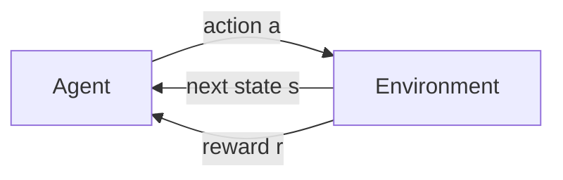
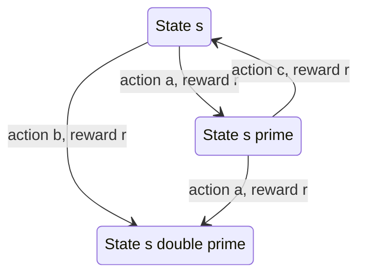
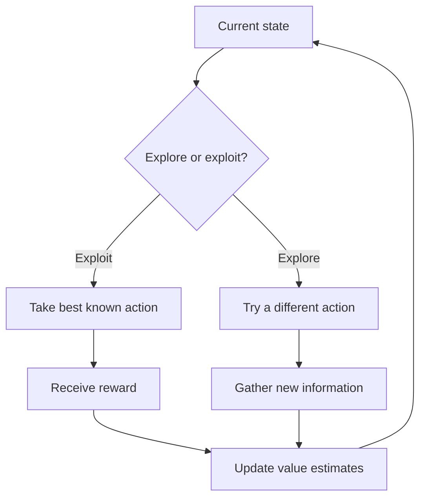
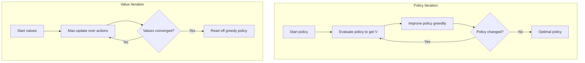
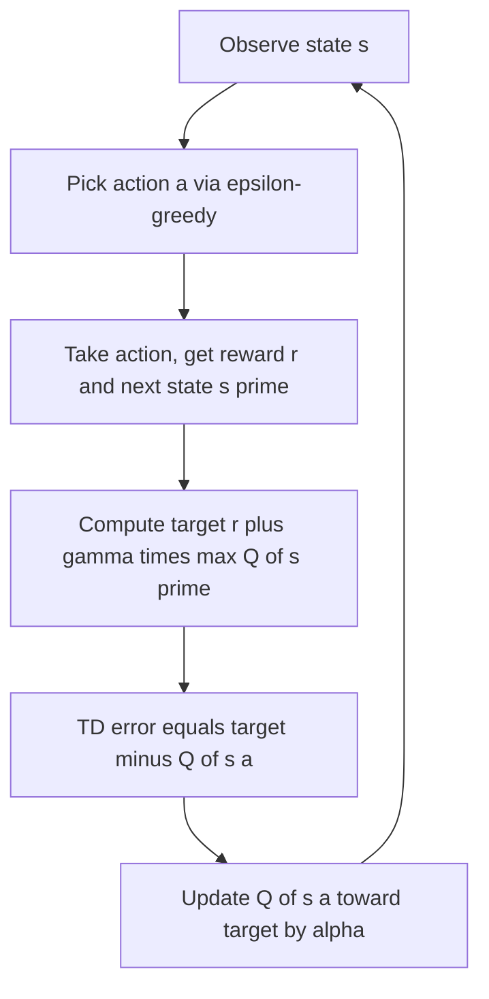
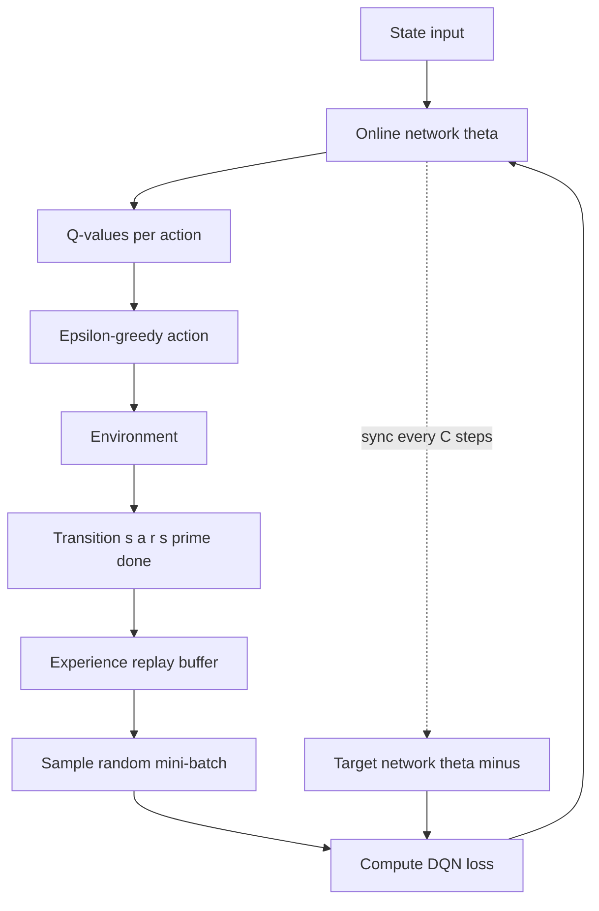
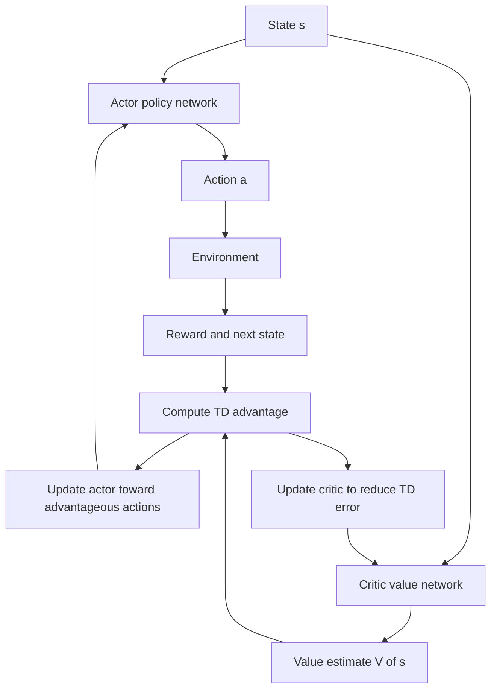
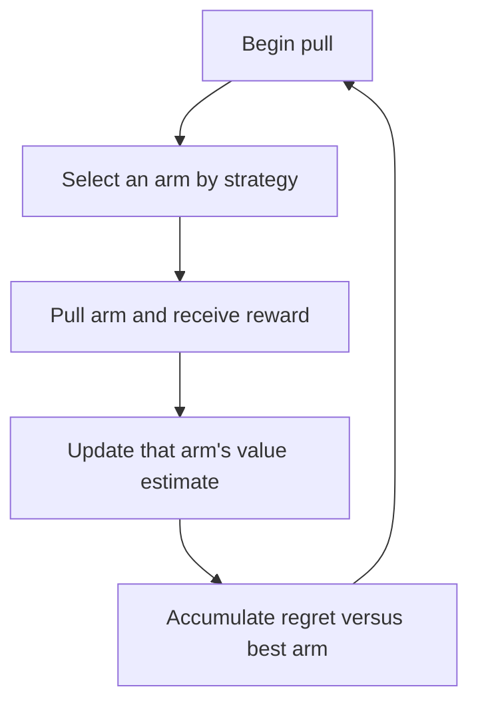

# Reinforcement Learning: A Complete Conceptual Guide

Reinforcement Learning (RL) is the branch of machine learning concerned with **learning how to act**. Instead of being handed a dataset of correct answers, an RL system learns by *doing*: it tries actions, observes what happens, receives feedback in the form of numerical rewards, and gradually discovers behavior that earns the most reward over time. This guide builds the entire subject from the ground up, defining every term as it appears and tracing the path from the simplest possible setting (a single decision repeated over and over) all the way to the methods behind game-playing systems like AlphaGo and the alignment of large language models.

---

## 1. What Reinforcement Learning Is

Most machine learning falls into two families:

- **Supervised learning** learns a mapping from inputs to *known correct outputs* (e.g., this image is a cat). Every training example comes with the right answer.
- **Unsupervised learning** finds structure in data *without* labels (e.g., clustering customers).

**Reinforcement learning is a third paradigm.** There is no fixed dataset and no teacher who reveals the correct action. Instead there is a learner that takes actions in a world and receives a scalar *reward* signal telling it how well it is doing but never telling it what it *should* have done. The learner must figure that out itself, by trial and error.

A useful analogy is **training a dog**. You cannot explain to a dog the optimal sequence of muscle movements to sit. Instead you reward it (a treat) when it does something close to sitting, and over many repetitions the dog associates the behavior with the reward and learns to sit on command. The dog is the *agent*; your living room is the *environment*; the treat is the *reward*. RL formalizes exactly this loop.

### A short history

RL has deep roots and a recent explosion of success:

- **1950s** Richard Bellman formalizes dynamic programming and the equations that bear his name.
- **1989** Chris Watkins introduces *Q-learning*, a way to learn optimal behavior without knowing how the world works.
- **1992** TD-Gammon learns to play backgammon at near-expert level using temporal-difference learning.
- **2013-2015** DeepMind's *Deep Q-Network* (DQN) learns to play Atari games directly from pixels, reaching human-level play.
- **2016** AlphaGo defeats a world champion at Go.
- **2022 onward** *Reinforcement Learning from Human Feedback* (RLHF) becomes a core ingredient in aligning conversational models such as ChatGPT, Claude, and Gemini.

The notebook `01_rl_fundamentals.ipynb` walks through this timeline and sets up the vocabulary we develop below.

---

## 2. The Agent-Environment Loop

Everything in RL revolves around one repeating interaction. Let us define its pieces precisely.

- **Agent** the learner and decision-maker. It chooses actions.
- **Environment** everything outside the agent: the world it acts in and that responds to its actions.
- **State** (denoted *s*) a description of the situation the agent is in at a given moment. In a game of chess, the state is the board configuration; in a robot, it might be joint angles and velocities.
- **Action** (denoted *a*) a choice the agent can make. Moving a chess piece, pushing a cart left or right, recommending a product.
- **Reward** (denoted *r*) a single number the environment hands back after each action, measuring immediate desirability. Higher is better. Rewards can be positive, negative, or zero.
- **Timestep** (denoted *t*) the loop runs in discrete ticks: t = 0, 1, 2, …

The interaction unfolds as a cycle:

1. At timestep *t* the agent observes the current state **Sₜ**.
2. The agent picks an action **Aₜ**.
3. The environment responds, moving to a new state **Sₜ₊₁** and emitting a reward **Rₜ₊₁**.
4. The agent observes the new state and reward, and the loop repeats.

This stream S₀, A₀, R₁, S₁, A₁, R₂, S₂, … is called a **trajectory** (or *rollout*). A complete run from a start state to a terminal state is an **episode** (one full game, one attempt at balancing a pole). Some problems never terminate; these are *continuing* tasks.

Diagram: the agent-environment interaction loop.

The notebook demonstrates this loop concretely with **CartPole** (from the Gymnasium library), where the agent must keep a pole balanced upright on a moving cart. The state is four numbers (cart position, cart velocity, pole angle, pole angular velocity), there are two actions (push left, push right), and the reward is +1 for every timestep the pole stays up. A random policy survives only about 45 steps motivating the need to *learn*.

---

## 3. Markov Decision Processes: The Formal Model

To reason about RL mathematically, we model the environment as a **Markov Decision Process (MDP)**. An MDP is defined by five components, written as the tuple **(S, A, P, R, γ)**:

| Symbol | Name | Meaning |
|--------|------|---------|
| **S** | State space | The set of all possible states |
| **A** | Action space | The set of all possible actions |
| **P** | Transition function | P(s′ \| s, a) = probability of landing in state s′ after taking action a in state s |
| **R** | Reward function | The reward received for a transition, R(s, a, s′) |
| **γ** | Discount factor | A number in [0, 1] weighing future vs. immediate reward |

### The Markov property

The defining assumption is the **Markov property**: *the future depends only on the present state, not on the full history of how you got there.* Formally, the probability of the next state depends only on the current state and action:

> P(Sₜ₊₁ | Sₜ, Aₜ) = P(Sₜ₊₁ | S₀, A₀, …, Sₜ, Aₜ)

This is what makes the problem tractable the state is a *sufficient summary* of the past. When choosing a state representation, the goal is to make it rich enough that this property holds.

Diagram: an MDP as states linked by actions that yield transitions and rewards.

### The discount factor γ

Rewards in the distant future are worth less than rewards now. The **discount factor γ** captures this:

- **γ = 0** the agent is *myopic*: it cares only about the immediate next reward.
- **γ = 1** all future rewards count equally, no matter how far off.
- **Typical values** lie in [0.9, 0.99], slightly favoring sooner rewards.

We discount for three reasons: it guarantees the math converges (infinite sums stay finite), it reflects genuine uncertainty about the far future, and it mirrors the natural preference for near-term payoffs.

### Return

The agent does not want to maximize a single reward it wants to maximize total reward over time. The **return** **Gₜ** is the total *discounted* reward from timestep *t* onward:

> Gₜ = Rₜ₊₁ + γRₜ₊₂ + γ²Rₜ₊₃ + … = Σₖ γᵏ Rₜ₊ₖ₊₁

A convenient **recursive form** falls out immediately:

> Gₜ = Rₜ₊₁ + γ·Gₜ₊₁

This recursion is the seed of nearly every RL algorithm. In `01_rl_fundamentals.ipynb`, the return-calculation cell shows the effect of γ on a sequence ending in a +10 reward: with γ = 0.5 the return is 1.25, with γ = 0.99 it is 9.70, and with γ = 1.0 it is the full 10.0 concretely illustrating how discounting shrinks the value of delayed rewards.

---

## 4. Policies and Value Functions

### Policy

A **policy** (denoted π) is the agent's strategy its rule for choosing actions. Two flavors exist:

- **Deterministic policy**: a = π(s). Each state maps to exactly one action.
- **Stochastic policy**: π(a | s) = probability of choosing action a in state s. The agent rolls dice weighted by π.

The entire goal of RL is to find a policy that maximizes expected return.

### Value functions

How good is it to be in a particular state, or to take a particular action? *Value functions* answer this.

- **State-value function Vᵖ(s)** the expected return when starting in state s and following policy π thereafter. It measures *how good this situation is* under the agent's current strategy.

- **Action-value function Qᵖ(s, a)** the expected return when starting in state s, taking action a *first*, and following π afterward. This is the famous **Q-value** ("Q" for *quality* of a state-action pair). It tells you how good a *specific action* is in a state.

The two are tightly linked. The value of a state is the average over actions the policy might take:

> Vᵖ(s) = Σₐ π(a | s) · Qᵖ(s, a)

and the value of an action is the immediate reward plus the discounted value of where you end up:

> Qᵖ(s, a) = Σ_{s′, r} p(s′, r | s, a) · [ r + γ·Vᵖ(s′) ]

### Bellman equations

Substituting one relation into the other yields the **Bellman expectation equation**, which expresses a state's value in terms of its successors' values:

> Vᵖ(s) = Σₐ π(a | s) Σ_{s′, r} p(s′, r | s, a) · [ r + γ·Vᵖ(s′) ]

If instead of *following a fixed policy* we always act optimally, we get the **Bellman optimality equation**, which uses a *max* over actions:

> V*(s) = maxₐ Σ_{s′, r} p(s′, r | s, a) · [ r + γ·V*(s′) ]

Here V* is the **optimal value function** the best achievable value. The **optimal policy** π* simply picks, in every state, the action with the highest optimal Q-value:

> π*(a | s) = argmaxₐ Q*(s, a)

These equations are the theoretical backbone. The rest of RL is, in a sense, a catalogue of ways to *solve* or *approximate* them under different assumptions about what we know.

---

## 5. Exploration vs. Exploitation

Before any algorithm, we confront RL's central tension. At any moment the agent can:

- **Exploit** choose the action it currently believes is best, to cash in known reward; or
- **Explore** try a different action to gather information that might reveal something even better.

Exploit too much and you may lock onto a mediocre choice, never discovering the great one. Explore too much and you waste reward on actions you already know are bad. Balancing the two is the **exploration-exploitation dilemma**. Three classic strategies (covered in detail in Section 12 on bandits) are:

- **ε-greedy** with small probability ε act randomly (explore), otherwise act greedily (exploit).
- **Upper Confidence Bound (UCB)** be *optimistic*: favor actions whose value is uncertain because they have been tried little.
- **Thompson sampling** keep a probability distribution over each action's value, sample from it, and act on the sample (more exploration where you are more uncertain).

Diagram: at each step the agent chooses between exploiting the known best action and exploring an alternative.

---

## 6. Dynamic Programming: Solving a Known MDP

We start with the *easiest* setting: we know the environment completely its transition function P and reward function R. This is called **model-based** RL, because we possess a *model* of the world. When the model is known, we can compute the optimal policy by pure calculation, without any trial and error. This family of methods is **Dynamic Programming (DP)**, covered in `02_dynamic_programming.ipynb`.

| | Model-based (DP) | Model-free (most RL) |
|---|---|---|
| Knows P and R? | Yes | No |
| Learns by | Calculation/planning | Sampling experience |
| Data efficiency | High | Lower |
| Applicability | Narrow (need a model) | Broad |

The notebook uses a **4×4 GridWorld** as its testbed: a start cell, a goal cell worth +10, a wall the agent cannot enter, four movement actions (up/right/down/left), and a −1 penalty per step (to encourage reaching the goal quickly). This gives 16 states and 4 actions small enough to compute everything exactly.

### 6.1 Policy Evaluation (Prediction)

**Problem:** given a fixed policy π, what is Vᵖ for every state? **Iterative policy evaluation** answers this by turning the Bellman expectation equation into an *update rule* and applying it repeatedly:

> V_{k+1}(s) ← Σₐ π(a | s) Σ_{s′, r} p(s′, r | s, a) · [ r + γ·V_k(s′) ]

We sweep through all states, updating each from the current estimates of its neighbors, and repeat until values stop changing (the maximum change drops below a small threshold θ). In the notebook, evaluating a uniform-random policy on GridWorld converges in 81 sweeps, producing a value map with negative values near the start (it costs steps to reach the goal).

### 6.2 Policy Improvement

Given Vᵖ, can we get a *better* policy? Yes: in each state, act **greedily** with respect to the value function pick the action whose one-step lookahead value is highest:

> π′(s) = argmaxₐ Σ_{s′, r} p(s′, r | s, a) · [ r + γ·Vᵖ(s′) ]

The **policy improvement theorem** guarantees that this new greedy policy π′ is at least as good as the old π (and strictly better unless π was already optimal).

### 6.3 Policy Iteration

**Policy iteration** simply alternates the two steps:

1. **Evaluate** the current policy → get V.
2. **Improve** the policy by acting greedily w.r.t. V.
3. If the policy changed, go back to step 1; otherwise stop you have found π*.

This is guaranteed to reach the optimal policy in a finite number of iterations. On GridWorld it converges in just **3** improvement rounds (each round running a full evaluation inside it).

### 6.4 Value Iteration

Policy iteration runs a *complete* evaluation between every improvement, which is wasteful. **Value iteration** collapses evaluation and improvement into a single update built from the Bellman *optimality* equation:

> V_{k+1}(s) ← maxₐ Σ_{s′, r} p(s′, r | s, a) · [ r + γ·V_k(s′) ]

There is no explicit policy and no inner loop just one max-update per state per sweep, repeated until convergence. The optimal policy is then read off by taking the greedy action at each state. On GridWorld this converges in **7** sweeps, and the notebook verifies its value function matches policy iteration's exactly both reach the same V* and π*.

| | Policy Iteration | Value Iteration |
|---|---|---|
| Inner evaluation loop | Yes (full eval each round) | No |
| Update per sweep | Average over policy's actions | Max over all actions |
| Outer iterations (GridWorld) | 3 | 7 |
| Converges to | Same V*, same π* | Same V*, same π* |

Diagram: policy iteration alternates full evaluation and improvement, while value iteration fuses them into one max-update.

### 6.5 Generalized Policy Iteration and Asynchronous DP

Both algorithms are instances of one idea: **Generalized Policy Iteration (GPI)** any interleaving of *evaluation* (making V consistent with π) and *improvement* (making π greedy w.r.t. V). The two processes pull against each other until they meet at the optimum. **Asynchronous DP** relaxes the requirement to sweep all states in order; you may update states one at a time, in any order. **Prioritized sweeping** updates the states with the largest "Bellman error" first, focusing effort where it matters essential when the state space is huge.

---

## 7. Model-Free Learning: Monte Carlo and Temporal Difference

Real environments rarely come with a known model. We usually do **not** know P or R; we can only *act and observe*. This is **model-free** RL, and it is the heart of the field. The notebook `03_monte_carlo_td.ipynb` introduces two ways to learn values purely from experience.

### 7.1 Monte Carlo (MC) methods

**Monte Carlo** learning is the most direct idea imaginable: to estimate the value of a state, *play out full episodes and average the actual returns observed from that state.* No model needed just experience and patience. After an episode finishes and we know the real return Gₜ, we nudge our estimate toward it:

> V(Sₜ) ← V(Sₜ) + α · [ Gₜ − V(Sₜ) ]

where **α** (the *learning rate* or *step size*) controls how big each nudge is. Two variants:

- **First-visit MC** update a state's value using only the *first* time it appears in an episode.
- **Every-visit MC** update on *every* occurrence.

Because Gₜ is a complete, true return, MC is **unbiased** but **high variance** (returns vary a lot run to run), and it requires **complete episodes** you cannot update until the episode ends.

### 7.2 Temporal Difference (TD) learning

**Temporal-difference learning** is the signature idea of RL. Rather than waiting for the full return, it **bootstraps** it updates a value estimate using *another estimate*, the value of the next state. The simplest version, **TD(0)**, updates after a single step:

> V(Sₜ) ← V(Sₜ) + α · [ Rₜ₊₁ + γ·V(Sₜ₊₁) − V(Sₜ) ]

The bracketed quantity is the **TD error** δₜ = Rₜ₊₁ + γ·V(Sₜ₊₁) − V(Sₜ): the gap between the value we *predicted* and the slightly-better estimate we get after taking one step. TD can learn from **incomplete episodes** and has **lower variance** than MC at the cost of some **bias** (it leans on its own imperfect estimates).

| | Monte Carlo | TD(0) | TD(λ) |
|---|---|---|---|
| Updates after | Full episode | Each step | Each step |
| Needs complete episodes? | Yes | No | No |
| Bias | None | Some | Tunable |
| Variance | High | Low | Tunable |

### 7.3 Control with TD: SARSA and Q-learning

So far we have only *evaluated* states. To *learn how to act* we estimate Q-values and improve the policy. Two foundational control algorithms differ in one subtle but crucial way.

**SARSA** is **on-policy**: it learns the value of the policy it is *actually following*, including its exploration. Its name comes from the tuple it uses State, Action, Reward, next State, next Action:

> Q(Sₜ, Aₜ) ← Q(Sₜ, Aₜ) + α · [ Rₜ₊₁ + γ·Q(Sₜ₊₁, **Aₜ₊₁**) − Q(Sₜ, Aₜ) ]

The key is **Aₜ₊₁** the *actual* next action the agent chose (under its ε-greedy policy). Because it accounts for its own exploratory mistakes, SARSA learns *cautious* behavior.

**Q-learning** is **off-policy**: it learns the *optimal* policy regardless of how it behaves while exploring. Its update uses a **max** over next actions instead of the action actually taken:

> Q(Sₜ, Aₜ) ← Q(Sₜ, Aₜ) + α · [ Rₜ₊₁ + γ·**maxₐ′ Q(Sₜ₊₁, a′)** − Q(Sₜ, Aₜ) ]

It directly converges toward Q*, the optimal action-values.

Diagram: the Q-learning update flow for a single transition.

The notebook makes the difference vivid with **CliffWalk** a 4×12 grid where stepping off a cliff incurs −100 and resets you to the start. The optimal-but-risky path hugs the cliff edge; a safe path detours around it. **Q-learning** learns the risky optimal path (it assumes greedy future behavior). **SARSA** learns the safe path (it knows its own ε-greedy exploration might occasionally push it off the cliff). This is the canonical illustration of on-policy vs. off-policy learning.

### 7.4 Refinements

- **Expected SARSA** replaces the single next-action with the *expectation* over all next actions weighted by the policy: Σₐ′ π(a′ | Sₜ₊₁) Q(Sₜ₊₁, a′). This lowers variance and often beats plain Q-learning.
- **Double Q-learning** fixes **maximization bias** the tendency of the `max` operator to overestimate values from noisy estimates. It keeps *two* Q-tables and uses one to *select* the best action and the other to *evaluate* it, updating them alternately.
- **n-step TD** is a middle ground between TD(0) (one-step bootstrap) and MC (full return): it uses the actual rewards for *n* steps and then bootstraps. Larger n → more like MC; n = 1 → TD(0).
- **TD(λ)** and **eligibility traces** elegantly blend *all* n-step returns at once. An eligibility trace eₜ(s) = γλ·eₜ₋₁(s) + 1[Sₜ = s] marks how recently and frequently each state was visited, and every state is updated in proportion to its trace: V(s) ← V(s) + α·δₜ·eₜ(s). Setting λ = 0 recovers TD(0); λ = 1 recovers Monte Carlo.

---

## 8. Deep Q-Networks: RL Meets Deep Learning

Tabular methods store one number per state (or state-action pair). This collapses when states are numerous or continuous. Atari games, for instance, have a state of 84×84×4 ≈ 28,000 pixel values a table is hopeless. The fix is **function approximation**: represent Q not as a table but as a **neural network** Q(s, a; θ) with weights θ that *generalize* across similar states. The notebook `04_deep_q_networks.ipynb` builds this up.

### 8.1 The DQN idea and its two key tricks

Naively training a network with the Q-learning update is unstable values diverge. DeepMind's **Deep Q-Network (DQN)** introduced two innovations that made it work:

1. **Experience replay buffer.** Instead of learning from each transition once and discarding it, store transitions (s, a, r, s′, done) in a large memory buffer. Each training step samples a *random mini-batch* from this buffer. This breaks the strong temporal correlation between consecutive samples (which destabilizes neural-network training) and reuses each experience many times. In the notebook, the replay-buffer cell implements exactly this as a fixed-capacity deque with `push` and `sample` methods.

2. **Target network.** The Q-learning target r + γ·maxₐ′ Q(s′, a′; θ) depends on the very network being updated chasing a moving target. DQN keeps a *frozen copy* of the network with weights θ⁻ to compute targets, and only refreshes it every C steps. This stabilizes learning.

The **DQN loss** minimized over sampled transitions is:

> L(θ) = E[ ( r + γ·maxₐ′ Q(s′, a′; θ⁻) − Q(s, a; θ) )² ]

The target uses the frozen network θ⁻; the prediction uses the live (online) network θ.

Diagram: DQN architecture mapping a state to Q-values, trained from sampled replay transitions against a frozen target network.

In `04_deep_q_networks.ipynb`, the DQN agent cell implements an online network and a target network, ε-greedy action selection with a decaying ε, MSE loss, gradient clipping for stability, an Adam optimizer, and periodic synchronization of the target network. The training-loop cell runs this on CartPole for 150 episodes, pushing each experience into the replay buffer and calling `train()` every step, and plots the rising reward curve as the agent learns to balance the pole.

### 8.2 Extensions to DQN

A series of improvements each address a specific weakness:

- **Double DQN** applies the double-Q idea to neural nets to curb overestimation: the *online* network selects the next action, the *target* network evaluates it. (The notebook's training loop already uses this decoupled target.)
- **Dueling DQN** splits the network into two streams, one estimating the **state value** V(s) and one the **advantage** A(s, a) (how much better an action is than average), recombined as Q = V + (A − mean A). This learns *which states are valuable* separately from *which actions matter*.
- **Prioritized Experience Replay (PER)** samples transitions with large TD error more often (since they carry more to learn), with an importance-sampling correction to remove the resulting bias.
- **Noisy Networks** replaces ε-greedy with *learned* noise injected into the network weights, so exploration adapts automatically over training.
- **Rainbow DQN** combines six improvements (Double, Dueling, Prioritized Replay, multi-step returns, distributional RL, and Noisy Nets) into one system, the strongest DQN variant on Atari.

---

## 9. Policy Gradient Methods: Learning the Policy Directly

DQN learns *values* and acts greedily from them. **Policy gradient** methods take a different route: they parameterize the **policy itself** as a network π_θ(a | s) and adjust θ to directly maximize expected return. The notebook `05_policy_gradient.ipynb` develops this family.

### Why learn the policy directly?

- **Continuous action spaces** value-based methods need a `max` over actions, which is awkward when actions are continuous (e.g., a steering angle). Policy networks output actions (or action distributions) directly.
- **Stochastic policies** sometimes the best strategy is genuinely random (e.g., bluffing). Policy gradients can represent this; greedy value methods cannot.
- **Smoother convergence** small parameter changes produce small policy changes, often giving more stable learning.

The objective is to maximize J(θ) = E[G₀], the expected return under the policy.

### The policy gradient theorem

The foundational result tells us the gradient of the objective:

> ∇_θ J(θ) = E[ Qᵖ(s, a) · ∇_θ ln π_θ(a | s) ]

In words: **push up the log-probability of actions that led to high return, and push down those that led to low return.** The term ∇_θ ln π_θ(a | s) is the *score function*.

### 9.1 REINFORCE

**REINFORCE** is the simplest policy gradient algorithm. It is Monte Carlo: run an episode, then use the actual return Gₜ as an (unbiased) estimate of the Q-value:

> θ ← θ + α · Gₜ · ∇_θ ln π_θ(Aₜ | Sₜ)

Raw returns make this very high-variance. The cure is a **baseline** b(Sₜ) subtracted from the return typically the state value V(Sₜ). The result is the **advantage** Aₜ = Gₜ − V(Sₜ), which measures how much better an action did than expected, without changing the gradient's direction on average:

> θ ← θ + α · (Gₜ − b(Sₜ)) · ∇_θ ln π_θ(Aₜ | Sₜ)

The notebook's REINFORCE cell implements exactly this on CartPole: a `PolicyNet` outputs action probabilities via softmax, a `ValueNet` provides the baseline, returns are computed and normalized, and the policy is updated by advantage-weighted log-probabilities.

### 9.2 Actor-Critic

**Actor-critic** methods combine value-based and policy-based learning into two cooperating networks:

- The **actor** π_θ(a | s) decides *what to do* (the policy).
- The **critic** V_φ(s) estimates *how good states are* and supplies the advantage signal.

Instead of waiting for a full Monte Carlo return, the critic provides a bootstrapped (TD) advantage:

> A(sₜ, aₜ) = Rₜ₊₁ + γ·V_φ(sₜ₊₁) − V_φ(sₜ)

The actor is updated to increase the log-probability of advantageous actions (loss = −E[A · ln π_θ]); the critic is trained to predict returns accurately (a squared-TD-error loss). This is **A2C** (Advantage Actor-Critic). **A3C** is its asynchronous version, with many parallel workers updating a shared network decorrelating data and speeding learning.

Diagram: actor-critic uses a policy network and a value network that share the same state and cooperate.

### 9.3 Trust regions: TRPO and PPO

A danger with policy gradients is taking **too large a step** one bad update can collapse a good policy irreversibly. **Trust Region Policy Optimization (TRPO)** prevents this by constraining each update so the new policy stays close (in KL-divergence) to the old one. It works but requires expensive second-order optimization.

**Proximal Policy Optimization (PPO)** achieves the same goal far more simply and has become the workhorse of modern RL. It defines the probability ratio rₜ(θ) = π_θ(aₜ | sₜ) / π_old(aₜ | sₜ) and *clips* it so the update cannot move too far:

> L^CLIP(θ) = E[ min( rₜ(θ)·Âₜ, clip(rₜ(θ), 1−ε, 1+ε)·Âₜ ) ]

The clip caps how much any single update can change action probabilities. The full PPO objective adds a value-function loss and an **entropy bonus** that encourages the policy to stay sufficiently random (sustaining exploration). The notebook trains PPO via Stable-Baselines3 on a vectorized CartPole (4 parallel environments) and reaches the maximum score of 500.

### 9.4 Maximum-entropy and continuous-control methods

- **Soft Actor-Critic (SAC)** is a state-of-the-art off-policy method for *continuous control*. It maximizes reward **plus policy entropy** J = Σ E[R + α·H(π)] explicitly rewarding randomness so the agent keeps exploring and learns robust behavior. The temperature α is auto-tuned, and SAC uses two Q-networks (à la double-Q) to fight overestimation. The notebook trains SAC on the continuous Pendulum task.
- **TD3 (Twin Delayed DDPG)** improves the deterministic actor-critic method DDPG with three stabilizing tricks: **twin critics** (take the minimum of two Q-estimates to reduce overestimation), **delayed actor updates** (update the policy less often than the critic), and **target policy smoothing** (add noise to target actions).

### Value-based vs. policy-based at a glance

| | Value-based (DQN family) | Policy-based (PG family) |
|---|---|---|
| What is learned | Q-values; policy is implicit (greedy) | The policy directly |
| Action spaces | Best for discrete | Discrete *and* continuous |
| Stochastic policies | No | Yes |
| Sample efficiency | Often higher (off-policy + replay) | Often lower (on-policy) |
| Stability | Can be brittle | Smoother, but high variance |
| Hybrid | | Actor-critic blends both |

---

## 10. Advanced Reinforcement Learning

The notebook `06_advanced_rl.ipynb` surveys the frontier directions that extend RL beyond the standard single-agent, online, reward-driven setting.

### 10.1 Model-based RL (learning to plan)

Rather than learning only a policy, **model-based RL** learns a model of the environment and *plans* with it, which is far more sample-efficient.

- **Dyna-Q** interleaves real and imagined experience: take a real action and update Q (model-free), update a learned model of the world, then run several *planning* steps that sample imagined transitions from the model and update Q from them.
- **World Models** compress observations into a latent code (a vision model V), predict the future in that latent space (a memory/RNN model M), and act with a tiny controller C operating on the compressed state the agent can even "dream" rollouts.
- **MuZero** learns a model *implicitly*: a representation function embeds observations, a dynamics function predicts reward and the next abstract state, and a prediction function outputs policy and value. It plans with **Monte Carlo Tree Search (MCTS)** over this learned latent model and mastered Go, chess, shogi, and Atari without being told the rules.

### 10.2 Hierarchical RL

Long-horizon tasks are easier when broken into sub-tasks. **Hierarchical RL** introduces **options** temporally extended actions, each defined by (I_o, π_o, β_o): an *initiation set* (when it can start), an *intra-option policy* (what to do while active), and a *termination condition* (when it ends). **HIRO** uses a two-level hierarchy: a high-level policy sets goals; a low-level policy executes primitive actions to reach them, enabling learning at multiple time scales.

### 10.3 Multi-agent RL (MARL)

When several learning agents share an environment, new challenges arise: **non-stationarity** (each agent's world keeps changing as others learn), the spectrum from **cooperation to competition**, and **credit assignment** (who caused the shared outcome).

- **MADDPG** follows *centralized training, decentralized execution*: during training each agent's critic sees everyone's observations and actions; at execution each agent acts from its own local view alone.
- **QMIX** (for cooperative teams) factorizes the joint value into per-agent values through a *monotonic mixing network*, allowing decentralized execution while training a centralized value.

### 10.4 Imitation learning and inverse RL

When rewards are hard to specify but expert demonstrations exist, learn from the experts.

- **Behavioral Cloning (BC)** treats imitation as supervised learning predict the expert's action in each state. Its weakness is **distribution shift**: once the agent drifts into states the expert never visited, errors compound. The notebook's BC cell trains a small MLP on demonstration pairs with cross-entropy loss to illustrate this.
- **DAgger** combats distribution shift iteratively: roll out the current policy, have the expert label the states it actually visits, add those to the dataset, and retrain.
- **GAIL** uses a GAN-style discriminator that tries to tell agent behavior from expert behavior; the agent is rewarded for fooling it, matching the expert's *distribution* of behavior.
- **Inverse RL** goes further it *recovers the reward function* the expert seems to be optimizing, then solves standard RL with it.

### 10.5 Offline RL

**Offline (batch) RL** learns from a *fixed dataset* with **no** further environment interaction vital where exploration is unsafe or costly (medicine, robotics). The central hazard is again distribution shift: the agent may overvalue out-of-distribution actions it cannot test.

- **Conservative Q-Learning (CQL)** penalizes Q-values for unseen actions, keeping the policy within the support of the data.
- **Decision Transformer** reframes RL as **sequence modeling**: condition a transformer on a desired target return plus the history of states and actions, and have it predict the next action turning control into autoregressive prediction.

### 10.6 Meta-RL

**Meta-RL** aims to *learn how to learn* to adapt to a new task from only a few samples. **MAML (Model-Agnostic Meta-Learning)** finds an initial set of parameters from which a single gradient step on any new task yields good performance, optimizing explicitly for fast adaptability.

### 10.7 Curiosity-driven exploration

When rewards are sparse, agents need an internal drive to explore. The **Intrinsic Curiosity Module (ICM)** rewards the agent for visiting states its own forward model fails to predict: it encodes states into features, predicts the next features from the current ones and the action, and grants **intrinsic reward** proportional to the prediction error. High error means novelty, which means reward so the agent seeks out the unfamiliar.

### 10.8 RLHF: aligning large language models

**Reinforcement Learning from Human Feedback (RLHF)** is how conversational models are tuned to be helpful and safe. It is a three-stage pipeline:

1. **Supervised fine-tuning (SFT)** fine-tune a pretrained language model on high-quality demonstration responses.
2. **Reward model training** collect human *preference pairs* (response A preferred over B) and train a reward model R_φ to score responses, using the Bradley-Terry loss −E[ log σ(R_φ(x, y_w) − R_φ(x, y_l)) ].
3. **RL fine-tuning** optimize the language model (the policy) against the reward model using **PPO**, with a KL penalty β·D_KL(π_θ ‖ π_ref) that keeps it from drifting too far from the original model and exploiting reward-model loopholes.

This is policy-gradient RL (Section 9) applied at the scale of language, and it is why RL underpins systems like ChatGPT and Claude.

---

## 11. Multi-Armed Bandits: Exploration in Its Purest Form

We end by returning to the *simplest* RL problem, studied in depth in `07_multi_armed_bandits.ipynb`. A **multi-armed bandit** strips away states and sequential dynamics, leaving only the exploration-exploitation dilemma in isolation making it the ideal place to study exploration strategies rigorously.

### 11.1 The k-armed bandit problem

Imagine **k slot machines** ("one-armed bandits"), each paying out from an unknown reward distribution. On each of T pulls you choose one machine and receive a reward. The goal is to **maximize cumulative reward** equivalently, to **minimize regret**. Each action a has a true value q*(a) = E[R | A = a], and **cumulative regret** measures total reward lost versus always pulling the best arm:

> L_T = Σₜ [ q*(a*) − q*(Aₜ) ]

There is no state: the only question is *which arm to pull next*. The notebook implements a `BernoulliBandit` with 10 arms of random success probabilities to test strategies on.

Diagram: the multi-armed bandit loop, choosing an arm and updating its value estimate with no state.

### 11.2 Estimating action values

We estimate each arm's value by averaging its observed rewards the **sample-average** method computed efficiently with an **incremental update** that needs no stored history:

> Qₙ₊₁(a) = Qₙ(a) + (1/n) · [ Rₙ − Qₙ(a) ]

For **non-stationary** bandits (whose payouts drift over time), replace 1/n with a constant step size α, giving **exponential recency weighting** that trusts recent rewards more than old ones.

### 11.3 Exploration strategies

The notebook implements and compares five strategies over 2000 pulls:

- **Greedy** always pull the current best arm. Simple but easily stuck on a suboptimal arm; regret grows fastest.
- **ε-greedy** pull randomly with probability ε (e.g., 0.1), else greedily. Guaranteed to eventually find the best arm, but explores *blindly* (it wastes pulls on arms already known to be bad).
- **Upper Confidence Bound (UCB)** *optimism in the face of uncertainty.* Pick the arm maximizing Qₜ(a) + c·√(ln t / Nₜ(a)). The first term is the estimated value (exploitation); the second is an exploration bonus that is large for rarely-pulled arms and shrinks with use. UCB1 achieves near-optimal O(√(kT·ln T)) regret.
- **Gradient bandit** learn a *preference* Hₜ(a) per arm, convert to action probabilities via softmax, and adjust preferences by stochastic gradient ascent toward arms that beat a running-average reward baseline.
- **Thompson sampling** the *Bayesian* approach. Maintain a posterior distribution over each arm's value (for binary rewards, a Beta(α, β) updated by successes and failures), sample one value per arm, and pull the arm with the highest sample. Uncertain arms have wider posteriors and so get explored more naturally. It achieves the optimal O(√(kT·ln k)) regret, matching the information-theoretic lower bound.

The notebook's comparison plots cumulative regret for all five: **Thompson sampling and UCB converge fastest**, ε-greedy and gradient do well, and pure greedy lags badly. A second plot shows Thompson sampling's Beta posteriors concentrating around the true arm values as evidence accumulates.

| Strategy | Idea | Exploration style | Regret |
|---|---|---|---|
| Greedy | Always exploit | None | Linear (poor) |
| ε-greedy | Random exploration | Uniform/blind | Sublinear but loose |
| UCB | Optimism under uncertainty | Targeted at uncertain arms | O(√(kT ln T)) |
| Gradient | Softmax over learned preferences | Probabilistic | Good |
| Thompson | Sample from posterior | Bayesian, uncertainty-aware | O(√(kT ln k)), optimal |

### 11.4 Contextual bandits

A **contextual bandit** adds a feature vector (context) xₜ before each choice, so the best arm depends on the situation the bridge between bandits and full RL (one-step states, no transitions). **LinUCB** assumes a linear reward model r = xₜᵀθ_a and applies the UCB principle in that linear setting, adding an exploration bonus based on uncertainty in the feature direction. Contextual bandits power real-world recommendation and ad systems.

### 11.5 Bayesian optimization

Finally, the same explore-vs-exploit logic optimizes **expensive black-box functions** (e.g., hyperparameter tuning) under the banner of **Bayesian optimization**. It maintains a *surrogate model* usually a **Gaussian Process** of the unknown objective, capturing both a predicted mean and an uncertainty, and uses an **acquisition function** to decide where to sample next:

- **Expected Improvement (EI)** expected gain over the best value seen.
- **GP-UCB** μ(x) + κ·σ(x), the bandit UCB idea applied to continuous inputs.
- **Probability of Improvement (PI)** probability of beating the current best.

The notebook's Bayesian-optimization cell builds a small Gaussian Process with an RBF kernel and uses Expected Improvement to find the maximum of a tricky multimodal function in just 10 evaluations a direct, practical payoff of the exploration theory developed throughout this guide.

---

## 12. Putting It All Together

The arc of this guide mirrors the structure of the field:

1. **Fundamentals** define the agent-environment loop, MDPs, returns, policies, value functions, and the Bellman equations and frame the exploration-exploitation dilemma.
2. **Dynamic programming** solves an MDP *exactly* when the model is known, via policy/value iteration.
3. **Monte Carlo and TD** drop the model assumption and learn from raw experience; **Q-learning** and **SARSA** are the canonical model-free controllers.
4. **Deep Q-Networks** scale Q-learning to huge state spaces with neural networks, experience replay, and target networks.
5. **Policy gradients** learn the policy directly REINFORCE, actor-critic, PPO, SAC unlocking continuous control and stochastic policies.
6. **Advanced RL** reaches into model-based planning, hierarchy, multi-agent systems, imitation, offline learning, meta-learning, curiosity, and RLHF.
7. **Multi-armed bandits** distill exploration to its essence and give us the strategies ε-greedy, UCB, Thompson sampling that recur everywhere.

The unifying thread is a single goal: **learn, from interaction and feedback alone, how to act so as to maximize long-term reward.** Every algorithm in this guide is a different answer to that one question, shaped by what the agent knows, how big its world is, and how it must balance trying the new against trusting the known.
