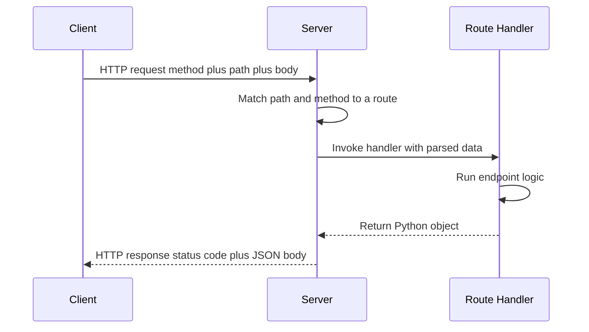
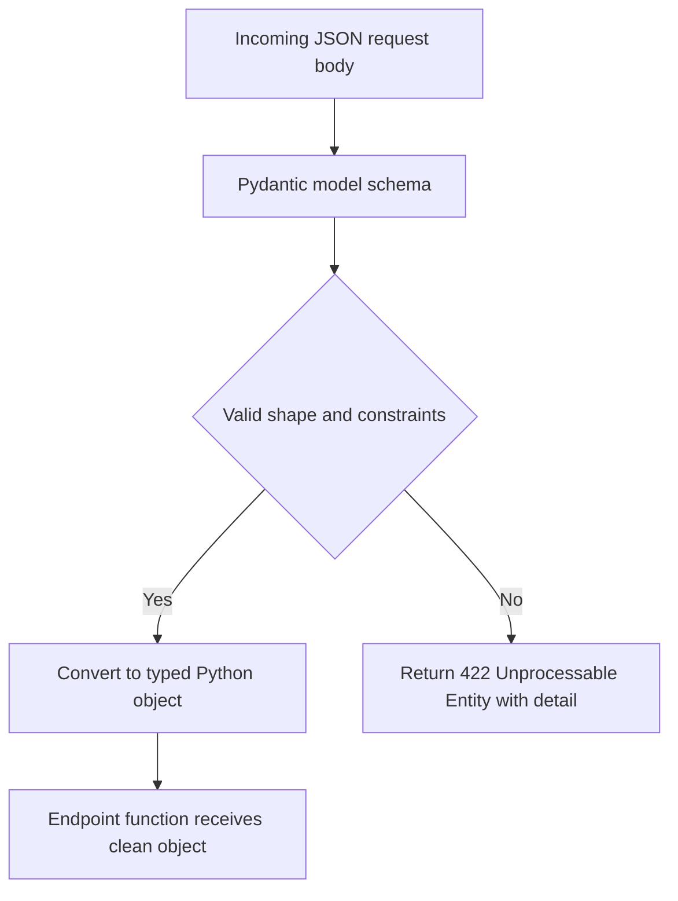
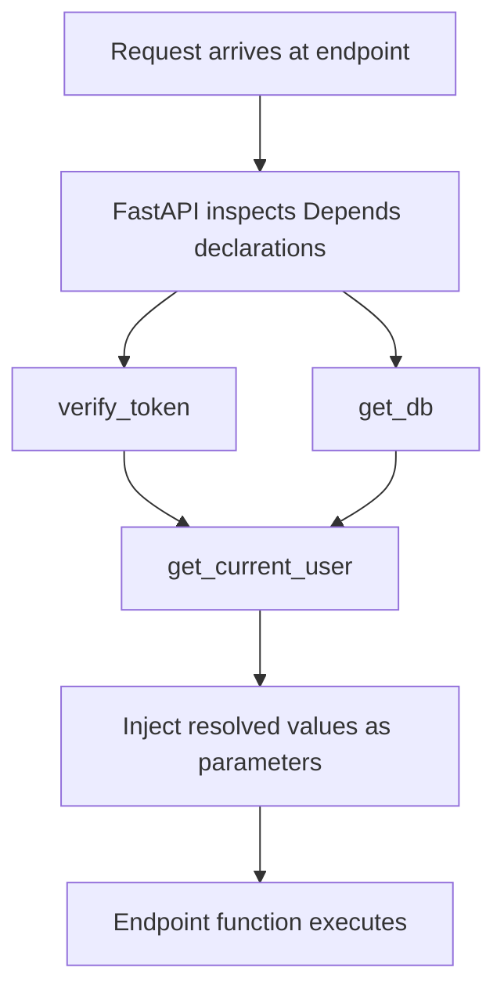

# FastAPI: Building Web APIs in Python

This guide builds, from the ground up, an understanding of how software talks to other software over the internet, and how the Python framework **FastAPI** lets you create that kind of software quickly and reliably. It moves from the most fundamental ideas (what an API even is) through the everyday tools of web development, and finally to the specialized task of putting a trained machine-learning model behind a web address so the world can use it.

---

## 1. The Foundations: APIs, the Web, and Frameworks

### 1.1 What is an API?

**API** stands for **Application Programming Interface**. An interface is simply a defined boundary across which two things communicate. A power socket is an interface: you do not need to understand the power grid, you just need a plug that fits. An API is the same idea for software it is a contract that says *"if you send me a request in this exact shape, I will send you back a response in that exact shape."*

An API lets one program use the capabilities of another program without knowing how that other program works internally. When a weather app on your phone shows the temperature, it is not measuring the air itself; it is calling a weather company's API, sending a request like "give me the weather for this city," and receiving an answer.

A **web API** is an API whose communication happens over the internet using the same technology that web browsers use. That is the kind of API this guide is about.

### 1.2 The client-server model and HTTP

Web communication follows a **client-server** model:

- A **server** is a program that waits, running continuously, ready to answer questions. The API you build with FastAPI is a server.
- A **client** is any program that sends a question to the server. A browser, a mobile app, another server, or a testing tool can all be clients.

They talk using a shared language called **HTTP** (HyperText Transfer Protocol). HTTP defines a strict back-and-forth: the client sends one **request**, and the server sends back exactly one **response**. This single round trip is the atom of all web communication.

The HTTP request/response lifecycle from client through the server to the matched route and back:



A **request** carries:
- A **method** (what kind of action is wanted explained below).
- A **path** / **URL** (which resource is being addressed, e.g. `/items/5`).
- Optional **headers** (extra metadata about the request).
- Optional **body** (the actual data being sent, for example the contents of a new record).

A **response** carries:
- A **status code** (a number summarizing what happened, e.g. `200` for success).
- Optional **headers**.
- Optional **body** (the data being returned).

### 1.3 HTTP methods (verbs)

The **method** of a request states the *intent*. HTTP defines a small set of standard methods, and well-designed APIs use them consistently:

| Method | Purpose | Idempotent | Safe |
|--------|---------|-----------|------|
| GET | Retrieve a resource (read only) | Yes | Yes |
| POST | Create a new resource | No | No |
| PUT | Replace a resource completely | Yes | No |
| PATCH | Update part of a resource | No | No |
| DELETE | Remove a resource | Yes | No |
| HEAD | Like GET, but returns no body | Yes | Yes |
| OPTIONS | Ask which methods are allowed | Yes | Yes |

Two properties in that table are worth defining:
- **Safe** means the request only reads data and changes nothing on the server. GET is safe; POST is not.
- **Idempotent** means doing the request once or many times has the same end result. Deleting item 5 twice still just leaves item 5 deleted (idempotent); creating an item twice makes two items (not idempotent).

### 1.4 REST and endpoints

**REST** (Representational State Transfer) is a popular *style* of designing web APIs. It is not a technology but a set of conventions. Its central idea: model your application as a collection of **resources** (things like "users," "items," "predictions"), give each resource a clear path, and use the standard HTTP methods to act on them. So `GET /items/5` reads item 5, `DELETE /items/5` removes it, and `POST /items` creates a new one. APIs that follow this style are called **RESTful**.

An **endpoint** (also called a **route**) is one specific combination of a path and a method that the server knows how to handle. `GET /health` is one endpoint; `POST /items` is another. Building an API is, in large part, the work of defining its endpoints.

### 1.5 JSON: the language of data exchange

When a request or response carries data in its body, that data needs a shared format both sides understand. The dominant format for web APIs is **JSON** (JavaScript Object Notation). JSON is plain text that represents structured data using a few simple building blocks: key-value pairs in curly braces (`{"name": "apple", "price": 1.5}`), ordered lists in square brackets (`[1, 2, 3]`), strings, numbers, booleans (`true`/`false`), and `null`.

JSON is human-readable, language-independent, and maps cleanly onto the data structures of almost every programming language (in Python, a JSON object becomes a dictionary). This is why FastAPI, by default, accepts and returns JSON.

### 1.6 What is a web framework?

Handling HTTP by hand is tedious: you would have to parse raw request text, route paths to the right code, validate incoming data, serialize responses, and more. A **web framework** is a library that does this heavy lifting for you, so you can focus on *what* your endpoints should do rather than the plumbing. In the Python world, the best-known frameworks are Flask, Django, and FastAPI.

---

## 2. What FastAPI Is and Why It Is Popular

**FastAPI** is a modern Python web framework for building APIs, built around standard Python **type hints** (the annotations like `name: str` or `age: int` that declare what type a value should be). Its design goals, summarized in `01_fastapi_intro.ipynb`, are what make it stand out:

- **Fast at runtime.** Its performance is on par with Node.js and Go, far ahead of older Python frameworks.
- **Fast to write.** It is claimed to cut development time substantially and reduce human-caused bugs, because the framework checks so much for you automatically.
- **Self-documenting.** From your type hints alone, FastAPI generates interactive API documentation with no extra work.
- **Standards-based.** It builds on two open standards **OpenAPI** (a standard way to describe an API's shape) and **JSON Schema** (a standard way to describe the structure of JSON data).

The single idea behind all of these benefits: **you declare the shape of your data once, using ordinary Python type hints, and FastAPI uses that one declaration for everything** validating incoming requests, converting data, generating documentation, and shaping responses.

### 2.1 What FastAPI is built from

FastAPI is not built from scratch; it stands on two well-established libraries:

- **Starlette** handles the web machinery (routing, requests, responses, WebSockets).
- **Pydantic** handles data validation and conversion (covered in detail later).

```
FastAPI
  ├── Starlette  (the web/ASGI layer)
  └── Pydantic   (the data-validation layer)
```

To actually run, a FastAPI application also needs a **server** program to listen for network connections and feed requests in. The usual choice is **Uvicorn**.

### 2.2 ASGI vs WSGI: synchronous and asynchronous

To understand why FastAPI is fast, you need two terms.

A **synchronous** program does one thing at a time: it starts a task, waits for it to finish, then starts the next. An **asynchronous** program can start a task that involves waiting (like a network call or a database query) and, instead of sitting idle, switch to handling something else until the first task is ready. For a server juggling many simultaneous users, this is a huge efficiency gain.

Python web frameworks plug into servers through a standard interface. The older standard is **WSGI** (Web Server Gateway Interface), which is synchronous. The newer standard is **ASGI** (Asynchronous Server Gateway Interface), which supports asynchronous handling, WebSockets, and HTTP/2.

| Feature | WSGI | ASGI |
|---------|------|------|
| Full name | Web Server Gateway Interface | Asynchronous Server Gateway Interface |
| Concurrency | Synchronous (one request at a time per worker) | Asynchronous (many concurrent requests) |
| WebSockets | Not supported | Supported |
| HTTP/2 | Limited | Supported |
| Example frameworks | Flask, Django (classic) | FastAPI, Starlette |
| Example servers | Gunicorn, uWSGI | Uvicorn, Hypercorn |

FastAPI is an **ASGI** framework, which is the technical root of its speed and its native support for asynchronous code.

---

## 3. Your First FastAPI Application

The structure of every FastAPI app is the same: create an application object, then attach endpoints to it.

You begin by creating an instance of the `FastAPI` class conventionally named `app`. You can pass it descriptive metadata such as a `title`, `description`, and `version`; this information later appears automatically in the generated documentation. In `01_fastapi_intro.ipynb`, the first app is created this way and given a title and version.

Each endpoint is an ordinary Python function with a **decorator** above it. A decorator is the `@something` line that attaches extra behavior to a function. In FastAPI the decorator both registers the function as an endpoint and states its method and path. For example, `@app.get("/")` says "when a GET request arrives at the path `/`, run this function." Whatever the function returns typically a Python dictionary FastAPI automatically converts to JSON for the response.

A small but important practice visible in the intro notebook is the **health-check endpoint** (e.g. `GET /health` returning `{"status": "healthy"}`). It does nothing useful for the application's data, but lets monitoring systems quickly confirm the server is alive.

### 3.1 Running the app and the automatic docs

A FastAPI file does not run itself; you hand it to the Uvicorn server with a command like `uvicorn first_app:app --reload` (where `first_app` is the filename and `app` is the application object; `--reload` restarts the server automatically when you edit the code, which is convenient during development).

Once running, three things are available for free, generated from your code:

- **Swagger UI** at `/docs` an interactive page where you can read every endpoint and even send live test requests from the browser.
- **ReDoc** at `/redoc` a cleaner, read-only documentation page.
- **OpenAPI JSON** at `/openapi.json` the machine-readable description of the whole API, which other tools can consume.

This automatic, always-accurate documentation is one of FastAPI's signature advantages. You can customize it heavily change the URLs of the docs pages, add contact and license information, and group endpoints under **tags** so related endpoints appear together. The intro notebook shows an `AI Learning API` configured with custom docs URLs and endpoints tagged `users` and `ml`.

---

## 4. Path Operations: Parameters and Request Bodies

A **path operation** is FastAPI's term for an endpoint: the pairing of a path with an HTTP method and the function that handles it. The three ways data flows *into* a path operation are path parameters, query parameters, and the request body.

### 4.1 Path parameters

A **path parameter** is a variable piece embedded directly in the URL path, written in curly braces. In `@app.get("/items/{item_id}")`, the `item_id` portion is a path parameter: a request to `/items/5` makes `item_id` equal to `5`.

By declaring the parameter's type in the function signature (`item_id: int`), you tell FastAPI to **convert and validate** it. A request to `/items/abc` cannot become an integer, so FastAPI rejects it automatically with a clear error you never write that check yourself.

You can add further constraints using `Path(...)`. For instance `Path(..., ge=1)` requires the value to be greater than or equal to 1 (`ge` means "greater than or equal"). The `...` is a special marker meaning the value is **required**.

### 4.2 Query parameters

A **query parameter** is supplied after a `?` in the URL, as `key=value` pairs separated by `&`, for example `/items/?skip=0&limit=10`. Query parameters are typically used for optional adjustments to a request filtering, searching, sorting, and **pagination** (returning results in manageable chunks rather than all at once).

In FastAPI, any function parameter that is *not* part of the path becomes a query parameter. By giving it a default value you make it optional; by typing it you get automatic validation. The `Query(...)` helper adds constraints just like `Path`. The intro notebook's `list_items` endpoint demonstrates the classic pattern: `skip` (how many to skip), `limit` (the maximum to return, capped with `le=100`, meaning "less than or equal to 100"), and an optional `search` string.

### 4.3 Request bodies

For methods that send data chiefly POST, PUT, and PATCH the data travels in the **request body** as JSON. Rather than pulling fields out of the body by hand, you declare a function parameter whose type is a **Pydantic model** (next section). FastAPI then reads the JSON body, validates it against that model, and hands your function a ready-made, fully-checked Python object.

The intro notebook's item-management example ties all of this together into a complete RESTful resource:
- `GET /items/{item_id}` read one item (path parameter).
- `GET /items/` list items (query parameters for paging and search).
- `POST /items/` create an item (request body).
- `PUT /items/{item_id}` fully replace an item.
- `PATCH /items/{item_id}` partially update an item.
- `DELETE /items/{item_id}` delete an item.

The difference between PUT and PATCH is worth emphasizing. **PUT replaces the whole resource**: you must send every field. **PATCH updates only the fields you provide.** The notebook implements PATCH using `exclude_unset=True`, which tells Pydantic to ignore any field the client did not actually send, so only the supplied fields are changed.

---

## 5. Pydantic Models and Data Validation

**Validation** means checking that incoming data is correct in shape and content before your code trusts it that required fields are present, that numbers are in range, that strings match expected formats. Untrusted, unchecked input is one of the largest sources of bugs and security holes, so doing this reliably matters enormously.

**Pydantic** is the library FastAPI uses for this. You define a class that inherits from `BaseModel` and list its fields as typed attributes. That class becomes a **schema** a precise description of what valid data looks like. When data arrives, Pydantic checks it against the schema, converts values to the right types where it sensibly can, and raises a detailed error otherwise.

How an incoming request body is validated against a Pydantic model before the endpoint runs:



### 5.1 Defining fields and constraints

A simple model lists field names with their types. To add rules, you use `Field(...)`. The intro notebook's `ItemCreate` model shows the common constraints:
- `min_length` / `max_length` for strings.
- `gt`, `ge`, `lt`, `le` for numbers (greater-than, greater-or-equal, less-than, less-or-equal). The item's `price` uses `gt=0` to demand a positive value.
- `pattern` to require a string to match a regular expression (the `UserCreate` model uses one to restrict usernames to letters, numbers, and underscores).
- A default value (or `None`) makes a field optional; `...` makes it required.

Pydantic models can also **nest**: a field's type can itself be another model. The `UserCreate` example contains an `Address` model as a field, so a user carries a structured address that is validated in its own right.

### 5.2 Enums and custom validators

An **enum** (enumeration) restricts a value to a fixed set of allowed choices. The notebook defines `UserRole` with values `admin`, `user`, and `guest`; any other value is rejected automatically.

When a rule cannot be expressed by a simple constraint, you write a **custom validator** a small method that runs during validation and can reject the data. The notebook's `UserCreate` includes a validator forbidding reserved usernames like `admin` or `root`. (The notebook uses the older `@validator` decorator, which still works but is being superseded; current Pydantic version 2 prefers `@field_validator`, and a deprecation warning in the notebook output reflects exactly this.)

### 5.3 Response models

A **response model** describes the shape of what an endpoint *returns*, declared via the decorator's `response_model` argument. This is not just documentation it actively **filters and shapes the output**. If your function returns an object with extra fields (say, a hashed password), the response model strips everything not declared in it, so secrets cannot leak out by accident. The intro notebook's `ItemResponse` adds an `id` to the input model and is used as the response model on the read and create endpoints.

The notebook also uses a small configuration, `from_attributes = True` (shown as the older `class Config` style; Pydantic 2 prefers `model_config = ConfigDict(...)`), which lets a model be built directly from an object's attributes rather than only from a dictionary convenient when returning database records.

---

## 6. Status Codes, Errors, Headers, Cookies, and Files

### 6.1 Status codes

Every HTTP response includes a three-digit **status code** summarizing the outcome. They fall into families by their first digit:

| Range | Meaning | Common examples |
|-------|---------|-----------------|
| 1xx | Informational | 100 Continue |
| 2xx | Success | 200 OK, 201 Created, 204 No Content |
| 3xx | Redirection | 301 Moved Permanently, 307 Temporary Redirect |
| 4xx | Client error (the request was wrong) | 400 Bad Request, 401 Unauthorized, 403 Forbidden, 404 Not Found, 422 Unprocessable Entity |
| 5xx | Server error (the server failed) | 500 Internal Server Error, 503 Service Unavailable |

The distinction between 4xx and 5xx is fundamental: **4xx means the client made a mistake** (bad input, missing permission), while **5xx means the server itself broke**. You set an endpoint's success code with the decorator's `status_code` argument for example a creation endpoint returns `201 Created`, and a deletion returns `204 No Content` (success with no body). Note that `422 Unprocessable Entity` is what FastAPI returns automatically when request data fails Pydantic validation.

### 6.2 Raising errors

When something goes wrong inside an endpoint, you signal it by **raising** an `HTTPException`, giving it a status code and a `detail` message. FastAPI turns that into a proper error response. The recurring example is a lookup that fails: if the requested item is not in the database, the endpoint raises `HTTPException(status_code=404, detail="Item not found")`. You can also attach custom response headers to an exception.

For more control, you can register **custom exception handlers**. You define your own exception type and a handler function, decorated with `@app.exception_handler(...)`, that decides how that exception becomes a response. The intro notebook defines an `ItemNotFoundException` with its own handler, and also *overrides* the built-in validation-error handler to reshape the default 422 response. This lets an application present errors in one consistent, branded format.

### 6.3 Headers and cookies

**Headers** are key-value metadata attached to requests and responses things like `User-Agent` (which client is calling), `Accept-Language`, or custom values like an API token in `X-Token`. FastAPI reads request headers by declaring a parameter with `Header(None)`, and lets you set response headers by writing to a `Response` object.

**Cookies** are small pieces of data the server asks the client to store and send back on future requests; they are the classic mechanism for remembering a logged-in session. FastAPI reads cookies with `Cookie(None)` and sets them with `response.set_cookie(...)`. The intro notebook's cookie example sets `httponly=True` (the cookie cannot be read by browser JavaScript, a security measure) and `samesite="lax"` (a control over when the cookie is sent across sites, mitigating certain attacks).

### 6.4 File uploads and downloads

APIs often need to accept files (an image, a CSV, a document). FastAPI handles this with `UploadFile` and the `File(...)` marker. An `UploadFile` exposes the uploaded file's name (`filename`), its declared type (`content_type`), and its contents, which you can stream to disk or read into memory. The intro notebook shows single uploads, multiple-file uploads (a list of `UploadFile`), and mixing a file with regular **form fields** using `Form(...)` necessary because file uploads use a different body encoding than JSON. To send a file back, you return a `FileResponse`. (Form and file handling require the small extra package `python-multipart`.)

---

## 7. Asynchronous Endpoints

FastAPI lets you write each endpoint function as either a normal function (`def`) or an asynchronous one (`async def`). The choice matters for performance.

The key concept is **blocking**. An operation that makes the program sit and wait reading from a network, querying a database, calling another API is said to block. In a synchronous server, while one request blocks, that worker can do nothing else. In an asynchronous server, a function written with `async def` can use the `await` keyword to pause at a blocking step and let the server handle other requests in the meantime, resuming later when the result is ready.

The practical guidance:
- If your endpoint performs I/O using libraries that support `await` (async database drivers, async HTTP clients), make it `async def` and `await` those calls this scales to many concurrent users.
- If your endpoint does heavy CPU work or calls a library that only knows how to block (many machine-learning libraries are like this), an `async def` that blocks would freeze the whole server. The correct pattern, shown for ML in section 11, is to push that blocking work onto a separate thread.

FastAPI is unusual in supporting both styles seamlessly, which is why the notebooks freely mix `def` and `async def`.

---

## 8. Dependency Injection

**Dependency injection** is the headline feature of `02_advanced_fastapi.ipynb`. The idea sounds abstract but is simple: instead of an endpoint creating everything it needs by itself, it *declares* what it needs, and FastAPI *supplies* (injects) it. A "dependency" is just a function that produces something an endpoint requires a database session, the current logged-in user, shared pagination settings, a permission check.

You write a dependency as a normal function, and you consume it in an endpoint by writing a parameter with `Depends(your_dependency)`. Before the endpoint runs, FastAPI calls the dependency, takes its return value, and passes it in. This buys you several things at once:
- **Reuse.** Logic like "extract pagination parameters" or "verify this token" is written once and shared across every endpoint that needs it.
- **Separation of concerns.** The endpoint focuses on its job; cross-cutting setup lives in dependencies.
- **Testability.** In tests you can swap a real dependency for a fake one.

A dependency can itself depend on other dependencies, forming a chain. The advanced notebook shows `get_current_user` depending on both `verify_token` and `get_db`; FastAPI resolves the whole tree automatically.

How FastAPI resolves a dependency tree and injects the results before the endpoint runs:



Two refinements appear in the notebook:
- A dependency that uses **`yield`** can run setup code, hand a value to the endpoint, and then run cleanup code afterward the natural pattern for opening a database session and guaranteeing it is closed when the request finishes.
- A dependency can be attached **globally** by passing `dependencies=[Depends(...)]` when creating the `FastAPI` app, so it runs for every route useful for a site-wide authentication check.

---

## 9. Authentication and JWT

**Authentication** is the process of confirming *who* is making a request. The standard modern approach for APIs uses **tokens**, and the most common token format is the **JWT**.

### 9.1 What a JWT is

**JWT** stands for **JSON Web Token**. It is a compact string with three parts separated by dots:

1. **Header** states the signing algorithm (e.g. `{"alg": "HS256", "typ": "JWT"}`).
2. **Payload** the **claims**, meaning the data about the user and the token, such as the subject (`sub`, who the user is) and an expiry time (`exp`).
3. **Signature** a cryptographic seal computed from the header, payload, and a secret key held only by the server.

The signature is the crucial part. Because only the server knows the secret, only the server can produce a valid signature. If anyone tampers with the payload, the signature no longer matches and the server rejects the token. A JWT is therefore self-contained and tamper-evident: the server can trust a token's contents without looking anything up in a database, simply by re-checking the signature.

### 9.2 The OAuth2 password flow

The advanced notebook implements the widely used **OAuth2 password flow**:

1. The user sends their **username and password** to a `POST /token` endpoint.
2. The server verifies the credentials and, if they are valid, returns a freshly minted JWT **access token**.
3. For every subsequent request to a protected endpoint, the client includes that token in the `Authorization` header in the form `Bearer <token>`.
4. The server reads the token, verifies its signature and expiry, identifies the user, and either serves the request or rejects it with `401 Unauthorized`.

FastAPI supports this directly. `OAuth2PasswordBearer` is a dependency that knows how to pull the bearer token from the header; `OAuth2PasswordRequestForm` is a dependency that reads the username and password from the login form. The notebook's `get_current_user` dependency decodes and validates the token, and any endpoint that wants protection simply declares `current_user = Depends(get_current_user)` protecting an endpoint becomes a one-line addition.

### 9.3 Password hashing

Passwords must **never** be stored as plain text. The notebook uses `passlib` with the **bcrypt** algorithm to store a **hash** a one-way scrambled form of the password. When a user logs in, the server hashes the supplied password and compares it to the stored hash; it can verify a password without ever knowing the original. The notebook also notes that the JWT secret key must be kept secret and replaced with a strong random value in production.

---

## 10. Middleware, Lifespan Events, Background Tasks, and WebSockets

### 10.1 Middleware

**Middleware** is code that wraps around *every* request and response, running before the request reaches your endpoint and after the response leaves it. It is the right place for concerns that apply across the whole application. The advanced notebook demonstrates several kinds:

- **CORS middleware.** **CORS** (Cross-Origin Resource Sharing) is a browser security rule that, by default, blocks a web page from one website from calling an API on a different website. If a frontend at one address needs to call your API at another, you must explicitly permit it with `CORSMiddleware`, listing the allowed origins, methods, and headers.
- **GZip middleware.** Compresses large responses to save bandwidth.
- **Trusted-host middleware.** Rejects requests whose `Host` header is not on an allowed list, a defense against certain attacks.
- **Custom middleware.** You can write your own with `@app.middleware("http")`. The notebook adds one that times each request and reports the duration in an `X-Process-Time` response header, and another that logs every request classic uses of custom middleware.

### 10.2 Lifespan events

A server needs to do some work once when it starts (load configuration, open a database connection pool, load a machine-learning model) and once when it shuts down (close those connections, free memory). FastAPI handles this with a **lifespan** function: an async function marked `@asynccontextmanager` where everything *before* the `yield` runs at startup and everything *after* runs at shutdown. You attach it with `FastAPI(lifespan=lifespan)`. The advanced notebook uses this to populate a global model registry at startup and clear it at shutdown the foundation of the ML-serving pattern in the next section.

### 10.3 Background tasks

Sometimes an endpoint needs to trigger slow work (sending a confirmation email, processing an uploaded file) but should not make the client wait for that work to finish. A **background task** is work scheduled to run *after* the response has already been sent. You declare a `BackgroundTasks` parameter and call `background_tasks.add_task(...)`. The notebook schedules an email notification and a file-processing job, then returns immediately the client gets a fast `{"message": "Notification scheduled"}` while the work happens behind the scenes.

### 10.4 WebSockets

Standard HTTP is one request, one response the server cannot speak unless spoken to. A **WebSocket** is a different kind of connection: once opened, it stays open and lets the client and server send messages to each other freely, in both directions, in real time. This powers chat apps, live dashboards, and streaming updates. Because FastAPI is built on ASGI, WebSockets are native. The advanced notebook builds a `ConnectionManager` that tracks all connected clients and can send a message to one client or **broadcast** to all of them the skeleton of a real-time chat server, exposed at a `ws://` address rather than `http://`.

### 10.5 Databases and testing

The advanced notebook rounds out a production picture with two more pieces. It shows **async SQLAlchemy** integration: SQLAlchemy is the standard Python toolkit for talking to relational databases, and its async variant pairs naturally with FastAPI, with database sessions supplied to endpoints through dependency injection. It also shows **testing**: FastAPI's `TestClient` lets you call your endpoints in test code without running a real server, asserting on status codes and JSON bodies, with an async variant using the `httpx` client.

---

## 11. Serving Machine-Learning Models with FastAPI

The third notebook, `03_ml_serving_with_fastapi.ipynb`, applies everything above to a specific and important task: **model serving** taking a model that was trained offline and exposing it behind an API so that other software can send it data and receive predictions.

### 11.1 Why FastAPI suits ML serving

A trained model is useless in isolation; it must be reachable. FastAPI is an excellent host for it because the features already covered map directly onto serving needs: Pydantic validates that incoming feature values are well-formed before they ever reach the model; the automatic docs let consumers discover the prediction API; async support and ASGI performance handle high request volumes; and lifespan events solve the central problem of loading a model once. The notebook contrasts FastAPI with the older Flask framework across exactly these dimensions automatic validation, automatic docs, native async, and easy batching.

### 11.2 The core pattern: load once, predict many times

The single most important principle in ML serving is: **load the model into memory one time, at startup, and reuse it for every request.** Loading a model from disk is slow; doing it on every prediction would make the API crawl. The notebook's `iris_api` does this with a lifespan function that loads a saved scikit-learn classifier and its scaler from `.pkl` files into a shared `models` dictionary. As the notebook comment states plainly, this happens at startup "not on every request." Every prediction endpoint then reaches into that already-loaded dictionary.

The supporting files are present in the directory: a trained model in `iris_model.pkl` and a fitted feature scaler in `iris_scaler.pkl`. A **scaler** is a preprocessing step that standardizes input features; it must be saved alongside the model and applied to incoming data so that what the model sees at serving time matches what it saw during training.

The end-to-end flow of a model-serving request from raw input through preprocessing, inference, and postprocessing back to the client:


### 11.3 A single-prediction endpoint

The notebook's `POST /predict` endpoint shows the full shape of a serving route:
- An input Pydantic model (`IrisFeatures`) declares the four flower measurements, each constrained to a sensible range. Invalid input is rejected automatically before any inference runs.
- The endpoint assembles the features into the array shape the model expects, applies the saved scaler, then calls the model to get both a predicted class and the class **probabilities** (the model's confidence in each possible answer, via `predict_proba`).
- A response model (`Prediction`) returns the predicted class id, a human-readable class name, the probability, all probabilities, and even the inference **latency** in milliseconds a small but professional touch that exposes how long the prediction took.

### 11.4 Batch prediction

Calling a model once per item, over a network, is inefficient when you have many items. **Batching** sends a whole list of inputs in one request so the model can process them together usually far faster than many separate calls. The notebook's `POST /predict/batch` accepts a `BatchFeatures` model containing a list of samples, stacks them into one array, and runs a single `predict` and `predict_proba` over the entire batch, returning all results together with the batch size and total latency.

### 11.5 Serving deep-learning and Hugging Face models

The same skeleton extends to large neural models. The notebook's Hugging Face example loads a sentiment-analysis pipeline and a sentence-embedding model into a registry at startup. It highlights a critical refinement for these heavier models: their inference is CPU/GPU-bound and **blocking**, so running it directly inside an `async def` would freeze the whole server. The fix shown is `run_in_executor`, which pushes the blocking inference onto a separate thread pool, keeping the event loop free to handle other requests. This is the practical resolution of the async caveat raised in section 7.

### 11.6 File uploads for ML

Models often consume files rather than JSON an image for a vision model, a CSV for a tabular model, an audio clip for speech. The file-upload mechanism from section 6.4 (`UploadFile` and `File(...)`) is exactly how such inputs reach a serving endpoint; the uploaded bytes are read and fed to the model. The directory's `uploads/` folder is where such files land in the intro notebook's examples.

### 11.7 Versioning, health, and monitoring

Production model serving needs operational features beyond raw prediction:

- **Model versioning.** Models are retrained and improved over time. The notebook keeps a `model_registry` keyed by version (`v1`, `v2`, …) with an `active_version`, exposes a `/models` endpoint listing available versions and their accuracy, and a `/predict/{version}` endpoint to request a specific version. This lets new and old models run side by side, which is essential for safe rollouts and A/B testing.
- **Health checks.** A `/health` endpoint reports whether the service is up and which models are loaded what monitoring systems and load balancers poll to decide if an instance is ready to receive traffic.
- **Metrics with Prometheus.** **Prometheus** is a popular monitoring system that periodically scrapes numeric metrics from your app. The notebook instruments the API using the Prometheus client library with three metric types: a **Counter** (a number that only goes up, e.g. total requests or total predictions), a **Histogram** (records a distribution, e.g. request latency), and a **Gauge** (a value that goes up and down, e.g. number of in-flight requests). A middleware records these for every request, and a `/metrics` endpoint exposes them in the format Prometheus expects.

### 11.8 Packaging and deployment

Finally, the notebook addresses getting the service into production. It writes out a **Dockerfile** a recipe that packages the application and all its dependencies into a portable, self-contained image (a **container**) that runs identically on any machine. Notable production practices in it: copying the requirements file first so dependency installation is cached across rebuilds, creating a non-root user for security, and launching with **Gunicorn managing multiple Uvicorn workers**. Gunicorn here is a process manager that runs several worker processes in parallel (`-w 4`), each an async Uvicorn server, so the service uses multiple CPU cores and survives individual worker crashes. A pinned `requirements.txt` lists exact dependency versions so the build is reproducible. The directory contains the resulting `Dockerfile.example` and `requirements_example.txt`.

---

## 12. The Big Picture

Pulled together, the three notebooks tell one coherent story. FastAPI gives you a way to expose Python functionality over HTTP where **a single declaration of your data's shape written in plain Python type hints and Pydantic models drives validation, conversion, documentation, and response shaping all at once.** The intro notebook establishes the vocabulary and the request/response mechanics; the advanced notebook layers on the structural tools that real applications need (dependency injection, authentication, middleware, lifecycle management, real-time connections, databases, and tests); and the ML-serving notebook shows that putting a model into production is, with FastAPI, mostly the same framework applied to a new payload load the model once, validate the inputs, run inference (off the event loop when it blocks), batch when you can, and wrap the whole thing in versioning, health checks, metrics, and a container for deployment.

### Key terms at a glance

| Term | One-line meaning |
|------|------------------|
| API | A contract letting one program use another's capabilities |
| REST | A style of API design centered on resources and HTTP methods |
| Endpoint / route | One path + method handled by the server |
| HTTP method | The verb stating intent (GET, POST, PUT, PATCH, DELETE) |
| Request / response | The single round trip of web communication |
| JSON | The text format used to exchange structured data |
| Path / query parameter | Variable parts of the URL (in the path / after `?`) |
| Request body | Data sent in the body of a POST/PUT/PATCH request |
| Status code | Three-digit number summarizing a response's outcome |
| Pydantic model | A typed class that validates and shapes data |
| Response model | A schema controlling and filtering what an endpoint returns |
| Async / await | Handling other work while a task waits, instead of blocking |
| Dependency injection | Declaring what an endpoint needs and letting FastAPI supply it |
| JWT | A signed, tamper-evident token carrying user claims |
| Middleware | Code wrapping every request and response |
| Lifespan event | Startup/shutdown code (used to load models once) |
| Background task | Work that runs after the response is sent |
| WebSocket | A persistent two-way real-time connection |
| Model serving | Exposing a trained model behind an API for predictions |
| Batching | Sending many inputs in one request for efficient inference |
