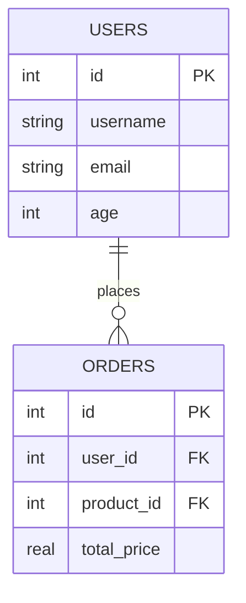
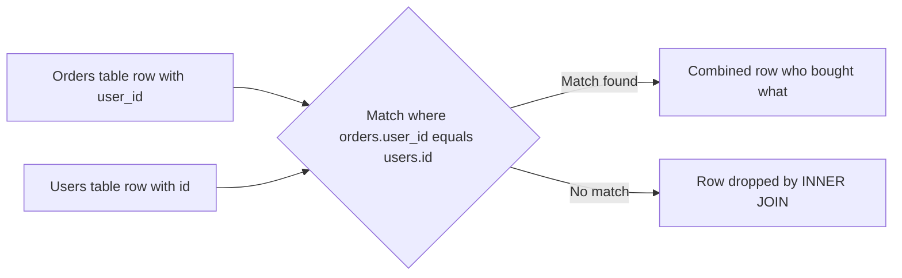

# SQL Fundamentals

**SQL** stands for **Structured Query Language**. It is the standard language used to talk to a **relational database** to define what data looks like, to put data in, to change it, to delete it, and above all to *ask questions* of it. This guide builds the relational model from absolute scratch and then walks through every operation you need to read, combine, and summarize data correctly. The companion notebook `01_sql_fundamentals.ipynb` demonstrates each idea against a small in-memory database of users, products, and orders.

## What a Relational Database Is

A **relational database** organizes all its data into **tables**. Picture a spreadsheet:

- A **table** (also called a **relation**) is a grid that holds many records of the same kind for example, a `users` table holds users, a `products` table holds products.
- A **row** (also called a **record** or **tuple**) is one single item one specific user, one specific order. A row runs left to right across the grid.
- A **column** (also called a **field** or **attribute**) is one named property that every row has for example, every user has a `username`, an `email`, and an `age`. A column runs top to bottom.

So a table is a collection of rows, and every row has a value in each column. The word "relational" comes from the mathematical term *relation* for such a table, not from the relationships between tables (though those exist too).

### Keys: How Rows Are Identified and Linked

To work with rows reliably you need a way to point at exactly one of them, and a way to connect rows in different tables. This is the job of **keys**.

- A **primary key** is a column (or combination of columns) whose value is unique for every row and is never empty. It is the row's permanent identity card. In the notebook each table has an `id` column declared `PRIMARY KEY`, and SQLite fills it in automatically (`AUTOINCREMENT`) so every new row gets the next unused number.
- A **foreign key** is a column in one table that holds the primary-key value of a row in *another* table, creating a link. In the notebook the `orders` table has a `user_id` column that references `users(id)` and a `product_id` column that references `products(id)`. This is how one order knows *who* placed it and *what* was bought, without copying the user's name and the product's price into the order itself.

This linking is the heart of the relational model: each fact is stored once, in one place, and other tables refer to it by key.

An entity-relationship diagram of a users-and-orders schema linked by a foreign key:

### Schema and Constraints

A **schema** is the formal blueprint of a table: its name, its columns, the **data type** of each column (text, integer, real number, date), and the **constraints** rules the data must obey. The notebook's `CREATE TABLE` statements show several kinds of constraint:

- `NOT NULL` the column must always have a value (it cannot be empty/null).
- `UNIQUE` no two rows may share this value (e.g., two users cannot have the same email).
- `CHECK` a custom rule, such as `age >= 0 AND age <= 150`, or restricting `role` to one of `admin`, `user`, `guest`.
- `DEFAULT` a value to use automatically when none is given, such as `created_at` defaulting to the current timestamp.

A constraint is the database enforcing your rules for you. Try to insert an order whose `product_id` points at a non-existent product, and the database refuses. This is **data integrity**, and it is one of the biggest reasons to use a relational database.

## The Five Categories of SQL Commands

SQL commands are grouped by what they do. The notebook's opening table lays them out:

| Category | Stands for | Commands | Purpose |
|---|---|---|---|
| **DDL** | Data Definition Language | `CREATE`, `ALTER`, `DROP`, `TRUNCATE` | Define and change the *structure* (tables, columns) |
| **DML** | Data Manipulation Language | `INSERT`, `UPDATE`, `DELETE` | Change the *data* inside tables |
| **DQL** | Data Query Language | `SELECT` | Read/ask questions of the data |
| **DCL** | Data Control Language | `GRANT`, `REVOKE` | Manage who is allowed to do what (permissions) |
| **TCL** | Transaction Control Language | `BEGIN`, `COMMIT`, `ROLLBACK` | Group operations into transactions |

The first three are what you use daily; together with reading they make up **CRUD** Create, Read, Update, Delete the four fundamental things you ever do to data.

### DDL Creating Structure

`CREATE TABLE` builds a new table by listing its columns, their types, and their constraints. `ALTER` changes an existing table (add a column, etc.), `DROP` deletes a table entirely, and `TRUNCATE` empties a table of all rows while keeping its structure. In `01_sql_fundamentals.ipynb`, a single `CREATE TABLE` block defines the three tables and all their keys and constraints up front.

### DML Inserting, Updating, Deleting Data

- `INSERT` adds new rows. You list the columns you are filling and the values for them. The notebook inserts several users, products, and orders in one batch each.
- `UPDATE` changes values in existing rows. Crucially, `UPDATE` is paired with a `WHERE` clause that selects *which* rows to change without a `WHERE`, it changes every row.
- `DELETE` removes rows, again controlled by `WHERE`.

## SELECT Asking Questions of the Data

`SELECT` is where SQL spends most of its life. A `SELECT` statement describes the rows and columns you want and the database returns them. Its main building blocks:

- **Choosing columns**: `SELECT username, email, age` returns only those three fields; `SELECT *` returns all columns.
- **Filtering rows** with `WHERE`: `WHERE age > 25` keeps only rows that satisfy the condition. Filter conditions can use:
  - Comparisons: `=`, `<>` (not equal), `<`, `>`, `<=`, `>=`.
  - `LIKE` for text pattern matching, where `%` means "any characters" `email LIKE '%example.com'` matches any address ending in that domain.
  - `IN` to match any value from a list `role IN ('admin', 'guest')`.
  - `BETWEEN` for a range `age BETWEEN 25 AND 30` (inclusive on both ends).
- **Sorting** with `ORDER BY`: `ORDER BY age DESC` sorts highest-age first (`ASC` for ascending, the default).
- **Limiting** with `LIMIT`: `LIMIT 3` returns at most three rows useful for "top N" questions.

The notebook's SELECT cell demonstrates each of these operators in isolation so you can see exactly what each one filters.

## JOINs Combining Tables

Because relational data is split across linked tables, the single most important skill is **joining** recombining rows from two or more tables based on matching keys. A `JOIN` says "for each row in table A, find the matching rows in table B (where A's foreign key equals B's primary key) and stitch them into one wide row."

How an INNER JOIN stitches matching rows from two tables into one wide result row:

There are four main join types, distinguished by what they do with rows that have *no* match:

| Join type | Keeps | Plain-English meaning |
|---|---|---|
| **INNER JOIN** | Only rows that match in *both* tables | "Show me only pairs that exist on both sides." |
| **LEFT JOIN** | All rows from the left table, matched where possible | "Show me every left-side row, even if it has no right-side match." |
| **RIGHT JOIN** | All rows from the right table | Mirror image of LEFT JOIN. |
| **FULL OUTER JOIN** | All rows from both tables | "Show everything from both sides, matched where possible." |

A concrete example from the notebook: an **INNER JOIN** of `orders` to `users` and `products` produces a readable list of *who bought what for how much*, because it pairs each order with its one matching user and product. A **LEFT JOIN** of `users` to `orders` lists *every* user together with their order count including "eve", who placed zero orders, because the left table (users) is kept in full even when the right side (orders) has no match.

A **SELF JOIN** is a join of a table to itself, used to compare rows within the same table (the notebook compares each user's age against a reference user). Joins are how the normalized, split-up data is reassembled into the answers people actually want.

## Aggregation and GROUP BY Summarizing Data

So far every query returns individual rows. Often you instead want a *summary*: a count, an average, a total. This is **aggregation**, performed by **aggregate functions**:

- `COUNT(*)` how many rows.
- `SUM(column)` the total.
- `AVG(column)` the average.
- `MIN(column)` / `MAX(column)` the smallest / largest.

By themselves these collapse the whole table into one number. **`GROUP BY`** makes them far more useful: it splits rows into groups by some column, then computes the aggregate *for each group*. The notebook groups products by `category` to get the count, average price, and total stock *per category* turning a list of products into a comparison of categories.

Two related clauses:

- **`HAVING`** filters *groups* after aggregation, the way `WHERE` filters rows before it. `HAVING COUNT(*) > 1` keeps only categories that have more than one product. (Rule of thumb: `WHERE` filters raw rows, `HAVING` filters grouped results.)
- Combining a JOIN with GROUP BY, the notebook computes revenue per user joining orders to users, grouping by user, and summing each user's spending.

## Subqueries and CTEs Queries Inside Queries

Sometimes the answer to a question depends on another question's answer. A **subquery** is a `SELECT` nested inside another statement. The notebook finds "users who spent above the average order value" by embedding `(SELECT AVG(total_price) FROM orders)` inside the `HAVING` clause the inner query computes the average, the outer query compares each user against it.

A **Common Table Expression (CTE)**, written with the `WITH` keyword, is a cleaner way to do the same thing. It lets you name one or more intermediate result sets at the top of the query and then refer to them by name below, as if they were temporary tables. The notebook rewrites the above-average-spender query as two CTEs `user_totals` (each user's spending) and `avg_spend` (the average of those totals) and then joins them. CTEs make complex queries readable by breaking them into named, logical steps.

## Window Functions Calculations Across Related Rows

A **window function** performs a calculation across a set of rows that are related to the current row, *without* collapsing them into one (unlike `GROUP BY`). Each input row still produces one output row, but with an extra computed value that "looks across" its neighbors. The window is defined with `OVER (...)`, optionally split by `PARTITION BY` (groups) and ordered by `ORDER BY`. The notebook's window cell ranks products within each category by price and shows several functions:

- `ROW_NUMBER()` a unique sequential number (1, 2, 3...) within each partition.
- `RANK()` like row number but ties share a rank and leave gaps (1, 1, 3).
- `DENSE_RANK()` ties share a rank with no gaps (1, 1, 2).
- `AVG(price) OVER (PARTITION BY category)` the category average attached to every product row.
- `LAG()` / `LEAD()` reach back to the previous row or forward to the next, used here to compute the price difference between consecutively ranked products.

Window functions answer "compare each row to its group" questions running totals, rankings, period-over-period changes that are awkward or impossible with plain aggregation.

## ACID Transactions Guaranteeing Correctness

A **transaction** is a group of one or more operations treated as a single, indivisible unit of work. You start it (`BEGIN`), do several changes, and then either `COMMIT` (make them all permanent) or `ROLLBACK` (undo all of them). Transactions are governed by four guarantees, abbreviated **ACID**:

| Property | Meaning |
|---|---|
| **Atomicity** | All operations in the transaction succeed together, or none take effect never a partial result. |
| **Consistency** | The database moves from one valid state to another; all constraints hold before and after. |
| **Isolation** | Concurrent transactions do not interfere; each behaves as if it ran alone. |
| **Durability** | Once committed, changes survive crashes, power loss, and restarts. |

The classic example is a money transfer: deduct from one account and add to another. **Atomicity** ensures you can never deduct without the matching credit if the second step fails, the whole thing rolls back. The notebook illustrates this with a transfer function that wraps both updates in `BEGIN`/`COMMIT` and falls back to `ROLLBACK` on any error, and also shows Python's context-manager form (`with conn:`) that auto-commits on success and auto-rolls-back on exception.

### Isolation Levels

When many transactions run at once, they can interfere in subtle ways. **Isolation levels** let you choose how strictly the database prevents this, trading safety against speed. The anomalies they guard against:

- **Dirty read** reading another transaction's uncommitted (possibly doomed) changes.
- **Non-repeatable read** re-reading a row and getting a different value because another transaction changed it in between.
- **Phantom read** re-running a query and finding new rows that another transaction inserted.

| Level (least → most strict) | Dirty read | Non-repeatable read | Phantom read |
|---|---|---|---|
| READ UNCOMMITTED | possible | possible | possible |
| READ COMMITTED | prevented | possible | possible |
| REPEATABLE READ | prevented | prevented | possible |
| SERIALIZABLE | prevented | prevented | prevented |

Stricter levels are safer but allow less concurrency. Most applications use READ COMMITTED or REPEATABLE READ as a balance.

## Indexes and Performance

By default, finding rows that match a condition means scanning the whole table from top to bottom a **full table scan**. On a million-row table that is slow. An **index** is a separate, sorted data structure the database maintains that lets it jump straight to matching rows, exactly like the index at the back of a book lets you find a topic without reading every page.

Creating an index on a column you frequently filter or join by (e.g., `email`, `user_id`) turns a slow scan into a fast lookup. The notebook creates several indexes and then uses `EXPLAIN QUERY PLAN` a command that shows *how* the database intends to run a query to confirm that a search by email now uses the index instead of scanning.

The trade-off: indexes speed up reads but slow down writes (every `INSERT`/`UPDATE`/`DELETE` must also update the indexes) and consume disk space. So you index the columns that matter for your queries, not every column.

### Index Types

Different index structures suit different query patterns. The notebook lists PostgreSQL's main types:

- **B-tree** the default; great for equality and range queries (`=`, `<`, `>`, `BETWEEN`, and prefix `LIKE 'abc%'`).
- **Hash** only for exact equality (`=`), and faster than B-tree for that single purpose.
- **GiST** geometric data and certain full-text searches.
- **GIN** arrays, JSON (JSONB), and full-text search (matching words inside documents).
- **BRIN** very large tables with naturally ordered data such as timestamps; tiny and cheap.

A **partial index** indexes only the rows matching a condition (e.g., only `status = 'active'` orders), saving space when you only query that subset. A **composite/compound index** covers several columns at once (the notebook indexes `(category, price)` together).

## SQL from Python

The notebook runs all its SQL through Python. It uses the built-in `sqlite3` module to connect to an in-memory SQLite database, and `pandas` to display query results as readable tables. It also briefly introduces **SQLAlchemy**, a Python library that can run raw SQL (via `text(...)`) and also provides a full **ORM** a way to work with database rows as Python objects, covered in depth in the `04_orm` guide. The key takeaway is that SQL is a language independent of any one tool: the same statements run from a command line, a Python script, or a web server.

## Summary

SQL and the relational model rest on a few durable ideas: data lives in **tables** of **rows** and **columns**; **primary** and **foreign keys** identify and link rows; a **schema** with **constraints** keeps data valid; `SELECT` with `WHERE`, `ORDER BY`, and `LIMIT` reads it; **JOINs** recombine split-up tables; **GROUP BY** with aggregate functions summarizes it; **subqueries**, **CTEs**, and **window functions** answer harder questions; **ACID transactions** keep it correct under concurrency and failure; and **indexes** keep it fast. Master these and you can model and query the structured data at the core of almost any system.
