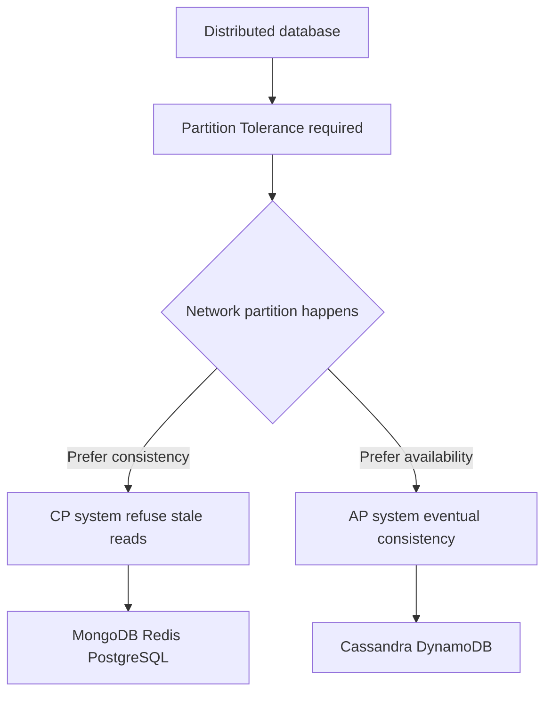

# NoSQL Databases

**NoSQL** stands for "Not Only SQL." It is an umbrella name for databases that deliberately step away from the rigid table-and-row model of relational databases in order to gain something else flexibility in what each record can contain, the ability to spread data across many machines, or raw speed. This guide explains *why* such databases exist, the fundamental trade-off that governs them (the CAP theorem), and the major types document, key-value, column-family, graph, search, and vector with the kinds of problems each one solves best. The companion notebook `01_nosql_databases.ipynb` walks through MongoDB, Redis, and Cassandra in detail.

## Why NoSQL Exists

Relational databases (covered in `01_sql`) are excellent when data is well-structured, relationships matter, and correctness is critical. But they make assumptions that become painful at certain scales and shapes:

- They require a **fixed schema** decided up front. Every row in a table must have the same columns. If your data is irregular some products have a `warranty`, others a `bandwidth`, others neither forcing it into one rigid table is awkward.
- They are designed to run primarily on **one powerful machine** (vertical scaling). When traffic outgrows the biggest machine you can buy, splitting a relational database across many servers while preserving its guarantees is genuinely hard.
- Their strict consistency and `JOIN`-heavy queries can be slower than necessary for simple "look up by key" or "store this blob" workloads.

NoSQL databases relax one or more of these assumptions. The price is that you usually give up some of the relational world's conveniences joins, a fixed schema, or instant consistency in exchange for flexibility, horizontal scale, or speed. Choosing NoSQL is therefore always a *trade-off*, and understanding the trade-off starts with the CAP theorem.

## The CAP Theorem

Once a database is **distributed** its data lives on more than one machine it faces a fundamental limit described by the **CAP theorem**. CAP names three desirable properties:

- **Consistency (C)** every read returns the most recent write; all machines agree on the current value.
- **Availability (A)** every request gets a response (even if that response is not guaranteed to be the very latest data).
- **Partition Tolerance (P)** the system keeps working even when the network between machines fails and they cannot talk to each other (a "partition").

The three CAP properties and the CP-versus-AP choice forced during a network partition:

The theorem states you can fully guarantee **at most two of the three**. In the real world, network partitions *will* happen, so partition tolerance (P) is not optional which means the real choice is between **consistency** and **availability** during a partition:

- A **CP** system (e.g., PostgreSQL, MongoDB by default, Redis) prefers consistency: if machines can't agree, it would rather refuse some requests than serve stale data.
- An **AP** system (e.g., Cassandra, DynamoDB) prefers availability: it keeps answering, accepting that different machines may briefly disagree until the writes propagate. This is called **eventual consistency** given enough time with no new writes, all copies converge to the same value.

The notebook's CAP table maps common databases to their trade-offs. There is no "best" choice; it depends on whether your application can tolerate stale reads (favor AP) or must never serve them (favor CP).

## The Types of NoSQL Databases

NoSQL is not one thing but a family of quite different designs. The notebook lays them out:

| Type | Examples | Best for |
|---|---|---|
| **Document** | MongoDB, CouchDB, Firestore | JSON-like records with flexible, varying schemas |
| **Key-Value** | Redis, DynamoDB, Memcached | Caching, sessions, leaderboards |
| **Column-Family (wide-column)** | Cassandra, HBase | Time-series, analytics, write-heavy wide tables |
| **Graph** | Neo4j, Amazon Neptune | Social networks, recommendations, connected data |
| **Search** | Elasticsearch, OpenSearch | Full-text search, logs |
| **Vector** | Pinecone, Weaviate, Qdrant | ML embeddings, similarity search (see `03_vector_db`) |

The next sections examine the three the notebook covers hands-on, then summarizes the rest.

## Document Databases MongoDB

A **document database** stores data as **documents**: self-contained records that look like JSON objects nested structures of fields, values, lists, and sub-objects. Related documents are grouped into a **collection**, which is roughly the document-world equivalent of a relational table (but without a forced schema). MongoDB, the leading example, stores documents in a binary form of JSON called **BSON**.

The key difference from a relational row is **flexibility**. As the notebook's example document shows, one user document can contain a list of `tags` and a nested `address` object directly inside it. The next document in the same collection might have entirely different fields. There is no upfront schema demanding every document look alike, which makes document databases ideal when your data is naturally hierarchical or its shape evolves over time.

### CRUD in MongoDB

MongoDB supports the same Create-Read-Update-Delete operations as SQL, expressed as method calls with query objects rather than SQL strings. The notebook walks through them:

- **Create**: `insert_one` adds a single document; `insert_many` adds several at once.
- **Read**: `find_one` returns the first matching document; `find` returns all matches. Queries are written as dictionaries. A **projection** (a second dictionary) chooses which fields to return, e.g., return `username` but hide `_id`. Results can be sorted and limited.
- **Update**: `update_one` / `update_many` change matching documents using **update operators** like `$set` (set a field), `$push` (append to an array), and `$inc` (increment a number).
- **Delete**: `delete_one` / `delete_many` remove matching documents.

Queries lean on a rich set of **operators**, which the notebook enumerates:

- **Comparison**: `$eq`, `$ne`, `$gt`, `$gte`, `$lt`, `$lte`, `$in`, `$nin`.
- **Logical**: `$and`, `$or`, `$nor`, `$not`.
- **Element**: `$exists` (does a field exist), `$type`.
- **Array**: `$all`, `$elemMatch`, `$size`.

Like relational databases, MongoDB uses **indexes** to keep queries fast: single-field, **compound** (multiple fields), `unique`, and **text** indexes for word search.

### The Aggregation Pipeline

For summarizing and reshaping data, MongoDB offers the **aggregation pipeline** a sequence of stages where each stage transforms the documents and passes them to the next, like an assembly line. The notebook's pipeline shows the main stages and their SQL analogues:

- `$match` filter documents (like SQL `WHERE`).
- `$group` group and aggregate (like `GROUP BY` with `SUM`, `AVG`, etc.).
- `$project` reshape and select fields (like `SELECT`).
- `$sort` and `$limit` order and cap results.
- `$lookup` join to another collection (MongoDB's equivalent of a `JOIN`).
- `$unwind` flatten an array field into one document per element.

The pipeline is more flexible than SQL aggregation precisely because each stage is explicit and composable.

## Key-Value Stores Redis

A **key-value store** is the simplest possible database: it maps a **key** (a unique string) to a **value**, like a giant dictionary or hash map. You give it a key, it returns the value, almost instantly. **Redis** is the dominant example, and its defining trait is that it keeps data **in memory** (RAM) rather than on disk, which is why its operations take sub-milliseconds.

Because it is so fast, Redis is rarely the *primary* store of truth. Instead it serves supporting roles, which the notebook lists: a **cache** (to reduce load on a slower database), a **session store**, a **message broker** (Pub/Sub), a **rate limiter**, a **job queue**, and a real-time **leaderboard**.

### Redis Data Structures

Redis is more than plain key-value because its values can be rich data structures, each with specialized commands:

| Structure | Example commands | Use case |
|---|---|---|
| **String** | `SET`, `GET`, `INCR` | Cache entries, counters |
| **List** | `LPUSH`, `RPUSH`, `LPOP`, `LRANGE` | Queues and stacks |
| **Hash** | `HSET`, `HGET`, `HGETALL` | Storing an object's fields |
| **Set** | `SADD`, `SMEMBERS`, `SINTER` | Unique items, tags, intersections |
| **Sorted Set** | `ZADD`, `ZRANGE`, `ZRANK` | Leaderboards, priority queues |
| **Stream** | `XADD`, `XREAD` | Event logs, ML pipelines |

The notebook demonstrates several patterns built from these. A **caching pattern** checks Redis first (a "cache hit" returns instantly); only on a "cache miss" does it query the slow database and then store the result with an expiry (`setex` sets a value with a time-to-live, after which it auto-deletes). A **rate-limiting** pattern uses `INCR` to count a user's requests within a time window and rejects them past a limit. **Pub/Sub** lets one part of a system publish events that others subscribe to. **Streams** provide an append-only log of events, useful for feeding ML pipelines.

A recurring concept is **TTL (time-to-live)**: Redis keys can be set to expire automatically, which is exactly what you want for caches, sessions, and rate-limit windows.

## Column-Family Stores Cassandra

A **wide-column** (or **column-family**) database like Apache **Cassandra** is built for one thing above all: handling enormous volumes of writes across many machines with no single point of failure. It is the go-to for time-series data, IoT sensor streams, and logging ML predictions at scale.

Cassandra's design is driven by how data is physically distributed, and its core concepts reflect that:

- **Partition key** determines *which machine* stores a row. Every query **must** include the partition key, because that is how Cassandra knows where to look. You design your tables around the queries you will run, not the other way around.
- **Clustering key** orders rows *within* a partition (e.g., by timestamp, newest first).
- **Denormalization** Cassandra has **no joins**. Instead, you deliberately duplicate data across tables so each table directly answers one specific query. This is the opposite of relational normalization, and it is intentional: storage is cheap, and avoiding joins keeps reads fast at scale.
- **Eventual consistency** writes propagate to replicas asynchronously (an AP system in CAP terms), tunable via a **replication factor** (how many copies of each piece of data exist).

You query Cassandra with **CQL (Cassandra Query Language)**, which looks deceptively like SQL but enforces these distributed rules. The notebook's CQL example creates a `predictions_by_user` table whose primary key combines a `user_id` partition key with a `created_at` clustering key a table shaped precisely to answer "get the predictions for this user, newest first."

## The Other NoSQL Types

The notebook also names types it does not demo in code:

- **Graph databases** (Neo4j, Amazon Neptune) store data as **nodes** (entities) and **edges** (the relationships between them). They excel when the *connections* are the point social networks ("friends of friends"), recommendation engines, fraud rings because traversing relationships is a native, fast operation rather than a chain of expensive joins.
- **Search engines** (Elasticsearch, OpenSearch) build an **inverted index** a map from each word to the documents containing it to make full-text search and log analysis fast, and they rank results by relevance.
- **Vector databases** (Pinecone, Weaviate, Qdrant) store **embeddings** and find items by semantic similarity. They are central to modern AI and are covered fully in `03_vector_db`.

## Choosing the Right Database

The whole point of NoSQL is matching the tool to the workload. The notebook's selection guide distills it:

| Use case | Best choice | Why |
|---|---|---|
| Session / cache | Redis | In-memory, sub-millisecond |
| Product catalog | MongoDB | Flexible schema, rich queries |
| Time-series / IoT | Cassandra, InfluxDB | High write throughput |
| Social graph | Neo4j | Native graph traversal |
| Full-text search | Elasticsearch | Inverted index, relevance scoring |
| ML embeddings | Pinecone, Qdrant | Approximate nearest-neighbor search |
| Real-time analytics | ClickHouse | Columnar, optimized for analytics (OLAP) |
| Queue / streaming | Redis Streams, Kafka | Message passing |

## Summary

NoSQL is not a rejection of relational databases but a toolbox for the cases they handle poorly. The **CAP theorem** frames the core distributed trade-off between consistency and availability. **Document** stores (MongoDB) give schema flexibility for hierarchical data; **key-value** stores (Redis) give blazing in-memory speed for caches, sessions, and queues; **wide-column** stores (Cassandra) give massive write scale through partitioning and deliberate denormalization; and **graph**, **search**, and **vector** stores each specialize in a particular shape of question. The skill is not picking a single winner but knowing which database fits which job and often using several together.
