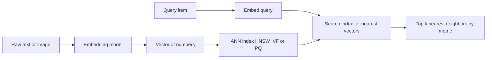

# Vector Databases

A **vector database** is a database built to answer one specific, modern question: *"Which stored items are most similar in meaning to this one?"* It is the storage engine behind semantic search, recommendation systems, and the retrieval step of AI chatbots. To understand it you first need the idea of an **embedding**; once that clicks, everything else similarity metrics, approximate search, and the tooling follows naturally. The companion notebook `01_vector_databases.ipynb` demonstrates the math and the major tools (FAISS, Chroma, Pinecone, Qdrant, pgvector).

## Why Traditional Databases Fall Short

The databases in the previous guides find data by **exact match** or **range**: "the row where `id = 42`", "users `BETWEEN` 25 and 30", "documents containing the word *neural*." That works when you know precisely what you are looking for. But it cannot answer questions of *meaning*. A search for "puppy" would miss a document about "young dogs," because the words don't match even though the concepts do.

Modern AI models solve this by converting data into **embeddings**.

## Embeddings Meaning as Geometry

An **embedding** is a list of numbers a **vector** that a trained model produces to represent the *meaning* of a piece of data (a sentence, an image, a sound). A typical embedding might have 384, 768, or 1536 numbers (its **dimension**). The crucial property is this:

> **Semantic similarity becomes geometric proximity.** Things that mean similar things get vectors that are *close together* in this high-dimensional space; unrelated things get vectors that are *far apart*.

The notebook illustrates it directly. The embedding for "dog" and the embedding for "puppy" point in nearly the same direction (a similarity near 0.99), while "dog" and "car" point in unrelated directions (a similarity near zero). The model has placed related concepts near each other in space. A vector database is simply a database optimized to store millions of these vectors and quickly find the ones nearest to a query vector.

## Measuring Similarity

To find the "nearest" vectors, you need a precise definition of *near*. The notebook covers the three standard metrics:

### Cosine Similarity

**Cosine similarity** measures the *angle* between two vectors, ignoring their length. It ranges from -1 (opposite) through 0 (unrelated) to 1 (identical direction). Because it ignores magnitude and focuses on direction, it is the default choice for **text embeddings**. Formally it is the dot product of the two vectors divided by the product of their lengths.

### Euclidean (L2) Distance

**Euclidean distance** is the straight-line distance between the two points (the everyday "how far apart" measured with the Pythagorean theorem extended to many dimensions). It ranges from 0 (identical) upward; *smaller means more similar*. It is common for **image embeddings**.

### Dot Product

The **dot product** multiplies corresponding numbers and sums them. When vectors are **normalized** to unit length, the dot product equals the cosine similarity so many systems normalize their vectors and then use the cheaper dot product. The notebook demonstrates all three on the dog/puppy/car example and confirms they agree on which pairs are similar.

A **normalized** vector is one scaled so its length is exactly 1, which makes cosine and dot-product equivalent and keeps comparisons consistent.

How a vector database performs similarity search from raw data to nearest neighbors:

## Nearest Neighbor Search

The task a vector database performs is **k-Nearest Neighbor (k-NN) search**: given a query vector, return the *k* stored vectors closest to it under the chosen metric.

The naive way **exact** k-NN compares the query against *every single stored vector*. That costs roughly *n × d* operations, where *n* is the number of vectors and *d* their dimension. As the notebook notes, for one million 768-dimensional vectors that is around 768 million operations *per query* far too slow for real-time use.

### Approximate Nearest Neighbor (ANN)

The solution is **Approximate Nearest Neighbor (ANN)** search: cleverly organized indexes that find *almost always* the true nearest neighbors, in a tiny fraction of the time, by not examining every vector. The small accuracy sacrifice (measured as **recall** the fraction of true neighbors actually returned) buys enormous speed. ANN is what makes billion-scale similarity search practical. The notebook explains the three foundational algorithms:

#### HNSW (Hierarchical Navigable Small World)

HNSW builds a **multi-layer graph** of the vectors. Upper layers are sparse, with long-range links for coarse, jump-across-the-space navigation; lower layers are dense, with short links for fine local search. A query enters at the top, zooms toward the right region, then refines downward. Search time grows only logarithmically with the number of vectors (≈ *O(log n)*), and recall can exceed 0.99. HNSW offers the best all-around speed/recall trade-off and is the default in most modern vector databases.

#### IVF (Inverted File Index)

IVF first **clusters** all vectors into groups (Voronoi cells) using k-means. At query time it searches only the few clusters nearest the query rather than the whole dataset. A parameter called `nprobe` controls how many clusters to check: more `nprobe` means higher recall but slower search. It is a tunable speed/accuracy dial.

#### PQ (Product Quantization)

PQ **compresses** vectors to save memory. It splits each vector into several sub-vectors and replaces each with a short code from a small learned codebook. This shrinks storage dramatically (the notebook shows the compression ratio), enabling billions of vectors to fit in memory, at the cost of some precision. IVF and PQ are often combined (IVF+PQ) for huge, memory-constrained datasets.

## The Tooling

The notebook surveys the main vector-search tools, from a bare library up to fully managed cloud services.

### FAISS The Library

**FAISS** (Facebook AI Similarity Search) is a high-performance *library*, not a server. You build an index object in your own program, add vectors, and search it. The notebook lists its index types, which directly map to the algorithms above:

- `IndexFlatL2` / `IndexFlatIP` **exact** brute-force search (L2 distance or inner product). Best for small datasets where perfect recall matters.
- `IndexIVFFlat` IVF clustering for faster approximate search on large datasets (must be `train`ed first; `nprobe` tunes recall).
- `IndexHNSWFlat` HNSW graph index, the best recall/speed trade-off.
- `IndexIVFPQ` IVF plus product quantization for memory-efficient billion-scale search.

FAISS can also run on GPUs and save/load indexes to disk. It is ideal for research and for embedding inside your own application, but it provides only the search no metadata storage, no server, no filtering.

### Chroma Local / Embedded

**Chroma** is a lightweight vector database aimed at prototyping and local development. Unlike raw FAISS, it stores your documents, their **metadata**, and their vectors together, and it can compute embeddings for you (e.g., via a sentence-transformers model). You create a **collection**, `add` documents with metadata and IDs, and `query` by text Chroma embeds the query, runs the similarity search, and returns the matched documents, their distances, and their metadata. It also supports **metadata filtering** (e.g., only documents where `topic` is `ml` or `dl`), narrowing results by structured attributes alongside the semantic match.

### Pinecone Managed Cloud

**Pinecone** is a fully **managed** service: you do not run any servers, you just call its API. You create an index (specifying the vector `dimension` and `metric`), `upsert` vectors with metadata, and `query` for the top-k matches. It adds production features such as **namespaces** (logical partitions within an index), metadata filtering, and **hybrid search** combining a dense semantic vector with a **sparse** keyword vector (BM25-style) so results respect both meaning *and* exact terms.

### Qdrant Open-Source, Self-Hostable or Cloud

**Qdrant** is an open-source vector database you can run yourself (e.g., via Docker) or use as a managed cloud service. You create a **collection** with a vector size and distance metric, `upsert` **points** (each an id, a vector, and a **payload** of metadata), and `search` with optional payload filters. Like Pinecone, it supports hybrid (sparse + dense) search through named vectors.

### pgvector Vectors Inside PostgreSQL

**pgvector** is an *extension* that adds a `vector` data type and similarity operators to the ordinary PostgreSQL relational database. This is powerful: you store embeddings in a normal column right alongside your structured data, and you search them with SQL. The notebook shows creating a `vector(384)` column, building an HNSW or IVFFlat index on it, and querying with distance operators `<=>` for cosine distance, `<->` for L2, `<#>` for negative inner product combined freely with regular `WHERE` clauses. For teams already running PostgreSQL who don't need billion-scale, this avoids adding a separate database entirely.

### Comparison

The notebook's comparison table summarizes the landscape:

| Feature | FAISS | Chroma | Pinecone | Weaviate | Qdrant | pgvector |
|---|---|---|---|---|---|---|
| Type | Library | Embedded | Managed | Open/Cloud | Open/Cloud | PG extension |
| Hosting | Local | Local | Cloud | Both | Both | Your DB |
| Metadata filter | No | Yes | Yes | Yes | Yes | Yes (SQL) |
| Hybrid search | No | No | Yes | Yes | Yes | Partial |
| Scale | Billions | Millions | Billions | Billions | Billions | Millions |
| Best for | Research | Prototyping | Production | Production | Production | Existing PG |

## Vector Databases in AI and RAG

The headline application is **Retrieval-Augmented Generation (RAG)**. Large language models have a fixed knowledge cutoff and cannot recall your private documents. RAG fixes this by giving the model relevant context at query time:

1. **Ingest** split your documents into chunks, embed each chunk, and store the vectors (plus the original text as metadata) in a vector database.
2. **Retrieve** when a user asks a question, embed the question and run a similarity search to fetch the few most relevant chunks.
3. **Generate** paste those chunks into the prompt alongside the question, so the model answers grounded in *your* data rather than its training memory.

The vector database is the "retrieve" engine. The same similarity-search capability also powers **semantic search** (search by meaning, not keywords), **recommendation systems** ("items similar to what you liked"), **deduplication**, and **clustering**. Picking the right **embedding model** matters as much as the database the notebook points to the MTEB leaderboard for comparing models.

## Summary

A vector database stores **embeddings** numeric vectors where geometric closeness means semantic similarity and finds the nearest ones to a query. **Cosine**, **Euclidean**, and **dot-product** metrics define "near." Exact search is too slow at scale, so **ANN** algorithms **HNSW** (graph), **IVF** (clustering), and **PQ** (compression) trade a little recall for huge speed. The tooling spans a raw library (**FAISS**), an embedded prototyping store (**Chroma**), managed and self-hosted servers (**Pinecone**, **Qdrant**, Weaviate), and an extension that bolts vectors onto a relational database (**pgvector**). Together they are the retrieval backbone of modern AI systems and especially of RAG.
