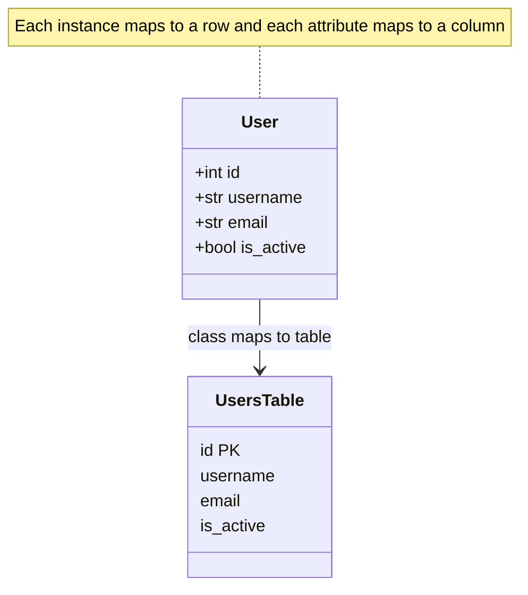

# ORM Object-Relational Mapping

An **ORM (Object-Relational Mapping)** is a tool that lets you work with a relational database using the objects and classes of your programming language, instead of writing raw SQL strings. It acts as a translator sitting between two different worlds: the world of **objects** (how application code naturally represents data) and the world of **tables and rows** (how a relational database stores it). This guide explains what that mapping is, why it is useful, and the core concepts models, sessions, relationships, the N+1 problem, and migrations through the lens of Python's SQLAlchemy, the focus of the companion notebook `01_orm.ipynb`.

## The Problem an ORM Solves

In `01_sql` you saw that talking to a database means writing SQL: `SELECT * FROM users WHERE id = ?`. In an object-oriented program, though, you think in terms of a `User` object with a `.username` and an `.email`. Constantly converting between these two mental models building SQL strings, sending them, and then unpacking the raw rows back into objects is tedious, repetitive, and error-prone. This gap between objects and tables is sometimes called the *object-relational impedance mismatch*.

An ORM closes the gap. As the notebook puts it, the difference is:

- **Without an ORM:** `cursor.execute("SELECT * FROM users WHERE id = ?", (1,))` you write SQL and handle raw rows.
- **With an ORM:** `session.get(User, 1)` you ask for a `User` object by its id, and get a fully-formed Python object back.

The ORM generates the SQL for you, sends it, and turns the result rows into objects automatically. You write your application in your language; the ORM speaks SQL on your behalf.

### Benefits and Trade-offs

**Benefits:** less boilerplate, code that reads in your application's vocabulary, automatic protection against SQL-injection attacks (values are safely parameterized), portability across different database engines (the same code can target SQLite or PostgreSQL), and a single place to define your data model.

**Trade-offs:** an abstraction layer hides what SQL is actually run, which can produce inefficient queries if you are not careful (the **N+1 problem**, discussed below), and very complex or highly tuned queries are sometimes still clearer in raw SQL. Good ORMs, including SQLAlchemy, therefore let you drop down to raw SQL when needed.

The notebook lists the main Python ORMs and their niches: **SQLAlchemy** (the flexible, powerful standard for production), **SQLModel** (SQLAlchemy combined with Pydantic, designed for FastAPI), **Tortoise ORM** (async-first), and the simpler **Peewee**, **Pony**, and **Django ORM**.

## Core Concept 1: Models

A **model** is a Python class that maps to a database table. Each **attribute** of the class maps to a **column** of the table, and each **instance** of the class (an object) maps to a **row**. Defining a model means describing your table's schema in Python.

How an ORM maps a Python class, its attributes, and its instances onto a table, columns, and rows:

In the notebook, models inherit from a `Base` class and use `mapped_column` to declare each column with its type and constraints for example, a `User` model with an `id` primary key, a `username` that is `unique`, an `email`, an `is_active` boolean with a default, and a `created_at` timestamp. This single class definition tells SQLAlchemy everything it needs: the table name, the columns, their types, and their constraints. Calling `Base.metadata.create_all(engine)` then issues the `CREATE TABLE` statements to actually build the tables you never write the DDL by hand.

The **engine** is the object that manages the actual connection to the database, created from a connection string like `sqlite:///:memory:` or a PostgreSQL URL.

## Core Concept 2: Sessions and the Unit of Work

You do not talk to the database directly through models; you go through a **session**. A session is a workspace that tracks the objects you are working with and the changes you make to them. It implements the **unit-of-work** pattern: you make a series of changes (add objects, modify them, delete them), and the session batches them up and writes them all at once when you `commit`.

The notebook's typical flow:

- `session.add(obj)` / `session.add_all([...])` stage new objects to be inserted.
- `session.flush()` push pending changes to the database *within the transaction* so that auto-generated values (like primary-key ids) become available, without yet finalizing.
- `session.commit()` permanently save all staged changes (ends the transaction).
- `session.delete(obj)` mark an object for deletion.

Because a session wraps a database transaction, it inherits the ACID guarantees from `01_sql`: either all the staged changes commit together or, on error, none do. The notebook uses sessions as context managers (`with SessionLocal() as session:`) so cleanup happens automatically.

### CRUD Through Objects

With a session, the four CRUD operations become natural Python:

- **Create** build an object (`User(username="alice", ...)`) and `add` it.
- **Read** build a query with `select(User)` and execute it; SQLAlchemy returns `User` objects. Helpers like `.scalars().all()` unpack them into a plain list.
- **Update** either change an object's attribute and commit, or issue a bulk `update(User).where(...).values(...)`.
- **Delete** `session.delete(obj)` or a bulk `delete(...)`.

The notebook also shows complex reads joins, `func.count` aggregation, `group_by`, `order_by` expressed through the ORM's query API, mirroring the SQL concepts from `01_sql` but written in Python.

## Core Concept 3: Relationships

The real power of an ORM is modeling the **relationships** between tables as ordinary object references. Instead of manually matching foreign keys, you declare a `relationship`, and the ORM lets you navigate from one object to its related objects directly. The notebook demonstrates the three classic relationship shapes:

- **One-to-many** one user has many posts. The `User` model has a `posts` attribute holding a list of `Post` objects; each `Post` has an `author` pointing back. They are linked by the `Post.user_id` foreign key. Accessing `user.posts` gives you the list of that user's posts as objects.
- **One-to-one** one user has one profile. Declared like one-to-many but with `uselist=False`, so `user.profile` is a single object, not a list.
- **Many-to-many** a post can have many tags and a tag can label many posts. This needs an intermediate **association table** (`post_tags`) holding pairs of foreign keys; the relationship uses `secondary=post_tags` so you can read and assign `post.tags` as a simple list.

Two important relationship options the notebook uses:

- **`back_populates`** keeps both sides of a relationship in sync (set `post.author` and `user.posts` updates automatically).
- **`cascade="all, delete-orphan"`** when you delete a user, their posts are deleted too, so you do not leave orphaned rows.

These declarations mean you traverse your data graph by following object attributes, and the ORM quietly issues the right SQL behind each access.

## Core Concept 4: The N+1 Problem and Eager Loading

The convenience of relationships hides a famous performance trap: the **N+1 problem**. Suppose you fetch all users (1 query), then loop over them printing each user's posts. By default the ORM is **lazy** it only fetches related posts when you actually touch `.posts`. So each of the N users triggers one *more* query for their posts: 1 + N queries total. With 1,000 users that is 1,001 database round-trips, and the application crawls.

The fix is **eager loading**: tell the ORM to fetch the related data up front, in just one or two queries. The notebook uses `selectinload(User.posts)` (and chains it to also load each post's tags) so that loading users and all their posts takes a fixed small number of queries no matter how many users there are. Recognizing and fixing N+1 is one of the most important practical ORM skills, because it is invisible until your data grows.

## SQLModel ORM Meets Validation

The notebook highlights **SQLModel**, which combines SQLAlchemy (the ORM) with **Pydantic** (a data-validation library). With one class definition you get both a database table model *and* a validated data schema for your web API. This is especially valuable in **FastAPI** applications: the same `User` class can describe the table, validate incoming request data, and shape the response using related classes like `UserCreate` (fields accepted when creating) and `UserResponse` (fields returned to clients) to control exactly what data crosses each boundary. It is the ORM idea extended to cover the whole journey of data through a web service.

## Migrations with Alembic

Your data model is never finished you add columns, rename tables, change constraints. But a live database already holds data, so you cannot just recreate the tables. A **migration** is a versioned, repeatable script that transforms the database's schema from one version to the next (and, ideally, back again). It is like version control for your database structure.

The notebook introduces **Alembic**, the migration tool built for SQLAlchemy. Its workflow:

- `alembic init` sets up the migration environment, pointed at your models' metadata.
- `alembic revision --autogenerate -m "..."` compares your current models to the live database and *generates* a migration script capturing the difference.
- Each migration has an `upgrade()` function (apply the change, e.g., `create_table`, `add_column`) and a `downgrade()` function (reverse it).
- `alembic upgrade head` applies all pending migrations; `alembic downgrade -1` rolls back one step; `alembic history` shows the chain of versions.

Migrations let a team evolve a shared schema safely, apply the exact same changes in development, staging, and production, and roll back if something goes wrong.

## Summary

An **ORM** bridges objects and relational tables so you can persist and query data in your own language instead of raw SQL. The pillars are: **models** (classes mapped to tables), **sessions** (transactional workspaces that batch and commit changes), and **relationships** (one-to-many, one-to-one, many-to-many navigated as object references). Watch for the **N+1 problem** and defeat it with **eager loading**. **SQLModel** fuses the ORM with validation for web APIs, and **Alembic** brings versioned **migrations** so your schema can evolve safely over time. An ORM does not replace understanding SQL it builds on it but it removes the repetitive translation work and lets you model data the way your application thinks about it.
