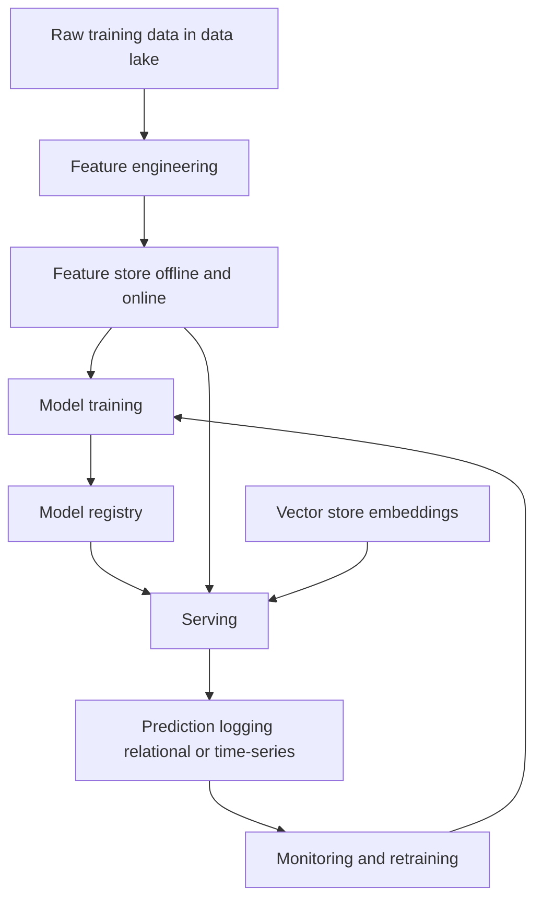

# Databases in AI/ML Systems

The previous guides each covered one *kind* of database. This guide is about how they all come together inside a real **machine-learning (ML) system**. Building a model is only a fraction of the work; the larger, ongoing challenge is managing the *data* around it where raw data lives, how features are stored and served, how experiments and models are tracked, and how predictions are logged and audited. Each of these roles is best served by a different type of database, and the art is wiring them together correctly. The companion notebook `01_databases_in_ai.ipynb` walks through feature stores, MLflow, prediction logging, and hybrid architectures.

## The ML Data Lifecycle

Data flows through a machine-learning system in a roughly repeating loop:

```
Raw Data → Feature Engineering → Feature Store → Training → Model Registry
                                                              ↓
Serving → Prediction Logging → Monitoring → Retraining Loop
```

How the data stores in an AI system fit together around training, serving, and logging:



At each stage, a different storage technology fits best. The notebook maps the stages to database types:

| Stage | Database type | Examples |
|---|---|---|
| Raw data storage | Data lake | S3, GCS, Azure Blob |
| Feature storage | Feature store | Feast, Hopsworks |
| Experiment tracking | SQLite / PostgreSQL | MLflow, Weights & Biases |
| Model artifacts | Object storage | S3, MLflow |
| Online predictions | Key-value + vector | Redis + Qdrant |
| Prediction logging | Time-series / relational | ClickHouse, PostgreSQL |
| Label storage | Relational | PostgreSQL |
| Model monitoring | Time-series | Prometheus, InfluxDB |

The key insight is that **no single database does all of this**. A production ML platform is a *collection* of databases, each chosen for the role it plays. A few new terms:

- A **data lake** is cheap, massive storage (typically cloud object storage like Amazon S3) that holds raw data of any format files, images, logs before it is processed.
- **Object storage** stores arbitrary files ("objects") by key; it is where large artifacts like trained model files naturally live.
- A **model registry** is a catalog of trained models and their versions, recording which model is in production, staging, or archived.

## Feature Stores

In ML, a **feature** is one measurable input the model learns from a user's age, their total number of purchases, their average order value. **Feature engineering** is the work of computing these features from raw data. A **feature store** is a centralized database dedicated to storing, serving, and managing features. The notebook explains the three problems it solves:

- **Training-serving consistency.** A subtle but devastating bug occurs when the code that computes features for training differs from the code that computes them in production. The model then sees differently-shaped data when serving than it learned from, and quietly degrades. A feature store defines each feature *once* and serves it to both training and production, guaranteeing they match.
- **Feature reuse.** Once "average purchase value" is defined, every team and every model can reuse it instead of re-implementing it.
- **Point-in-time correctness.** When building historical training data, you must use each feature's value *as it was at that moment in the past*, not its current value otherwise the model "sees the future" (a leak). A feature store retrieves point-in-time-correct historical features.

### Online vs Offline Stores

A feature store has two halves serving two very different needs:

| | Offline store | Online store |
|---|---|---|
| Purpose | Training and batch scoring | Real-time serving |
| Storage | Data warehouse (S3 + Parquet) | Low-latency DB (Redis, DynamoDB) |
| Latency | Minutes | Milliseconds |
| Data size | Billions of rows | Only the latest values |

The **offline store** holds the full history for building training sets; the **online store** holds just the freshest value of each feature in a fast key-value database so a live request can fetch features in milliseconds. The notebook demonstrates this with **Feast**, an open-source feature store: you define an **entity** (the thing features describe, e.g., a user), a **feature view** (a named group of features with a data source and a time-to-live), then `get_historical_features` for training and `get_online_features` for serving. The step that copies fresh feature values into the online store is called **materialization**.

## Experiment Tracking MLflow

Training a model is an experiment, and you run *many*: different algorithms, different hyperparameters (the configuration knobs like number of trees or learning rate), on different data. Without records you cannot tell which run produced the best model or reproduce it later. **Experiment tracking** is the practice of recording every run, and a tracking database stores it all.

The notebook uses **MLflow**, whose backend is an ordinary relational database **SQLite** for development or **PostgreSQL** for production. For each run you record:

- **Parameters** the configuration used (e.g., `n_estimators`, `max_depth`).
- **Metrics** the results (e.g., `accuracy`).
- **Artifacts** output files such as the trained model itself or a chart, stored in object storage.

MLflow groups runs into **experiments** and can register a trained model into its **model registry** with a version and a stage (Production, Staging). Later you load the current production model by name (`models:/IrisClassifier/Production`) without caring which exact run produced it. The relational database here is doing exactly what it does best: storing structured, queryable records of every experiment.

## Logging Predictions to a Database

Once a model is live, you should record every prediction it makes. **Prediction logging** matters for monitoring (is the model still healthy?), debugging (why did it say *that*?), auditing/compliance, and gathering data to retrain on. The notebook builds a simple logging schema in SQLite with two tables:

- A `predictions` table storing, for each request, a unique `request_id`, the user, the model name and version, the input data (as JSON), the prediction, its confidence, the latency, and a timestamp.
- A `feedback` table linked to `predictions` by foreign key, recording the *true* label once it becomes known and whether the prediction was correct.

This is a textbook relational design from `01_sql`: two tables linked by a foreign key, with the kind of structured fields you will want to query and aggregate (the notebook groups predictions by model to compute average confidence and latency). Storing the input as a JSON string is a pragmatic touch flexible, semi-structured data living inside a relational column. At very high volume this logging often moves to a **time-series** or **columnar** database (ClickHouse, InfluxDB) built for fast writes and time-based analytics.

## Hybrid Architecture: Relational + Vector

The most important architectural pattern for AI applications combines a **relational database** (for structured metadata and access control) with a **vector database** (for fast similarity search). Neither alone is enough: the vector database finds semantically similar items but is weak at structured constraints and permissions; the relational database enforces structure and security but cannot search by meaning. The notebook's pattern wires them together:

1. **Store in both, linked by id.** When a document is added, its metadata (title, author, category, access level) goes into PostgreSQL, and its embedding goes into a vector store (Qdrant, or pgvector right inside PostgreSQL). The shared document `id` links the two.
2. **Search in two stages.** A `hybrid_search` first runs a fast **ANN** similarity search in the vector store to get candidate ids (over-fetching a bit), then queries PostgreSQL to filter those candidates by structured rules here, an **access-control** check so users only see documents they are allowed to. The final result is both *semantically relevant* and *authorized*.

This split vectors for "what is similar," relational for "what is allowed and structured" is the backbone of production semantic-search and RAG systems (see `03_vector_db`). The notebook also notes that pgvector lets you collapse both halves into a single PostgreSQL database when scale permits, doing the similarity search and the SQL filtering in one query.

## Summary

A machine-learning system is not powered by one database but by a coordinated set of them, each matched to a stage of the **ML data lifecycle**. **Data lakes** and **object storage** hold raw data and model artifacts; a **feature store** (with its **offline** and **online** halves) guarantees training-serving consistency and millisecond feature serving; a **relational** database backs **experiment tracking** (MLflow) and **model registries**; **prediction logging** captures every inference for monitoring and retraining; and a **hybrid relational + vector** architecture marries semantic similarity search with structured filtering and access control. Knowing *which* database to use *where* and how to link them by shared keys is the core skill of building data infrastructure for AI.
