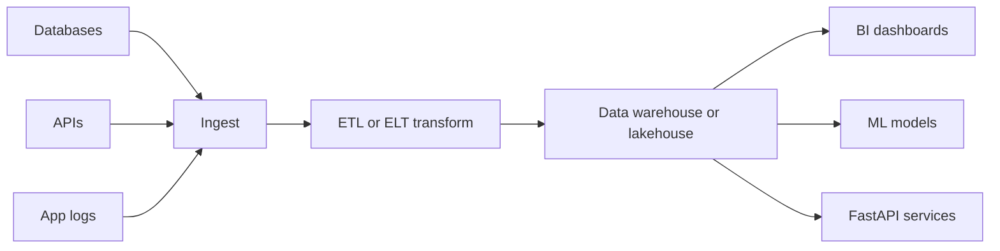
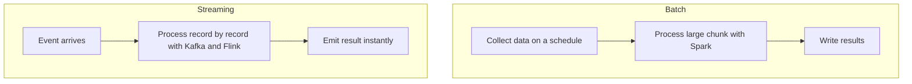

# Data Engineering for ML

**Data engineering** is the discipline of moving, cleaning, reshaping, and delivering data reliably and at scale, so that analysts and machine-learning models receive trustworthy data in the form they need. A model is only as good as the data feeding it, and before any data reaches a model it usually travels through a **pipeline** an automated series of steps that pull data from sources, transform it, and load it into a destination. This guide explains the foundational ideas (ETL vs ELT, batch vs streaming, the modern data stack) and the major tools Spark, Kafka, dbt, Airflow, Delta Lake covered in the companion notebook `01_data_engineering.ipynb`.

## What a Data Pipeline Is

A **data pipeline** is a sequence of automated steps that takes data from one or more **sources** (databases, APIs, application logs), processes it, and delivers it to a **destination** (a warehouse, a dashboard, a model). The two classic orderings of these steps are ETL and ELT.

A data pipeline from sources through ingestion and transformation to the warehouse and downstream consumers:



### ETL vs ELT

Both acronyms describe Extract, Transform, and Load the difference is the *order* of the last two steps, which has large practical consequences.

| Approach | Order | When to use |
|---|---|---|
| **ETL** | Extract → **Transform** → Load | Older warehouse era; transform data *before* loading it, into clean structured tables |
| **ELT** | Extract → Load → **Transform** | Cloud era; load raw data first into cheap storage, then transform it *in place* |

- In **ETL**, you clean and reshape the data *before* it lands in the warehouse. The warehouse only ever holds processed data. This was standard when storage and compute were expensive and warehouses were rigid.
- In **ELT**, you load the *raw* data straight into a cheap, scalable store (a data lake or a modern cloud warehouse) first, and transform it later, in place, using the warehouse's own power. This is now dominant because cloud storage is cheap and you keep the raw data forever, free to re-transform it differently as needs change.

A **data warehouse** is a database optimized for analytics (large reads, aggregations) rather than transactions; a **data lake** is cheap storage holding raw data of any format.

## The Modern Data Stack

The notebook sketches the layers of a contemporary data platform data flowing left to right:

```
Sources        Ingestion        Storage          Transform      Serve
─────────────────────────────────────────────────────────────────────
Databases  →  Kafka/Airbyte →  S3/GCS         →  dbt/Spark  →  BI/ML
APIs       →  Fivetran      →  Snowflake       →  Spark SQL  →  FastAPI
App logs   →  Logstash      →  Iceberg/Delta   →  Flink      →  Dashboards
```

Each column is a job: **ingest** data in, **store** it cheaply and reliably, **transform** it into useful shapes, and **serve** it to consumers. The tools below fill these roles.

## Batch vs Streaming

A second fundamental distinction is *when* data is processed:

- **Batch processing** handles data in large chunks on a schedule for example, "every night, process yesterday's orders." It is simpler and efficient for large historical computations. **Spark** is the workhorse here.
- **Stream processing** handles data continuously, record by record, as it arrives for example, "score each transaction for fraud the instant it happens." It powers real-time use cases. **Kafka** (with stream processors like Flink) is the backbone here.

Batch processing versus stream processing contrasted by how and when data flows through:



Many systems use both: streaming for fresh, low-latency needs and batch for heavy historical reprocessing.

## Apache Spark Distributed Batch Processing

When data is too big to fit on one machine, **Apache Spark** spreads the work across a cluster of many machines. It is the standard engine for large-scale data transformation. The notebook covers its key concepts:

- **RDD (Resilient Distributed Dataset)** Spark's low-level abstraction: an immutable collection of data split ("partitioned") across the cluster, automatically rebuilt if a machine fails ("resilient").
- **DataFrame** a higher-level, structured view of data with named columns, much like a pandas DataFrame but distributed across many machines. This is what you usually work with.
- **Lazy evaluation** Spark does *not* run your transformations as you write them. It records them as a plan (a **DAG**, Directed Acyclic Graph, of steps) and only executes when you call an **action** that actually needs a result (e.g., showing or writing data). This lets it optimize the whole chain.
- **Catalyst optimizer** the component that automatically rewrites your query plan into an efficient one before running it.

The notebook's Spark example reads a CSV from cloud storage, then chains lazy **transformations** filtering rows, adding computed columns (`withColumn`), removing duplicates, filling missing values followed by **aggregations** (`groupBy` with `count`, `avg`, median). It also shows Spark's **SQL interface**: you can register a DataFrame as a temporary view and query it with ordinary SQL. Finally it builds an **ML pipeline** with Spark MLlib (Spark's machine-learning library), chaining feature steps and a classifier, and writes results back to storage as **Parquet** (an efficient columnar file format), optionally **partitioned** by a column for faster later reads.

### Spark vs Pandas

| | Pandas | Spark |
|---|---|---|
| Data size | Must fit in RAM | Petabytes across a cluster |
| Execution | Eager (runs immediately) | Lazy (builds a plan) |
| API | Simpler | More verbose |
| SQL | Partial | Full SQL |
| Streaming | No | Yes (Structured Streaming) |

The rule of thumb: pandas for data that fits on one machine, Spark when it does not.

## Apache Kafka Event Streaming

**Apache Kafka** is a distributed platform for **event streaming** moving continuous streams of records between systems in real time. It is the central nervous system of streaming pipelines. The notebook explains its core concepts:

- **Topic** a named stream of records, like a feed or category (e.g., `ml.predictions`).
- **Partition** a topic is split into partitions so many machines can process it in parallel; records are strictly ordered *within* a partition.
- **Offset** the position of a record within a partition, so consumers know where they are.
- **Producer** a program that writes records into a topic.
- **Consumer** and **consumer group** programs that read records; a consumer group shares the work of a topic among its members so each record is processed once by the group.
- **Broker** a Kafka server that stores and serves the messages.

Kafka also lets you tune **delivery guarantees** via the producer's `acks` setting, trading speed against safety: `acks=0` (fire and forget, fastest, possible loss), `acks=1` (the lead replica confirms, the default), `acks=all` (every replica confirms, slowest, no loss). The notebook's example shows a producer publishing each ML prediction to a topic and a consumer reading them downstream to log and monitor with manual offset commits for stronger processing guarantees. Stream processors like **Kafka Streams** and **Apache Flink** sit on top to compute real-time aggregations (e.g., predictions per model per minute, alerts when confidence drops).

## dbt Transformation as Engineered SQL

**dbt (data build tool)** brings software-engineering discipline to the *transform* step of ELT. Once raw data is loaded into a warehouse, dbt lets you define transformations as **SQL models** each model is a `SELECT` query saved as a file that produces a table or view. Its value, the notebook explains, is in what it adds around the SQL:

- **Version control** models are files, so they live in Git like any code.
- **Dependency management** models reference each other (`ref('other_model')`), and dbt figures out the correct build order automatically.
- **Testing** you declare expectations (a column is `unique`, `not_null`, within an `accepted_range`) and dbt verifies them against the real data.
- **Documentation** generated automatically from your model definitions.
- **Materialization** each model can be a lightweight `view` or a physical `table`, chosen per model.

The notebook shows a staging model that cleans raw predictions and a downstream "mart" model that aggregates daily performance, plus a schema file declaring tests and docs. dbt turns a tangle of ad-hoc SQL scripts into a tested, documented, dependency-aware analytics codebase.

## Delta Lake ACID Transactions on Data Lakes

A plain data lake (files in S3) is cheap and scalable but lacks the guarantees of a real database: no transactions, no easy updates, no history. **Delta Lake** is a storage layer that adds database-like features *on top of* data-lake files, giving you the best of both. The notebook highlights:

- **ACID transactions** the same atomicity/consistency/isolation/durability guarantees from `01_sql`, now on lake storage, so concurrent writes don't corrupt data.
- **Time travel** query the data *as it was* at an earlier version or timestamp (`versionAsOf`, `timestampAsOf`), invaluable for reproducing a training run or auditing.
- **Merge / upsert** update existing rows and insert new ones in a single operation (`whenMatchedUpdateAll` / `whenNotMatchedInsertAll`), something raw files can't do.
- **Vacuum** clean up old data files past a retention window.
- **History** inspect the full change log of a table.

**Apache Iceberg** (named alongside it) is a competing open **table format** with similar goals. These formats are what make modern data lakes ("lakehouses") reliable enough to build on.

## Airflow Pipeline Orchestration

Individual pipeline steps must run in the right order, on a schedule, with retries and alerts when something fails. **Orchestration** is the job of coordinating them, and **Apache Airflow** is the leading tool. In Airflow you define a **DAG (Directed Acyclic Graph)** a graph of **tasks** with dependencies between them, where "acyclic" means the dependencies never loop back. The notebook's example builds an ML training pipeline DAG:

- Each step (extract features, validate data, train, evaluate, deploy) is a **task** created with an **operator** (a `PythonOperator` runs Python; a `BashOperator` runs a shell command).
- **Dependencies** are declared with `>>` (`extract >> validate >> train >> evaluate >> deploy`), telling Airflow each task waits for the previous one.
- The DAG has a **schedule** (`@daily`), automatic **retries** with delays, and failure **alerts** by email.
- **Jinja templating** (`{{ ds }}`) injects runtime values like the run date into commands.

Airflow ensures the whole pipeline runs reliably, in order, on time, and notifies you when it doesn't. **Prefect** is a more modern, Python-native alternative mentioned alongside it.

## Data Quality Great Expectations

Bad data silently ruins models, so pipelines must *validate* data, not just move it. **Data quality** checks assert that data meets expectations before it is used. The notebook demonstrates the idea both with **Great Expectations** (a dedicated validation framework) and with a hand-written validator that checks training data for: no nulls in critical columns, values within sensible ranges (age 0-150, label is 0 or 1), no duplicate ids, and acceptable class balance. Catching these issues at the pipeline stage prevents corrupt data from reaching the model a far cheaper failure than discovering it in production.

## The Data Engineering Stack at a Glance

The notebook's summary maps each tool to its role:

| Tool | Category | Use case |
|---|---|---|
| Apache Spark | Processing | Large-scale batch transformations |
| Apache Kafka | Streaming | Real-time event pipelines |
| Apache Flink | Streaming | Stateful stream processing |
| dbt | Transform | SQL-based modeling, testing, docs |
| Airflow / Prefect | Orchestration | Scheduled DAG pipelines |
| Delta Lake / Iceberg | Storage | ACID and table formats on data lakes |
| Great Expectations | Quality | Data validation |
| Fivetran / Airbyte | Ingestion | ELT connectors |

## Summary

Data engineering is the plumbing that delivers trustworthy data to models. The foundational choices are **ETL vs ELT** (transform before or after loading) and **batch vs streaming** (scheduled chunks vs continuous flow). **Spark** handles distributed batch processing with lazy-evaluated DataFrames; **Kafka** moves real-time event streams through topics, partitions, and consumer groups; **dbt** engineers the transform step into tested, version-controlled SQL; **Delta Lake** brings ACID transactions and time travel to data lakes; **Airflow** orchestrates the whole thing as scheduled, retrying DAGs; and **Great Expectations** validates quality along the way. Together these tools build the reliable, scalable pipelines that every serious ML system depends on.
