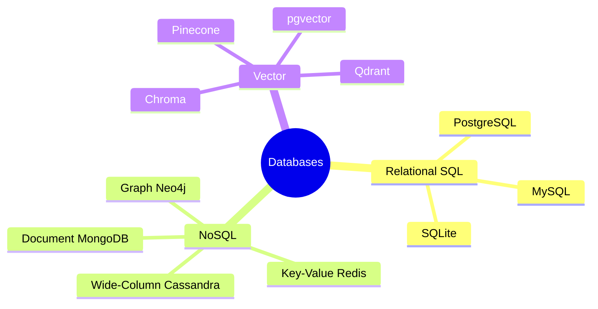

# Databases

A **database** is an organized collection of data that a computer program can store, search, update, and retrieve in a reliable and efficient way. The software that manages a database that creates it, enforces its rules, answers questions about it, and keeps it safe from corruption is called a **database management system (DBMS)**. In everyday speech people often say "database" to mean both the data and the system that manages it.

This section is the map for everything that follows. It explains what a database actually is, why software systems use one instead of plain files, the major families of databases (relational, non-relational, and vector), and how the six sub-topics in this folder fit together into a single picture.

## What a Database Is, Concretely

Imagine you are building any real application an online store, a chat app, a machine-learning service. You immediately have data you must keep: users, their orders, their messages, the predictions your model made. You could write that data into ordinary files on disk. That works for a weekend, but it falls apart quickly:

- **Searching is slow.** Finding "all orders by Alice over $50" means reading every file line by line.
- **Concurrent access is dangerous.** If two parts of your program write the same file at the same moment, one overwrites the other and data is lost.
- **Crashes corrupt data.** If the power fails halfway through writing, you are left with a half-written, broken file.
- **There are no rules.** Nothing stops you from saving an order with no customer, or a price of "banana".

A database management system exists to solve exactly these problems. It gives you:

- **Persistence** data survives after the program stops or the machine reboots.
- **Efficient retrieval** special data structures called **indexes** let you find records in milliseconds even among billions.
- **Concurrency control** many users can read and write at once without corrupting each other's work.
- **Integrity rules** the database can refuse data that violates constraints you define (no duplicate emails, no negative prices).
- **Querying** a structured way to ask questions of the data and get exactly the slice you want.

A **query** is simply a request for data, written in a query language the database understands. "Give me the five most recent orders for user 42" is a query.

## Core Vocabulary

These terms appear throughout every sub-topic, so it is worth defining them once here. (Each is also defined again in context where it first matters.)

- **Schema** the blueprint of the data: what fields exist, what type each holds (text, number, date), and what rules apply. A schema is to data what a floor plan is to a building.
- **Record** one item of data, such as one user or one order. In relational databases a record is a **row**; in document databases it is a **document**.
- **Field / attribute** one named piece of a record, such as a user's email or age. In a relational table a field is a **column**.
- **Key** a value that identifies or links records. A **primary key** uniquely identifies one record; a **foreign key** points from one record to another.
- **Index** an auxiliary data structure that makes lookups fast, the way the index at the back of a book lets you jump to a topic without reading every page.
- **Transaction** a group of operations treated as a single all-or-nothing unit, so the data is never left half-changed.
- **Embedding** a list of numbers (a vector) that captures the *meaning* of a piece of data such as a sentence or image; this is the foundation of vector databases.

## The Three Families of Databases

Databases are usually grouped into three broad families. They are not competitors so much as different tools, and serious systems often use several at once.

### 1. Relational (SQL) Databases

A **relational database** organizes data into **tables** grids made of **rows** (records) and **columns** (fields). Tables are linked to one another through keys, so that an `orders` table can reference the `users` table without copying the user's details into every order. You interact with relational databases using **SQL** (Structured Query Language). The defining strengths are a **fixed schema** (every row in a table has the same columns) and **strong consistency guarantees** through transactions. Examples: PostgreSQL, MySQL, SQLite.

Use them when your data is well-structured, when relationships between entities matter, and when correctness (e.g., financial balances) is non-negotiable.

### 2. Non-Relational (NoSQL) Databases

**NoSQL** ("Not Only SQL") is an umbrella for databases that deliberately abandon the rigid table model to gain flexibility, scale, or speed. They come in several sub-types:

- **Document stores** (MongoDB) keep data as flexible JSON-like documents that can vary from record to record.
- **Key-value stores** (Redis) act like a giant dictionary: give a key, get a value, extremely fast.
- **Column-family / wide-column stores** (Cassandra) spread enormous, write-heavy datasets across many machines.
- **Graph databases** (Neo4j) store data as nodes and the connections between them, ideal for networks like social graphs.

Use them when your schema changes often, when you need to scale writes across many servers, or when your data is naturally a document, a cache, or a network of relationships.

### 3. Vector Databases

A **vector database** is a newer family built specifically for artificial intelligence. AI models turn text, images, or audio into **embeddings** vectors of numbers where *closeness in space means closeness in meaning*. A vector database stores millions of these vectors and answers a brand-new kind of question: "find the items whose meaning is most similar to this one." This is **similarity search**, and it powers semantic search, recommendations, and Retrieval-Augmented Generation (RAG) for chatbots. Examples: Pinecone, Qdrant, Chroma, and the pgvector extension for PostgreSQL.

### Side-by-Side Comparison

| Dimension | Relational (SQL) | NoSQL | Vector |
|---|---|---|---|
| Data shape | Rows in fixed-column tables | Documents, key-values, graphs, wide columns | High-dimensional numeric vectors |
| Schema | Fixed, enforced up front | Flexible or schema-less | Vectors of a fixed dimension + metadata |
| Core question | "Which rows match these exact conditions?" | "Fetch/scale this flexible data fast" | "Which items are *most similar* in meaning?" |
| Query language | SQL | Varies (Mongo query, CQL, commands) | Similarity search API |
| Typical strength | Correctness, relationships, transactions | Scale, flexibility, speed | Semantic / approximate matching |
| Example tools | PostgreSQL, MySQL, SQLite | MongoDB, Redis, Cassandra | Pinecone, Qdrant, Chroma, pgvector |

## 7. Graph Databases

Graph databases store data as nodes (entities) and edges (relationships) with properties on both. They excel at queries that traverse relationships, especially when the depth is variable or unknown: find all friends-of-friends, detect fraud rings, traverse a knowledge graph.

Neo4j is the dominant graph database. Its query language Cypher uses ASCII art pattern matching: MATCH (a:Person)-[:KNOWS]->(b:Person) WHERE a.name = "Alice" RETURN b. This is more natural than SQL JOINs for relationship traversal.

When to choose a graph database: many-to-many relationships are the core query pattern, traversal depth varies (social networks, org charts, supply chains), fraud detection (finding connected suspicious accounts), knowledge graphs in RAG systems.

NetworkX (Python library) provides in-memory graph computation: centrality measures, community detection, shortest paths, and PageRank, useful for prototyping before moving to Neo4j.

## 8. Time Series Databases

Time series databases optimize for the write patterns and query patterns of time-stamped data: very high write throughput (thousands of data points per second), efficient range queries by time, automatic downsampling and retention policies, and columnar compression for historical data.

TimescaleDB extends PostgreSQL with hypertables (automatic time-based partitioning), continuous aggregates (maintained materialized views), and compression policies. You keep all of SQL while getting time series performance.

InfluxDB uses its own line protocol and query language (Flux/InfluxQL), optimized for IoT and monitoring. Prometheus is the standard for scraping application metrics, typically paired with Grafana for visualization.

For ML monitoring: store model predictions, latency, and feature distributions as time series to detect drift over time.

A taxonomy of the three database families and their sub-types:

## How the Sub-Topics Fit Together

The six folders in this section build from the foundations up to complete AI data systems. Read them in order:

1. **`01_sql`** The relational model from scratch: tables, rows, columns, keys, the CRUD operations (Create, Read, Update, Delete), joining tables together, summarizing data with aggregation, speeding things up with indexes, organizing data cleanly with normalization, and guaranteeing correctness with ACID transactions. This is the bedrock; nearly every system has a relational database at its core.

2. **`02_nosql`** When and why to step outside the relational model. Covers the four main NoSQL types (document, key-value, column-family, graph) plus search, and the trade-offs captured by the **CAP theorem** that govern distributed databases.

3. **`03_vector_db`** Embeddings and similarity search, the mathematics of "closeness" (cosine, Euclidean, dot product), Approximate Nearest Neighbor (ANN) algorithms that make billion-scale search fast, and the tooling (FAISS, Chroma, Pinecone, Qdrant, pgvector) used in AI applications and RAG.

4. **`04_orm`** **Object-Relational Mapping**: how application code talks to a relational database using ordinary programming-language objects instead of raw SQL strings, illustrated through SQLAlchemy concepts, relationships, the N+1 problem, and database migrations.

5. **`05_db_in_ai`** How all of the above come together inside a machine-learning system: feature stores, experiment-tracking databases, prediction logging, model registries, and hybrid architectures that combine relational and vector databases.

6. **`06_data_engineering`** The pipelines that move and reshape data at scale before it reaches a model: ETL vs ELT, batch vs streaming, and the big-data tools (Spark, Kafka, dbt, Airflow, Delta Lake) that build them.

## The Big Picture

No single database is "best." A mature application typically runs a **relational** database for its core records (users, orders, labels), a **key-value** store like Redis for caching and sessions, a **vector** database for semantic search, and a **data-engineering** pipeline feeding all of them. Understanding each family what it is good at, what it sacrifices, and how to query it is the goal of this section. Everything that follows is a deeper look at one piece of that puzzle.
