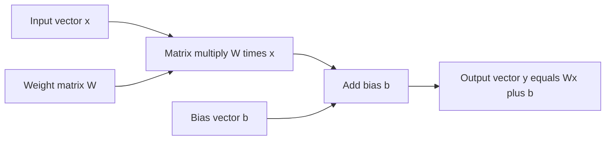
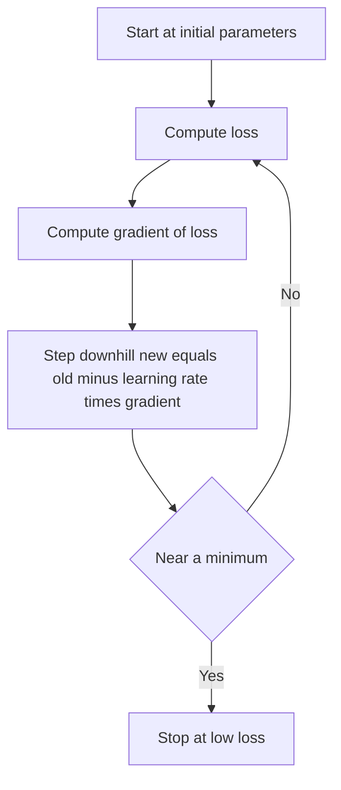
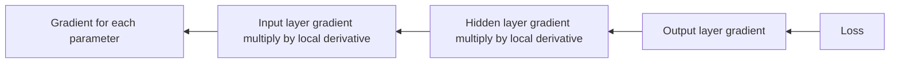
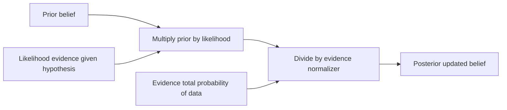
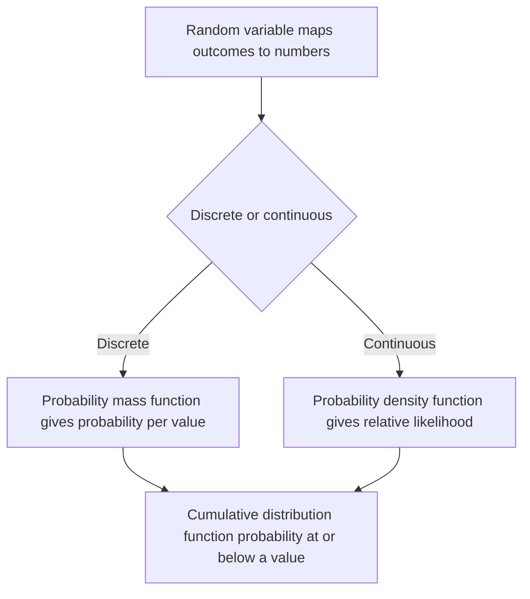
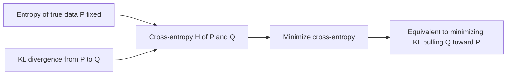
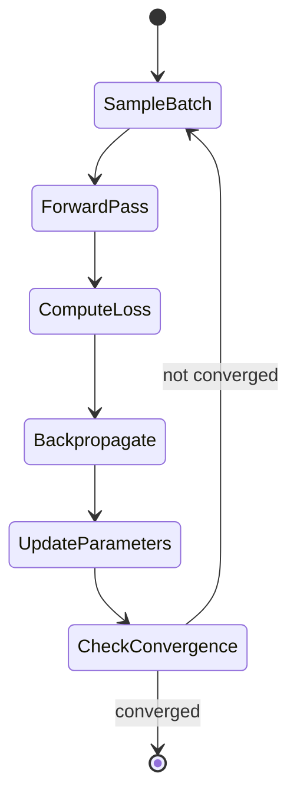

# Mathematics for AI and Machine Learning

Machine learning is, underneath all the libraries and jargon, applied mathematics. A model is a mathematical function with adjustable numbers inside it; *training* a model is the mathematical process of nudging those numbers until the function behaves the way we want. Four branches of math do almost all the work:

- **Linear algebra** is the language we use to *represent* data and models. Images, text, weights, and embeddings are all arrays of numbers, and almost every operation a model performs is a multiplication or transformation of those arrays.
- **Calculus** is the *engine of learning*. It tells us, for any small change in a model's numbers, whether the model gets better or worse and in which direction to move.
- **Probability** is how we *reason under uncertainty*. Real data is noisy and incomplete, and a model's output is best understood as a guess with a confidence attached.
- **Statistics** is how we *draw trustworthy conclusions from data* deciding whether an improvement is real or just luck, and estimating quantities we cannot observe directly.

Two more specialized branches complete the picture:

- **Information theory** gives us the *loss functions* that measure how wrong a model's predictions are (cross-entropy, KL divergence).
- **Optimization** is the *recipe* that uses calculus's directions to actually search for the best settings (gradient descent, Adam).

This guide builds each of these from absolute scratch defining every term as it appears and explains the *intuition* behind the formulas rather than their derivations. The six notebooks in this folder (`01_linear_algebra.ipynb` through `06_optimization.ipynb`) contain runnable demonstrations of every idea below, and are referenced lightly throughout.

---

## Part 1 Linear Algebra: The Language of Data

Linear algebra is the study of *vectors* and the *linear transformations* that act on them. In ML it is everywhere: every weight matrix, every word embedding, every attention score, and every dimensionality-reduction step is linear algebra. Think of it as the grammar that lets us describe data and models compactly.

### 1.1 The Ladder of Objects: Scalars, Vectors, Matrices, Tensors

These four objects differ only in how many dimensions (axes) of numbers they hold:

| Object | Dimensions | Plain description | Example in ML |
|---|---|---|---|
| **Scalar** | 0 | A single number | A learning rate, a loss value |
| **Vector** | 1 | An ordered list of numbers | A data point's features; a word embedding |
| **Matrix** | 2 | A grid (rows × columns) of numbers | A weight layer; a batch of data points |
| **Tensor** | 3+ | A multi-axis array | A color image (height × width × channels); a batch of images |

A **vector** of length $n$ lives in "$n$-dimensional space" (written $\mathbb{R}^n$): it can be pictured as an arrow from the origin to a point, or simply as a row of $n$ numbers. A **matrix** with $m$ rows and $n$ columns is written $\mathbb{R}^{m \times n}$. A **tensor** is the general term for an array of any number of axes the word that gives *TensorFlow* its name. In `01_linear_algebra.ipynb`, the first cell constructs one of each and prints its shape, showing how the objects stack up the dimensionality ladder.

### 1.2 Basic Operations

- **Addition** of two vectors (or two matrices of the same shape) is done **element-wise**: line them up and add corresponding entries.
- **Scalar multiplication** stretches or shrinks a vector: multiply every entry by the same number.
- The **Hadamard (element-wise) product** multiplies two equal-shaped arrays entry by entry. This is *not* the same as matrix multiplication, and confusing the two is a classic source of bugs.

### 1.3 The Dot Product and Matrix Multiplication

The **dot product** of two vectors multiplies their entries pairwise and sums the results, producing a single number. It has a beautiful geometric meaning: it equals the lengths of the two vectors multiplied by the cosine of the angle between them. In words, *the dot product measures how much two vectors point in the same direction*:

- Large positive → the vectors are aligned.
- Zero → the vectors are perpendicular (unrelated).
- Negative → they point in opposing directions.

Dividing the dot product by the two vectors' lengths gives the **cosine similarity**, the standard way ML systems measure how "similar" two embeddings are.

**Matrix multiplication** generalizes this: each entry of the result is the dot product of a row from the first matrix with a column from the second. Its key properties:

- It is **associative** and **distributive** but **not commutative** $AB$ and $BA$ are generally different.
- The transpose of a product reverses the order: $(AB)^T = B^T A^T$.

Matrix multiplication is the single most important operation in ML: a neural network's **linear layer** computes $y = Wx + b$, where $W$ is a weight matrix, $x$ the input vector, and $b$ a bias. The notebook simulates exactly this forward pass.

How a neural network linear layer combines a vector and matrix operations into one forward pass:

### 1.4 Transpose, Inverse, Determinant

- The **transpose** flips a matrix across its diagonal, turning rows into columns. It appears constantly in backpropagation, where gradients flow "backward" through transposed weight matrices.
- The **inverse** $A^{-1}$ is the matrix that "undoes" $A$ (their product is the identity matrix $I$, which leaves vectors unchanged). A matrix is invertible only if its determinant is non-zero. In practice we rarely compute inverses explicitly solving the system $Ax = b$ directly (as the notebook does with `np.linalg.solve`) is faster and numerically safer.
- The **determinant** is a single number summarizing a matrix. Geometrically it is the **volume-scaling factor** of the transformation: a determinant of 2 doubles areas/volumes; a determinant of 0 collapses space onto a lower dimension (and signals non-invertibility). Determinants reappear in normalizing-flow models, which must track how probability volume is stretched.

### 1.5 Rank, Trace, Norms

- **Rank** is the number of genuinely independent directions a matrix spans the count of rows (or columns) that are not just combinations of the others. A "full-rank" matrix wastes no dimensions. Low rank is the basis of compression techniques like **LoRA** (efficient fine-tuning).
- **Trace** is the sum of the diagonal entries. A handy fact: the trace equals the sum of a matrix's eigenvalues (defined below).
- **Norms** measure the "size" or "length" of a vector:
  - **L2 (Euclidean) norm**: the straight-line length square the entries, sum, take the square root.
  - **L1 (Manhattan) norm**: the sum of absolute values distance walked along a grid.
  - **L∞ norm**: simply the largest absolute entry.
  - The **Frobenius norm** is the L2 norm applied to a whole matrix (treating it as one long vector).

Norms power **regularization**, which discourages a model from using overly large weights: penalizing the L2 norm gives **Ridge** regression, penalizing the L1 norm gives **Lasso** (which also drives many weights exactly to zero, performing feature selection).

### 1.6 Eigenvalues and Eigenvectors

For a square matrix $A$, an **eigenvector** is a special direction that the matrix only *stretches*, never *rotates*: applying $A$ to it yields the same vector scaled by a number. That scaling number is the **eigenvalue**. The defining relation is $Av = \lambda v$ ("$A$ times the eigenvector equals lambda times the eigenvector").

Intuitively, eigenvectors reveal the natural axes of a transformation, and eigenvalues tell you how strongly the transformation acts along each. Useful facts: the sum of eigenvalues equals the trace; their product equals the determinant; a symmetric matrix has real eigenvalues and perpendicular eigenvectors.

Why ML cares:

- The **covariance matrix** of a dataset (which directions vary most) is eigendecomposed to perform **PCA** (below).
- The eigenvalues of the **Hessian** (a calculus object) describe the *curvature* of a loss surface whether we're in a valley, on a ridge, or at a saddle.

### 1.7 Singular Value Decomposition (SVD)

Eigen-decomposition only works for square matrices; **SVD** works for *any* matrix. It factors a matrix into three pieces: $A = U \Sigma V^T$, where $U$ and $V$ hold perpendicular "singular vectors" and $\Sigma$ is a diagonal list of **singular values** sorted from largest to smallest. Each singular value measures how much "energy" the matrix carries along a corresponding direction.

The magic is **low-rank approximation**: keep only the few largest singular values and you reconstruct a close approximation of the original matrix using far less information. The **Eckart-Young theorem** guarantees this truncation is the *best possible* approximation of that size. This single idea underlies:

- **Dimensionality reduction** and data compression,
- **Recommender systems** (factoring a user-item ratings matrix),
- **Latent Semantic Analysis** in NLP,
- The **pseudo-inverse**, which "solves" systems that have no exact solution.

In `01_linear_algebra.ipynb`, the SVD cell compresses an 8×8 digit image by keeping only $k = 1, 2, 4, 8$ singular values, visibly trading detail for compactness.

### 1.8 Principal Component Analysis (PCA)

PCA finds the directions along which data varies the most and re-expresses the data using just those few directions. The recipe: **center** the data (subtract the mean), compute the **covariance matrix**, **eigendecompose** it, and **project** onto the top-$k$ eigenvectors (the "principal components"). Each component's eigenvalue tells you the fraction of total variance it captures (the "explained variance ratio"). PCA turns out to be equivalent to running SVD on the centered data. The notebook performs PCA on the Iris flower dataset by hand and cross-checks against scikit-learn.

### 1.9 Span, Basis, Linear Independence, Orthogonality

- **Linear independence**: a set of vectors is independent if none of them can be built from the others. Independent vectors each contribute a genuinely new direction.
- **Span**: all the points you can reach by scaling and adding a set of vectors.
- **Basis**: a minimal independent set that spans a whole space a coordinate system. The standard basis is the familiar set of "one-hot" axis vectors.
- **Orthogonality**: two vectors are orthogonal if their dot product is zero (perpendicular). An **orthonormal** set is orthogonal *and* unit-length the cleanest possible coordinate system. The **Gram-Schmidt** procedure (implemented in the notebook) turns any independent set into an orthonormal one.

### 1.10 How Linear Algebra Powers ML At a Glance

| Concept | ML role |
|---|---|
| Matrix multiplication | Neural-network forward pass $y = Wx + b$ |
| Transpose | Gradient flow in backpropagation |
| Dot product | Attention scores; similarity search |
| Eigendecomposition | PCA, spectral clustering, curvature analysis |
| SVD / low rank | Recommenders, LSA, LoRA fine-tuning |
| Norms | L1/L2 regularization |
| Linear systems | Linear regression's normal equations |

The notebook closes by implementing scaled-dot-product **attention** (the core of Transformers) and simulating **LoRA**, showing a 512×512 weight matrix approximated by rank-8 factors using only ~3% of the parameters.

---

## Part 2 Calculus: The Engine of Learning

If linear algebra describes *what* a model is, calculus describes *how it learns*. Training means minimizing a **loss** (a number measuring how wrong the model is), and calculus tells us which way to adjust each parameter to make that number smaller. Without calculus there is no gradient descent and no backpropagation.

### 2.1 Limits and Continuity

A **limit** captures what a function's output approaches as its input creeps toward some value. A function is **continuous** if it has no sudden jumps you can draw it without lifting the pen. This matters because the learning machinery requires functions to be *differentiable* (smooth enough to have a slope). Some popular activations, like **ReLU**, have a kink at zero where the slope is undefined; in practice we substitute a "subgradient" there and move on.

### 2.2 Derivatives

The **derivative** of a function measures its **instantaneous rate of change** the slope of the line that just grazes the curve at a point. A positive derivative means the function is rising; negative means falling; zero means flat (a peak, valley, or plateau). Rather than memorizing differentiation rules, the key intuition for ML is: *the derivative tells you how the output responds to a tiny wiggle in the input.*

ML relies on the derivatives of its **activation functions** the small nonlinear functions applied inside neurons. A pleasant property of the **sigmoid** is that its derivative can be written using the sigmoid's own output; **ReLU** has the simplest possible derivative (0 for negative inputs, 1 for positive). The notebook plots these activations next to their derivative curves.

### 2.3 Partial Derivatives

Real models depend on millions of parameters at once. A **partial derivative** isolates one of them: it asks "if I wiggle *this one* number while holding all others fixed, how does the loss change?" Computing the partial of the loss with respect to each weight and bias is precisely what lets us update them. The notebook works through the partials of the mean-squared-error loss for a simple line $\hat{y} = wx + b$ and uses them to fit the line via gradient descent.

### 2.4 The Gradient

The **gradient** collects *all* the partial derivatives into a single vector. Geometrically it points in the direction of **steepest ascent** the way to increase the function fastest. Therefore its *negative* points toward the steepest *descent*, which is exactly the direction we want when minimizing a loss.

This gives the heart of all learning, the **gradient-descent update**: *new parameters = old parameters − (learning rate) × gradient*. The **learning rate** is a small positive number controlling step size. Repeating this nudges the parameters downhill toward a minimum. The notebook animates a descent across a bowl-shaped surface, overlaying the path on a contour map.

Gradient descent stepping down a loss surface by repeatedly moving opposite the gradient:

### 2.5 The Jacobian

When a function takes a vector in and produces a vector out, its derivatives form a grid called the **Jacobian** every output's sensitivity to every input. It is the best *local linear approximation* of the function. For a linear layer $y = Wx$, the Jacobian is simply the weight matrix $W$, neatly tying calculus back to linear algebra.

### 2.6 The Hessian

The **Hessian** is the matrix of *second* derivatives the rate of change of the gradient itself. It describes **curvature**: whether the loss surface bends up like a bowl (its eigenvalues are all positive → a minimum), down like a dome (all negative → a maximum), or both ways at once (mixed signs → a **saddle point**). Full Hessians are too large to compute for big networks, which is why we lean on first-order (gradient-only) methods.

### 2.7 The Directional Derivative

This generalizes the derivative to *any* chosen direction, not just the coordinate axes. It is largest along the gradient, most negative directly opposite it, and zero when you move along a "level curve" where the function's value doesn't change confirming the gradient is genuinely the direction of steepest change.

### 2.8 The Chain Rule The Heart of Backpropagation

The **chain rule** tells you how to differentiate functions nested inside functions: the overall rate of change is the *product* of the rates of change at each stage. A neural network is exactly such a deep nesting layer after layer feeding into the next. **Backpropagation** is nothing more than the chain rule applied systematically from the loss backward to every parameter, reusing intermediate results so the whole sweep is efficient. As the notebook puts it bluntly: *that's all backprop is.* The accompanying demo wires up a two-layer network on the XOR problem and writes out every backward step by hand.

How the chain rule propagates gradients backward through a nested network during backpropagation:

### 2.9 Taylor Series

A **Taylor series** approximates a complicated function near a point using a sum of increasingly fine correction terms built from its derivatives a straight-line guess, then a curvature correction, and so on. This underlies **Newton's method** (which uses curvature for faster optimization), analyses of the Adam optimizer, and various theoretical tools. The notebook shows successive Taylor approximations closing in on a sine curve.

### 2.10 Integration

**Integration** is the reverse of differentiation: it accumulates a quantity over a range, computing the **area under a curve**. In probability and ML it expresses continuous probabilities, **expectations** (averages weighted by probability), KL divergence, and the VAE training objective. When integrals have no closed form, **Monte Carlo integration** approximates them by random sampling a technique that recurs in probability below.

### 2.11 Automatic Differentiation

Modern frameworks never compute derivatives by hand or by crude numerical approximation; they use **automatic differentiation (autograd)**. As the model runs, the framework records a **computation graph** of every operation, then traverses it in **reverse** to compute exact gradients. Reverse mode is favored in ML because it is efficient precisely when there are many inputs (parameters) but a single output (the scalar loss). Calling `.backward()` in PyTorch triggers exactly this reverse traversal, which the notebook demonstrates against hand-derived partials.

---

## Part 3 Probability: Reasoning Under Uncertainty

Every ML prediction is really a statement about uncertainty "80% likely a cat." Probability is the mathematics of quantifying and combining such uncertainty, and it forms the backbone of models from Naive Bayes to diffusion.

### 3.1 Sample Spaces, Events, and the Axioms

- The **sample space** is the set of all possible outcomes of an experiment (e.g. {heads, tails}).
- An **event** is any subset of outcomes we care about.
- A **probability** assigns each event a number obeying **Kolmogorov's axioms**: probabilities are never negative, the whole sample space has probability 1, and the probability of mutually exclusive events adds up.

The notebook simulates repeated coin flips whose running estimate of P(heads) converges to 0.5 a hands-on glimpse of the Law of Large Numbers.

### 3.2 Conditional Probability

The **conditional probability** $P(A \mid B)$ is the probability of $A$ *given that we already know* $B$ happened. It rescales the world to the cases where $B$ holds. This is the foundation of learning from evidence: a spam filter updates its belief that an email is spam given the words it contains.

### 3.3 Bayes' Theorem

**Bayes' theorem** is the rule for flipping a conditional probability around going from "probability of evidence given a hypothesis" to "probability of the hypothesis given the evidence." Its four named pieces:

- **Prior**: belief before seeing evidence.
- **Likelihood**: how well the hypothesis explains the evidence.
- **Evidence**: how probable the data is overall (a normalizing total).
- **Posterior**: updated belief after seeing evidence.

The notebook's medical-test example delivers the classic lesson: even a 95%-accurate test for a rare disease yields only a ~16% chance of actually being sick after one positive result, because the disease's rarity (a low prior) dominates. Feeding a second positive test back in as the new prior raises it to ~78% **Bayesian updating** in action. Bayes underlies Naive Bayes classifiers, Bayesian neural networks, and **MAP estimation** (Part 4).

How Bayes theorem combines a prior and likelihood through the evidence to yield the posterior:

### 3.4 Independence

Two events are **independent** if knowing one tells you nothing about the other (their joint probability is just the product of the individuals). **Conditional independence** independence once a third variable is known is the simplifying assumption that makes the Naive Bayes classifier tractable.

### 3.5 Random Variables and Their Distributions

A **random variable** maps outcomes to numbers (e.g. the number of heads in three flips). Its behavior is captured by a **distribution**:

- For **discrete** variables, a **probability mass function (PMF)** gives the probability of each value.
- For **continuous** variables, a **probability density function (PDF)** gives relative likelihood, with actual probabilities obtained by integrating over a range.
- The **cumulative distribution function (CDF)** gives the probability of being at or below a value, for either type.

How a random variable is described by a distribution depending on whether it is discrete or continuous:

### 3.6 The Major Distributions

The notebook catalogs the distributions every ML practitioner should recognize:

| Distribution | Type | Models | ML use |
|---|---|---|---|
| **Bernoulli** | discrete | A single yes/no trial | Binary labels |
| **Binomial** | discrete | Count of successes in $n$ trials | A/B test counts |
| **Multinomial** | discrete | Counts across several categories | Multi-class outputs |
| **Poisson** | discrete | Rare-event counts in a window | Event/arrival modeling |
| **Normal (Gaussian)** | continuous | The familiar bell curve | Noise, weights, the CLT |
| **Uniform** | continuous | All values equally likely | Initialization, sampling |
| **Exponential** | continuous | Waiting times | Survival/timing models |
| **Beta** | continuous | A probability between 0 and 1 | Conjugate prior for Bernoulli |
| **Gamma** | continuous | Positive quantities | Conjugate prior for Poisson rate |
| **Dirichlet** | continuous | A distribution over distributions | Topic models (LDA) |
| **Student's t** | continuous | Bell curve with heavy tails | Small-sample inference |
| **Multivariate Normal** | continuous | Correlated bell curve in many dims | GMMs, Gaussian processes, VAE latents |

The **Gaussian** deserves special emphasis: it is the default assumption for noise and for the spread of estimates, for reasons the Central Limit Theorem makes clear.

### 3.7 Expectation, Variance, Covariance, Correlation

- **Expectation** is the long-run average value of a random variable its "center of mass." A crucial property, **linearity of expectation**, says the expectation of a sum is the sum of the expectations, always.
- **Variance** measures spread: the average squared distance from the mean. Its square root is the **standard deviation**, in the same units as the data.
- **Covariance** measures whether two variables move together (positive), apart (negative), or independently (near zero).
- **Correlation** is covariance rescaled to lie between −1 and +1, making it interpretable regardless of units.
- The **covariance matrix** packages all pairwise covariances of a vector and is always symmetric the very object PCA eigendecomposes.

### 3.8 Joint, Marginal, and Conditional Distributions

A **joint** distribution describes several variables together. **Marginalizing** sums or integrates out the variables you don't care about to recover one variable's distribution alone. **Conditioning** zooms into the slice where some variables are fixed. These operations describe a VAE's encoder $q(z \mid x)$ and decoder $p(x \mid z)$.

### 3.9 The Central Limit Theorem (CLT)

The **CLT** is one of the most consequential results in all of statistics: *the average of many independent random quantities tends toward a Normal distribution, no matter what shape the originals had.* This is why the bell curve appears everywhere, why we can assume Gaussian noise, and why a mini-batch gradient (an average over examples) behaves approximately normally. The notebook draws sample means from uniform, exponential, and Bernoulli sources and watches them all converge to the same bell curve.

### 3.10 The Law of Large Numbers and Monte Carlo

The **Law of Large Numbers** guarantees that averaging more samples drives the estimate toward the true mean. **Monte Carlo methods** exploit this directly: to estimate a hard quantity (an integral, an expectation), draw random samples and average them. The notebook estimates $\pi$ by darts-in-a-circle and computes expectations by sampling. Monte Carlo and its refinement **importance sampling** power policy-gradient reinforcement learning and variational inference in VAEs.

---

## Part 4 Statistics: Drawing Trustworthy Conclusions

Where probability reasons *forward* from assumptions to outcomes, statistics reasons *backward* from observed data to the underlying truth. It answers the questions every ML practitioner faces: Is model B actually better than model A, or did it just get lucky? How confident should I be in this accuracy number?

### 4.1 Descriptive Statistics

These summarize a dataset in a few numbers:

- **Central tendency** where the data sits: the **mean** (average, but easily dragged by outliers), the **median** (the middle value, robust to outliers), and the **mode** (the most frequent value).
- **Spread** how dispersed the data is: the **variance** and **standard deviation**, the **interquartile range** (the middle 50%, robust), and the **mean absolute deviation**.
- **Shape** **skewness** (asymmetry: a long right tail is positive skew) and **kurtosis** (tail heaviness; a Normal has zero excess kurtosis, heavy tails are positive).

A subtle but important point the notebook stresses is **Bessel's correction**: when estimating variance from a *sample*, dividing by $n-1$ instead of $n$ corrects a systematic underestimate, giving an **unbiased** estimate. The demo generates skewed income-like data and shows the mean pulled toward outliers while the median holds steady.

### 4.2 Descriptive vs Inferential Statistics

| | Descriptive | Inferential |
|---|---|---|
| **Goal** | Summarize the data you have | Generalize to data you don't have |
| **Scope** | The sample itself | The whole population |
| **Tools** | Mean, variance, plots | Estimation, confidence intervals, hypothesis tests |
| **Question** | "What does this data look like?" | "What can I conclude about the world?" |

**Sampling** is the bridge: we observe a sample and hope it represents the larger population. The reliability of every inference depends on the sample being representative and large enough.

### 4.3 Point Estimation: MLE and MAP

To **estimate** a model's parameters from data, two principles dominate:

- **Maximum Likelihood Estimation (MLE)** chooses the parameters that make the observed data *most probable*. Because multiplying many probabilities is awkward, we maximize the **log-likelihood** (turning products into sums). A profound connection: for classification, *MLE is exactly equivalent to minimizing cross-entropy loss* tying statistics directly to Part 5.
- **Maximum A Posteriori (MAP)** estimation adds a **prior** belief about the parameters via Bayes' theorem, maximizing likelihood *plus* prior. This formalizes **regularization**: a Gaussian prior on the weights produces **L2 (Ridge)** penalty, and a Laplace prior produces **L1 (Lasso)** penalty. The notebook fits logistic regression with and without regularization, showing the unregularized (pure-MLE) weights blow up while the MAP weights stay small.

### 4.4 Confidence Intervals

A **confidence interval** is a range of plausible values for an unknown quantity, with a stated confidence level (commonly 95%). The correct, frequentist interpretation is subtle and worth getting right: *if we repeated the whole experiment many times, 95% of the intervals we constructed would contain the true value.* It is **not** a 95% probability that this *particular* interval contains the truth.

### 4.5 Hypothesis Testing

Hypothesis testing is a formal procedure for deciding whether an observed effect is real or could plausibly be chance:

1. State a **null hypothesis** (H₀: "no effect") and an **alternative** (H₁: "there is an effect").
2. Pick a **significance level** $\alpha$ (commonly 0.05) the risk of a false alarm you'll tolerate.
3. Compute a **test statistic** and its **p-value** the probability of seeing data at least this extreme *if the null were true*.
4. If the p-value is below $\alpha$, **reject the null**.

Two kinds of mistakes are possible:

| | Truth: no effect | Truth: real effect |
|---|---|---|
| **Test says effect** | Type I error (false positive, rate $\alpha$) | Correct |
| **Test says no effect** | Correct | Type II error (false negative, rate $\beta$) |

The **power** of a test is $1 - \beta$: its ability to detect a real effect.

### 4.6 Common Statistical Tests

The notebook runs each on an ML scenario:

- **One-sample t-test** is one mean different from a target (e.g. accuracy above 90%)?
- **Two-sample (Welch's) t-test** do two groups have different means (Model A vs Model B)?
- **Chi-square test** are two categorical variables independent?
- **One-way ANOVA** do three or more groups differ (comparing several algorithms)?
- **Mann-Whitney U** a non-parametric (no Normality assumption) rank-based comparison of two groups.

### 4.7 Effect Size and Its Pitfalls

A p-value tells you *whether* an effect is real; the **effect size** tells you *how big* it is. With enough data, a trivially small difference can be "statistically significant" yet practically meaningless. Measures like **Cohen's d** (standardized mean difference) and **r²** (fraction of variance explained) quantify magnitude. The lesson for ML: a 0.01% accuracy gain across a million examples may be significant but not worth shipping always report effect size alongside significance.

### 4.8 Multiple Testing Correction

Run 100 tests at $\alpha = 0.05$ and you expect ~5 false positives by pure chance. To control this, **Bonferroni correction** tightens the threshold by dividing $\alpha$ by the number of tests (simple but conservative), while the **Benjamini-Hochberg** procedure controls the *false discovery rate* more powerfully. This matters whenever we screen many features or model variants.

### 4.9 Bootstrap Methods

The **bootstrap** estimates the uncertainty of *any* statistic by **resampling the data with replacement** thousands of times and observing how the statistic varies. It needs no formula and no distributional assumptions, making it ideal for awkward statistics like a median or an AUC. The notebook builds a 95% confidence interval for model accuracy by resampling 5,000 times and reading off the 2.5th and 97.5th percentiles.

### 4.10 Bayesian Inference

Rather than producing a single estimate, **Bayesian inference** treats parameters as random variables and computes a full **posterior distribution** over them: posterior ∝ likelihood × prior. **Conjugate priors** (such as Beta paired with Bernoulli) keep the math clean by making the posterior the same family as the prior. The notebook updates a Beta prior over a click-through rate after observing 30 clicks in 100 trials, yielding a posterior with a **credible interval** the Bayesian analogue of a confidence interval, and one with the intuitive "95% probability the value is in here" interpretation. This thinking powers Bayesian neural networks, Gaussian processes, Thompson sampling, and Bayesian hyperparameter optimization.

---

## Part 5 Information Theory: Measuring Surprise and Loss

Information theory, founded by Claude Shannon in 1948, quantifies *information*, *uncertainty*, and *surprise*. In ML it supplies the loss functions that train classifiers and generative models, the splitting criterion for decision trees, and the tools to measure how distributions differ.

### 5.1 Self-Information (Surprisal)

The **self-information** of an outcome is how *surprised* you should be to see it: rare events carry more information than common ones. It is defined as the negative logarithm of the outcome's probability. A guaranteed event (probability 1) carries zero information; a one-in-a-thousand event carries a lot. Information from independent events simply adds.

### 5.2 Entropy

**Entropy** is the *average* surprisal of a random variable the expected amount of information per observation, and equivalently a measure of **uncertainty**. A fair coin has maximum entropy (you learn a full bit per flip); a heavily biased coin has low entropy (the outcome is nearly known in advance); a certain outcome has zero entropy. Key facts: entropy is never negative, and a **uniform** distribution (all outcomes equally likely) has the *highest* possible entropy. The notebook plots the binary-entropy curve, which peaks when a coin is perfectly fair.

### 5.3 Joint, Conditional Entropy, and Mutual Information

- **Joint entropy** measures the combined uncertainty of two variables.
- **Conditional entropy** $H(Y \mid X)$ measures the uncertainty left in $Y$ once $X$ is known and learning $X$ can never *increase* uncertainty about $Y$.
- **Mutual information** $I(X;Y)$ measures how much knowing one variable reduces uncertainty about the other their shared information. It is zero exactly when the variables are independent. Mutual information drives **feature selection** (keep features that share information with the target), the **information bottleneck** principle, and **contrastive learning** methods like SimCLR.

### 5.4 KL Divergence

The **Kullback-Leibler (KL) divergence** $D_{KL}(P \| Q)$ measures how different one probability distribution $P$ is from another $Q$ the extra surprise incurred by using $Q$ to describe data that truly follows $P$. It is always non-negative, zero only when the distributions match exactly, and **asymmetric** ($P$ vs $Q$ is not the same as $Q$ vs $P$), so it is *not* a true distance. KL is the regularizing term in **variational autoencoders** (pulling the latent distribution toward a standard Normal), the constraint in policy-optimization methods like **PPO/TRPO**, and the objective in **knowledge distillation**. The notebook demonstrates the asymmetry explicitly and plots the VAE's KL term bottoming out when the latent spread matches the target.

### 5.5 Cross-Entropy The Workhorse Loss

**Cross-entropy** $H(P, Q)$ measures the average surprise of using a model's predicted distribution $Q$ to encode outcomes that actually follow the true distribution $P$. A beautiful identity makes it the natural loss: cross-entropy equals the (fixed) entropy of the data *plus* the KL divergence between truth and model. Since the data's entropy can't be changed, **minimizing cross-entropy is the same as minimizing KL divergence** pulling the model's predictions toward the truth.

This is why **cross-entropy loss** is the standard objective for classification: it is large when the model is confidently wrong and small when it is confidently right. Its two-class special case is **binary cross-entropy**. The notebook verifies that a hand-built softmax-plus-cross-entropy matches PyTorch's built-in loss.

The identity linking entropy, KL divergence, and cross-entropy that makes minimizing cross-entropy equivalent to minimizing KL:

### 5.6 Jensen-Shannon Divergence

The **Jensen-Shannon divergence (JSD)** is a *symmetric, bounded* cousin of KL: it compares each distribution to their average. The original **Generative Adversarial Network (GAN)** objective is, at its optimum, minimizing the JSD between the real-data distribution and the generator's distribution.

### 5.7 Information Gain in Decision Trees

**Information gain** is the reduction in entropy achieved by splitting data on a feature exactly the mutual information between the feature and the label. **Decision trees** greedily choose the split that maximizes information gain (an alternative impurity measure is the **Gini index**). The notebook computes mutual-information scores for the Iris features and shows a tree choosing to split first on petal length.

### 5.8 Bits vs Nats, and the ML Map

The choice of logarithm base sets the *unit* of information: base-2 gives **bits** (natural for compression), while the natural log gives **nats** (preferred in ML for cleaner derivatives). PyTorch's cross-entropy is reported in nats. A summary of where these ideas land in ML:

| Concept | ML role |
|---|---|
| Cross-entropy / BCE | Classification and language-model loss |
| KL divergence | VAE regularizer, policy optimization, distillation |
| Entropy | Exploration bonuses, uncertainty |
| Information gain / MI | Decision-tree splits, feature selection |
| Jensen-Shannon | Original GAN objective |
| Perplexity ($2^{H}$) | Language-model quality (lower is better) |

---

## Part 6 Optimization: Searching for the Best Model

Everything so far converges here. Training a model means **minimizing a loss function** $L(\theta)$ over its parameters $\theta$. Calculus supplies the gradient (the downhill direction); optimization is the set of algorithms that follow it intelligently to reach a good minimum. Many of deep learning's breakthroughs have been, at heart, better optimizers.

The training optimization loop that repeatedly evaluates the loss, computes gradients, and updates parameters until convergence:

### 6.1 Convex vs Non-Convex Landscapes

A function is **convex** if it is bowl-shaped a straight line between any two points on its graph never dips below the curve. Convex problems are the easy case: there is a *single* minimum, and gradient descent is guaranteed to find it. Linear regression's mean-squared-error and logistic regression's loss are convex.

Neural-network loss surfaces are **non-convex**: rugged terrains with many local minima, flat plateaus (where gradients vanish and learning stalls), sharp cliffs (where gradients explode), and abundant **saddle points** (flat in some directions, sloped in others). A reassuring insight from high-dimensional geometry: saddle points, not bad local minima, are the main obstacle and most minima a network finds turn out to have similar, good loss. The random noise in stochastic training actually helps escape saddles.

### 6.2 Gradient Descent and Its Stochastic Variants

- **Batch gradient descent** computes the gradient over the *entire* dataset before each step accurate but slow on large data.
- **Stochastic gradient descent (SGD)** uses a *single* random example per step cheap and noisy, and that noise helps escape poor regions.
- **Mini-batch gradient descent** (the practical default) averages the gradient over a small batch (often 32-512 examples), balancing the stability of batch GD with the speed and helpful noise of SGD.

The **learning rate** is the critical knob: too large and the steps overshoot and diverge; too small and training crawls. The notebook visualizes convex and non-convex surfaces and numerically confirms convexity via the second derivative.

### 6.3 Momentum

Plain SGD can zig-zag down narrow valleys. **Momentum** fixes this by accumulating a running "velocity" of past gradients like a ball rolling downhill that builds speed in consistent directions and damps out oscillations. **Nesterov accelerated gradient** refines this further by evaluating the gradient at a "look-ahead" position, giving faster convergence.

### 6.4 Adaptive Methods: RMSprop and Adam

Different parameters may need different step sizes. **RMSprop** gives each parameter its own adaptive learning rate by dividing its step by a running average of its recent squared gradients shrinking steps where gradients have been large (to avoid overshooting) and growing them where gradients have been small (to avoid stalling).

**Adam** the most widely used optimizer in deep learning combines momentum (a running average of gradients) with RMSprop's per-parameter scaling (a running average of squared gradients), plus a "bias correction" to fix the cold-start when these averages begin at zero. **AdamW**, which cleanly separates weight decay from the adaptive step, is the default for training Transformers like BERT and GPT. The notebook implements SGD, Momentum, RMSprop, and Adam from scratch and races their trajectories across the notoriously curved Rosenbrock surface.

### 6.5 Learning-Rate Schedules

Rather than a fixed learning rate, it usually helps to *change* it over training: start with a brief **warmup** (small steps while the model stabilizes), then **decay** it (step decay, exponential decay, or smooth **cosine annealing**) so early steps explore boldly and later steps settle precisely. The **1Cycle** policy (ramp up then down) and **cyclical** schedules can speed convergence and help escape poor regions. The notebook plots six such schedules side by side.

### 6.6 Second-Order Methods

These use curvature (the Hessian), not just the gradient. **Newton's method** converges very fast but requires inverting the Hessian utterly infeasible for models with billions of parameters. **L-BFGS** cleverly approximates this for small-to-medium problems, and the **natural gradient** (using the Fisher information matrix) underpins reinforcement-learning methods like TRPO. In mainstream deep learning, first-order methods win on scalability.

### 6.7 Constrained Optimization

Sometimes we must optimize subject to **constraints** (e.g. weights summing to one). **Lagrange multipliers** handle equality constraints by folding them into the objective, and the **Karush-Kuhn-Tucker (KKT) conditions** generalize this to inequality constraints. The classic ML application is the **Support Vector Machine**, whose margin-maximizing training is a constrained optimization problem solved through KKT.

### 6.8 Practical Optimization Tips

The notebook closes with the techniques that make training actually work:

- **Gradient clipping** caps the size of gradients to prevent the "exploding gradient" instability common in RNNs and Transformers.
- **Gradient accumulation** simulates a large batch under tight memory by summing gradients over several small batches before updating.
- **Weight initialization** matters enormously: starting all weights at zero prevents learning entirely, while too-large random weights cause activations to explode. Principled schemes **Xavier/Glorot** initialization for sigmoid/tanh networks and **He/Kaiming** for ReLU networks keep signal magnitudes stable across layers. The demo forward-propagates through several ReLU layers and shows only He initialization keeping activation spread healthy.
- **Batch normalization** smooths the loss landscape, allowing higher learning rates and faster, more stable convergence.

---

## How It All Fits Together

These six areas are not separate subjects but one continuous pipeline:

1. **Linear algebra** represents the data and the model every layer is a matrix multiplication.
2. **Probability** frames the model's output as a distribution and motivates the loss.
3. **Information theory** turns that probabilistic goal into a concrete number to minimize cross-entropy, which is exactly the **maximum-likelihood** objective from **statistics**.
4. **Calculus** computes the gradient of that loss with respect to every parameter, via the chain rule (backpropagation).
5. **Optimization** follows those gradients through Adam, learning-rate schedules, and good initialization to find parameters that make the loss small.
6. **Statistics** then tells us whether the trained model is *genuinely* better than the alternatives, or merely lucky.

A recurring thread ties them tightly: **maximum likelihood** (statistics) *is* **minimizing cross-entropy / KL divergence** (information theory), which is carried out by **gradient descent** (optimization) using gradients from **calculus** over operations expressed in **linear algebra**, all in the service of **reasoning under uncertainty** (probability). Master these foundations and the rest of machine learning becomes a matter of assembling familiar pieces. The six notebooks in this folder turn every concept above into runnable, visual code work through them alongside this guide to make the intuition concrete.
