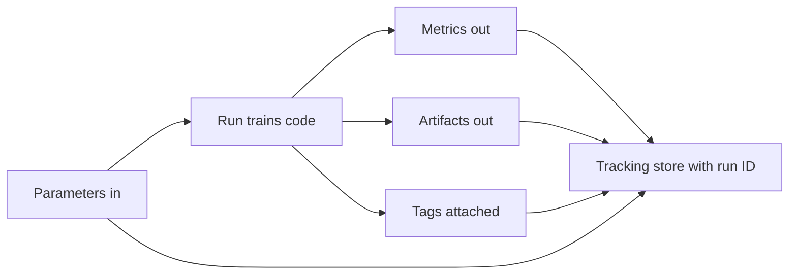

# Experiment Tracking

When you build a machine learning model, you rarely build just one. You build hundreds: a model with 100 trees, then one with 200 trees, then one with a different learning rate, then one trained on cleaned data, then one with an extra feature. Each of these attempts is an **experiment**, and a single run of training code is called a **run**. Without discipline, the results of all these runs live in your head, in scattered notebook cells, and in filenames like `model_final_v2_REAL_use_this.pkl`. A week later you cannot answer the most basic question in machine learning: *which settings produced my best model, and can I reproduce it?*

**Experiment tracking** is the practice and the tooling of automatically recording everything about each run so that this question always has an answer. It is the foundation of MLOps (the discipline of operating machine learning systems reliably in production). This guide teaches the concepts behind experiment tracking and the two tools the notebooks use to demonstrate them: **MLflow** (`01_mlflow.ipynb`) and **Weights & Biases**, abbreviated **W&B** (`02_wandb.ipynb`).

## The Core Vocabulary

Every tracking tool, regardless of vendor, is built from the same handful of objects. Learn these once and you understand all of them.

| Term | Definition | Everyday analogy |
|------|------------|------------------|
| **Experiment** / **Project** | A named container that groups together all the runs working toward one goal (e.g. `diabetes_prediction`). | A folder for one science fair project. |
| **Run** | A single execution of your training code, with all of its recorded data. | One trial of an experiment, written up in a lab notebook page. |
| **Parameter** (param) | An *input* configuration value you chose before training a hyperparameter like `n_estimators=100` or `learning_rate=0.001`. Set once, never changes during the run. | The dial settings you chose on a machine. |
| **Metric** | A *numeric result* measured during or after training loss, accuracy, RMSE. Can be logged repeatedly over time (per epoch). | The readings on the machine's gauges. |
| **Artifact** | Any *output file* the run produces: the trained model, a plot, a CSV, a config file. | The physical objects your experiment produced. |
| **Tag** | A free-form key-value label attached to a run (`developer="alice"`, `model_type="random_forest"`) for filtering and organizing. | Sticky notes on the notebook page. |

The mental model is simple: **a run takes parameters in, and produces metrics and artifacts out, all under the umbrella of an experiment, annotated with tags.**

The flow of a single tracked run from inputs to stored outputs:

## MLflow

MLflow is an open-source platform for managing the whole machine learning lifecycle. It is organized into four components, though experiment tracking uses mainly the first.

| Component | What it does |
|-----------|--------------|
| **MLflow Tracking** | Logs parameters, metrics, artifacts, and code for each run. |
| **MLflow Projects** | Packages ML code into a reusable, reproducible form. |
| **MLflow Models** | A standard on-disk format for packaging a trained model. |
| **Model Registry** | A central store for managing a model's lifecycle (covered in `05_model_registry`). |

### How tracking works in practice

The basic pattern is to wrap your training code in a *run context*. You name an experiment, open a run, and inside it log whatever you want. In `01_mlflow.ipynb`, the `rf_baseline` run shows the full loop: it calls `log_param` to record `n_estimators`, `max_depth`, and `random_state`; trains a `RandomForestRegressor`; then calls `log_metric` to record `mse`, `rmse`, and `r2`; logs the model itself; and finally attaches tags. After the run closes, every one of those values is permanently associated with a unique **run ID**.

A few important behaviors the notebook illustrates:

- **Metrics can have a step axis.** The `sgd_training` run logs `rmse` once per epoch by passing `step=epoch`. This turns a single metric into a *curve over time*, which is exactly what you want for watching training converge. A parameter, by contrast, is logged once because it does not change.
- **Artifacts are logged with a destination folder.** The `rf_with_artifacts` run saves a scatter plot, a JSON config, and a feature-importance CSV, logging each into a named sub-path (`plots/`, `configs/`, `data/`). The model itself is the most important artifact, logged with a dedicated call so MLflow can later reload it.

### Autologging

Manually calling `log_param` and `log_metric` for every value is tedious and easy to forget. **Autologging** solves this: with one call (`mlflow.sklearn.autolog()`) MLflow patches the library so that fitting any model *automatically* captures its hyperparameters, training metrics, and the model artifact. The `gbm_autolog` run uses this notice it trains a model and logs essentially nothing by hand, yet everything is captured. MLflow provides autologging for scikit-learn, PyTorch, TensorFlow, XGBoost, and many other frameworks.

### Model flavors

MLflow saves models in a framework-aware format called a **flavor**. A flavor records *how* to load the model back `mlflow.sklearn` for scikit-learn, `mlflow.pytorch` for PyTorch, and so on. The notebook logs both a scikit-learn model and a PyTorch `SimpleNet`. The payoff is that any saved model can also be loaded through the generic **pyfunc** flavor (`mlflow.pyfunc`), which gives every model a uniform `predict()` interface no matter what framework trained it. This uniformity is what makes downstream serving and deployment possible.

### Comparing and querying runs

Because everything is stored, you can query it. The `MlflowClient` and `mlflow.search_runs` let you pull all runs in an experiment into a table, sorted by any metric the notebook sorts by `rmse` ascending to find the best model. This programmatic search is what powers the larger automation later: you can write code that finds the best run and promotes its model automatically.

### Where the data lives

By default MLflow writes to local files (you can see the `mlruns/` directory and `mlflow.db` SQLite file created next to the notebook). For a team, you instead run a **tracking server** a shared MLflow process backed by a database (e.g. PostgreSQL) for metadata and object storage (e.g. an S3 bucket) for artifacts. You point your code at it by setting a **tracking URI**. The **MLflow UI** (`mlflow ui`) is a local web dashboard that visualizes experiments, runs, metric curves, and artifacts.

## Weights & Biases (W&B)

W&B is a hosted MLOps platform that covers the same tracking concepts but leans heavily toward rich visualization and team collaboration. Its vocabulary maps onto the concepts you already know, with a few additions.

| W&B concept | Meaning |
|-------------|---------|
| **Run** | One training execution with all logged data (same as MLflow). |
| **Project** | A group of related runs (same as MLflow's experiment). |
| **Artifact** | A *versioned* dataset, model, or file. |
| **Sweep** | An automated hyperparameter search. |
| **Table** | An interactive, sortable grid for inspecting data and predictions. |
| **Report** | A shareable, interactive document combining charts and notes. |

### The basic logging loop

You start a run with `wandb.init(project=..., config=...)`. The **config** is W&B's name for the bundle of parameters/hyperparameters for the run. Inside your training loop you call `wandb.log({...})` with a dictionary of metrics; W&B streams them to a live dashboard. The `02_wandb.ipynb` notebook trains a PyTorch `BinaryClassifier` on the breast-cancer dataset and shows exactly where the `wandb.log` call would sit inside the epoch loop. (The notebook keeps the W&B calls commented out so it can run offline but the structure is the lesson: log a dict every step.)

### wandb.watch() gradient and weight tracking

A feature with no direct MLflow equivalent: `wandb.watch(model)` hooks directly into a PyTorch model and automatically logs the *gradients and parameter values* during training. This is a debugging superpower if gradients explode to huge numbers or vanish to zero, you see it on a chart instead of guessing.

### Artifacts data and model versioning

W&B **Artifacts** let you save a dataset or model as a *named, versioned* object with metadata (source, number of samples, accuracy). A later run can then `use_artifact(...)` to pull a specific version back. This creates a record of *exactly which data version trained which model* a lightweight form of the data-versioning idea covered fully in `02_data_versioning`.

### Sweeps hyperparameter optimization

A **sweep** automates the search for good hyperparameters. You declare a search space (ranges and choices for each hyperparameter) and a search **strategy**, then W&B launches many runs and tracks them together. The notebook's `sweep_config` demonstrates all three strategies:

- **Grid search** try every combination in the space. Exhaustive but explodes combinatorially.
- **Random search** sample combinations at random. Often finds good values faster than grid.
- **Bayesian** (the notebook's choice, `method: "bayes"`) use the results of past trials to intelligently choose the next combination to try.

The config also shows **early termination** with `hyperband`, which kills unpromising trials before they finish so compute is spent on the promising ones. A sweep is created with `wandb.sweep()` and run by **agents** (`wandb.agent`) that pull configurations and execute the training function.

### Tables, plots, and LLM tracking

**Tables** (`wandb.Table`) turn raw rows for instance every test example with its true label, predicted probability, and predicted class into an interactive grid, and built-in plots like `wandb.plot.confusion_matrix` render evaluation visuals automatically. The notebook also points to **W&B Weave**, a purpose-built tool for tracking large-language-model calls (prompts, responses, token counts, latency), reflecting how experiment tracking has extended into the LLM era.

## MLflow vs W&B at a glance

Both tools record the same fundamental objects; they differ in hosting model and emphasis.

| Dimension | MLflow | W&B |
|-----------|--------|-----|
| Hosting | Open-source, self-hosted by default | Hosted SaaS (offline/self-host possible) |
| Strength | Lifecycle breadth (tracking + registry + serving format) | Visualization, collaboration, sweeps |
| Hyperparameter search | Not built in (use external tools) | Built-in Sweeps |
| Gradient/weight logging | Not built in | `wandb.watch()` |
| Cost | Free | Free tier; paid for teams/scale |

In practice teams pick one (or use both: W&B for interactive experimentation, MLflow for the registry and deployment format). The skill that transfers is conceptual: *log your params, metrics, and artifacts under named runs, every single time.*

## Why This Is the Foundation of MLOps

Experiment tracking is not bureaucracy it is what makes the rest of MLOps possible. Reproducibility requires knowing the exact parameters and data of a run. A **model registry** (the next stage) needs runs to promote models *from*. Monitoring needs a baseline metric to compare production performance *against*. CI/CD pipelines need to record what each automated training run produced. Every advanced practice in this chapter assumes that, at minimum, you never lose track of what you ran and what came out. That habit starts here.
