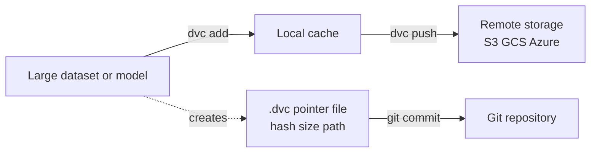
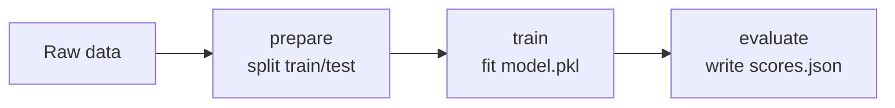

# Data Versioning

Software engineers solved the problem of *"which version of the code is this?"* decades ago with **version control** systems like Git that record every change to every file, let you go back in time, and let teams collaborate without overwriting each other. Machine learning adds a second moving part that Git was never designed for: **data**. A model is the product of *code plus data*. If you change the training data, you get a different model even with identical code. So to truly reproduce or audit a model, you must version the data too.

This guide explains **data versioning** and teaches it through **DVC** (Data Version Control), the open-source tool used in `01_dvc.ipynb`.

## Why Git Alone Is Not Enough

Git is brilliant for text files measured in kilobytes. It stores the full history of every change inside the repository. This breaks down for ML data:

- **Datasets are huge.** A training set can be gigabytes or terabytes. Committing it to Git would bloat the repository to an unusable size, and every clone would have to download the entire history of every version.
- **Data is binary.** Git stores text changes efficiently (it saves only the lines that changed). For a binary blob like a Parquet file or an image folder, any change means storing a whole new copy.
- **Models are also large binaries** with the same problems.

The result is the familiar mess: `train_v2_final.csv`, models emailed around as zip files, and no reliable way to say *"this model was trained on exactly this data."*

## The Core Idea: Pointers in Git, Data in Storage

DVC's central trick is to **separate the metadata from the bytes**. Here is the model:

1. The large file (or folder) lives in dedicated **storage** a local cache, or a remote like Amazon S3, Google Cloud Storage, or Azure.
2. Git tracks only a tiny **pointer file** a small text file (ending in `.dvc`) that contains a **hash** of the data (a short fingerprint computed from its contents), its size, and its path.

Because the pointer is small text, Git versions it perfectly. When the data changes, its hash changes, so the pointer file changes, so Git records a new version of the pointer while the actual bytes go to storage. To reconstruct any version of the data, DVC reads the hash from the pointer and fetches the matching file from storage.

DVC splits metadata from bytes small pointers go to Git, large data goes to remote storage:

`01_dvc.ipynb` makes this concrete by computing an MD5 hash of an Iris dataset and showing the structure of the `.dvc` pointer file that would be committed to Git: an `outs` entry containing the `md5` hash, `size`, and `path`. **That tiny JSON-like file is what Git stores in place of the multi-megabyte dataset.**

### Key DVC vocabulary

| Concept | Definition |
|---------|------------|
| **`.dvc` file** | A lightweight pointer file (tracked in Git) that records the hash, size, and path of a tracked data file or folder. |
| **`dvc.yaml`** | A file defining a reproducible **pipeline** as a sequence of stages. |
| **`dvc.lock`** | A lockfile recording the exact hashes of inputs and outputs from the last pipeline run the proof of what was actually executed. |
| **Remote** | The storage backend where the real data lives (S3, GCS, Azure, SSH, or a local folder). |
| **Cache** | DVC's local store of tracked file versions, kept outside Git. |

## The Basic Workflow

The everyday loop mirrors Git, with `dvc` commands handling data and `git` commands handling pointers:

- `dvc init` sets up DVC inside an existing Git repository.
- `dvc add data/dataset.csv` tells DVC to start tracking a file. DVC moves the file's contents into the cache, creates the `.dvc` pointer, and adds the real file to `.gitignore` so Git ignores the big blob.
- You then `git add` the small `.dvc` pointer and `.gitignore`, and `git commit`. Now Git history references this exact data version.
- `dvc push` uploads the cached data to the configured remote so teammates can get it.
- A teammate runs `git pull` (to get code and pointers) followed by `dvc pull` (to download the matching data from the remote).

The notebook's Git-workflow section walks through this end to end, including the crucial **time-travel** operation: to recover an older dataset, you `git checkout` the older `.dvc` pointer and then run `dvc checkout`, which reads the old hash and restores the matching file version from cache/remote. *Code and data move backward in time together.*

## DVC Pipelines: Reproducible Workflows as a DAG

Versioning files is only half of reproducibility. The other half is versioning the **process** that turns raw data into a trained model. DVC does this with **pipelines** defined in `dvc.yaml`.

A pipeline is a series of **stages**. Each stage declares three things:

- **`cmd`** the command to run (e.g. `python src/train.py`).
- **`deps`** the dependencies it reads (scripts, input data, parameters).
- **`outs`** the outputs it produces (processed data, a model file).

Stages can also declare **`params`** (configuration values pulled from a `params.yaml` file), **`metrics`** (small JSON files of scores), and **`plots`** (data for charts).

Because each stage names its inputs and outputs, the stages form a **DAG** a *Directed Acyclic Graph*. "Directed" means dependencies flow one way (prepare → train → evaluate); "acyclic" means there are no loops. The notebook's `dvc.yaml` example shows a classic three-stage ML DAG: a `prepare` stage that splits raw data into train/test, a `train` stage that fits a model, and an `evaluate` stage that scores it and writes metrics. The accompanying code cell simulates exactly these three stages on the Iris data, producing `train.csv`, `test.csv`, `model.pkl`, and a `scores.json`.

The classic three-stage ML pipeline as a DAG, where each stage's outputs feed the next:

The two commands that make this powerful:

- **`dvc repro`** runs the pipeline but *only the stages whose inputs changed*. DVC compares current hashes against `dvc.lock`. If the raw data and training script are unchanged, the train stage is skipped entirely. This is **caching of computation**, and it can save hours.
- **`dvc dag`** prints the pipeline graph so you can see the dependency structure.

This is the same fundamental concept a DAG of dependent steps that only re-runs what changed that dedicated orchestrators use, covered in `03_pipeline_orchestration`.

## DVC Experiments

Built on top of pipelines, **DVC Experiments** let you try many parameter settings without polluting Git history with a commit per attempt. The notebook lists the workflow:

- `dvc exp run --set-param train.n_estimators=200` runs the pipeline with an overridden parameter.
- `dvc exp show` displays a table of all experiments with their params and metrics, so you can compare them like the experiment-tracking tools in `01_experiment_tracking`.
- `dvc exp diff` compares two experiments.
- `dvc exp apply <name>` makes the workspace match the best experiment, and `dvc exp branch` promotes it to a real Git branch.
- `dvc exp gc` garbage-collects old experiments you no longer need.

This gives DVC a lightweight, Git-native experiment-tracking capability alongside its data-versioning core.

## How Data Versioning Fits Into MLOps

Data versioning is the linchpin of **reproducibility**, the property that lets you recreate any past result exactly. With DVC:

- Every trained model can be traced to the precise data hash that produced it true **lineage** from data to model.
- CI/CD pipelines (`04_ci_cd_for_ml`) can `dvc pull` the right data version automatically before retraining.
- Teams collaborate on multi-gigabyte datasets through cloud storage while keeping the repository tiny.
- Rolling back a model becomes possible: check out the old code *and* the old data, and re-run the pipeline.

In short, Git answered *"which code?"*; DVC answers *"which data, which pipeline, which result?"* and together they make machine learning auditable and reproducible.
