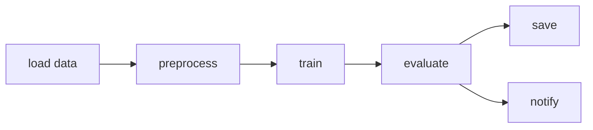

# Pipeline Orchestration

A machine learning model is never the product of a single command. To produce one you must ingest raw data, clean and preprocess it, engineer features, split it, train, evaluate, and finally save or deploy the result. Each step depends on the output of the previous step. In a notebook you run these by hand, top to bottom, and rerun them when something changes. That works for one person learning but it falls apart in production, where the same chain must run on a schedule, recover from failures, run steps in parallel, and tell you when something breaks at 3 a.m.

**Pipeline orchestration** is the discipline (and the tooling) of defining these multi-step workflows once and then having a system manage their *scheduling, dependencies, retries, monitoring, and parallelism* automatically. This guide teaches the core concepts and the three tools demonstrated in `01_orchestration.ipynb`: **Prefect**, **Apache Airflow**, and **ZenML**.

## The Central Concept: The DAG

Almost every orchestrator represents a pipeline as a **DAG** a *Directed Acyclic Graph*.

- A **graph** is a set of nodes connected by edges. Here each node is a **task** (one unit of work, like "preprocess data") and each edge is a dependency ("training needs the preprocessed data").
- **Directed** means the edges have a direction: work flows one way, from upstream tasks to downstream tasks.
- **Acyclic** means there are no cycles you can never loop back to a task you already ran. This guarantees the pipeline has a well-defined beginning and end and will always terminate.

The DAG is the heart of orchestration because it encodes *what depends on what*. From it the orchestrator knows the correct order to run tasks, which tasks can run in **parallel** (those with no dependency between them), and which downstream tasks to skip if an upstream one fails.

A typical ML DAG looks like: `load data → preprocess → train → evaluate → save/notify`. This is the same DAG idea you met with DVC pipelines in `02_data_versioning`; dedicated orchestrators add scheduling, distributed execution, and rich monitoring on top.

A typical ML pipeline DAG, with tasks as nodes and dependencies as directed edges:

### Shared vocabulary

| Term | Definition |
|------|------------|
| **Task** | A single unit of work one function or command. |
| **Pipeline / Flow / DAG** | The whole workflow: tasks plus the dependencies between them. |
| **Scheduler** | The component that decides *when* to start a pipeline run (e.g. every day at 2 a.m.). |
| **Trigger** | An event that starts a run a schedule firing, a file arriving, or a manual click. |
| **Retry** | Automatically re-running a failed task, often after a delay, in case the failure was transient. |
| **Backfill / Catchup** | Running a scheduled pipeline for past time periods it missed. |
| **Executor / Worker** | The process or infrastructure that actually runs the tasks (locally, in Docker, on Kubernetes). |

## Prefect

Prefect is a modern, Python-native orchestrator. Its philosophy is *"write normal Python, add a couple of decorators."* A decorator is a small annotation placed above a function that changes its behavior.

Prefect's two core building blocks:

- A **task** is any Python function decorated with `@task`. It is the orchestration-aware unit of work.
- A **flow** is a function decorated with `@flow`. It is the pipeline itself; it calls tasks and wires them together simply by passing one task's return value into the next.

In `01_orchestration.ipynb`, the `ml_training_pipeline` flow is a complete, runnable example. It defines five tasks `load_data`, `preprocess_data`, `train_model`, `evaluate_model`, `save_metrics` and the flow body calls them in order, passing data through. Because Prefect sees these calls, it builds the DAG automatically and, when run, logs each task's start, completion, and result. The notebook's output shows exactly this: each task transitions through states (Running → Completed) and the final metrics are returned.

Several production features appear right in the task definitions:

- **Retries.** `load_data` is declared with `retries=3, retry_delay_seconds=10`. If loading fails (say, a flaky network), Prefect waits ten seconds and tries again, up to three times, before giving up. This makes pipelines resilient to transient failures without any extra code.
- **Caching.** `preprocess_data` uses `cache_key_fn=task_input_hash` with an expiration. Prefect hashes the inputs; if it sees the same inputs again within the expiration window, it returns the cached result instead of recomputing. This is exactly the "only re-run what changed" idea, applied at the task level.
- **Parameters.** The flow accepts `test_size`, `n_estimators`, and `max_depth`, so the same pipeline can be run with different configurations the notebook runs it with 150 estimators.

### Deployments and scheduling

Running a flow once in a notebook is development. Production needs it to run *on its own*. Prefect's answer is a **deployment** a flow packaged together with a schedule and the infrastructure to run on. The notebook shows building a deployment with a `CronSchedule`. **Cron** is a standard syntax for expressing schedules; `"0 2 * * *"` means "at minute 0 of hour 2, every day" i.e. 2 a.m. daily. A **work pool** defines the infrastructure (a local process, Docker, Kubernetes), and a **worker** is the agent that picks up scheduled runs and executes them. A **block** is reusable configuration such as stored credentials. The lifecycle is: `prefect server start` (the control plane), `prefect worker start` (the executor), and deployments that the scheduler triggers on cron.

## Apache Airflow

Airflow is the long-standing industry standard for workflow orchestration, originally built at Airbnb. Where Prefect feels lightweight and modern, Airflow is mature, batteries-included, and ubiquitous in enterprises. You define pipelines as Python files placed in a `dags/` directory.

Airflow's vocabulary is slightly different but maps onto the same concepts:

| Airflow term | Meaning |
|--------------|---------|
| **DAG** | The pipeline definition object. |
| **Task** | A node in the DAG. |
| **Operator** | A *template* for a task. `PythonOperator` runs a Python function; `BashOperator` runs a shell command; there are operators for databases, cloud services, and more. |
| **XCom** | "Cross-communication" the mechanism by which one task passes a small piece of data to another. |
| **Scheduler** | The always-running process that triggers DAG runs according to their schedule. |
| **Executor** | How tasks actually run: `LocalExecutor` (one machine), `CeleryExecutor` (a worker cluster), `KubernetesExecutor` (a pod per task). |

The notebook's `ml_training_pipeline` DAG demonstrates Airflow idioms. It declares `default_args` shared by all tasks including `retries: 2`, `retry_delay`, and `email_on_failure` for alerting. The `_extract_data` task uses `xcom_push` to hand the data path to the next task, which retrieves it with `xcom_pull`; this is how Airflow tasks, which may run in separate processes, share information. Tasks are grouped with a `TaskGroup` (a visual/logical cluster of related tasks, here "data_preparation"), and dependencies are declared with the readable `>>` operator: `data_prep >> train >> evaluate >> notify`. That single line *is* the DAG's edge structure.

Other notebook highlights: `schedule_interval='@daily'` sets the cadence, `catchup=False` disables automatic backfilling of past missed runs, and tags organize DAGs in the UI. The setup section shows the operational commands initialize the metadata database, create an admin user, and start the **webserver** (the UI) and **scheduler**.

## ZenML

ZenML takes a third stance: it is **ML-first**. Prefect and Airflow are general-purpose orchestrators that happen to run ML; ZenML is designed specifically for MLOps pipelines, with first-class artifact tracking and a pluggable backend system.

Its building blocks are the familiar `@step` (a task) and `@pipeline` (the DAG), as the notebook's `load_data`/`train` example shows. What sets ZenML apart is the **stack** a configurable bundle of infrastructure components that a pipeline runs against. A stack names which **orchestrator** to use, which **artifact store** holds the data passed between steps, which **model deployer** serves models, and so on. The same pipeline code can run locally today and on Kubernetes with an S3 artifact store tomorrow, just by switching stacks (`zenml stack register ...`). This separation of *pipeline logic* from *infrastructure* is ZenML's core idea, and it automatically versions and tracks every artifact a step produces.

## Choosing a Tool

The notebook frames the landscape with a comparison; the essence:

| Tool | Philosophy | Best for |
|------|-----------|----------|
| **Apache Airflow** | DAG-first, mature, enterprise-grade | Complex, large-scale enterprise pipelines |
| **Prefect** | Python-first, modern, flexible | Data engineers and ML teams wanting low friction |
| **ZenML** | ML-first, stack-based | MLOps pipelines needing built-in artifact tracking |
| **Kubeflow Pipelines** | Kubernetes-native | Large-scale workloads already on Kubernetes |
| **Metaflow** | Data-science-first (built at Netflix) | Data scientists wanting maximum simplicity |

There is no single right answer. Airflow dominates where mature scheduling and a vast operator ecosystem matter. Prefect wins on developer experience. ZenML and Kubeflow win when ML-specific features (artifact lineage, model deployment) are central.

## Why Orchestration Matters in MLOps

Orchestration is the connective tissue of an MLOps system. The experiment tracking from `01_experiment_tracking`, the data versioning from `02_data_versioning`, and the model registry from `05_model_registry` are individual capabilities; orchestration is what *runs them together, automatically, on a schedule, reliably.* A retraining pipeline that pulls the latest data version, trains, logs to the tracker, evaluates against a gate, and registers the winner is an orchestrated DAG. When that DAG is itself triggered by code changes or detected drift, you have arrived at **CI/CD for ML** (`04_ci_cd_for_ml`), which is orchestration extended into the deployment workflow. Mastering DAGs, schedulers, retries, and executors here is the prerequisite for automating the entire ML lifecycle.
