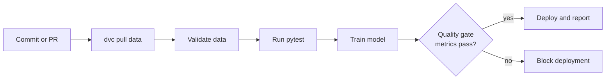
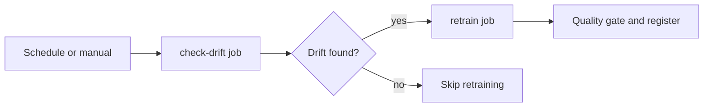

# CI/CD for Machine Learning

In traditional software, teams long ago automated the path from "a developer changed some code" to "that change is safely running in production." Two practices make this possible. **Continuous Integration (CI)** means that every code change is automatically built and tested the moment it is pushed, so bugs are caught early and the main codebase always stays in a working state. **Continuous Delivery / Deployment (CD)** means that once changes pass all checks, they are automatically packaged and released to production (or to a staging environment ready for one click of release). Together, **CI/CD** is the automated assembly line that turns commits into running software.

Machine learning needs this same assembly line but ML breaks the assumptions traditional CI/CD was built on. This guide explains how CI/CD adapts to ML, using the tools and patterns in `01_cicd_ml.ipynb`: **GitHub Actions**, **CML**, **DVC**, **pytest**, and **Great Expectations**.

## Why ML CI/CD Is Different

A traditional application is defined entirely by its code. An ML system is defined by **code + data + model**. That extra surface area changes everything about the pipeline.

| Aspect | Traditional software | Machine learning |
|--------|----------------------|------------------|
| What can change | Code | Code **and** data **and** the trained model |
| What tests check | Logic correctness (unit, integration) | Code correctness **plus** model quality **plus** data validity |
| The build artifact | A binary or package | A *trained model* |
| Deployment | Ship an app | Serve a model |
| Monitoring | App health and errors | Model performance **and** data drift |

The deep insight is that an ML pipeline can fail *even when every line of code is correct*. If the incoming data shifts, or the retrained model is worse than the old one, the code passes but the system is broken. So ML CI/CD must add new kinds of gates that traditional CI/CD never needed: **data validation** and **model quality gates**.

## The Engine: GitHub Actions

**GitHub Actions** is GitHub's built-in automation system. You describe a **workflow** in a YAML file under `.github/workflows/`, and GitHub runs it automatically in response to **events**. The notebook's `train.yml` workflow illustrates the structure:

- **Triggers (`on:`)** decide when the workflow runs. The example fires on pushes to `main` (but only when files under `src/`, `params.yaml`, or `data/` change *path filters*), on pull requests, and on a weekly **cron** schedule. A pull request (PR) is a proposed code change; running CI on every PR is what keeps the main branch healthy.
- **Jobs and steps.** A job runs on a fresh virtual machine (`runs-on: ubuntu-latest`) and executes a sequence of steps: check out the code, set up Python, install dependencies, and so on.

What makes this an *ML* pipeline rather than a generic one is the steps in the middle, which we will now unpack: pulling versioned data, validating that data, running tests, training the model, gating on its quality, and reporting metrics back to the PR.

The ML CI/CD pipeline from commit through to deployment, with its ML-specific gates:

## Step 1: Versioned Data in the Pipeline

Because data is part of what defines the model, CI must fetch the *exact right version* of the data. The notebook's workflow configures **DVC** (covered fully in `02_data_versioning`) with cloud credentials stored as encrypted **secrets** (`${{ secrets.AWS_ACCESS_KEY_ID }}`), then runs `dvc pull` to download the correct data version before doing anything else. After a successful run on `main`, it runs `dvc push` to store any new data or model artifacts. This guarantees the automated pipeline trains on tracked, reproducible data not whatever happens to be lying around.

## Step 2: Testing ML Code with pytest

**pytest** is the standard Python testing framework. A test is a small function that asserts an expected condition; if the assertion fails, the test fails and the pipeline stops. The notebook writes a test suite that already shows the two ML-specific test categories (explored in depth in `07_testing_in_ml`):

- **Data quality tests** (`TestDataQuality`): the dataset has no missing values, the expected number of features, the expected number of target classes, and feature values within sane ranges.
- **Model tests** (`TestModel`): a trained model's accuracy is above a threshold (≥ 0.90), its output has the right shape, predicted probabilities sum to 1, predictions fall in the valid class set, and crucially there is **no data leakage** (the test set must not overlap the training set; leakage produces falsely optimistic scores).

A **fixture** (`trained_model`) is pytest's mechanism for reusable setup: it builds a trained model once and hands it to every test that needs it. The CI step runs `pytest tests/ -v --cov=src`, where `--cov` measures **code coverage** the percentage of code actually exercised by tests which can itself become a gate (e.g. fail if coverage drops below 80%).

## Step 3: Data Validation with Great Expectations

Unit tests check code; **data validation** checks the *incoming data* against declared rules before it is ever used for training. **Great Expectations** is a library built for exactly this. You declare "expectations" human-readable assertions about a dataset and validate batches against them. The notebook's example expects a column to never be null, ages to fall between 0 and 120, labels to be in `{0, 1}`, row counts within a range, and a column's mean within bounds. If validation fails, the pipeline raises an error and refuses to train on bad data. This is the gate that catches the silent ML failure mode where the *code* is fine but the *data* has quietly become garbage. (The notebook mentions **Pandera** as a lighter-weight alternative for schema validation.)

## Step 4: The Model Quality Gate

This is the gate with no equivalent in traditional CI/CD. Even with correct code and clean data, a freshly trained model might simply be *worse* than what you already have. A **model quality gate** is a step that loads the new model's evaluation metrics and refuses to proceed unless they clear defined thresholds. The notebook's `model_gate.yml` reads `scores.json` and checks accuracy ≥ 0.90 and f1_macro ≥ 0.88; if any metric is below its threshold, the step exits with a failure code and the deployment is blocked. This converts "is this model good enough to ship?" from a manual judgment into an automated, enforced policy.

## Step 5: Reporting Results with CML

A passing pipeline is good, but reviewers also need to *see* what the model did. **CML (Continuous Machine Learning)** is a tool from the makers of DVC that posts ML results metrics tables, plots, confusion matrices directly as comments on the GitHub or GitLab pull request. The notebook's workflow assembles a markdown report from `scores.json` and publishes it with `cml comment create`. Now, instead of digging through logs, a reviewer sees the new model's accuracy and a confusion-matrix image right in the PR conversation, making model changes reviewable like code changes. CML uses the repository's `GITHUB_TOKEN` (an automatically provided credential) to post.

## Putting It Together: Training and Reproducibility

The full pipeline ties these gates around the actual training. The notebook runs `dvc repro`, which executes the DVC pipeline DAG and, because DVC caches by input hashes, only re-runs the stages whose inputs changed. This keeps CI fast and reproducible: the same commit and the same data always produce the same model.

## Automated Retraining

CI/CD for ML also automates *when to retrain*. The notebook's `retrain.yml` workflow demonstrates two triggers: a **scheduled** weekly cron run, and `workflow_dispatch` for **manual** triggering (with an input to force retraining). More sophisticated still, it shows a two-job pattern: a `check-drift` job runs a drift-detection script and outputs whether drift was found; a `retrain` job then runs *only if* drift was detected (`if: needs.check-drift.outputs.should_retrain == 'true''`). This closes the MLOps loop: the **monitoring** system (`06_monitoring`) detects that the world has changed, and CI/CD automatically retrains the model in response no human in the loop until the quality gate asks for a decision.

The drift-triggered retraining flow, where retraining runs only if drift is detected:

## The Tools at a Glance

| Tool | Role in ML CI/CD |
|------|-------------------|
| **GitHub Actions** | The automation engine that runs workflows on events. |
| **DVC** | Pulls/pushes the exact versioned data and pipeline outputs. |
| **pytest** | Runs code, data, and model tests; enforces coverage. |
| **Great Expectations** (or **Pandera**) | Validates incoming data against declared rules. |
| **CML** | Reports metrics and plots inside pull requests. |
| Quality-gate scripts | Block deployment of models that miss metric thresholds. |

## Why This Matters

CI/CD for ML is what turns a collection of manual notebook steps into a trustworthy, self-running system. It catches data problems before they corrupt a model, prevents worse models from reaching production, makes every model change reviewable, and can retrain automatically when monitoring detects drift. It is the automation layer that sits on top of everything else in this chapter orchestration runs the steps, versioning makes them reproducible, tracking records them, and CI/CD wires it all into the everyday workflow of pushing code. Without it, MLOps is a set of good practices you *hope* people follow; with it, those practices are enforced by the pipeline itself.
