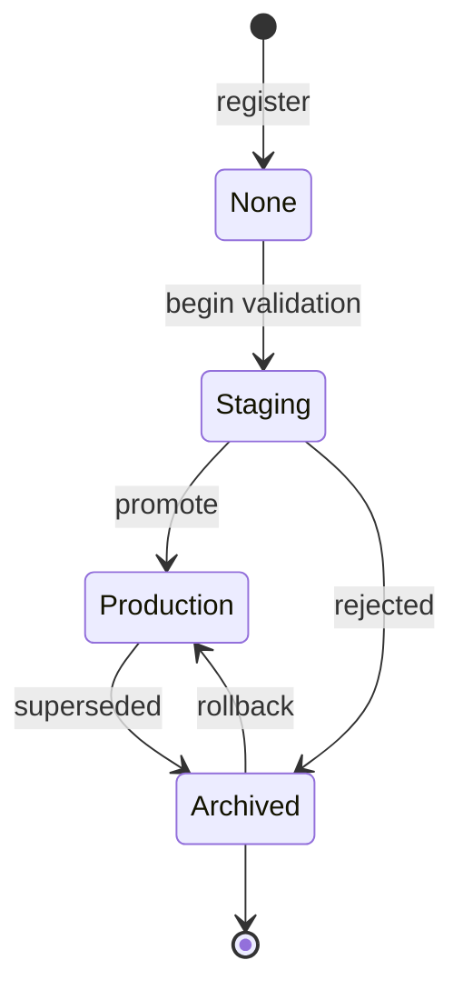
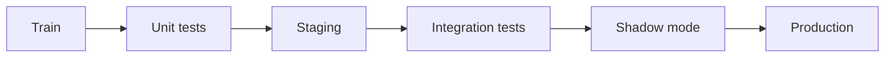

# Model Registry

You have trained dozens of models, tracked every run, and versioned your data. Now comes a deceptively hard question: *which model is actually running in production right now, and how do I safely replace it with a better one?* If your answer involves a file named `model_final.pkl` on someone's laptop, you have a problem. The piece of MLOps infrastructure that answers this question properly is the **model registry**.

A **model registry** is a centralized repository that stores, versions, and manages machine learning models across their entire lifecycle from the moment a promising model leaves experimentation, through testing, into production, and eventually into retirement. This guide teaches the concepts behind registries and the several implementations shown in `01_model_registry.ipynb`: MLflow's registry, the Hugging Face Hub, Weights & Biases, BentoML, and a hand-built custom registry.

## Why a Registry Exists

Without a registry, model management is ad hoc and dangerous. The registry replaces chaos with structure.

| Without a registry | With a registry |
|--------------------|-----------------|
| Models saved as random files with cryptic names | Models are **named, versioned, and discoverable** |
| No record of how a model was made | Full **lineage**: data → training run → model → deployment |
| Deployment is manual and error-prone | Promotion can be **automated** through defined gates |
| No way to undo a bad deploy | **One-step rollback** to a previous version |

In short, the registry is the single source of truth for "which model, which version, at which stage of its life."

## Core Concepts

Every registry, whatever the vendor, revolves around the same ideas.

**Registered model.** A *named* model that may have many versions over time for example `breast-cancer-classifier` or `fraud-detector`. It is the umbrella, not a single file.

**Model version.** Each time you register a new artifact under that name, the registry creates a new **version** (version 1, 2, 3…). Versions are immutable snapshots: version 2 always refers to the exact same model bytes.

**Stage.** A label describing where a version sits in its lifecycle. The classic progression is:

```
Experiment → None → Staging → Production → Archived
```

- **None** newly registered, not yet validated.
- **Staging** undergoing testing and validation.
- **Production** serving live traffic.
- **Archived** retired, no longer active but kept for history and rollback.

A model version moving through its lifecycle stages:



**Promotion / transition.** Moving a version from one stage to the next (e.g. Staging → Production). This is the controlled act of "shipping a model."

**Alias.** A human-friendly pointer to a specific version, such as `champion` (the current best) or `challenger` (a contender being evaluated). Aliases decouple "the model serving traffic" from "version number 7," so you can repoint the alias without changing any serving code.

**Semantic versioning for models.** The notebook introduces `MAJOR.MINOR.PATCH` versioning adapted to ML: a **PATCH** bump is a retrain on the same data and algorithm (a bug fix); a **MINOR** bump is a new feature or architecture tweak; a **MAJOR** bump is a breaking change such as a new task or a changed input schema. This communicates *how risky* an update is at a glance.

## MLflow Model Registry

MLflow's registry is the reference implementation and the one the notebook exercises most fully. The flow is: train a model and log it inside an MLflow run, then **register** it. In `01_model_registry.ipynb`, a `RandomForestClassifier` is trained, logged, and registered under the name `breast-cancer-classifier` with `mlflow.register_model`. Because that name already existed, MLflow creates *version 2* automatically demonstrating that registration is versioned by name.

The notebook then walks the full lifecycle with the `MlflowClient`:

- **Transition to Staging**, then **transition to Production** with `archive_existing_versions=True`, which automatically moves the previous production version to Archived exactly the safe-swap behavior you want.
- **Set an alias** (`champion`) pointing at the new version.
- **Load a model by alias or stage.** The notebook loads `models:/breast-cancer-classifier@champion` and `models:/breast-cancer-classifier/Production`. Serving code references the *alias or stage*, never a hard-coded version, so deploys become repointing operations.
- **Inspect and annotate.** It lists every version with its stage, adds a model description, and attaches tags (`team=ml-platform`, `validated=true`).

The metadata lives in a backend database (the notebook uses a local SQLite file, `mlflow.db`) while the model artifacts live alongside in `mlruns/`. (Note: MLflow is gradually deprecating named stages in favor of aliases, but the *concept* of a controlled lifecycle is unchanged.)

## The Same Idea in Other Tools

A registry is a pattern, not a single product. The notebook shows the pattern recurring across the ecosystem:

- **Hugging Face Hub.** The de facto registry for transformer models. Every model is a Git repository, with model weights stored via Git LFS (Large File Storage). Versions are Git tags (`v1.0.0`), loaded with a `revision=` argument, and each model ships a **model card** a documentation file describing the model, its license, metrics, and intended use.
- **Weights & Biases.** Models are saved as versioned **Artifacts** (with metadata like accuracy and hyperparameters) and *linked* into a Model Registry, where a path like `registry/...:production` plays the role of a stage/alias.
- **BentoML model store.** A local store that saves models by name with auto-generated version tags (e.g. `breast_cancer_classifier:pzvvdz3l...`), plus labels and metadata, and loads them by tag registry semantics aimed at serving.
- **Custom registry.** The notebook builds one from scratch to reveal the underlying mechanics: a `ModelVersion` record (name, semver, stage, artifact URI, run ID, metrics, params, tags) and a `SimpleModelRegistry` that registers versions, transitions stages, and fetches the latest production model. The lesson is that a registry is conceptually just *metadata in a database pointing at artifacts in storage* typically PostgreSQL for metadata and S3 (object storage) for the model files.

## Promotion Gates: Deciding What Ships

A registry stores versions, but *which* version becomes Production should not be a gut call. The notebook implements an **automated promotion gate**: a function that compares a **candidate** model against the current **champion** on a test set and returns a verdict. Its rules require the candidate to clear an absolute bar (accuracy ≥ 0.90) *and* to beat the champion by a minimum margin (≥ 0.005). In the notebook's demo the candidate is actually slightly worse than the champion, so the gate correctly returns `promote: False`. This is the registry counterpart to the CI/CD quality gate in `04_ci_cd_for_ml`: promotion is a policy, enforced by code, not a manual decision.

The notebook frames this inside a full **promotion workflow**:

```
Train → Unit Tests → Staging → Integration Tests → Shadow Mode → Production
```

The promotion workflow from training through to production:



Here **shadow mode** means running the new model alongside production on real traffic *without* using its outputs, so you can compare behavior safely before committing a serving technique detailed in the advanced-serving material.

## Model Lineage

The registry's deepest value is **lineage** full traceability from data all the way to deployment:

```
Dataset → Preprocessing → Training Run → Model Version → Deployment
```

The notebook captures this with a `ModelLineage` record that bundles everything needed to reproduce and audit a model: a **data hash** (a deterministic fingerprint of the exact training data), the data source URI, the training run ID, the **git commit** of the code, the training parameters, the evaluation metrics, and who created it. With this record attached to every model version, you can always answer "what data, what code, and what settings produced the model currently in production?" the question that auditors, debuggers, and your future self will inevitably ask. Lineage connects the registry to data versioning (`02_data_versioning`) and experiment tracking (`01_experiment_tracking`): the registry is where all those threads come together.

## Where the Registry Sits in MLOps

The model registry is the hinge between *building* models and *running* them. Experiment tracking produces candidate models; the registry decides which become official, versions them, and governs their promotion through staging to production. CI/CD pipelines register the models they train and consult the registry's gates. Serving systems load whatever version the `Production` stage or `champion` alias currently points to. Monitoring watches that production model and, on detecting drift, can trigger a retraining pipeline that registers a challenger. Rollback is simply repointing a stage to a previous version. Without a registry, none of this automation has a stable place to anchor; with one, the lifecycle of a model becomes as managed and reversible as the lifecycle of code.
