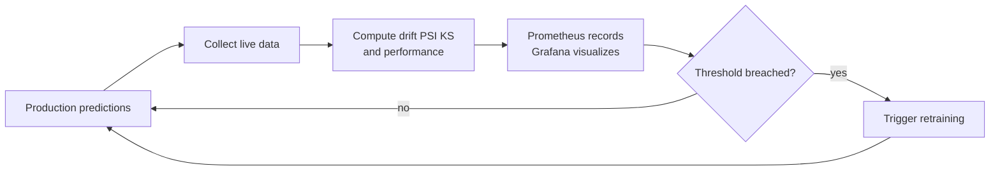

# Monitoring & Observability for ML

A traditional software bug announces itself: the app crashes, an error appears, a page returns 500. A machine learning model fails *silently*. When the world changes underneath a deployed model, it does not crash it keeps confidently producing predictions, just increasingly wrong ones. No exception is raised, no log turns red. The accuracy you measured at launch quietly erodes, and you may not notice until the business metric it drives starts sinking weeks later.

**Monitoring** (and its broader cousin **observability**) is the practice of continuously watching a deployed model and its data so that this silent decay is caught early and acted upon. This guide explains the concepts and techniques in `01_monitoring.ipynb`: the types of model failure (the various **drifts**), the statistical tests that detect them, and the tooling (**Evidently AI**, **Prometheus**, **Grafana**) that operationalizes monitoring with dashboards and alerts.

## Why Models Degrade: Drift

A model is trained on a snapshot of the world. The world then keeps moving. **Drift** is the umbrella term for the world drifting away from that training snapshot. The notebook distinguishes four kinds, and the distinctions matter because they call for different responses.

Let `X` be the input features and `Y` the target the model predicts.

### Data drift (covariate shift)
The distribution of the *inputs* changes: the data you see in production no longer looks like your training data. Formally, the probability distribution of `X` shifts (`P_train(X) ≠ P_prod(X)`). Example: a fraud model trained mostly on desktop transactions now sees mostly mobile ones. The relationship between input and answer may still hold, but the model is being asked about inputs it rarely saw.

### Concept drift
The *relationship itself* changes the same input now maps to a different correct answer (`P_train(Y|X) ≠ P_prod(Y|X)`). Example: customer behavior shifts after a pandemic, so the patterns that signaled "will churn" no longer do. This is the most dangerous drift because even perfect inputs lead to wrong predictions; the model's learned logic is simply out of date.

### Label drift
The distribution of the *target* changes (`P_train(Y) ≠ P_prod(Y)`). Example: the fraction of transactions that are actually fraudulent rises sharply.

### Prediction drift
The distribution of the model's *outputs* changes. This one is special because it can be measured **without ground-truth labels** you rarely know immediately whether each production prediction was right, but you always have the predictions themselves. A sudden shift in the mix of predicted classes is an early warning sign you can watch in real time.

## Detecting Drift: Statistical Tests

To detect drift you compare a **reference** distribution (typically the training data) against the **current** production data, feature by feature. The notebook implements and explains several tests; each answers "are these two samples drawn from the same distribution?"

### Kolmogorov-Smirnov (KS) test
For continuous features. It measures the largest gap between the two cumulative distribution functions (`D = sup|F1(x) − F2(x)|`) and returns a **p-value** the probability of seeing this much difference by chance if the distributions were truly identical. A small p-value (below, say, 0.05) means the difference is real: drift. In `01_monitoring.ipynb`, the `detect_drift_ks` function runs this test across all features of a synthetic dataset; the two features that were deliberately shifted come back with tiny p-values flagged `drift_detected=True`, while the untouched features are not flagged.

### Population Stability Index (PSI)
A widely used industry metric that bins each feature and measures how much the proportion of data in each bin shifted between reference and current. The notebook gives the interpretation thresholds that practitioners memorize:

| PSI value | Meaning |
|-----------|---------|
| < 0.1 | No significant change |
| 0.1 - 0.2 | Moderate change investigate |
| ≥ 0.2 | Significant change consider retraining |

The notebook's `calculate_psi` and `interpret_psi` functions confirm the same two shifted features as "SIGNIFICANT CHANGE retrain" while the rest read "No change." PSI's appeal is that it collapses drift into a single, threshold-able number per feature ideal for dashboards and alerts.

### Chi-square test
The categorical analogue of the KS test: it compares observed versus expected category counts (`χ² = Σ(O − E)²/E`) to detect drift in categorical features.

### Wasserstein distance (Earth Mover's Distance)
A measure of how much "work" it takes to transform one distribution into the other. Unlike a p-value, it gives a meaningful *magnitude* of drift, which is useful for ranking which features have moved the most.

These tests are the core of the **data-validation** intuition reused throughout MLOps; they are close cousins of the drift checks that trigger automated retraining in `04_ci_cd_for_ml`.

## What to Monitor

Drift is only part of the picture. A complete monitoring strategy watches three layers:

1. **Data quality and drift** the inputs: are they within expected ranges, free of nulls, and distributed as before? (PSI, KS, chi-square.)
2. **Model performance** the outputs: accuracy, precision, recall, AUC, error rates. This requires ground-truth labels, which often arrive with delay, so prediction drift serves as a leading indicator until labels catch up.
3. **System / operational health** the service: prediction latency, throughput, error rates, resource usage. A model that is accurate but takes five seconds to respond is also failing.

## Tooling: From Detection to Action

Computing a KS test in a notebook is detection; production monitoring needs *automation, dashboards, and alerts.* The notebook introduces three tools that provide this.

### Evidently AI
A Python library purpose-built for ML monitoring. Instead of writing statistical tests by hand, you assemble ready-made **reports** and **test suites** from presets. The notebook shows a `DataDriftPreset` report that runs drift tests across all columns and renders an interactive HTML dashboard, and a `DataStabilityTestPreset` **test suite** that returns pass/fail results you can read programmatically (`results["summary"]["passed_tests"]`). The key shift in thinking is from "run a test once" to "generate a standardized drift report on every batch of production data." Evidently bundles data drift, data quality, and model-performance presets, turning monitoring into a repeatable, reportable process.

### Prometheus
A time-series monitoring system that *scrapes* numeric metrics from your services and stores them over time. The notebook instruments a FastAPI prediction service with the three Prometheus metric types:

- A **Counter** (`ml_predictions_total`) a value that only goes up, counting total predictions, labeled by model version and predicted class.
- A **Histogram** (`ml_prediction_latency_seconds`) records the distribution of prediction latencies into buckets, so you can later compute percentiles like the 99th-percentile (p99) latency.
- A **Gauge** (`ml_model_accuracy`, `ml_data_drift_psi`) a value that can move up or down, holding the current accuracy or a feature's current PSI drift score.

The service exposes a `/metrics` endpoint that Prometheus periodically reads. This is how the abstract drift scores and accuracy numbers become *continuously recorded time series* rather than one-off measurements.

### Grafana and alerting
**Grafana** is the visualization layer that turns Prometheus's time series into live dashboards charts of accuracy, latency, and drift over time. Crucially, the notebook shows **alert rules**: declarative conditions that fire when a metric crosses a threshold for a sustained period. Its examples raise a *critical* alert when `ml_model_accuracy < 0.85` for 5 minutes, and another when the p99 of prediction latency exceeds 500 ms. **Alerting** is what closes the loop: instead of hoping someone notices a sinking chart, the system actively pages a human (or triggers an automated retraining workflow) the moment a threshold is breached. The notebook also points to **WhyLogs** as a lightweight alternative for profiling data distributions.

## Closing the Loop

Monitoring is not an end in itself it is the trigger for everything else in the MLOps cycle. The pipeline is: **detect → alert → act.**

- A monitoring job computes drift (PSI/KS) and performance metrics on each batch of fresh production data.
- Prometheus records them; Grafana visualizes them; an alert rule watches the thresholds.
- When drift crosses the line or accuracy drops, the alert fires. That alert can do more than notify it can kick off the **automated retraining** workflow from `04_ci_cd_for_ml`, which pulls fresh data, retrains, runs the model through the quality gate, and registers a challenger in the **model registry** (`05_model_registry`).

The monitoring and drift-detection loop that feeds back into retraining:

This is why monitoring sits at the *end* of the MLOps lifecycle and yet feeds straight back to the *beginning*: it is the sensory system that tells the whole pipeline when the world has changed enough that the model must be rebuilt. A model is never "done" it is deployed, watched, and continuously renewed, and monitoring is the practice that makes that renewal timely instead of too late.
