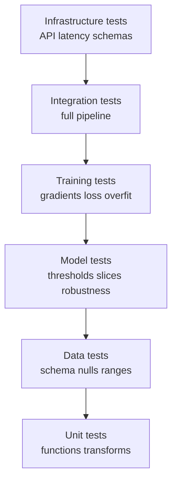

# Testing in Machine Learning

In traditional software, testing is well understood: the program is **deterministic**, so you feed it an input, you know the exact output it should produce, and you assert that it does. `add(2, 2)` must equal `4`, every time, forever. Machine learning breaks this contract. An ML system is **probabilistic** and **data-dependent**: there is no single "correct" output to assert, the model is learned from data rather than written by hand, and the same code can produce a great model or a useless one depending entirely on the data it saw. You cannot test a model the way you test `add`.

So ML testing shifts from "assert the exact output" to "assert *statistical properties, thresholds, and behaviors*." This guide explains that shift and the layered testing strategy in `01_testing_ml.ipynb`, covering unit tests, data tests, model tests, training-code tests, and API tests using **pytest**, **Pandera**, **Great Expectations**, and **FastAPI's TestClient**.

## The ML Testing Pyramid

Software testing is usually drawn as a pyramid: many fast, narrow tests at the bottom; fewer, broader tests at the top. ML adds new layers. The notebook's pyramid, from foundation upward:

| Layer | What it tests | Tools |
|-------|---------------|-------|
| **Unit tests** | Individual functions: feature transforms, utilities | pytest |
| **Data tests** | Schema, distributions, nulls, ranges of the data itself | Great Expectations, Pandera |
| **Model tests** | Accuracy thresholds, subgroup performance, robustness | deepchecks, custom |
| **Training tests** | Gradient flow, loss decreasing, ability to overfit | custom |
| **Integration tests** | The full pipeline end to end | pytest + fixtures |
| **Infrastructure tests** | API endpoints, latency, schemas | httpx, locust, FastAPI TestClient |

The ML testing pyramid, from many fast tests at the base to fewer broad tests at the top:

The reason for the extra layers is the extra surface area: in ML, *the data and the model are first-class artifacts that can break independently of the code.* You must test all three.

## 1. Unit Tests: The Familiar Foundation

The bottom of the pyramid is ordinary software testing applied to your ML code's deterministic pieces the feature-engineering functions, data transforms, and utilities. These *are* deterministic and *can* be tested exactly. **pytest** is the standard tool: you write small functions, each asserting one expected behavior.

The notebook tests three feature functions: an outlier-clipper, a log-transform, and a safe-division ratio feature. Its tests show the core patterns:

- **Behavior assertions** clipping an outlier really lowers the maximum; the transform preserves the input's shape.
- **Error-path tests** `log1p_transform` must *raise* a `ValueError` on negative input. The notebook uses `pytest.raises` to assert that the exception is thrown. Testing that bad input fails loudly is as important as testing that good input succeeds.
- **Edge cases** division by zero produces `NaN` rather than crashing.

Two pytest concepts the notebook highlights make tests scalable: **fixtures** (reusable setup, e.g. a `sample_df`, declared once and injected into many tests) and **parametrization** (`@pytest.mark.parametrize`, which runs the same test across a list of inputs so one test function covers many cases).

## 2. Data Tests: Validating the Inputs

This layer has no analogue in traditional testing. Because a model is only as good as its data, you must test the *data* against declared expectations *before* it is used. The notebook demonstrates two libraries.

**Pandera** validates a DataFrame against a **schema** a declaration of each column's type, allowed range, nullability, and allowed values. The notebook defines a schema requiring `age` to be an integer in `[0, 120]`, `income` a non-negative float, `education` to be one of four categories, `label` to be 0 or 1, and the whole table to have no duplicate rows. Valid data passes; when a row is given an age of −5, validation raises a `SchemaError` that pinpoints the failing value. This is *executable documentation* of what your data must look like.

**Great Expectations** is a heavier, more feature-rich data-validation framework. You assert "expectations" against a batch of data: values not null, within ranges, in an allowed set, row count within bounds. The notebook deliberately includes one expectation that fails (requiring at least 100 rows when only 5 are present) to show that the suite reports per-expectation pass/fail and an overall verdict. Used in a pipeline, these data tests are the gate that catches the silent failure mode where the code is correct but the data has quietly become invalid the same gate seen in `04_ci_cd_for_ml` and `06_monitoring`.

## 3. Model Tests: Is the Model Good Enough?

Here testing fully embraces its statistical nature. You cannot assert an exact prediction, so you assert *properties of the model's behavior*. The notebook trains a classifier and runs a battery of model tests:

- **Threshold tests.** Accuracy must be ≥ 0.90 and AUC ≥ 0.95. These convert "the model is good" into an enforceable, automatable bar.
- **Output shape and validity tests.** Predictions have the right shape; probabilities sum to 1. These guard against integration bugs that silently corrupt outputs.
- **Slice-based testing (fairness / subgroup performance).** Overall accuracy can hide that a model fails badly on an important subgroup. The notebook splits the test set by a feature and asserts that *each slice* meets a minimum accuracy, so a model that is 95% accurate overall but 60% accurate on one segment is caught. This is how you test for hidden inequity and blind spots.
- **Metamorphic tests.** A *metamorphic* test asserts a relationship between inputs and outputs rather than an exact value: a tiny perturbation to the inputs should *not* flip most predictions. The notebook adds small noise and asserts the fraction of flipped predictions stays low (well under 50%), testing the model's **robustness** to minor input changes. (In NLP, the related idea of **behavioral testing** checking a model handles negation, synonyms, typos correctly comes from the CheckList methodology the notebook references.)

## 4. Training-Code Tests: Does Learning Actually Work?

The training procedure itself can be buggy in ways that produce a model that "trains" but learned nothing. The notebook tests the training loop directly on a tiny PyTorch network:

- **Loss decreases.** After a few optimization steps, the loss should be lower than it started. If it does not, something in the training loop is broken.
- **The model can overfit a tiny dataset.** A correct model with enough capacity should be able to *memorize* four examples to 100% accuracy. This classic sanity check confirms that gradients flow and the model can learn *at all*; if it cannot overfit four points, it will never learn the real task.
- **Output shape is correct** for a given input batch.
- **No NaN gradients.** After a backward pass, no gradient should be `NaN`. NaN gradients silently destroy training, so catching them is essential.

The notebook also explains the **gradient check** numerically approximating each gradient with a finite difference and comparing it to the analytical gradient (they should agree to within ~1e-5). This is the gold-standard test when you implement a custom layer or loss by hand.

## 5. Infrastructure Tests: Testing the Served Model

A model is useless until it is reachable. This layer tests the *serving API*. The notebook builds a minimal **FastAPI** prediction service and tests it with FastAPI's **TestClient**, which sends real HTTP requests to the app in-process without needing a running server. Its tests cover:

- A **health endpoint** returns 200 and `{"status": "ok"}` the basic liveness check.
- A **valid prediction** returns a well-formed response with a class in `{0,1}` and a probability in `[0,1]`.
- **Bad input is rejected** sending the wrong number of features yields a 422 (validation error) or 500, rather than a silently wrong answer. (Pydantic schemas, the `PredictRequest`/`PredictResponse` models, enforce this contract automatically.)
- **Response time** stays under a latency threshold a basic performance test. At larger scale this becomes **load testing** with tools like locust.

## 6. Running It All Continuously

Tests deliver value only when they run automatically. The notebook closes by wiring these layers into a CI workflow (GitHub Actions): on every push and pull request it runs unit tests, then data validation, then model tests, and finally enforces a **coverage** floor (`--cov-fail-under=80`, meaning at least 80% of the code must be exercised by tests). This is the testing facet of CI/CD for ML from `04_ci_cd_for_ml`: every change is automatically checked across all the ML-specific dimensions before it can ship.

## Why ML Testing Matters

Testing is what makes the difference between a model that *happened to work in a notebook* and a model you can *trust in production and keep changing safely*. Unit and data tests catch broken code and corrupt data; model tests enforce quality and fairness; training tests verify that learning works; API tests confirm the model is correctly served. Together they form a safety net that lets a team retrain and redeploy continuously without fear the prerequisite for the automated pipelines, quality gates, and monitoring that the rest of this chapter builds. In ML, where failures are silent and statistical, a thoughtful testing strategy is not optional polish; it is the foundation of reliability.
