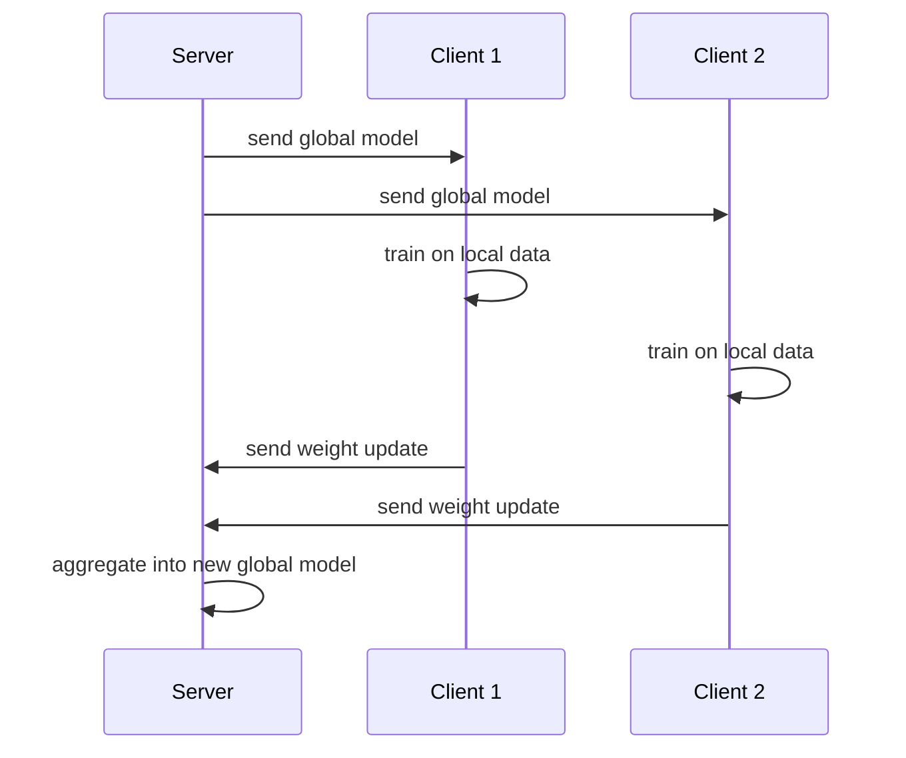

# Federated Learning: Privacy-Preserving Machine Learning

The standard recipe for machine learning is "gather all the data in one place, then train on it." But often you *cannot* gather the data. The text messages on millions of phones, the patient records in dozens of hospitals, the financial histories across competing banks this data is sensitive, legally protected (by regulations like GDPR and HIPAA), or simply too valuable to hand over. Centralizing it would be a privacy disaster and frequently illegal.

**Federated Learning (FL)** is the technique that resolves this tension. It trains a shared model across many decentralized devices or organizations *without the raw data ever leaving where it lives*. Instead of bringing the data to the model, FL brings the model to the data. This guide teaches the concepts in `01_federated_learning.ipynb`: the FedAvg algorithm, the challenges of real-world federation, differential privacy, and the Flower framework.

## The Core Idea

Picture a central **server** and many **clients** (phones, hospitals, banks). The training proceeds in **rounds**, and in each round:

1. The server sends the current **global model** to a selection of clients.
2. Each client trains the model on *its own local data* for a few steps, producing an updated set of model weights. The data never moves.
3. Each client sends only its *model update* (the new weights) back to the server never the data.
4. The server **aggregates** all the client updates into a new, improved global model.
5. Repeat.

The only thing that travels over the network is model weights, which are far less sensitive than raw records (and can be protected further, as we will see). The notebook draws this architecture: a central server distributing a global model `w_t` to clients, each of which trains locally and returns an update.

One federated round, where clients train locally and the server aggregates their updates:

## FedAvg: The Foundational Algorithm

The algorithm that started the field is **Federated Averaging (FedAvg)**, introduced by McMahan et al. in 2017. Its aggregation rule is intuitive: the new global model is a **weighted average** of the client models, weighted by how much data each client has.

If client `k` has `n_k` samples out of `n` total, the global update is `w = Σ (n_k / n) · w_k`. A hospital with 10,000 patients influences the global model ten times as much as a clinic with 1,000 exactly as it should, since it learned from more data. Between aggregations, each client runs several **local epochs** (`E`) of ordinary gradient descent on its own data; doing more local work per round means fewer rounds and less communication.

The notebook implements FedAvg *from scratch* to make it concrete. A `FederatedServer` holds the global weights and has an `aggregate` method performing exactly the data-weighted average above. A `FederatedClient` receives the global weights, trains a simple logistic regression locally with SGD, and returns its updated weights plus its sample count. The driver code splits the breast-cancer dataset across 5 simulated clients, runs 10 rounds, and the global model's test accuracy climbs to ≈0.99 all without any single client ever seeing another's data. This small example contains the entire essence of federated learning.

## Why Real Federation Is Hard

The from-scratch demo works cleanly because its setup is idealized. Production FL confronts several hard challenges, which the notebook surveys.

### Non-IID data

In the demo, data was split evenly and randomly across clients. In reality, clients hold **non-IID** data *not independent and identically distributed*. One phone's user types in Spanish, another in Japanese; one hospital sees mostly elderly patients, another mostly children. Each client's local distribution differs from the global one, so local training pulls each client's model toward its own idiosyncrasies, and naive averaging can stall or destabilize. The notebook lists the main remedies:

- **FedProx** adds a *proximal term* to each client's loss that penalizes drifting too far from the global model, keeping local updates anchored.
- **FedNova** normalizes updates by the number of local steps each client took, so clients that trained longer do not dominate unfairly.
- **SCAFFOLD** uses *control variates* correction terms that estimate and cancel each client's drift.

### Communication efficiency

Sending full model weights from millions of devices every round is expensive. Techniques to shrink the traffic include **quantization** (sending lower-precision numbers), **sparsification** (sending only the largest updates), and **model pruning** before transmission. **FedPAQ** combines periodic averaging with quantization.

### System heterogeneity

Clients differ in compute, memory, and connectivity, and some drop out mid-round. **Asynchronous** approaches like **FedAsync** and **FedBuff** let the server incorporate updates as they arrive rather than waiting for every straggler.

## Differential Privacy: Stronger Guarantees

Keeping raw data on-device is a strong privacy improvement, but model updates can still *leak* information a sufficiently clever adversary can sometimes reconstruct training examples from the weights. **Differential Privacy (DP)** adds a rigorous mathematical guarantee on top.

DP's promise is that the model's output is *almost the same* whether or not any single individual's record was included so no one's participation can be detected from the result. The strength is controlled by a parameter **ε (epsilon)**: smaller ε means stronger privacy (and typically lower accuracy the fundamental **privacy-utility trade-off**).

In practice, DP is achieved with the **Gaussian mechanism**: during training you **clip** each gradient to a maximum norm `C` (so no single example can dominate) and then **add calibrated random noise** scaled by a *noise multiplier* `σ`. The notebook shows this via **Opacus**, a PyTorch library that wraps your model, optimizer, and data loader to add DP automatically; after training you can read off the achieved `(ε, δ)` guarantee. Combining federated learning with differential privacy yields a system where data stays local *and* the shared model provably reveals little about any individual.

## The Flower Framework

Implementing FedAvg by hand teaches the mechanics, but production systems use frameworks that handle client management, communication, and aggregation strategies. The notebook introduces **Flower (flwr)**, a popular, framework-agnostic FL library. Two abstractions matter:

- A **client** subclasses `NumPyClient` and implements the round lifecycle: `get_parameters` / `set_parameters` to exchange weights, `fit` to train locally, and `evaluate` to test locally. This is the same per-client behavior you built by hand, now in a standard interface.
- A **strategy** defines the server's aggregation policy. Flower's built-in `FedAvg` strategy includes realistic controls: `fraction_fit` (what fraction of clients participate each round you rarely use all of them), and `min_fit_clients` / `min_available_clients` (minimums before a round proceeds).

Flower can **simulate** a federation of hundreds of clients on one machine for development, then deploy the same code to real distributed clients. The notebook also names the wider ecosystem: **TensorFlow Federated**, **PySyft**, and **Opacus** for DP.

## Where Federated Learning Fits in MLOps

Federated learning reshapes the MLOps lifecycle around a constraint the other topics in this chapter assume away: that you can centralize data. Experiment tracking, registries, monitoring, and CI/CD all still apply but they must operate over *rounds of decentralized training* rather than a single training job, and they must do so without ever inspecting the private data. Monitoring (`06_monitoring`) becomes harder because you cannot directly see the data drifting on each device; aggregation strategy and client selection become hyperparameters worth tuning (`08_automl`); and privacy guarantees become first-class requirements alongside accuracy.

FL is the answer whenever data cannot be moved on-device keyboards and health apps, cross-hospital medical models, cross-institution fraud detection. It trades some efficiency and engineering complexity for something often non-negotiable: the ability to learn from sensitive data while keeping it where it belongs.
