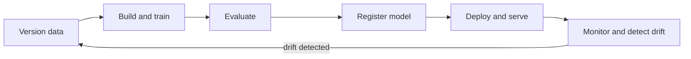
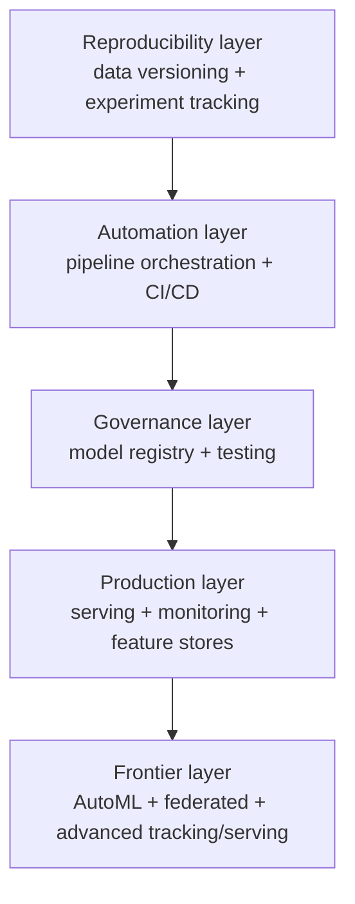

# MLOps: Operating Machine Learning in Production

Training a machine learning model and *running* one reliably for years are two very different activities. A model in a notebook needs only to produce a good score once. A model in production must be reproducible, deployable, fast under load, watched for decay, retrained when the world changes, and rolled back when something goes wrong all while serving real users and respecting real constraints. The gap between "I trained a model" and "this model has been serving customers for two years and we trust it" is where most ML projects fail.

**MLOps (Machine Learning Operations)** is the discipline that closes that gap. It is the set of practices, tools, and culture for building, deploying, and maintaining machine learning systems in production reliably and at scale. It borrows the automation mindset of DevOps (the equivalent discipline for ordinary software) and extends it to handle the things that make ML special: that a system is defined by *code plus data plus a trained model*, and that models silently decay as reality drifts away from their training data.

This guide is the map of the whole `15_MLOps` chapter. It explains what MLOps is, walks through the machine-learning lifecycle in production, shows how every sub-topic fits together, and then teaches three advanced topics that live directly in this folder: **advanced experiment tracking** (`10_advanced_experiment_tracking.ipynb`), **advanced model serving** (`11_model_serving_advanced.ipynb`), and **feature stores** (`12_feature_stores.ipynb`).

## Why ML Needs Its Own Ops Discipline

Traditional software is defined entirely by code. Test the code, ship the code, monitor the app. ML adds two more moving parts:

- **Data.** The same code trained on different data yields a different model. So data must be versioned, validated, and tracked as carefully as code.
- **The model.** The trained model is an artifact in its own right it must be versioned, stored, promoted, served, and retired.

And ML fails differently. A code bug throws an error you can see. A *model* failure is silent: when input distributions shift (**drift**), the model keeps predicting confidently while getting steadily worse, and nothing crashes. MLOps exists to manage these extra artifacts and to surface these silent failures.

A useful one-line definition: **MLOps is everything required to take a model from a notebook to reliable, repeatable, observable production and to keep it healthy thereafter.**

## The ML Lifecycle in Production

Production ML is not a straight line; it is a loop that feeds back on itself. The stages, and the chapter folder that teaches each:

```
        ┌──────────────────────────────────────────────────────┐
        ▼                                                        │
  Data  →  Experiment  →  Build/Train  →  Test  →  Register  →  Serve  →  Monitor
 (version)  (track)       (pipeline)     (validate) (registry)  (deploy)   (drift)
        │                                                                    │
        └──────────────── retrain when monitoring detects drift ◄───────────┘
```

1. **Version the data** (`02_data_versioning`) record exactly which data is in play, with DVC, so any result is reproducible.
2. **Track experiments** (`01_experiment_tracking`) log every run's parameters, metrics, and artifacts with MLflow or W&B, so you never lose track of what you tried.
3. **Orchestrate the pipeline** (`03_pipeline_orchestration`) wire data → preprocess → train → evaluate into a reliable, scheduled DAG with Prefect, Airflow, or ZenML.
4. **Test everything** (`07_testing_in_ml`) validate data, model quality, training code, and serving APIs.
5. **Automate with CI/CD** (`04_ci_cd_for_ml`) run those tests and gates automatically on every change, and retrain on a schedule or on drift.
6. **Register the model** (`05_model_registry`) version it, promote it through Staging to Production, keep lineage, enable rollback.
7. **Serve it** (advanced serving, below) expose it as a fast, scalable, observable service.
8. **Monitor it** (`06_monitoring`) watch data drift, performance, and system health; alert; and trigger retraining closing the loop back to step 1.

The end-to-end ML lifecycle as a self-renewing loop:



Cross-cutting capabilities support the loop: **AutoML** (`08_automl`) automates model search, **federated learning** (`09_federated_learning`) handles cases where data cannot be centralized, and **feature stores** (below) provide consistent, reusable features to both training and serving.

The single most important idea is that **monitoring feeds back to retraining.** A model is never "done." It is deployed, watched, and renewed. This feedback loop is what distinguishes MLOps from a one-off modeling project.

## How the Sub-Topics Fit Together

Think of the chapter as layers building on one another:

- **Reproducibility layer** data versioning + experiment tracking. *Know what you ran and on what data.*
- **Automation layer** pipeline orchestration + CI/CD. *Run it reliably, automatically, with gates.*
- **Governance layer** model registry + testing. *Decide what is good enough and keep it auditable.*
- **Production layer** serving + monitoring + feature stores. *Run it fast, watch it, feed it consistent data.*
- **Frontier layer** AutoML, federated learning, advanced tracking/serving. *Push beyond the basics.*

The capability layers stacking up from reproducibility to the frontier:



No single tool does all of this; MLOps is the art of composing them. The rest of this guide covers the three advanced topics housed directly in this folder.

---

## Advanced Experiment Tracking: The Full Ecosystem

The introductory chapter (`01_experiment_tracking`) taught the two best-known trackers, MLflow and W&B. The reality is a rich ecosystem of tools, each with a different emphasis. `10_advanced_experiment_tracking.ipynb` tours it and, more importantly, teaches the advanced *capabilities* that distinguish production-grade tracking.

### The taxonomy of trackers

The notebook organizes trackers into categories. Knowing the categories helps you choose:

| Category | Representative tools | Distinguishing trait |
|----------|---------------------|----------------------|
| **Standalone metadata stores** | Neptune.ai, Comet ML, Aim | Rich run storage with powerful query APIs |
| **Visualization-first** | TensorBoard | Deep visual diagnostics, local-first |
| **Configuration-first** | Sacred + Omniboard | Treat the experiment's config as the primary object |
| **Full MLOps platforms** | ClearML, DagHub | Tracking plus data versioning, orchestration, serving |
| **Cloud-native** | Vertex AI Experiments, SageMaker Experiments | Auto-track managed cloud training jobs |
| **LLM-specific** | LangSmith, Phoenix/Arize, Helicone, Comet LLM | Track prompts, completions, tokens, latency, cost |

Highlights the notebook draws out for each: **Neptune.ai** offers a query API to filter and compare thousands of runs programmatically and a structured run namespace (e.g. `run['train/loss']`). **TensorBoard** provides plugins beyond simple curves histograms of weights and gradients over time, the **embedding projector** for visualizing high-dimensional representations in 2D/3D, a computation-graph view, and a profiler. **Comet ML** automatically snapshots your code and git state and adds **Comet LLM** for prompt tracking. **Sacred** makes configuration a first-class citizen, capturing the exact config and stdout of every run. **Aim** is fully open-source and local-first with its own query language, **AimQL** (you can see its `.aim` repository created next to the notebook). **ClearML** is a complete platform that *auto-instruments* argparse, logging, matplotlib, scikit-learn, PyTorch, and TensorFlow, and can dispatch tasks to remote **agents** for execution. **DagHub** bundles Git + DVC + MLflow into a "GitHub for ML."

### Advanced tracking capabilities

Beyond which tool to use, the notebook teaches features that matter at scale:

- **Nested runs.** When running hyperparameter optimization, you log a *parent* run for the whole study and a *child* run per trial. This keeps hundreds of trials organized under one umbrella. The notebook demonstrates Optuna trials logged as nested MLflow runs.
- **System metrics.** Capturing GPU/CPU utilization and memory per run, so you can spot inefficient training.
- **Artifact lineage.** Recording the chain code → data → model so any model traces back to its origins (the same lineage idea as the model registry in `05_model_registry`).
- **Distributed tracking.** Logging from many workers (Ray clusters, database-backed stores) into one coherent experiment.
- **Reproducibility stack.** The notebook lays out the four levels needed to truly reproduce a run: **seeds** (seeding `random`, NumPy, and PyTorch, including CUDA determinism), **environment pinning** (`pip freeze`, `conda env export`), **code snapshot** (logging the git commit), and **data + Docker** (a data hash plus a pinned container image). Miss any level and "reproducible" becomes a wish.

### HPO and LLM tracking

The notebook connects tracking to **hyperparameter optimization** frameworks Optuna, W&B Sweeps, Comet Optimizer, Ax, Ray Tune stressing that every trial should be logged so the search landscape is understood, not just the winner. It also covers the emerging **LLM observability** stack: tracking prompts, completions, token counts, latency, and cost. **LangSmith** traces LangChain chains and agents; **Phoenix/Arize** is open-source LLM observability; and **Helicone** is a clever *proxy-based* approach you change only the API base URL, and every call is logged, cached, and rate-limited with no SDK changes. A final pattern worth internalizing is the **adapter pattern**: wrap whichever tracker you use behind a common interface, so your training code is tracker-agnostic and you can swap MLflow for a file-based tracker by changing one line.

---

## Advanced Model Serving

A trained model is useless until something can call it. **Model serving** is exposing a model as a running service that accepts inputs and returns predictions. The intro covered basic serving; `11_model_serving_advanced.ipynb` covers production serving where latency, throughput, scaling, and safe rollouts dominate.

### Why serving is hard

Production serving must meet a **latency SLA** (Service Level Agreement a promised bound, e.g. "99th-percentile response under 100 ms"), sustain high **throughput** (requests per second), handle **cold starts** (the slow first request after a model loads), and keep expensive **GPUs** well-utilized. The notebook frames these with two ideas worth knowing: **Little's Law** (`concurrency = arrival_rate × latency`, relating how many requests are in flight to how fast you serve), and **latency percentiles** you report p50, p95, and especially **p99** (the slowest 1% of requests), because averages hide the tail latencies that frustrate users.

### The serving frameworks

The notebook surveys the major serving tools, each suited to a context:

| Framework | Best for |
|-----------|----------|
| **BentoML** | Python-first, fast packaging and deploy |
| **KServe** | Kubernetes-native, serverless (scale-to-zero) |
| **Seldon Core** | Inference graphs, A/B testing on Kubernetes |
| **TensorFlow Serving** | TensorFlow models |
| **TorchServe** | PyTorch models |
| **Triton Inference Server** (NVIDIA) | Multi-framework, maximum GPU performance |
| **Ray Serve** | Composable Python ML pipelines |
| **MLflow Models** | Quick serving of registry models |
| **SageMaker / Vertex AI** | Fully managed cloud serving |

Recurring concepts across them: **BentoML** wraps a model as a service with a decorator and supports **adaptive batching**; **KServe** separates a **predictor** (the model), a **transformer** (pre/post-processing), and an **explainer**, and offers **canary rollouts** and **scale-to-zero**; **Seldon** builds **inference graphs** (DAGs of routers, combiners, and transformers); **Triton** uses a model repository with **dynamic batching** and **ensemble** pipelines, and is the gold standard for GPU serving; **Ray Serve** composes deployments and autoscales by `min_replicas`/`max_replicas`.

### Key serving techniques

- **Batching.** Grouping requests so the GPU processes many at once amortizes overhead. The notebook distinguishes **static batching** (fixed size, offline), **dynamic batching** (collect requests until a size or timeout is hit), and **continuous batching** (replacing finished sequences mid-flight, essential for LLM token generation).
- **Safe rollout strategies.** Never flip 100% of traffic to a new model blindly. **Canary deployment** routes a small slice (say 5%) to the new version and watches it. **A/B testing** splits traffic to compare versions statistically. **Shadow mode** runs the new model on *every* real request but discards its output, so you compare its behavior to production with zero user risk. **Gradual rollout** ramps traffic 1% → 5% → 20% → 100%. The notebook even shows a champion-challenger decision using a statistical test before promoting.
- **Autoscaling.** Adding/removing replicas (and even **scale-to-zero** for spiky traffic) to match load, including GPU-aware autoscaling.
- **Optimization.** **ONNX** (a portable model format), **quantization** (lower-precision weights for speed), **TensorRT** (NVIDIA's optimizer), and **response caching** (returning cached results for repeated inputs) all cut latency and cost.
- **REST vs gRPC.** REST (JSON over HTTP) is simple and universal; **gRPC** uses binary **Protocol Buffers** over HTTP/2, giving much smaller payloads and lower latency preferred for high-throughput internal microservices, while REST suits public and browser clients.
- **Cloud endpoints.** SageMaker and Vertex AI offer **real-time**, **asynchronous** (large payloads), **serverless** (spiky traffic), and **multi-model** endpoint types, plus managed autoscaling and canary traffic splitting.

### Serving monitoring

Serving closes back into monitoring (`06_monitoring`): the notebook instruments services with **Prometheus** metrics latency histograms (for p99 via `histogram_quantile`), request counters (for QPS and error rate), and GPU-utilization gauges and adds drift detection (PSI) on the live request stream. Watching the served model is as important as building it.

---

## Feature Stores

The same raw data must become *features* the numeric inputs a model actually consumes and those features must be **identical** whether you compute them for training (offline, in bulk) or for a live prediction (online, one request at a time). When they differ, you get **training-serving skew**, one of the most common and insidious causes of production model failure. A **feature store** is the specialized system that solves this. `12_feature_stores.ipynb` covers it in depth.

### Why feature stores exist

The notebook motivates them with four problems that plague teams without one:

- **Feature reuse.** Without a store, every team re-implements the same features (e.g. "average purchase in last 30 days"), wasting effort and inviting inconsistency. A store lets features be defined once and shared.
- **Training-serving skew.** The classic failure: a feature computed one way in the training pipeline and another way in the serving code, so the model sees subtly different inputs in production than it trained on. A store guarantees one definition serves both.
- **Point-in-time correctness.** When building training data, you must use only feature values that were known *at the time of each historical event* using a value from the future is **label leakage** and produces a model that looks great in testing and fails in production.
- **Feature sharing across teams.** A central, documented registry of features that everyone can discover and trust.

### The two halves: offline and online stores

A feature store has two synchronized faces:

| | **Offline store** | **Online store** |
|---|-------------------|------------------|
| Purpose | Build training datasets and run batch scoring | Serve features for live, low-latency predictions |
| Backed by | Data warehouses / files (BigQuery, Parquet, S3) | Fast key-value stores (Redis, Bigtable, DynamoDB) |
| Access pattern | Large historical queries | Single-entity lookups in milliseconds |
| Holds | The full history of every feature | Only the latest value per entity |

**Materialization** is the process of computing features and loading the freshest values from the offline store into the online store so they are ready for fast serving. **Freshness** and **TTL** (time-to-live, after which a cached feature value expires) govern how current the online values stay.

### Core feature-store vocabulary

- **Entity** the "thing" features describe and are looked up by: a user, a product, a transaction. Entities are the primary keys for feature retrieval.
- **Feature view / feature group** a named bundle of related features tied to an entity and a data source (e.g. a `user_stats` view with `avg_purchase`, `num_orders`).
- **Data source** where the raw feature data comes from (a Parquet file, a warehouse table, a stream).
- **Feature registry** the catalog of all defined entities and feature views, enabling discovery and governance.
- **Point-in-time (as-of) join** the join that assembles training data correctly: for each labeled event, it fetches the feature values *as they were at that event's timestamp*, never later. This is the technical heart of avoiding label leakage.

### Feast and the platform landscape

The notebook's hands-on example uses **Feast**, the leading open-source feature store. It walks the full workflow: define an **entity**, a **data source** (a Parquet file), and a **feature view** in code; `apply` them to the **registry**; retrieve historical features with a point-in-time-correct join for training; **materialize** the latest values to the online store; and fetch them for online serving. It then surveys the broader landscape: **Tecton** (enterprise, with streaming and on-demand features and freshness SLAs), **Hopsworks** (open-source, with feature validation and embedding feature groups for vector search), **Vertex AI Feature Store** and **SageMaker Feature Store** (managed cloud), **Databricks Feature Store** (warehouse-native, with automatic feature lookups and lineage in MLflow), **Fennel** (real-time, incremental computation), and custom **Redis-based** online stores.

### Feature engineering and pipeline patterns

The notebook also covers how features are computed and kept fresh:

- **Window aggregations** features over a time window, in three flavors: **tumbling** (fixed, non-overlapping windows), **sliding** (overlapping windows), and **session** (windows defined by activity gaps).
- **On-demand / streaming features** computed at request time or from event streams, versus precomputed batch features.
- **Pipeline patterns** **batch** (periodic recompute), **streaming** (continuous, low-latency updates), and **on-demand** (computed per request), often combined in a **Lambda architecture** that serves both batch and real-time paths.

### Skew detection and governance

Finally, the notebook connects feature stores back to monitoring and governance. **Training-serving skew** is detected with the same statistical tools as drift **PSI** and the **KS test** from `06_monitoring` comparing feature distributions between training and serving. And **feature governance** rounds it out: **lineage** (which model used which feature), **discoverability**, **documentation**, **versioning and deprecation** of features, and **access control**. A feature store is ultimately the data-quality and consistency backbone beneath every model a team runs.

---

## The Takeaway

MLOps is not a single tool or a checklist; it is the engineering discipline that makes machine learning *operable* reproducible, automated, governed, served, and self-renewing. Each folder in this chapter is one capability in that discipline. Master them individually, and then remember the loop that binds them: version your data, track your experiments, orchestrate and test your pipelines, gate and register your models, serve them fast, monitor them relentlessly, and retrain the moment reality drifts. That loop, running continuously and largely automatically, is what turns a clever model into a dependable product.

---

## 13. LLMOps

LLMOps adapts MLOps practices to the unique characteristics of LLM-powered systems. Traditional MLOps tracks model weights and data. LLMOps must also track prompts (changing a prompt changes model behavior as much as retraining), token costs (per-request expenses that scale with usage), and failure modes unique to LLMs (hallucination, refusal, inconsistency).

Key LLMOps practices:
Prompt versioning: treat prompts as code with version control, changelogs, and staged rollouts.
Cost tracking: monitor input/output tokens per request, per user, and per feature. Token costs are the primary operating expense of LLM systems.
Hallucination monitoring: for RAG systems, check faithfulness (is every claim in the answer supported by the retrieved context?). Use an LLM-as-judge for scalable evaluation.
Latency SLAs: measure time-to-first-token and total latency. LLM latency is higher and more variable than traditional model inference.
Model update management: upstream model providers update models without warning. Maintain a regression test suite of fixed prompt/expected-output pairs and run it on every deployment.

Tools: LangFuse (open-source LLM observability), LangSmith (LangChain's tracing and prompt hub), Weave (Weights and Biases LLM tracking), Arize Phoenix.

## 14. Data Contracts

A data contract is a formal, machine-enforceable specification that a data pipeline stage promises to deliver: column names, types, value ranges, statistical properties, and business rules. Contracts make implicit assumptions explicit and catch violations early.

Pandera enforces contracts at the DataFrame level with a declarative schema: define expected column types, value ranges, and custom checks. Apply @pa.check_output to data-producing functions and @pa.check_input to data-consuming functions. When data fails a check, Pandera raises a SchemaError with a clear description of what violated and where.

Pydantic validates individual records with typed models and field validators.

Include data contract tests in CI/CD: run them against sample data on every pull request. A broken contract in stage 1 caught in CI is far cheaper than a silent data corruption discovered at training time.
