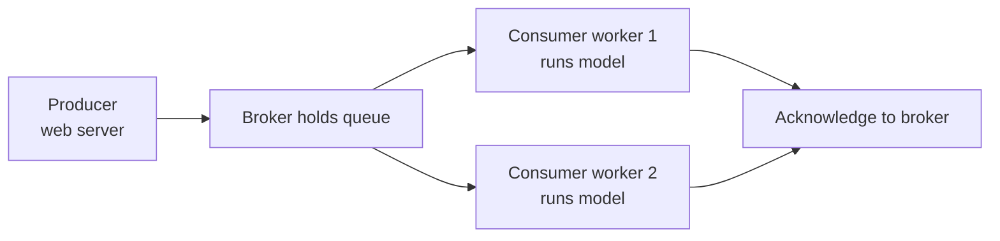

# Message Queues for Machine Learning Systems

When a website asks a model for a prediction, the simplest design is direct: the request goes straight to the model, waits, and gets an answer back. That works until the model is slow, the traffic is bursty, or the prediction needs to fan out to several downstream systems. A **message queue** is the piece of infrastructure that fixes all three problems at once by sitting *between* the part of the system that needs work done and the part that does it. This guide explains, from scratch, what message queues are, the vocabulary around them, and why they show up so often in machine learning systems. It follows the single notebook in this folder, `01_message_queues.ipynb`.

---

## 1. What a Message Queue Is

A **message** is just a small package of data for example, "request #42: classify these four flower measurements." A **queue** is a line, like a line of people at a counter: items go in at one end and come out at the other, generally in order.

A **message queue** is a piece of software that holds messages temporarily while they wait to be processed. One program drops messages into it; another program (possibly later, possibly on a different machine) picks them up and acts on them. The two programs never talk to each other directly they only know about the queue in the middle.

The component that runs and manages the queue is called a **broker** (sometimes "message broker"). The broker reliably stores messages, keeps track of which have been delivered, and routes them to the right consumers. Think of the broker as the post office: senders hand it letters, it holds them safely, and it delivers them to recipients.

The two roles around the broker have standard names:

- **Producer** (or *publisher*): a program that *creates* messages and sends them to the broker. In an ML system, the producer might be the web server that receives a user's prediction request.
- **Consumer** (or *subscriber* / *worker*): a program that *receives* messages from the broker and processes them. In an ML system, the consumer is typically a **worker** that loads the model and runs inference.

The flow is always: **producer → broker (queue) → consumer**.

The producer-broker-consumer flow, where the broker decouples the two sides:

---

## 2. Why Use a Message Queue at All: Asynchronous Decoupling

The single most important idea here is **asynchronous decoupling**. Two words to unpack.

- **Synchronous** means "waiting": the caller sends a request and blocks, doing nothing else, until the answer comes back. **Asynchronous** means "not waiting": the caller hands off the work and immediately moves on, getting the result later.
- **Coupling** describes how tightly two parts of a system depend on each other. **Decoupling** means loosening that dependency so each part can change, fail, or scale independently.

A message queue gives you both. The producer drops a message and instantly returns to the user ("your request is queued, here is a ticket"). The consumer picks the work up whenever it is ready. The producer does not need to know how many consumers exist, how fast they are, or whether they are even running right now. They are *decoupled* and communicate *asynchronously*.

The `01_message_queues.ipynb` notebook opens by listing exactly why this matters for ML, where models can be heavy and traffic uneven:

- **Asynchronous inference**: a slow, GPU-heavy model would make users wait many seconds if called directly. Instead, the request is queued, the user gets an immediate acknowledgment, and the prediction is delivered when ready.
- **Load leveling**: traffic comes in spikes. A queue acts as a buffer (a reservoir): a sudden flood of requests piles up in the queue and the workers drain it steadily at their own pace, instead of being overwhelmed and crashing. The queue smooths a spiky input into a steady workload.
- **Retry logic**: if processing a message fails (a worker crashes, a model errors), the message is not lost it stays in the queue (or is moved aside) and can be retried, giving reliability.
- **Fan-out**: one prediction can be delivered to multiple downstream systems at once a database, a notification service, an analytics pipeline by letting several consumers read the same stream.

---

## 3. Core Vocabulary

Beyond producer, consumer, and broker, a few more terms recur across all message systems.

- **Topic**: a named channel or category of messages. Producers publish to a topic; consumers subscribe to a topic. For example, an `inference-requests` topic carries prediction requests, and an `inference-results` topic carries the answers. Topics keep different kinds of messages separated.
- **Partition**: a topic can be split into several ordered sub-streams called partitions. Each partition is an ordered, append-only log (a list you only add to the end of). Partitions are what allow **parallelism**: with four partitions, four workers can read in parallel, one per partition, multiplying throughput.
- **Offset**: a message's position number within a partition. Because a partition is an ordered log, every message has an index (offset 0, 1, 2, …). Consumers track which offset they have processed so they know where to resume.
- **Consumer group**: a team of consumers that cooperate to share the work of a topic. The broker divides the topic's partitions among the group members so each message is handled by exactly one member of the group this is how you scale out processing. Different groups, however, each get their *own full copy* of the messages, which is how fan-out to multiple independent services works.
- **Acknowledgment (ack)**: a signal a consumer sends back to the broker saying "I have successfully processed this message, you can stop tracking it." Until a message is acked, the broker considers it still in flight and can redeliver it if the consumer dies. Acknowledging *after* processing (not before) is what makes "at-least-once" reliable delivery possible.
- **Replication factor**: how many copies of the data the broker keeps on different machines for fault tolerance. With a replication factor of three, two machines can fail and no messages are lost.
- **Dead-letter queue**: a separate queue where messages that repeatedly fail to process are set aside, so they do not block healthy traffic and can be inspected later. The notebook's worker sends failed messages to an `inference-dead-letter` topic.

---

## 4. Two Messaging Models: Streaming Log vs Task Queue

Message systems broadly come in two flavors, and the notebook's tool table reflects both.

- **Distributed log / streaming** (e.g., **Apache Kafka**, **Redis Streams**, **Google Pub/Sub**): messages are written to an ordered, durable log and *retained* even after being read. Multiple independent consumer groups can replay the same stream, and it is built for very high throughput and event-driven pipelines. Think of it as a permanent ledger of events.
- **Task queue / work distribution** (e.g., **RabbitMQ**, **Celery**, **AWS SQS**): messages represent *jobs to be done*. Once a worker takes a job and finishes it, the job is removed. The focus is distributing units of work fairly across a pool of workers. Think of it as a to-do list that shrinks as work gets done.

| Tool | Type | Best suited for |
|------|------|-----------------|
| Apache Kafka | Distributed log | High-throughput streaming, event sourcing |
| RabbitMQ | AMQP broker | Task queues, work distribution |
| Celery | Task queue (Python) | Async Python tasks on Redis/RabbitMQ |
| Redis Streams | Lightweight streaming | Simple streaming plus caching |
| AWS SQS | Managed queue | Serverless, fully managed |
| Google Pub/Sub | Managed pub/sub | GCP ecosystem |

(AMQP, mentioned for RabbitMQ, is simply the standard protocol Advanced Message Queuing Protocol that defines how clients and brokers talk in that family of tools.)

---

## 5. Apache Kafka: The Distributed-Log Model in Detail

Kafka is the canonical high-throughput streaming system, and the notebook uses it to make the abstract vocabulary concrete. Its architecture diagram shows the full ML flow:

A **producer** publishes prediction requests to the `inference-requests` topic. That topic is split into partitions (partition 0, partition 1, …), each an ordered list of messages. A **consumer group** named `ml-workers` reads the topic, with one worker assigned per partition so they process in parallel. Each worker runs the model and publishes the answer to an `inference-results` topic. A *separate* consumer group of downstream services then reads those results that separation is fan-out in action.

Conceptually, the notebook's code demonstrates the producer and consumer halves:

- **The producer** connects to the Kafka brokers, serializes each message to JSON, and sends prediction requests keyed by a request ID. Settings like `acks='all'` (wait until all replicas have stored the message before considering it sent) and a retry count illustrate the durability guarantees a producer can request. Using a key per message also influences which partition a message lands in, so related messages stay ordered together.
- **The consumer (ML worker)** loads the model **once** at startup, then loops forever reading batches of messages from `inference-requests`. For each message it runs inference and publishes the result to `inference-results`. Two reliability choices stand out: `enable_auto_commit=False` with a manual `commit()` *after* processing means the worker only marks a message done once it truly is (so a crash mid-processing causes a safe redelivery rather than a lost request); and a `try/except` routes any failure to a dead-letter topic instead of crashing the whole worker.

The takeaways are general: load the model once; process then acknowledge (never the reverse); partition to scale; and isolate failures with a dead-letter queue.

---

## 6. Celery: Task Queues for Python ML

Where Kafka is a streaming log, **Celery** is the most popular Python *task queue* a framework for running functions asynchronously in the background. Celery does not store messages itself; it relies on a **broker** (commonly **Redis** or **RabbitMQ**) to hold the queue, and optionally a **result backend** (a place to store the answers, often Redis again) so callers can retrieve results later.

The notebook's example captures the standard ML pattern:

- A task is just a Python function marked with `@app.task`. Calling it with `.delay(...)` does not run it immediately it drops a message on the broker and returns a **task ID** (a ticket) right away. A worker process elsewhere picks the message up and runs the function. This is asynchronous decoupling expressed at the level of plain functions.
- The model is loaded **once per worker process** (the same load-once principle), and a setting like `worker_prefetch_multiplier=1` ensures a GPU-bound worker only grabs one task at a time rather than hogging a backlog.
- **Retries** are built in: on failure, `self.retry(...)` re-queues the task, often with an increasing delay between attempts (backoff), giving the system resilience.
- A typical web integration (shown with FastAPI) has one endpoint that *dispatches* the task and returns the task ID immediately, and a second endpoint that *checks the result* by task ID later a clean asynchronous request/poll pattern that keeps the web server fast even when inference is slow.

Celery also supports scheduled/periodic tasks (via "Celery Beat") and has a monitoring dashboard (Flower), but the core idea to remember is: turn a slow function into a queued background job and get a ticket back.

---

## 7. Redis Streams: Lightweight Streaming

For teams that already run **Redis** (a fast in-memory data store often used for caching), **Redis Streams** offers a lightweight streaming queue without standing up a separate Kafka cluster. The notebook's example shows the same vocabulary in miniature:

- A producer appends messages to a named stream with `xadd`, optionally capping the stream's length (`maxlen`) so old messages are trimmed automatically a built-in buffer with a memory ceiling.
- A consumer joins a **consumer group** (created once with `xgroup_create`) and reads only new, undelivered messages. After processing, it **acknowledges** each message with `xack` so the broker knows it is done.

This reinforces that consumer groups, new-message reads, and explicit acknowledgment are not Kafka-specific they are the universal grammar of reliable message processing, available even in a tool you might already be using for caching.

---

## 8. Where Message Queues Fit in an ML System

Pulling it together, a message queue is the connective tissue that makes a machine learning system robust under real-world load:

- It lets a fast web layer **accept requests instantly** while heavy inference happens out of band (asynchronous inference).
- It **absorbs traffic spikes** so workers are never overwhelmed (load leveling).
- It makes processing **reliable**, retrying failures and quarantining poison messages in dead-letter queues.
- It lets a single prediction **feed many downstream systems** without the producer knowing about any of them (fan-out via independent consumer groups).
- It lets you **scale inference horizontally** by simply adding more workers to a consumer group, because partitions and queues hand each worker its own share of the load.

Whether you reach for a streaming log like Kafka, a task queue like Celery, or a lightweight option like Redis Streams, the mental model is the same: producers, a broker, and consumers, joined asynchronously through a durable queue in the middle.
